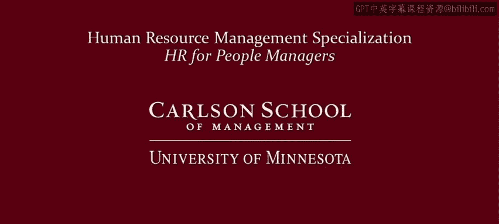

# 人力资源管理：P20：19_视频：工作的商品化 💼

在本节课中，我们将要学习“工作作为一种商品”这一概念。这是关于“员工为何工作——金钱”模块的第三课，也是最后一课。我们将探讨劳动如何被视为商品，这种视角的含义，以及它对管理实践的启示。

## 什么是商品？

首先，我们来看看什么是商品。观察马来西亚这个熙熙攘攘的市场，它充满了商品。比如一部手机、一个苹果，或者我在南非发现的这个用汽水罐制成的酷炫壁虎。商品是商业物品或贸易对象。

随着工业资本主义的兴起，工作也变成了一种商品。劳动被视为商品并非自然现象，它主要是现代的发明。原因在于，在资本主义体系下，一切都可以交易，劳动也不例外。此外，为了获得与工业资本主义相关的专业化和分工的好处，我们需要聚集那些擅长特定任务的工人。

## 劳动作为商品

当劳动成为商品时，敲钉子、开卡车或编写计算机软件都被视为经济价值的来源。它们可以通过在劳动力市场上以一套适当的相对价格进行交换而变得等价。因此，劳动被简单地视为生产函数中的一个通用投入。

你可能在经济学课程中见过这样一个简单的生产函数：**Y = f(L, K)**。其中，产出 **Y** 是劳动 **L** 和资本 **K** 这两个投入的函数。总而言之，劳动被视为一种商品，一种在市场上交易的商品。

## 劳动是一种特殊商品

然而，劳动是一种特殊的商品。它特殊的原因有两个。

首先，劳动具有生产性价值。所有商品都有价值，否则交易就毫无意义。但并非所有商品都具有生产性价值。事实上，马克思主义思想将劳动视为一切价值的源泉，这被称为劳动价值论，但我们无需深入探讨这一点。

其次，劳动的特殊性在于它涉及人。然而，当经济学家、商业领袖和政策制定者将劳动仅仅视为商品时，这一点通常被忽视。相反，它被视为一种通用的生产性投入，用于创造有价值的东西。换句话说，在经济学和商业中，劳动通常并不特殊。在上述生产函数中的 **L** 并不特殊，它仅仅被视为与资本或其他投入类似的生产要素。

从这种视角出发，组织应根据其生产率和价格，通过购买正确数量的劳动来实现优化。从这个角度看，劳动在资产负债表上被视为一项成本，就像其他所有成本一样。

## 给管理者的建议

作为一名管理者，我的建议是不要陷入这种思维陷阱。是的，劳动具有商品的某些元素，但你购买的是存在于人身上的生产能力。

## 劳动商品化引发的问题

将劳动视为商品会引发其他问题。一个主要问题是，劳动随后受供求法则的支配，我们将在下一个视频中详细讨论这一点。

一个较少被探讨的问题是，当劳动成为一种商品时，如何思考实际被买卖的是什么。劳动是被商品化为劳动努力本身，还是被商品化为蕴含在产品和服务中的物化努力？

以下是这两种基本观点的对比。

*   **劳动努力观**：当我们将劳动视为商品，即买卖的是劳动努力本身时，雇主购买、雇员出售的是对努力和时间的控制权。
*   **物化努力观**：当我们将商品视为这种努力的结果，而非努力本身时，我们看到雇主购买、雇员出售的是体现生产性努力的商品和服务，而非生产这些商品和服务所涉及的努力或时间本身。

这种对比很有趣。例如：

*   当劳动被视为商品化的劳动努力时，你会看到计件工资或基于任务的薪酬。
*   在另一种观点下，薪酬更多地基于产出。

这也有助于我们理解工人的不满：

*   当工人认为自己出售的是劳动努力时，冲突会围绕时间和控制权展开。
*   当劳动被视为出售物化努力时，冲突则围绕工资和绩效展开，而非时间和控制权。

如果这听起来有点哲学意味，我们只需注意：本质上，劳动努力观反映了小时工的情况，而物化努力观则反映了受薪员工的情况。小时工出售的实质上是他们的时间，而受薪员工则致力于交付产品、商品和服务，而不仅仅是基于时间。

## 总结与启示

总而言之，劳动确实是一种商品，它至少部分地受供求法则的支配，我们将在下一个视频中进一步讨论。

但我想最后强调，劳动是一种特殊的商品。作为一名管理者，不要忽视这一点。此外，如果你能关注每位员工认为自己在出售什么，你会成为更好的管理者。也许有些员工认为他们在出售对自己时间和努力的控制权，但界限在哪里？也许其他员工认为他们在出售结果。这对他们的工作态度至关重要，也因此决定了如何最好地管理他们。

