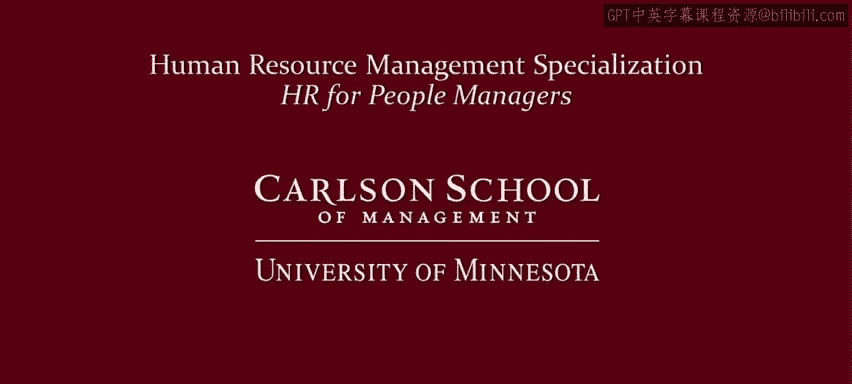

# 人力资源管理：面向人员管理者的人力资源1｜P22：21_劳动力不仅仅是商品 🧑‍💼➡️👥

在本节课中，我们将探讨关于劳动力本质的不同观点。我们将分析主流经济学、批判性理论以及多元主义工业关系学派如何理解雇佣关系中的权力、目标和人性。课程最后将引出下一模块的核心议题。

## 主流经济学观点：市场与竞争 👑

上一节我们介绍了将劳动力视为商品的视角。本节中我们来看看这种视角的核心逻辑。

在主流经济学和新自由主义意识形态中，完全竞争市场占据特殊地位。如果市场是完全竞争的，意味着所有参与者都是平等的。此时，依靠自由市场竞争这只“看不见的手”来优化配置稀缺资源并最大化整体福利，是最佳选择。

以下是该观点的核心逻辑：
*   **市场至上**：市场机制是最高效的资源配置方式。
*   **反对干预**：任何扭曲市场的行为，如工会罢工、集体谈判或政府监管，都被视为有害。
*   **竞争即保护**：员工无需工会或政府保护。因为在竞争性劳动力市场中，试图剥削员工或提供恶劣工作条件的雇主将无法招募或留住员工。**完美的竞争性劳动力市场本身就是对员工的最佳保护**。

这一切都基于一个关键假设：市场参与者是平等的。

## 批判性观点：权力不平等与剥削 ⚖️

上一节我们提出了市场参与者是否真正平等的问题。本节中我们将探讨对此持否定态度的观点。

马克思主义、激进和批判学派提供了最清晰的相反视角。这些观点认为，劳动力和资本拥有截然不同的目标和显著不平等的权力。

以下是该观点的核心主张：
*   **权力不平等**：资本在劳动力市场乃至整个社会（如政治游说、教育影响）中都拥有显著权力优势。
*   **剥削与伤害**：资本利用这种优势剥削工人，并对工人、家庭和社区造成严重伤害。
*   **需要结构性变革**：持这些观点的人认为，要避免这些伤害，必须进行深层次的结构性改革（在某些描绘中，表现为以社会主义取代资本主义）。

## 多元主义工业关系观点：寻求平衡 ⚖️

除了将劳动力视为商品或强调剥削的观点，还有一种学派质疑竞争性市场中劳资双方的平等性，即多元主义工业关系学派。

该学派将雇佣关系视为一个**谈判问题**，并且是**不平等双方之间的谈判**。这种不平衡根植于拥有深厚资源的大公司与缺乏储蓄和安全网的个体工人之间的不平等。因此，劳动力市场被视为**破坏性竞争**，而非完全竞争。

以下是该学派的核心思路：
*   **市场导致失衡**：市场本身会延续不平衡和不平等，而非促成平衡。
*   **需要制度制衡**：需要通过法律和工会等制度性制衡来促进权力平衡。
*   **集体力量**：公司是联合起来的投资者（股东）。因此，劳动力也需要联合起来，汇集资源，才能获得接近平等的平衡力量。

## 不同学派的目标对比 🎯

上述学派的对比引出了另一个重要问题：雇佣关系的目标是什么？

以下是各学派核心目标的对比：

*   **新市场自由主义**：优先考虑**效率**。效率是利润最大化、生产率和其他经济关切的简写。
*   **批判学派**：强调**公平**与**发言权**。
    *   **公平**：指雇佣关系中的公正性，不仅包括经济报酬，也包括非歧视等就业政策的执行和员工安全保障。
    *   **发言权**：指参与工作场所决策、自主权和自由裁量权。
*   **多元主义工业关系学派**：认为雇主和雇员的目标都是合法的，任何一方都不应占据主导。应寻求**平衡**，同时重视效率、公平和发言权。

工业关系和批判观点都强调**人的因素**的重要性。即使不认同最激进的观点，我们也必须认识到：社会需要关注能促进工作场所和家庭中**人类尊严**的工资和工作条件标准。**劳动力不仅仅是商品，作为人类，他们享有相应的人权**。

## 单元主义学派的立场 🦃

你可能会问，之前提到的单元主义学派（强调“新方法”和分享火鸡的学派）在这些关于市场不平等、权力以及劳动力本质的辩论中处于什么位置？

单元主义学派基本上处于这些辩论的**旁观者**位置。它隐含地假设市场不是完全竞争的，因为它强调组织在确定雇佣条款和条件时的自由裁量权。但市场和权力并非该学派的核心。

高承诺人力资源管理的核心问题是：**如何设计双赢的人力资源政策，以互利的方式吸引和激励员工？** 要做到这一点，你需要理解除了金钱之外，什么还能驱动员工。

这正是模块三的主题。

---

**本节课总结**：我们一起学习了关于劳动力本质和雇佣关系的三种主要观点。主流经济学视劳动力为商品，依赖完全竞争市场；批判观点强调资本对劳动力的权力不平等和剥削；多元主义工业关系学派则寻求在承认权力不平衡的基础上，通过制度实现效率、公平和发言权的平衡。这些观点为我们理解人力资源管理背后的不同逻辑奠定了基础。接下来，我们将进入模块三，深入探讨驱动员工的因素。