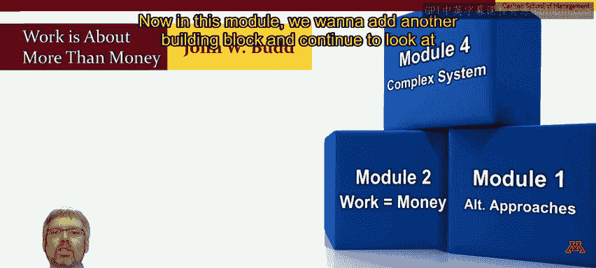

# 人力资源管理：面向人员管理者的人力资源1｜P23：工作不仅仅关乎金钱 💰➡️❤️

在本节课中，我们将要学习员工工作的非金钱动机。上一模块我们探讨了金钱作为工作的核心驱动力，本节中我们将深入理解，对于许多员工而言，工作的意义远不止于薪酬。

## 课程目标与定位 🧱

很高兴在模块3见到你。请记住，本课程的目标是为管理人力资源打下基础。因此，我正尝试像搭建积木一样构建一些基础模块。

在第一模块，我们建立了基础框架。在模块2，我们探讨了员工为何工作，并从金钱因素开始分析。现在，在这个模块中，我想添加另一块基石，继续探究员工工作的动力，但重点将放在**非金钱动机**上。我们将审视“工作不仅仅关乎金钱”这一事实，至少对许多员工而言是如此。在最后一个模块，最终的基石将是把人员管理者视为复杂系统的一部分来审视。

## 超越金钱的工作动机 🔍

上一模块中我再次强调，要激励你的员工，你需要理解他们为何工作以及工作对他们意味着什么。我们通过审视人们工作的最明显原因——他们需要钱——开始了这个讨论。这很重要，因为毕竟人们确实为了钱而工作。

然而，如果就此止步，并假设人们只为钱工作，那将是一个巨大的错误。在上一模块的开头，我简要提到了人们可能工作的其他原因，例如为了自尊或在社会中扮演某种角色。本模块将花更多时间探索人们工作的**非金钱原因**。

## 非金钱动机的证据 🏆

仍然不相信人们工作是为了超越金钱的东西吗？想想彩票中奖者。研究显示，**85%至90%** 的中得数百万美元彩票的人仍然在工作。因此，工作必然不仅仅是关于金钱。

作为一个社会，我们应该感激工作不仅仅是关于金钱。除了提供生存手段，工作还允许我们在原本严酷的自然环境中建立持久性和文化。

## 金钱的持续重要性 ⚖️

当然，我们不要过度简化。是的，我们需要超越金钱作为工作的唯一驱动力，但这并不意味着金钱不重要。对于某些员工来说，它仍然是一种经济激励因素，正如上一模块所描述的那样。对于那些经济导向不那么强的个体，薪酬仍然可能很重要，尤其是当它被解读为个人自我价值或组织对某人重视程度的信号时。

这变得非常复杂，作为一名管理者，你需要保持警觉。

## 管理者的核心任务 👥

总结时，我想回到上一模块的开场视频，在那里我强调员工工作的原因可以是多种多样的。我再说一遍：**员工工作的原因可以是多种多样的**。如果只有一个原因，你或许可以依赖你的人力资源专家来为你解决。但面对如此多不同的原因，作为管理者，你需要弄清楚是什么驱动着你的每一位员工。

为了强调这一点，我将做一件对学者来说可能很难的事：把最后的话留给别人。我总喜欢对人员管理者说：**找出激励你员工的因素。这不是单一的东西，它非常个性化。如果你了解激励你每位团队成员的因素，你将受益匪浅。**

## 总结 📝

本节课中我们一起学习了员工工作的非金钱动机。我们认识到，虽然金钱是重要的基础，但工作对许多人而言还关乎自尊、社会角色、个人价值与文化构建。作为管理者，关键在于理解这种动机的多样性，并个性化地探寻驱动每位团队成员的核心因素。