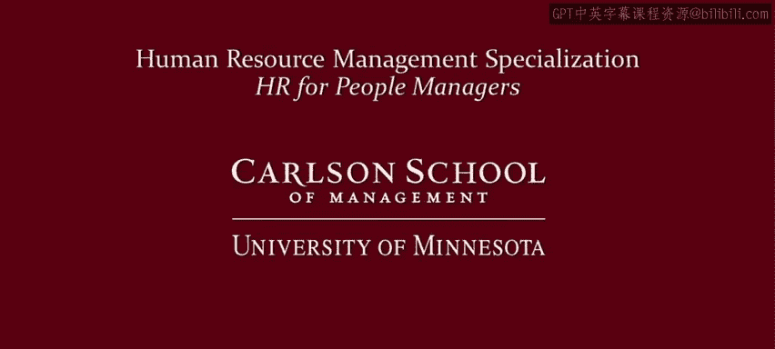

# 明尼苏达大学《人力资源管理：面向人员管理者的人力资源1｜Human Resource Management： HR for People Managers》 - P24：23_视频：从工作中寻求满足感.zh_en - GPT中英字幕课程资源 - BV1QU411m7GF

So what do people look for when they work in the previous module， the emphasis on basic needs。

 money in particular as a source of income， this is the main example of what are known as extrinsic motivators or extrinsic rewards。

 these are rewards that are external to the individual again， classic example， pay for working。

In this video we focus on the main contrast， main foil with extrinsic motivation。

 that is intrinsic motivation， intrinsic motivation results from a desire to achieve rewards that are internal to the individual that is psychological needs。

 psychological rewards， and again want to emphasize that internal in this context means internal to the worker。

 internal to the individual， not internal to the organization or to the team。

I label pursuit of these psychological rewards as fulfillment。

 a lot of people are looking for fulfillment from their work。

 so intrinsic motivation can be a powerful motivator in the workplace。

So to think about how to provide intrinsic motivation to workers we need to think about basic psychological needs There's a lot of different theories about psychological well-being and needs。

 I'm going to use self-determination theory in this video Se-determination theory emphasizes three basic psychological needs as a foundation for psychological well-being there's competence。

 which is a sense of mastery， being able to do something successfully。

 being able to do something well， there's autonomy。

 which is being able to do something using your own judgment， using your own independence。

 using your own discretion， so you can structure task prioritized tasks the way that you think is best and fits with your style。

 and then finally relatedness， which is a sense of social belong and human interaction。

 feeling closeness with others。And so self-determination theory pauses that these three psychological needs are the foundation of intrinsic motivation。

 if you can design tasks that allow for workers to have a sense of mastery。

 a sense of autonomy and discretion and to do in a way that they feel that they're belonging to a social group。

 then this will provide intrinsic motivation which needs they will do it in pursuit of these internal psychological rewards。

 you don't need to provide financial incentives to have somebody pursue tasks that fulfill these internal psychological rewards。

Okay but as a manager， how do you know when employees when employees are successfully pursuing intrinsic motivation。

 when your tasks are designed， when jobs are designed as a foundation for intrinsic rewards well there's a variety of different measures to try to measure this but the most longstanding is job satisfaction simply the extent to which somebody likes their job。

 there's a tremendous amount of research on job satisfaction。

 maybe more research in some strains of  psychologychology on job satisfaction than any other single topic。

 however， it's probably largely seen today as a fairly superficial measure of of fulfillment in the workplace today。

So what's taken its place Well for a while commitment has taken the place of job satisfaction as a key measure of job and work attitudes。

 there's a number of different measures of commitment。

 the most populars organizational commitment which is the extent to which somebody identifies with and feels attached and committed to their employer but even that is a little bit outdated these days and the current measure that everybody talks about today is employee engagement this is seen as an even deeper psychological connection to one's work than satisfaction or commitment so engagement ask questions such as to what extent do employees feel invested in their job how devoted are they to their work are they willing to go above and beyond。

So we can see this progression and emphasis from our employees happy。To how attached are they。

 to how invested are they？However， I want to emphasize that I see this progression more as from the perspective of what organizations are looking for rather than what individuals are necessarily looking for and the dissatisfaction with job satisfaction is a measure isn't necessarily rooted in problems with what employees are looking for but what organizations are looking for in particular you might think that happy employees are more productive and to a certain extent that's true。

 but it's not as strong as managers and organizations would like job satisfaction is a much better predict predictor of whether or not somebody's going to leave the organization it's not as strong of a predictor of job performance so people are looking for stronger measures。

 which is why they looked at commitment and commitment is a slightly stronger predictor of job performance。

 but still probably a better predictor of whether somebodys going to stay or leave the organization and so I think that's why engagement is such a popular measure these days because it's a stronger predictor of job。

T job satisfaction or commitment。So how can managers facilitate fulfillment。

 work in people are complex， of course， so there are many factors。

 but let's simplify things into three categories。First， there's the nature of the work itself。

 the job， for example， as demonstrated here in this video by people paving a road。

 there's also coworkers， you can see the paverrs here working as a team。

 and then there's also the importance of managers so first think about elements of the job itself。

Research comes back to four particular job characteristics as being particularly important for job attitudes。

 skill variety that is can workers use a variety of different skills in their tasks and so variety is better than just routine or the same old。

 same old， mundane task day after day。Second， there's task identity。

 can employees identify with something whole rather than piecemeal。

 do they feel part of delivering something rather than just a minor cognitive machine and they can't really see the end result。

Thirdly is task significance， so this is the degree to which a job contributes to a greater good。

 something beyond the individual at the highest level it might be。

 do they feel like they're contributing towards a social good。

 although it doesn't have to be at that level it could be simply contributing to the well-being of a work team rather than just their own individual goals then last job characteristic that's shown to be important is one that we've already mentioned earlier in this video。

 autonomy to people have freedom independence discretion to be able to structure work tasks the way that they see fit。

So try to design jobs that promote these characteristics now admittedly this can be tough when jobs are tough and need certain things done in a certain way。

 for example， paving a road， but you can still do things to promote task variety significance and even autonomy in terms of letting workers use their expertise and discretion。

So the nature of the job is important， but so too is a feeling of belonging that comes from having coworkers。

 so pay attention to interpersonal relationships in your work groups。

 not only relationships with you as a manager， but the relationships that workers have among themselves and make sure that workers are supportive and trusting of each other and not undermining each other。

 not distrustful， they don't need to be friends but they need to be respectful of each other。

 they need to be supportive， they need to be able to trust each other。And then lastly。

 the importance of managers managers are particularly important in the goal setting process。

 make sure you're providing clear goals that are appropriate， not too easy， not too hard。

 difficult goals are better than easy but not so difficult that it gets frustrating and people don't have the skills to be able to complete them successfully and make sure you're providing rationale for goals that people are pursuing they need to understand why they're doing something so that they can internalize it and really embrace it as a goal of their own。

A well-known HR acronym is to provide smart goals， SMART goals， specific， measurable， attainable。

 relevant and time bound， that is the ability to complete them within a deadline。

 provide some milestones for completion that are reasonable and can keep workers on track。Now。

 during the goal completion， goal pursuit rather than goal setting process。

 it's important to provide feedback， make sure you provide specific， detailed， clear。

 actionable information on someone's job performance and how they can improve。

So putting all of this together， if workers can pursue their work with a sense of mastery using discretion in a context that promotes social belonging。

 then research shows that that will be the foundation for intrinsic motivation will also allow workers to fulfill to。

It'll also allow workers to find job fulfillment in their work。But remember。

 the specific features can be different for different employees。

 psycho psychologists emphasize what they call individual differences。

 people have differing levels of cognitive ability， differing dispositions。

 they have varying personality traits， so you need to understand individual strengths and weaknesses。

 you need to understand individual goals， and what each person is looking for when they come to work every day。

