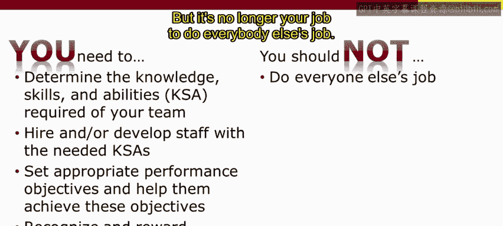
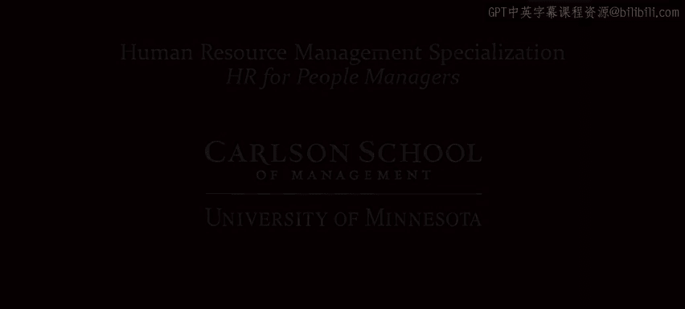

# 人力资源管理：P32：每个人力管理者的目标 🎯

在本节课中，我们将探讨作为一位人员管理者，你的核心目标是什么。我们将回顾人员管理者的价值主张，明确你需要完成的关键任务，并指出在追求这些目标时应避免的常见误区。最后，我们会认识到，管理者并非在真空中工作，必须考虑组织内外的各种约束条件。

## 明确组织目标与团队贡献

上一节我们主要关注了员工，现在让我们将目光转向你——管理者。你的目标是什么？

要思考这个问题，让我们回到人员管理者的价值主张，并首先关注这个等式的第一部分。你需要思考：是什么让你的组织盈利？或者，如果你在私营部门或非营利组织，你的组织试图实现什么目标？它如何服务于利益相关者、公众或特定客户群体？

接下来，你的工作团队需要做什么来实现这些组织目标？请记住，最终是组织中的人——你的团队成员——通过完成必要任务来决定组织能否成功。而你作为管理者，需要制定策略来部署员工，完成那些最终决定组织目标能否实现的任务。

## 管理者三大核心任务

回到人员管理者的价值主张，我们来看图表的右侧。这是任何人员管理者都必须成功完成的三个关键任务，它们将是我们人力资源管理专项课程后续课程的主题。这些是你用来确保工作团队成功的工具。

以下是管理者需要完成的三大核心任务：

1.  **确定并获取所需能力**：你需要确定人力资源专业人士所称的 **KsAs**，即你的团队所需的知识、技能和能力。你需要去招聘具备这些 KsAs 的人，和/或帮助你的员工发展，赋予他们在你的团队中取得成功所需的 KsAs。
2.  **设定并管理绩效目标**：你需要为所有员工设定适当的绩效目标，帮助他们实现这些目标，让他们理解自己达到了哪些目标、在哪些目标上有所欠缺，以及如何改进以达到这些目标。
3.  **认可与奖励优秀表现**：你需要认可并奖励良好的表现。

## 应避免的管理误区

在追求这些目标的同时，也存在一些你不应该做的事情。

以下是管理者应避免的几个常见误区：

*   **不要做所有人的工作**：你可能非常擅长其他人的工作，这正是你被提升到管理职位的原因。但现在，做所有人的工作不再是你的职责。让他们去做自己的工作。
*   **不要微观管理**：不要假设你总是知道得最清楚。你可能有很多好主意，可以与团队分享，但不要越界成为微观管理者。让其他员工发展，并最终在那些基础任务上变得和你一样出色。
*   **不要忽视管理职责**：你可能会觉得管理工作的某些部分很有压力，甚至想忽略它们。但这对任何管理者来说都是一个错误。你可能很喜欢做你擅长的市场、IT 或工程任务，正是这些让你获得了今天的职位。但你现在是一名管理者，不要忽视管理工作的部分。
*   **不要独占功劳**：你正在努力打造一个强大、有凝聚力的团队。将功劳分享出去，并确保人们做了值得赞扬的事情。如果你环顾团队，发现没有人值得赞扬，那么请审视自己，找出问题所在，而你的职责就是帮助解决它。
*   **保持谦逊、礼貌与正直**：在做所有这些事情时，不要忽视谦逊、礼貌和正直的重要性。

## 在约束条件下工作

请记住，当你执行所有这些目标时，你并非处于真空中。外界存在许多因素。

以下是你在工作中需要考虑的约束条件：

*   **组织规范与文化**
*   **员工可能工会化**（这是你需要应对的环境的一部分）
*   **法律法规**
*   **组织外部的其他因素**

你拥有所有这些重要的目标，但在追求它们时，不要假装你处于真空中，不要假设你处于真空中。在这个环境中存在许多其他因素，你是一个复杂系统的一部分，面临诸多约束。我们将在本模块的剩余部分重点讨论这些约束条件。

---

本节课中，我们一起学习了作为人员管理者的核心目标。我们明确了你的工作始于理解组织目标并规划团队贡献，然后必须成功执行三大核心任务：**确定团队所需能力（KsAs）、管理绩效以及认可奖励**。同时，我们指出了应避免的误区，如微观管理和忽视管理职责。最后，我们认识到管理者的工作是在复杂的组织内外部约束下进行的，包括**组织文化、工会和法律**等。理解这些目标与约束，是成为高效人员管理者的第一步。