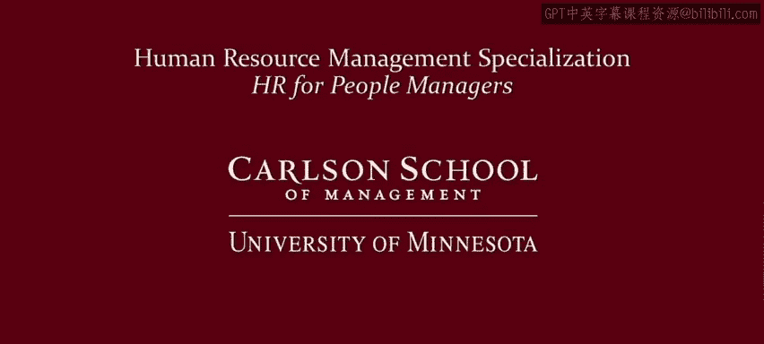

# 明尼苏达大学《人力资源管理：面向人员管理者的人力资源1｜Human Resource Management： HR for People Managers》 - P33：32_视频：你不能总是为所欲为.zh_en - GPT中英字幕课程资源 - BV1QU411m7GF

In the last video， I reminded you of your goals as a manager。

 but you don't pursue these goals in a vacuum， you're part of this swirling vortex of lots of constraints and influences like norms and culture。

 laws， maybe even labor unions， and so in this video we're going to look at some of these major influences as a reminder of the things you need to contend with as a manager。

Now first， let's start within the walls of the organization。First， organizational strategy。

What is the organization's mission， How do you and your work group contribute to it。

 Your practices as a manager need to serve the organization's strategy and certainly not run counter to it。

Now organizations also have culture and norms， they have a set of shared understanding of values。

So for example， at Southwest Airlines， there's a culture of friendly employees。

 REI has a culture of environmental stewardship， Google has a culture of openness， creativity。

 questioning others， these create norms that shape acceptable and unacceptable behaviors。

 it's unacceptable to be grumpy at Southwest Airlines， wasteful at REI。

 hierarchical and authoritarian at Google you as a manager need to be aware of these organizational values when managing others。

But don't always see this as a constraint， norms can facilitate behavior as well。

 so if there's positive organizational norms， make the most of them。

 if there's negative organizational norms at your organization that interfere with what you want your employees to be doing。

 try to change them， try to use norms as part of your toolkit of managerial practices to shape good employee behavior and employee performance。

Now putting organizational strategy， culture and norms together also yields budgetary constraints。

 perhaps in your organization， what is your organization's willingness or ability to pay in a nonprofit or government agency might not be the resources to pay for high salaries or pay for training and development a company might believe that they have razor thin profit margins they might not choose to invest in high salaries or spend money on employee training and development。

 so this can also provide a set of constraints that you face as a manager。

If your employees are represented by a labor union。

 this can provide another set of limits or constraints on what you can do as a manager in some countries there might be works councils which could have similar implications for you as a manager but remember you can create good relationships with a union as well and so you can try to use unions to facilitate not just constrained behavior we'll talk more about managing in a unionized environment in the next video。

But as a manager， you don't live solely within the walls of the organization。

 your corporation or your organization is part of a broader society， it's part of a local community。

 it's part of a global community。And so what happens inside the walls of an organization is important。

 but you cannot ignore what's going on beyond the walls of the organization the most concrete example of this is the law。

 clearly as a manager you need to obey laws and regulations。

 this will be the focus of lesson number two in this module。

But there's other external pressures besides just the law。There is political pressure。

 there's social norms， there's things called soft law， what is soft law。

 there's a guidelines and codes of conduct passed by government agencies， maybe the United Nations。

 the European Union， maybe even a local city council that aren't legally binding but there might be pressures in the global community or your local community to try to adhere to those codes of conduct or to those guidelines outside the political arena organizations and managers have to contend with social norms for example。

 in some countries there's a movement right now to ban the box this seeks to pressure companies to remove a box from their job application which ask whether an applicant has a criminal record or not some companies such as the retail company target have changed their practice in response to this campaign without a legal requirement to do so but beware not all social norms involved campaigns in fact most probably don't so be aware of what's acceptable and unacceptable in your specific culture and。

ality。If as a manager， you try to push the boundaries of these constraints too far， for example。

 by violating organizational norms， it could be a bumpy road just as the sign here indicates。

 and so what can a manager do well again， just like there's warning signs for drivers。

 there's warning signs for managers you should be looking for poor performance and attitudes now this might not be a sign that you're violating organizational norms or other types of things。

 there can be other reasons for poor performance or poor attitudes like workers not having the right skills but。

When faced with these things， look in the mirror and see if there's things that you can be doing to improve。

You can also look for whether people are excessively late， excessively absent。

 looking to leave early a lot of the times， or taking that to a higher level。

 with people quitting at an excessive rate， is it hard to retain your work group。

 is it hard to recruit new people into your work group？

You can also do engagement surveys your human resources professional can help you with this。

 lots of companies do engagement surveys or pulse surveys。

 your organization might have one already and you can use this to create benchmark scores you can look at the engagement score of your work group compared to the engagement score of other workgroup in the organization you can also create a benchmark score that you can track over time if over time your engagement score is trending downwards that's obviously a bad sign and you can look to try to diagnose what's going on maybe part of that is you're violating social norms violating organizational culture so again your human resources professional can help you create some metrics which you can use to make you a better manager and watch for warning signs of violating organizational norms。

 social norms and other constraints that you face as a manager watching for these warning signs is important because remember people love their organization and oftentimes stay longer because they have a great manager。

But if they have a bad manager， they will leave in spite of liking the organization So as the Rolling Stone saying。

 you can't always get what you want， but if you try sometimes you just mind find you get what you need again you're in this vortex of lots of influences however。

 you can be a good manager you can get what you need done without violating organizational norms without violating organizational culture。

We'll talk more about managing in a unionized environment in the next video。

 and then in the next lesson， we'll talk more about employment and labor laws that you need to be aware of。

