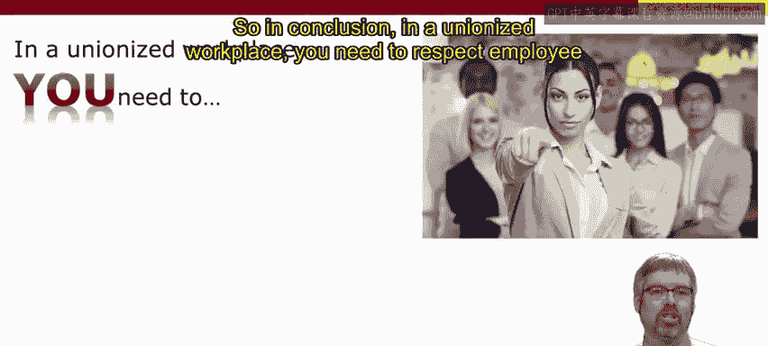
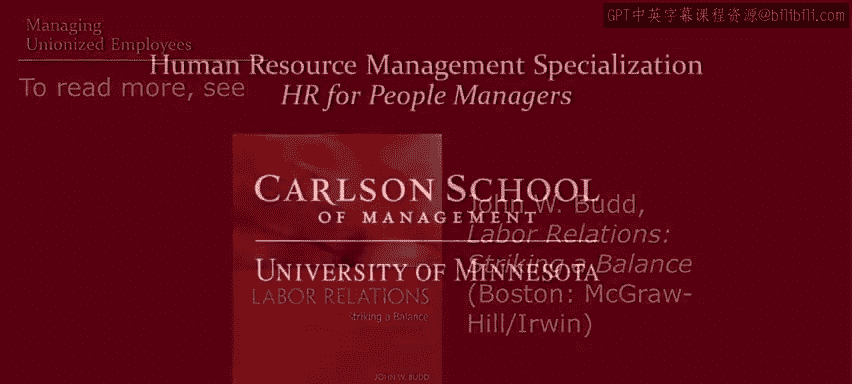

# 人力资源管理：面向人员管理者：P34：管理工会员工 👥

在本节课中，我们将要学习在工会化环境中进行管理的核心原则。上一节我们介绍了管理者可能面临的复杂性与约束，本节中我们来看看一个具体的复杂情境：管理由工会代表的员工。

工会的名称和具体职能因国家而异，因此在处理工会事务时，务必了解您所在国家的法律和惯例。尽管存在多样性，但管理工会员工时只需记住两个核心词：**双边**与**主动**。

## 核心原则一：双边性 🤝

当存在工会时，通常会有一份**集体谈判协议**，它涵盖了工资、工时、工作安排、休假、裁员、纪律处分、工作规则、管理权等诸多方面。如果您的员工受此类协议约束，您必须遵守它。

如果协议被违反或被认为违反，通常会有一个**申诉程序**来处理这些冲突。关键在于，这个过程是**双边**的。您不能单方面强加解决方案，必须与工会方共同处理冲突。

以下是典型的申诉程序步骤：
*   与员工会面。
*   与工会干事会面。
*   与工会代表会面。
*   在少数情况下，可能最终进入仲裁。

主要教训是：冲突解决必须通过**双边**合作进行。

同样，如果您希望制定新政策或做出改变，在工会化环境中也不能单方面实施。您需要就这些变更进行谈判。如果面对的是**工作委员会**，您可能至少需要在实施前与其进行协商。

因此，当员工由工会或工作委员会代表时，管理者必须告别单边管理，转向**双边**模式。

## 核心原则二：主动性 🚀

然而，双边关系有多种类型，包括合作关系、竞争关系、对抗关系，甚至敌对关系。这就引出了第二个核心词：**主动性**。

工会和工作委员会有权代表并维护工人权益，但它们不运营业务。运营业务、设定基调的是**管理者**。因此，管理者需要**主动**作为。

例如，工会常与限制性工作规则相关联，但这些规则通常是对管理方滥用权力的反应。工作委员会同样可能对管理方设定的基调做出反应。

在劳资关系领域有两个常见短语，有助于理解为何管理者需要保持主动：

**第一个短语是：“管理方行动，工会申诉。”**
作为管理者，您负责安排员工工作、分配任务、审批休假、设定工作节奏等。如果工会认为您的行为违反合同或政策，他们可以提出异议。但**管理**是您的首要职责。

**第二个短语是：“公司得到其应得的工会。”**
同样，作为管理者，您设定了关系的基调。如果您采取对抗和激进的态度，工会很可能以对抗和抵制作为回应。反之，如果您采取协作和尊重的态度，工会也很可能以协作和尊重作为回应。

## 总结 📝

本节课中我们一起学习了在工会化工作场所进行管理的关键要点。

总结如下：
*   必须尊重员工的发言权以及与工会关系的**双边**性（或在有工作委员会的工作场所，尊重与该委员会关系的双边性）。
*   这包括遵守适用于您员工的任何**集体谈判协议**或合同，并遵循必要的谈判或协商程序。
*   同时，必须保持**主动性**，因为您为整个关系设定了基调。关系是对抗性的还是协作性的，由您决定。