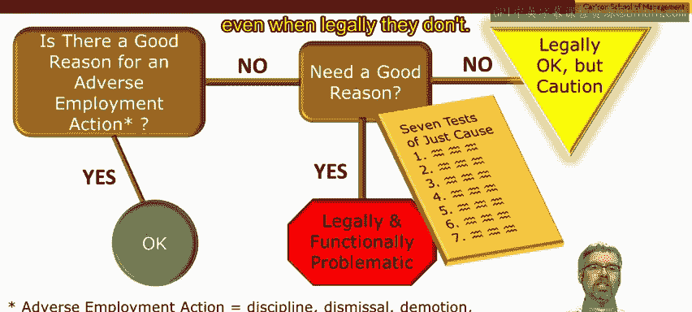
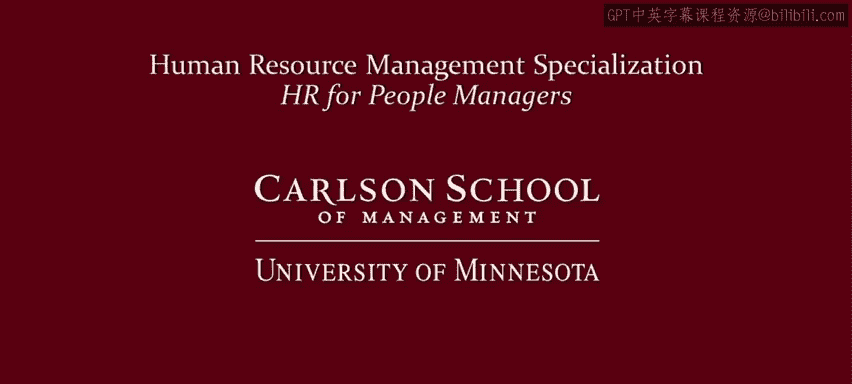

# 明尼苏达大学《人力资源管理：面向人员管理者的人力资源1｜Human Resource Management： HR for People Managers》 - P38：37_视频：因正当理由纪律处分和解雇员工.zh_en - GPT中英字幕课程资源 - BV1QU411m7GF

Let's start with the context for this video In the previous two videos。

 I introduced the concept of employment at will and argued why it's an important starting point for thinking about the legal implications of managing employees In the next video and in the next lesson。

 we're going to look at specific laws that place boundaries around the employment will doctrine provide specific legal limitations as to what managers and organizations can't do when managing employees let's try to make some room here。

To squeeze in the current video in this current video。

 I'm going to address the implications of employment at will for disciplining and dismissing employees Now。

 ultimately， if you're managing in an at will workplace。

 if you're under the employment at will doctrine with very few restrictions。

 that means you can probably do whatever you want within reason， but to a large extent。

 discipline and dismiss employees at will， however， later on in this video。

 I'm going to argue that even if that is the case legally。

 it's probably better for you as a manager to act as if your employees actually do have what's known as just cause protections。

 even if legally， they don't。Okay， so every instructor's favorite opening line。

 let's start with a z through the inV quiz， we're going to do an employment at will quiz。However。

 I're going to spend a lot of time in this video going over the answers。

 so what I recommend is that you get out a pencil and paper。

Number it from one through six and keep track of your answers to the inV quiz and that way you'll have your answers handy when we look at the answers in the remainder of this video。

Welcome back from the quiz Okay， let's go over the answers。 Que number one。

 a company fires an employee because of unsatisfactory job performance or question two。

 no longer enough work， Is this dismissal legal or illegal。Well， first we have to ask。

 is there a good reason for an adverse action， the answer in both question one and2 is yes。

 unsatisfactory job performance or legitimate business need。

 like not having enough work for an employee are both good reasons。

 regardless of whether you're in the United States or elsewhere。

 so this would be a legal termination in both one and 2， regardless of what country you're in。

How about question number three， a company fires an employee in order to hire another person to do the same job at a lower wage Is this a good reason for an adverse action。

 most legal regimes would say no， this is not a good reason job performance is good。

 there's still enough work for this employee to do so we have to ask a second question which is do you need a good reason。

And so this depends on what country you're located in in the US。

 you typically don't need a good reason。 Montana has a law where you do， so that's an exception。

 but otherwise in most of the United States， it would be illegal。

 it would be legal to fire the worker for this reason because you don't need a good reason。 however。

 the United States is pretty unique in this way。 many other industrialized countries have much stronger justca protections and so in those countries。

 you do need a good reason for disciplining or discharging somebody and so this scenario would be illegal in many other industrialized countries。

The analysis for question four is exactly the same。

The analysis for question five is also exactly the same。How about question6。

 an employee discovers the company has been violating the law and that employee is fired for his or her refusal to go along with this company's illegal billing scheme。

 so is there a good reason to terminate this employee clearly not， do you need a good reason？Well。

 in the rest of the world you do need a good reason so this would be illegal How about the United States Well if you go back to last week's video。

 remember there are some common law exceptions to the employment at will doctrine。

 public policy exception was one of them， and this is an example of exactly that scenario so this would be illegal in the United States as well as many other countries。

Okay， so to underscore this， the United States is really unique among industrialized countries in the extent of the employment at will doctrine and the lack of just cause discharge protections。

 except for the case of Montana， which has an unjust dismissal law。

Here's a chart that I put together to try to underscore this further， you can see in Canada。

 Great Britain， Germany， nearly 100% of employees are estimated to be covered by unjust dismissal protections。

 whereas the United States is significantly lower。Now， the nature of these protections might vary。

In Canada， you need to provide notice in France， you can terminate somebody but make a payment to that person。

 whereas in some other countries， Germany， for example。

 you might have to reinstate an employee who was unjustly or unfairly terminated。

Now but why isn't the United States zero， I've already argued that the United States has very weak just cause protections。

 however， very small fraction in Montana， a larger fraction are covered by union contracts that have unjust dismissal protections and there are also some civil service protections in some states that have unjust dismissal protections so overall probably about 30 to 35% of US employees are probably covered by unjust dismissal protections。

 so you might have to manage as if your employees are covered by unjust dismissal protections depending what sector you're managing in。

 but even in the absence of unjust dismissal protections I think you should think seriously about whether you would choose to manage in this way anyways there's a tension here。

The legal system says that many US managers don't need good reasons for adverse employment actions。

 however。Employees don't understand the law， employees think that good reasons are needed for adverse employee actions。

 and so you might want to manage as if you did need good reasons。

 did need just cause to discipline or discharge workers。

 even though legally in most sectors in the United States， you don't need to。

So what to do if you're a manager who wants to manage as if employees have just caused dismissal protections？

Well， if you're in a country that has an unfair dismissal law。

 you should look at the government agency that manages and oversees that part of the law。

 for example， the Fair Work Commission in Australia there's lots of information there about what's an unfair dismissal but what to do in the United States without this tradition without this legal requirement well。

 we can look to the unionized sector as a role model。

 the Unionized sector has been dealing with just cause。

 discipline and discharge for decades and they've developed a number of very sound tests and principles for thinking about when just cause has been met or has not been met there's a variety of ways to do this my favorite is the seven tests of Just cause that was laid out by an arbitrator in 1966。

The first two of these tests focused on the nature of the termination and was it related to job performance？

The next three relate to having a fair and objective managerial investigation that reveals proof。

 not just supposition or speculation of guilt， and the last two tried to ensure that the discipline or discharge was non-discriminatory and that the punishment fit the crime。

And I submit to you that these are good practices for any manager。

 even those of you managing in an at will environment。So to conclude。

 let's draw a distinction between the legal framework for employee discipline and discharge and sound managerial practice Now we can start by asking is there a good reason for an adverse employment action if the answer to that is yes。

 then this is a legal action as well as a sound managerial action however。

 suppose there is not a good reason for an adverse employment action the next question to ask is do you need a good reason if the answer is yes。

 as is the case in the US Uned sector or in many other countries then not only is this illegal but this is problematic as a managerial action as well how about in much of the United States or you don't need a good reason and it's legal to take an adverse employee employment action even in the absence of a good reason Well this might be legal。

But I would strongly recommend that you proceed with caution。

 I think you'll be a better manager if you pay attention to just cause and if you manage employees as if they have just cause protections。

 even when legally， they don't。 Thank you。

