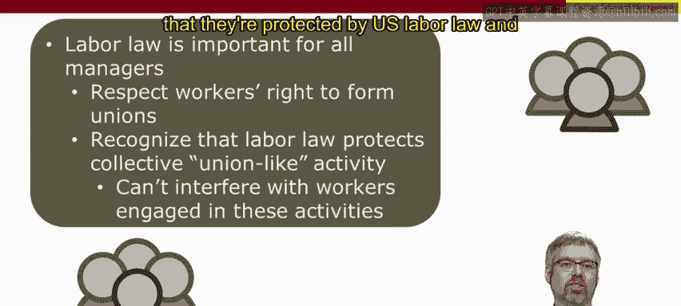

# 人力资源管理：P41：美国劳工法概述 🏛️

在本节课中，我们将要学习美国劳工法的核心概念、历史背景及其对所有管理者的实际意义。无论您所在的组织是否有工会，理解这些法律原则都至关重要。

## 劳工法的核心定义与范围

上一节我们介绍了课程背景，本节中我们来看看美国劳工法的基本定义。美国劳工法处理的是**员工作为群体的权利**。

首先，需要澄清一个重要误解：美国劳工法并非仅仅是关于工会的法律，并非只有工会环境下的管理者才需关注。相反，美国劳工法广泛涵盖了工会及**类工会活动**的法律。只要员工联合起来试图影响工作条件，即被视为类工会活动，并受美国劳工法保护，**即使在非工会环境中也是如此**。

例如，作为一名管理者，您阻止员工相互讨论薪酬是违法的。原因在于，这是员工联合起来试图影响其工作条件的行为，属于类工会活动，受美国劳工法保护。因此，**所有非工会环境下的管理者也必须关注这些法律**。

## 劳工法的历史背景与目标

了解了劳工法的现代定义后，我们追溯其历史根源。美国劳工法的诞生可追溯至19世纪末的劳工冲突时期。

这张图片描绘了19世纪70年代末的一次铁路罢工，可见造成的巨大破坏。由于铁路对州际贸易至关重要，当时立法尝试为该行业带来劳工和平。

时间推进几十年，到了大萧条时期的1930年代。这是另一个充满重大劳工冲突的时期，劳工法再次成为焦点，并且这一次真正颁布了全国性的劳工立法。实现**劳工和平**是这场劳工立法运动的一个关键目标。

当时通过劳工法还有另一个原因，即试图改善工人的处境。大萧条时期贫困普遍，工人难以养家糊口。这张图片展示了大萧条时期的排队领取救济食物的队伍。因此，劳工法的另一个目标是通过集体行动**提高劳工的购买力**。这不仅被视为有利于工人更好地养家糊口，也被认为可能有利于整体经济，因为它可以提振劳工的购买力。

## 劳工法保护的具体内容与原则

基于其历史目标，现代美国劳工法保护员工联合起来以增强其议价能力并在工作场所行使发言权的行为。同样，这并不意味着他们必须试图组建工会，也不特指集体谈判本身，而是涵盖任何类型的、员工联合起来试图在工作场所行使发言权、影响其雇佣条款和条件的活动。**这同样适用于非工会环境**。

在追求劳工和平的背景下，劳工法的另一个关键方面是提供有序的程序，以便工会和工人无需诉诸罢工、纠察及其他类型的破坏性活动。劳工法规定了确定工会何时代表该工作场所多数工人的有序程序。

最后，当工会被认证为代表多数工人时，管理者有义务与这些工会**真诚地进行谈判**。

## 非工会管理者的关键要点与场景分析

那么，对于非工会管理者，一个关键要点是什么？您不能解雇或以其他方式惩罚联合起来试图组建工会的员工。但同样，这不仅限于明确涉及工会化的情况。任何时候员工联合起来集体影响其工资、工时、雇佣条款和条件，这都属于美国劳工法所涵盖的类工会活动。

因此，在一个非工会工作场所，假设您面临以下场景。

以下是几个具体场景分析，帮助理解法律应用：

**场景一：抵制新绩效薪酬计划**
假设您想实施一个新的绩效薪酬计划。5名员工共同决定在该计划撤销前拒绝工作。您能解雇这些员工吗？**不能**。这是员工联合起来试图影响其雇佣条款和条件的例子。在他们不工作期间，您不必支付工资，但您不能解雇他们。这受劳工法保护。

**场景二：面试中的歧视**
考虑另一个场景，同样在非工会工作场所。您正在面试一个网页设计师职位的申请人。您注意到一位非常合格的申请人带着工会日程本和工会笔来参加面试。基于此，您不希望组织中有任何“麻烦制造者”。您能拒绝雇佣这名工人吗？**不能**。您不能基于对工会的支持而歧视个人。同样，即使在非工会环境中也是如此。

**场景三：员工代表委员会**
考虑第三个也是最后一个场景，同样在非工会情况下。您想更换公司的医疗保险提供商，但希望在做出改变前征求员工意见。因此，您挑选了一个员工委员会，代表其他员工讨论新的医疗保险选项。这在美国劳工法下会遇到问题吗？**会**。这样做违法吗？**不违法，但构成不当劳动行为**。

这可能看起来奇怪，您只是想与员工交谈，获取他们对影响自身事务的看法。然而，当您要求员工代表彼此发言，而不仅仅是作为个人发言时，这就变得类似于工会。管理者干涉这种非常简单或基本的类工会形式也是非法的。同样，这里没有正式的工会参与，但仍受美国劳工法管辖。

## 私营部门与公共部门劳工法的区别

接下来，我们需要快速强调私营部门组织与公共部门（包括地方、县、州或联邦政府雇员）所适用的劳工法之间存在区别。

我们主要讨论的、尤其是源于大萧条的劳工法，覆盖全国范围内的**私营部门雇员**。因此，对私营部门工人的保护在全国范围内是统一确立的。

这对于政府雇员则非常不同。法律因州而异。事实上，有些州甚至没有法律覆盖该州地方、县和州政府雇员的工会化。因此，在私营部门，当工会代表多数员工时，所有公司都有义务与之谈判；而在公共部门，情况可能大不相同。有些公共部门的工人缺乏这种保护，存在一些机构或地方政府不必与工会谈判。这完全取决于您所在的州是否有谈判法律以及该法律的全面性。

然而，这并不意味着那些公共部门的工人缺乏保护，也不意味着您可以歧视那些工人。因为作为一个政府机构，阻止工人相互交谈将违反宪法。您不必与他们谈判，但不能歧视他们。

另一个快速的区别，也是私营部门与公共部门劳工法的最后一个区别：在私营部门，**罢工权相对广泛**（并非无限，但相当广泛）；而在公共部门，这同样很大程度上取决于您所在州的立法性质以及工人是否被覆盖。许多工人，特别是警察或消防等基本服务行业的工人，即使在一个赋予这些雇员谈判权的州，他们也没有罢工权。

## 总结与对所有管理者的启示

本节课中我们一起学习了美国劳工法的核心内容。总而言之，劳工法对所有管理者都重要，不仅仅是工会化环境中的管理者，也不仅仅是私营部门的管理者，而是**所有管理者**——私营部门、公共部门、工会、非工会。

所有管理者都需要尊重工人组建工会的权利。对于非工会管理者而言，或许更重要的是，您需要认识到劳工法保护我所说的**类工会活动**。因此，如果员工想相互讨论薪酬，您不能歧视他们，不能制止这种对话，不能对他们采取任何报复措施，否则即违反劳工法。所有管理者都需要认识到这些类型的集体活动受美国劳工法保护，并且不应干涉从事这些活动的员工。