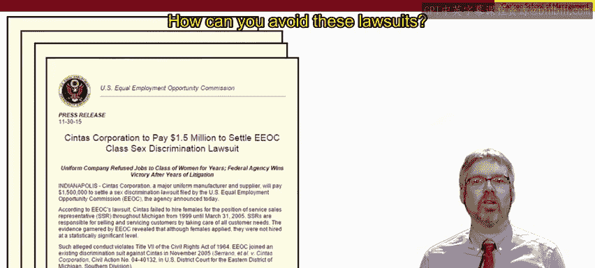

# 明尼苏达大学《人力资源管理：面向人员管理者的人力资源1｜Human Resource Management： HR for People Managers》 - P43：42_视频：关注法律，但不要被法律束缚.zh_en - GPT中英字幕课程资源 - BV1QU411m7GF

Okay， let's return to our bulletin board of USEmploy Law posters and for those of you in other countries。

 just use this as a reminder of laws that are important in your community and locality。So yes。

 these are the law， you need to be aware of them。You need to take them seriously。 They are important。

 After all， we've spent two whole lessons on the importance of the law。

 but the lesson of this video is not to be overly defensive， not to be paralyzed。

 not to do everything in a defensive way where you are simply trying to avoid legal action。

 And so let's look at a few examples。First， you know organizations and managers are well aware of the headlines of large damage awards in wrongful termination and discrimination lawsuits。

 how can you avoid these lawsuits Well， we can go back to for example。

 the seven tests of just cause that I presented in an earlier video。

Now I'm not going to run through all of the seven tests。

 you can refresh your memory if you need to by looking at that earlier video really the reason for raising them here is to think about the different types of attitudes that you can adopt towards these seven tests One attitude you could adopt。

 we'll call it attitude D is stupid bureaucracy I have to go through these motions just to make things look good。

Alternatively， you can adopt what we're going to call Atitude P and take these as good reminders of sound managerial practice Now At D stands for Def Atitude P stands for Pro and professionalf and of course the lesson here is that you should choose Atitude P。

In this way， these seven tests can be useful for preventing lawsuits。

 but don't let the lack of legal action be the driver， let that be the added bonus。

 being a proactive high quality manager that should be the driver。Okay。

 let's look at a different example， job interview。Now。

 equal employment opportunity means that you cannot ask certain job interview questions。

 You can't ask people you're interviewing whether they're married， if they have children。

 don't ask them how old they are， don't ask them if they have any disabilities。 So again。

 be aware of the law， don't get in trouble， but don't be paralyzed。

 this doesn't mean that you can't get the legitimate information that you need。

So how to do this focus on genuine job tasks as travel are working on weekends required are there legitimate physical demands that people need to be successful in this job If so。

 then you can ask all applicants whether they can meet the specified work schedules。

 including travel or working weekends you can ask them if they're able to carry out the necessary job assignments and perform them safely。

 notice how the questions in the green boxes are worded very differently from the questions in the RE So again。

 choose a proactive and professional attitude in which the law helps you remember good practices。

Okay， as a third and final example first I'm going to target this towards HR managers。

 if you're an HR manager， do you see yourself as the HR police do you see the focus of your job being to ensure compliance with policies and regulations or do you see yourself more as an HR partner where yes part of your job is to support managers to apply policies and regulations consistently and fairly but that shouldn't be seen as the largest part of your job。

 rather the focus of your job as an HR partner is to support managers employees in getting their work done successfully okay so which is it HR police or HR partner HR police again being a very defensive strategy focused on the law and the lesson of this video is don't be the HR police。

Rather， HR managers should be an HR partner and for line managers。

 don't let your HR person be the HR police， demand that your HR support people be HR partners so to conclude。

Laws are important， that's why we've spent two whole lessons on them。

 but don't manage offensively where everything you're doing is to primarily done to avoid legal action always be consistent and non-discriminatory。

 always focus on legitimate job needs and performance issues yes， that's what the law demands。

 but don't do it simply because that's what the law demands。

 do that because that's what makes you a good manager and lastly， if you're an HR professional。

 don't be the HR police if you're a manager don't let your HR person be the HR police demand that they are an HR partner。

So again， pay attention to the law， but don't be paralyzed by。

