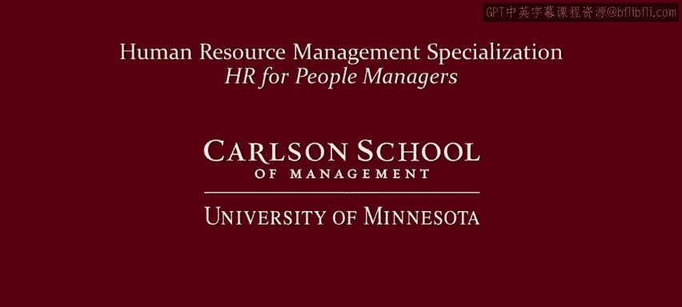

# 明尼苏达大学《人力资源管理：面向人员管理者的人力资源1｜Human Resource Management： HR for People Managers》 - P44：43_课程回顾：将所有内容整合在一起.zh_en - GPT中英字幕课程资源 - BV1QU411m7GF

Congratulations on making it to the last lesson of the last module of this course。

 let's reflect on where we've been in this course。Now remember。

 the People Manager Value proposition provides a guide to the key HR related tasks of effective people managers and HR professionals。

 and this provides a roadmap to the entire HR specialization。In the upcoming courses。

 you're going to look at how to attract and retain employees， how to manage their performance。

 and how to motivate and reward them。So in this course。

 my goal has been to lay a foundation for those follow up courses by looking at this part of the value proposition。

Managers need to be able to translate organizational objectives into concrete accomplishments that workers need to。

Pursue。And need to figure out how to devise a strategy for motivating and leading employees to fulfill those。

Work objectives。But remember， as we've looked at in this course， this doesn't happen in a vacuum。

 it's influenced by the legal environment， norms， labor unions， and other factors。

Now when devising an HR strategy， remember that you have choices。

 organizations and managers often default to very simplistic ways of managing people。

 typically hierarchical， controlling ways of managing people。

 and often they blame it on the competitive landscape。

 while the competitive dynamic is such that I don't have a choice。

 I have to manage my employees in a way that focuses on labor cost management。

 keeping labor costs under control。But as we've seen in this course that isn't necessarily the case。

 we looked at comparisons of companies in the same industry that have different HR strategies。

 you don't have to always go down the HR low road， follow our courses in this specialization to a better way of managing people。

 what I've called the HR high road。Now， part of going down the HR high road is understanding what makes your workers tick。

 what drives them to work， what can you use to engage them？

So you need to understand what makes workers work， why are workers working。

 some workers are working primarily for income。Others are looking for more psychological rewards like positive self esteem。

Maybe a sense of belonging， still others might be wanting to care or serve others or fulfill other personal goals。

Remember work is so complex that each of us puts together pieces in different ways。

 so it's not that work is about income or fulfillment or social belonging。

 it's that work can be different parts of income fulfillment social belongings serving others put together in different combinations in different ways for different people now this can be very challenging for a manager to figure out。

 however that's why we've spent two modules thinking about the different reasons why people work so hopefully this can give you a basis for trying to think about the different pieces that people are putting together in different ways。

Now we also saw how economic， psychology and sociology can be very useful for managers。

 but only if the assumptions of these different paradigms match the nature of your workers。

So in thinking about should I apply insights from economics or psychology or sociology。

 don't just apply the lessons blindly， think critically and carefully as to whether the assumptions of those paradigms match the nature of your workers。

 so look at your workers and do you see workers who fit the assumptions of economics or of psychology。

or of sociology。 if they do， then I encourage you to apply the insights that we've talked about in this course。

 If they don't， then remember it's going to be dangerous to apply these insights and should be very careful about doing so。

 So don't try to fit square pegs into round holes。Now remember， you don't manage in a vacuum。

 there's a swirling vortex of organizational norms， social norms， laws， unions。

 and other factors comprising a very complex environment in which you're managing。

This includes paying particular attention to employment and labor law in your country， however。

 don't manage offensively where you're going through the motions simply to try to avoid adverse legal action Yes。

 you should always be consistent non-discriminatory。

 you should always focus on legitimate employee performance issues。

 legitimate job needs but not because that's what the law often requires rather you should do that because that's what good manager do and use the law as a reminder of these sound managerial practices Now also if you're an HR manager。

 don't be the HR police if you're a line manager insist that HR in your organization is a partner。

 not an enforcer。Lastly， embrace your role as a manager。

Pay attention to policies and procedures so that you can hire people， evaluate their performance。

 reward them， but do this in a way that is inspiring that shows vision that uses strategic deployment of resources and is able to drive change when things aren't working as effectively as they need to be so putting all this together。

 embrace your role as a manager and a leader and you're well on your way to being an effective people manager。

