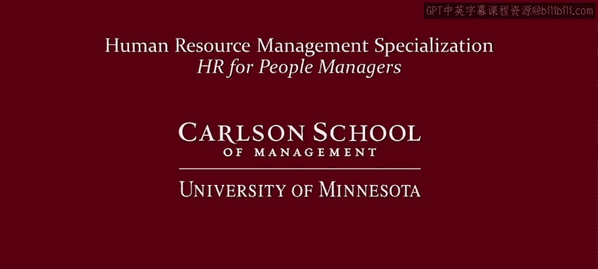

# 人力资源管理：面向人员管理者的人力资源1｜P47：展望其他课程 🎯

在本节课中，我们将对本课程进行总结，并展望后续三门专业课程的核心内容。我们将了解如何将本课程奠定的基础，应用于招聘、绩效管理和薪酬管理等具体领域。

---

我们来到了整个课程的最后一个视频，至少对于我的这门课程而言是如此。

我认为我们都学到了一些放松的时间，就像我最近在这张照片中拍到的朋友们所做的那样。

但正如我的朋友们所做的那样，我认为我们应该借此机会展望未来，看看前方有什么。

我们正在结束这个面向人员管理者的四门课程专项系列中的第一门课。

这门课程为接下来的三门专业课程奠定了基础：一门关于招聘、雇佣和新员工入职的课程；一门关于员工进入你的工作组后如何管理其绩效的课程；以及一门关于管理其薪酬与奖励的课程。

最后，该专项系列将以一个顶点项目结束，让你能够以应用的方式将所有知识整合起来。

因此，就人员管理者的价值主张而言，我在这里一直专注于这个横向部分：我们审视了组织的目标、需求和价值观，并将其转化为人力资源战略，通过员工绩效来推动组织目标的实现。这同样为接下来的三门专业课程奠定了基础，这些课程将由我在明尼苏达大学的同事们讲授，他们都是各自领域的专家。现在，我将让他们各自介绍他们的课程。

---

## 后续课程介绍

以下是本专项系列后续三门核心课程的核心内容与目标。

### 课程二：招聘与雇佣

寻找并雇佣合适的人才常被列为当今企业的头等大事。我们似乎都在争夺最优秀、最聪明的员工。正如你将在我们第二门课程中看到的那样，人员管理者价值主张的一个关键组成部分，就是雇佣能够帮助组织实现其战略目标的人才。

在课程开始时，我们将探讨将招聘目标与公司整体战略联系起来的重要性。

然后，我们将探讨一系列有效且合法的招聘和筛选员工的选择。

在整个课程中，我们将审视人才获取方面的当前议题，例如公司如何利用社交媒体和招聘分析来确保更高质量的雇佣。

### 课程三：绩效管理

一旦雇佣了优秀的员工，成功的人员管理者采取的下一步就是开发员工的全部潜能。

绩效管理是一个帮助管理者实现从员工身上获得最佳效益这一目标的过程。

在绩效管理课程中，我们将讨论你需要培养哪些技能和关键流程来发展你的员工，以实现部门和组织目标。这些技能包括：
*   设定明确的期望。
*   提供积极和纠正性的反馈。
*   进行有效的绩效评估。

### 课程四：薪酬与奖励

成功的人员管理者还必须懂得如何奖励员工。我们从这个问题开始：为了执行业务战略，我们必须吸引、保留和激励什么样的人？

我们将讨论你对这个问题的回答如何帮助你设计与业务战略相一致的薪酬结构、福利、短期激励和长期激励。

我们还将帮助你评估福利并确保合规性。

---

## 专项系列总结与价值

在整个专项系列中，我们呈现了基于实践经验和该领域学术研究的最佳实践与技巧。完成后，你将更深入地理解职场中行之有效的方法，并获得一套用于有效招聘、管理和奖励员工的工具包。

我们仔细思考了这个人人力资源专项系列的设计与实施。它得到了主讲教师超过50年的教学经验，以及明尼苏达大学在该领域70年的专业知识和领导力的支持。

让我们每个人都帮助你成为更优秀的人员管理者和领导者。

---

本节课中，我们一起学习了本课程的总结，并展望了后续三门专业课程：招聘与雇佣、绩效管理以及薪酬与奖励。我们了解到，本课程为这些更专业的领域奠定了战略基础，整个专项系列旨在提供一套完整的工具包，帮助你通过有效的人力资源实践推动组织成功。