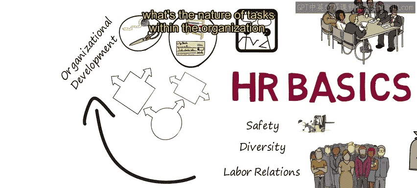
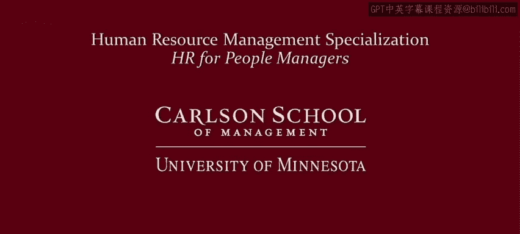

# 人力资源管理：P5：4：人力资源基础 🎯

在本节课中，我们将要学习人力资源管理的基础知识，了解其在一个组织中的核心职能与运作流程。

欢迎回来。这是第二课的第一个视频。第二课的目标是让大家理解，管理人力资源存在多种不同的方式。第一步是确保每个人都对人力资源（HR）的关键职能有一个基本的理解。

欢迎观看关于人力资源基础的动画讲解。假设有人对一个产品或服务有了想法，比如一个新的风筝产品线。为了制造和销售这些风筝，我们需要一些材料，如尼龙布、线和碳纤维杆。但这些无生命的物体自身无法制造任何东西。风筝如何被制造出来？我们需要人。如何营销和销售？我们需要人。如何收取收入和支付开支？我们需要人。如何管理这些人？我们需要更多的人。因此，人力资源对任何组织都至关重要。

## 核心人力资源职能 🔧

以下是人力资源管理的几个核心职能环节。

### 工作分析与设计

第一个HR任务是弄清楚需要完成哪些工作，以及如何将这些工作分解成有效的岗位。我们可以从**工作流程分析**开始，确定需要完成的业务流程。然后，HR进行**工作分析**，以确定如何构建岗位来完成这些必需的流程。

假设有一些生产任务，如测量和裁剪。可能还有一些需要完成的业务任务，如会计、库存管理或应收账款。我们需要弄清楚这些任务，然后将它们组合成合理的岗位。在这个小型组织中，我们可能将这些生产任务组合成一个岗位，将这些业务任务组合成另一个岗位。

### 招聘与选拔

但现在我们需要为这些岗位找到人。因此，下一个HR职能是**招聘与选拔**。需要发布招聘广告，吸引求职者，面试申请人，找出谁具备这些岗位所需的技能和才能，并且谁将能很好地融入组织。

### 入职与融合

一旦员工被录用，就需要通过**入职培训**项目让他们融入团队，确保他们适应组织，了解自己的任务，并知道如何以符合组织价值观的恰当方式开展工作。

### 绩效管理

当人们成为团队的一部分后，他们的绩效需要被管理。因此，你需要评估和衡量他们的贡献，给予指导。他们是否投入？是否有动力？是否在做正确的事情？他们是否具备所需的技能以及晋升所需的技能？他们在组织内是否有职业发展目标？

### 培训与发展

另一个关键的HR任务是**培训与发展**。员工需要接受培训，这可以采取多种形式。等等，不是那种“培训”。是的，是这种“培训”。员工可以通过不同的方式接受培训，包括正式的课堂式培训和**非正式的在职培训**。

### 薪酬与福利

员工也需要获得报酬、奖励和福利。其中一些可能看起来是功能性的，比如确保人们拿到工资。但这当然比那复杂得多。需要考虑金钱如何提供激励，但也不要将奖励局限于金钱。HR可以在组织中领导许多**奖励与认可计划**。

成功地完成所有这些工作，这个想法或梦想就能成为现实，你就能创造出市场认可的优秀产品和服务。

## 专业人力资源角色 🛡️

组织中还存在一些专业的人力资源角色。

### 健康与安全

需要关注**健康与安全**，确保员工拥有合适的工具和安全操作规范，确保工作环境健康。这包括压力以及人身安全与健康的威胁。

### 多元化管理

需要**管理多元化**，确保招聘和管理多样化的个体，并且组织内没有歧视。

### 劳资关系

有时员工可能选择组建工会，因此**劳资关系**是人力资源的另一项重要职能。

### 人力资源信息系统

还有**人力资源信息系统**，利用数据和指标来指导组织。

## 持续发展与循环 🔄

但HR的工作不止于此。它需要持续重新评估业务如何开展、岗位如何构建、组织内任务的性质是什么。审视这些被称为**组织发展**。因此，人力资源的循环持续进行，通过确保你拥有合适的、有动力的、投入的员工，正确地管理他们的绩效，并以恰当的方式给予他们奖励和报酬。

现在，你应该对任何组织中的关键HR任务有了基本的理解。这应该能强化上一个视频的结论：管理人力资源是重要的、战略性的、复杂的、具有挑战性的，并且绝不枯燥。

但在特定的组织中，管理人力资源有不同的方式，这将是本课剩余三个视频的重点。

## 总结 📝

本节课中，我们一起学习了人力资源管理的基础框架。我们了解了从工作分析、招聘选拔到绩效管理、培训发展以及薪酬福利等一系列核心职能。此外，我们还认识了健康安全、多元化管理、劳资关系等专业HR角色，并理解了人力资源是一个持续评估与发展的循环过程。掌握这些基础知识，是理解后续不同人力资源管理方式的前提。