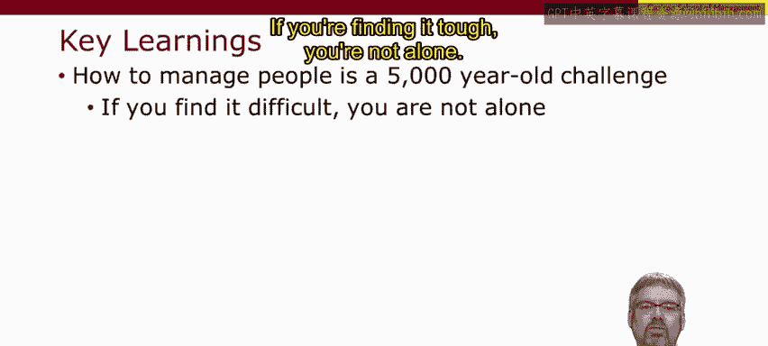
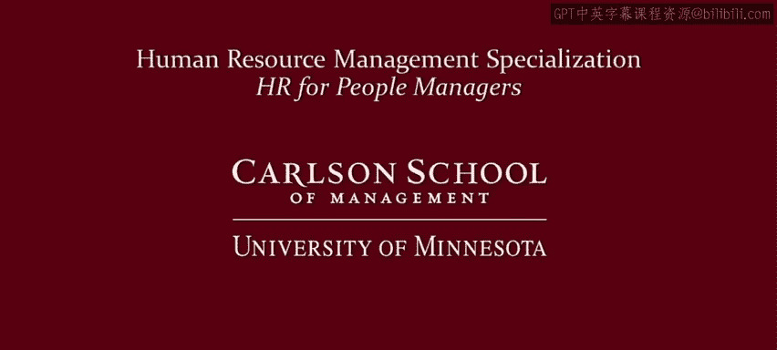

# 人力资源管理：P6：人力资源管理的历史演变 📜

在本节课中，我们将要学习人力资源管理实践是如何随着时间演变的。我们将从五千年前的古代管理方式开始，一直探讨到工业革命带来的深刻变革，以及科学管理和心理学原则的引入。理解这段历史有助于我们反思当前管理实践背后的理念与假设。

## 管理的古老起源

早在五千年前，无论是熟练的奴隶、非熟练的奴隶、征召的士兵还是其他各类人员，都需要被管理。因此，如何最好地管理人是一个历史悠久且复杂的难题。

## 工业革命与现代管理的兴起

现代对工人管理的关注源于工业革命。工业化导致了大规模的生产方式转变，从农业和小规模的家庭生产（即家庭手工业）转向了工业工作、工厂及其他工作场所。根据你所在地区的不同，这一转变可能发生在两百年前，也可能正在当下发生。然而，这对工人和管理者带来的影响是相同的。理解这些变化的深刻本质至关重要。

以下是工业革命带来的几个关键变化：
*   **生产控制权的转移**：工业家取代家庭，成为生产过程的控制者。
*   **个人自主权的丧失**：个人失去了决定何时工作、如何工作、如何构建工作任务以及在哪里工作的自主权和决定权。
*   **收入基础的改变**：收入变为基于个人，而非基于家庭。
*   **无偿劳动价值的忽视**：随着新规范将“有价值的工作”等同于在家庭外进行的“有偿工作”，妇女的无偿照料劳动变得不被看见。

## 监工帝国与驱动系统

早期的工业家认为，他们需要对那些不习惯在工厂为他人工作的劳动力施加严格的纪律并进行密切监控。因此，工头和监工拥有了极大的权力。这个体系如今被称为“监工帝国”，监工拥有无可置疑的权威来雇佣、解雇、惩戒、分配工作、安排工作时间以及激励工人。

工人是如何被激励的呢？通过严格的监控和“驱动系统”：威胁、哄骗、辱骂，甚至指向工厂大门——指向那些愿意取代他们工作的失业工人，如果他们不严格按照监工的要求去做的话。

## 科学管理的系统化尝试

随着生产过程变得更加复杂，工厂规模更大、结构更复杂，人们开始努力尝试系统化管理。这并非全部与人力资源相关，但部分确实是。至今仍被提及的最著名例子或许是“科学管理”或“泰勒制”，以我的远亲弗雷德里克·温斯洛·泰勒命名，他是这场运动的先驱。

泰勒制或科学管理旨在为每项工作找到“唯一最佳方法”。它将每项工作分解为细小的、标准化的、重复性的任务，任何非熟练工人都能完成。例如，泰勒花了四个月时间计算出最优的铲子负载是21磅，不是20磅也不是22磅。因此，工作被分解为可由非熟练工人完成的小型标准化任务。

那么，是谁来决定如何分解这些工作呢？不是工人，而是管理者。管理者被视为掌握所有知识的人。工人是什么？工人只是机器上的齿轮，只是“手”——农场帮手、工厂帮手、甲板水手。正如短语“全体船员集合”所暗示的。

## 心理学原则的引入

大约在同一时期，人们也开始尝试将心理学原理应用于管理工人。这不仅仅是试图优化工作的技术条件，也是为了优化人文条件。其重点包括：
*   **认识到工人的差异**：认识到工人拥有不同的技能和认知能力水平。
*   **关注工作满意度**：关注如今我们称为“员工敬业度”的态度，认识到这些态度对于工作如何完成以及工人的生产力至关重要。
*   **重视群体动力学**：认识到工作场所中的群体动态也是一个重要因素。

这实际上也是当今任何管理者的核心任务：不仅要处理好经济和技术条件，也要处理好人文条件。

## 理念的演变：从假设到实践

回顾这五千年的人力资源管理实践演变史，重要的是不要仅仅将其视为实践的演变，也要看到其背后理念的演变。
*   **古代奴隶与征召兵管理**：以等级森严的专制方式管理奴隶和征召兵，其根源在于当时精英阶层认为自己绝对优于后者，因此拥有管理这些“低等人”的权利，有时甚至是神授的权利。
*   **早期工业革命**：以等级森严的专制方式管理工人，其根源在于工厂主认为自己拥有某些特质（如雄心、节俭、清醒）使其处于社会顶层，而工人缺乏这些特质，因此需要被严格管理。
*   **泰勒制**：一套新的假设出现。工人被视为受金钱驱动，并愿意为获取金钱而工作，但他们希望以最有效率的方式工作。而谁来决定最有效率的方式？是管理者，因为假设管理者最懂行。
*   **心理学与社会学理论的加入**：在如何最好地管理工人的问题上加入了心理学和社会学理论，随之引入了一套关于工人的新假设：工人不仅受金钱驱动，还具有心理差异和心理需求，社会关系也同样重要。

因此，我们看到的不仅是实践的演变，也是理念的演变。当你管理他人时，请留意你自己所持的假设。

## 历史回顾的关键启示

从这次对人力资源管理历史的快速回顾中，我们可以总结出几个关键启示：
*   **管理人是古老的挑战**：如何管理人是项非常古老的挑战。如果你觉得它很难，你并不孤单。
*   **理解工作的本质转变**：按照他人的时间表，使用他人设定的方法和任务为他人工作，对许多人来说是非常困难的事。在人类历史的大部分时间里，大多数人并非如此生活。在管理他人时，请记住这一点。
*   **策略与理念共同演变**：我们可以清楚地看到，人员管理策略随时间而变化，理念与实践同等重要。因此，当你思考自己的实践和理念时，请记住这一点。思考你当前使用的、被鼓励使用的或组织中他人使用的策略，它们是否已经过时？不仅是实践层面，还包括其背后的假设和理念。
*   **管理者拥有选择权**：最后，很明显，你拥有选择权。作为一名管理者，你可以成为创新者。

## 总结

本节课中，我们一起学习了人力资源管理从古代到现代工业时期的演变历程。我们探讨了工业革命如何重塑工作关系，分析了“监工帝国”和“科学管理”的特点，并认识到心理学原则的引入如何丰富了管理的内涵。最重要的是，我们理解了管理实践背后理念的演变，并从中获得了关于反思自身管理方式、关注人文条件以及勇于创新的重要启示。