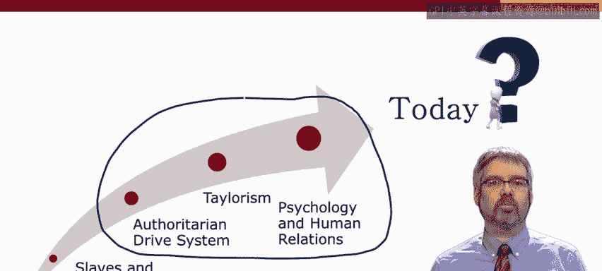
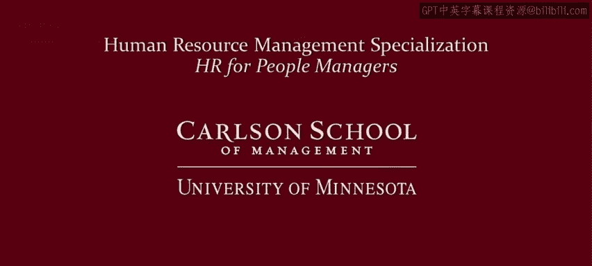

# 人力资源管理：面向人员管理者的人力资源1｜P7：6_视频：对比组织策略 🏢

在本节课中，我们将要学习现代组织中管理人力资源的两种主要策略。我们将对比“低端路线”与“高端路线”这两种广泛采用的方法，并通过实际案例来理解它们如何影响组织绩效。最重要的是，我们将认识到，管理者在人力资源策略上拥有选择权。

---

在上一节视频中，我们看到了人力资源管理方法如何随时间演变。本节中，我们来看看当今组织是如何管理人力资源的。虽然人力资源实践在心理学和人际关系运动的推动下已变得更加复杂，但至今仍不存在一种“最佳”或通用的方法。早期三种方法的痕迹在今天依然存在。

观察不同的人力资源实践时，通常可以将其划分为两大流派或两种广泛的方法：即“低端路线”方法与“高端路线”方法。让我们来比较和对比这两种方法。

以下是两种核心策略的对比：

*   **低端路线策略**
    *   **核心目标**：**劳动力成本是关键**。将劳动力成本降至最低是首要目标。
    *   **薪酬福利**：保持低工资，提供尽可能少的福利。
    *   **培训发展**：提供最低限度的培训。
    *   **管理权威**：**主管是关键**。这让人联想到历史上的“驱动系统”和“工头帝国”，以及泰勒主义中管理者比工人懂得更多的假设，强调标准化程序和监督控制。
    *   **工会态度**：通常采取激进的**反工会压制或破坏工会**的策略。
    *   **核心理念**：可以概括为 **“如果你不喜欢，那就辞职”**。

*   **高端路线策略**
    *   **核心目标**：**寻求员工敬业度**。
    *   **薪酬福利**：提供高于平均水平的薪酬（可能基于绩效），提供更丰厚的福利套餐。
    *   **培训发展**：提供培训机会。
    *   **管理权威**：在更大程度上利用**员工的自主权和判断力**来提升敬业度。
    *   **工会态度**：通常也不欢迎工会，但采取更温和的**工会替代**策略，即通过改善雇佣条件使工会变得不必要。
    *   **核心理念**：可以概括为 **“如果你不喜欢，我们可以谈谈，并找出提高你敬业度的更好方法”**。

当然，这只是两种宽泛的划分，每种方法内部都存在许多变体。特别是在高端路线策略中，组织在提供稳定雇佣、视员工为长期职业发展机会、绩效薪酬的程度与性质、流程标准化程度、员工（尤其是团队）自我管理能力，以及设立劳资委员会等不同咨询机制的程度方面，都存在很大差异。

尽管如此，区分高端路线与低端路线的思维方式，对于理解人力资源战略的关键差异，仍然是非常有启发性的。

---

本节课有两个主要目标。第一是强调存在两种不同类型的人力资源管理方法，即低端路线与高端路线。第二是真正强调**你拥有选择权**。你不必必然选择低端路线或高端路线。

为了说明这一点，让我们看看在同一行业中直接竞争的两家组织：仓储式零售店**山姆会员店**和**好市多**。

*   **山姆会员店**采取的是**成本驱动**策略，因此劳动力很自然地被视作**成本驱动因素**。
*   **好市多**则更多采取**服务驱动**策略，劳动力被视作**销售驱动因素**。

因此，山姆会员店关注劳动力成本，试图保持低工资和低福利成本。相比之下，好市多员工的收入要高出约40%，并且通常享有更多福利。

你可能会认为，由于劳动力成本更低，山姆会员店利润更高。但事实并非如此。例如，好市多的**人均销售额几乎是山姆会员店的两倍**。

为了强调这一点，我想引用《哈佛商业评论》中一篇文章的引述，文章名为《为何好工作对零售商有益》：

> “非常成功的零售连锁店……不仅对门店员工进行大量投资，而且在其行业中保持着最低的价格、稳固的财务表现以及比竞争对手更好的客户服务。它们证明了，即使在零售业的最低价格细分市场，糟糕的工作也并非成本驱动的必然结果，而是一种**选择**。它们已经证明，打破这种权衡的关键在于结合对员工的**投资**和使员工、客户及公司都受益的运营实践。”

所以，再次强调，在管理员工时，**你拥有选择权**。组织和经理人常常默认采用非常简单、被动、严格控制的方式来管理人，并假设竞争环境迫使人们只能选择某一种方式。但正如好市多和山姆会员店的对比所表明的，你拥有选择权。我们的人力资源管理专业课程将教你更好的方法，引导你走上人力资源管理的“高端路线”。

---

本节课中，我们一起学习了人力资源管理中的“低端路线”与“高端路线”两种核心策略。我们对比了它们在成本控制、员工投入、管理方式和工会关系等方面的根本差异。通过山姆会员店与好市多的案例，我们认识到优秀的人力资源策略并非被动适应，而是一种主动的战略选择，并且投资于员工可以带来卓越的财务和运营绩效。关键在于理解，管理者在塑造组织的人力资源实践上拥有决策的空间和责任。