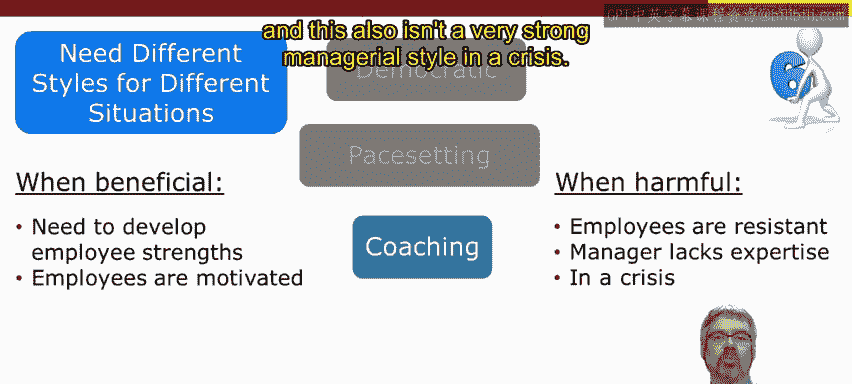
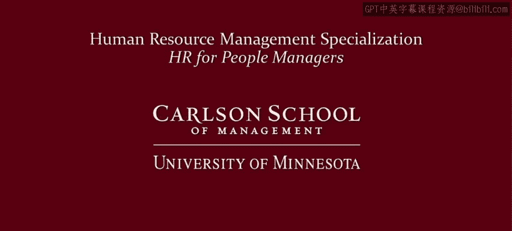

# 明尼苏达大学《人力资源管理：面向人员管理者的人力资源1｜Human Resource Management： HR for People Managers》 - P8：7_视频：替代管理风格.zh_en - GPT中英字幕课程资源 - BV1QU411m7GF

In the previous video， I emphasized that organizations have choices when it comes to managing human resources。

 and we distinguish between a low road approach and a high road approach。

Now turning to the individual and away from the organization level。

 managers too have choices in how they can manage their staff and manage human resources。

 and this video provides a quick introduction to thinking about different managerial styles。

Now this low road high road metaphor， however， is probably a poor one when thinking about individual managerial styles。

Instead， you need to think about adopting different styles for different situations。

 not just choosing between， say， a high road and a low road。

Now there's a lot of different ways of characterizing different managerial leadership styles。

 I'm going to use a popular framework based on six different managerial styles。

The six different managerial styles in this approach are coercive， authoritative， affiliative。

 democratic， pace setting and coaching now I'm first going to quickly run through each of the six。

 and then we'll revisit each of them to think about good situations and poor situations。

 where situations where these styles are good fit situations where these styles aren't as strong of a fit。

Okay， first， the coercive leader， a coercive leader is headstrong and authoritarian。

This type of leader wants employees to comply and to obey， so in a sense， they say。

 do it this way and motivate by threats。Now authoritative managers， not authoritarian。

 but authoritative managers are confident， competent and have a strong vision。

 and so their key goal is to get employees to mobilize towards a vision。

 in a sense they say come with me and motivate by persuasion and feedback。Now。

 in an affiliative style， people and relationships are the most important。

And so these types of managers essentially want employees to be happy。

 and their catch phrase would be people come first and they motivate employees through building relationships with them and helping them build relationships with each other。

A Democratic style is a participative style。 This leader builds trust。

 respect and commitment through listening and employee participation。 So in a sense， they say。

 what do you think and motivate through inclusion。Now pace setting managers by contrast are real go getters。

 so they set high standards for themselves and expect their employees to follow their example。

And so in a sense， they say， do as I do and do it now， and they motivate by setting high standards。

Lastly， a coach sets out to develop employees， and so their catchph is try this。

 and they motivate opportunities through opportunities for long- termm development and emphasize that over short results。

Now I really want to emphasize that there is no best managerial style you need different styles or even different combinations of styles for different situations Now coercive style。

 for example， is beneficial in a crisis if the cost of failure the cost of deviation is high then having a strong leadership style or people know exactly what they need to do can be beneficial however。

 however， employees can become resentful of this that become resentful of micromanaging and so in those types of situations a coercive style is not very strong。

Now authoritative style can be beneficial if you need quick results and it can be beneficial if the manager has credibility and therefore is really confident and competent in his or her work performance and sets a good role model。

 sets a good example， however this can sometimes become arrogant or become authoritarian in which case this becomes a negative rather than positive leadership style。

 this can be especially the case if you're working with peers or even working with people more experience than you。

 and they might mistake your authoritative style for an arrogant style。Now。

 affiliative approaches are beneficial and stressful situations where relationships are important。

 or it can be useful when trust is broken down and you need to rebuild trust by rebuilding relationships。

However， in this approach it emphasizes relationships over performance per se。

 if employees need feedback and they need stronger supervision， then this is not a strong style。

 also the emphasis on relationships over results can sometimes have this workplace devolve into situation where mediocrity is acceptable and clearly that's not a good situation。

A democratic style is beneficial when you need buy- in and it can work well when employees want to participate。

 they want to share their ideas， they want to be included， however。

 think of a situation where employees don't want that they don't have that motivation or they don't have the expertise to contribute ideas in that case a democratic leadership style is not strongly suited。

Also， there's the risk that a democratic style ends up with too many meetings， too many decisions。

 and so if that's the case， then this isn't necessarily a strong management style。

A pace setting style can be useful and beneficial when you need quick results because remember pace setting managers are setting a high example and expecting others to follow along and if employees have the motivation and the skills to follow along then this can also be a beneficial positive managerial style however。

 if employees need more direction， need more coordination and not just follow my example。

 then this isn't necessarily a very strong or successful managerial style also if employees become more concerned with trying to figure out what you want rather than figuring out their own good ways for delivering effective job performance then this can reduce morale and lower trust and therefore be a negative managerial style。

Lastly， coaching can be beneficial when employees need their strengths developed and when they're motivated to develop those strengths。

 however， if employees don't have that interest or if the manager lacks the expertise to correctly diagnose employee strengths and weaknesses。

 then this coaching style is not necessarily a very strong one this also isn't a very strong managerial style in a crisis。

So again， I want to emphasize that there is no one best style for managing employees。Now。

 research indicates that the authoritative style is the single most effective managerial style。

 but even that one， as we've seen， isn't perfect for all situations。 Rather。

 you need different styles， in fact， a different combination of styles for different situations。

 So work on mixing and matching。Different types of managerial strategies。

 managerial styles from your palette of options。And to do this。

 you need to understand yourself while also understanding others and managing relationships。

 this requires self awareness as well as social awareness。

