# UNSW《前端编程｜ Web Front-end Programming COMP6080 23T1》中英字幕（deepseek-R1 p03 -03-COMP6080 - HTML 🐲 Intro.zh_en -BV17RXGYuEaM_p3-

Hi， my name is Hayden， and today we're gonna to be talking about the introduction to Hml。

 One of the most basic parts of web development。 So this is the place to start。

 if you feel like you don't know anything， you're in the exact right place right now。

 So what is HTML Hml is the basic structure of any website on the Internet。

 So it basically if you have used a website gone to some www Google do co。

 you have been looking at something that was built in some part with Hml。

 and Hl is the original I don't want to call it a language。

 but's the original kind of code that makes up web pages。

 and a lot of what we've done since has been built up on this basic structure。

 Now many of you would have seen HTMLl before， it has a very familiar look。

 it's just something that's kind of around if you're studying computer science。

 it just seems familiar and a bunch of you would have written a little bit of basic Hml and some of you might have done a lot more what we're going to be talking about today is。

All the different kind of basic parts of it。 So you can get a sense of the breadth of what it is。

 as well as some more fundamental understanding of the key differences between these different aspects that I just mentioned。

 Now， what is HTML。 Well， it looks like this。 But what in the world is it。

 So it stands for hypertext markup language。 Now， hypertext is a word from the 90s， which you know。

 really just means web pages， right， because before the Internet text was just text files。

 it was a lot of text。 But hypertext was this idea of you know。

 this enrich text with like links and images and fonts and bolds and all this kind of stuff。

 So Hl just says it is the language for how we describe content on web pages is maybe the simplest way to。

Describe it。 It is much more structural than aesthetic。

 We will come back to the more aesthetic part of web development， which is CSS。 that comes very soon。

 and HTML also does not deal with dynamic state。 So what I often kind of describe to people is if you're not really sure what that distinction means then one of the easiest places to look is to just go to Wikipedia because Wikipedia is a very simple website you can kind of just come here and you'll see that it is made up a fairly straightforward blocks and text and some basic colors now granted even this page itself is a little bit more styled with things that aren't just HTML。

 but this is a fairly straightforward web page it's made up of predominantly text tables。

 these kinds of basic elements。 It feels very far away from an app very far away from a game So lots and lots of basic HTML here。

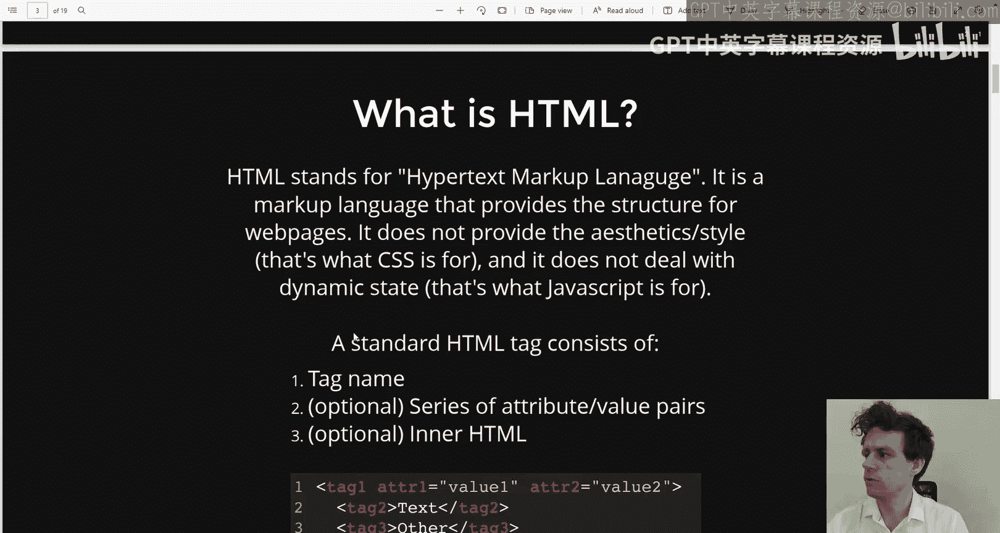

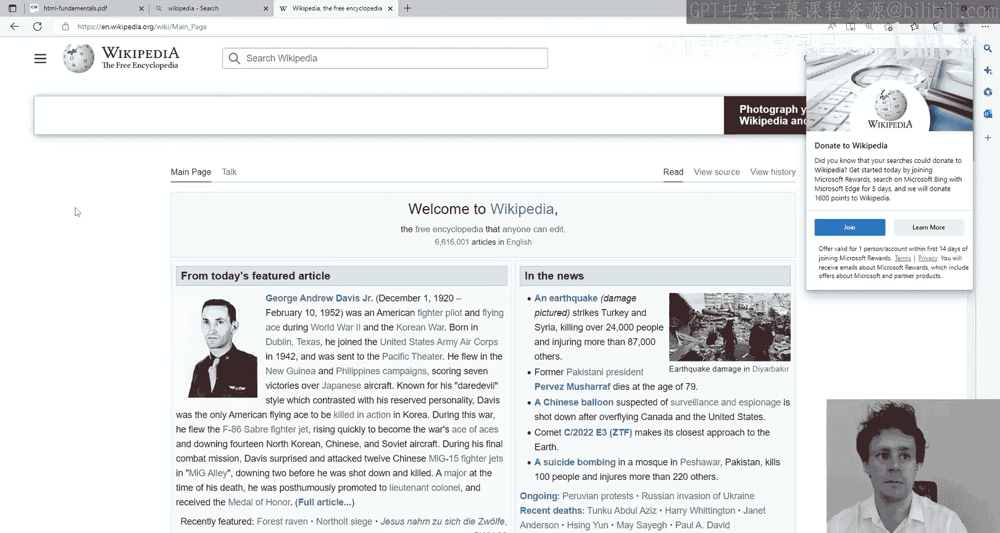

Now all the HTML you see on a page like this up here usually consists of one of three things because it's a very simple markup。

 There's a tag name， a tag name is essentially a block you could imagine it you know like I want to say you know square circle rectangle。

 whatever it's just a description of something。 and then each tag generally opens and closes just like braces with a function or a wire loop or a for loop and inside of that tag there can be more tag so it's a big nested structure it's kind of blocks within blocks it's a very intuitive way of looking at a web page and we're going to play around with it a little bit and。

The kind of key difference between HTML and what you might have worked with previously when it comes to programming is。

 you know many of you will have done something like Python or C。

 And you know that those languages need to be taken and in some way compiled or interpreted。

 but there's some kind of compilation step and you typically do that via the command line So you write some code。

 then there's a command line argument that will run your code where something like HTML differs and is quite interesting is that we don't really interact with it on a command line because the compiler itself is actually the web browsers that you use every day So when you use Google Chrome Firefox Safari。

 anything like this those browsers are actually the thing that takes that raw code you program and turns it into something。

 It produces an output it compiles it， it renders it。

 however you want to think about it it's the compiler and that's really cool because you don't actually need to even install anything on your computer to do what way're going through today because by the virtue of the fact that you're probably watching this on the internet you're using a web browser right now you already have the tools to run it。

So for instance， I can do this really simply if I just take this little bit of sample code here。

 for instance， on this page I'm going to go， I've got a little file here called page HTML。

 I've just made it。 It's a random file on my computer doesn't need to be anywhere in particular。

 and I'm going to go and paste this here。 Now granted the formatting got lost a little bit there。

 That's okay。 HTML just like most programming languages generally doesn't care about whitespace so you don't need to stress too much about it。

 but。

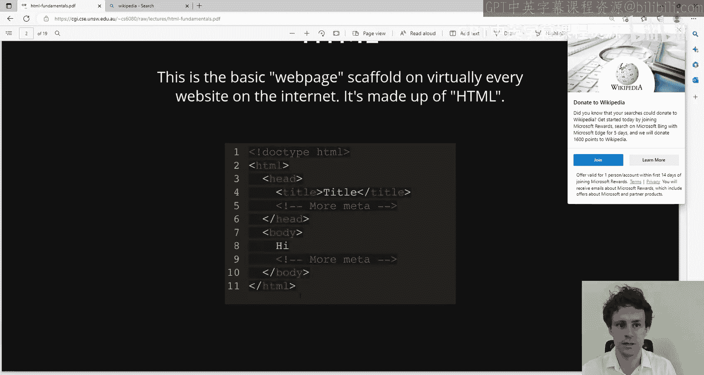

Let's say this is our basic HTML page， really， really simple Now if I would like to kind of compile and run that page。

Again， there's not a lot I need to do。I literally would just go and look at that file on my computer。

 There's the file on my computer。 It would be different on you know Mac or Linux or something like that。

 And I'm just going open up a new tab and new browser doesn't matter。

 And I'm literally just going go and grab that page and put it here。 Now you could go to file。

 open or open that page， but you'll see here this is using the Linux subsystem。

 This is an actual just file on my computer and the browser is rendering it。

 It's producing that output。 So this code here got turned into the output on the right。

 So browsers are doing the work。

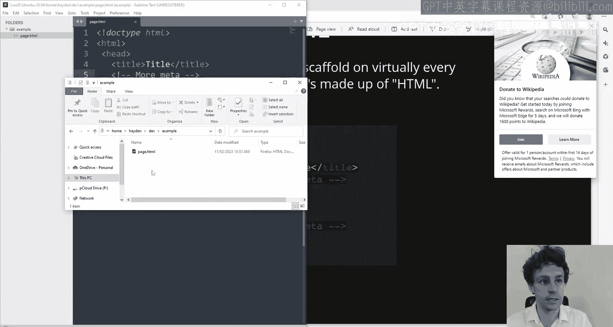

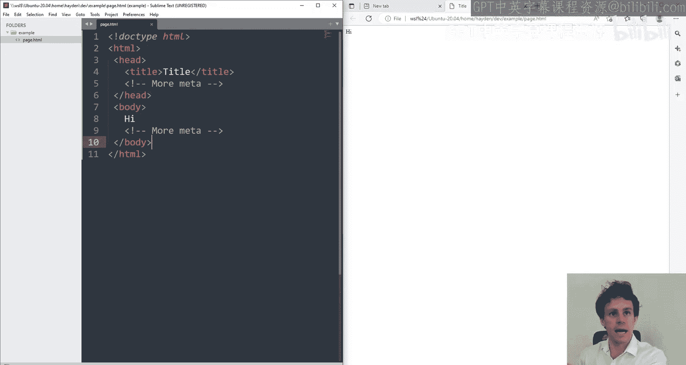

Now the reason that's quite interesting is if we come down here we talk about what is a web browser。

 I kind of summarize this before， it's a tool that takes in these web based programming languages and it renders dynamic web pages。

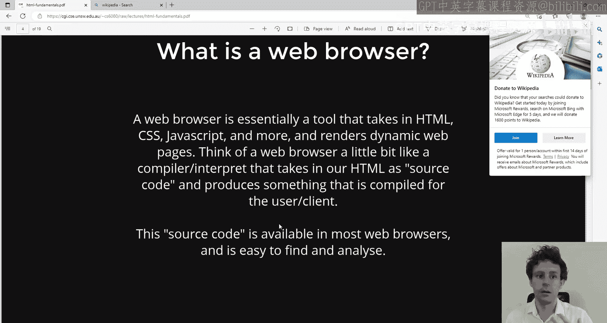

Now， the source code is also available in most web browsers。

 and it actually also gives you a sense of how this kind of。

 you know pre compilation and what it renders happens is that this is the page that it produces。

 But if I write， click on this page and I click on view page source Again。

 this is different in different browsers。 you will see that here I can see the raw code。

 So the browser gets this raw code， that's actually what it kind of you know gets given to do its job and then it produces that as an output。

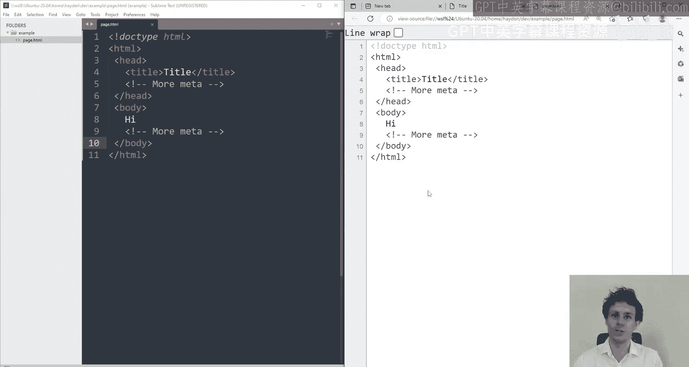

Fairly simple mechanic。What we're going to be doing now is talking about some of these elements on the page and then talking about many more elements。

 because just to give you an example and I'll jump ahead slightly here。

 I can make this page a little bit more interesting by making my text on this page bold with the B tagag and you'll see if I refresh this page。

 the text is now bold but you'll see if I look at the source code and I refresh this。😊。

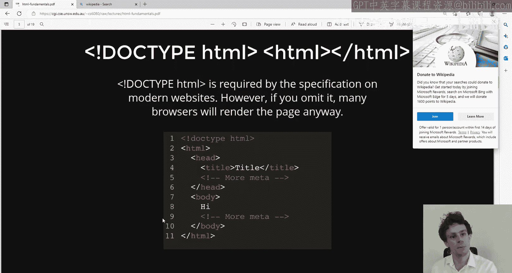

The bold now appears。 So this is what the browser takes。 It sees the bold。

 and the browser does all the compilation magic， and it produces that。Programming to visuals pretty。

 pretty I mean， how it works is very complicated， I'm sure， but it's pretty simple in concept so。

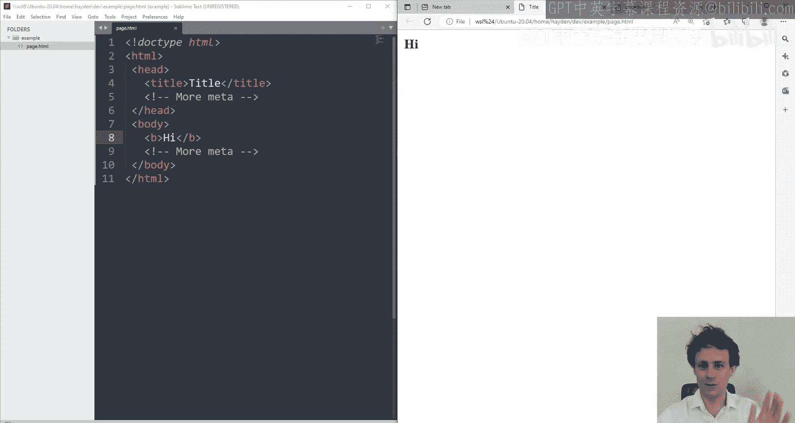

Let's look at a bunch of basic elements of a web page。 Now， just off this far we have here。

 you'll notice immediately， we have this thing up the top called doc type HTML。 Now。

 this doc type declaration is meant to be an instruction to the web browser that tells it what type of document you are loading。

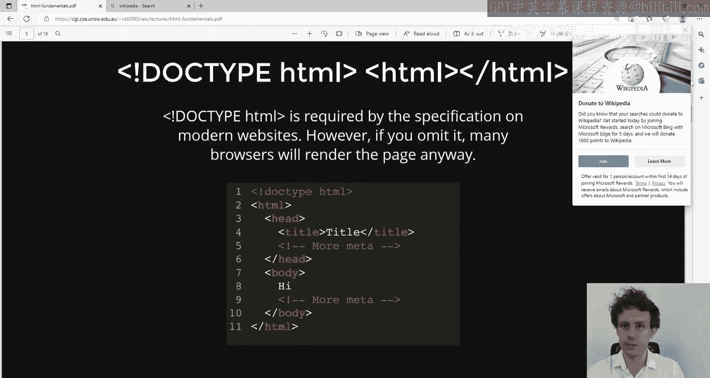

Here， so in this case， we're telling it's an H T M L document。 Now， that might seem totally obvious。

 General， browsers are pretty smart。 And if you don't have that， nothing bad is gonna happen。

 You know， if I got rid of that and I refresh the page， the page still figures it out pretty easily。

 You know， it's not， it's not confused or scared。 but best practice is to include a doc type。

 It's usually always the same thing。 And it will always be the same thing in this course。

 It's just that doc type H T M L。

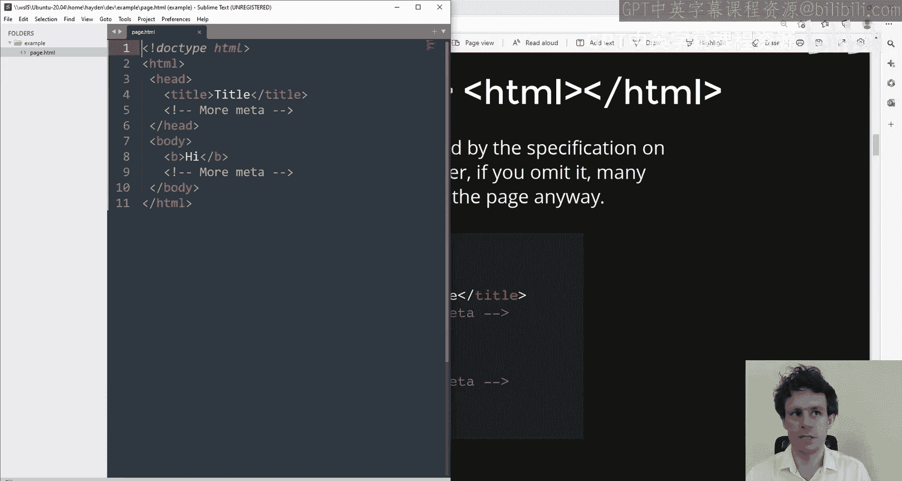

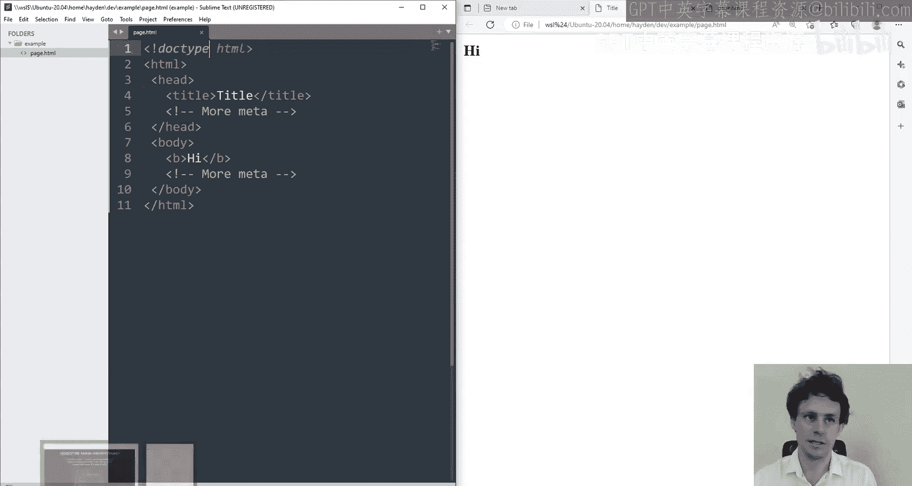

嗯。You'll also notice that there is an HTML tag and generally what we do is when we build a web page。

 everything on that page exists between these two HTML open and HTML closed tags like that。 Again。

 that's just convention。 It helps the browser understand a bit more intent。

 But what you will then notice is that there's two tags inside of that one called head and one called body。

 Now， the head and body tag are the two main tags inside of the HTML tag。

 So generally every web page is doc type HTML inside of that head and body。Now。

 what exactly is the head tagag。 Well， the head tag contains what you call meta information about the page。

 It's basically info and instructions that don't pertain to rendering the page。

 It has nothing to do with how the page looks。 Now， early on when you're working with HM L。

 this section is going to be mostly irrelevant to you and you probably don't need to waste much time thinking about it。

 But the simple examples of why。Why this can be useful is that you can use it to include a fab icon fab icons of these little icons up here See the little search there or the little CSE logo。

 They' are all icons that this web page itself。 Well， in this case is a PDFf。

 But you know when I go to Wikipedia， you'll see that little icon changes。 That's Wikipedia here。

 If I open up Wikipedia's source code。 Yeah， it's very complicated。

 Well you can actually see here it says that the shortcut icon。

 the little icon up here is this particular image， which looks like that。

 So all of the instructions about things not to do with the page itself and how the page looks are sitting in that head and that also includes including other file。

 So know if you've done C， think of hash include if you've done Python think of import or jascript import。

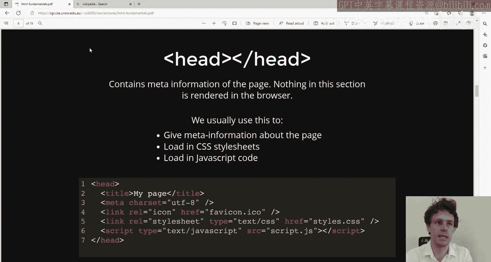

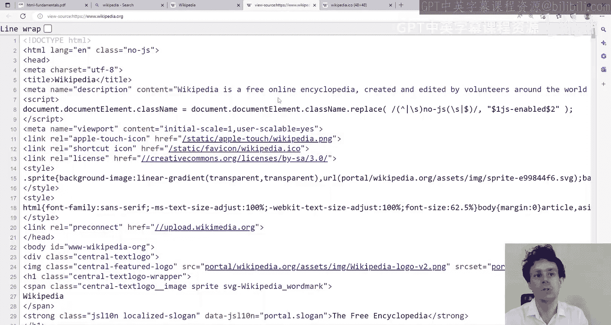

It's obviously not even remotely like that， but it's the same concept of like you're trying to pull things into the page so that the page can do the work right so that is what the head area is for On the contrary。

 the body area is for everything that kind of appears on the page so the body is all the information to render the page for how it should look。

Most things inside the body tag are about that white content on the page there。 So if we go back。

 for instance， to here， you'll see that everything in high here is the body。

 if I write hi how are you and I save and refresh that text now appears。

 you'll also notice though that this title tag that we saw before but kind of didn't talk about That's actually the title of the web page it's actually what the tab is called So if I wanted to call this my first web page that will actually update that。

 So that's where for instance， when we go back to Wikipedia because it's a fun easy example you'll see that this source code has a title called Wikipedia here。

 but if I click on this， you know it says Wikipedia， the free encyclopedia。

 and now when I go and open the page source you will see another title tag here， Wikipedia。

 the free encyclopedia。 So the head has all that metadata information。

 the heads on some page is a massive just for fun。 There's a whole bunch of other interesting info here。

 for instance， all these Og things are the instructions that when you ever take a web page and you paste it in。

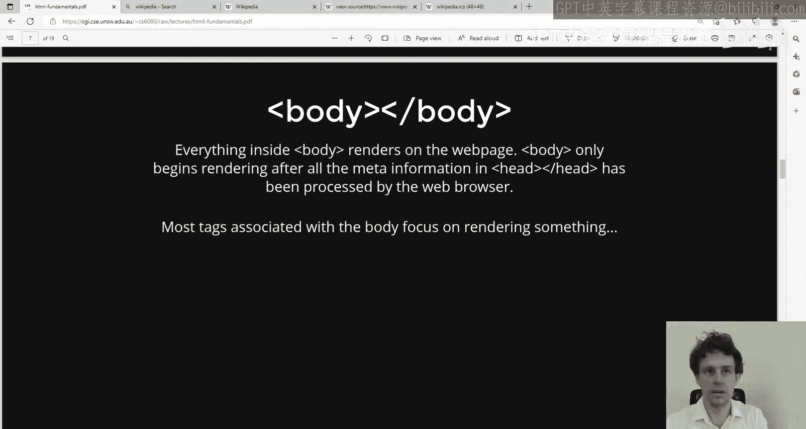

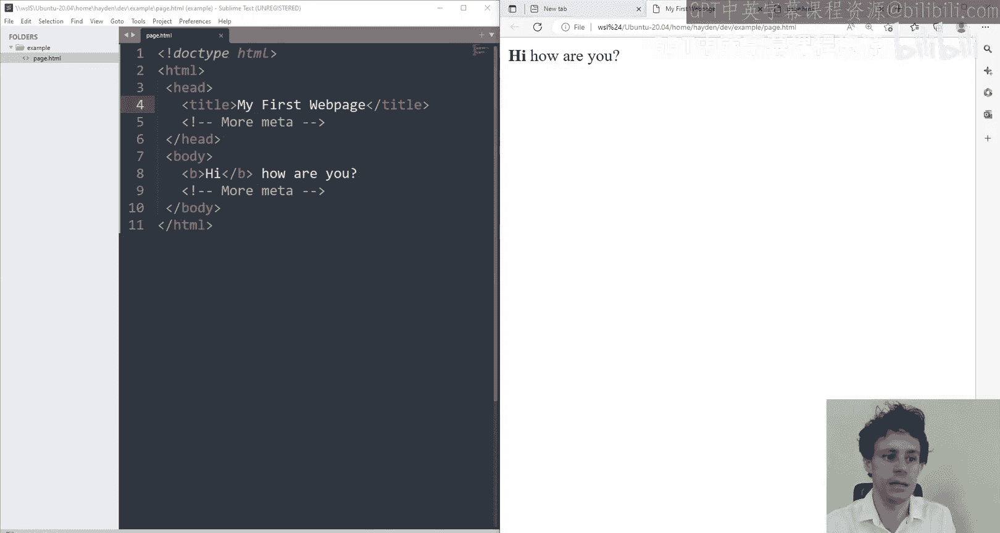

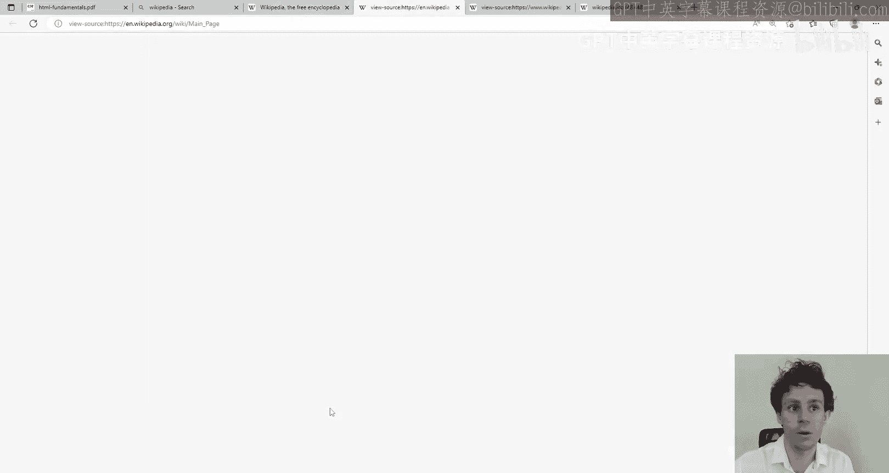

Like LinkedIn， Twitter， Facebook， Instagram and it like pre populates little icons and texts and things。

 all of that information sitting inside the head。 So it's all the metadata， that's why you know。

That's why we call it meta information。 So that's the body。 Now。

 everything else we're gonna be talking about today is really just about different things we can render on the page。

Different things we can put inside the body tags。 And there's quite， they're all quite simple。

 which is great。 But let's， let's。😊，Stop， to enjoy it。Cool。

LayOut tags are some of the most basic parts of a web page and essentially they help separate our page into different structures。

 Some of them have really simple properties， some of them have much more complex properties。

 You can see a handful here。 What I might do is I might go and well we don't need to copy and paste it。

 but let's talk through some of them so。In no particular order I might even start from the bottom just to make things a bit more interesting you'll see that we have three at the bottom which is U for underlined text I for italics B for bold So if we come back to our page now you'll be able to see that I can write some text that's likeop be bold。

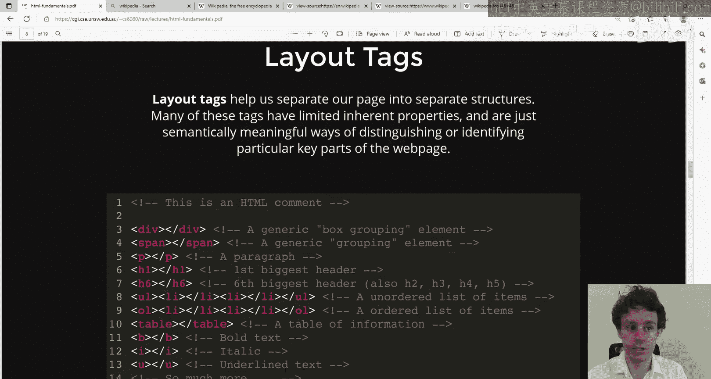

And then I could say I italics and then I could say you underline like this。

 And then if I refresh my page， I'll have three different types of text。 Now I can combine those two。

 if I want a bold italic， I can just kind of nest them， if you will， you know， like again。

 if you've done basic programming。 You know that a lot of programming is kind of nesting structures。

 right， you got functions and then maybe a function and a function and then variables and then loops。

 you know， so you get that kind of tree like nested like structure that's inherent to to what you're doing。

 So you can combine them like this， you could wrap everything in a certain tag。

 You can make everything there underlined。 Obviously。

 if you have an underline within and underline the browser smart enough to ignore it。

 like it doesn't double underline it or anything like that。 So that's super cool。 really simple。

 they're simple layout tags。 I mean， you could call them formatting tags， really， I mean this。😊。

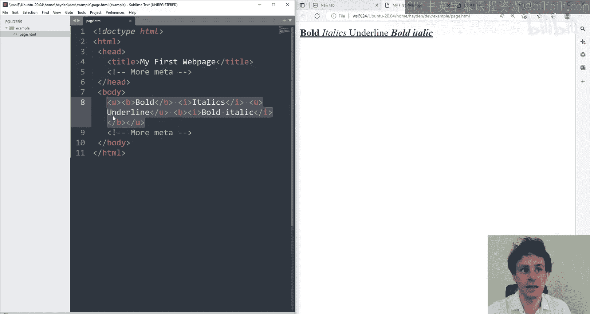

There's not lot like a formal definition there， but。These are our basic tags， really。

 We've got a table。 So Hm is capable of generating tables。

 Now tables are quite interesting in HTML they。😊。

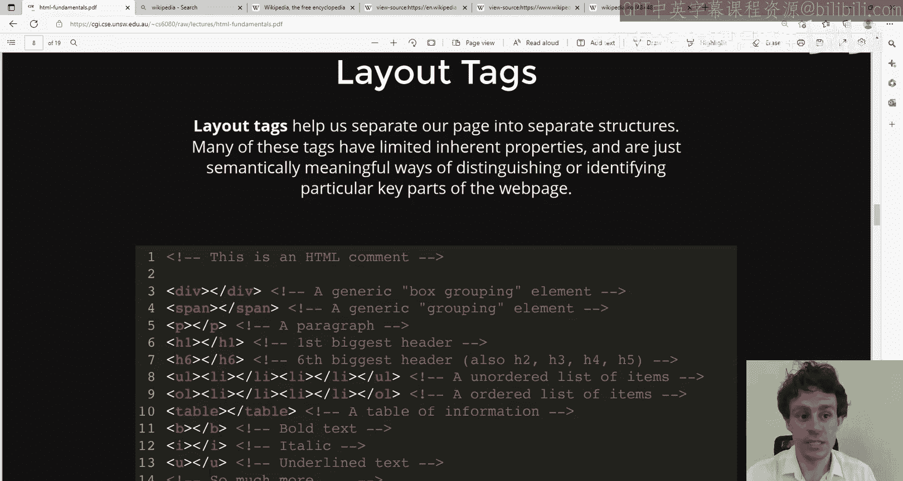

They're basically made up of rows and then cells。 So if I've got a table here that does nothing。

 but I can create a row and then inside of that row， I can create a cell， and I'll call it cell  one。

 and then I can create another cell called cell 2。 And now I have a little table like this。

And then I can come along and make a couple more rows with more cells in it。

 you know so that's how if you see a table， sometimes that's how these tables are generated now early on in this lecture。

 we talked about how with HTML there are some key components of it。

 which is a tag name table B underlying italics and then a series of attribute pairs。

 which are these things here So you kind of get one the tag name and you kind of get three because we've you know put a italics inside a bold you get that nesting but this series of attribute value pairs means that each tag kind of has properties that we can give it now generally this isn't super popular because we like to use CSS which comes in another lecture to add a lot of properties and styles and aesthetics to a particular tag but in this case I'll just show you a really old school property which is the attribute border and the value。

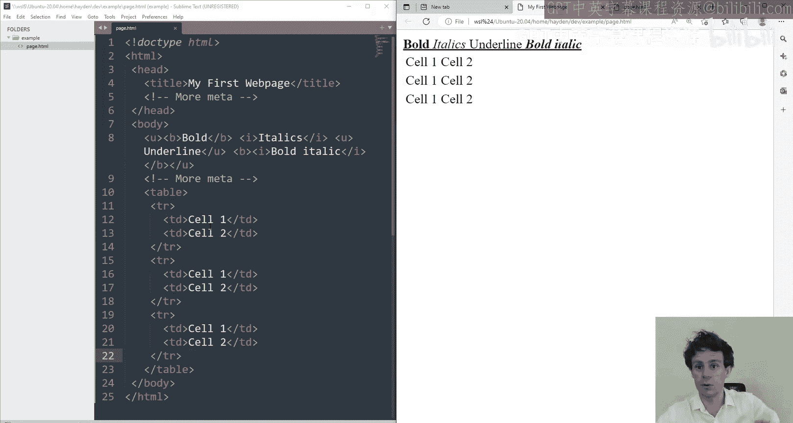

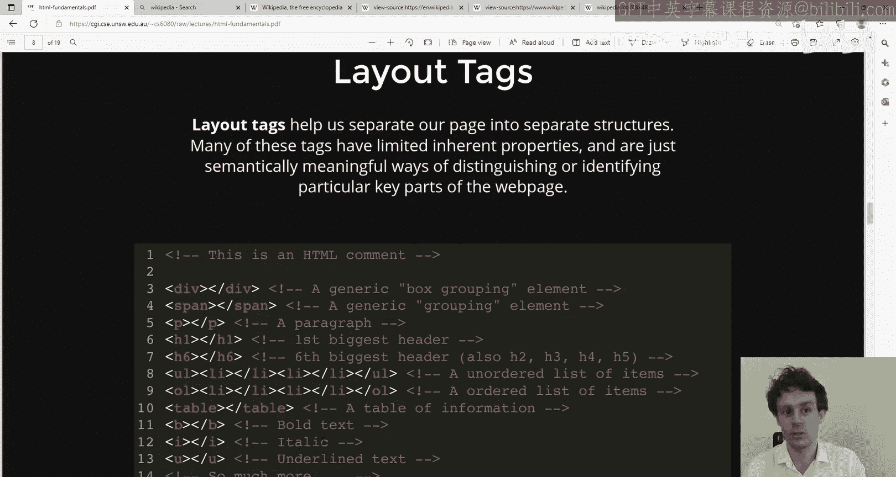

1。And when I do that， you'll see that it actually adds a border to my table。

 and I could make a really thick border too if I wanted to， you know。

 and this looks like very retro internet here。 but this is what HTMLL can do。

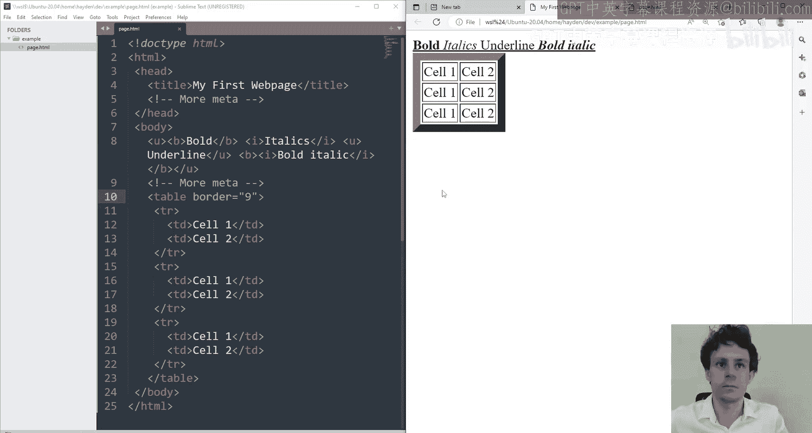

So that's what a table looks like now we have our unordered list and our ordered list so these are two types of ways of listing information and what that means is that if I have an unordered list an unordered list is like a grouping of things and inside of that grouping what I do is I create list items。

So a list item， for instance， might be like item one。I might create a few of those item2 and item 3。

 And because it's an unaudered list， what that means is that it's just dot points。

 So I have item 1 item 2 item 3， just to three different dot points。 Where if I have an ordered list。

 which is an OL。 It's where I get numbers there。 So this OL is a numbered list。

 That's why they call it an ordered list。 And yeah， there's a lot of ways you can。

Tweak this to use a or capital A instead of  one，2，3， you can change those circles to diamonds。

 There's lots of configuration you can do for these lists themselves。 They don't just kind of exist。

 You can configure them in some ways。 there's you can do with CS that we'll talk about later。

 you can add a bunch of properties。 for instance， I could say that my list I want to start at number 50 and now it starts at number 50 You can find most of this information to just by googling it by you know you pick a tag and you write HTMLm and you'll generally see a W3 schools website。

 which is really good for basic understanding。 and they'll take you through a bunch of things like that you can reverse a list。

 for instance， and you're like oh that sounds really interesting。

 So you click on that doesn't take you anywhere you go O reverse。

 So now I can come here and I can add reverse here。

 So now it will go I think down to 51 no it'll start at 50 50 at the bottom。

 start at the top Okay sorry So you see 5049，48。 So lots and lots of configuration again。

 that all just comes out of a quick Google。 It's all pretty straight。

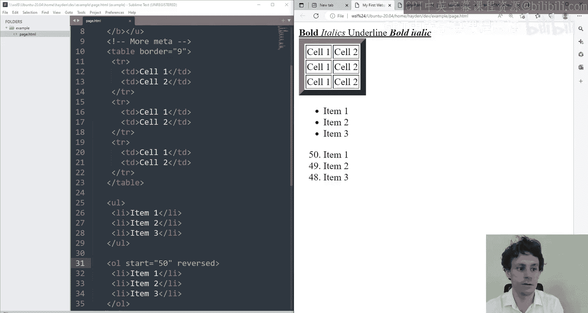

Forward， so that's unordered list and ordered list。 We have a bunch of headers in HTML。

 These are basically just chunky pieces of text at different sizes。 So if I want to， for instance。

 add some I could add add a one hellello， let's make all the different types of headers。

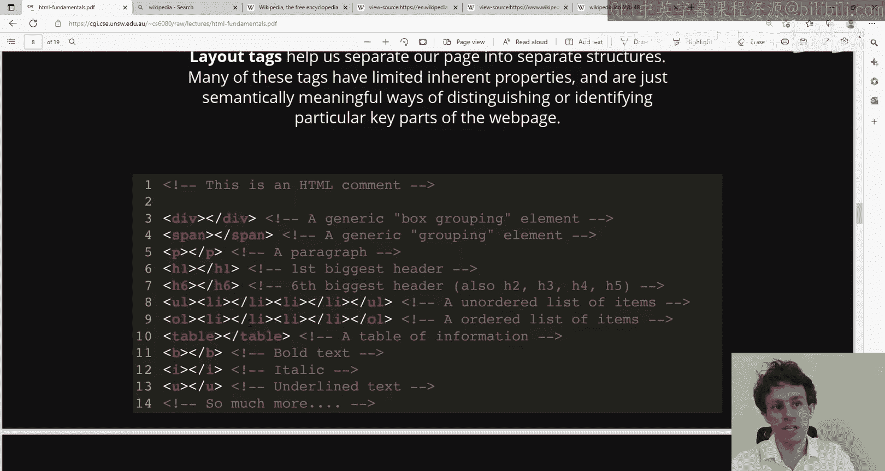

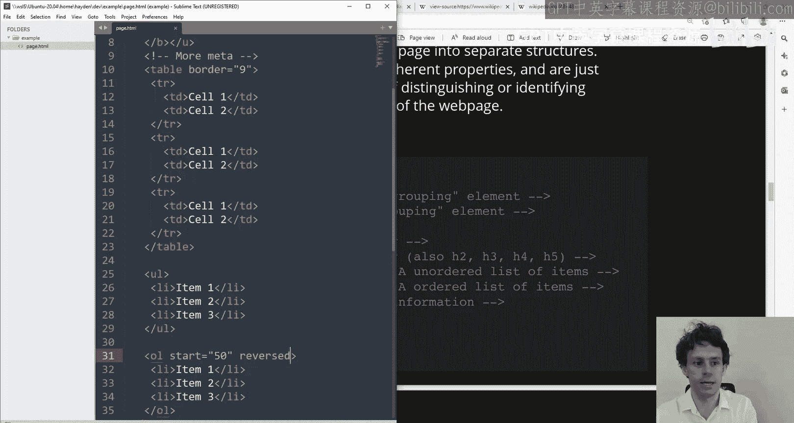

You know， so we've got head a one， two， three， four， five， six。And there you go。

 There's all the different types of headers。 And then just let's compare normal text here。 Hello。

 see what it looks like comparatively， so。And you might look at that and think， oh。

 they look strange。 Well， the cool thing about what we learn in the next lecture is that you can actually go and change how these things look。

 You can change the font。 the size， the color。 The point of H T M L is not to color things， size。

 things， shape things。😊，It is to provide the fundamental structure。

 It is to say we have a header here， we have some paragraphs here， we have an image here。

 we have some links here， we have some lists here and then you go later and you color it that's why I say Wikipedia is kind of a bit of a boring website which is because it's just a lot of fairly basic HTML which is good that's why it's such an easy website to use so。

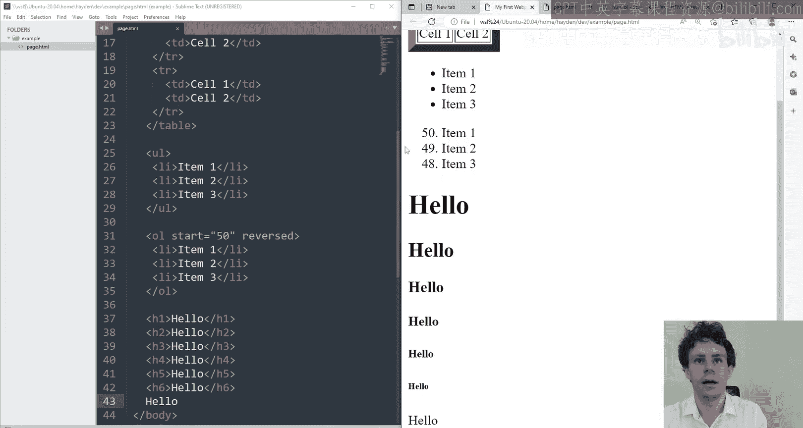

That leaves us with just a few kind of remaining proper layout tags and these layout tags。

Really common。 You'll use them a lot。 but they are kind of hard to explain early on。

 A good example is the P tag or the paragraph tag。 So the paragraph tag is really， as it's stated。

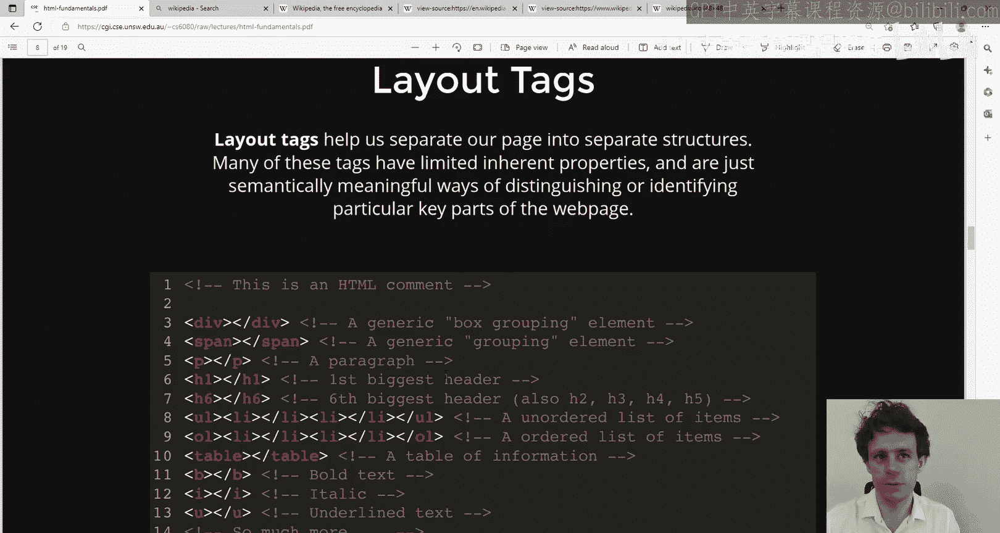

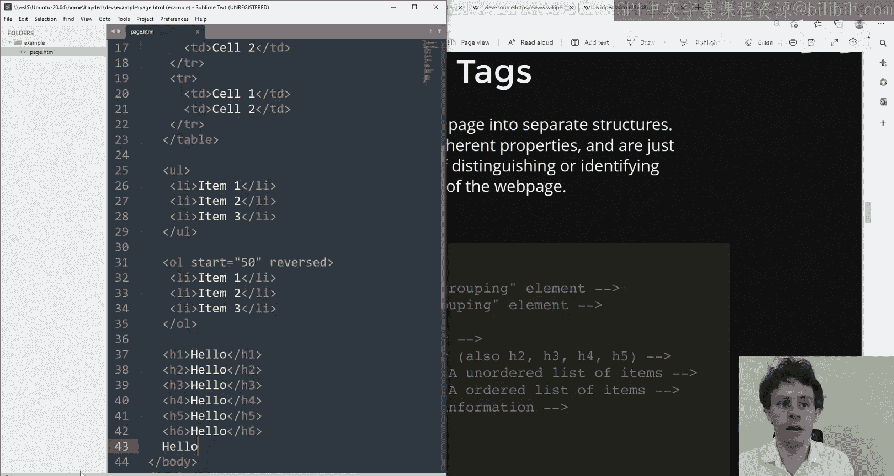

If you just write text normally， like say， you know， hello， how are you。What are you doing like this。

 I am good。Here's the thing about that in HTML， this will all appear in one straight line because HTML ignores white space so just because I've put this new line here。

 HTML just like normal it just doesn't care so if we want to kind of break those up。

 then one way to do it is to wrap these things in paragraphs。So now I'm saying that okay。

 I've actually got three small paragraphs here and a paragraph tag needs to be open and closed just like other tags and now that is broken up a little bit more nicely like this so this is a really common way to space text and you'll see that again like look at Wikipedia somewhere like a web page where's a good page。

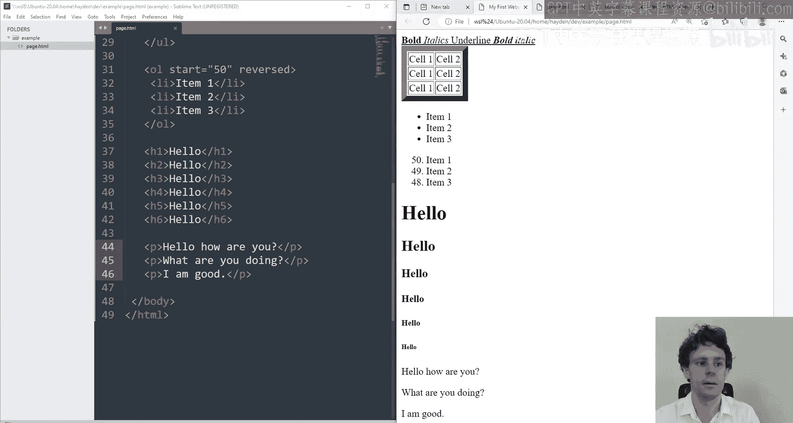

嗯。You know， some things like this。 these are all be paragraph tags。

 like I'm sure if you viewed the page source。 Let's search it up。 the move to all big gun。 Okay Yeah。

 see paragraph tags。 That's how they break up that text。 So paragraphs text really simple。

 spans and divs are a bit more interesting。 These are kind of what you would call they're kind of stless tags in the sense that they don't really have much inherent properties。

 And that's good because they're kind of like a blank canvas。

 You know when you you start a new word document or you know。

 a new Canva presentation and there's all the templates and then you just pick none and no create my own kind of thing it's a little bit like that。

 it's like a blank canvas for you to do what you want with it。

 The main difference is that span is like a truly blank canvas and div is for blocks of things。

 And what I mean by that is you'll see if I just do like span high span high like this。

 You'll see that how it renders on the pages just for highs。 But if I do。

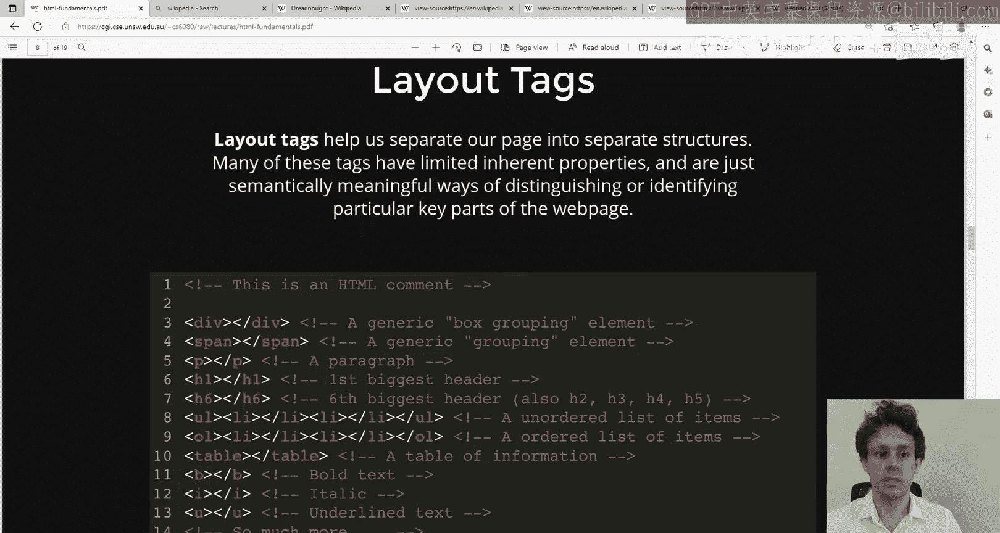

For divs。For instance， those divs actually all form little boxes。 They're all like their own line。

 So div is when you want to start creating box like structures and span is when you don't。

 The short story is that div is the kind of universal basic。Empty empty tags， not the right word。

 It's the universal basic kind of stless tag to design structures on web pages and span is the universal styllist tag for text。

 So use spanm with text to div with everything else。 But again。

 that'll become much clearer in subsequent lectures， particularly when we go through CSS stuff。

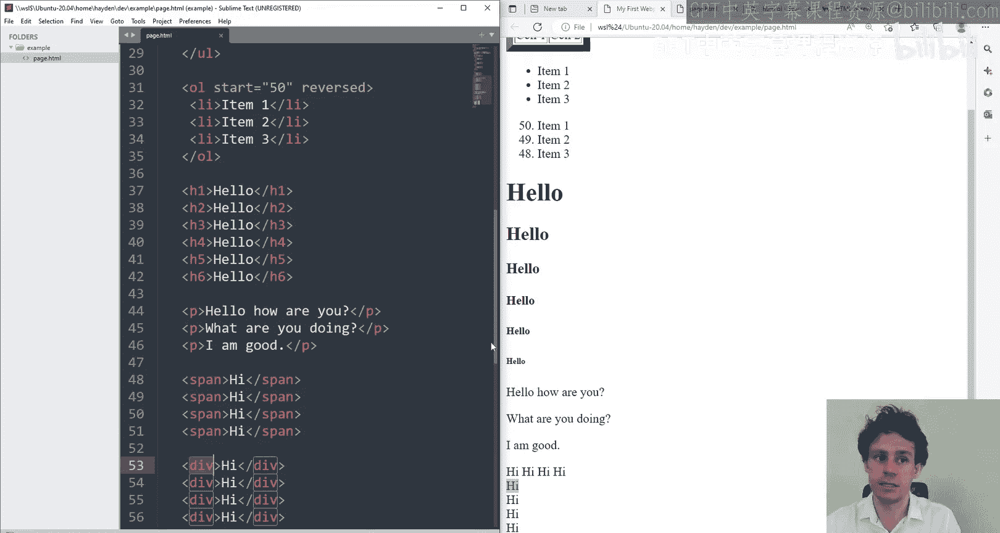

Now， formatting tags， obviously these were in the previous slide is like layout tags。

 but this is just like flow on。 So I know I called them。Layout tags。

 these are essentially layout tags。 You could argue H1 in H6 again is not really formatting doesn't really matter。

 These are just tags， but bold italics underline， they change the color generally。

Generally I'd say that you won't use some of these as much tables are pretty not that useful nowadays we'll get into that later but a lot of div span P。

 the headers， the lists in particular， like a lot of these top ones here are very commonly used I would say。

 particularly these top two。

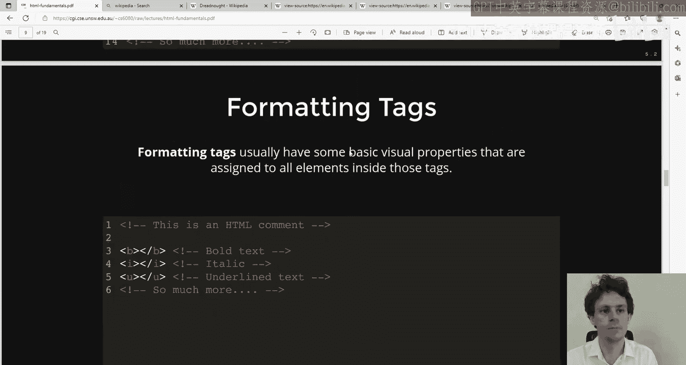

Okay， well that was a lot of basic look lieu of a page。😡，Lots of little fun things。

 We're gonna try and have a bit more excitement now。 So that was a lot of basic tags。

 Let's start to look at the more interesting one。 So the anchor tag is a really common popular tag as well。

 The anchor tag is basically how we link from one resource to another。 Now。

 this can be a whole bunch of things。 This can be links to external pages。

 this can be links to internal pages。 And it's like if I go and get this dreadnt Wikipedia page that we randomly found。

 what I can do is if I was to say here， I love the dreadnaught。😊。

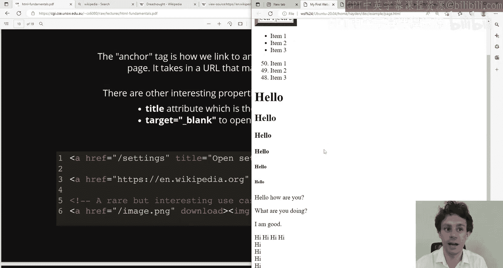

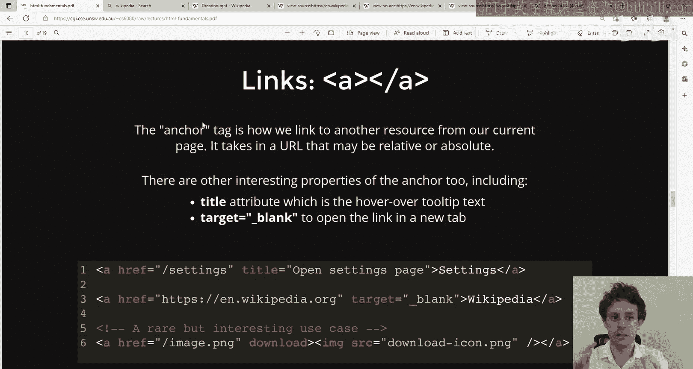

Check it out here。 If I just go and put that text on the page， that text right now is just text。

 I might go and put this at the top just so we don't have to keep scrolling down and get my stupid face in the way。

 So yeah， there's our text。 I love the dread not check it out here。

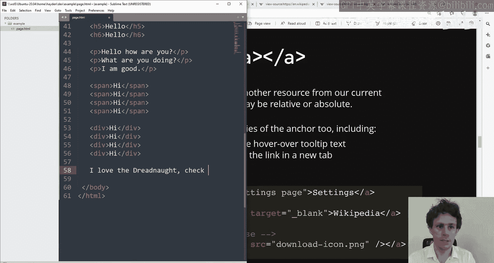

I might put that in a paragraph because you can see the formatting is all weird。

 the layout is all strange。Sorry， can't type。 Yep， so I love the dreadnt。 Now， if I want to link。

That text， check it out here to a web page。 I simply wrap it in an anchor tag。 Now。

 an anchor tag by itself is not very powerful。 All it's really going to do is， well， frankly。

 nothing。But if I give it a hyperlink reference， I think it's hyperlink reference to that link。

 what that now says is that when someone clicks on the stuff， but you know inside my tag。

 I would like you to send them to this hyperlink。 So now when I click that。

 it sends me to the dreadnt page。 So that's an example of the tag A with the attribute Hf with the value dreadnt。

The URL。 Now there are more attributes you can add， for instance， I can add a title tag。

Called dreadnt Wikipedia page。 And if I add this title tag。

 what this does want to put my mouse over it， it comes up and tells me what that link is。

 And you'll see this all the time on the Internet now。

 And you look like you look at like a link like this or like a link like what's good There'll be some some here。

 Here go， anything no。

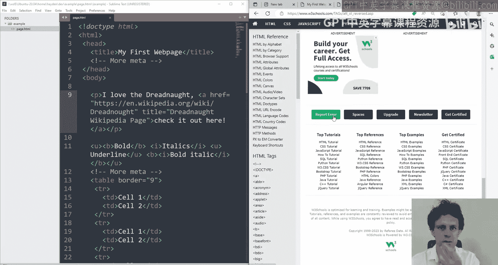

Sometimes web pages don't really do it， Wikipedia probably has a bunch of stuff because they're pretty simple oh。

 that's a fancy one。😊，Everyone's got such fancy things。There you go， view history。

 past revisions of this page， Alt shift H， there go， I didn't know you could do that Alt shift H。😊。

Shortcuts， the things you learn， but we can also， if we'd like to instruct it to actually open it in a new tab。

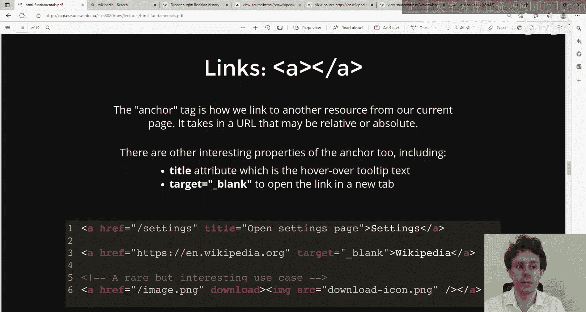

By going target equals underscore blank， which essentially means the target of where this goes in the blank page blank tab。

 That's how when you click on links， sometimes they open up a new tab。

 Some's actually coded that in the html to specify you know where and how that should go。

 So that's super interesting。 So that's the basics of links you can link internally and you can link not internally too So you'll see that some links like this are just to Wikipedia outright other links like this particularly ones that don't start with http or https they are linking kind of internally。

 So you'll see for instance here that there's this is on Wikipedias source code。

 they have an hf to this here。 but have a look at this website。 It's w Wikipedia org。

 So when I click on this。 it's telling me that I would like to go to Wikipedia org slash wkilashfi USs Texas。

 So when I click that it takes me to that file。 So if you're kind of sending within your website you don't really need that HttP or。

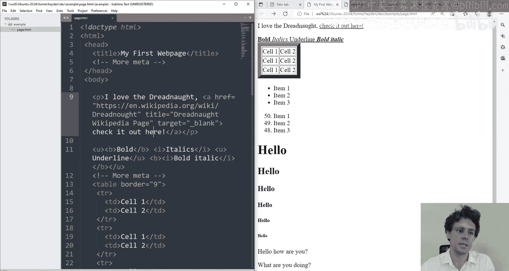

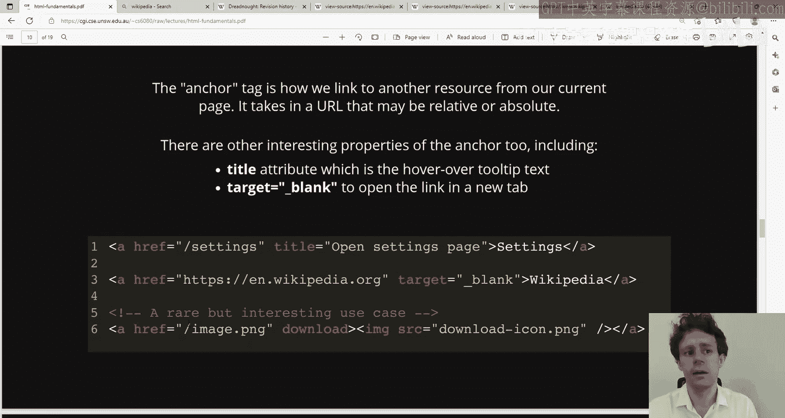

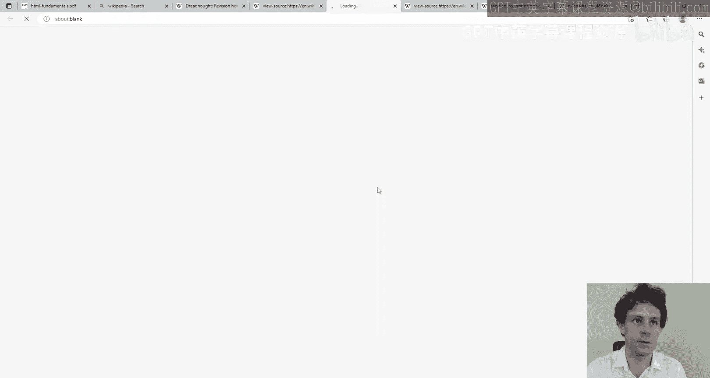

URL， but if you're sending away from your website， you do need that。

That'll make a bit more sense as we go as well。Now， another fun tag is the image tag。

 The image tag is one of many HTML properties that is known as a void tag。

 and it's kind of our first interaction with a void tag。

 A void tag is a tag that doesn't have anything inside of it。

 There's no open image close image because there's the tag design does not do anything with the components inside。

 and therefore it doesn't have open clothes。 It just has this。 It's like image。

 and then at the end of it。 it's that little slash。

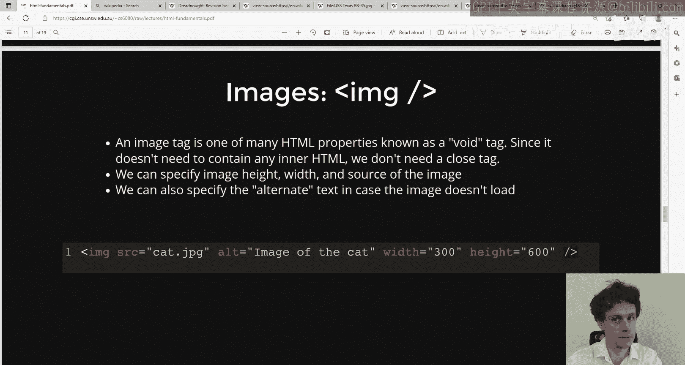

Right angle thing。Right angleton。 Yeah， sidearrow or whatever they call it。 So， for instance。

 if I was to go and add an image to my page， it might look like this image。 That's the image tag。

 There's no open image close image。 It's just image。Like this。

 But the way it renders stuff is by taking in a whole bunch of attributes like this。

 sawce alt with T。 and we'll look at a few of these。

 but I can literally just go and grab an image off the internet called mini dogg。

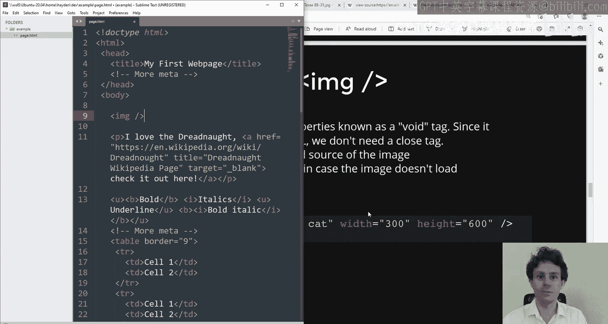

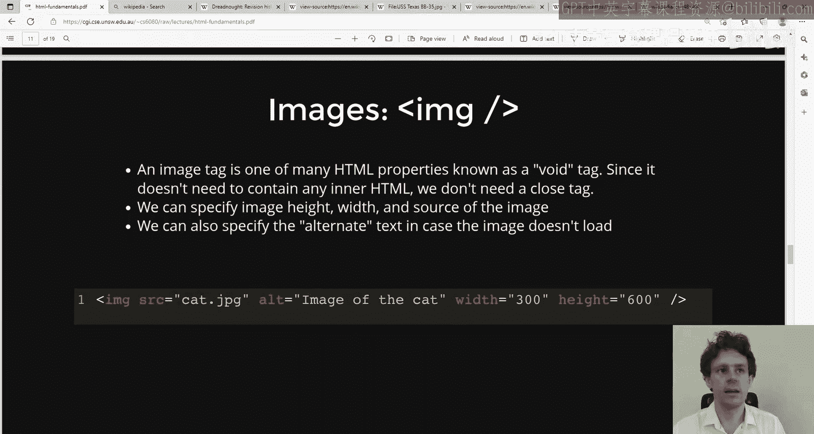

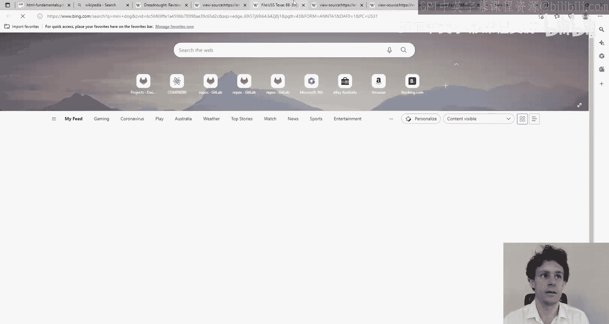

And then I go find a mini dog， what's a really cute mini dog。Oh， that's pretty cute。Yeah。

 and I just go and grab that image。 And all I have to do now is on my page。

 say that the source of that image is that URL。And when I refresh my page， suddenly。

 there's a mini dog there。 But you see the mini dog's really big。

 So I can maybe add some attributes here that say， you know， width equals 300。

 height equals 600 like that。 And now the mini dog will be。😊，Oops， I got those the wrong way around。

Height should be 300 widths should be 600。And now I have that little mini dog on my page。

 I could make that even smaller with 200。 Sorry， with 400 height 200。

 And then we have our little mini dog right there。 Now， I can also add an alt tag。

 an alt tag as an alternative to if the image doesn't load。Which is really useful in cases where say。

 like， you know， maybe the URLs down or for instance， there's a typo here。

 See So now it says mini dogg。 We'll come back to why this is useful back in like the middle of the learning in this course。

 but it comes up basically when the image fails to load。

 So that's how we add an image to the web page。 Now。

 you don't necessarily have to always load it from an external source。

 What I could do here is I could actually go and grab that image。 And if I click save。

 I can save it to a folder on my computer。 And I've just saved it to my example folder。 right。

 So I've just save it here。 Small dog breeds。 I'll just call this minidog。

 I'll rename the image to minidog And now why this is cool is because I can。

 because it's in the same folder， I can actually literally just say that the source is minidog do daypeg。

 And this will still work for me。😊，So now this is being loaded from the file right like as in the file on my computer。

 So this folder here with my HTML sorry with my HTML。

 it's got my page and my mini dogg So most websites kind of have their HTML their images all kind of in a folder somewhere as how to think about it。

 And therefore pages can just reference them。 That's what Wikipedia is doing because Wikipedia is quite literally just in these cases you've seen here it's just storing all these files somewhere you know or this is another link to another web page。

 So you can kind of understand how everything is quite well contained So that's the image tag。

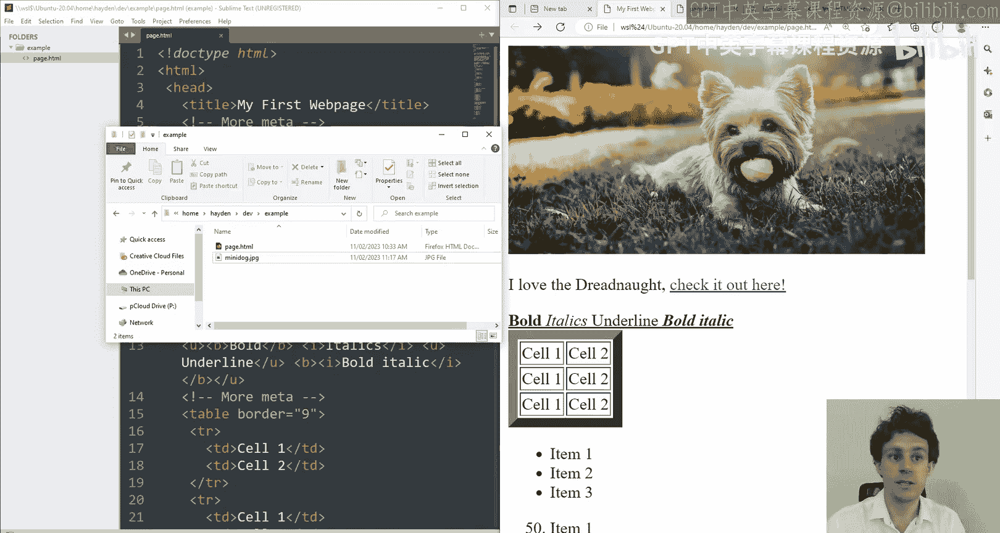

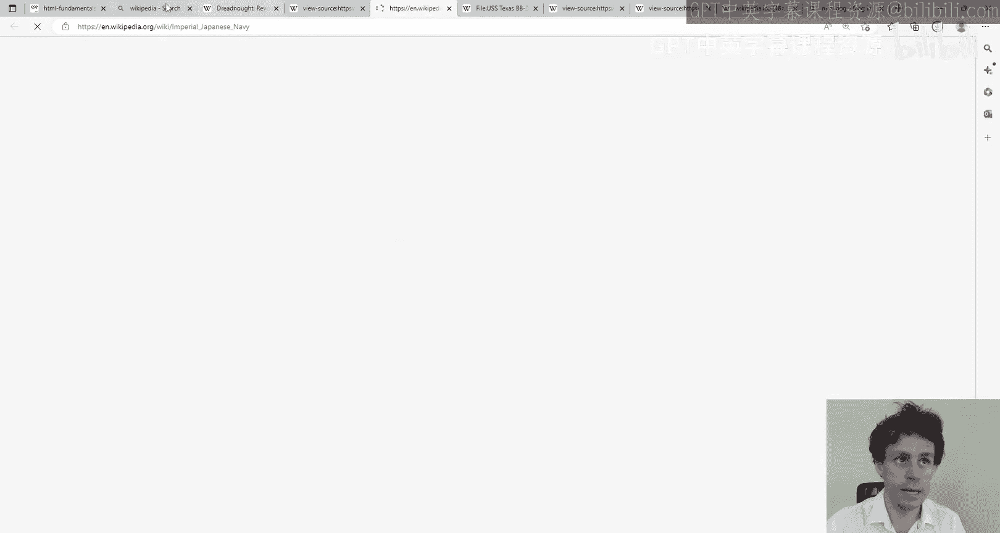

And it was our first example of a void tag。 Now， another void tag that we haven't talked about that will kind of we kind of glossed over was the line break tag。

 So the line break tag is an easy way to break up lines of text as well。

 it's like kind of a semi alternative to paragraphs in the sense that。

You can kind of use this instead of paragraphs in certain instances。

 you'll see here that when I use BR here， I've now broken up that up into multiple lines is basically just like the entity key。

 It's it's the equivalent of what you think a new line would normally do。

 It's not necessarily better or worse than a paragraph tag， It is just different。

 A paragraph tag will inherently create spacing between chunks whereas say if I came down here and I replaced this paragraph stuff with a new line you would see that it would not。

 It'll be more kind of tight like that。 So paragraph is a great way to get that kind of inherent layout benefit。

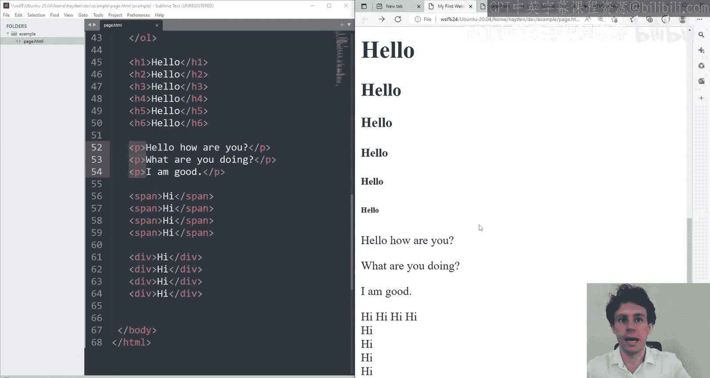

So yeah， that's the use of that。 Now we're about halfway through。 We've also got forms。

 Form is a lot to unpack。 We're gonna these， these are all forms here。

 So we're going to go through each of these slides， right， that's most of the rest of the lecture。

 really， because forms are still kind of the majority of where you'll be dealing with unique HTML。

 I's say now a form covered when we do non manipulationipulation and jascript in a bit more detail。

 But in essence， a form is just a section that contains a series of inputs。

 Now you've interacted with forms all the time right， like let's say you go to Google。

 You could argue that。

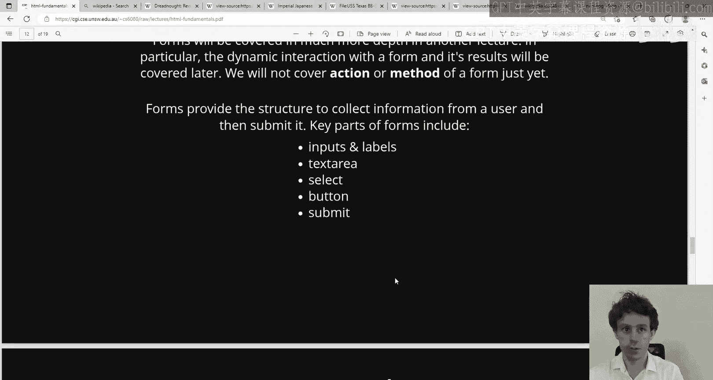

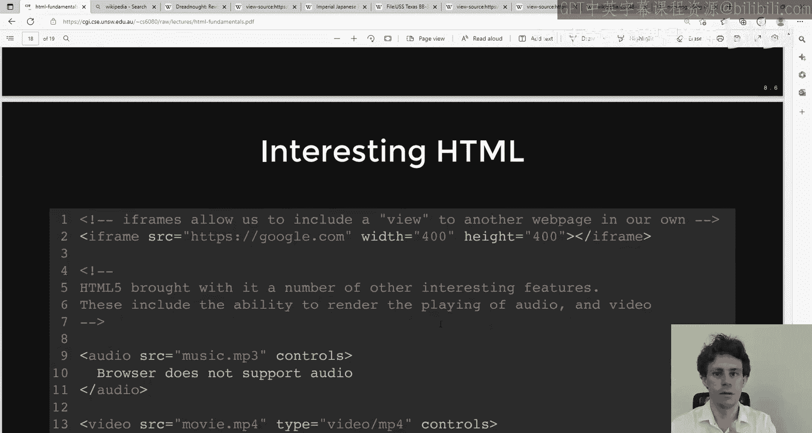

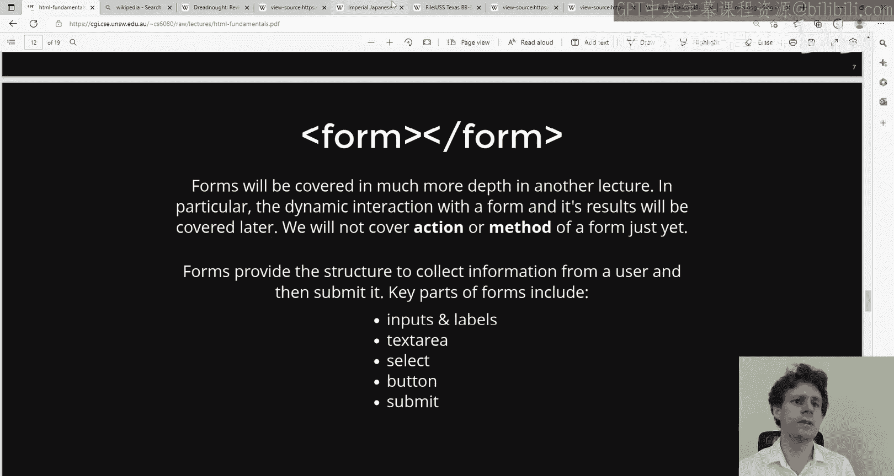

This here is a form。 It's an input， and then you search it。 right。

 There would be lots of websites like this。 There's a form as well。 It's not just search bars。

 Let's say I go to view history。 This is forms here where you can like select things。

 different inputs， for instance， like that。

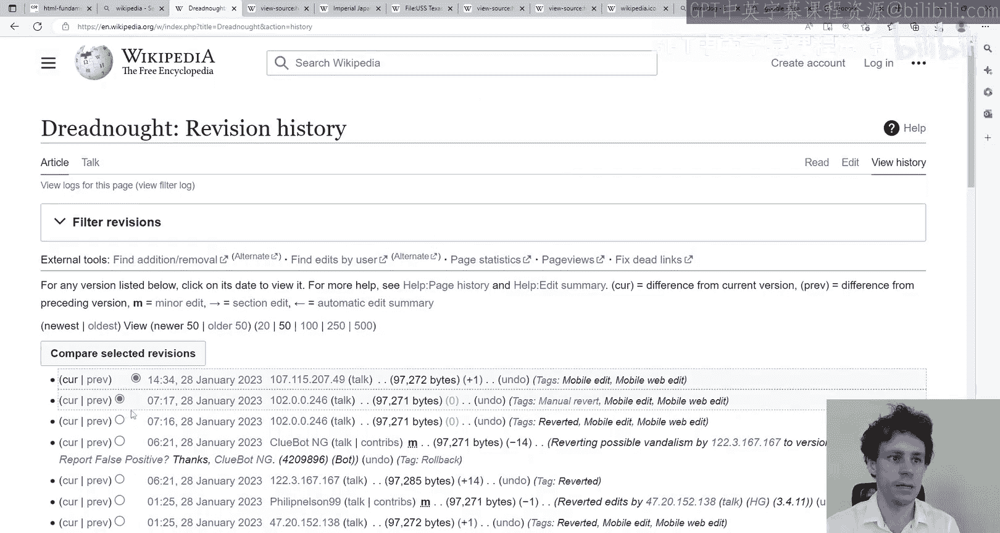

The forms are everywhere， but a form tag， which is what we're really talking about。

 is just a grouping of all of these elements。 So it's not super。

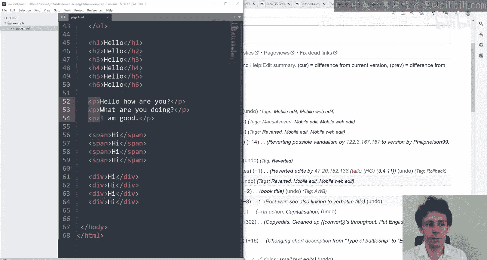

Clear。Exactly。What the relevance of this form wrapper is。

 yet it'll make more sense once we go through some of the inputs。

 So I're mostly going to look at what's inside of a form。 So if I come back up the top here。

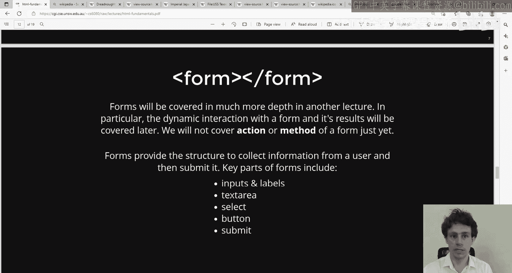

And I'm going to go make a form block。Like this。 And now let's look at what we can put inside the form。

 Now， probably the most common thing to put inside a form is an input。

 An input is quite literally that kind of rectangle thing where you can type in generally， right。

 that's the most common form of input。 But there are other types of inputs like the radio buttons。

 The check boxes。 There are hidden inputs。 What else we got。 Well。

' that's the main three we're talking about。 So let's look at a few examples。

 So one simple input is our text input。 And all these different types of inputs are distinguished by their type。

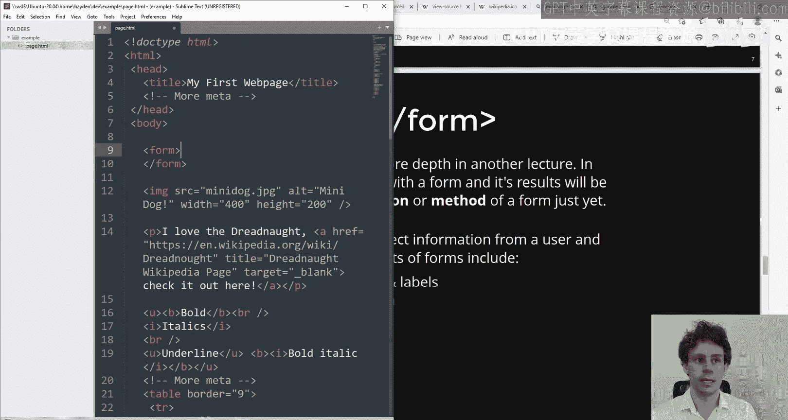

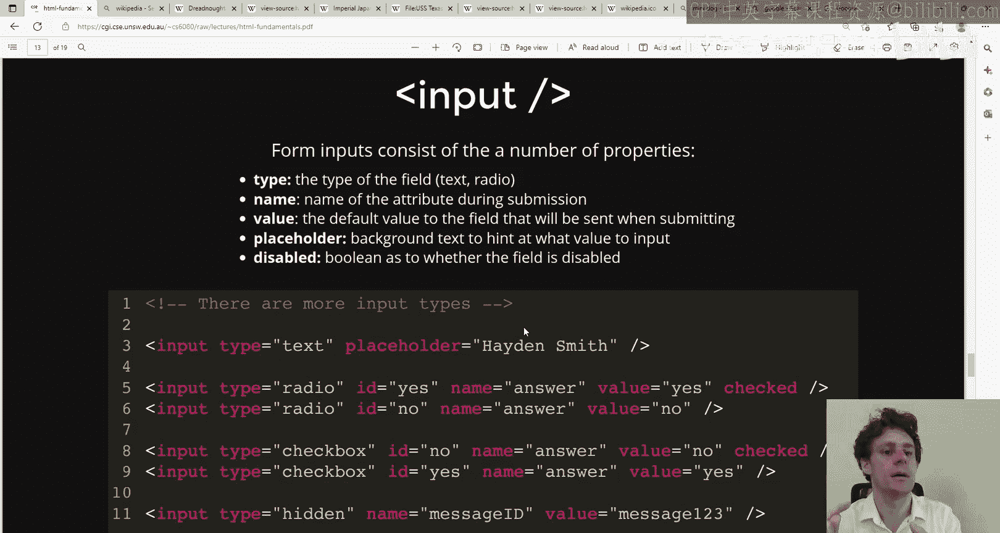

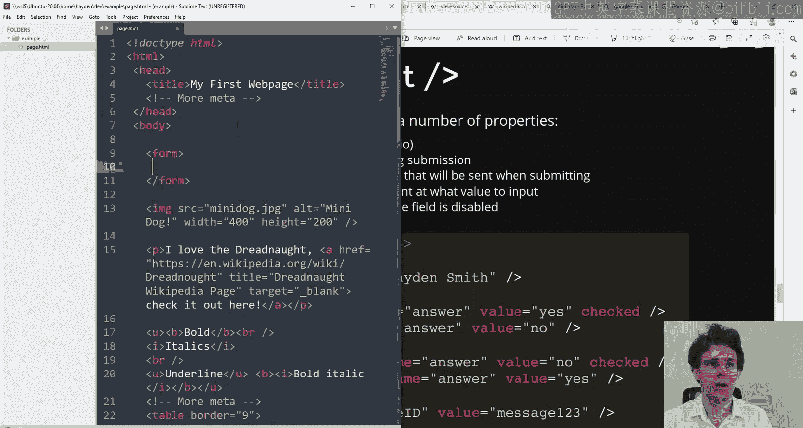

So up here you can see this is my text input here that has a certain type。

 You can also have another input that is number。 This is a newer type of input。

 I might use BR here to help separate these up。 A number input will generally only take in numbers。

 it's rendered by the browser so a text input will take in anything。

 A number input if I type in letters nothing is happening。But if I type in numbers， lots happens。

 and you can press up and down to kind of that's been pressing up on my keyboard。Right。

 like a lot of times。 So， and then， you know， down up， down up。

 So they're two really simple types of like text or number inputs。

 I think there's also another that's like email。Could be wrong。I can't remember。

 I'll looked that up later。 It doesn't matter。 You can Google all this stuff right again。

 It's like HTML form input types。And straight away。

 you'll get another W3 schools page where they look at all this stuff。

 you got dates like dates is another type of input。

 Some of these inputs are actually kind of new and as in they've kind of appeared in the last 10 years because what this means is that rather than programmers have to go and build all these complicated web pages with like date pickers and it's a lot of coding to get this right。

 They just say， you know what browser， you do it。 So this is all this is all done in this case by the Microsoft Edge browser I don't really use this normally。

 but。

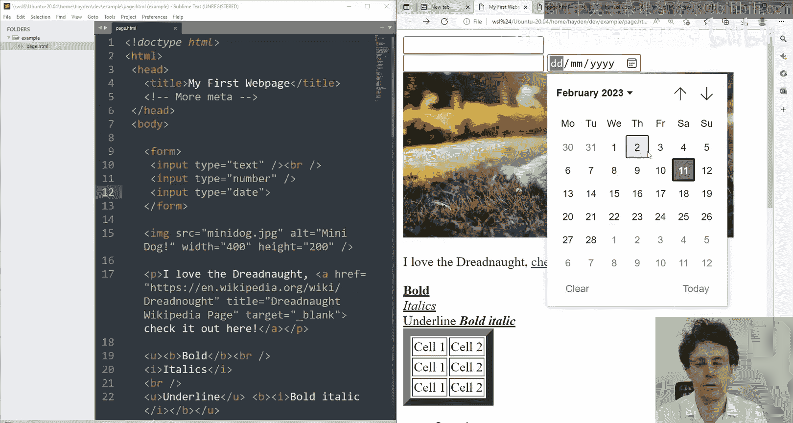

It's all just kind of this。 So this is all done in browser just because I said it's a date as opposed to a number or text。

 So you can go look up many other types of that， if you'd like。But in terms of these inputs。

 most of the time what you'll see is that each input will have some kind of ID or name。

 this might be called， you know your it's called like first name and I'll say put first name here like this will simplify that page down and then you enter your first name in there but you can also put like a placeholder in。

You know so placeholder might be like John Doe， a fairly generic name and this this is how this appears。

 if you've ever seen on a web a web page that there's text that's kind of gray when you click on it and you type it disappears。

 that's again， that used to be kind of hand program back in the day。

 but now it's it's just a property and there's so many more properties that you can use than just what we're looking at here So that's a text input。

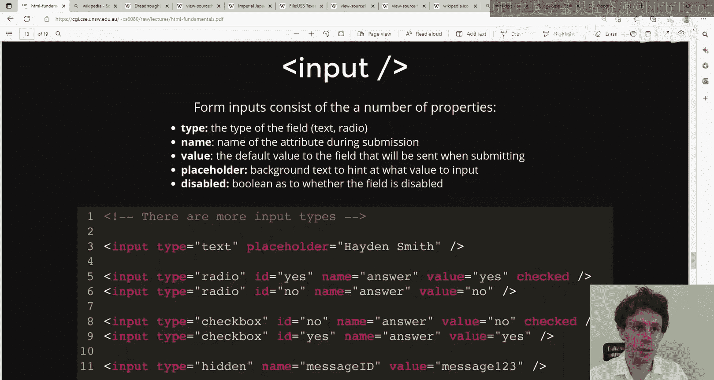

We also have radio and checkbox inputs。 So a radio input input type equal radio。

And a checkbox input will look very familiar to you。Right。Like this。

 But the main difference between them is generally a radio input is for when you have many options that only one should be clickable and a checkbox input is for when you might have many options。

 but all of them can be clickable So Ill give you a good example。

 an example radio button might be what's your you know age and then we use a Br and then we'll say you know18 to 25 25 to 35。

35 plus or something like this。 And then we'll go and we'll go and put a radio next to each of those。

 Now you can't be all three of those or more than one of those at a time right。

 but you'll see right now if I try and click on them I can select them all。

 And the reason for that is that the browser does not inherently know that they're related because you could imagine you might have many different groups of radio inputs on the page。

 So I actually need to kind of give it a name。 and I might call it age。

 Now the name tag is used by forms。On the browser to figure out what are related。

 So now when I click on these。They're all kind of mutually exclusive because of that name property。

 whereas if I come down here and we say we have another thing that's like。😊。

You know what's what would you call it hobbies or say， and the hobbies might be like， you know。

 dancing， singing， running。We might have a checkbox here that you can you can select。You know。

 as many of these checkbox you'd like because they checkbox。

 checkbox are all turned on and off independently。

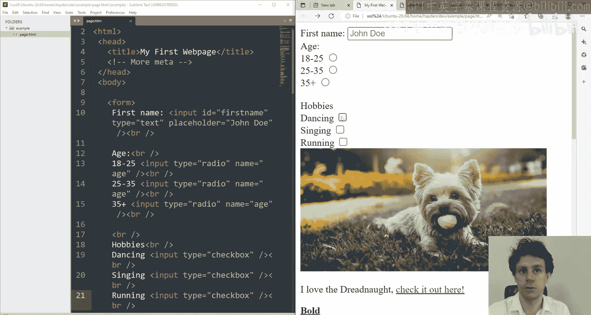

knowSo they're kind of the three key types of inputs， there is many more， there are hidden inputs。

 there's that big list we saw before， but there are all ways of just capturing user input。

 you can disable any type of input as well。

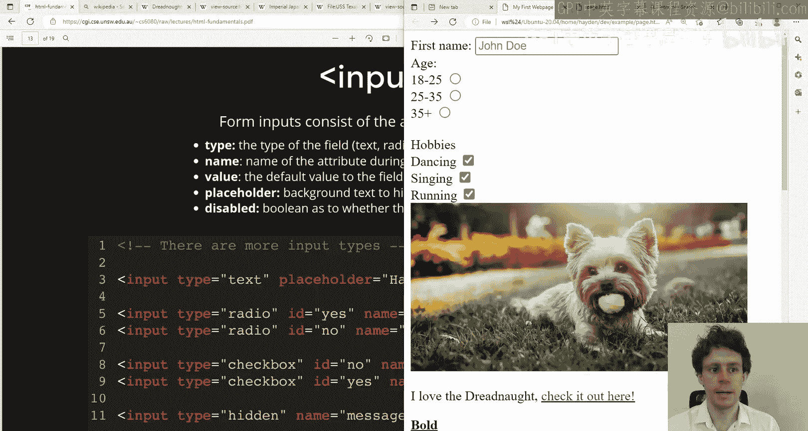

So I can make this one disabled， which means I can't edit it， you can make a radio dis。

 which means you can't click it Now all of this might seem kind of pointless in a static sense because you're like why would I disable it。

 why would it be there if it's disabled Well， later on when we learn about JavaScriptscript and how you can dynamically modify web pages that's when you'll start to see okay。

 there are actually times where say you know if someone you know。

Clicks on 35 plus you might disable the running one because they're too old to run or something。

 obviously， they're not。 But you know what I mean， you might you might have some kind of rule set around that。

 And that's that's that's what we'll do when we get into the dynamic parts of things so。

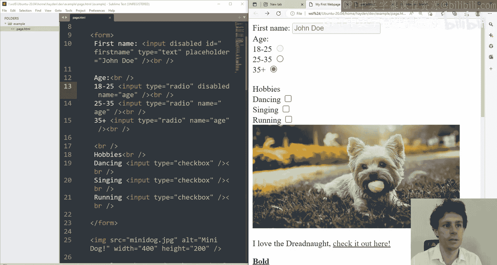

That is inputs。We have another few types of inputs that aren't just like standard inputs。

 One of them is a text area。 A text area is the big blocks of text that you've seen， text area。

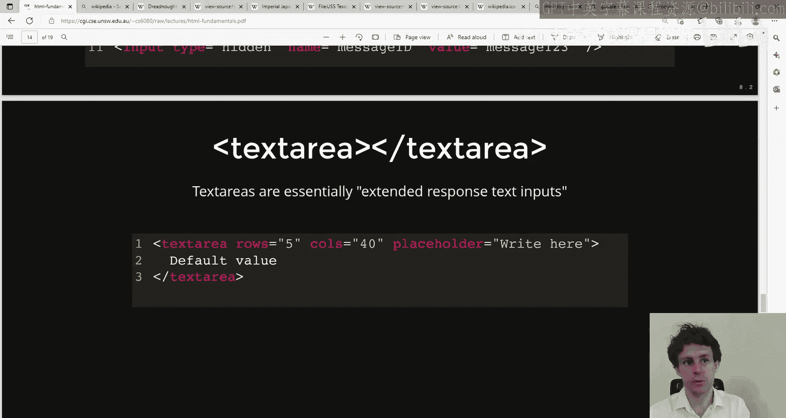

Hello。Doesn't matter。 We， we don't need anything inside of that。 Text areas do actually have。

 they're kind of built a bit different。 It's very interesting。

 Text areas are the big extended pieces of text you have。 They do have this thing inside of it。

Because you can put light。Start a info there that's different to a placeholder and in fact。

 when it comes to a form input， a placeholder is John Doe。

 like you could actually prepopulate this for instance。

 with like text like Hayden and when you give it a value that's actually saying that's the text I want you to put in there from the start like this。

Similarly， you can make a particular input。Checked or not by you know， adding checked。

 you don't need the equals true。 But like， you know， you can add checked there for this。

 if that's not there， then it's not checked， you know， there's there's lots of properties。 Again。

 you can Google all of that stuff。 So text areas where you go and put multi line text。

 an input type text is for single line text and a text areas for multi line text。

 you can specify the size of this， you can also give it a placeholder too if you'd like to。

 So if you don't put anything inside of it。

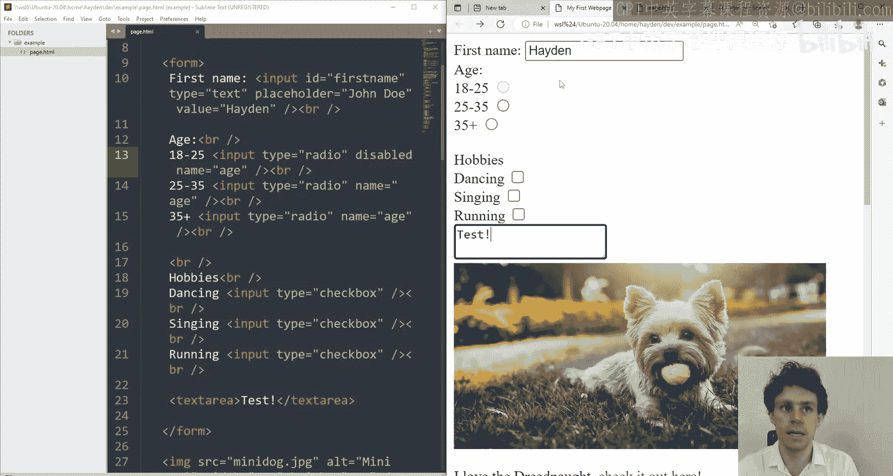

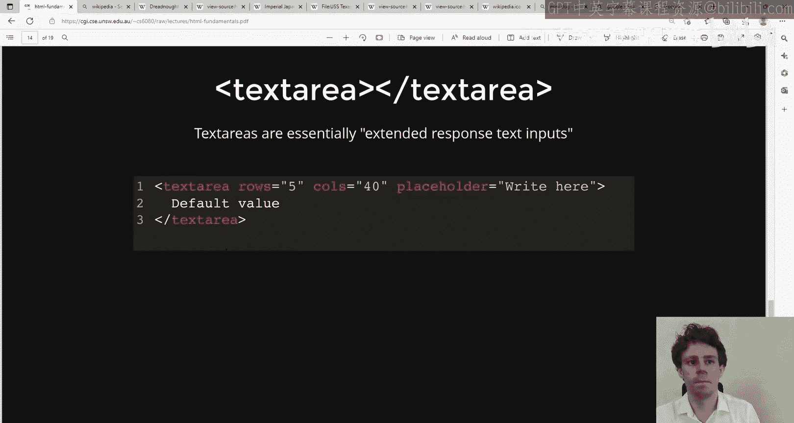

Um， you can put， you know， tell us about yourself， dot dot。

 dot like this and then suddenly theres that。You know， it's pretty neat， pretty easy to work with。

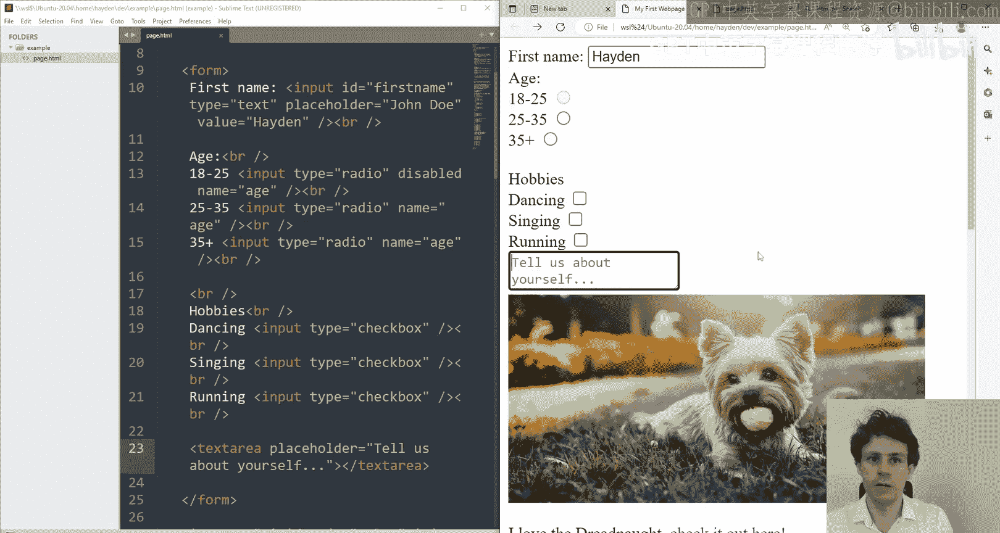

We also have。A select a select is a drop down。 So a select is a drop down box。 These are also very。

 very simple programmatically。 Sometimes this might be like this this is it's kind of an alternative to radio in a sense。

 like radio and select。

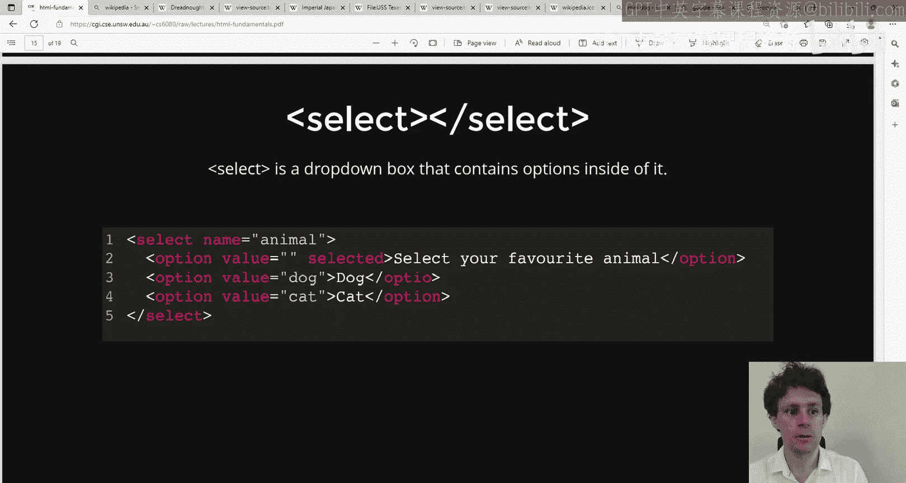

Often achieve the same purpose。But it's selects are often really useful for long lists。

 you'd probably find。 Or when you want the， it's， it's really when you want the Ui to be more compact because radios take。

 you have to see all the radio options at the same time。 whereasas for a select。

 I can a select is a series of options。 and each option has a value， which is kind of like the key。

 it's like the technical term for the value。 So let's say that we have something here。 that's like。

 you know。What suburb you live in in Sydney， Sa， you know， we might have Kensington。

And then the what's inside the HTML of the option， That's what is actually like displayed on the page。

 So we might have a few options like this like say， okay， we got Hit fill。And then we have chat word。

You know， different places you can live。 And what these will turn into on the Web page is a dropdown。

 Oops， I need another B R there。So now you see that my suburb probably don't。Doesn't matter。

 My suburb is Kensington， I can click on it and then I can pick certain ones。

 and if you'd like one of them to be selected by default， obviously you could move it to the top。

 but you can also just put a selected tag there and then yeah sorry now that's selected hrstel by default。

 if I put it here at selected chatswood by default。

 So again a lot more you can play around with there too。

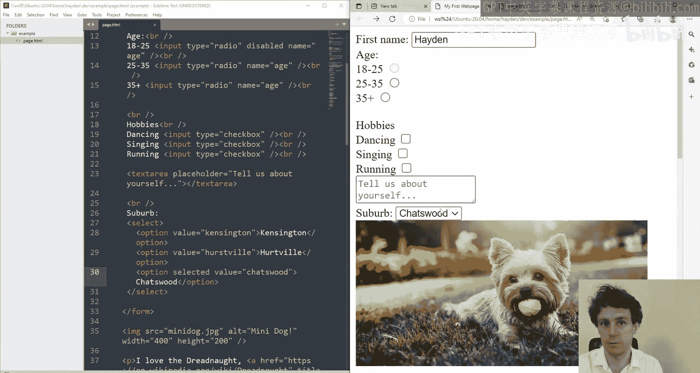

嗯。Labels are quite interesting。 Labels are often tied to checkboxes and radios because what you will often notice when you start playing around with your page is that you have these nice little radios up here。

 but when you click on them， often you'll want to click on the text intuitively。

 but when you click on the text， nothing happens right you actually have to click on the radio。

 So the way around that is that if you give your input and ID such as age 18。

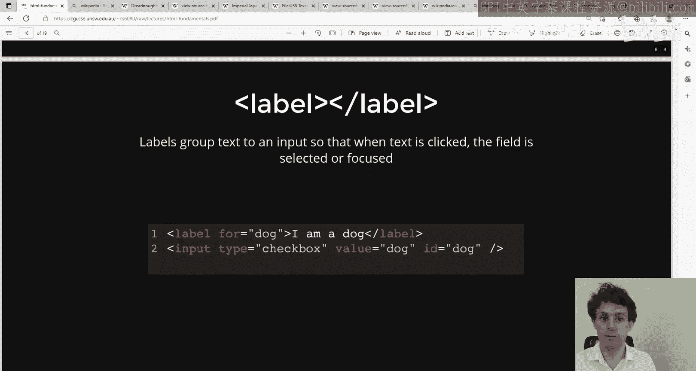

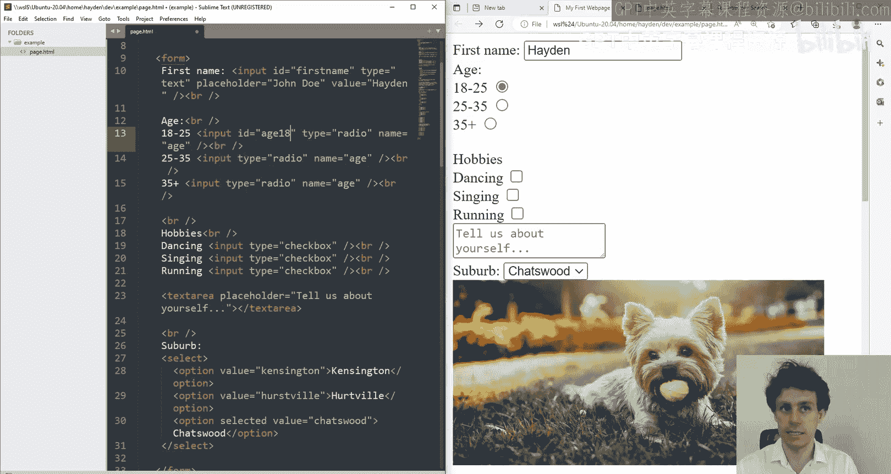

What you can do is next to that me look at the code example。

 you'll see that next to that you can actually like use a label and you can say it's for something with a particular ID and that will kind of tell the browser to link them together So here if I say you know this is a label for the element with ID age equals 18 Well the browser will do now is it knows that when you click on that radio。

 obviously it's the radio button but when you click on the text it will highlight that radio。

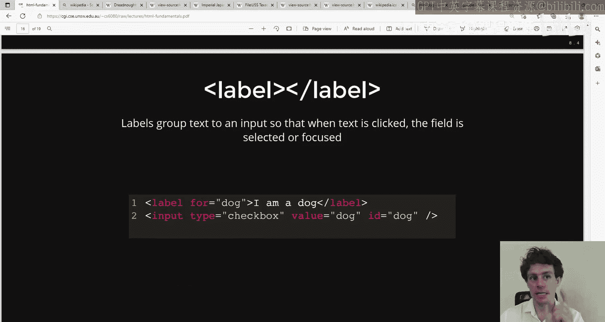

2。This is a great way to improve。Uability of your website because you can just go add a few more here like age equals 25 or IDd equals age 35 like this。

😊，Label 4 equals age 25。Probably should have closed that， Oops see， making a mess。

So we've got a closed label there， youve got another closed label here， there you go， age 35。😊。

So now we have a nice little light you can kind of click on these text items。 So labels are a really。

 really easy way。 Like you don't， it might not feel like a big thing。

 but you'd be amazed how often you click on the text without realizing if you don't believe me。

 but I'm sure most of you do。 And then we finally have our button。

 our button is exactly what it sounds like It's a literal button where if I go and put。😊。

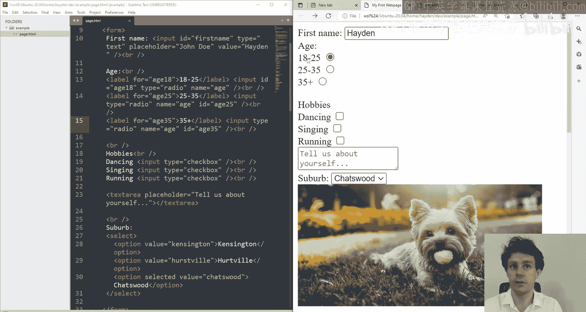

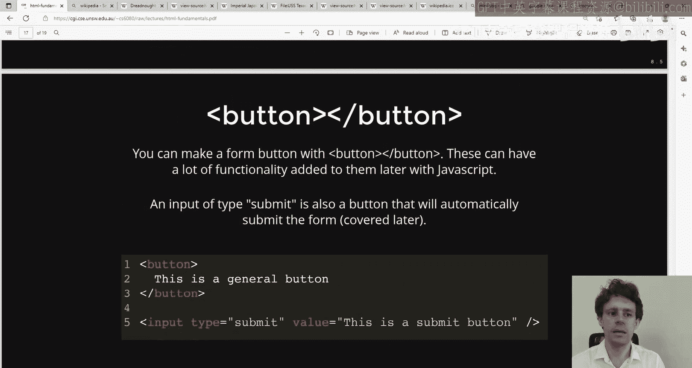

Let's go and put one down here。Button， click me。Now because this is just a basic HTML intro lecture。

 there's not a lot that happens with buttons， buttons are often used with JavaScript to create some kind of action。

 so when I click it here， normally we could make it do something like change color or send the form data somewhere。

 but today we can't do much or we're really showing you is that it looks like this。

 it's an element that you can kind of click on。There is another alternative way to put a button in。

 which is to create a submit input type。And a submit input type is pretty much identical to a button。

 except it just is coded a little bit differently。 So these two things kind of do exactly the same。

 Now， a button is generally more useful because it's it's very versatile。

 You can use it for a whole bunch of things， which again will make more sense when we do Javascript。

 But this input type equal submit it's kind of the old school way。 And what actually happens here。

 And what this is used for is that typically。When you have a form。

 you specify where you want you specify firstly how you want the form submission to go somewhere。

 which is just gonna to be a get method。 Don't worry about that。 Let's just leave that alone for now。

 And then there's an action and the action is where it gets sent to。 So， for instance。

 if I send it to result dot H， what this means is that when this form is submitted。

 All of the content in this form will be sent to a web page result dot Hm。

 and all of the information about it will be sent by the URL。

 So now if I save this and we refresh our page， pay attention to the URL up here。

1 I click on the submit button。Well， it tried do file not found。 That's okay。

 This doesn't work because many of these things don't have names。Any form inputs that have names？😡。

For instance， first name here， any form inputs that have names They're all packaged up and sent via the URL there。

 First name。 none of the radios were sent because none of them were clicked。

 But if I click on one and I send it， you'll see it now says first name equals hiddeny and and age equals on。

Now the reason it says on is because I didn't give any of those radios a value and I need to give them a value。

 I know this is quite hard to read but so let me make it bigger， I need to give them a value。

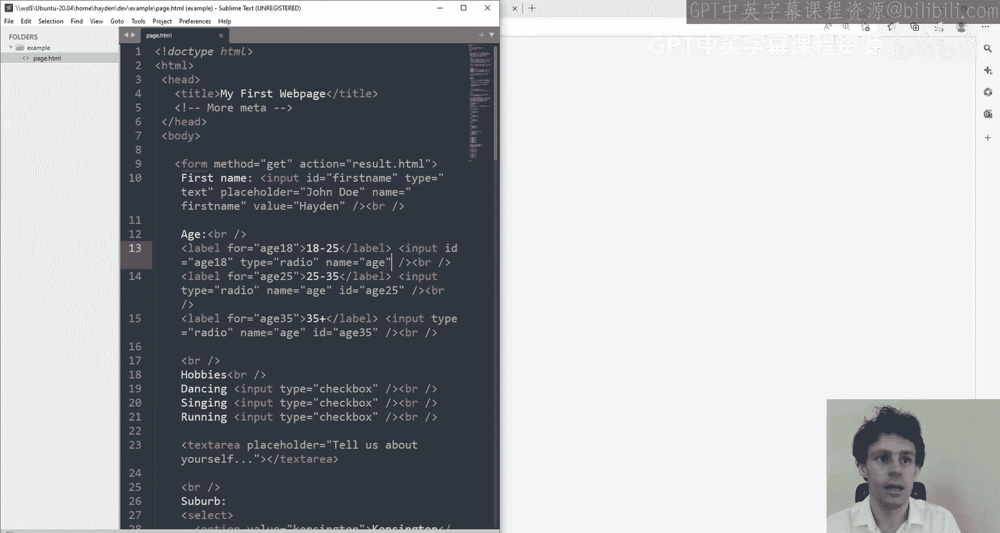

Name equals age。 Oh， let me put that Id in the right place。

 So at least it looks consistent without a value， it doesn't know what each of these kinds of inputs is called。

 So now when I say value equals age 18。Or maybe I'll just go and copy this。

Like that now when I come back to my web page。

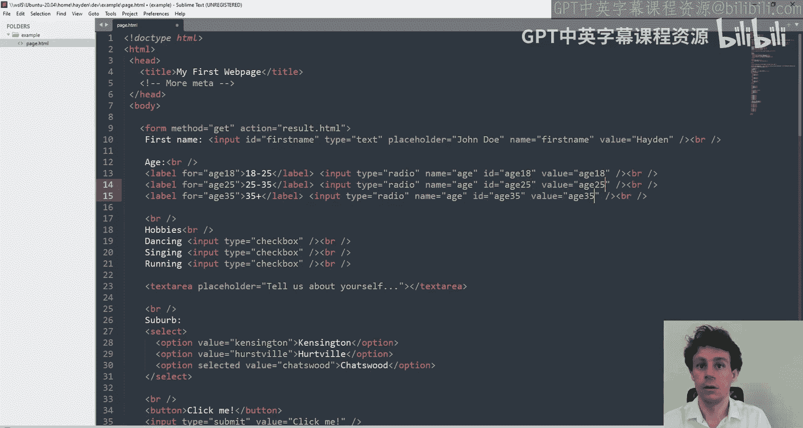

And I click on this and that when I click click me。

 you'll see it says first name equals hidden and age equals 25 Now we don't often submit forms like this in modern web everything I've shown you since we have looked at the method and action it's kind of you're not really going to use it much This is more just for background because it's how the fundamentals work you'll typically be using fancy ja to deal with inputs but the point is that what a form block is historically is it's a block where there's a submit button somewhere in there and when you submit it it sends all of the data to this URL with this method and all of the data is encoded。

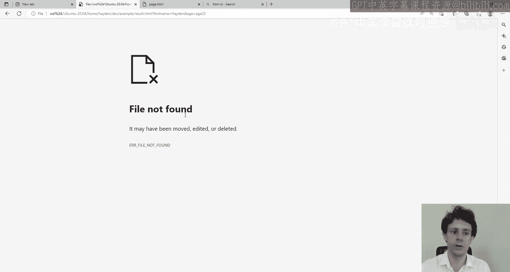

By the name and the value So you'll see here option has a value。 The radios have a value。

 You'll notice that the select didn't appear didn't get sent because it didn't have a name。

 whereas if I give it a name of suburb now when I come here and I click submit。

 you'll see it will now appear in the URL because it had a name。

 So anything with a name and value is sent。 that's how forms work again。

 don't get focused up on that weird sending mechanic that I just mentioned。

 focus on the HTML and what appears on the page， because a lot of these old school tags are still used because they have inherent mechanics around like those clicking the radios on the dropdowns that are super。

 super useful。 And then later on when use Cs to maybe clean up how this dropdown looks to make it a bit more fun。

 That's why when you go to you know random pages like you know again， Google。

 they have these inputs that feels so much better than what like this nice input here with this dropdown。

 you click on store。 and I'm sure there's something here， nice。

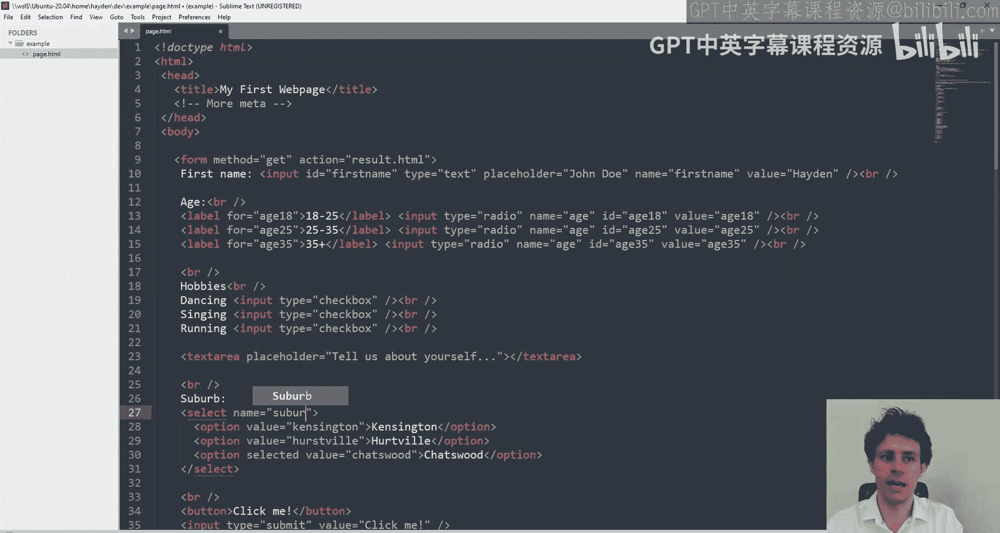

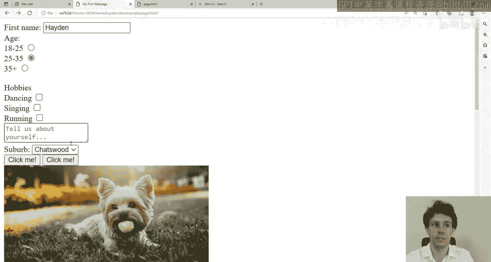

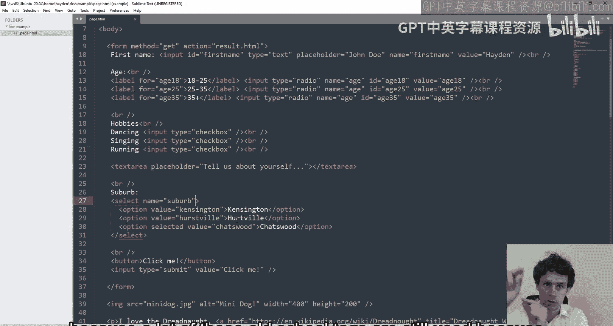

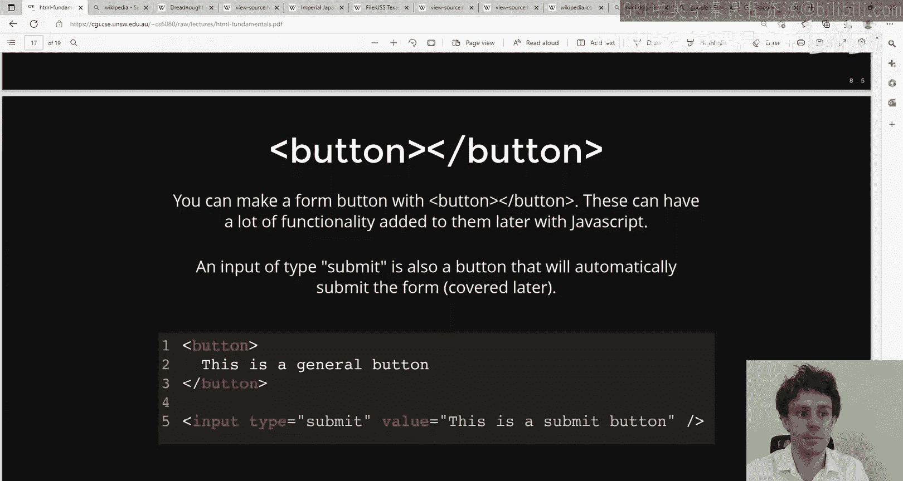

Probably no input。 look at these nice buttons， you know， a the colour， you know。

 so there's there's more that they do with that that we will come back to。😡。

So that you can get more comfortable stling things， really。 But for right now。

 it's really just structural web pages that we're talking about。

 So last thing then we have some more interesting H T M L。😊。

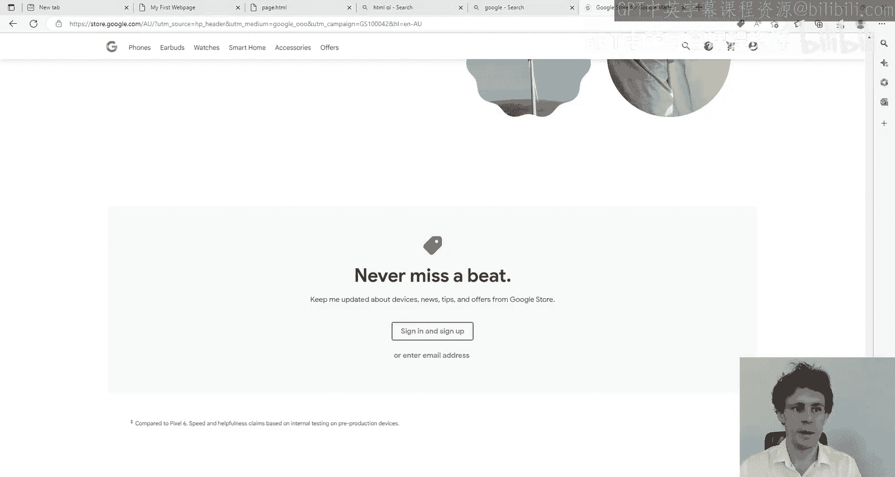

These ones。Not used too common There's actually another lecture called More tags where you can go and learn about more things you can do with HTML。

 but for now you will see that there's a few obscure things， for instance。

 we have an iframe an iframe is where you can load in another web page within your web page it's not copying and pasting it it's literally creating like a little web browser inside of your web page I can show you this really quickly。

 for instance iframe here if we then go and load our first page。

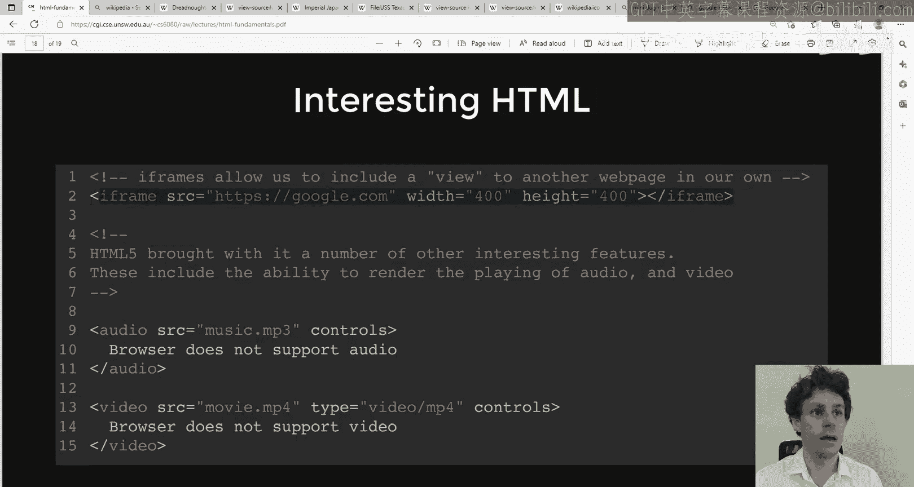

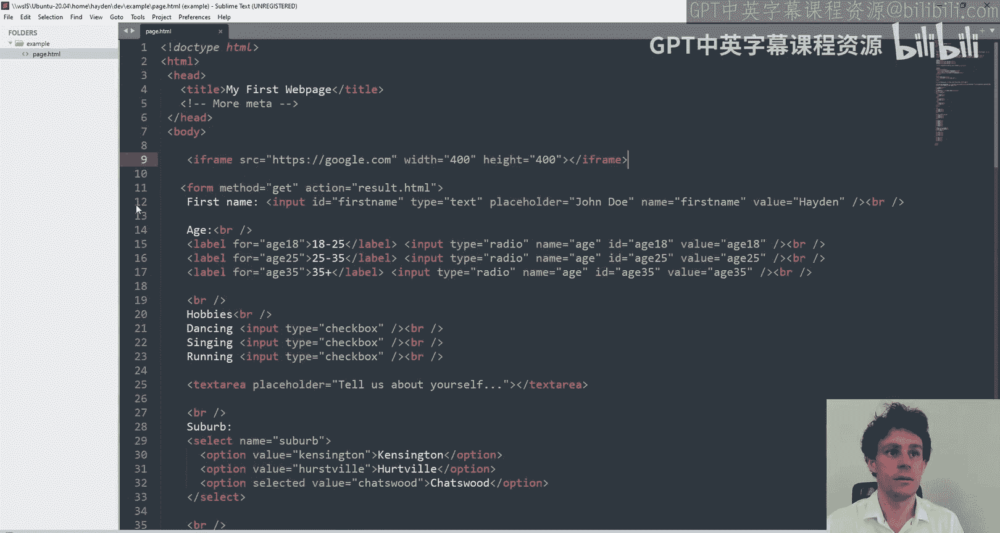

Now， Google won't actually let you do it， but there might be some websites out there。

 like I wonder if you want aW， let's try you and aW。

 Let's see if they let you load up a web page inside a web page。

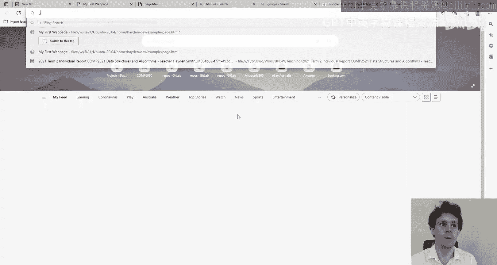

嗯。USW， will they let us？

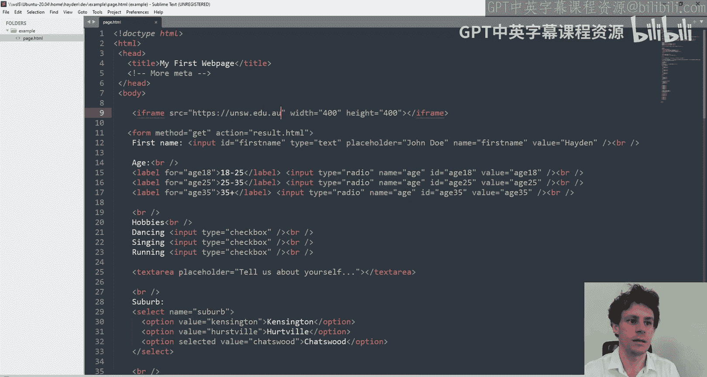

Bingers crossed， obviously a lot of websites block this。😡，Yeahay。

 so you can just load up UNSW's website within your web page if you'd like to。 Again。

 this is literally loading UNSW's page from their servers， you know， so it's nothing fancy。

 It's just a little web browser within a web browser。

 You can change the size of that if you'd like to we can do some other things like as you've seen here。

 we can go and add a video to our web page。 Let me just quickly prepare that one for you。

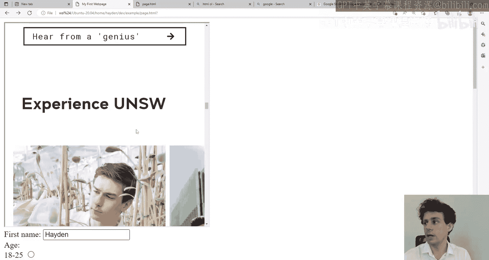

So I've just added this file calledMeetf dot M OV。 It's from some it's an old video from a meeting at UNSW years ago where everyone did that thing where they tangle their arm。

 they all grab each other's arms in a circle and let's say you want to and they try and untangle themselves and say you want to include that well you can simply do this you can say。

Copy this code video， blah， blah， blah。 Now， you notice this does have an inner Html。

 but that inner Html as you can kind of infer is not anything useful。

 It's actually just the text that shows if your web browser refuses to load the video。 Now， again。

 I could put in a random MP4 here。 If I wanted to find one on the Internet。

 often that's not going to work。 But in this case， I can just include my file。

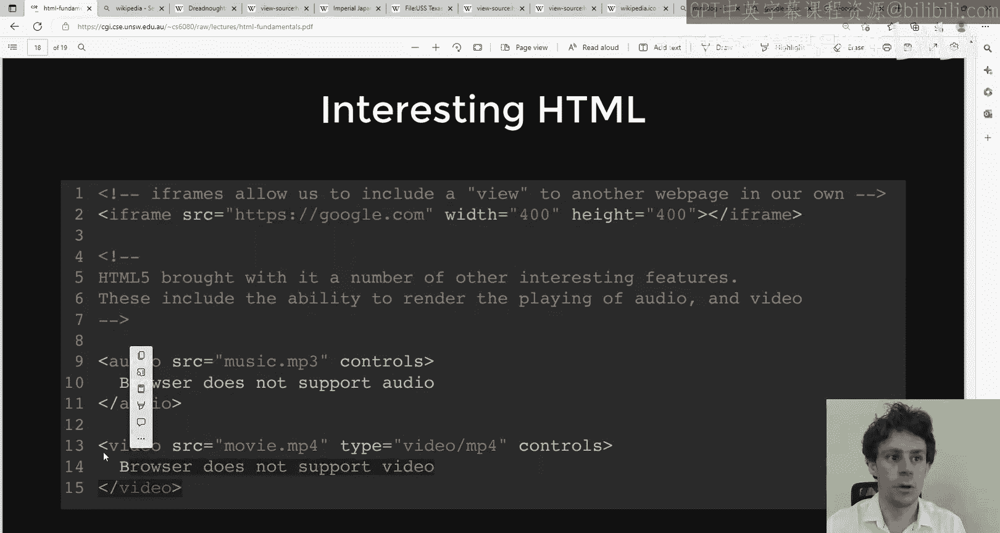

And hopefully it works Now that's the name of my file on in this folder， that's why meetingfund。

mov capital， let's see if this works。

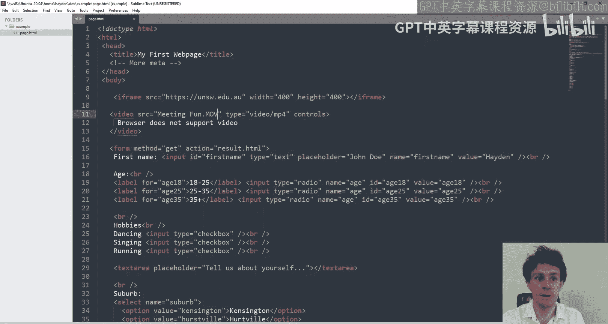

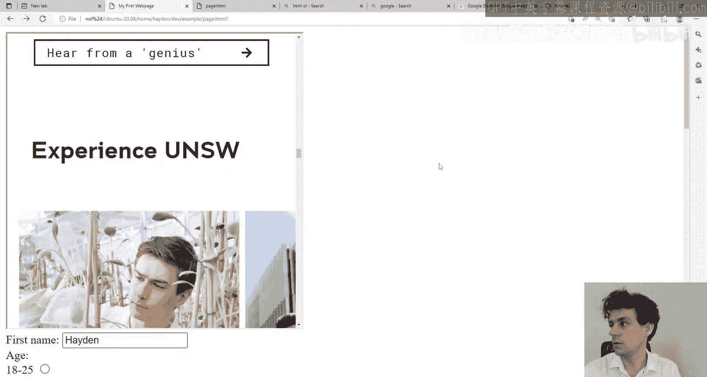

There's the video。 Now you see the video is really， really big。

 I can probably change the size of that。 I'd normally just Google this。 Let's see。

 let's try and make the width 500 or something like this。 if I see how this goes。

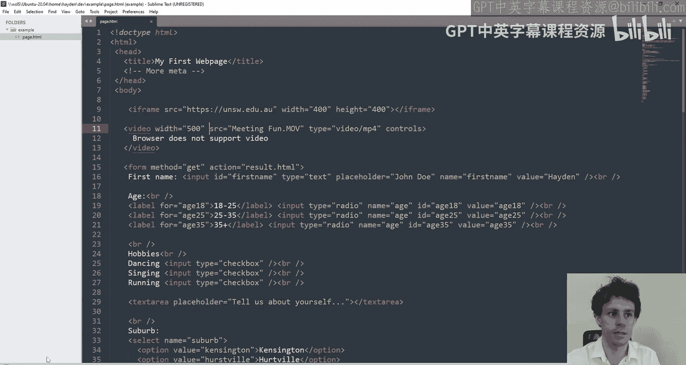

Okay， so now the width is much smaller。 And when I click play， this is the video now playing。

 So this is all the people here trying to untangle their arms。

 So if you ever play this game if you haven't you should play this game， it's very， very fun。

 It's very funny。😊，And。Yeah， that's， that's like， so that video is now included。 Now you might think。

 you know， oh， is that how YouTube works。 And it's like， no。

 they have far more advanced things than this。 There's a whole， there's a whole array of like。😊。

What I won't go into of why this is not really used。

 but generally the point is you can use it and of and sometimes it is actually used in the very。

 very background， even though they build all these interesting things on top of it， you know。

 but it's very powerful what you can do with HTML， things like this are what allowed YouTube to create more advanced technologies and many other video platforms。

 for instance， so。

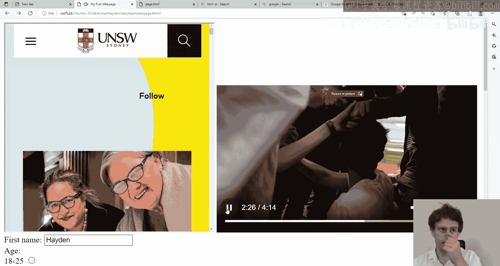

Yeah， that's， that's it。 There's a lot more。 You can include music on a web page。

 If you've ever heard sound be played on a web page。

 you ever visit a website and it makes little ding sound。

 It's like that's typically a sound file that's being loaded through the audio tag， for instance。

 music， Yeah， the audio tag where you can oh yeah， you can also add controls to it。

 that's why you saw that on this web page， there's all that play pause。

 But if you don't want to give people control。 If you just want the video to play by itself。

 Then you just remove that。 And then suddenly it's just there。 And you think， oh， it's not playing。

 Well， there's probably like an auto， Yeah autoplay。 So now you can include this video to just play。

😊。

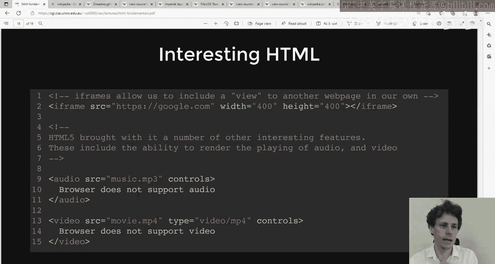

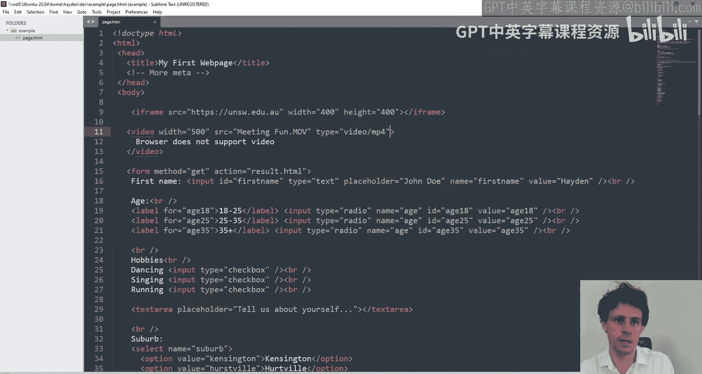

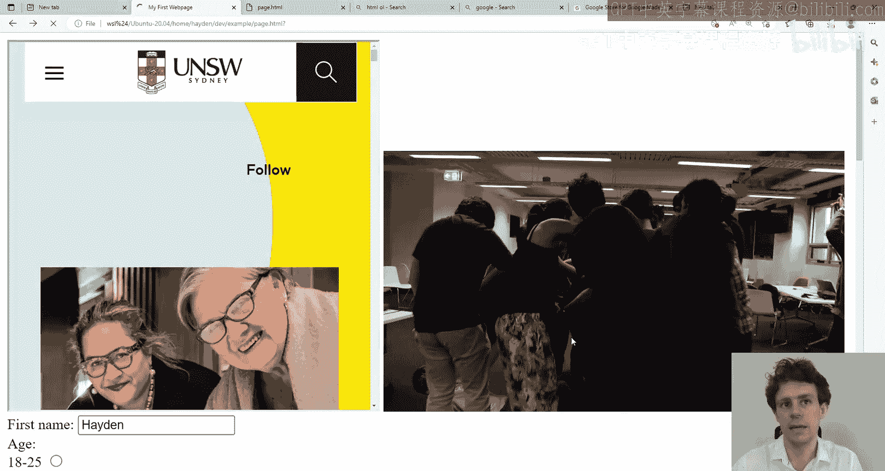

To display， maybe I need to set it to true or something。Again， you don't Google this。 Like。

 I don't keep all this。 I've been doing this stuff for years。

 and you don't really keep And you're like， oh， how do I autoplay it。 So it's like H L video tag。

 And then you look at some properties。

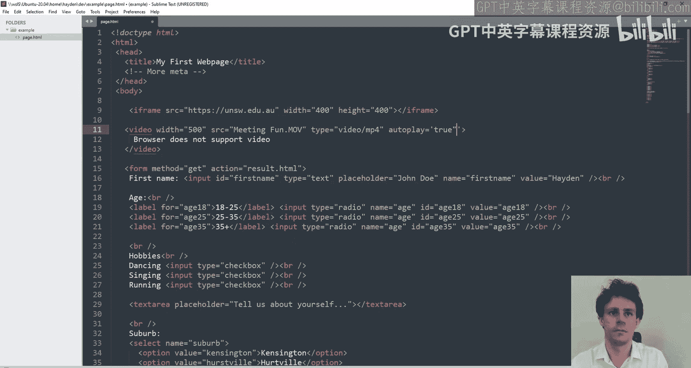

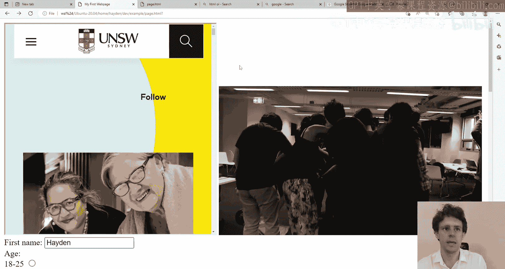

You can go to any website really it doesn't have to be a particular website there's auto play a bullyan attribute if specified the video will begin playback as soon as it can Okay and then you go back to your web page and you're like。

 wonder why that's not playing。你er。Swed， did we do something wrong？Potentially。

 this is why the docks are really important because you know。

 I don't really use this tag and now suddenly I'm here and I'm like， ha。

 I don't really know what's going on here， Why is it not playing。

 There'll usually be some kind of like。😊。

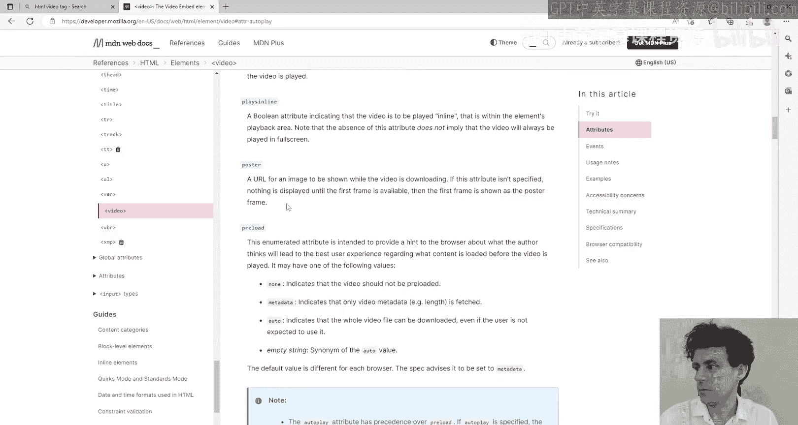

Attribute that's like play it here， which I'm just going to quickly look at and you can take this。

And you can take this further if you'd like to， there's lots more attributes you can look them up like here or is it HTML。

😊。

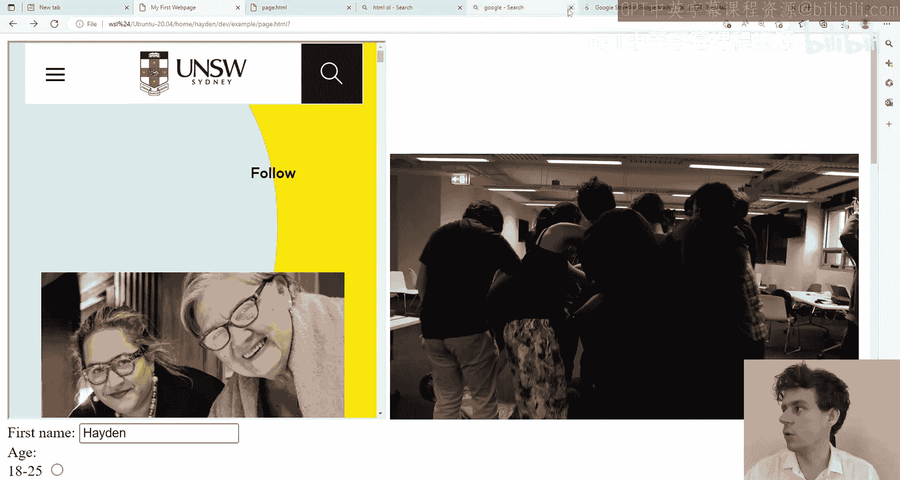

Video。UThere'll be tons of attributes you got sync like you can start a video halfway through where are the attributes video tag。

😊，Yeah， video tag， you'll see that there's tons of things here。 You can like mute the video。

 you can loop the video， You can change the width of the video。😊，Lots and lots of things， preload。

Again， tons of things I've never played with， tons of things you'll never play with the point is that's how it works。

 So that's just a few of the interesting tags here。 our iframes， our audio， our video。 there's more。

 there's another lecture on it which is extension you can go and watch that if you want。

 but that gives you a basic understanding of HTML。 Here's a little note if you'd like to doesn't really doesn't really matter too much。

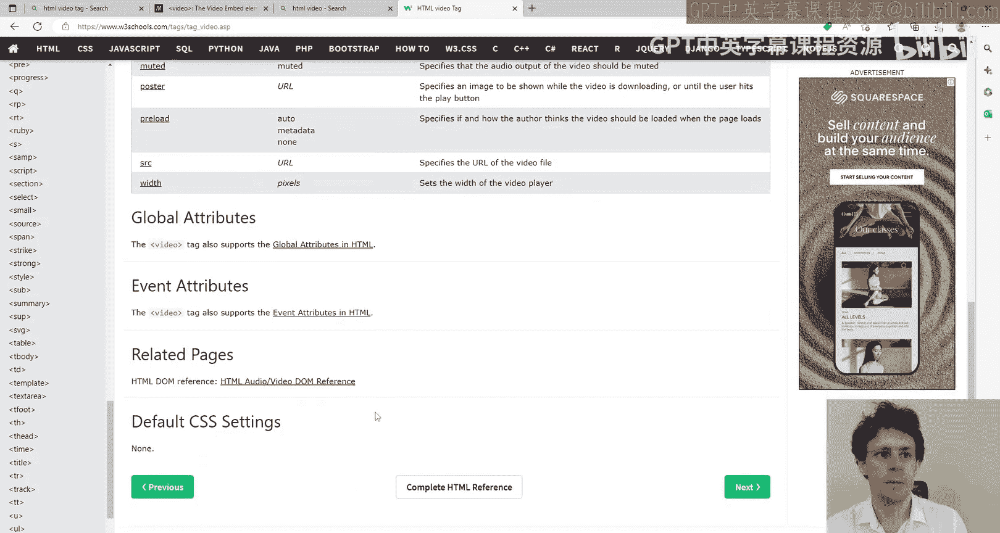

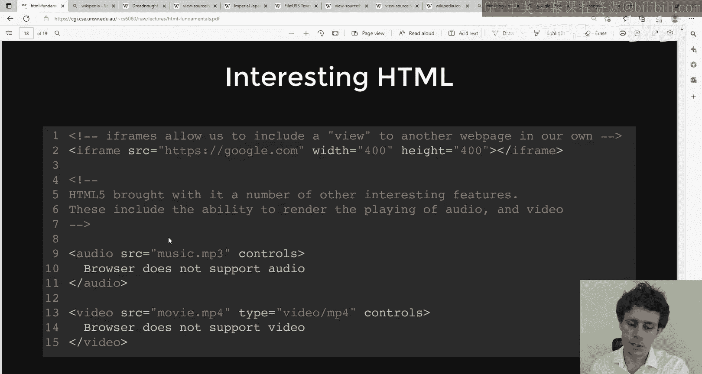

We could go into this in a super amount of depth。 But main takeaway here， HTML is a structure。

 We have lots of form inputs。 We have lots of layout tags。 Most of what we use HTML for is inputs。

And layout。 And it is the fundamental skeleton that we will then go and paint over in the next lectures。

 So thank you very much and hope that was interesting。😊。

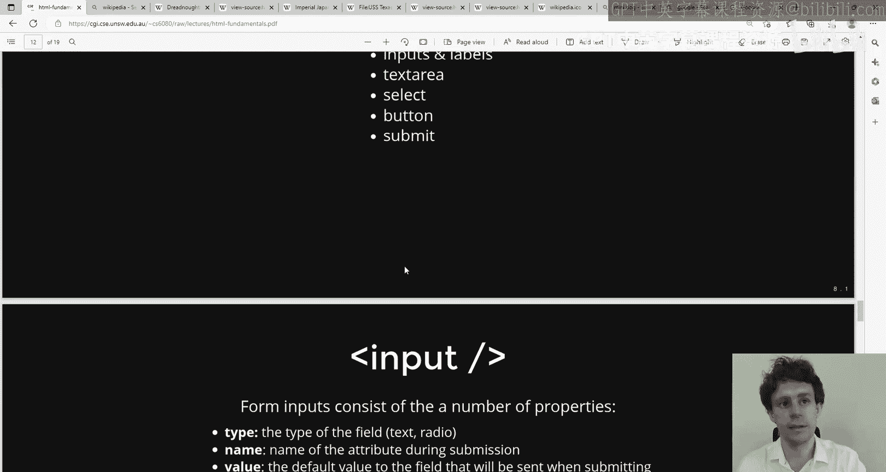