# 前端编程：04：图像类型 🖼️

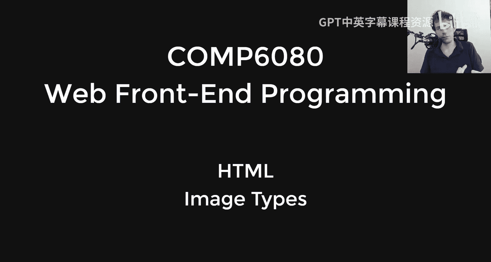


在本节课中，我们将要学习网页开发中常见的图像类型。我们将了解不同图像格式（如JPEG、PNG、GIF等）之间的核心区别，它们各自的优缺点，以及在实际开发中如何选择和使用它们。此外，我们还将探讨一种特殊的图像编码方式——Base64编码，并理解其在现代网页性能优化中的作用。

## 图像类型概述

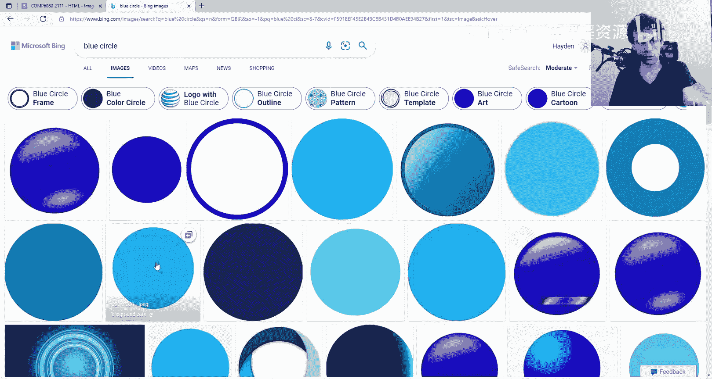

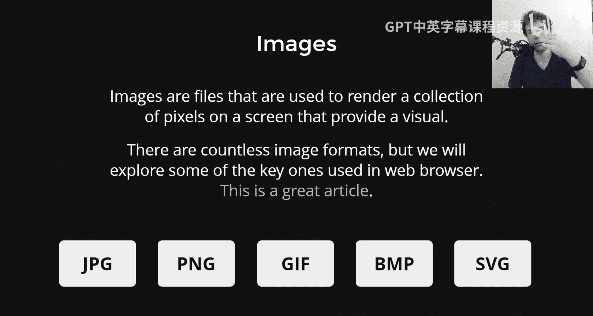

互联网上充满了图像，它们通过在屏幕上渲染像素来向用户传递信息。你可能已经注意到，不同的图像文件扩展名，例如 `.jpg`、`.png` 或 `.gif`。这些不同的格式服务于不同的目的。

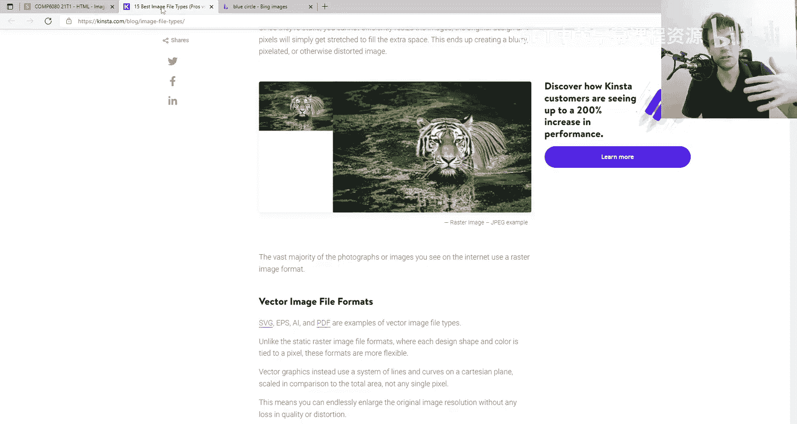

## 图像的两大类别：矢量图与位图

在深入了解具体格式之前，理解图像的两大核心类别至关重要：**矢量图**和**位图**。

*   **矢量图**：这类图像由数学公式和指令构成，描述如何绘制形状、线条和颜色。它们可以无限缩放而不失真。SVG格式是网页中常见的矢量图格式。
*   **位图**：这是我们今天讨论的重点。位图图像，也称为**栅格图像**，本质上是一个由彩色像素组成的二维网格。你可以将其想象成一个巨大的表格，每个单元格都填充了一种颜色。我们熟悉的JPEG、PNG、GIF和BMP都属于位图。

上一节我们介绍了图像的基本分类，本节中我们来看看几种具体的位图格式。

## 常见位图格式对比

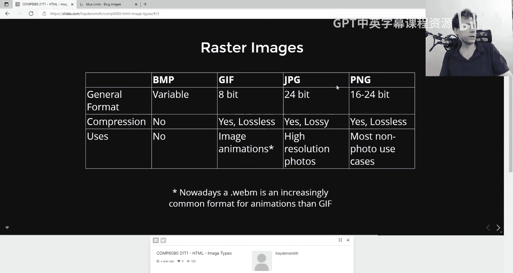

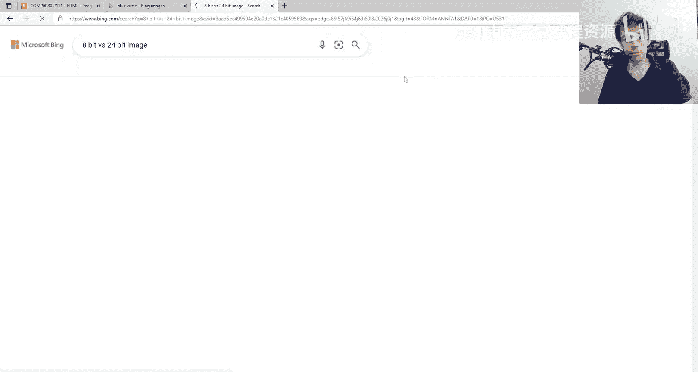

以下是几种常见位图格式的简要对比：

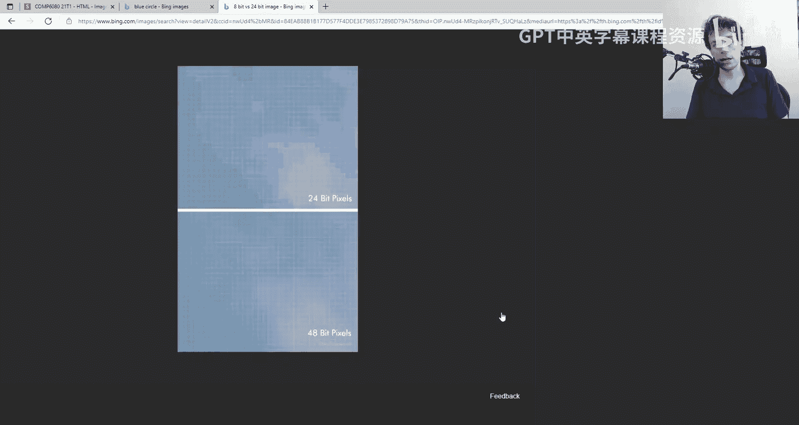

| 格式 | 色彩深度 | 压缩方式 | 主要特点 |
| :--- | :--- | :--- | :--- |
| **BMP** | 可变 | 无压缩 | 无压缩的原始像素数据，文件体积大，现已较少使用。 |
| **GIF** | 8位 | 无损压缩 | 支持动画和透明色，但色彩范围有限（最多256色）。 |
| **JPEG** | 24位 | **有损压缩** | 适用于照片类图像，通过牺牲一些画质来大幅减小文件体积。 |
| **PNG** | 8/24位 | **无损压缩** | 支持透明通道（Alpha通道），画质无损，适用于图标、图形和需要精确显示的图像。 |

目前，网页开发中最常用的是JPEG和PNG格式。

## 深入理解JPEG与PNG

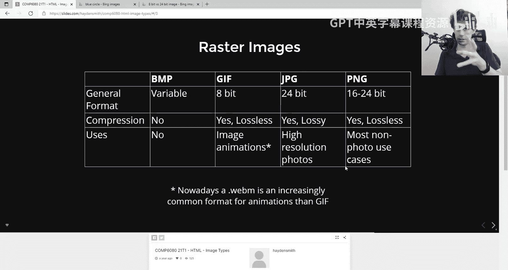

### 色彩深度与画质

“色彩深度”（如24位）指的是每个像素可以存储的颜色信息量。公式可以简单理解为：
`可表示的颜色数量 ≈ 2^(色彩深度)`

更高的色彩深度意味着更丰富的颜色渐变和更平滑的图像过渡，从而带来更高的视觉质量。JPEG和PNG-24都支持丰富的色彩。

### 核心区别：有损 vs 无损压缩

JPEG和PNG最根本的区别在于它们的压缩算法：

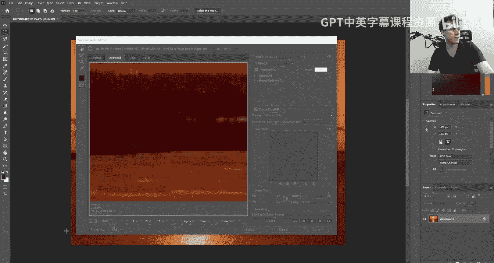


*   **JPEG 使用有损压缩**：为了显著减小文件大小，它在压缩过程中会丢弃一些被认为“不重要的”图像数据。这意味着每次编辑和保存JPEG文件都可能造成画质损失。它非常适合颜色和细节复杂的照片。
*   **PNG 使用无损压缩**：压缩过程不会丢失任何原始图像数据。解压后的图像与原始图像完全一致。这使得PNG非常适合需要精确还原的图形，如Logo、图标、截图或包含文字、线条的图片。

### 实际应用场景


*   **使用JPEG的场景**：照片、渐变丰富的背景图、对文件大小敏感且画质轻微损失可接受的情况。
*   **使用PNG的场景**：需要透明背景的图片、颜色对比强烈的图形、文本截图、图标以及需要多次编辑保存的原始素材。

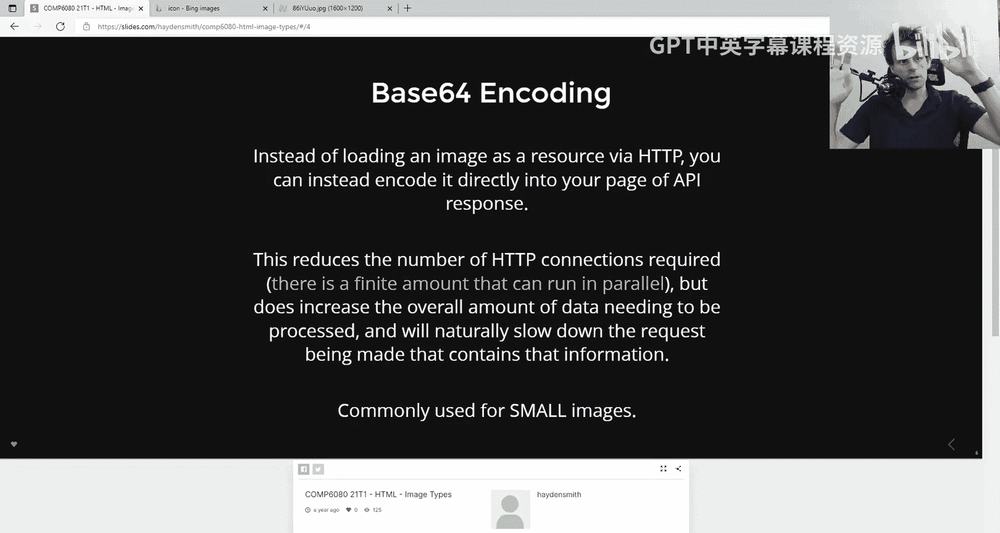


## Base64编码图像


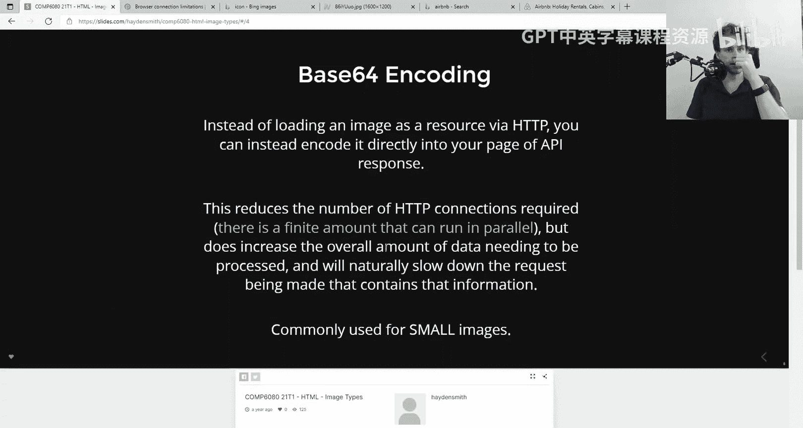

现代网页包含大量图像，但浏览器对同一域名下的并发请求数量有限制（例如Chrome是6个）。为了优化页面加载性能，特别是对于大量小图标，**Base64编码**技术被广泛应用。

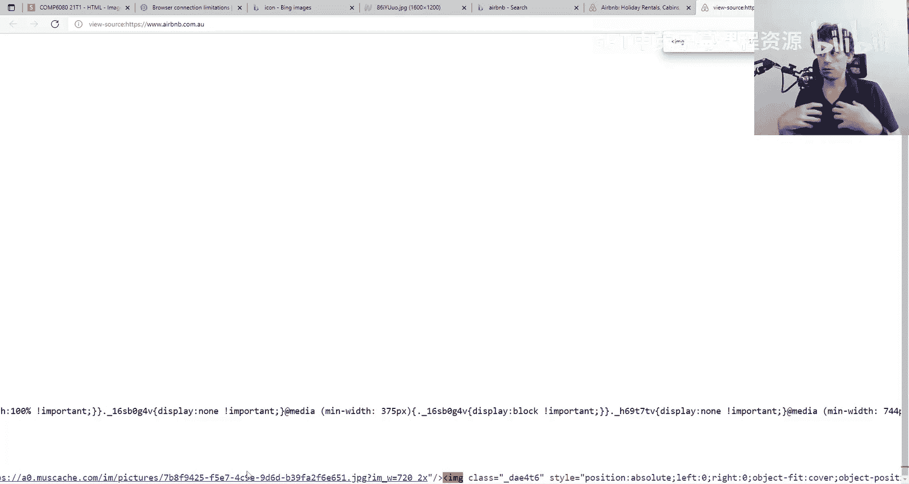

### 什么是Base64编码？

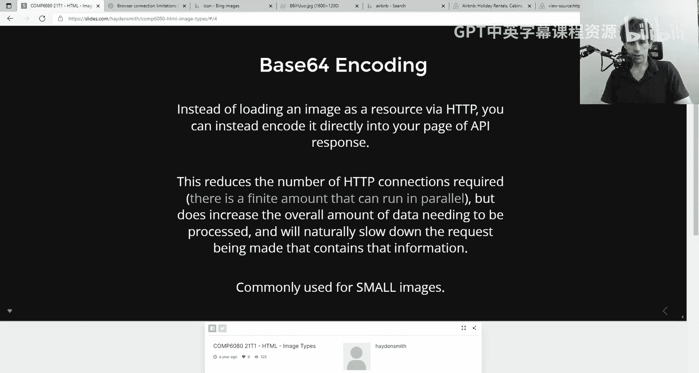

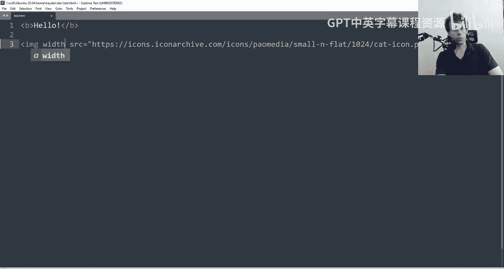

Base64是一种将二进制数据（如图像文件）编码成由ASCII字符组成的文本字符串的方法。编码后的字符串可以直接嵌入到HTML或CSS文件中。

### 传统方式 vs Base64方式

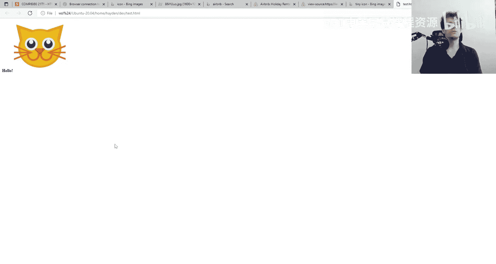

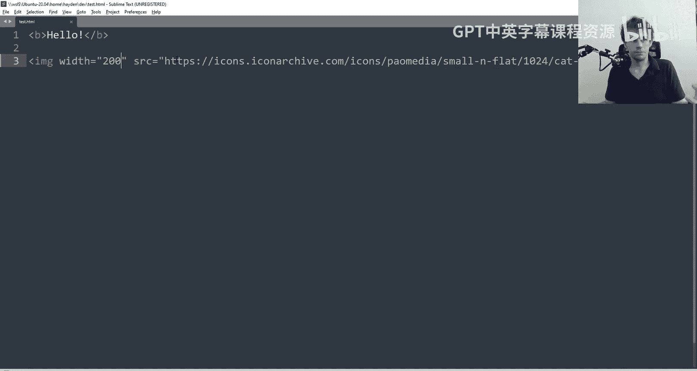

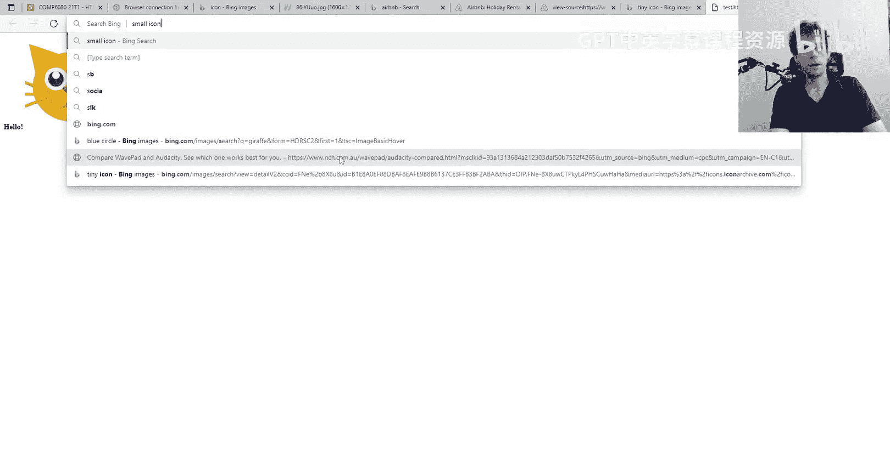

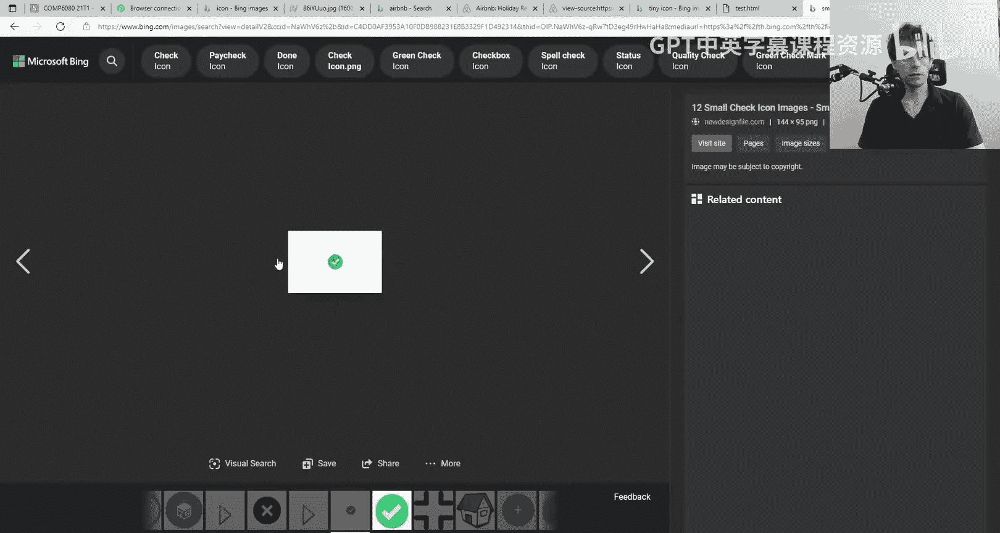

*   **传统方式**：HTML文件包含 `` 标签，其 `src` 属性指向一个图像URL。浏览器需要先加载HTML，再根据URL发起**额外的HTTP请求**来获取图像。
    ```html
    
    ```
*   **Base64方式**：图像数据被转换成Base64字符串，并直接内联在 `src` 属性中。浏览器在加载HTML文件时**一次性**获得了所有数据，无需额外请求。
    ```html
    
    ```


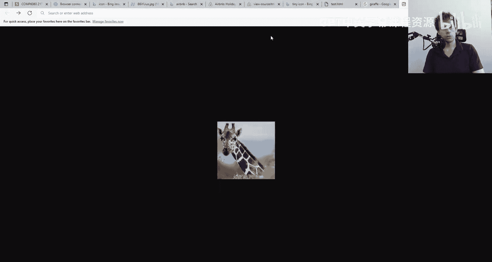

### 优缺点

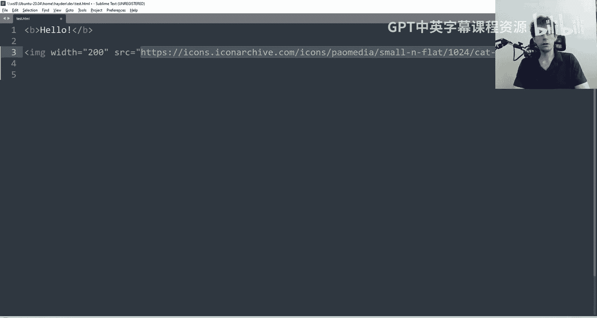

*   **优点**：减少HTTP请求数量，提升小图片的加载速度，特别适合移动端或图标字体（Icon Font）的替代方案。
*   **缺点**：编码后的文本体积比原二进制文件大约增大33%。它会增加HTML/CSS文件的大小，可能影响首屏加载时间，且不利于浏览器缓存单独的图像资源。

**最佳实践**：仅对非常小的（例如小于10KB）、需要与页面同时加载的、且不常更改的图片使用Base64编码。大图片仍然应该使用传统的URL引用方式。


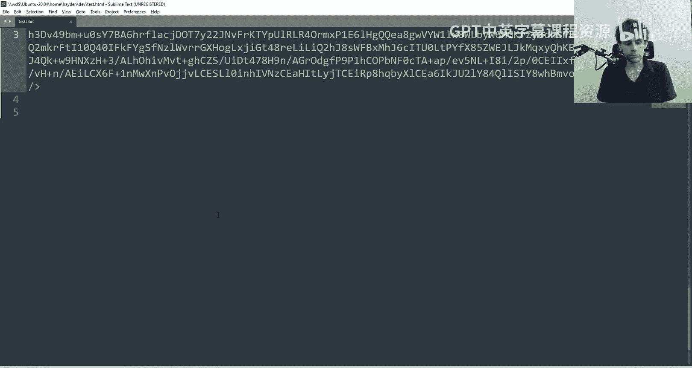

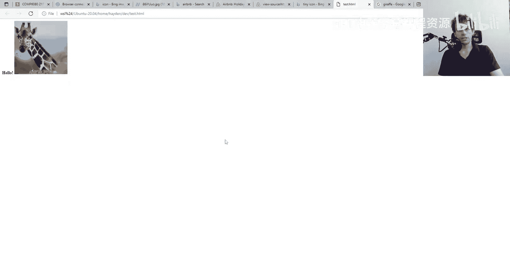

## 总结

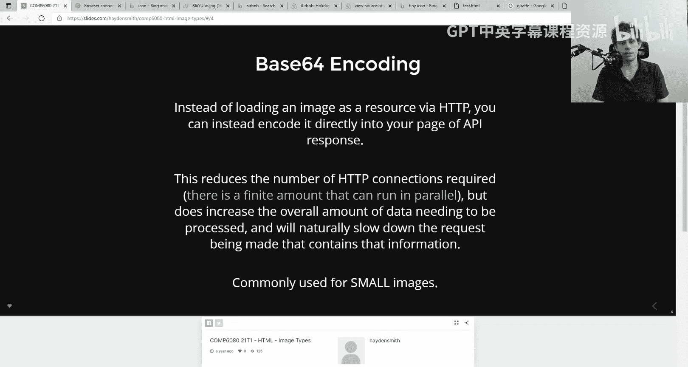

本节课中我们一起学习了网页开发中的图像知识。我们首先了解了矢量图与位图的区别，然后重点分析了JPEG、PNG、GIF等常见位图格式的特性，特别是JPEG的有损压缩与PNG的无损压缩这一核心区别。最后，我们探讨了Base64编码图像的原理及其在优化网页性能中的应用场景。掌握这些知识，将帮助你在实际项目中做出更合理的图像格式选择和技术决策。