# 前端编程：COMP6080：HTML进阶标签 🐲

在本节课中，我们将学习一些在核心HTML基础课程中未涵盖的进阶标签。这些标签虽然不常用，但了解它们有助于我们认识到HTML功能的广度。

## 废弃标签与浏览器支持

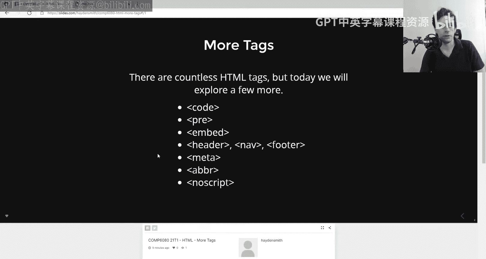

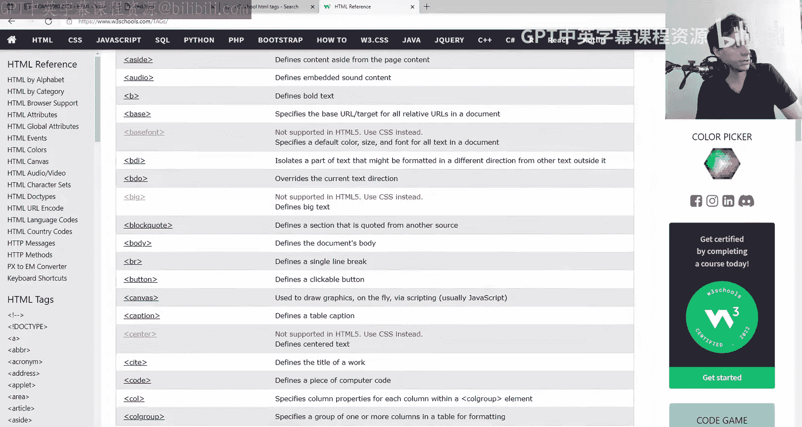

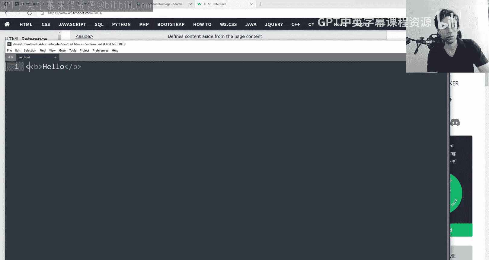

上一节我们介绍了HTML的基础结构，本节中我们来看看一些特殊的标签。首先，我们需要理解“废弃”的概念。废弃标签是指那些不再被官方规范支持，但浏览器可能仍会兼容的标签。

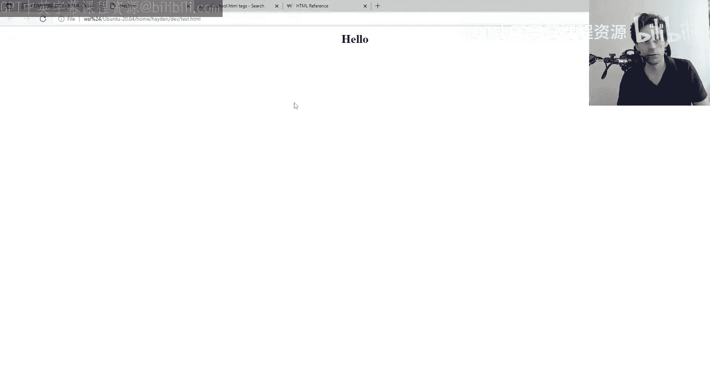

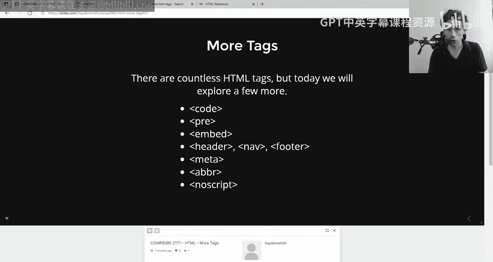

例如，`<center>` 标签曾经非常流行，用于居中内容。虽然它已被废弃，但在许多现代浏览器中仍能工作。

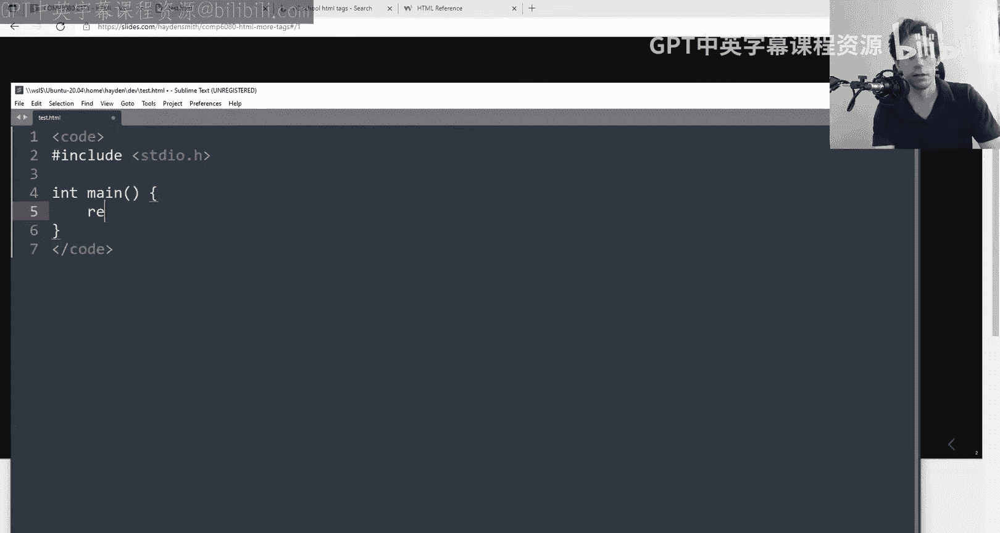

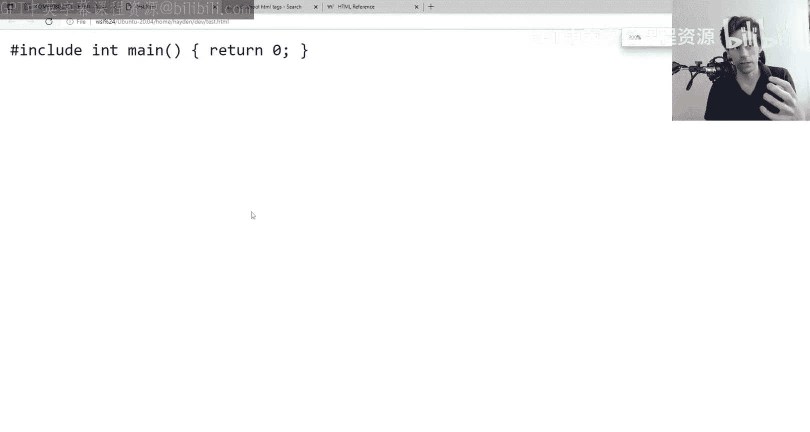

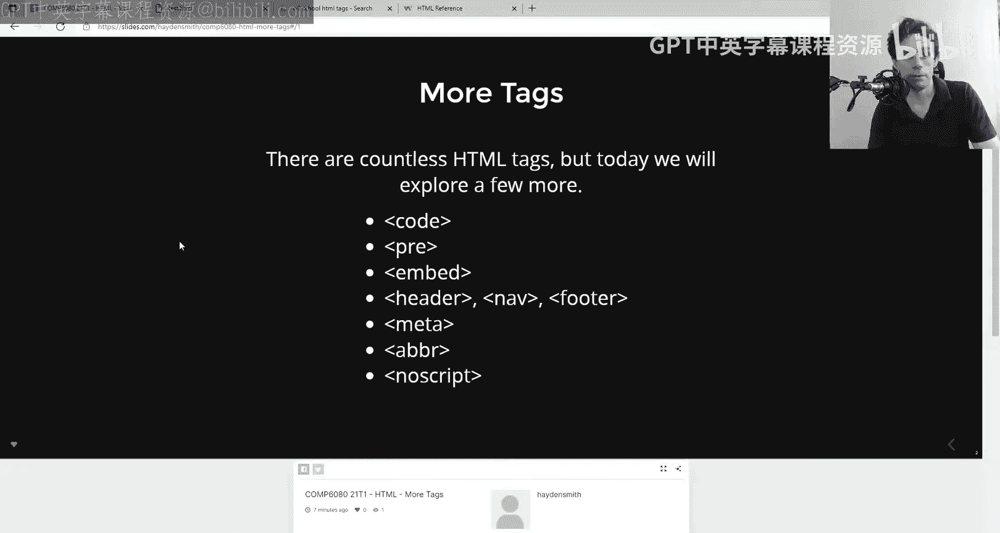

```html
<center><b>Hello</b></center>
```

浏览器（如Microsoft Edge）可能仍会支持它，但这并非规范要求。浏览器作为HTML规则的“编译器”，可以选择支持废弃功能，但并非必须。

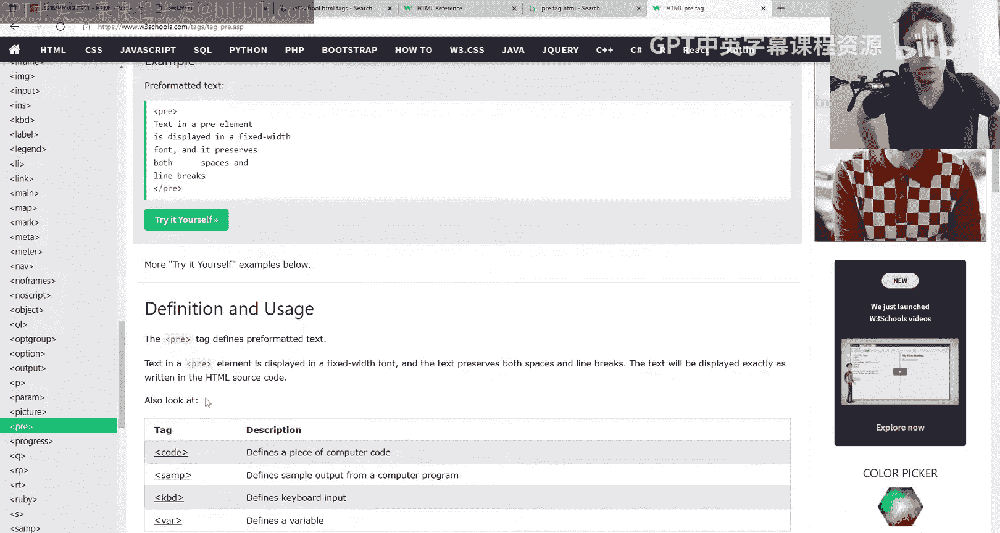

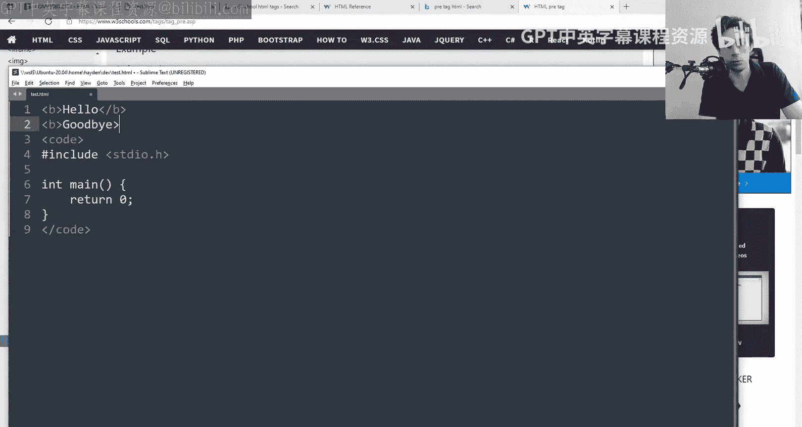

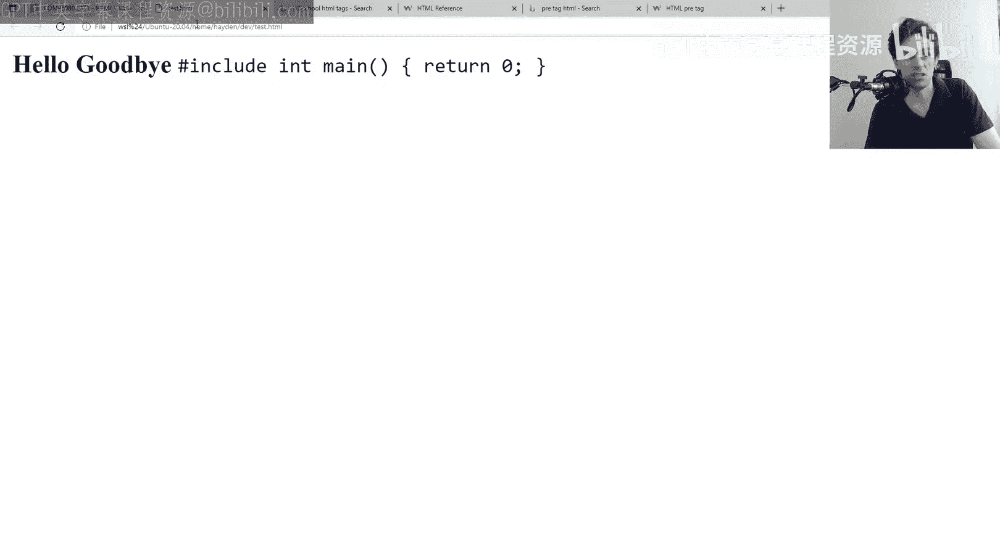

## 代码与预格式化标签

接下来，我们探讨用于展示代码的标签。`<code>` 标签用于定义计算机代码片段。

```html
<code>#include <stdio.h></code>
```

单独使用 `<code>` 标签通常不会产生显著的视觉效果，它主要是一个语义化标签。为了保持代码的原始格式（如空格和换行），我们通常将其与 `<pre>` 标签结合使用。

`<pre>` 标签代表“预格式化文本”。HTML默认会忽略多余的空格和换行，而 `<pre>` 标签会保留这些空白字符。

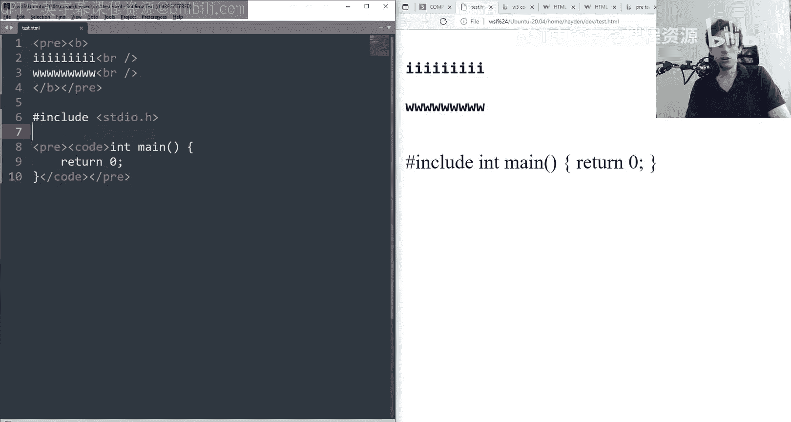

```html
<pre>
    <code>
        #include <stdio.h>
        int main() {
            return 0;
        }
    </code>
</pre>
```

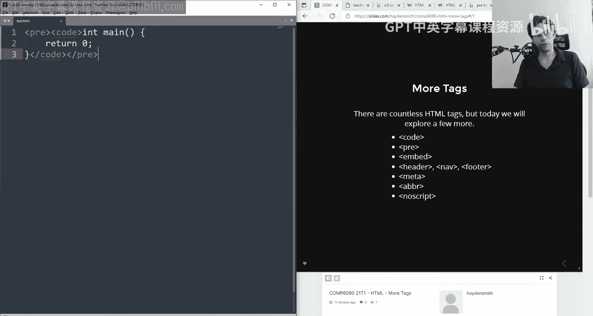

`<code>` 标签的另一个作用是默认以**等宽字体**显示内容。等宽字体确保每个字符宽度相同，类似于代码编辑器的显示效果，便于阅读。

以下是两者的核心区别：
*   `<code>`： 提供语义含义并使用等宽字体。
*   `<pre>`： 保留所有空白字符（空格、换行）并使用等宽字体。

将它们结合使用，既能清晰地表达“这是代码”，又能完美地呈现代码格式。

## 语义化标签

现在，我们进入语义化标签的部分。语义化标签本身不提供强烈的视觉样式，但它们为浏览器、搜索引擎和其他工具提供了关于页面结构的明确含义。

常见的语义化标签包括 `<header>`、`<nav>`、`<footer>`。

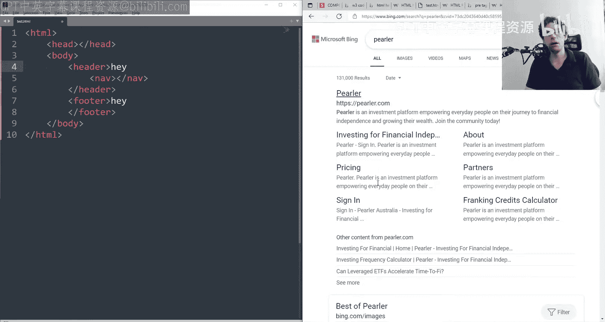

```html
<body>
    <header>这里是页头，可能包含Logo和导航</header>
    <nav>这里是主导航链接</nav>
    <main>这里是页面主要内容</main>
    <footer>这里是页脚，可能包含版权信息</footer>
</body>
```

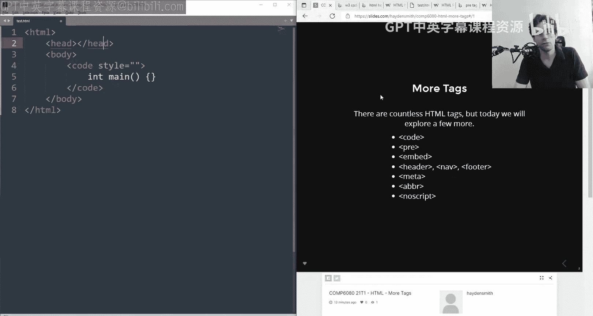

使用语义化标签而非普通的 `<div>` 加注释，有两大好处：
1.  **对开发者友好**： 使代码结构更清晰，易于理解和维护。
2.  **对机器友好**： 帮助搜索引擎（如Google）和辅助技术（如屏幕阅读器）更好地理解页面内容，从而提升搜索排名和可访问性。

## 元数据标签

上一节我们了解了页面结构的语义，本节中我们来看看如何向外部描述页面本身。`<meta>` 标签用于定义HTML文档的元数据，这些信息不会显示在页面上，但至关重要。

`<meta>` 标签位于文档的 `<head>` 部分。

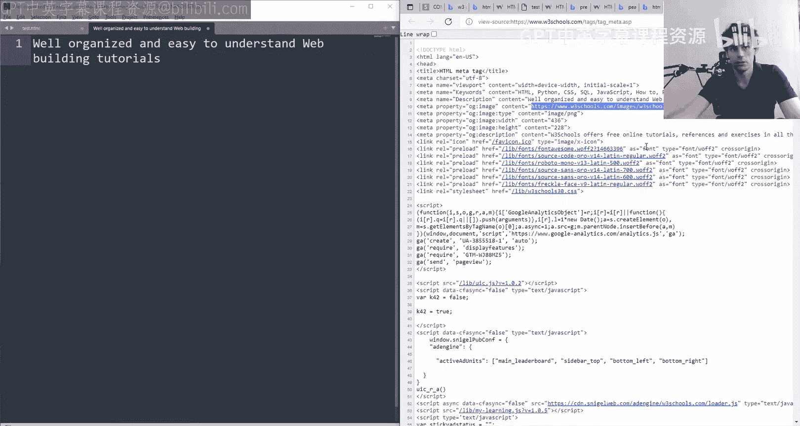

以下是几个关键用途：
*   **页面描述**： 提供给搜索引擎的摘要。
    ```html
    <meta name="description" content="关于前端编程的免费教程和参考资料。">
    ```
*   **关键词**： 过去用于SEO，现在重要性已降低。
    ```html
    <meta name="keywords" content="HTML, 教程, 前端">
    ```
*   **社交媒体预览**： 控制链接在社交媒体（如Facebook、Twitter）上分享时的显示效果。
    ```html
    <meta property="og:image" content="预览图片的URL">
    <meta property="og:title" content="分享时显示的标题">
    <meta property="og:description" content="分享时显示的描述">
    ```

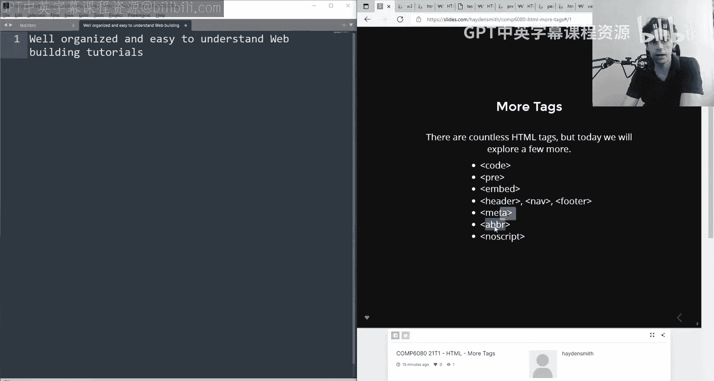

## 其他实用标签

最后，我们快速浏览几个有特定用途的标签。

**缩写标签 `<abbr>`**
用于标记缩写，当用户鼠标悬停时会显示完整标题。

```html
<abbr title="World Health Organization">WHO</abbr> 成立于1948年。
```
这不仅对普通用户有用，也能帮助屏幕阅读器等辅助工具更准确地朗读内容。

**无脚本标签 `<noscript>`**
用于定义当浏览器禁用JavaScript时显示的替代内容。

```html
<noscript>
    <p>请启用JavaScript以正常使用本网站。</p>
</noscript>
```
如果JavaScript已启用，浏览器会忽略 `<noscript>` 内的内容。

**嵌入标签 `<embed>`**
用于嵌入外部内容，如PDF、Flash或**媒体内容**。一个常见的例子是嵌入YouTube视频。

```html
<embed src="https://www.youtube.com/embed/视频ID" width="400" height="300">
```
请注意，`<embed>` 通常用于嵌入具体的媒体对象。若要在页面中嵌入**整个其他网页**，更常用的标签是 `<iframe>`。

```html
<iframe src="https://example.com" width="800" height="600"></iframe>
```

## 总结

本节课中我们一起学习了多种HTML进阶标签。我们了解了废弃标签的概念，掌握了使用 `<code>` 和 `<pre>` 展示代码的方法，认识了 `<header>`、`<footer>` 等语义化标签对结构和可访问性的重要性，探索了 `<meta>` 标签如何定义页面元数据，并简要介绍了 `<abbr>`、`<noscript>` 和 `<embed>` 等专用标签。

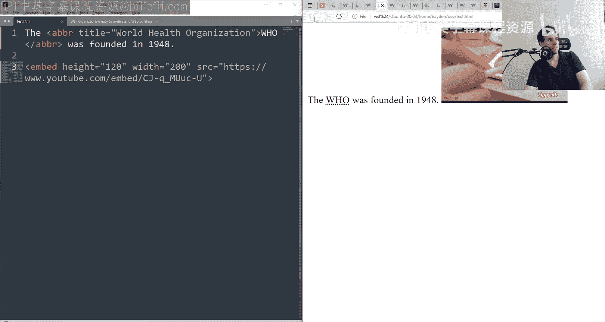

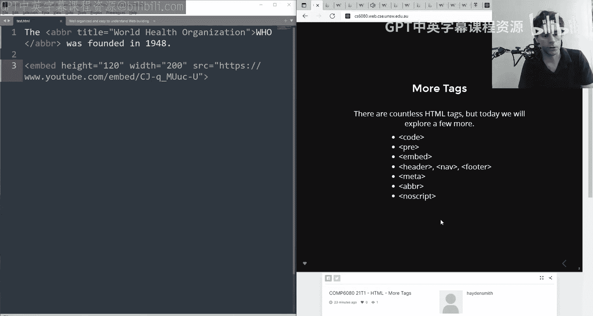

虽然这些标签在日常开发中可能不常被直接使用，但理解它们的存在和用途，能让我们更全面地认识HTML的生态系统，并在特定场景下做出更合适的选择。要探索更多标签，可以参考 [W3Schools的HTML标签列表](https://www.w3schools.com/tags/)。