# UNSW《前端编程｜ Web Front-end Programming COMP6080 23T1》中英字幕（deepseek-R1 p06 -06-COMP6080 - CSS 🌝 Rules.zh_en -BV17RXGYuEaM_p6-

Hi， my name is Hayden， and today we're gonna to be talking about cascading style sheets or what you may have more often heard as CSS Now CSS is in a nutshell the way we make webp pages look nice it's the styling。

 It's the aesthetic。 It's the color。 It's the layout。

 It's what really makes them pop and it's what really contrast them to that kind of old school web like we talked about with Wikipedia where everything's just blocks of text and a couple of images before we get into some of the theory behind CSs in some of the highlevel rules。

 we're first just going do a really simple example of what it even is because if you haven't seen it before。

 understanding how it ties into what we've been doing with H is really important So probably starting point here is that CSS is kind of built on top of HTML that's not to say it's the same language or anything but you don't really have you don't really go and build a website with CSS and not HTML It's kind of like HTML is the base of everything and then CSS is like。

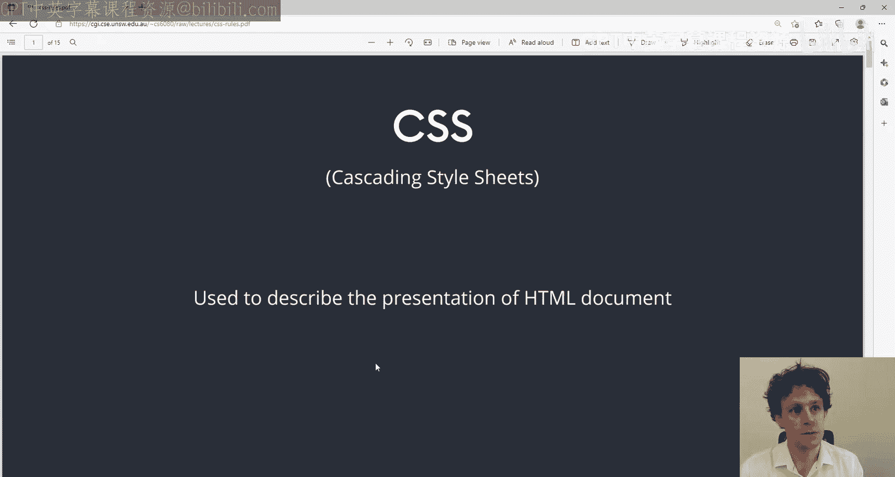

add on it's like an enhancement and extension， if you will and that makes sense because it was kind of brought into the world after HTML existed Now this is a fairly simple HTML file that we've seen before。

And we've seen previously that we can do some interesting things like we kind of gave our tables some borders and we made some dot points。

 but sometimes we all might want to do something a little bit more fun such as increase the font size of some tech so I mentioned before that a span is an HTML tag that has essentially it's a stylless tag it's like a blank canvas。

 a total template。Before CSS was kind of invented， we used to style our HTML tags by actual built in attributes and values that existed on the tags。

 so used to do something like this used to say。San colour equals red。

 and that will colour the text of the span。 Now that's all well and good。

 nothing wrong with that at all。 It kind of works。 It kind of behaves fine， but。

CSS is done slightly differently。 What you do with CSS is that all CSS is defined inside of these。

Double quotes when it comes to the style attribute。

 so pretty much every single HTML element has a style attribute and inside of that you put some CSS so like CSS goes here。

So all dumped there and CSS is a language basically made up of key value pairs that we're going to go through together。

 but if I wanted to make this text， for instance， red， I would go color is red like this。

And now when I go and open up my page and remember we can just open up our page by dragging our file straight into the web browser。

 you'll see here that I now have some text that is hi。

 it's just red text that says hi and I could change this from color red the color blue if I want to like this and you can see that CSS is made up of again these key value pair so this is a key this is a value we'll talk more about that in a second but's that's it you just apply these styles to lots of HTML elements so we saw things like lists we saw things like headers。

 paragraphs， these stless tags， you can apply CSS to all of it now。

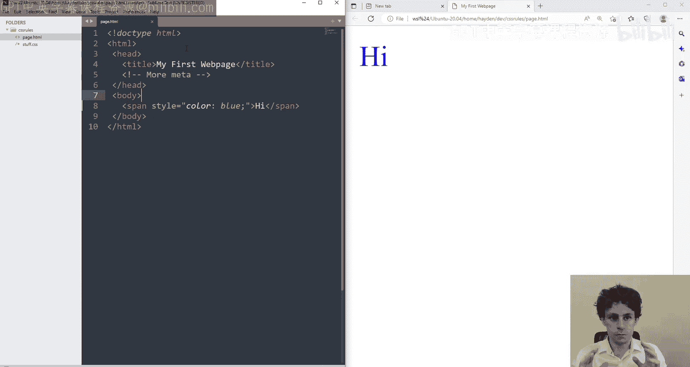

There are two primary ways that you can include CSS in your web page The first one is to do exactly what we've just done there where we create some kind of element in this case。

 a div， we did a span where you put the CSS between the as a style attribute。

 but the other way to do things which is slightly more common and what you'll be doing in your assignments is that you actually import CSS from another file。

And we can do that together where you can see here I've got this up this file here called stuff。

css and what I do is I take my color blue。I go into my stuff。css file here。

 but I need to kind of give this set of styles some kind of name， so I might call this a blue text。

Like this。And then I define my CSS inside of these curly braces you can see the example on the lecture slide just up here obviously the colors red and I put a dot in front of my property and that's kind of it that's all I really have to do there and now if I want to kind of apply that style to my page instead of explicitly writing style equals color blue I actually say class equals blue text So class is what we use when we want to say I have a name that describes styles and I want you to apply that name it's kind of like you know a function a rule a variable name whatever it's an abstraction and style is what we use when we're actually writing the CSS in line it's what we call inline CSS Now you will see that when I do this suddenly the text is now black again and the reason for that is because this HTML file does not inherently understand。

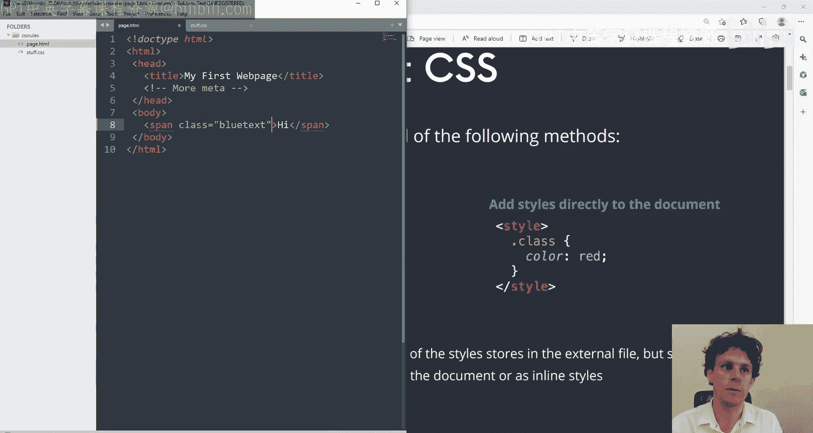

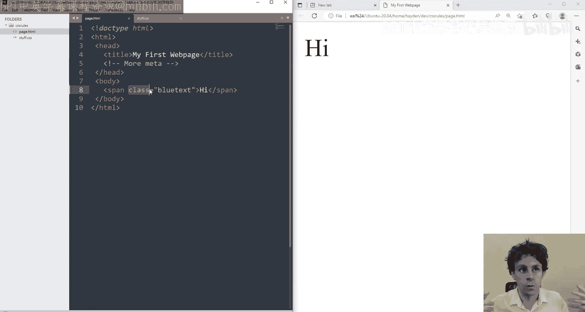

What blue text is it's just like I don't know what that is so if we go back to our slides you'll see that if you want to import something in particular CSS onto your page you actually have to add this link REL style sheet hf styleyle。

csS now this is actually a good example of something we put inside the head tag so here I'll say link or a link type。

😊。

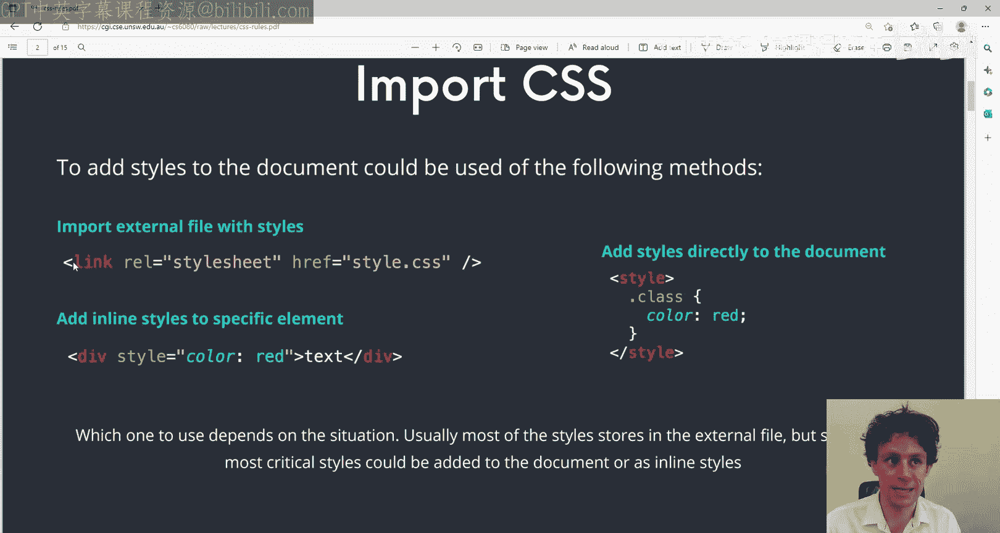

Think RE。Equal style sheet， you just do what you're told and then the Hf is stuff do css it's the name of your file and there's there's our header there now because that CSs was kind of like copied into my file。

 think of that again like a hash include or something similar that blue text now works And if I come over here and change that text from color blue to red which is very silly given that the name of that class is blue text it will now change to red but let's keep that as blue for the moment so there are a couple of basic ways that you can interact with CSS and then the third way is that you can actually take your CSS you don't need to import it。

 but you can actually just write this directly into your page。

 you can create there's a style tag in HTML and anything in that style tag the web browser will treat like CSS and process it like CSS。

So generally speaking we've got these three tiers， we've got our inline styles that we did first and then on the other end we've got these like external styles where they're defined another file and then we have kind of a middle ground that's the styles defined still separately to your HTML but in the same HTML file now before we move on there's like a pretty common question which is like which one do I use what should I use？

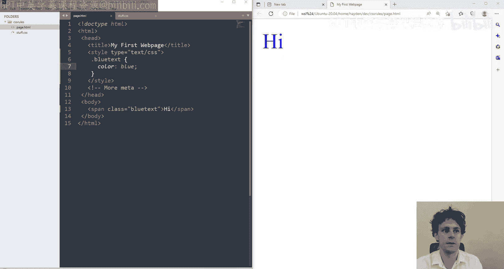

Now， as a general rule， what I would say is that it's always better to externalize your styles。

 put them in another file。The one scenario that it probably is good to inline them is when you're kind of hacking or coding or like developing because you know sometimes if you're trying to make a page look a certain way or you're playing around it's much easier just to come here and put a quick style in that says you know font size is 200% is in twice the normal size。

 sometimes that's a lot easier than kind of looking at the class and then trying to remember what file it's in and then finding it than adding it here and then sometimes that applies to like other things that are using that style。

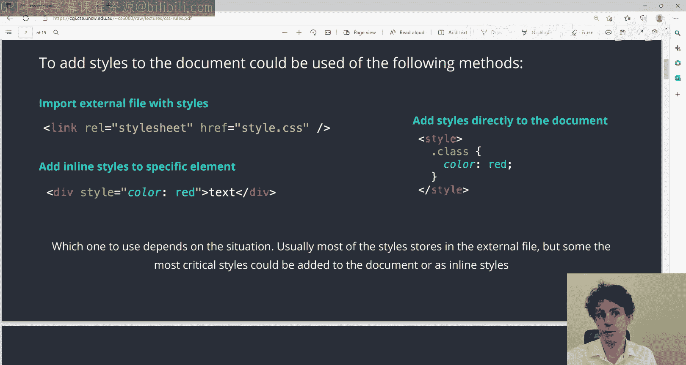

So that's probably the only time it's worth doing inline styles is like early development like it's a good way to play around don't put pressure on yourself to go perfectly organize all of your code into external style sheets。

 but generally we do like to put everything in external style sheets so we like to do。😊，This。

 yeah now。The other there's a few benefits of them being externalized well one of the benefits is that you can reuse things now this isn't necessarily about being external。

 this is more about separating out into classes。But one of the other benefits that's a little bit more technical is that what your web browser actually does is that when it loads a page。

often web pages include all these different elements， so if you load a website like unsw。

au it will actually be going and including all these different css files all over the place and what web browsers do is they will cash those files they will store a local copy of those files and they won't ask for a new one for maybe a couple of days or a week or a few hours depends how it's configured and this is good because it speeds up a website that's why you'll notice if I go to a website like unsw。

ed。au the first time the page loads。It can often be a little bit slower。

Now I'm doing like a hard refresh it， like a full refresh。

 you notice it like it takes like a second lo， but when I just do a normal refresh。😊。

It's not much different， but you can kind of see it， yeah， it's a little slower， right？

This is so normal refresh normal refresh really quick and then a full refresh takes that extra like second and that's because that full refresh is forcing all the new CSS well the or the external CSS to come in slows it down so there's lots of benefits to it so generally it's like externalize it unless you're kind of hacking away as a general。

😊，So cool we've got our little highs here， as I said in the HTML lecture to make them divs。

 everything becomes like their own block， which is really important if you're confused about that there are other lectures about layout in particular with HTML and CSS but that's like the gist of how to import CSS。

😊。

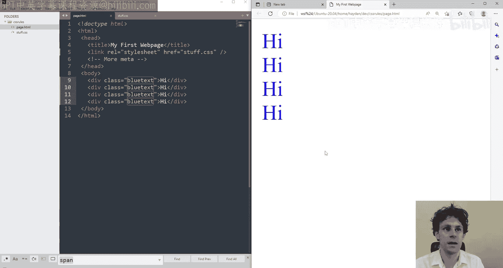

It's kind of boring let's get into what you can do with CSS so everything in CSS in terms of the definitions and this is no longer talking about inline styles we're all talking about how to like define it define it separately。

😊，It's all made up of selectors and then property value pairs So a selector is simply a way of describing where it applies right define the elements to which the rule applies and then property and value are just key value pairs Now you've seen this demonstrated here where this up here is the selector this is the class name that it applies to and then here I can go and admire you know。

Font weight， my color blue like this。Oh font weight。

 my bad font size wondering why that wasn't working。 Yeah， so I've got my font size。

 So you can see that everything's made up of these key value pairs all inside of a selector and your file can have many selectors。

 You could come down here and you could make some red text， for instance， that is。😊。

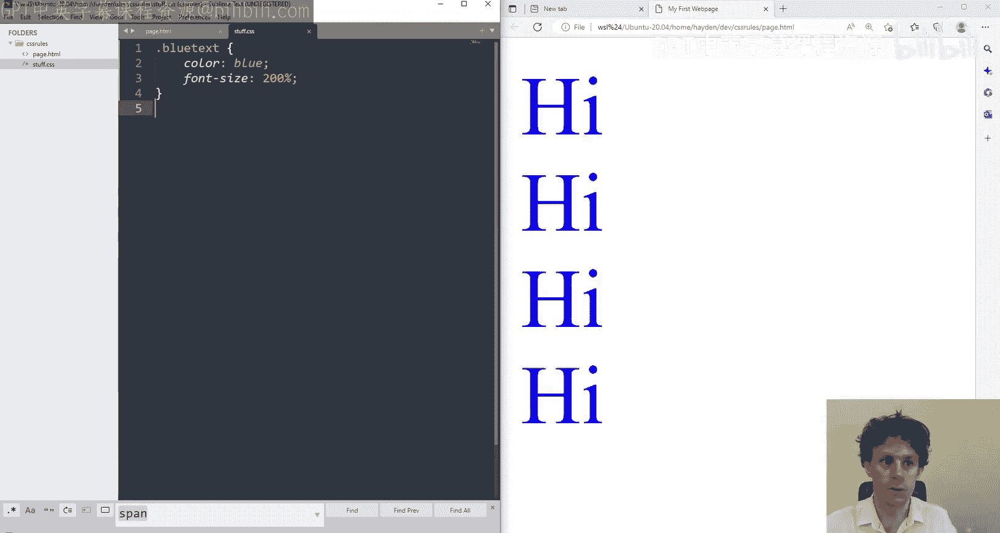

Font size 200 in color red。 And we could make the second two here， red text like that。

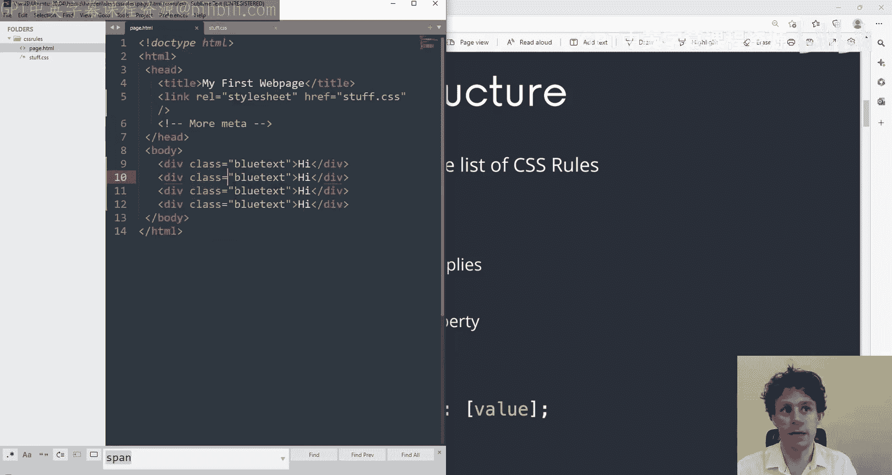

And you'll see that it's broken up that way so everything in CSS selects property values now in this way this kind of actually makes CSS probably one of the simplest things you'll ever program and it probably doesn't even feel like programming which makes sense it's it's a markup language that is。

😊，Remarkably straightforward now there are rules to it， which is what this lecture is about。

 but structurally that CSS， you've learned the structure of CSS。😊。

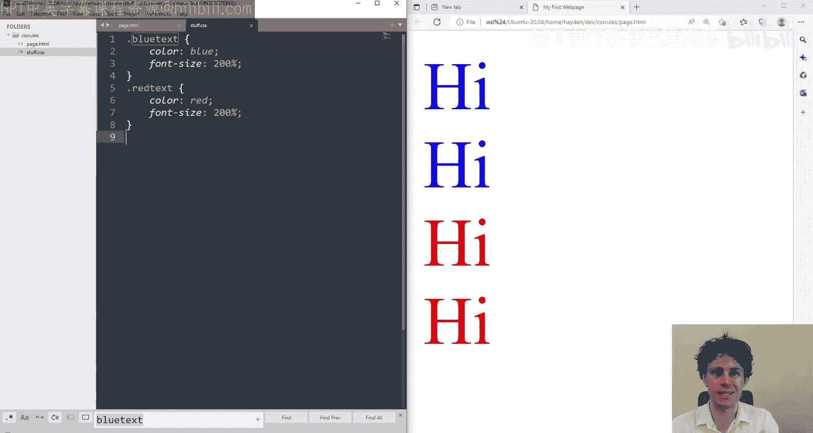

Move on so next thing is we're going to start learning about selectors。😊。

And that's most of what the lecture is about it's about these rules that apply and then in future lectures we learn about more properties in terms of formatting and in terms of layout so lots and lots of selectors so firstly we have a universal selector this is where you use a star and what this means is that it applies to all elements on the page so for instance let's say I have my web page here and I would like to have all of my text you know maybe I have some text down here like how are you how do I get all of the text on this page for instance to be font size 200 well I simply use the star that's the universal selector。

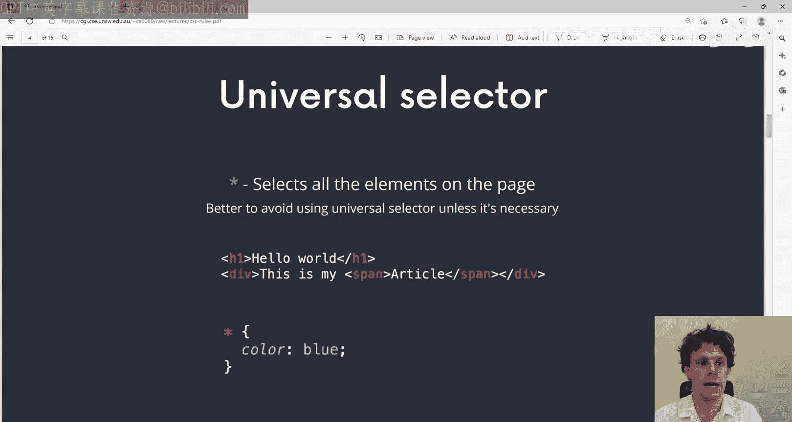

Now because I've good folly， because I've gone and put it there。

 I don't need to go and put it anywhere else if I don't want to。

 you can see my page there because it's applying it to everything and similarly。

 if I made this you know colour orange。You'll see that the text is now orange now we'll come back to why not everything's orange later it's probably pretty obvious too but that's a bit of a later topic but that's the universal select it's pretty simple when do you use that not really very often most of the time it's to do with text I'd say because sometimes you want to apply the same kind of basic font size or the same kind of like font generally like aerial or times new Roman to everything on a web page but generally it's not super common Another way that that's used as not actually through the star but through like the body tag this one is slightly different this one just says that it applies it to the outermost tag here body。

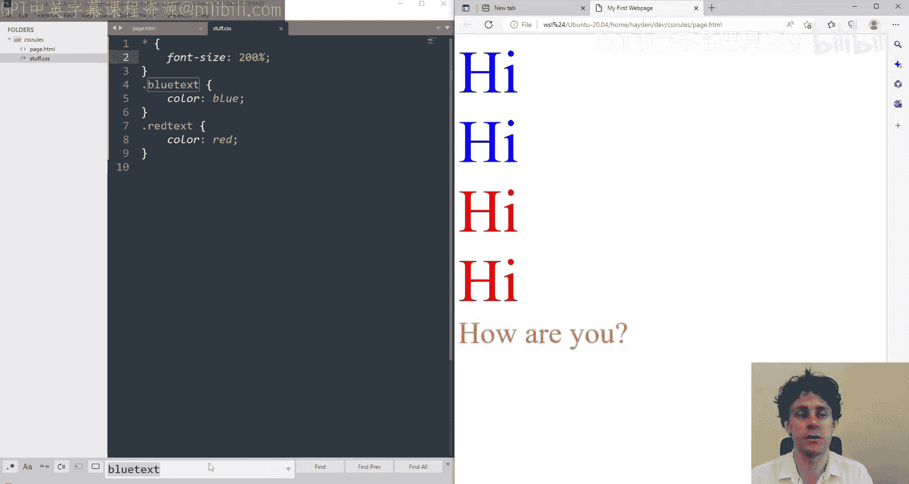

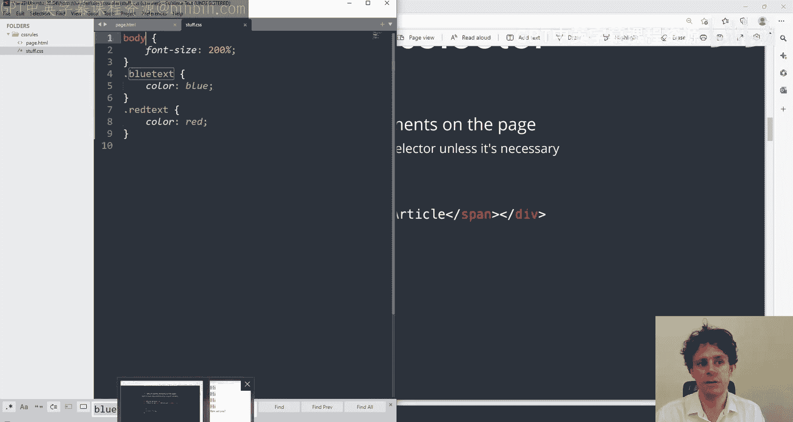

Which doesn't always have the results you'd expect， as you can see。

 so that's why the universal select is a bit more useful when you want it to apply to everything because。

When you say the body tag， you're essentially saying you want the outermost tag to have a property whereas the universal selector saying I want everything to have a property。

 but again you don't really need to worry about it because it's not super commonly used。

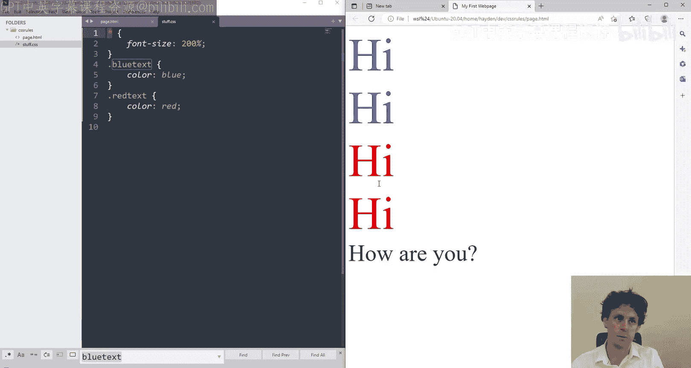

The other way another way that you can use selectors is through the type selector so this is we're kind of going through levels of specific here。

 the type selector is where you don't actually kind of give it a name like here we've kind of created these class names as examples。

 but you actually just refer to a particular。

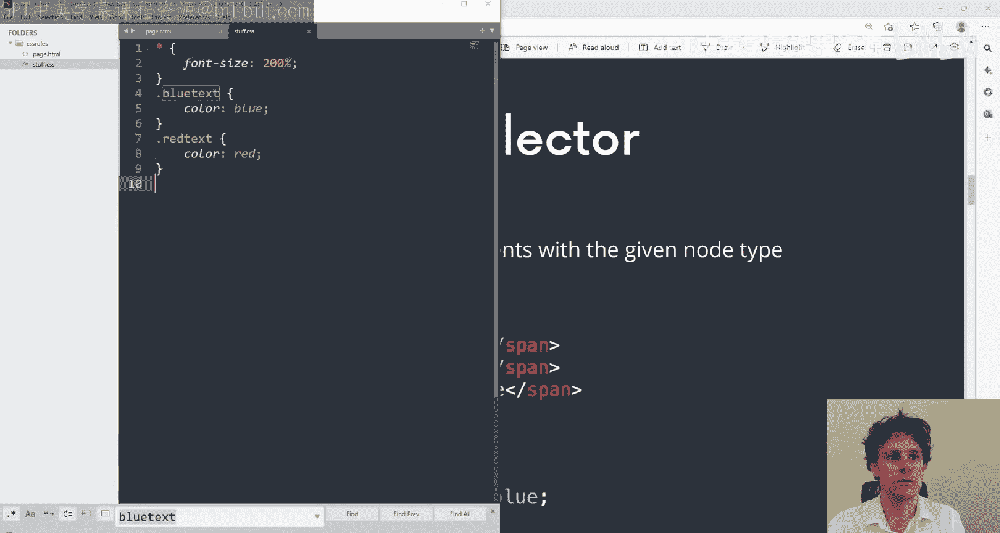

Tag so in this case like a div so I or you know， maybe we'll do something else like a link like let's say we have a link to Google。

So say we've got our link to Google here， Google like that。😊。

U refreshre the page there's my Google link we'll put a B there just to break that up a little bit Google link's very big and you know what I want all my anchor tags all of my link tags to actually。

What can we make them do that isn't too fancy Well let's make all of them。Yellow， that's terrible。

 I do。But you know now all of our links are yellow you see here I haven't had to kind of give it a style name。

 I haven't had to give it a class， but I've used the tag selector tag selectors are really useful。

 particularly for things that maybe like paragraph tags so really commonly for text or images if you want every image to kind of have maybe a border around it。

😊，I most often see them used for things like unordered list list headers。

 headers a really common way， you know， because sometimes you want your header to be like really big or you know really small or something like that。

 but that's a tag selector pretty fun。

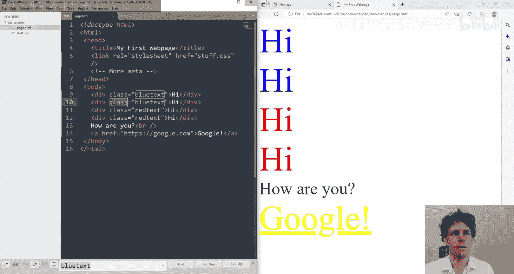

Class selector， this is the one that we kind of demoed with at the start here。

It's really just a way of naming a set of styles， it's kind of the classic way to do that so you know it's exactly what we've done here。

 dot blue text dot red text， the dot refers to class if I just write blue text。😊。

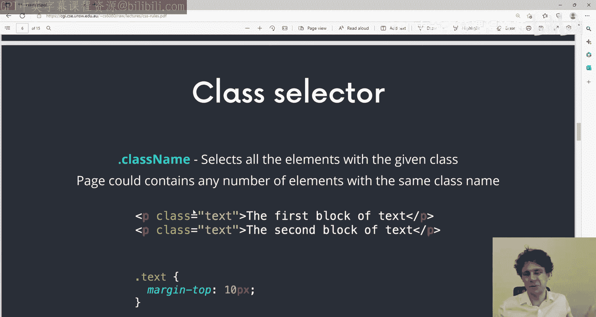

The web browser the way the engine works is it will try and look for a tag called bluetex that's why we need the dot because you know the a tag and the H1 tag the P tag so the dot is our way of saying this is not a tag this is a class and a class is just a name right so this is a name for a set of properties to apply and then you simply apply them doing what we've done where you pick a particular element and you say that this element's attribute class is equal to this value and then the browser knows to go look it up here so that one's pretty straightforward we already looked at that。

One that's paired with that pretty commonly is the ID selector the ID selector looks very similar and it behaves super similar in the sense that here。

I could create another one called green text with color green。

 but instead of the dot we simply use a hash Now that difference between a dot and a hash is is very。

 very slight， but the way that then changes how we use it。

Is that we now say div ID equals green text。

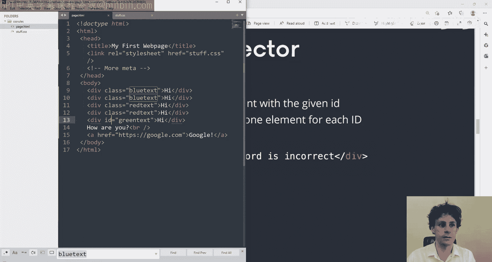

So。The star， not the hash。🤢，The hash means ID so dot means class hash means ID that's how we apply these styles to the page now what's the difference between these。

Basically， an ID should generally be used if your element only exists once and a class should be used if it may exist many times on the page。

So ID single class multiple。嗯。It's probably very common from a programming standpoint to just make everything classes and you know maybe somethings an ID so't don't kind of feel like you have to ask yourself constantly。

Should this be a class， should this be an ID just using a class is fine so but IDs are kind of useful for instance。

 things like let's say I later on go and create a div called like a header block or something like this。

And that had a block。You know， it only exists once because there's only one header block on the page。

 that's probably an example where I might give it an ID like that and then I'll come here and say you know the header block is going to have a certain style here。

Like that。This kind of also feeds into another point which might come up later。

 but just while I'm here is that generally when it comes to the naming conventions of our CSS styles we use dashes。

 we don't use Caml case， we don't use snake case with underscores we use dashes so that's head of block so you could argue a lot of these should probably be like just to make things a little bit cleaner like blue text like this。

So that's probably more appropriate， so that kind of dash syntax is very common。

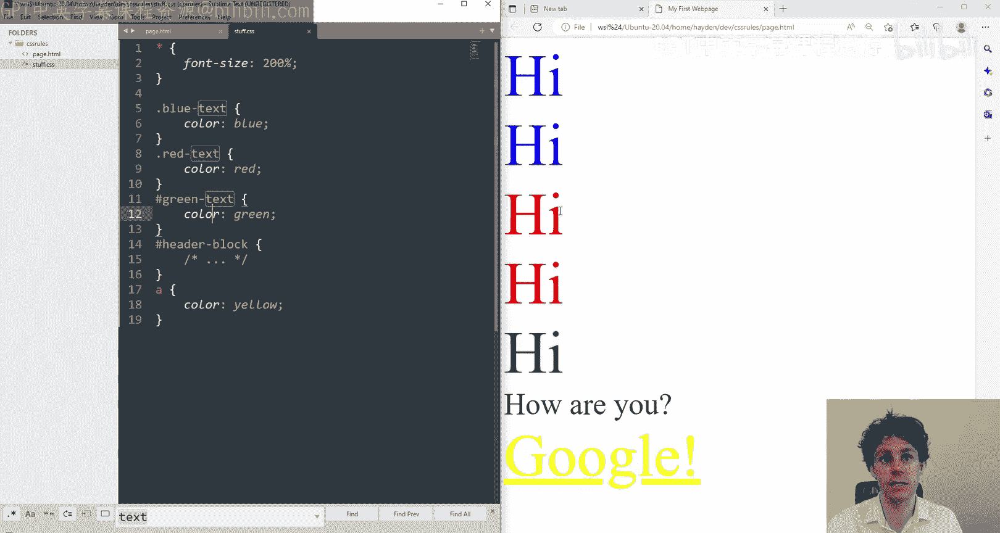

Yeah so that's an ID selector now that's most of the 95% of everything you do is going to be class and ID selectors and then 4% of what you do going do is probably going be tag selectors right so we've really covered the bulk of things now a lot of what we're going continue talking about is often the more obscure things in CSS and they're really cool they certainly have some some uses so the next one's the attribute selector This one's kind of attribute selectors can often feel like tag selectors depending on their context and let's say for instance we have a couple of radio buttons。

You know， like this。Yeah， we don't need to do more than that， but。Obviously。

 if you want to style these radio buttons， maybe you want to make them a certain size。

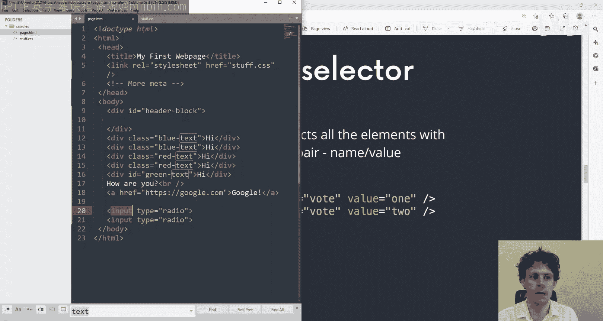

So I've got my two they're very small aren't they so I might put them up the top where we can see them a bit better so let's say I've got my two little radio buttons here and I'll separate them out。

😊，Now they're quite tiny， let's say I want to make them really big well I could come along and say like。

 you know my radio button is going to be， let's try again font size 200%。And then I could here say。

 well， these are going to have。A class of my radio。

And now they should be super big or not super big I'm not sure how to make these big actually let's Google it radio button size CSS right lots of things we don't know how do I change the size of my radio button this is a really common thing you'll be doing okay width and height okay so radio button has a certain width and a certain height so instead of using font size that was just my assumption let's say that it's width should be  under0 pixels。

😊，Okay， now that wasn't too useful that just kind of made the area bigger， that's okay。

 we can move on from that good example of where you go on Google stuff。

Let's say we create that width of 100 pixels here and you can see it's changed the hit area this is kind of really important notice I'm not clicking on it so the actual width of the elements much larger even though the circle itself is quite different so these are all these kinds of subtleties that you pick up on as you play with things is you think okay well font size did nothing which makes sense because it's a radio。

 not some text the width didn't increase the size of the little icony thing。

 the radio button but it increase the size of the area for instance and similarly if I made this hyp100 pixels too。

Oh there you go， there's the answer。What was clearly happening there was without the heightat。

 The size of the radio was like a really thin rectangle right and therefore that little circle which always wants to be a circle couldn't really get any taller but the second we increase the heightat。

 the circle just kind of expanded out to fill the space right now I've never made a radio button that big So I just learned something too this is the fun of CSs it's so much you'll learn it's not like learning see all these other languages where you just kind of learn everything and then you solve hard problems right there's so much to learn and tons of things you'll never ever ever use super fun So there's our two radio buttons。

 but let's say I don't want to have to use a class here because I want to know maybe keep maybe I know that this is gonna apply to every single radio button in my website So I don't want to have to put classes everywhere but I don't want to just say that my inputs should be this big because that'll totally ruin things if I say you need to come along and make a text input because now my text inputs can look like it' square stupid absolutely。

😊，so what I can do instead is I can do an attribute selector where it's a tag selector with some extra stuff。

 which in this case will be if my type equals radio so you essentially go and you put the HTML attribute value pair inside of these square brackets after the tag selector and now this only applies to。

A particular subset of things。There's a few cool tutorial questions we have where we we demonstrate some examples of that。

 but that's the gist of the mechanics， that's the attribute selector， kind of cute。

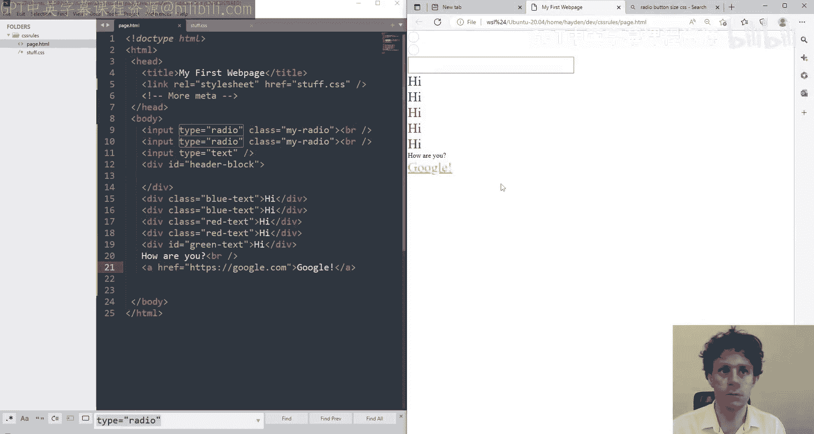

Um。These ones are these the combbininators are ways of applying CSS rules because again these are all about the selectors of CSS right we're not talking about the properties and stuff Combininators are those things that you can totally avoid。

 you don't need to know them， you can kind of solve every problem without them。😊。

But if you learn how to use them。You will start being able to code far more concisely and more powerfully and easily。

 right， So you can see here we've got this little series of。

Ds and spans right div class equals a and then spans and divs like this Now I'm going to quickly write this up because I can't copy from the slides here and then we'll we'll kind of take you through these different combbininators that make。

Sttyling these in intricate way is very easy。So if you do have these kinds of divs in spans sometimes you want to be able to specify things a little bit more specifically such as I want all of the B classes inside of the A classes to have a certain style or I want all of the divs inside of the divs with a certain class to have a certain style now this can be tags or the universal selector or classes or IDs this isn't tied to one of them is kind of how you explain the relationship between them so if you have a look here for instance。

 the first one is if you put two selectors I mean。Two things as a selector。

 say dot A dot B and what this says is that these styles apply to all elements with class B that are inside an element with class A so if you have a look on the left here look at all the elements with class B that are inside a class A well that's one here right。

 see there's five。Six， four， three and one。 so now if we go and load our page because I've got I've got the code up here。

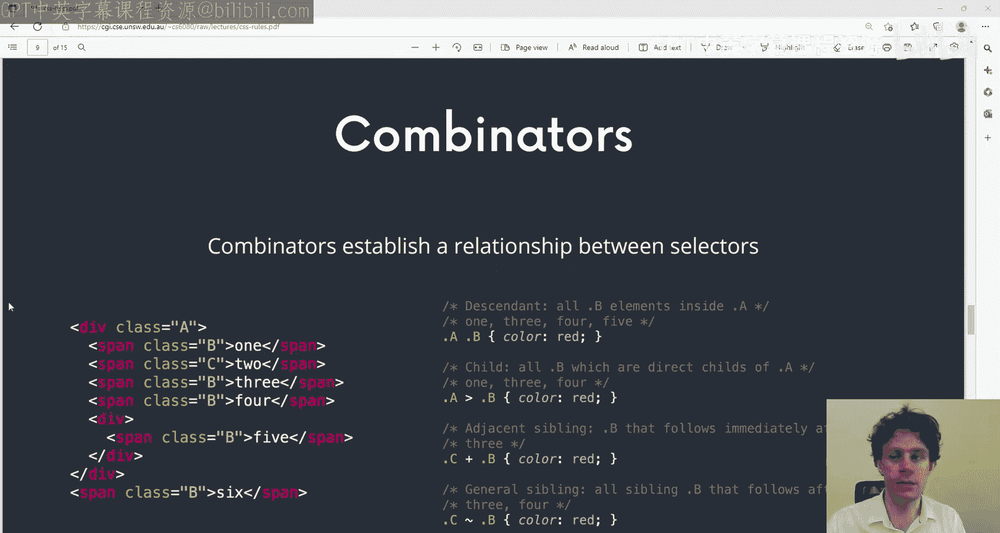

Actually sorry， I need to go and apply these styles， don't I， you know， everything。

 all the dot Bs inside of dot A， let's say they're all colour red。You can see we've got that there 1。

2，3，4，5 Now you can see that C here is the two that's black so that's why that didn't apply so that one's super helpful Obviously you could do something like say like you're like why do I need to do that Why can't I just everything with B is red that worked fine And the answer is because sometimes you。

You know sometimes really common names you might use in multiple places so for instance let's say that you actually have your inputs be a class B as well maybe maybe class B is a pseudonym for like if you were to have a class that says like red or strong or primary or secondary or warning or danger。

 you know like these kinds of general words。And quite often you might have something like a class B that has a style everywhere right quite often class B will have a style。

 but then you want to kind of add extra styles to all the bees inside of a certain area。

 so that is where we get。

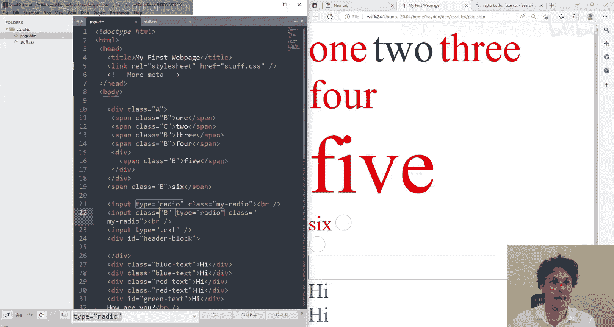

These kinds of descender ones from now the child one is very similar and in the sense that it's like an inherenther。

 not an inheritance thing， it's like a descendant thing except the child one only applies to elements which are a direct child of a so as we saw before。

This top one， first one color red applied to all bees within A。

This one applies to only bees whose parent isn't A。

 which means that this five here is out same with this well this six was never in because it didn't count that's what we saw before except my screen was a bit big so。

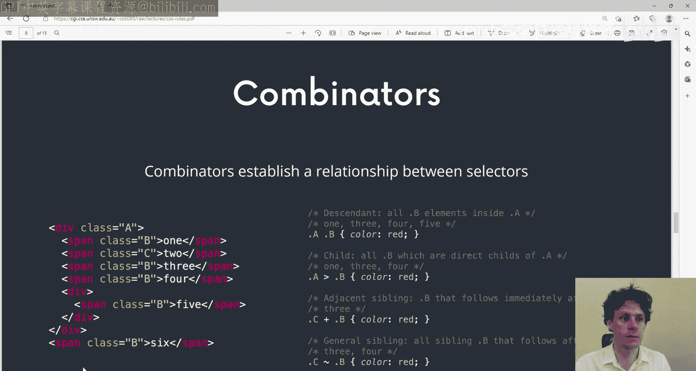

ItsTing down here so youll see here this is a original this is the original one A and B that's why six will go black makes sense if I put this here now they become the child one which means that we lose five because five is not an immediate child it's kind of tucked in between another div the next one is adjacent sibling so that's basically saying any B that follows immediately after a C。

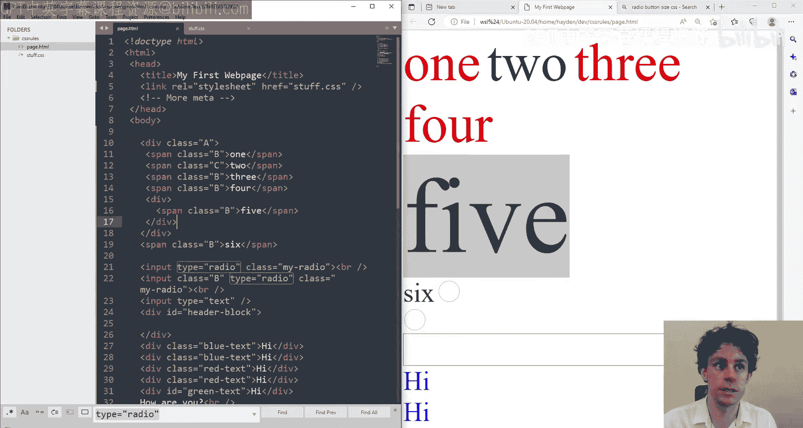

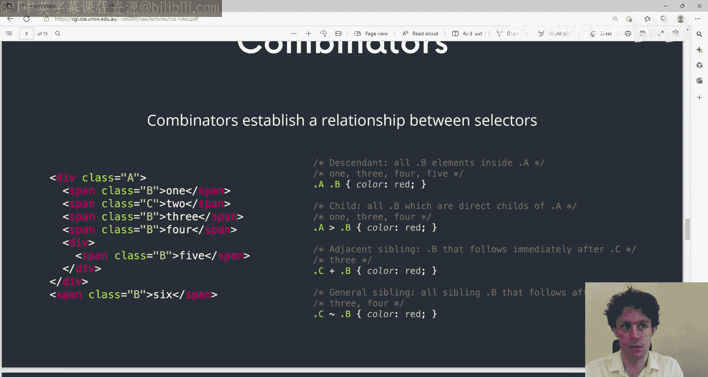

So this one is pretty obscure， I won't lie you， I haven't， I haven't ever used this。True， like。

For something real， more just for playing around。Oops sorry this is meant to be C plus B。

 so C plus B， let me see if I'll just split these by column。Two rows， beautiful。

Just so you can see this a bit clearer。So this C plus B now， this means that only this。3。

Has that color， which makes sense because if we go back to the rules， the rules were that。😊。

Any B that is adjacent to a C。

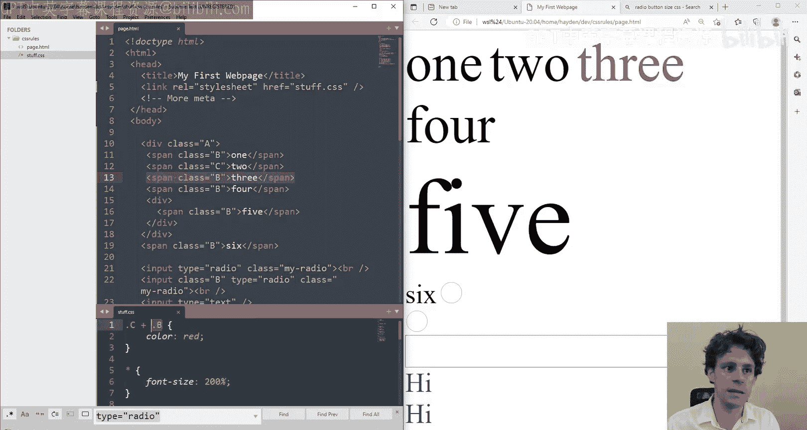

Pretty pretty okay and then the last one is general sibling which is all siblings all bees that follow after a C in that kind of block so in this case now that will make three and four colour I believe we can try that out right so if we use the tilda here now it's three and four now obviously the be here does not apply because this span class B is not a sibling。

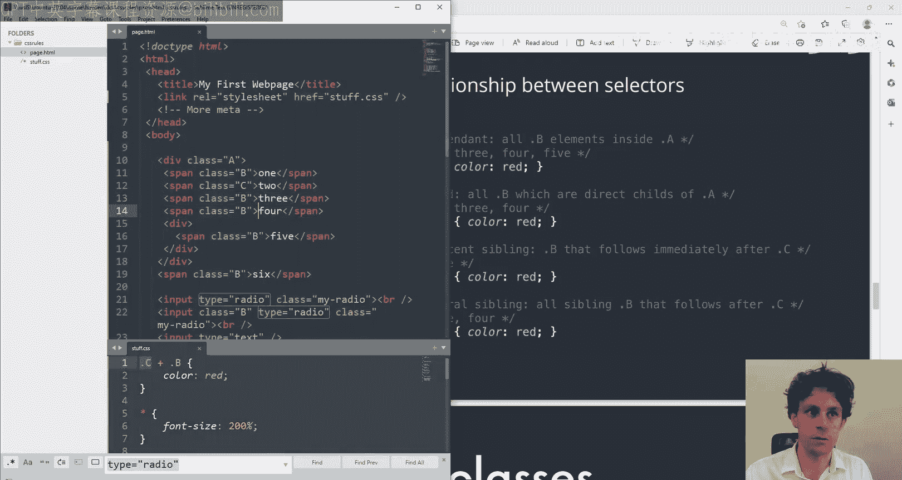

Obss because it's like nested inside and then similarly the 6B here is not a sibling because it's nested outside so a sibling is something in the same code block it's not something in a deeper code block or an outer code block or anything like that。

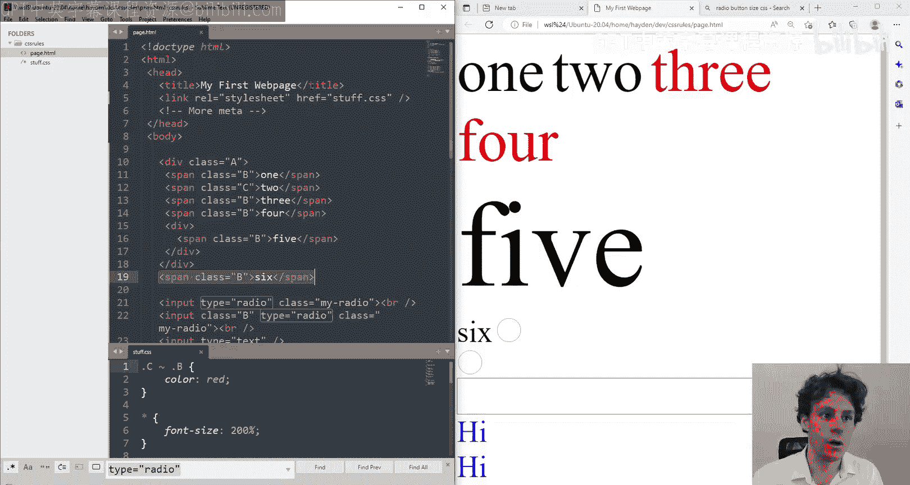

That's that's the combinators again the top two super interesting they're always ones that i'm like I should use them more so I'd encourage you to these next two I have not found a ton of the use case for but it gives you a sense of the kind of power of selectors。

😊，Of CSS， so keep an eye out for those now。More ways we can use selectors are pseudo classes。

Sudo classes are a way of applying。嗯。Applying properties to particular tags or classes or IDs when they're in a particular state。

This is probably a new concept because。Mostly to a new state。

And we'll apply those to a few elements we can practice around with them It also just reminds me that you know this example we did here it includes a lot of stuff with with classes but things don't have to be classes right so for instance let's say we take a look at something here where we say you know what all class of Bes。

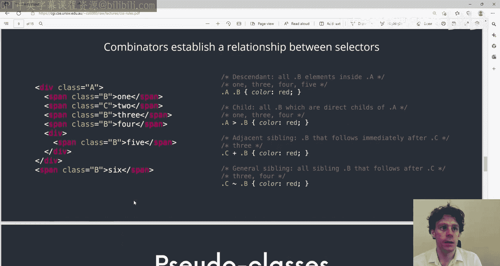

With that are inside a class B or an immediate child oh sorry maybe let me do it a slightly different way Yeah。

 all class all class Bs inside a class A right now this will get us back to that red one we saw before but they don't always have to be classes they can sometimes just be tags as well so for instance here I don't have to say all。

Class B's within a class A， I can actually say all class B's within a div and this will apply normally too。

 but you'll see it it will have a funny side effect because。Now this five。

 which was previously not selected， is selected because you know。It's a it's a。

Immediate child of a div because in this case， class there is no class B that's an immediate child of a class A because this div has no class。

 but when I change it to div， suddenly that applies to and this also means if I change this for instance to a span。

That doesn't work because there are no class Bs in this block here that are an immediate child of a span。

Which is very very interesting now you might be you know don't get this mix start with like a span of class B because that's actually a totally different thing that's what a span of class B means so you could actually be even more specific if you wanted to you could say give me all divs with class a。

😊，Then only apply it to the immediate children that are spans of class B。

 so you can actually join these。You can join the tag selectors and the class ID selectors this way like this。

 so span IDB or span Class B you know very interesting that way， but back onto pseudo classes。

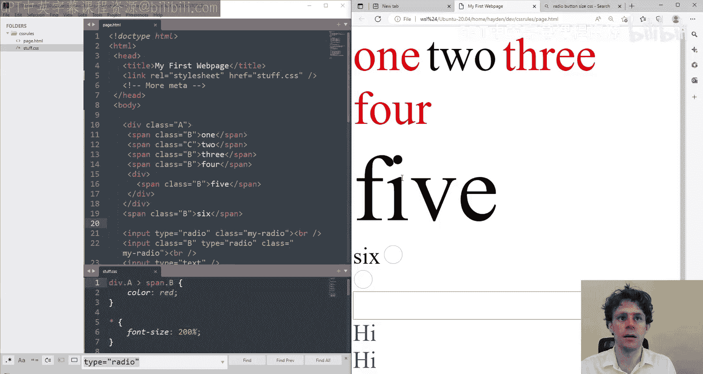

Sudo classes are one of those things you don't use them a lot。

 but when you do they're kind of really useful and probably the most common ones I've seen or well see are a button hoverva input disabled they two super super common ones input focus and a visitedited you know they' used as well I mean all these things are used somewhere it's just a question how often we'll do the well do the a visited one first so for instance here if I go back to my CSS file I will actually add now a new property so I'll add a pseudo class to the a tag selector called visitit it and what this is is this is the style to apply if you've visited that link before so in this case here if I visited this link to Google then it now comes up as purple。

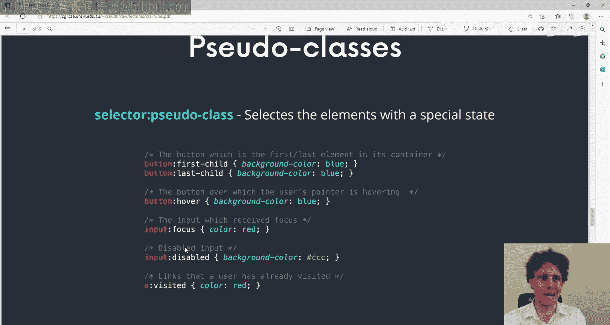

Right。😊，This doesn't mean that you've ever visited Google it means that if you've clicked on that link and visited Google that's why if you often go back to like you know you' ever gone back to websites and some of the links are a different color and that's how you know they're the ones you've clicked on or you go to Google and you've Googled something before and you can see what you've Googled sometimes I think that's kind of funny when I'm showing someone something and I'm trying to make it seem like I'm just trying to figure it out as I go but then you see there were students too you'll be like oh it'll be like lecturing andll there's nothing here but there'll be a link that's like obviously been clicked on before and that's because there's a visited pseudo class that's been applied to something somewhere again it doesn't have to be a tag it can be things like a class so for instance like。

😊，Purple visit could be the class name here， so on my A tagag I could say you know class equals purple visit。

And now it will apply to it based on the class， it doesn't have to be necessarily the tag we also talked about input so for instance we have our input up here。

嗯。Our text input， well let's give this a class name of say name field like this I might use a dash to make things a little bit cleaner so we go dot name field and I've got this thing down the bottom I should probably just use that。

So I've got my name field and。Let's say that again， my color is blue like this。Okay。

 so when I type in that， that's blue， I can pre populate a value。Of text that's just walla。

But now let's imagine that the field is disabled， maybe I want the field to have a different property when it's disabled。

 so for instance so here when it's disabled I want it to be red。Like that。

So if we remove the disabled。It is blue and the disabled， it's red。

Another example of a pseudo class definitely as I said before。

 probably the most common pseudo class I've come across is the hover so let's apply a hover to this link。

 but let's make the link green for instance so when you actually move your mouse over it let's see if we can make it a different color so if we say a ho a hover color green and I refresh this page you'll notice that it doesn't change green in this case it's probably because this purple visit as overr it but if I get rid of that you'll see that well my mouse moves over the Google link turns green so really really useful really handy that's kind of you'll see that used quite often in terms of removing an underline so for instance if I text decoration none as to remove an underline so in this case moving my mouse over it does that it's actually used quite often the other way around so often you'll see people apply text decoration when you put your mouse over it not the other way that's been a really common into that trend of the last 10 or 15 years you'll see most links now they don't。

Have an underline like they're kind of used to until you put your mouse over it and that's what indicates that it's an actual link so there are a few different pseudo classes the focus one is when you've like clicked on an input that'll make more sense when you talk about the events lecture when it comes to learning about the DoM there's more pseudo classes than that you can go and play around with them if you'd like。

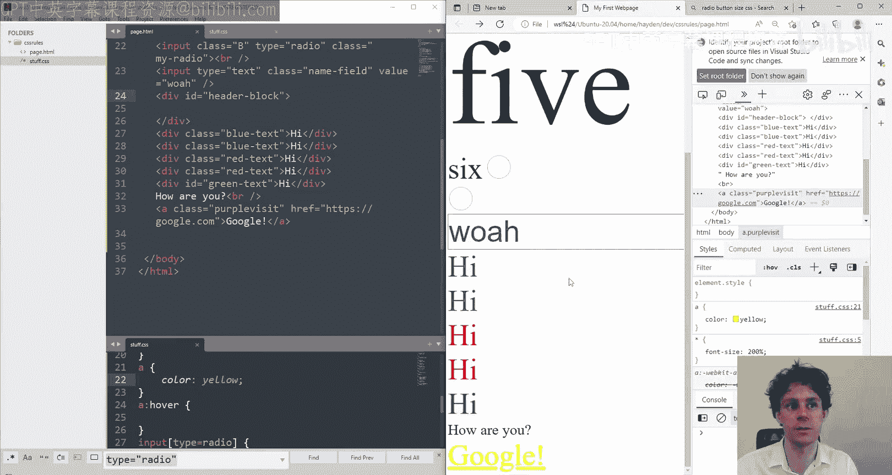

Then we get into an even more obscure area， which is pseudo elements pseudo elements are when you can create cosmetic content for the element or a specific like part of the element。

 they're really trippy， I haven't used them a ton。😊，But you can see， for instance。

 you can use this one that's like the first letter is red。

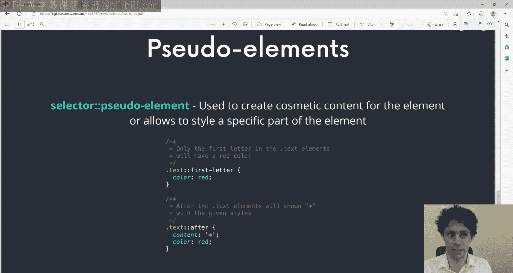

Um， this is quite interesting because imagine down here you have a paragraph that's like， hi。

 how are you？嗯。NP like this， I really miss patting your dog。I hope we can eat。Thai food。

Like that so we've got a few paragraphs down here and you know what I might use the P tag selector in this case and say that first was first letter wasn't it yep。

 so first letter color is red and let's see what this does。

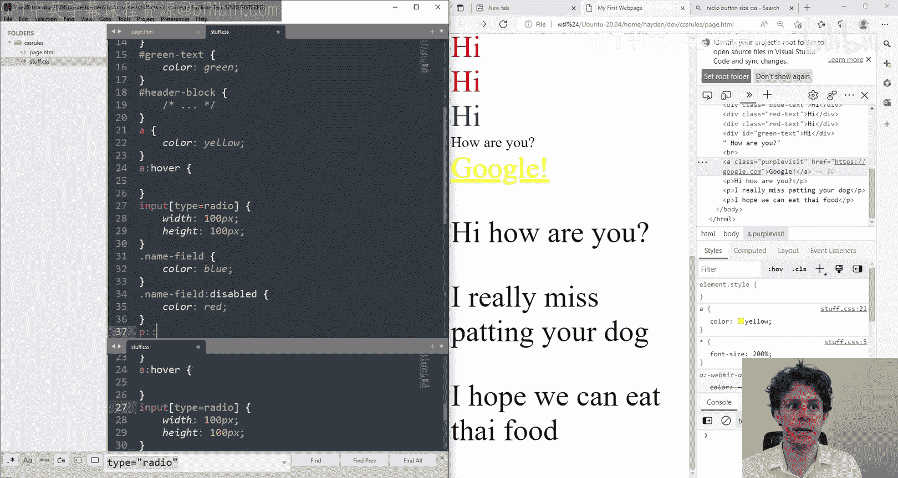

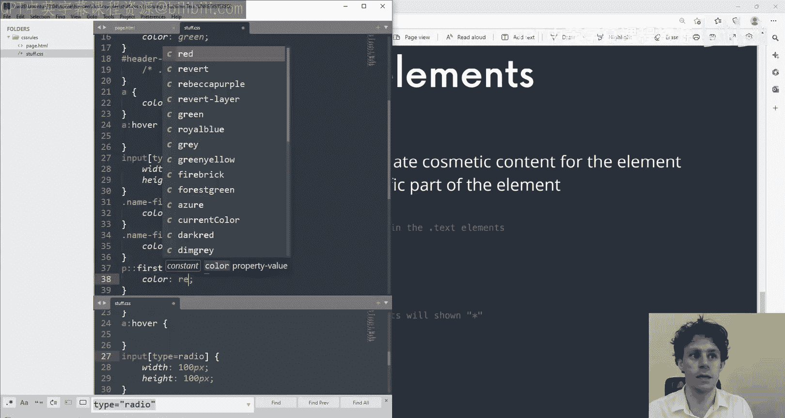

So now the first letters of all of those tags are red now obviously this won't apply to every single HTML element right you have elements that are images and if you apply this kind of if you apply the pseudo element to the selector to like an image is just going to ignore it so these things aren't totally universal but you can definitely apply them in a lot of scenarios then there's another one that's like double you notice the pseudo elements have two columns if that wasn't immediately obvious so just the pseudo classes have one column but the pseudo elements have two there's another one here after the dot text elements will show a star。

😊。

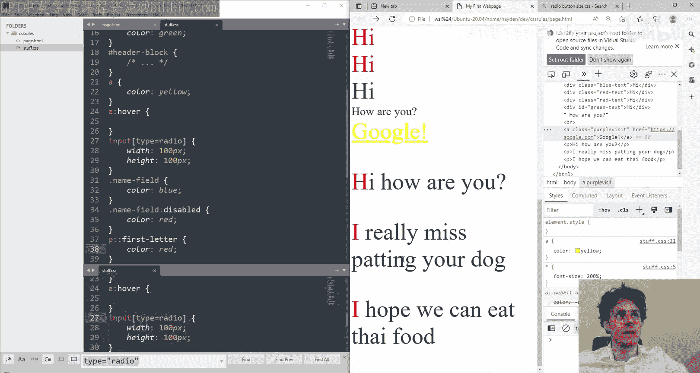

Very interesting so what this means is like let's say I want to force full stops at the end of my paragraph because this is getting really obscure and fund right it's like I don't want to。

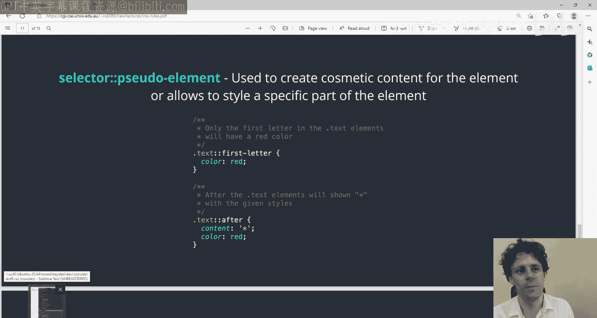

I don't want to add them。 And I want all my full stops to be like gigantic or let's just have a bit of fun。

 So it's like pe after So immediately after I want there to be a star content。 let's try that first。

 Okay， now there's a star let's do the full stop I mentioned。 Okay， but， you know， let's try。

 let's try and make it really big。 Let's make the font size 200 pixels。 Okay， so we got a really big。

😊，sorry not 200 pixels 500% so after every paragraph is now a five times big full stop at the end。

 what's the use for this？

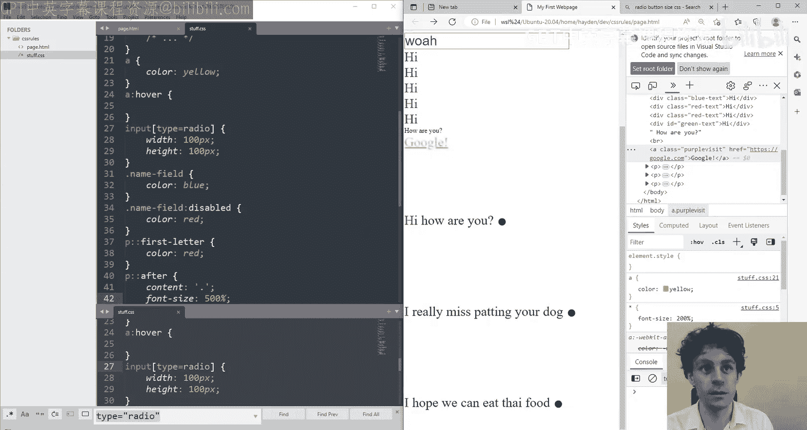

I haven't figured that out myself yet， but again point of this is to demonstrate these areas and know this is what we want you to think about because then later on when you see these kinds of double colon things know maybe you'll have a particular problem you want to solve you go to Google you go to stackoverflow you see these double colons you're like what is that and it's like oh I remember that's a pseudo element I've never used them and Hayden sounds like you hadn't used them much but I'm excited that I can use them you know so that's really what this is about。

Not a lot to go over've only got a few more slides left。Cascade。I kind of referenced this earlier。🤢。

But there's always this question of like what happens if you define the same thing twice so let's say that I have two blue text in my code。

And one of them for some reason says purple because someone doesn't know what blue is what is the blue text these two highs here going to what are they going to do well they're going to be blue right if I swap these around they're going to be purple or。

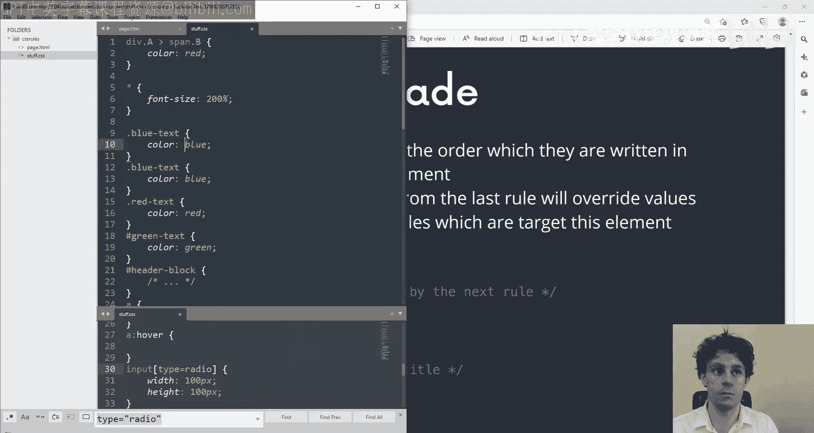

Doesn't look like purple to me， but that's okay I think my screen's redshifted tonight yeah it's purple so。

😊，What this means is that the CSS property that's defined is basically。

The most recently defined ones。 So the rest of these lecture slides are really focused on like。

You know， in school you learn about order of operations and stuff like that like which operations come first。

 it's kind of like this here what takes precedent， you know we talk about precedent a lot in computer science。

😊，Programming， particularly with operation。 So it's always the last defined one。

 And you might think why in the world。Would I have two blue text classes like what am I trying to solve for here and the answer is when you build really big web pages。

 you're likely to have a large amount of CSS sometimes across many files and you know what sometimes you will import a file or a library that someone else has made and they've defined everything blue textex red text green text。

 big text small text and you might want to reuse the same name or you might simply want to override that and as long as your one was defined most recently it will apply now the interesting question too is like what happens if I make this font size really even bigger。

You can see there that doesn't seem to work， but if I move it down here。

 I't want to go to the very font size。Should work。Let's try bold， bold text。Right。Should work。

That's because when you like they kind of always compose together so when you define one and a second one after it's not that the second one kind of throws the first one in the bin and just like replaces it altogether together it only replaces the styles that were defined so that's something to keep in mind too it doesn't just delete everything and just overrides things that already exist so that's how the cascading works when things are written when things have the same selector a much more common thing you're going to see though is inheritance and this is something to really pay attention to and this makes sense because quite often you'll have something where you say you've got like a block and that block is defined that everything in it is red and then inside of that you might have another span that says everything inside of that is blue or it doesn't say anything in particular。

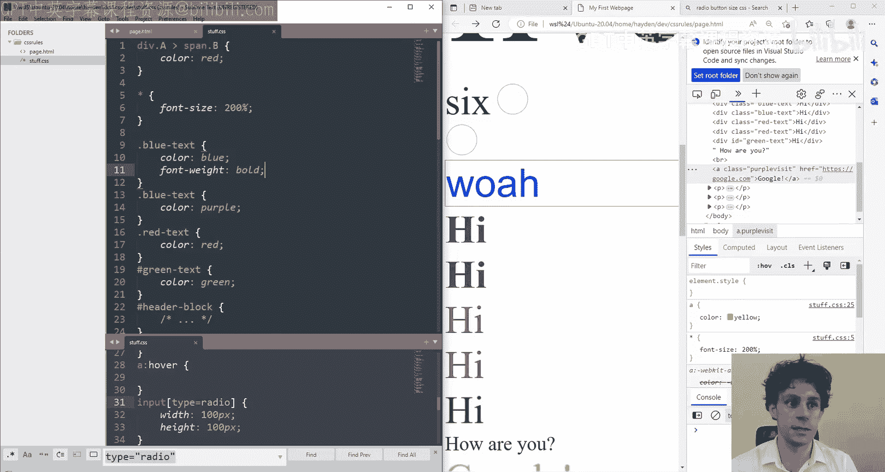

And the way that CSS works here is that when you define。

 it's not true for every single property value， but it's true for a lot of the basic styling ones。

Like， you know， color and size and things like that is when you define something on the outer element。

 it will kind of cas I don't want to say caske because we just talk about it。

Be inherited throughout all of the sub properties， subt， sorry。Back up here， let's say。I。

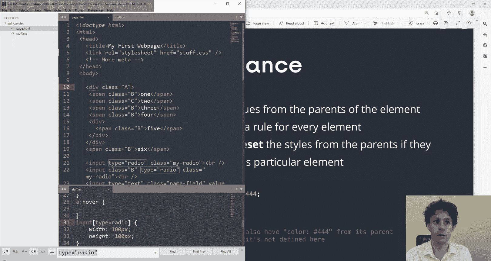

Want to add another class to this particular div and by the way。

 I can add another class just by literally writing it after I'll call this one。Bold， for instance。

Like that， I can call it bold。This is how you define two like how you apply two classes to the same tag by the way。

 so if I come here and say bold and I say font weight is bold it will now apply to all of those things because all of these spans and this div and this span all inherit it and if I want to stop that I have to go and like explicitly define it so for instance I'm might have to say you know what all class B's inside of let's go back up to our top property here。

 all of class Bs， all of span B's inside of div A I want。To have a normal font weight is in not bold。

And you'll see that will now unbol some of them like that。Now you might be thinking， okay。

 now I'm really confused because Hayden said before that。😊，If we define things later。

 it should override it or it should come first。That's only true when two selectors are identical。

 so in this case dot bold here。And this one。Are different now we're going to talk about specific at the end。

 But the point is that overriding thing I mentioned only really applies when。Well。Yeah。

 it only really applies when you're kind of dealing with things of equal power， so to speak。

 but again， we'll come back to that in a second， otherwise we'll get confused。

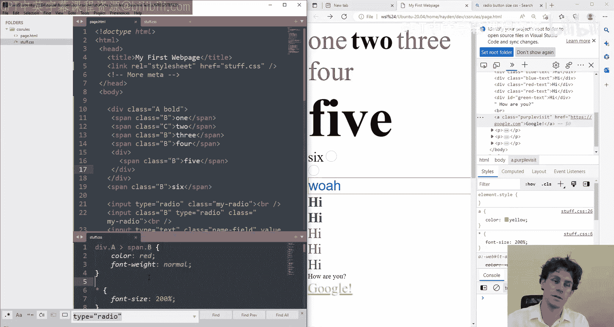

Point is things inherit properties like color and weight and stuff all through the tree and if you would like to change that you have to explicitly say that Now what I just talked about in terms of specificity。

 that's what specificity。Iate that word。嗯。呃。One of the strongest things you'll battle with is that quite often an element has multiple rules with the exact same property and you're not really sure which ones should apply。

😡。

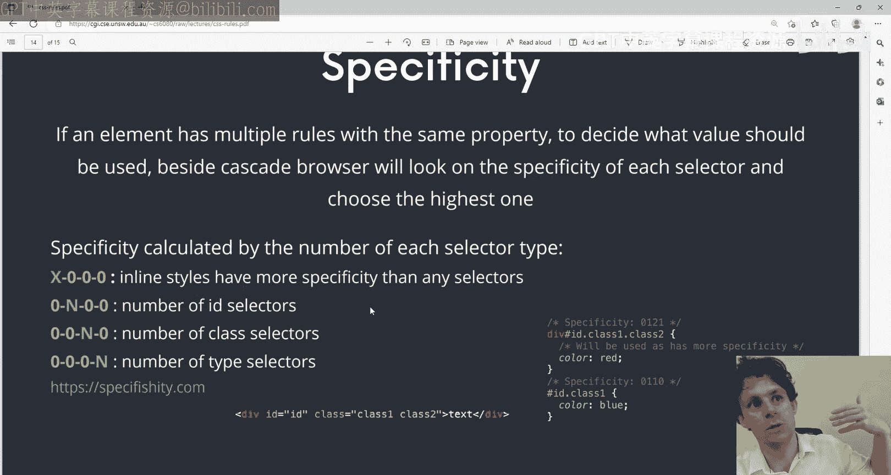

We've kind of seen that example here and I'll move this up the top。

Where I take my bold and I put it here and then you think， hmm。

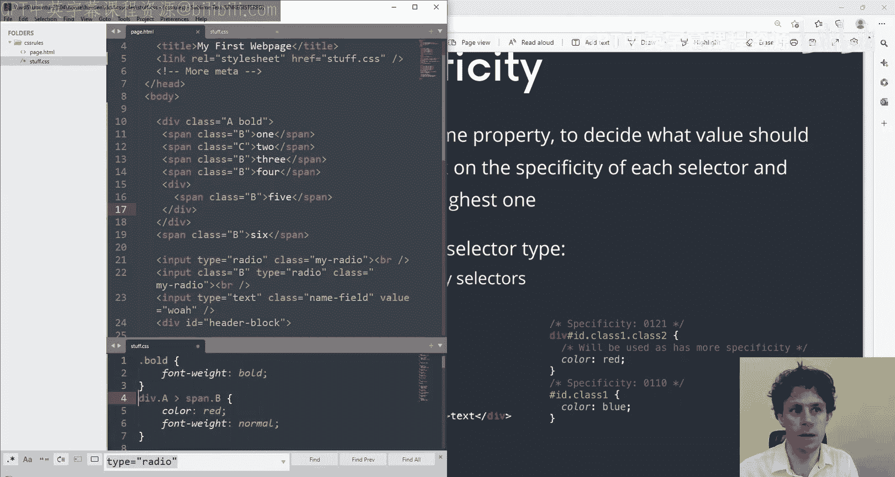

Which one should apply， because in some ways I've said that everything inside the bold class should be bold。

 but then here I've said that everything every。B class span that is an immediate child of an A class div should be not bold。

 So why does one of them win essentially， you know which one has more power is what I referred to it before。

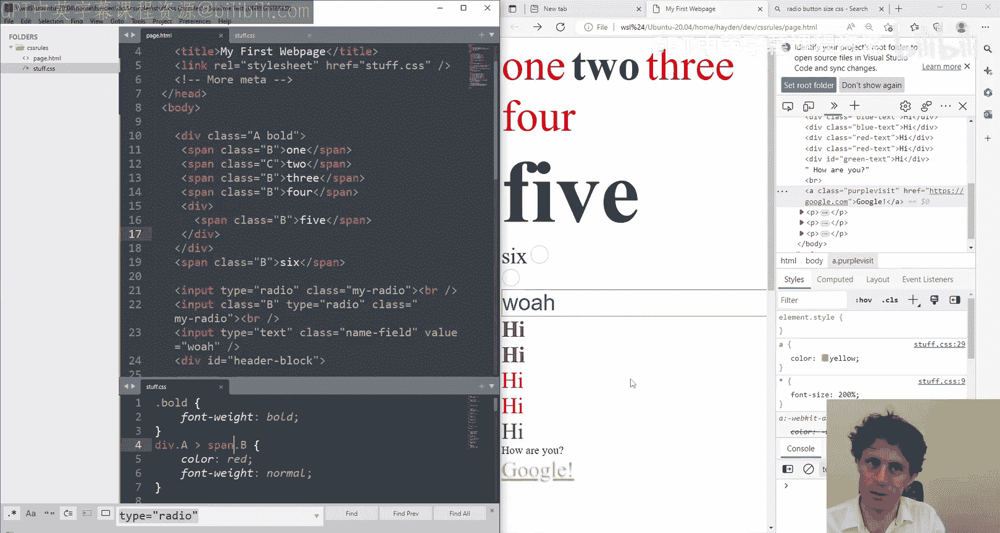

But。There's a little kind of formula esque thing you can see here， which is that。You know， there's。

 okay， firstly， there's a general hierarchy which is generally， which is very straightforward。😊。

Tags have the lowest power， then classes， then IDs， then inline styles。

 and a really simple example of that is if I come here and I go and make another div。

And I'll give it。Or maybe I'll make a H3 with an I of。You know。Cat。

 a class of dog and an inline style of color red like this。

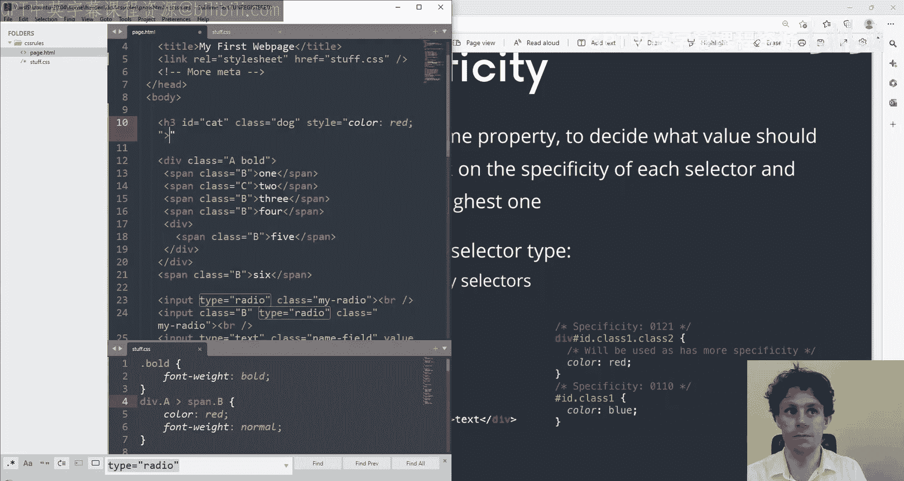

My title。Now my title up here is red that makes sense if I apply three separate styles firstly I say you know what H3 is going to be color blue and then I say my anything with ID cat is going to be color green and then I say anything with class dog。

Is going to be color yellow。Now， the inline style always wins。Like that。

If I get rid of the inline style， though， what's going to win， it's going to be the I。

 It's going to be green if I get rid of the ID。It's going to be the class which is yellow and if I get rid of the class it's going to be the tag so there you'll kind of precede rules when it comes to these like conflicting CSS properties。

😊。

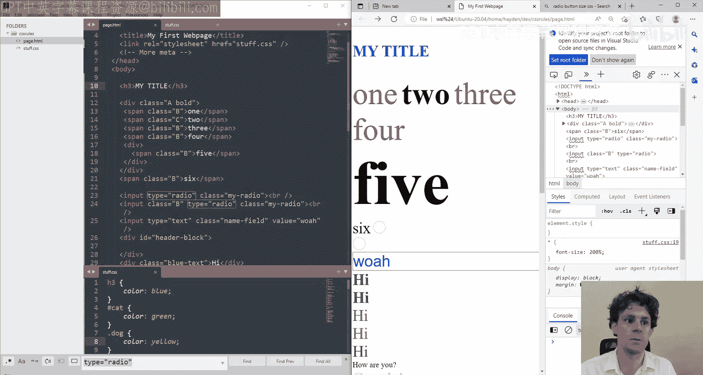

It's always in line ID class and type Now the actual rules are a bit more involved in the sense that。

Like。This mathematical thing。I never really use it。

 but it makes a lot of sense what it's like what I just described makes sense when。

Things are of different type when there's a tag definition and an ID definition and a class definition etc。

 but where things make less sense as if there are two kind of class definitions so a good example there is like well let's say I have my title like this。

But let's say we have dog and mouse like that and then in my styles now I not only have dot dog。

 but I also have dot mouse and dot mouse's color is purple， for instance。

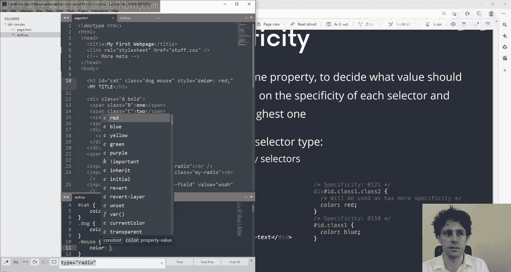

Right。Now in this case， it's like， well， let's get rid of this style red because that's overriding it because inline styles always win and it's like。

 okay， well， this is green now， why is it green？Doest make a lot of sense actually， oh， I did， sorry。

 of course I was like what？Confusing so， you know， it's like which one should win here now in this case。

 purple is going to win because。😊，The cascading thing now they're kind of equal so you can kind of see how this loops back in the sense that there are these specificity rules that help you dictate which should kind of have more authority。

 but when two things have equal authority， it's always the last one defined。😊。

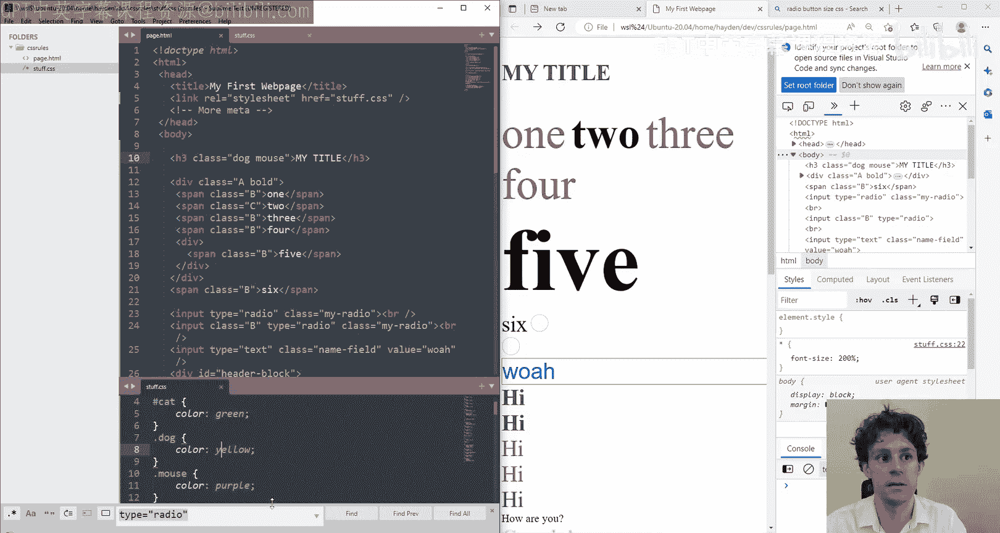

Now。What we're getting at with these rule slides here with this little kind of numbery thing。

Is if you do get these kinds of conflicts， the one that wins is typically the one with the most selectors。

 So this is another type of format you've seen here where what this is saying is that。

Color red should apply to all divs with ID ID。

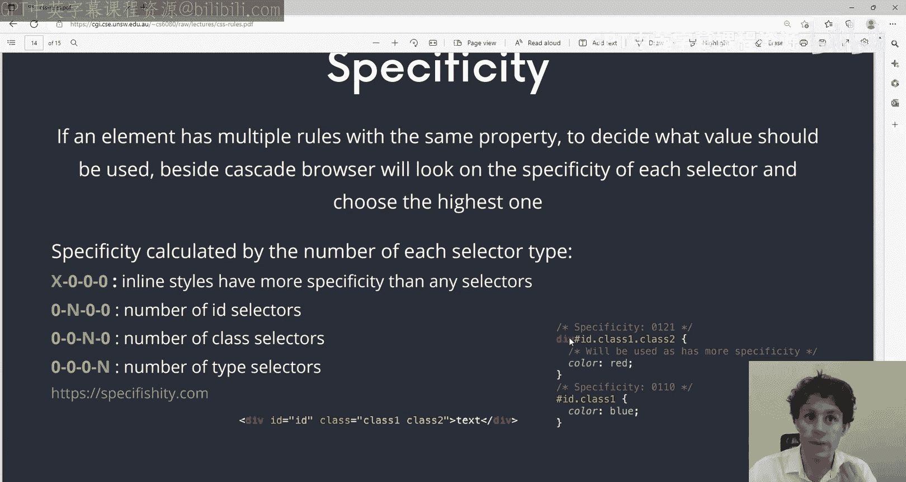

Class 1 and class 2。So similarly here， if this one is that dog is yellow and mouse is purple。

 if I say anything that has both dog and dot mouse that is purple well that will win obviously let me let me maybe flip that up here。

 anything that is dog and mouse will come first because when you have that immediate conflict where it's like okay well I have two class definitions right I know that classes are less important than Is which are less important than in line but are more important than tags will。

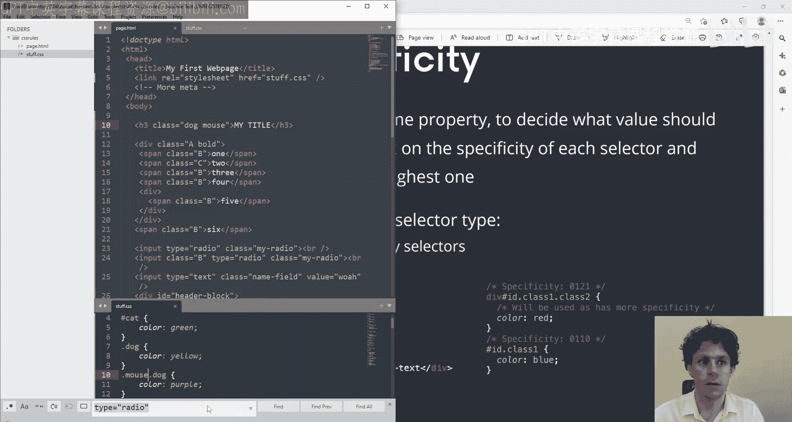

Which one has the most class specificity like that， so that's kind of interesting。😊。

And as you can see from the definitions here， it's saying that it's pretty much whichever number is bigger so in this case here。

 neither of them have inline styles。😊。

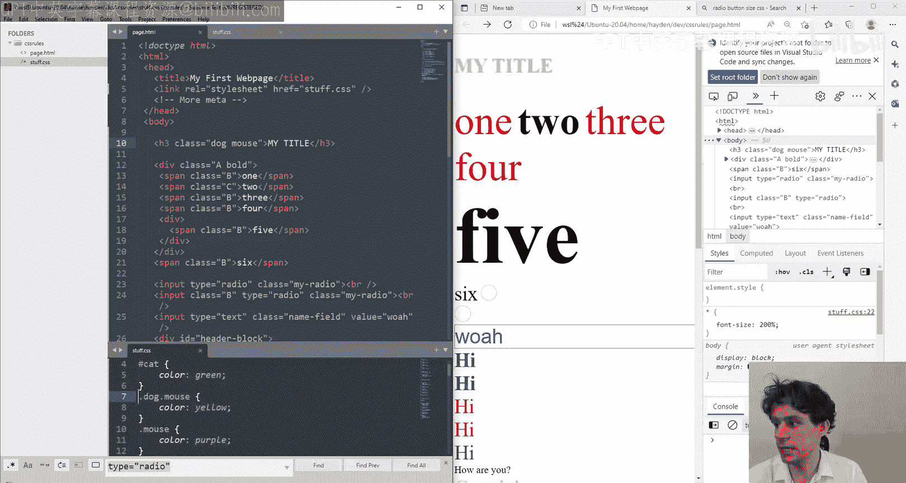

In this case， they both have one ID selector that we're looking at here。

 but one of them has two classes。

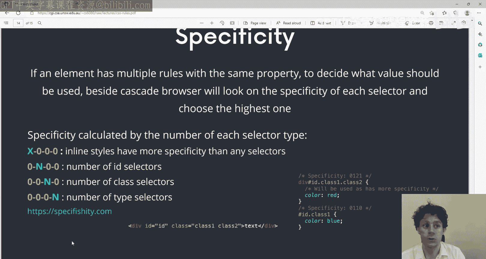

And this can get， this is getting very theoretical now。

 but let's imagine that our H3 does have an ID。That is cat， and let's remove the style for cat。

What this is saying is that you know putting cat here like this won't change anything。

 in fact if I won't change anything like that， but if I get rid of cat on the dog mouse one。

Then purple wins because if we go back to the specificity rules。

 you'll see that ID selectors come further up so if you were count the kind of if you were to sum up the the value of this。

 there'd be one ID and one mouse makes it 0110 just like this example here。

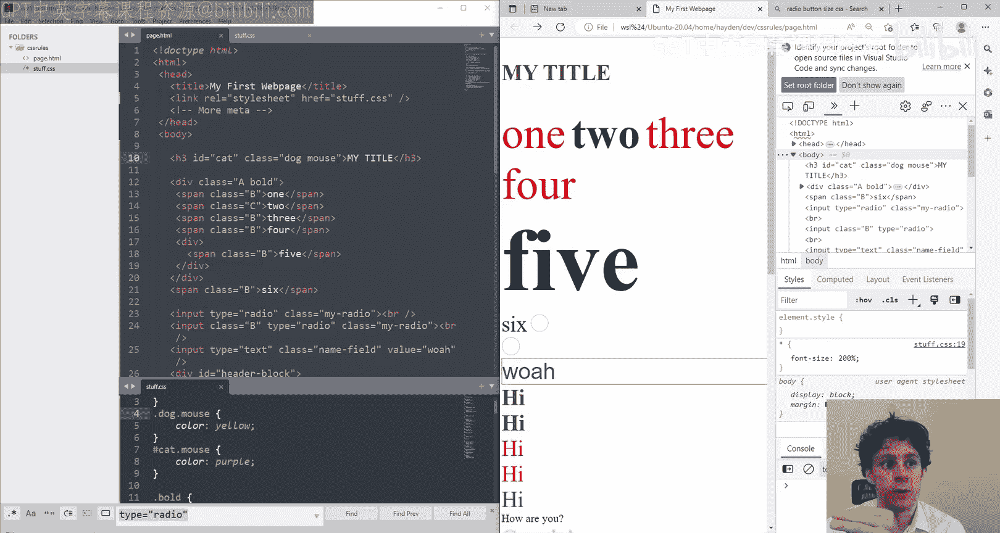

U but dog mouse is 0020， similar to what's here。So this one would be 0，0，2，0。And this one would be。0。

1，1， zero， yeah。I don't want you to get the impression that CSS is super technical and mathematical or anything like that I never ever think about this I never code and I'm like the specificity rules because you just don't come across that very often but why this is a useful exercise is you know where computer scientists we're here to understand how things work that's how it works and now it'll make sense so even though you'll probably never do that math in your head not that it's difficult。

 you'll never sum that up in your head you at least now understand the underlying mechanics of it which is really important and this brings us to the last part here when we're dealing with specificity which is the exclamation mark important。

😊。

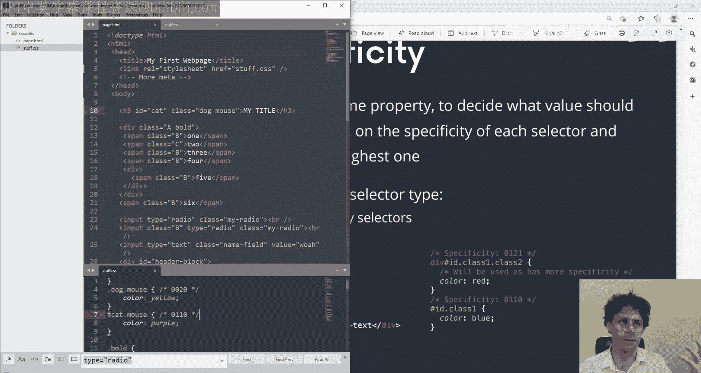

啊。😊，Rule this one is a funny little thing it's it's， it's like an anti patent in a way， it's just。

 it's like a hack that。Really can mess things up， but it's like a， it's like a， you know。

 I don't know， it's like a flame thrower， I'm sure。Sure that'd be really useful sometimes。

 but doesn't mean you should have it。It's。It makes it really hard to figure out。Let me explain it。

The exclamation mark important is essentially a way of kind of overriding all of the specificity rules。

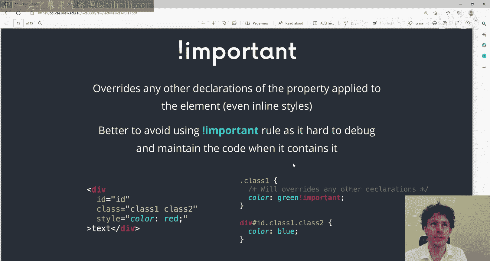

And that can be useful to hack with， but it can be very bad to make clean code with and what I mean by that is let's say we look at something like this now we had all these things before about H3 and we had inline styles right where it was color red。

And obviously the inside inline style was going to win like this color red was going win So let's say I go and put this exclamation mark important now on one of my properties it will go an override everything else in the specificity chain so you see that now this is blue it overrides the IDs。

 the classes the inline it's like it's like a whole extra level so you imagine youve got all these rules here that dictate where things go and once you put something in like with exclamation mark important it's suddenly more important than all of them and then you might ask well what happens if I put important in multiple places well then you kind of back into the old specificity rules here where it's like if I go and put important on here。

Then now it's suddenly purple and if you want kind of a quick explanation， it's like， well。

 you basically have like if you go in order of least least important。😊。

To most important you have like tag class ID in line， then you have tag important。

 class important ID important and in line important so you can kind of that's how I think about it in my head there's kind of like eight different layers here and that's why important is kind of annoying because you can use it and it solves some problems because you don't have to find out where it is or remember all these rules and sometimes it's necessary but it just complicates things because now suddenly everything is like out the window and。

Or the previous you know and if you want to then override that you have to figure out how to make it important further up in the specificity chain so that's why you'll see the lecture slides are basically just like used with caution better to avoid it it's hard to debug and hard to maintain code but in a pinch。

😊。

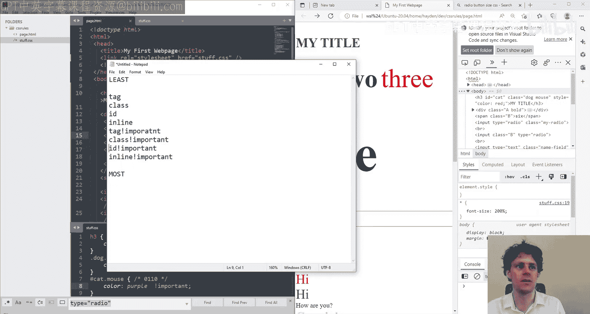

You know flame throw so that's that's everything a quick recap。

 most of what we've done here is we learned a little bit about the basic structure of CSS how to import it。

 then we learned a lot about selectors。Type selectors， class selectors， ID selectors。

 attribute selectors， combbininators。seudto classes and pseudo elements and then we talked a little bit about how kind of conflicts are resolved so the cascade when two things kind of have equal power or authority。

 the inheritance of how things kind of trickled down the specificity rules of how you know different types of things take precedence over one another and then the flame thrower important that kind of wrecks everything but you know is sometimes useful so thank you hopefully that was useful。

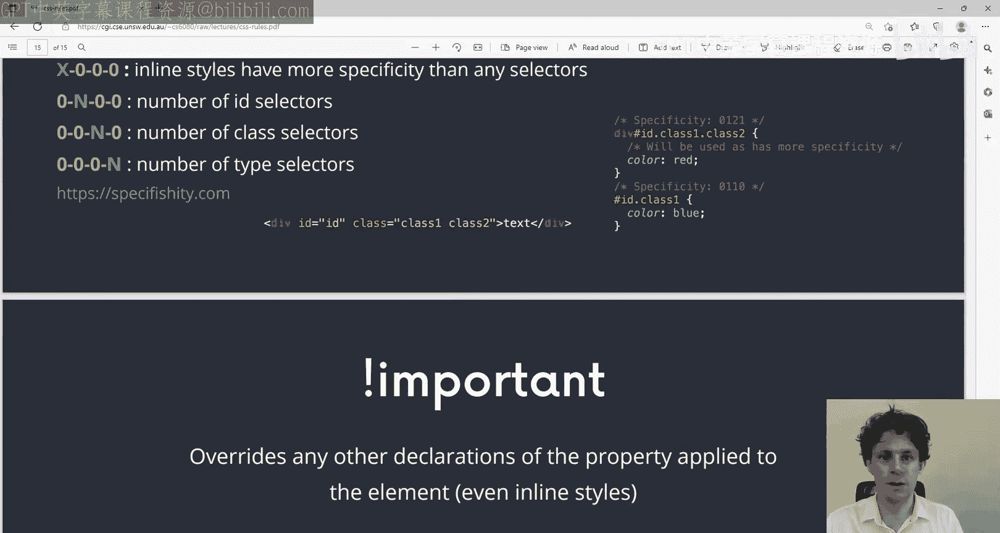