# 前端编程：07：CSS 格式化 🌈

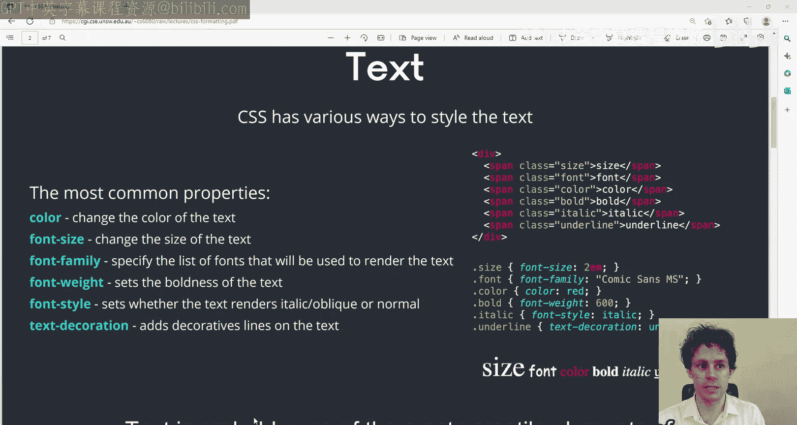

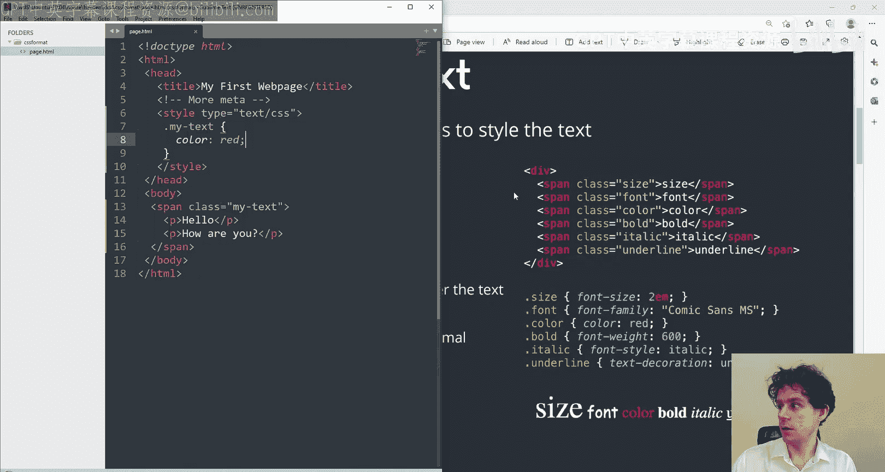

在本节课中，我们将学习如何使用 CSS 来格式化网页元素，使其在视觉上更具吸引力和动态感。我们将重点探讨文本和背景图像的样式设置，这是创建美观网页的基础。

---

## 文本格式化 ✍️

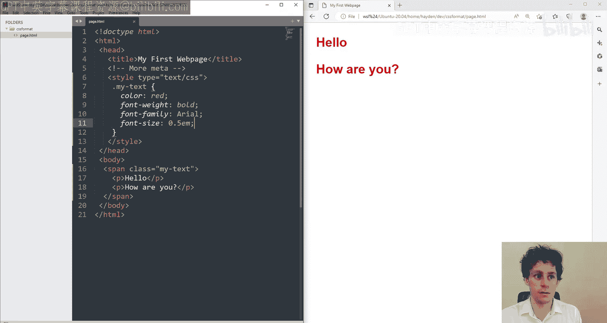

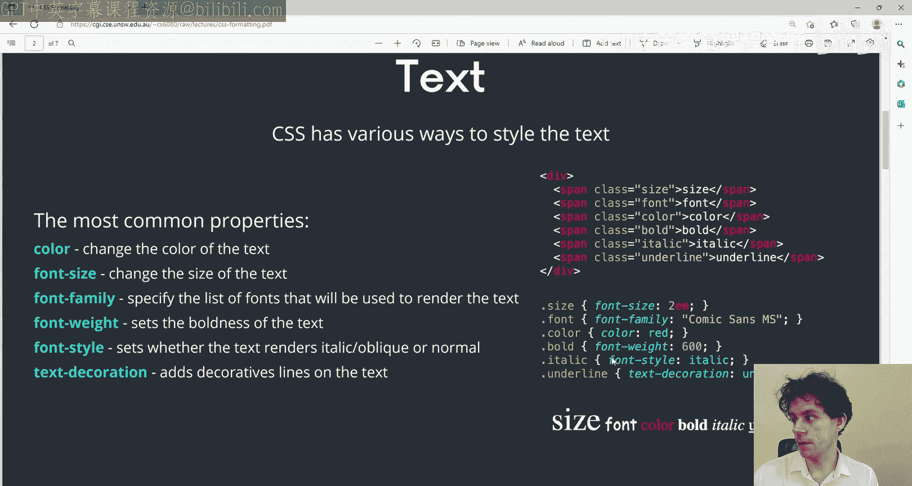

上一节我们介绍了 CSS 选择器的基本规则。本节中，我们来看看如何具体地设置文本的样式。文本是网页中最具可塑性的元素之一，我们可以调整其颜色、大小、字体等多种属性。

以下是一些常用的文本 CSS 属性及其示例：

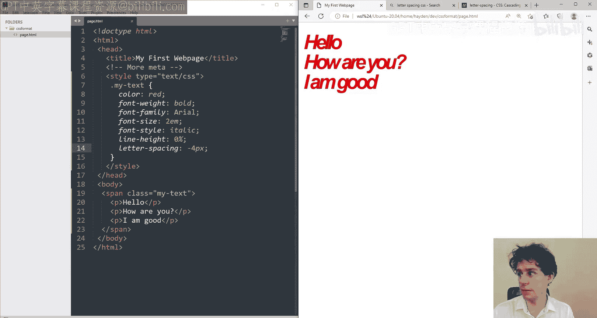

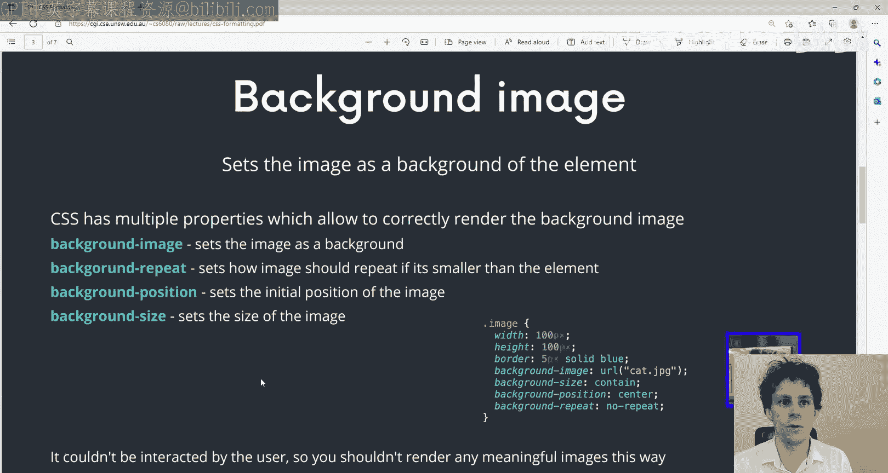

*   **`color`**: 设置文本颜色。
    ```css
    color: red;
    ```
*   **`font-weight`**: 设置字体粗细，例如加粗。
    ```css
    font-weight: bold;
    ```
*   **`font-family`**: 设置字体家族，如 Arial。
    ```css
    font-family: Arial;
    ```
*   **`font-size`**: 设置字体大小。推荐使用 `em` 单位，`1em` 是标准大小。
    ```css
    font-size: 1.5em; /* 比标准大50% */
    ```
*   **`font-style`**: 设置字体样式，如斜体。
    ```css
    font-style: italic;
    ```
*   **`text-decoration`**: 设置文本装饰，如下划线。
    ```css
    text-decoration: underline;
    ```
*   **`line-height`**: 设置行高，控制文本行之间的间距。
    ```css
    line-height: 2; /* 双倍行高 */
    ```
*   **`letter-spacing`**: 设置字符间距，可以为正值或负值。
    ```css
    letter-spacing: 3px; /* 每个字符间增加3像素间距 */
    ```

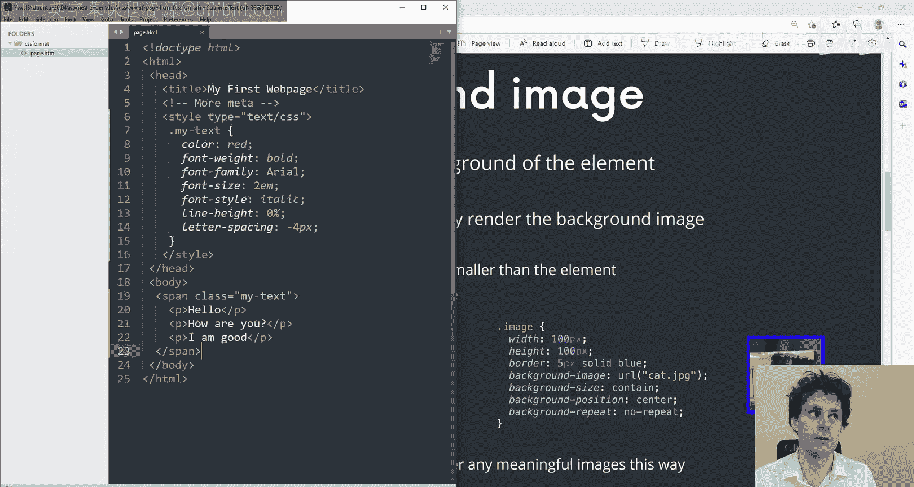

---

## 背景图像 🖼️

除了文本，我们还可以为元素（如 `div`）设置背景样式，使其更加生动。接下来，我们学习如何设置背景图像。

首先，我们可以使用 `background-color` 设置纯色背景：
```css
background-color: blue;
```

更常用的是使用 `background-image` 属性来设置图片背景：
```css
background-image: url('图片链接');
```

设置背景图像后，通常需要配合其他属性来控制其显示效果：

*   **`background-size`**: 控制背景图像的尺寸。可以使用具体像素值，或关键字 `contain`（缩放图像以完全装入元素）和 `cover`（缩放图像以完全覆盖元素，可能裁剪）。
    ```css
    background-size: 400px 300px;
    background-size: contain;
    ```
*   **`background-repeat`**: 控制背景图像是否及如何重复。
    ```css
    background-repeat: no-repeat; /* 不重复 */
    background-repeat: repeat-x; /* 水平重复 */
    ```
*   **`background-position`**: 设置背景图像的起始位置。可以使用关键词（如 `top center`）、百分比或像素值。
    ```css
    background-position: 10px 10px; /* 向右10px，向下10px */
    background-position: center;
    ```

这些属性可以分开写，也可以使用 **`background`** 这个复合属性（shorthand property）来简写。复合属性有特定的书写顺序，例如：
```css
background: url('图片链接') no-repeat center / cover;
```

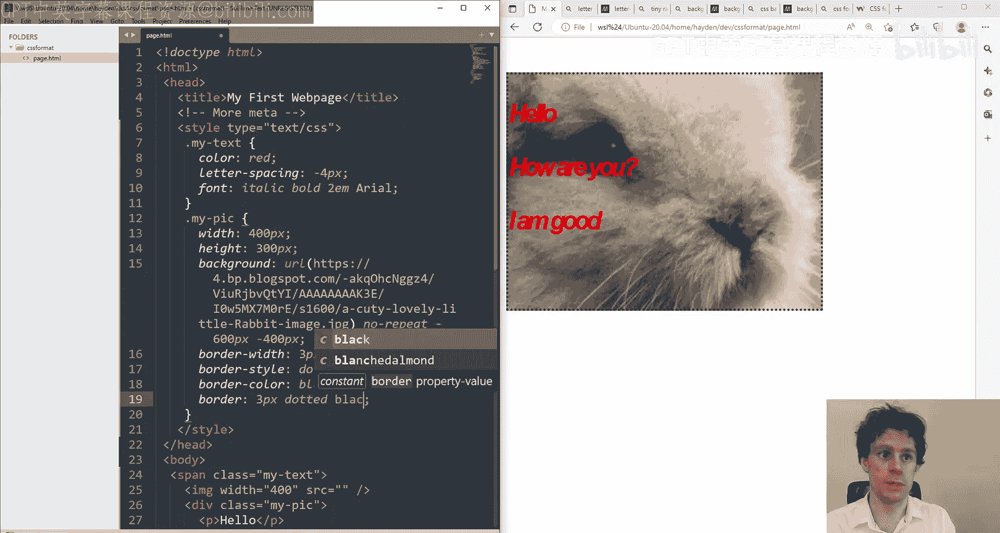

---

## 其他常用格式化属性 🎨

CSS 提供了丰富的格式化属性，以下是另外几个非常实用的例子：

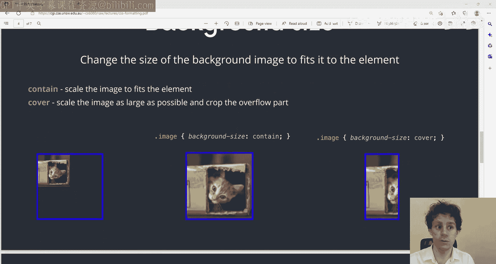

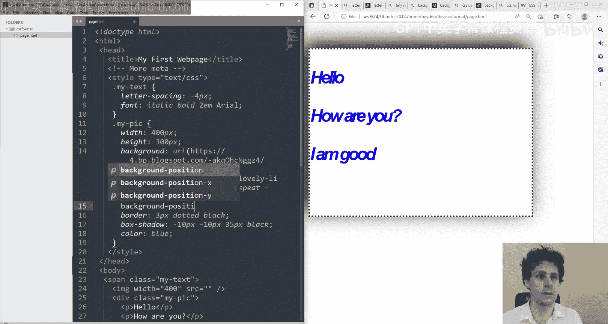

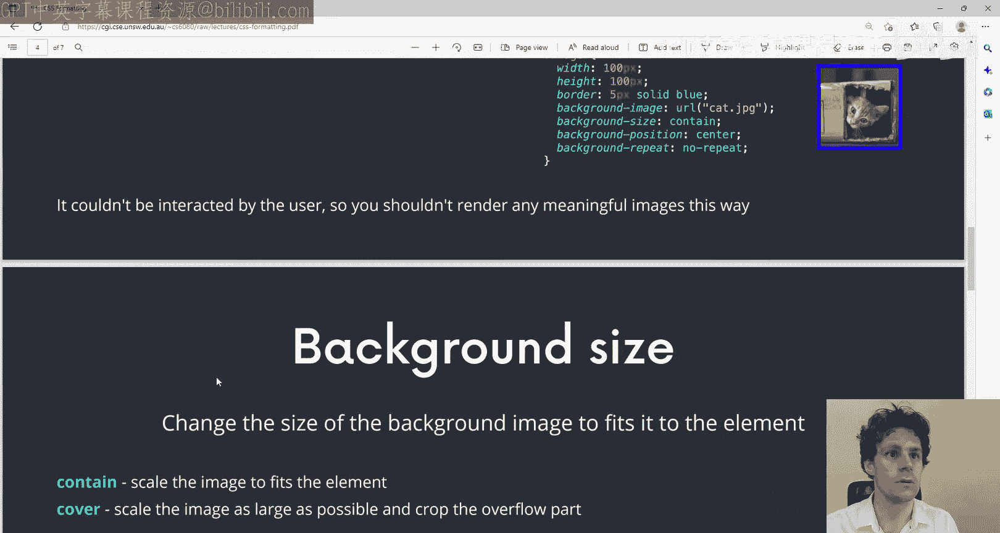

*   **边框 (`border`)**: 可以为元素添加边框。同样有复合写法。
    ```css
    /* 分开写法 */
    border-width: 1px;
    border-style: solid;
    border-color: black;

    /* 复合写法 */
    border: 3px dotted black;
    ```
*   **盒子阴影 (`box-shadow`)**: 为元素添加阴影效果。参数依次为：水平偏移、垂直偏移、模糊半径、颜色。
    ```css
    box-shadow: 10px 10px 5px rgba(0,0,0,0.5);
    ```
*   **文本阴影 (`text-shadow`)**: 为文本添加阴影效果，原理与 `box-shadow` 类似。
    ```css
    text-shadow: 2px 2px 4px #ff0000;
    ```

---

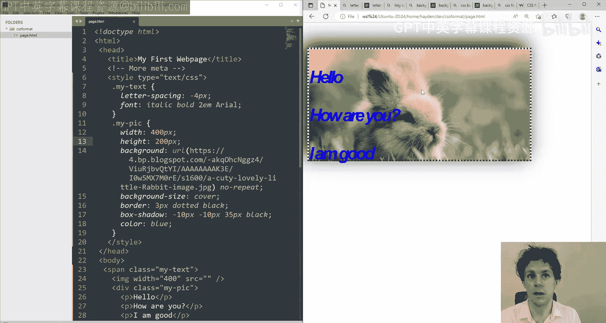

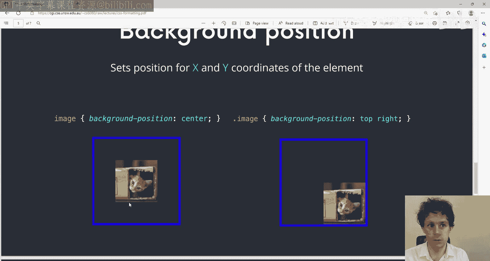

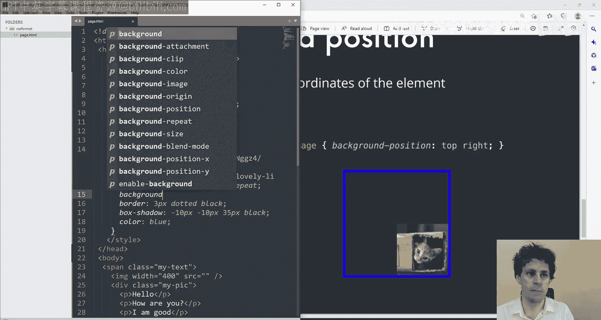

## 颜色的表示方法 🎨

之前我们使用颜色名称（如 `red`, `blue`）来设置颜色。CSS 还支持其他更精确的颜色表示方法：

*   **RGB**: 通过红、绿、蓝三原色的强度（0-255）来定义颜色。
    ```css
    color: rgb(200, 100, 0); /* 一种橙黄色 */
    ```
*   **十六进制 (Hex)**: 这是 RGB 值的十六进制表示法，更为常见。
    ```css
    color: #c86400; /* 与 rgb(200, 100, 0) 相同 */
    ```

在实际开发中，我们不需要手动计算这些值。可以使用在线的**颜色选择器 (Color Picker)** 工具来直观地选取颜色并获取对应的代码。

---

## 总结 📚

本节课中我们一起学习了 CSS 格式化的核心知识。我们掌握了如何通过一系列属性来美化文本，包括颜色、字体、间距等。我们也学会了如何为元素设置背景图像，并控制其大小、位置和重复方式。此外，我们还了解了边框、阴影效果的设置，以及 RGB 和十六进制两种颜色表示法。

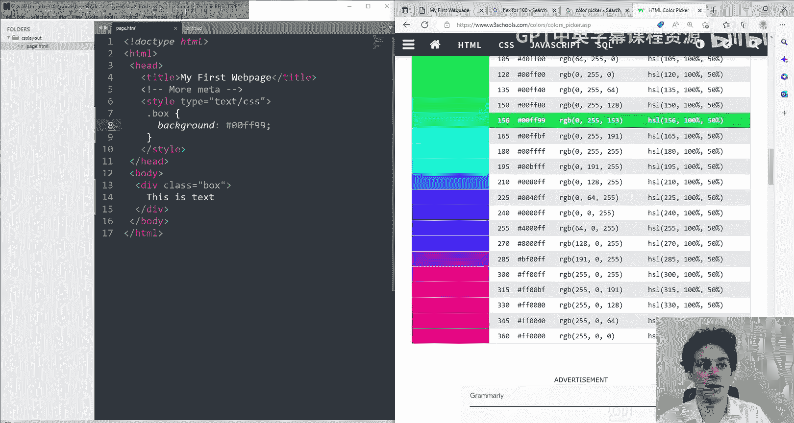

CSS 的格式化属性非常丰富，关键在于多实践、多查阅文档。通过组合使用这些属性，你可以创造出无限多样的视觉效果，让你的网页脱颖而出。