# UNSW《前端编程｜ Web Front-end Programming COMP6080 23T1》中英字幕（deepseek-R1 p10 -10-COMP6080 - HTML 🐲 SVGs.zh_en -BV17RXGYuEaM_p10-

Hello， my name is Michelle and I am one of the teaching staff for Com 6080。

 and today I will be giving a lecture on working with SVGs。😊。

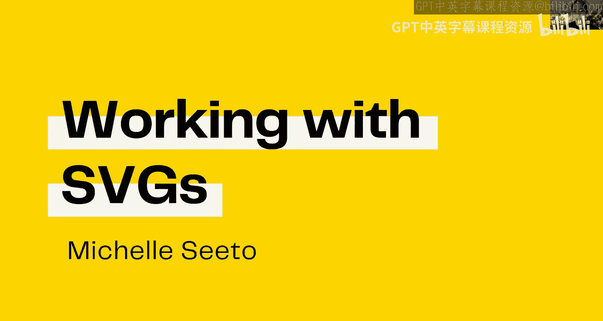

So what is an SVG， SVG stands for scalable vector graphics。

 it is essentially a type of graphic format just like JPEG and PNG。

 but it has certain properties which makes it particularly useful when dealing with graphics。😊。

For web development and you've actually already been exposed to SvGs so in the first assignment you were given some icons which you had to render in one of the tasks and these icons were given to you as SVG files you will come across them pretty commonly as a front end engineer。

😊，So what we're going to do today is we're going to try and understand a little bit more about how SVGs work and we're also going to be building a few by hand。

😊，So before we deep dive into SVGs we need to first distinguish between different types of media and when we're dealing with media we generally have raster and graphic media so Ra graphics are things like PG or JPEG these are images which are made up of pixels on a grid each pixel has a certain color and when the pixels come together they form the image  importantly ras have a resolution which is the number of pixels that they contain and that means that they have a finite number of pixels which means that you will always lose some sort of quality when you enlarge a raster graphic so as you can see on the screen the plugug it's nice and crisp in its original form but when you zoom into its eye it becomes a lot blururriier and it loses a lot of the quality that it had previously。

On the other hand， on the other side of the screen we have a vector plugug and vector graphics are graphics that don't contain any pixels。

 they actually use mats to display their images and because they use mats they're not relying on pixels we can enlarge them pretty much infinitely without losing quality so you can see when we zoom into the eye of the vector plugug it's still just as crisp as it is zoomed out。

😊，So some common file types for Raster graphics， we've got PNG， JPEG or GI。

 but for vector graphics we've got PDFs， AI which stands for Adobe Illustrator if anyone is familiar with that graphic design software and of course we've got SVGs。

😊，So what is in an SVG or what is an SVG made up of we just need before we do that we do need to kind of refresh ourselves a bit with geometry and MAs because the way that we define SVGs is really by geometry so just a reminder a vector in geometry is something that has magnitude and direction。

😊，So when we're dealing with FVs， we are essentially working with a coordinate system and a coordinate system。

 the coordinate system that we deal with is a top left system。

 which means that the origin is the top left corner and all coordinates are expressed as XY in terms of this top left system。

😊，So we generally will also give our SVGs certain dimensions so we can see the element here has width and a height of 100。

 which means that this SVG on screen would be 100 by 100 pixels。😊。

So the next thing that an SVG has is a viewbox we can think of a viewbox as kind of the visible region of the SVG if the contents of the SVG was some sort of scenery then the viewbox is the window through which we see that scenery and so what that means is a viewbox is bounded and we can see how we define this viewbox here is we've got two coordinates00 which is the origin we've got a width of 100 and we've also got a height of 100。

😊，And we can see that that's that box there。Um， and anything that would be rendered or anything that would occur outside of this viewbox is actually clipped from view。

😊，U。Importantly， the coordinates here and the units here are not the same as the units that we use to define the SVG element itself。

 we can kind of think of these coordinates as internal to the SG whereas these are external。

 even though they kind of look the same at the moment， later we'll see how they can differ。

So just remember， these are these are often pixel units。

 but these are kind of their own internal sort of units。😊，The next thing that SVGs have。

 which is essentially what's at the heart of the SVG is the contents of the SVG itself。

 so an SVG is made up of pos and vector shapes and these are essentially you know the things that make up the SVG and the things that we see。

😊，So what we can see here， what I've kind of tried to illustrate is this smiley face is actually composed of a few different elements so we've got this large circle at the back and then we've kind of got this like ellipse here。

 we've got like another ellipseia and then we've got some sort of shape which could be defined by some sort of path here。

😊，So that's essentially the contents of an SVG what we're going to do now is we're going to look at different types of SVG shapes so we have some built in SVG shapes and if you are wondering why I changed earphone that's because my previous ones ran out of battery so back to SVG shapes the first one that we're going to be looking at is a line a line consists of two endpoints and each endpoint has an X and a Y coordinates so we can see here that a line takes in the parameters x1 y1 and x2 y2 which correspond to its endpoints I mean it also takes in a stroke color we do need to specify a stroke color with a line otherwise it won't be visible on the screen。

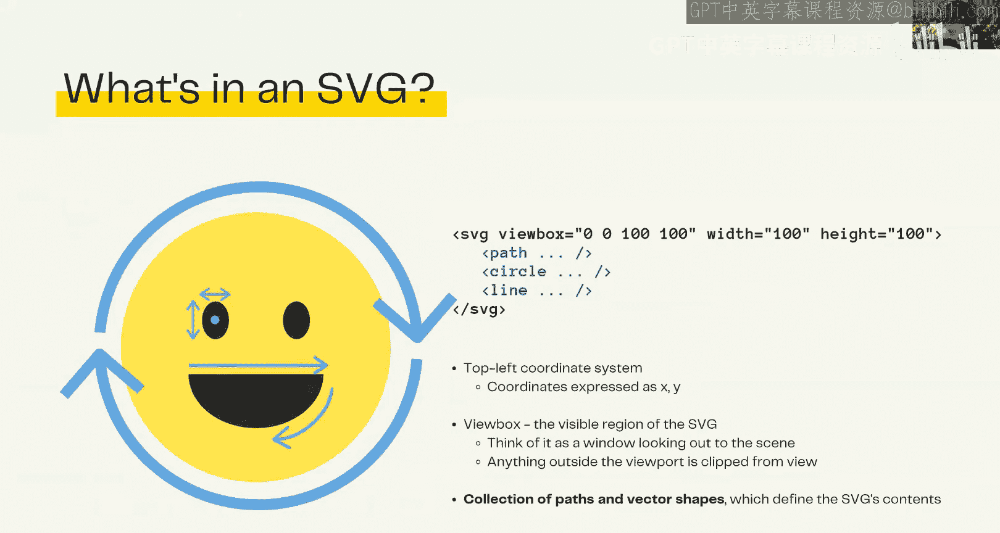

If I jump into my demo code now， you can see that I've got a SVG it's got a viewbox with origin 00 and dimensions 100 by 100 and the SVG itself has dimensions 300 by 300 and this is what I was referring to in that the dimensions of the SVG don't necessarily need to match that of the viewbox the viewboxes just used internally so that the shapes and the pods know how to rearrange themselves and they just get scaled according to whatever the SVGs dimensions are。

😊。

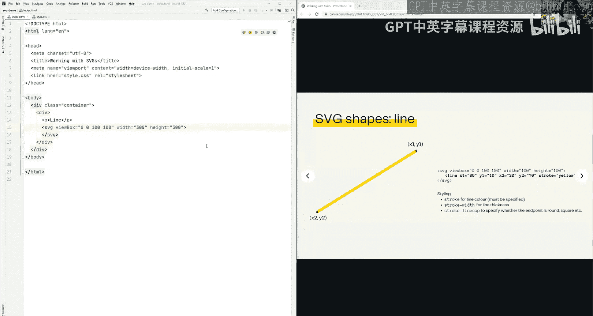

So anyways， back to constructing a line， because I'm essentially just working on a scale of zero to 100 here。

 I'm just going to define my line to go from point 2020 to 0。 8080。😊。

So I just need to define my X and y coordinates of each point。2020。To。8080 and my stroke color。

Will be some sort of gray。And that's essentially what it's done is it's gone from the point 2020 and it's constructed a straight line down to the point 8080。

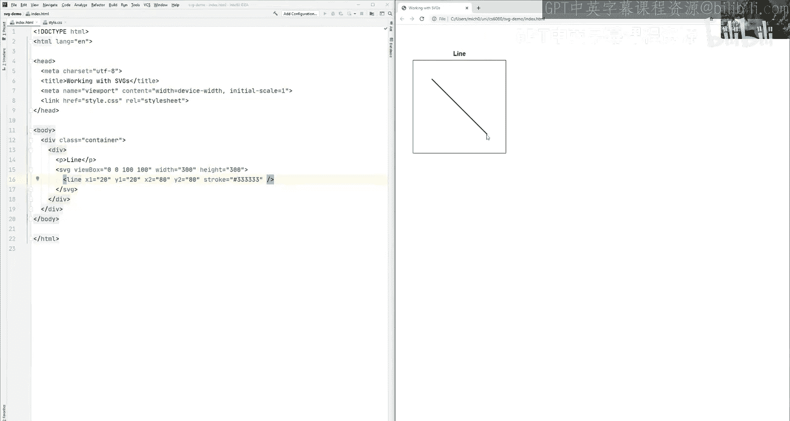

So that's a line the next shape is a circle， so a circle consists of a center point and a radius an additional styling feature of circles because they are a closed shape as opposed to a line which is open we also have a fill color。

So a fill refers to the colored in section and the stroke refers to the color of the outer outline。

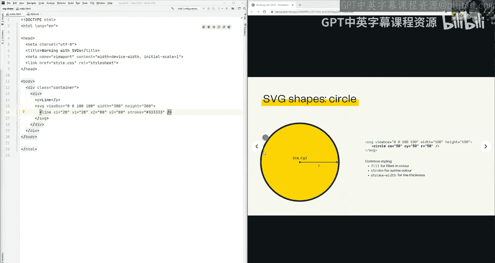

So。I am going to use this same boilerplate code。To define my circle。

And I'm going to change my line into a circle， I'm going to send to my circle at 5050。

 so I just need to define my coordinates。C X and C Y。And I just need to define。My radius。

Which in this case is going to be 40。So I've got my circle here， if I want to fill it in。

 I can also define a fill color。And I'm going to use some sort of yellow here。Cool， so yeah。

 it's centered at 5050 in this viewbox of 100 by 100 and it's got a radius of 40。😊。

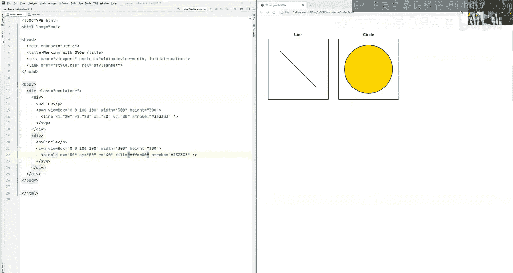

So the next shape is an ellipse and ellipse is very similar to a circle。

 except instead of having one radius measurement， it has two。

 it has one for the X axis and one for the Y axis， but the center point is the same。

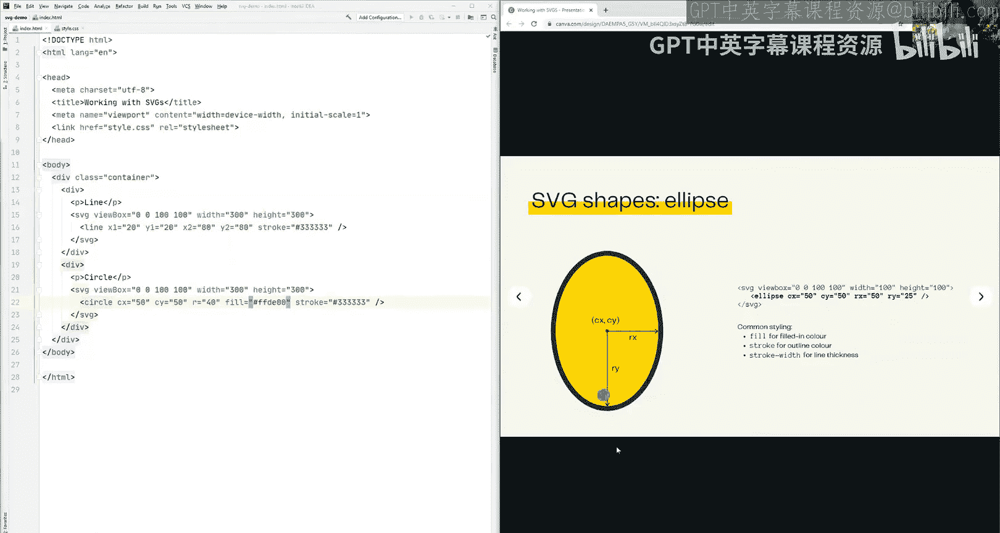

So if I go back to my demo code。And I just changed this into an ellipse。

I want to keep the same center point， let's make 40 the y radius and I will make my X radius something like 20。

And that's going to produce a squished version of the circle essentially。

 we've got the radius of 40 which is consistent with the circle。

 but the X radius is now significantly reduced to 20。

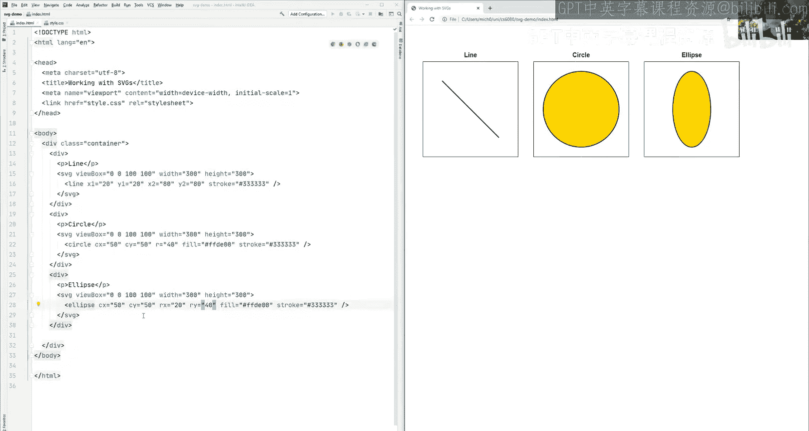

The final SVG shape is a rectangle， it's a little bit more complicated but nothing unsurprising a rectangle basically takes in an X and a Y coordinate。

 which is the origin。And a width and a height dimension here。

Wwhich basically defines how wide and how deep we want our rectangle to be we can also define the roundness of the corners of the rectangle。

 if we would like by specifying again， some sort of x and y radius value。

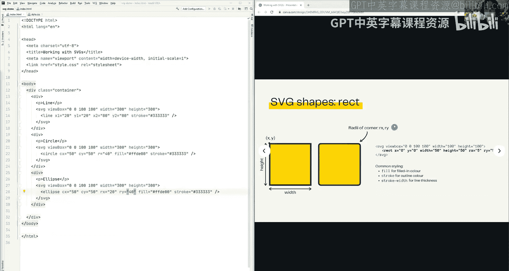

So popping back into my demo code。I can construct a rectangle。

Let's give it an X and a Y coordinate of， let's say， 2030。We'll give it a width of 60。

And we'll give it a height of 40。And you can see that。This point here corresponds to the 2030。

This point here corresponds to whatever 20 plus 60 years。

 so an x value of 80 and a y value of 30 plus 40， so a y value of 70 the fill and the stroke are the same as the previous two。

We can also construct a rectangle with rounded corners。With the same dimensions。

 but let's set a value。Of five we can specify different values of the x and the y radius。

 or we can just specify one and that will cover both。Cool。

 so we can see we've got the same rectangle， but now with routed corners。

So those are all the basic shapes that we're going to cover today the next thing that we're going to look at is something called the path SVG pos is really where the power of SVGs comes through when we were dealing with the built in shapes before we were kind of limited in the sorts of things that we could produce we can still produce a whole bunch of different graphics just with shapes alone but a rectangle had to produce a rectangle circle had to produce a circle。

😊，we would have to combine them creatively to come up with some sort of largedge image with paths。

 we can really define any sort of generic shape with a path。😡。

Because a path is really just a free form drawing。The way that you can kind of think of a path is it's a set of commands which you could give to someone if they had a pencil and a piece of paper and if you gave them this path they would know exactly what the drawing should look like because the commands would specify where exactly which coordinates they need to draw at what the curvature of the drawing needs to look like。

 all of these can be described by a path。So we can see an example of a path on the screen it kind of looks like。

A whole bunch of letters and numbers， but there is some sort of logic to the path here the letters actually correspond to different command types and the numbers correspond to different parameters which we give to the commands。

So this is the full list of SG path commands we're not going to go through all of these I mostly just put it in here for like completeness and reference sake。

 but the main ones that we can go through。M stands for moveve2 and that is a command that says wherever we are in the path currently。

 I now want you to jump to this other location。L stands for line two and that's saying wherever we are in the current path。

 I want you to draw a straight line to this other location。

 so it's not exactly like it's kind of like move to but it means that we're drawing a line as we move in that direction。

😡，H and V respectively stand for horizontal line two and vertical line two。

 they're pretty much the same as line two， but they're more specific in that we want to specifically draw a horizontal line to another point or we want to draw a vertical line to another point。

And then we have a whole bunch of curves。And we have an arc。

 arcs are particularly useful for drawing different sort of curved figures。

And finally we've got Z which is a special sort of command which signifies we want to close a path。

 so if we've drawn a path and you know wherever the path has taken us。

 if we use the Z command that's saying I want to now draw a straight line straight from where I am currently at in my path all the way back to the beginning of the path。

These are the parameters that a path can take in， I'd recommend you have a look at the documentation online for more information on。

😊，How exactly you use each of these parameters。But just going through some of the main ones with the move to command。

 we specify the x and the y coordinates that we want to go to。

 so this would say if x was 50 and y was 50， we're going to jump from wherever we are on the path to the 0 5050。

And we're going to resume the path from that point。The same thing for L。

 it's saying we want to jump to this point 5050 and we're going to draw a straight line whilst we make our way there。

Same thing for H and V， we're specifying the x and the Y coordinate that we want to jump to。

UmWith PAs and with PA commands， we can either specify them in terms of absolute coordinates as we've seen here。

😊，Or we can specify them in terms of relative coordinates and the difference is that we use a capital letter for absolute commands and we use a lowercase letter for relative commands relative commands means that we specified values relative to our current position so whereas previously if we specified a capital M with 5050 that means no matter where we are we are going to arrive at the  point 5050 if we use a lowercase M with 5050 that means that wherever we are we're going to go to the point that's 50 units in the x direction and 50 units in the y direction so if we were previously at 0 100100 we would now be at point 150150。

Similarly for L， H and V， they are all defined， they could all be defined in terms of relative commands。

So here is a simple example of a path。😡，I've got it written in terms of the absolute commands and the relative commands。

 but we'll go through the absolute one first。😊，So the path begins at 0。

00 and we know that because we've specified we want to move to the  point00。From the 。00。

 which is this point here， we then want to draw a line to the0 100100。

 which is this point down here and because we're using the capital L。

 we know that we are specifically going to the 0。100100。And because it is the command L。

 we are going to be drawing a line from00 to this new point。😡。

We then draw a line from where we currently are at 100100 to the 0。0100。

 and it just so happens that it is horizontally to the left of where we are。😡，And finally。

 we close the path with the Z command。And that means that we go from the 00100 and we go back to where we started at 00 and we draw a line in the meantime。

Now we can write this path in terms of relative commands as well as we've got down here。

We need to start at the 0。00 so that we don't change。

 but instead of drawing a line to the0 100100 directly。

 what we can do is we can specify that we now want to move in the direction of 100 units in X axis and 100 units in the Y axis。

It kind of looks the same here， but that's because we just started at the 。00。

 but this is saying we want to move relative to the current point， not to these absolute coordinates。

😊，The point I mean the path kind of differs in this next command whereas before we specified we want to go to the 00100 now we're saying we want to create a line and moving in the direction of negative 100 in the x axis and zero in the y axis so what that's saying is we if we were currently at the0100100 which we are we now want to be moving negative 100 so in this direction。

So our new x coordinate is going to be zero and we don't want to move at all in the y in the y axis。

 so our Y coordinate stays the same as 100。😡，So what we've done is we moved 100 units in the negative direction in the x axis and we have not moved in the y axis at all。

 and then we close the path and that's just the same as before we just draw a straight line back to where we started。

So that's a really simple example of an SVG path and how we can write it in both absolute and relative commands。

😊，Okay， so we're going to bring it all together now we're going to draw this smiley face emoji using a combination of shapes and partss。

😡。

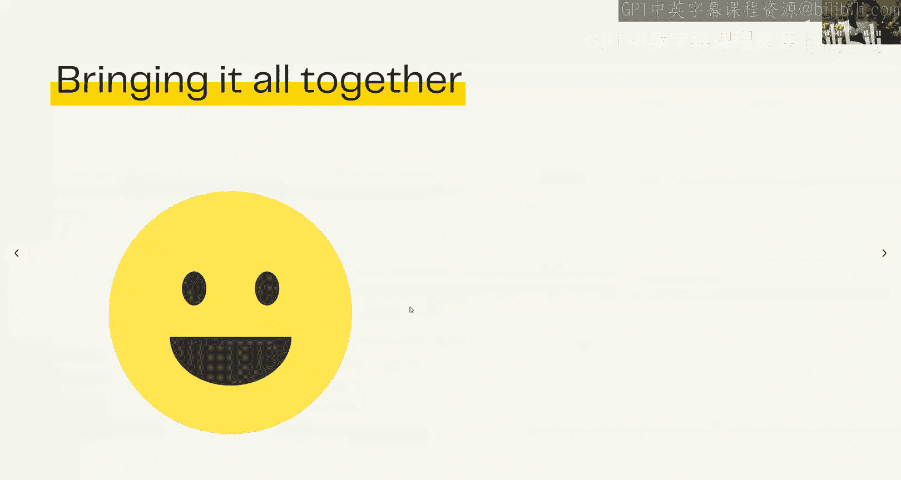

So jumping back into my demo code。I've got an empty SVG here for my emoji what I'm going to do is I'm going to start with the emoji head so the yellow circle essentially I want my circle to be centered in the viewbox and because my viewbox has dimensions 100 by 100 and is centered at the origin00 my circle is essentially going to have the center of 5050。

😊。

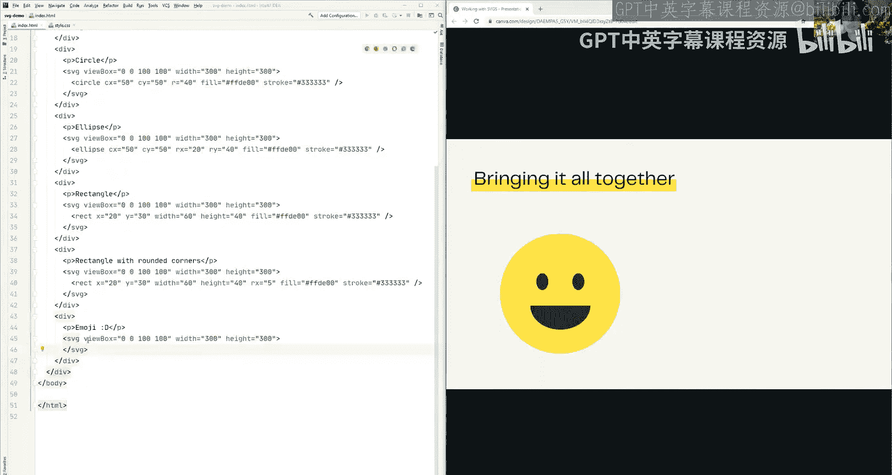

So I just need to construct my circle。With its coordinates and I'm going to give it a radius of 50 so that it extends all the way to the edges of the box。

😡，And also fill it in。Cool， so we have a circle now。

 which basically goes all the way to the edges of the box and it doesn't have any stroke because I did not define any stroke color。

😡，We now need to go in and fill in the actual features of the emoji。😊。

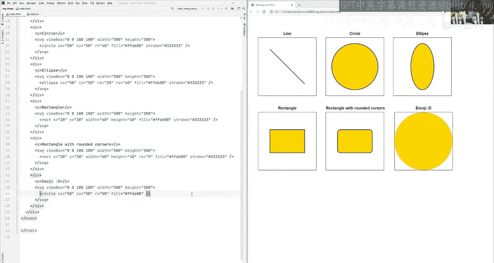

So we can see that the emoji is kind of， it has eyes that are kind of elliptical in nature。😊。

So I'm going to use an ellipse to create the eyes here。Again。

 an ellipse is defined by center coordinates， so my center coordinates here。

If we're talking about the left eye is going to be 35， 40。

I am going to give it an x radius of five and a y radius of seven。

 and that way it's just going to be a bit skinnier in the x axis。

And we fill it in with the doca color。Andvoa， we have one eye。

The other eye is identical so we can use the same ellipse。

 we just need to adjust the x coordinates so that it's a little bit more to the right。

So if I change that to be， let's say 30 units to the right， so it's now 65。I have a second eye。

Awesome。😊。

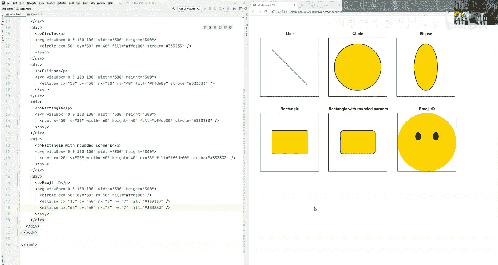

嗯。The final part is the mouth it's going to be a little bit more complicated because it's not one of the built in shapes。

 so it's not an ellipse， it's not a circle it's not a rectangle。

 we're going to have to use a path here。😡，And the way that its the way that I'm going to construct this path is I'm going to start with this left coordinate here。

 I'm going to draw a line over to the right coordinate。

 and then I'm going to draw an arc which joins back up to my left corner。Now with Arc commands。

 they have a lot of parameters。

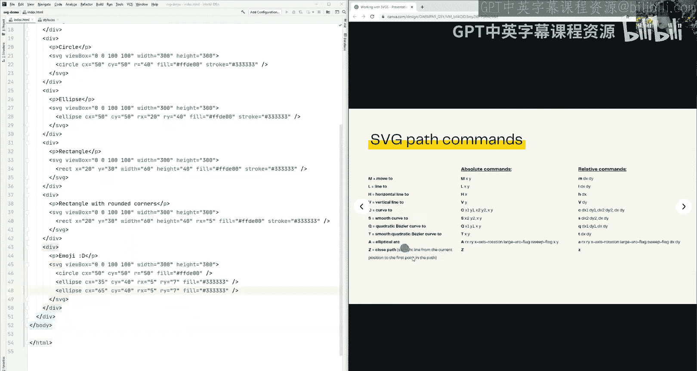

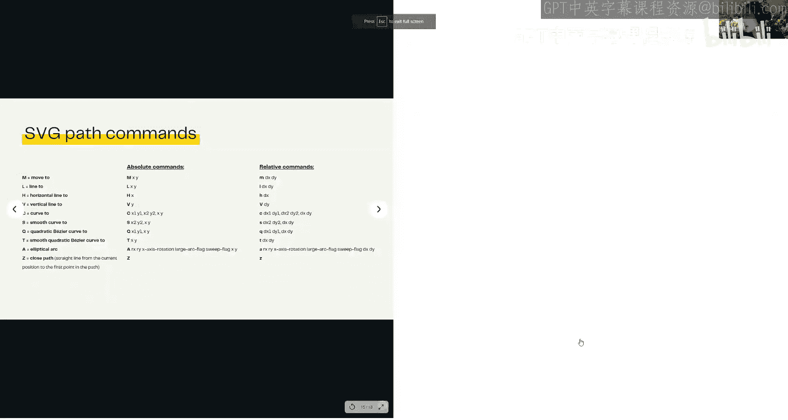

They have a lot of parameters， but the ones that we're really only concerned with are the first two and the last two。

😊，The first two define the x and the Y radius， so that's similar to how the ellipse radius was defined。

The last two define the endpoint of the arc， so if you think of an arc it has a starting point and it has an end point and that's connected by some sort of curve。

And where' concerned with where do we end basically and whats that curve look like the middle coordinates for anyone who's interested。

 this one can controls how much the arc should be rotated by。And the two flags here， so the arc。

 the large arc and the sweep flag， basically they collectively control in which direction the arc should be headed in。

 so should it be headed in the clockwise direction or the anticlockwise direction。But like I said。

 we're really only concerned with the first two and the last two。😊，Right now。co。So I go back in。

And I construct my path。We need to start at the left corner。

 so that left corner is going to have coordinates 25，60。

I'm going to draw my line as a relative line and that way I can just define I want a line that goes 50 units across to the right and I don't want the line to move at all in the direction in the Y direction。

 sorry。So that's my line， which will take me over to the right corner of the mouth and now for the arc。

Again， I'm going to use a relative coordinate here。

And I am going to define my X radius to be 10 my y radius to be8 again we're not too concerned with what the inner numbers are so。

Just。Bear with me as I just input those numbers in。

But what we are concerned with is where we end the arc so we want to end back where we started。

 which if we're currently at the right corner where we started is going to be 50 units across to the left and no units in the Y direction so we're going to go oops。

Negative 50 in the X direction and we're not going to move it all in the y direction and then finally we're going to close it off with C。

Cool， so we have our complete emoji。😊，We can also alter the emoji slightly so that it's。

No longer the happy emoji。If I just copy and paste the emoji。

Just with a slight alteration of the path。We can end up with a completely different face。

 Everything else can stay the same， but we just want to change the path so that。Like I said。

 the middle coordinates control whether we're going in the clockwise or the anticlockwise direction。

 if I just flip the flag so that we're no longer going in the clockwise direction。

 but instead we're going from here in the anticlockwise direction， then we end up with a sad face。

And we will also need to adjust the height of that starting point。So something more like 75。Cool。

 notice that I really only needed to adjust one point for it to move in the Y direction and that's because all the other commands that I used were relative so by adjusting where I start off because everything else is defined relatively I didn't need to go and make any additional changes there。

😡，Cool so essentially what we've done is we've constructed a whole bunch of shapes we've also constructed these two emojis using a combination of shapes and parts that's pretty much all that we've got for today's lecture。

😊，I hope it gave you a little bit of a flavor as to how powerful and useful SvGs can be。And yeah。

 happy designing。 Thank you for joining me today。😊。

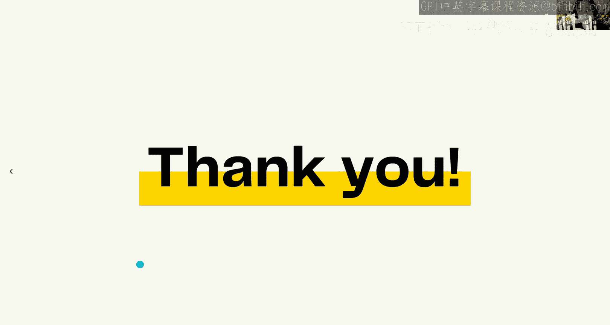