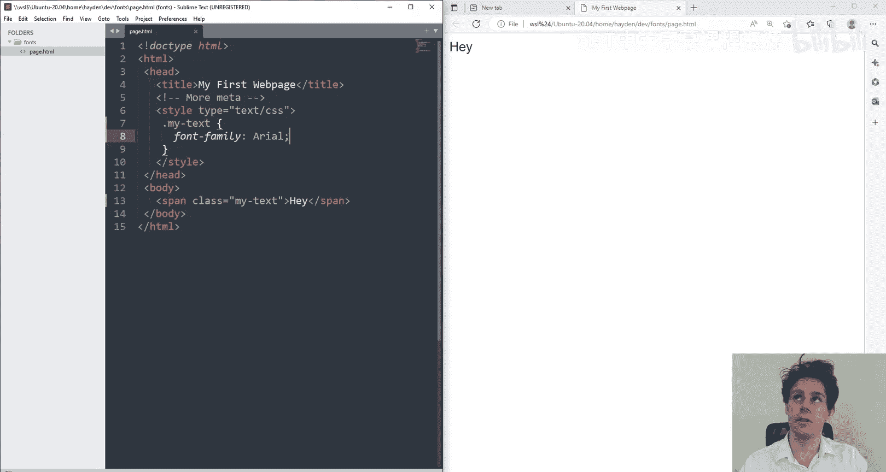
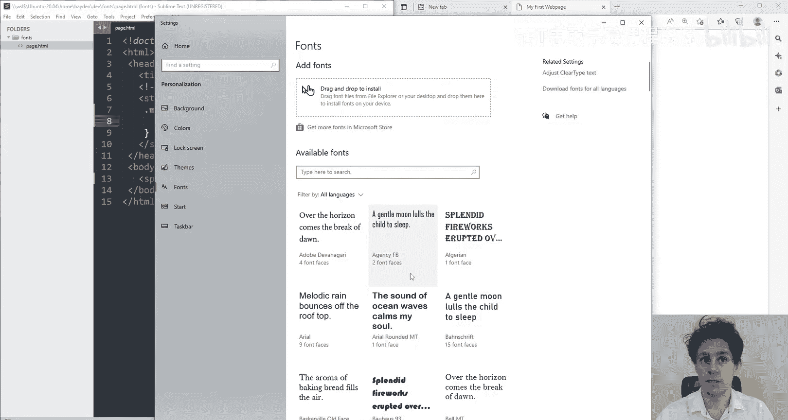
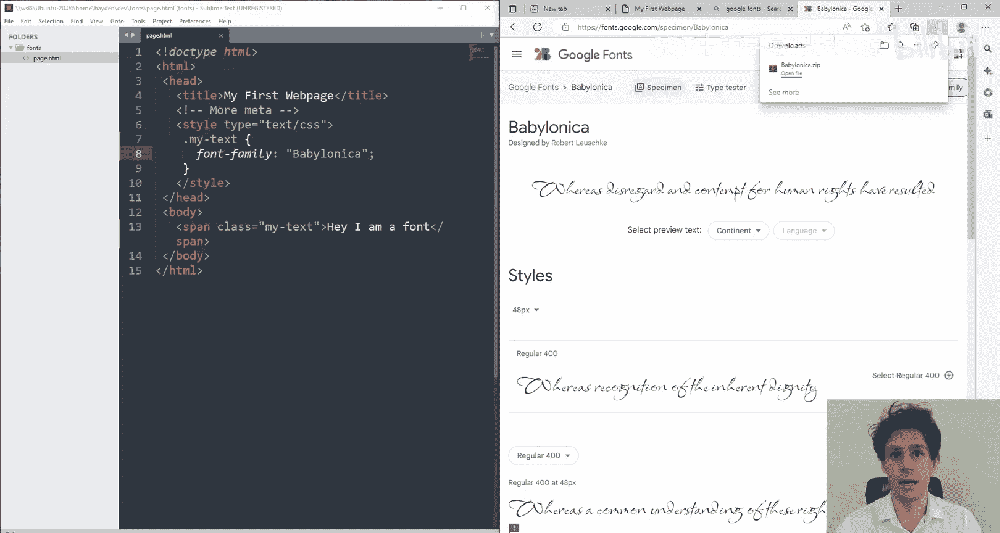
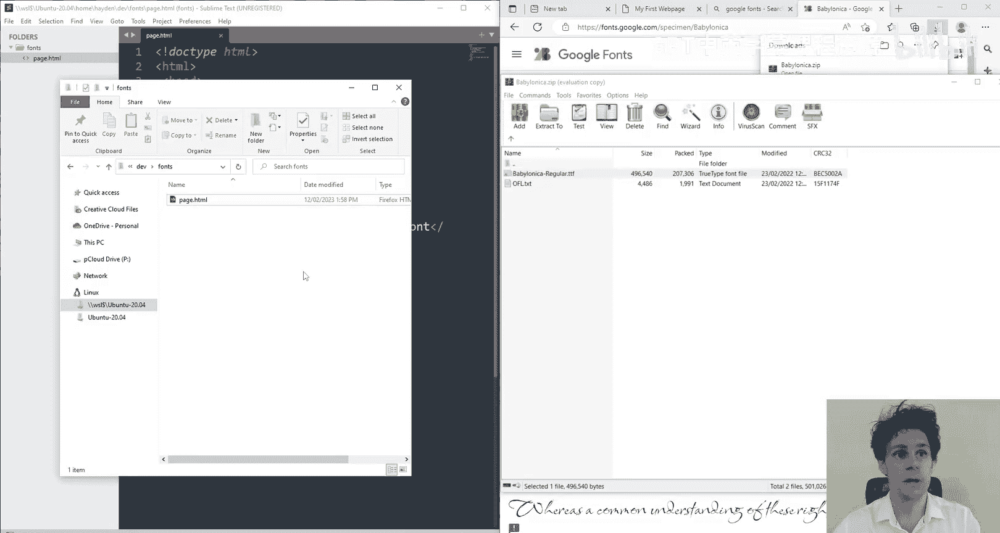
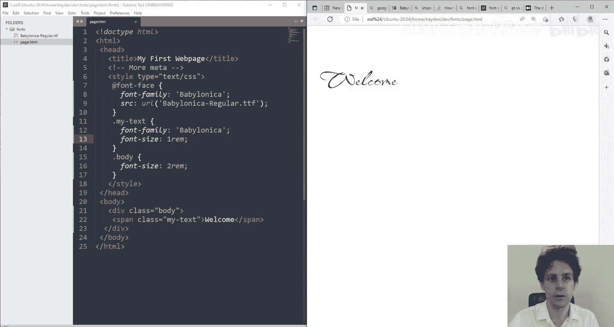

# 前端编程：11：CSS字体 🌝

在本节课中，我们将学习CSS字体的相关知识，特别是字体族和字体大小的使用。我们将了解如何指定系统字体、如何引入并使用自定义字体，以及如何选择合适的字体大小单位。

## 字体族




上一节我们介绍了CSS的基础，本节中我们来看看如何设置字体族。字体族定义了文本使用的字体。默认情况下，浏览器会使用用户操作系统上安装的字体。



### 使用系统字体

你可以通过 `font-family` 属性指定一个或多个字体。如果字体名称包含空格，通常需要用引号包裹。

```css
span {
  font-family: "Arial", sans-serif;
}
```

使用系统字体时，必须确保该字体在大多数用户的设备上都有安装。否则，浏览器会回退到默认字体（如Times New Roman）。



### 引入自定义字体

如果你希望使用特定的、用户设备上可能没有的字体，你需要将该字体文件与你的网页一起提供。这可以通过 `@font-face` 规则实现。

以下是引入并使用自定义字体的步骤：



1.  **获取字体文件**：从Google Fonts等网站下载你喜欢的字体（通常是 `.ttf` 或 `.woff` 格式）。
2.  **将字体文件放入项目文件夹**。
3.  **使用 `@font-face` 规则定义字体**：在CSS中，你需要告诉浏览器这个新字体的名称和文件位置。
4.  **在 `font-family` 属性中使用该字体**。

```css
/* 步骤3：定义自定义字体 */
@font-face {
  font-family: "MyCustomFont"; /* 为字体起一个名字 */
  src: url("Babylonica-Regular.ttf"); /* 指向字体文件 */
}

/* 步骤4：使用自定义字体 */
h1 {
  font-family: "MyCustomFont", cursive;
}
```

这样做的好处是，无论用户设备上是否安装了该字体，网页都能正确显示，同时也有利于搜索引擎优化和页面加载性能。

## 字体大小

接下来，我们探讨如何设置字体大小。CSS提供了多种单位来定义尺寸，选择正确的单位很重要。

### 常用单位对比

以下是定义字体大小的几种主要方法：

*   **像素**：`font-size: 16px;`
    *   **优点**：绝对单位，精确控制。
    *   **缺点**：无视用户的浏览器默认设置或辅助功能设置（如放大文本），可访问性较差。
*   **EM**：`font-size: 1.5em;`
    *   **公式**：`1em` = 当前元素的父元素的 `font-size` 值。
    *   **特点**：相对单位。具有**复合效应**。如果父元素字体放大，子元素使用 `em` 会基于放大后的值继续计算。
*   **REM**：`font-size: 1.5rem;`
    *   **公式**：`1rem` = 根元素（通常是 `<html>`）的 `font-size` 值。
    *   **特点**：相对单位。**避免了复合效应**。所有使用 `rem` 的元素都相对于同一个根字体大小，更容易预测和管理。
*   **百分比**：`font-size: 150%;`
    *   类似于 `em`，是相对于父元素字体大小的百分比。

### 推荐使用 REM

对于大多数情况，**推荐使用 `rem`** 作为字体大小的单位。它兼具相对单位的灵活性（尊重用户的浏览器设置），又避免了 `em` 可能带来的复杂复合计算问题，使得样式更易于维护。

```css
html {
  font-size: 16px; /* 设置根字体大小，1rem 将等于 16px */
}

body {
  font-size: 1rem; /* 16px */
}

h1 {
  font-size: 2rem; /* 32px */
}

p {
  font-size: 1.125rem; /* 18px */
}
```



本节课中我们一起学习了CSS字体的核心知识。我们掌握了如何通过 `font-family` 使用系统字体和通过 `@font-face` 引入自定义字体。同时，我们重点比较了 `px`、`em` 和 `rem` 等字体单位，并得出结论：为了更好的可访问性和可维护性，在定义字体大小时应优先使用 `rem` 单位。