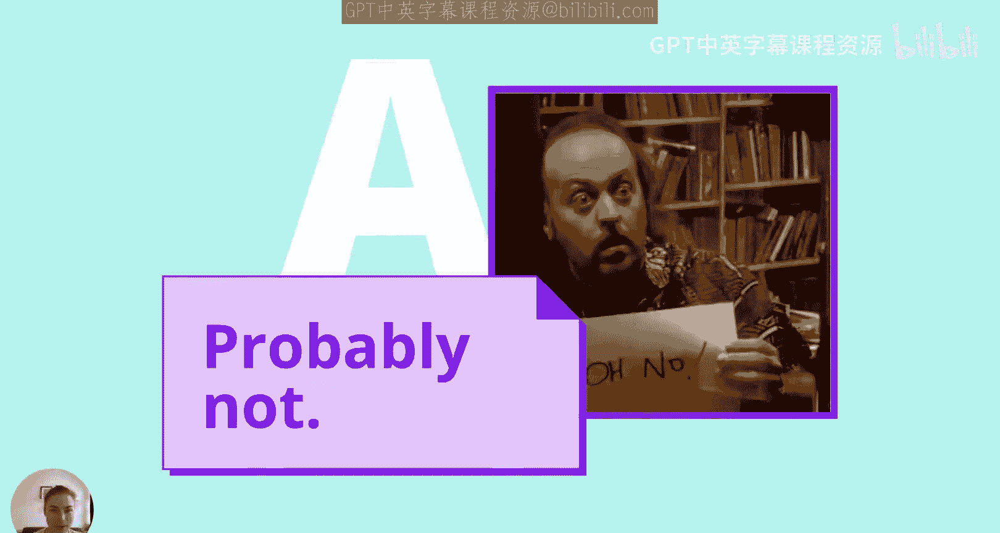
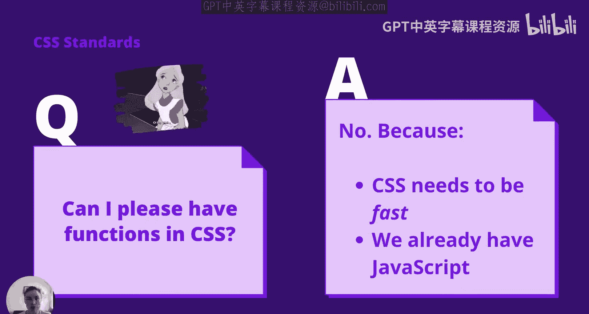
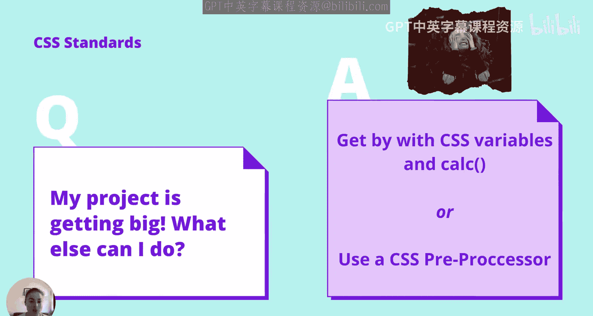
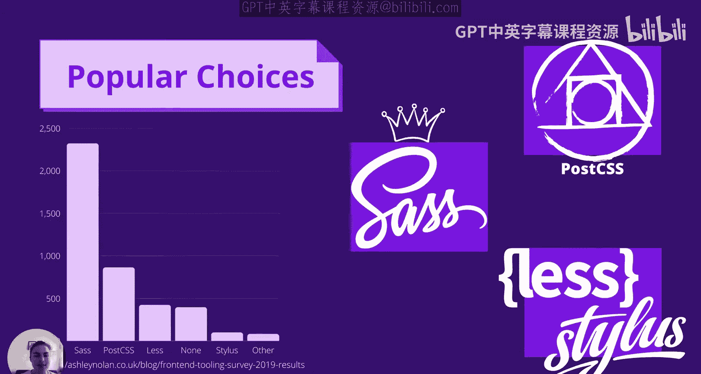
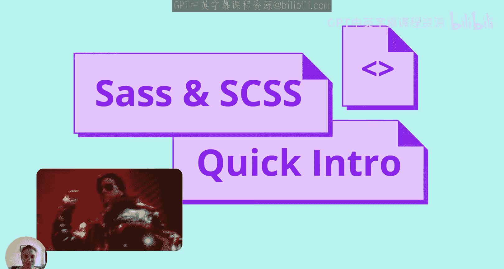
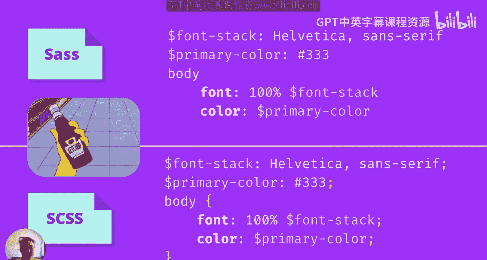
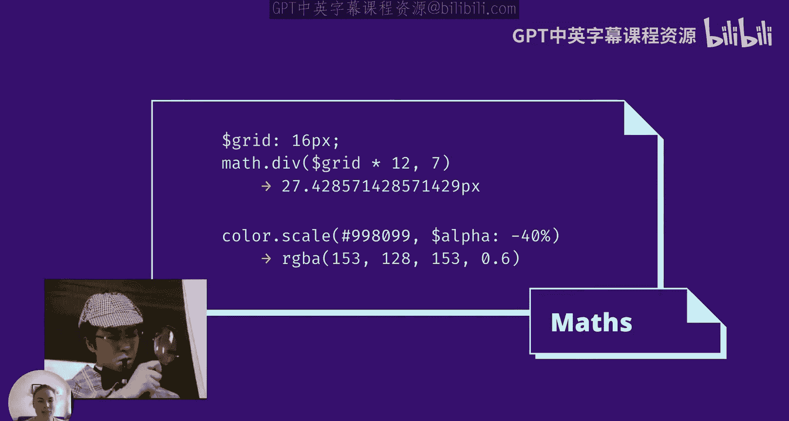
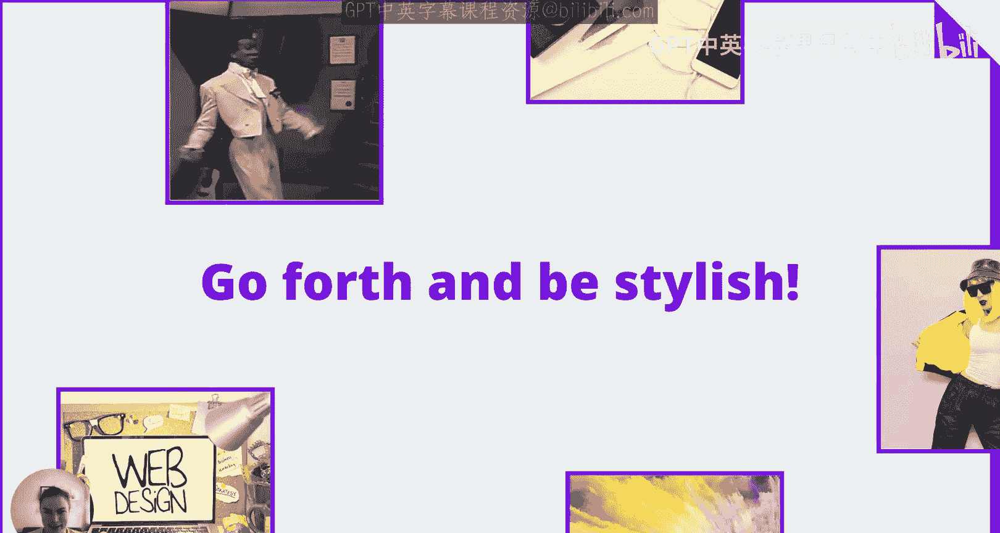

# UNSW《前端编程｜ Web Front-end Programming COMP6080 23T1》中英字幕（deepseek-R1 p12 -12-COMP6080 - CSS 🌝 Pre-Processors.zh_en -BV17RXGYuEaM_p12-

Hello， my name is Julia Mitchell Moore and I am a front end engineer in the video group at Canva。😊。

Today I'll be going through CSS preprocesors。😊，Less SaS and more SCSS。By now。

 you should have used CSS and also programming languages。So let's start with this question。

 is CSS a programming language？We'll take this to ask whether it is tuuring complete。

 of which there are a few definitions。But for now， let's say。

 does it suffer from the halting problem？Can we know if any given CSS will finish？The answer is no。

CSS is not tuuring complete， which means it isn't a programming language。

But why？A classic request might be to add functions to CSS。

Then you could decompose and reuse your CSS more easily。For example。

 I might have several different places I want to apply the same border thickness。

 but with a different color。That sounds like a good time to use a function。

But making CSS tuuring complete would be a problem。Browsers and users want CSS to be fast。

 There's all kinds of optimizations that browsers make to pass CsS。Also。

 if you want a programming language for the web， we already have JavaScript。

Or wear this template if you're keen。

Okay， fine， but we still have the problem of coping with large code bases of CSS。

While plain standard CSS is fine for small projects。

 it's very easy to end up in a sticky mess in a large project。

There are some CSS features that can help。CSS variables can reduce the problem of 200 odd slightly different shades of gray all over the code base by creating one reusable variable throughout。

😊，The Cullk function allows us to do maths on measures like pixels and percentages。😊。

That's a great start， but we can also use tools called CSS preprocessors to give us even more functionality。

😊。

A preprocesor turns something we have into the expected input of another system。In this case。

 we want to turn something with more features than CSS into regular standard CSS。

This could be a node JS library or a command line tool or built into the web framework you're using。

Here are some popular choices。SaS is an extension of CSS and is written in Dart available in NPM。

Post CSS is technically not a preprocessor but is often used as one it is actually a tool for transforming CSS into other CSS。

😊，Less and stylus are two other popular CSS preprocess。

Both are JavaScript based。

Since SAS is the most popular， let's jump into that。😊。

SaRS has two syntaxes and you can pick either that you can't mix them。

If you hate curly brackets and semicolonons， then you'll love the SAS syntax because it doesn't use these。

😊，Alternatively， SS is a strict superet of CSS， so it's often easier to get a grip on。😊。

Any CSS is valid as CSS。But whichever input syntax you choose。

 the output of SAS is always standard CSS。I'll be using SCSS syntax in the rest of the examples while still referring to it as such。

😊，And actually， here's our first feature of Sa variables。😊。

You can have variables in standard CSS as well， but in SAS。

 variables are scoped and not global like they are in CSS。😊。

I just said skirtpt。So let's look at what that means。Usually when you run the SAS tools。

 you run them on a directory SAS then converts all the SAS files it finds into CSS。

But what if we don't want that？Partials allow us to make reusable style sheets we can import。

 but that don't generate an output style sheet of their own。😊。

You might have a partial containing all your brand colors or your grid system measurements you can then make use of that partial in any other style sheet。

SaS is currently in the process of changing their import syntax from@ import to at use。

 we referring to the newer at use syntax in our snippets。Next up is nestesting。

Nesting is probably one of the handiest features of SAS and most CSS preprocessors。

This lets you structure your style sheet much more like your HTML。

You can easily make specific selecteds， and nesting also helps reduce abuse of the Bang import annotation in CSS。

For example， here you can see how the nested SCSS resembles the HTML snippet。

And how it is then processed to become normal CSS。But of course， nesting can be overused。

 so as always with CSS， make your selectors just as specific as they need to be。😊。

Mixins are a feature that let us parameterize styles。

Back when new CSS feature used browser vendor prefixes。

 mixins were really handy if you needed to apply， for example， the same gradient across all browsers。

Rather than writing the same thing in four or five different syntaxes。

 you could just pass in the colours to a mix in that handled them for you。

Here is an example of a mix in that wraps anything you want to just happen on retina screen。

If you're looking at this code and thinking， wait， isn't that a browser prefix？Yes， yes， it is。

And didn't I implying that they were gone？Well， they aren't quite gone， thanks Safari。

But mixings are also very useful for all sorts of cases where you want to avoid copy pasting the same but slightly different code。

😊，As I mentioned earlier， CSS has a function for doing some maths called CAP。

Kelalc is actually pretty cool because it lets you do calculations based on live values。

 so you can add up pixels， percentages and REM values。😊，But it only gives you add， subtract。

 multiply， and divide。With SAS， you can floor， modulo， square root， cosine， and even use pi and E。

There's also SAS functions to operate on colors， such as making them lighter， darker。

 or more transparent。Here in the top example， we're using the SAS Math。

Div method to divide grid values and below we're scaling a given color to be 40% more transparent。

So why should you use a CSS preprocessor in your next project？

If your project is large enough that you want to use a framework like react or Angular。

 then adding a preprocesor to that mix just makes sense。Plus。

 there's a fair chance that if you start with a template project。

 the preprocesor will be included anyway。A preprocessor also makes it easier to decompose your style sheets to match your framework components。

 adding style to your MVC model View controller patent。Preraypro add lots of extra features。

 but you don't have to use any of them。If you're using SCSS syntax with SAS。

 you can just write plain old CSS and that's valid SCSS then when you need a little bit more。

 SAS is there for you。Plus， SAS and less and post CSS have even more features than we've covered here。

 you can make custom functions， loops and other control flows。

 use ampersan to refer to the parent class， there's debug decorators and so much more。😊，So with that。

 go forth and be stylish， thanks so much for joining。

