# UNSW《前端编程｜ Web Front-end Programming COMP6080 23T1》中英字幕（deepseek-R1 p13 -13-COMP6080 - CSS 🌝 Showcase.zh_en -BV17RXGYuEaM_p13-

Okay。

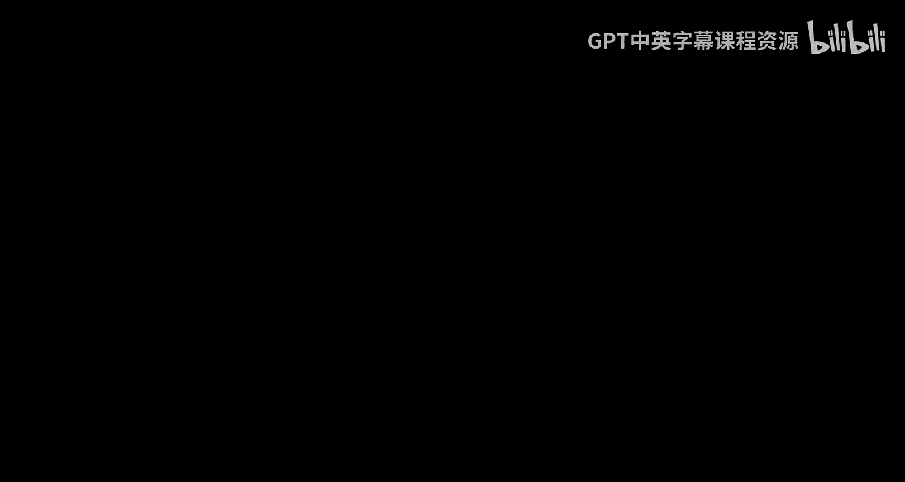

Hello everyone， my name is Luke and today I'm going to be going through the eighth lecture。

In this course which is going to which is going to be called CSS Showcase and it's basically going to be filled with a lot of cool fun stuff that will be very interesting for you to look up after your exams because it won't be tested。

In these exams， but yeah， it's just a whole bunch of stuff to inspire you sort of sit back and relax and enjoy the leisureac。

So today we're going to be going through a few things， backgrounds and patents。

 so how to create those with CSS， something called CSS art。Animations。

Masks and clippings or how to cut out different shapes from your HTML or clip stuff。

 3D CSS or how to create 3D art using CSS， adding CSS combining its CSS with SVG。

As well as a section calledCustom CSS with CSS Ruini。

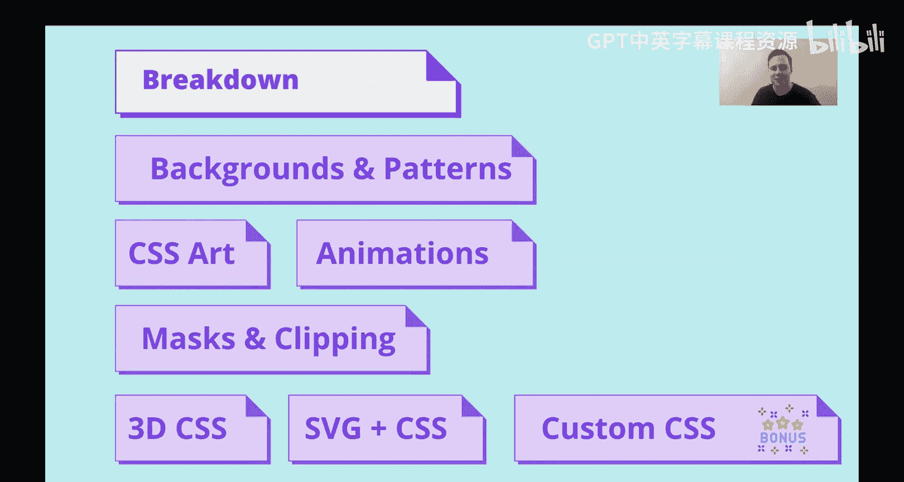

So basically let's start off with just a basic pattern。

 so here we're just adding a div and we're adding two classes one is box and one is basic on box we're just setting the width and the height so we're going to be setting this width and height for all of our pattern elements and we're just using background which is green you can also use background color but we're going to be using the background property for this section of the lecture。

So there's something you can add which is called the linear gradient。

 this linear gradient here on the left is going to the right so say to right and it goes from green to pink so as you can see it goes from green to pink on the right hand side we have a similar one but you can actually put degrees in here so here I put 135 degrees also going from green to pink so that must be going down this way。

There's also radial gradient， so rad gradient allows us to set going from the sub center and then as the radius increases it changes the gradient over time。

Here on the right where。Adding some customizations to the radio gradient so we're saying circle at。

20。On the x axis and 80 pixels on the Y axis。 So it starts 20 on the left and 80 on the。

Why and then it goes green is going from 0% to 20% so it's going out here and then pink is going from 20% to 60% and then back to green again so as with linear gradient and all of these gradients you can set a distance after you so the color and there's a technique where if you use the same stop gap so here they're about 20 then it does a hard cutoff rather than doing a gradient。

There's also repeating linear gradient， so here on the left we add a repeating linear gradient that's going the direction is 90 degrees so it's going to the right and from zero to 10 pixels it's going to be green then from 10 pixels to 20 pixels it's going to be pink。

It's the same as this one on the right， except we just changed the degrees。

 so it's going to be 180 degrees， so it's going down。

Also something you can do you can add multiple backgrounds so here we set background and we have two repeating linear gradients on top of each other So the order is important here so the first one is a pink one and then the second one is a green one and we can see with this pattern here pink is drawn on top of green so the order that you stack them is going to be the order that they'll be stacked on top of each other and here we're using the transparent keyword to say that the first linear repeating linear gradient is going be going 90 degrees so to the right and it's going to be transparent and pink transparent and pink that's what allows us to see through to the other repeating linear gradient below。

And you can also animate the you can change the background position for these gradients so here i'm actually animating the background position so I set a border radius of 50% so the div is becomes a circle then I use a background similar to one from the previous page and then I add an animation here so I think animations were already covered so this one just adds a slider animation here and it' just animates the background position so it's sort of shifting down to the left and it's just repeating that infinitely with the iteration count being infinite there and yeah it looks kind of interesting。

There's also a repeating radio gradient as well， so here we have a circuit center and it goes green pink green pink so that looks kind of cool and this one I just changed it so it's got a different center and it's got different stopgap amounts so。

Kind of creates a cool， interesting effect with this one just in case you're wondering about the circle at center。

 there's also ellipse you can use for radioial gradients and for repeating raial gradients。

 the ellipse just means that if your div or your element is wider or taller than it is。

On the other axis， so if it's not square， then the ellipse will well the circle will be stretched basically into an ellipse to follow。

The elements shape， if you just use circle all the time， it'll always be a circle no matter what。

There's also something called knet gradient， so you can use this。Co gradient here。

 this one I just want green pink， green pink， green pink。

 so it's just going to use the actual instead of the radius like the radial gradient it's going to use the angle so it's going to go green then pink。

 then green then pink。And here I use a repeating cornic gradient and I use the stop gap technique from before where I go zero degrees to 10 degrees is going to be green。

 then 10 degrees to 20 degrees is going to be pink and then just repeat that。

You can also do various things to animate these so these ones I added a border radius of 50% so they're circular the bottom one's really easy to understand i'm basically just adding an animation that transforms。

Ro rotatingating it from  zero to 360 degrees， so it just spins like that。

 but you cannot actually animate and interpolate the background。

So what I did is I added a whole bunch of keyframes here。

 so the green goes from  zero to 15% and then the pink goes from 15 to 25 on 50% of the animation then at 60% it goes from  zero to 16% and so 15 and 16 to 26 so it gets progressively bigger that's what creates this interesting animation here。

There's also something you can do which is effectively kind of by adding pixels to your as your background image。

 so you can do you can also add circles， I guess if you use the radial gradient or you can add maybe slices of a pie with the current ingredient kind of。

Or triangles with that too。 so here I'm sending a background and I'm using two linear gradient and I'm using the full。

The full definition of this full this alternative representation of the linear gradient here。

 so the way that this works is the first two values of the X and Y coordinates which is the background position and you put a slash and put the background size so this pixel is going to be 10 pixels by 10 pixels and it's going to be 30 pixels to the left and then 30 pixels down。

We're saying that it's not going to repeat and it's a linear gradient and I'm just putting pink pink here just so that the whole pixel pixel is pink and then I just add a comma and then I put a green one below that and I just changed the position。

So what you can do with this it's kind of weird， but you can get an image， get all the pixels out。

 and then add a whole bunch of linear gradients to actually create a single div。

Creed by linear gradients so I have this function here。

 which basically has a list called CSS backgrounds。

And in the function takes in a width and height that I want as my output background image。

And then I also add in this object called Ps， which allows me to get various pixels from an image。

And I have a function called form linear gradient， which takes in an X Y position。

 a width and a height， and a collar and it returns a string that is one of these linear gradients。

 so the X Y， the width and height， the background size， no repeat linear gradient。

 and then the same color twice there。And I go through all the pixels and get the pixels at that XY coordinate and then I。

Add those to my list by forming I add heaps of those linear gradients there and then I just join them together and I set that as the。

The CSS background。And then that creates just a single div that is just using background linear gradients to create a picture。

 but you might be wondering why anyone would do that since it's kind of weird when you can just use background image and use the URL。

Well， I just want to show you this cool site called singlediv。

com that's created by this person called Ly Fisher and they created all of these from a single div using various CSS techniques so they look really awesome I definitely think that you should check it out。

And hopefully you can see that if you use CSS background with a whole bunch of different type of gradients。

And colors， you could maybe think about how you could create some of these that look really cool。

And yeah， some of them are animated and everything， they look really great。

Another good resource is CSS3 Pats by Lee Burro and these had a lot of really cool patterns that you can create using CSS background that are way more advanced than the ones I showed you and the cool thing about it is you can just go to this website and click on the ones that you'd like and it'll show you the CSS code to achieve those。

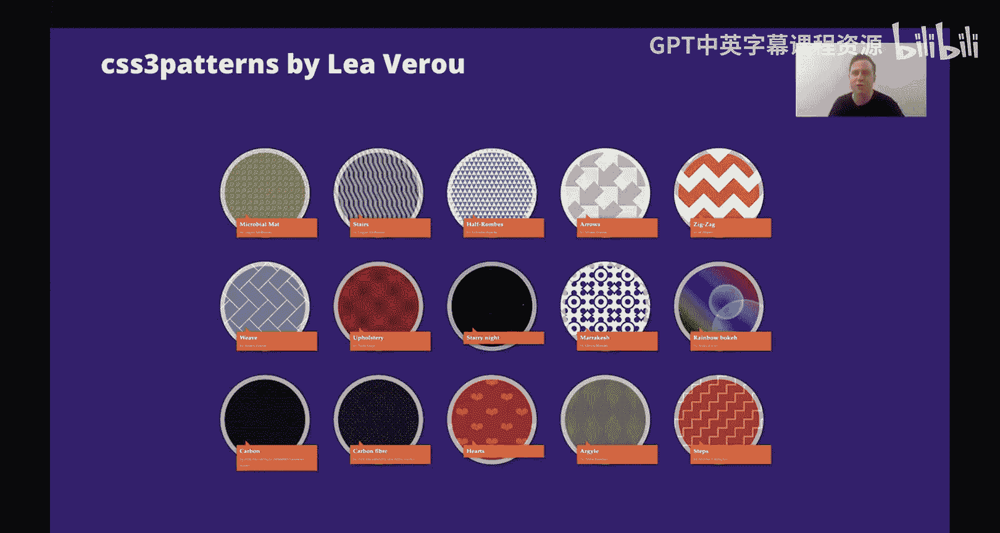

Okay， so the next thing I'm going to be talking about briefly is CSSR and that's just where you try to just use HTML and CSS to create some picture so this one on the left is created by someone called JHy you should look them up online they have a lot of cool stuff that they do with CSS and JavaScriptscript。

And they create this Playation5 controller and another one is by a person called Sarah Foshe and they also create a lot of cool stuff you should definitely check them out online and they've created this old Apple computer。

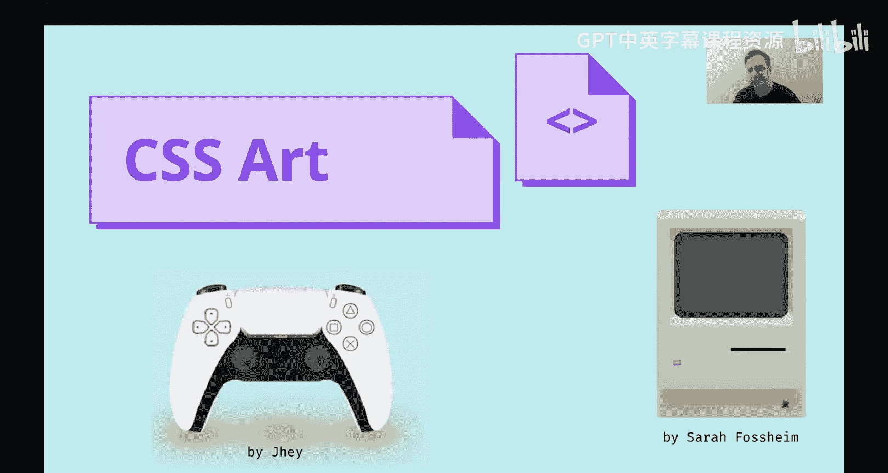

So a lot of the techniques to create things like that use basically a whole bunch of divs and background so you can use linear gradient and another thing that they use to achieve this is different order radis so you can see that by using a whole bunch of divs。

That have different border radiuses， we can create a whole bunch of different shapes and we can use background along with some shading to shade things to make them look sort of like3Dish。

And then of course， another really important component of that is also using transform so that you can rotate and translate things so that they're aligned。

There's a really good resource which is cssart。com so you should check that out because that contains a lot of these really awesome CSS artworks This one is called VW bug by Sya Koid I think it books really awesome and you should check out that site for even more awesomes。

Stuff。I created this resource。This basically allows us to input a color and a size and it will automatically create the CSS for you to create a sphere。

 so you can change the color and you can change the size here。And the important part of this。

Is that it's just mainly using one div and the classes sphere。

And I set the width and height and importantly we set the border radius to 50%。

In the JavaScriptscript code， there's basically a function that's getting this sphere element that we want to update and the color and the size。

And I convert the color from a hex to an RGB object so I can access the red。

 green and blue components and then I create this thing called a brightness list so the brightness will be going progressively lower。

As it goes through the list。And I create an array。Of progressively darker colors。

 which are hex colors that are based on the original color that get solar get darker。

And I just create six of them because there are six numbers in the brightness list。

And basically I map the brightness list from the brightness to the original color scale by that brightness and then I convert it back to a hex color。

 so progressively darker colors is going to be a list of hex colors that get that are based on the original color and get progressively darker。

And then I use an offset， which is going to be 4%。Of the size so 4% from the left and 4% down that's what we're going to start our radiod gradient so I create a string called radiod gradient and I set the circle at those off that offset so it's somewhere in the top left and then I add the progressively darker colors that are joined by a comma so they're just going to be comma separated there and then I just set the sphere style background image you can also use background I guess to radio gradient and set the width and the high。

And then it results in this， so as you can see it's probably starting up here somewhere up here and then it's getting darker and it really looks like a sphere。

 so that's a technique to sort of create a sphere with CSS。Okay。

 so the next topic that we're going to be talking about is masking。

 so this one is masking using text so as you can see here I've just got this big font that says fire and I call it a red the center one I add a background image and I call it it text white。

And in the third one， we're actually masking by the text， which produces a really interesting effect。

 so to achieve that， first of all， we're setting a background image to picture of a file。

And then we're using this property called background clip and background cliplip has a few other interesting usage other than text here。

 so you can look that up， but I think the most interesting one is text so background clip text for Chrome to get Chrome to where you need to add this prefix webki there that's also background clip text。

And make sure that you set the color of the text to transparent so that you can see through to see the background image。

So that's pretty interesting how you can mo using text。

Also you can do clipping of your HTML so what do I mean by that if you've got a image or any HTML really。

 you can clip around that to just show whatever section of it that you want。

So here there are three main ways that will use the clip path CSS property， so for this。

Circle one I'm cutting out a circle around the couch's head so I say click path and then circle the inside the circle I put the radius at the X Y coordinate。

 so it's going to be a 32 pixel radius circle at 94 by 75 coordinates。

Another way that you can use is polygon， so you go a clip path and then polygon and then you put a whole bunch of comma separated coordinates and those are going to be the coordinates that you're cutting out your image with。

The other one is called clippath so clippath allows you to use this path string that is also used in SVG to basically have a really。

It's not very human readable but it is a fairly simple representation so you can do more advanced paths。

 not just lines like the polygon here， not just straight lines so you can use some bezier curves and you can use arcs and other types of curves to so basically what this looks like is this string and the result is that you can do some curves to crop around the cat's head and。

嗯。Yeah， everyone can see what sort of creative things they could come up with by using this。

One thing to note is that using the path function for clickP is currently only supported by Firefox。

There's also image masking， so you can use this mask image property and then you can use a URL to an image so for this one。

I created this image where the colors black and white represent where black is going to be the alpha channel of the image is one so it's not going to be transparent and then white is going to be the alpha channel is zero so it's going to have zero transparency and as you can see if you use if you have this HTML here and use mask image with。

The CSss property with this image then where it's。The alpha channel is one。

 you'll be able to see that and then you can see that as it fades in the image it's also fading。

 its also masking that with the pixels of the image。

So you can also do things like you could cut out a different shape or use little circles or droplets in the mask image to mask your HTML but。

My colleague， Jess， was shower me the other week。ACool technique to use with this or。

This example basically has two images that are laid out on top of each other One is this cherry blossom picture and then on top of that which we cannot see right now is the picture of a brick wall I think and we're using this to represent what the mass is going to be so where it's white that's where the alpha channel is zero so we're going to be able to see through the picture of the brick wall onto our image and where it's black it's where the。

The alpha channel is one， so we're going to be not be able to see through it。 So if I toggle this。

 you can see that as it slides across it sort of use a gradient to do a cool effect where it slow looks like it's like sliding。

It's it's sliding through the transparency to reveal the image underneath。

 but it's kind of like creates this interesting transition now so I'll link to this at the end of the lecture so you can all play with it。

Another thing that you might find interesting is CSS filters。

 so basically you just say filter and then there's a whole bunch of filters so is an example of some of them。

 there's a blur one， there's a brightness one， there's a huge rotate one so it can mess up the colors and make it look more weird。

Oacity satctuaates up here， so yeah， have a play with those that are also very interesting。Oh。

 this is an actual project that I was working on at work。

 I was creating a prototype for something where we were masking some design by a wave and this is sort of the first prototype that I created which we didn't end up using but it's actually using the clip path and filters so。

Let me run this。So it's using clipP and it's using JavaScript2。

Iteratively set the clip path to cut out the original design that's on the right with these waves and then it's using CSS filters to filter the different colors。

Based on where the three waves are at。 So it looks kind of interesting。

 It's just a practical example， something cool that you could do with this。

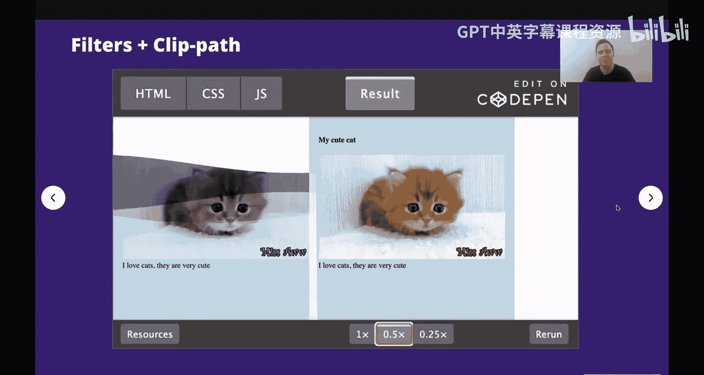

Okay， which comes to the next topic， which is CSS animations。

 So this is a really cool animation that was created also by the Fisher that is a single div animations。

 So it's using a whole bunch of。😊。

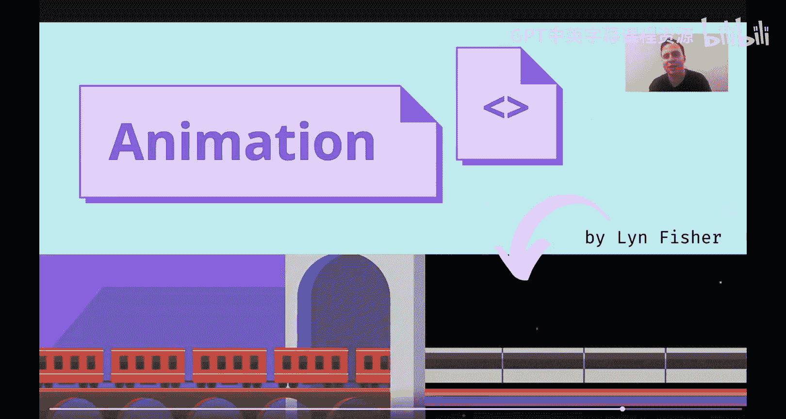

嗯。How linear gradients and maybe radio gradient and。Other stuff to create this with just one div。so。

The thing that they are actually animating is the background position。

 so they've set up all their backgrounds。So and some of them are going to be creating the trains and then by animating the background position。

 we can shift these similar to when we animated the pattern， the crisscross pattern from before。嗯。

Another cool technique that you can use is combine animating a transform which is moving something or rotating something with overflow hidden so here to create this duck this is actually an animation that's using Canva but I just recreated it here and it looks like the duck is is sitting on some border that's like has a whole bunch of waves and it's cropped by this circle and basically what's being animated is an SVG representing a wave that's animating to the left constantly and then resetting itself。

And so we can see if we turn off the overflow hidden what's actually happening here is we've got that SVG and it's moving across we're also animating the bulk of the water to go up and down with this and we're animating the duck so we're actually。

Not only translating the duct but also rot tania， so it looks like it's bobbing off and down in the water。

 then obviously if we turn overflow hidden back on， then it creates the original effect。

So that's a technique that's used a lot， I think。So one individual you might want to look up is this person called Aaron Ica and they do a whole bunch of interesting animations so this is one of them you click the delete button and then there's a paper that goes through the bin and it gets shredded and that comes out with a tick saying your thing was deleted。

So what I did to his animation I basically racked it by setting so that we don't have any overflow hidden and we shift the different versions of the paper to the left and to the right so you can see with the original paper it just basically animates down to here and with the shrodded one it basically animates down and out to the bottom and the tick comes out below so basically what is happening is there's a box here which has overflow hidden as soon as the original paper goes through that it would be being hidden once it gets down here and it's the same for the shrodded paper as soon as it enters this box that's going to be at this level it will appear down so it looks like the original paper is being turned into the shredded paper so if yeah if you have a look at the original again。

Then yeah， it goes down and gets shredded。

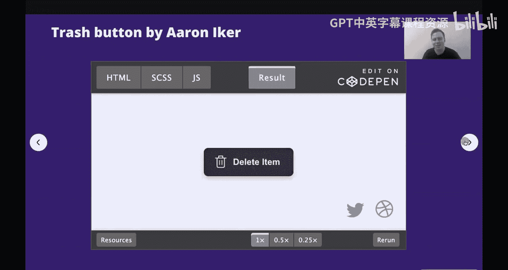

The next thing I want to cover is combining CSS with SVG。

 so you can actually use CSS animations with your SVG elements。

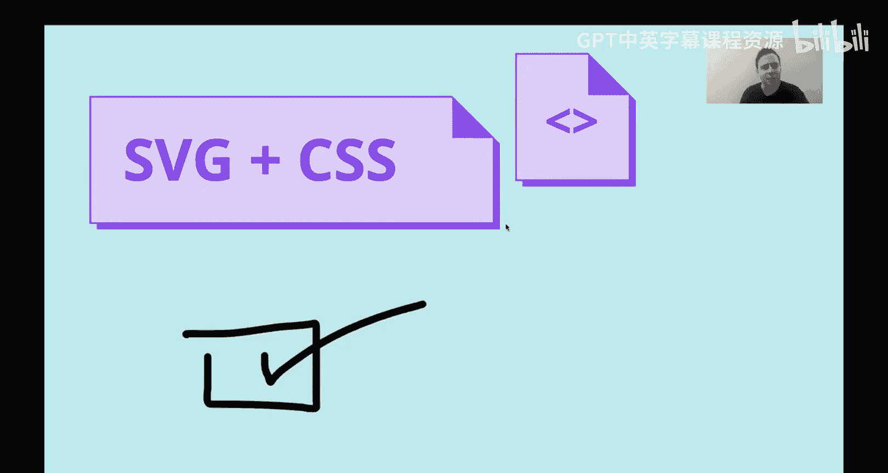

So。This tick one that I created is quite interesting。 So let's just have a look。The code。

 So the result is basically this that it looks like it's being drawn by someone on the screen and it's just animated just using CSS。

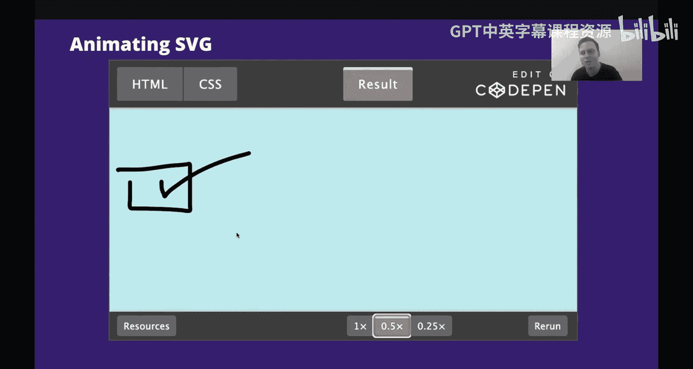

So let's look at the HTML it's using an SVG if you haven't seen SVG before， then it's basically just。

Bunch of dom elements that we're going to be using and they have things like paths or circles that we can draw different shapes with。

So the first path is going to be tick。And。It uses a path that's it's a similar one to the one that we saw before and the next one is one called box。

And so if we look at the CSS。Then we can see with tick， we use these two special properties。

 one is called stroke dash offset and the other is called stroke dash array。

 and we add an animation called。It should be called tick actually so I call the box as a typo but basically what are the dash offset and the dash array well when you have one of these pars that gets drawn you can use dash array so that you can say to the renderer I want you to draw this path but it should be drawn in dashes so if you put dash array of two then it's going to be drawing it's going to be drawing your line or your path or whatever it's going to be drawing for two pixels and then it's going to have nothing for two pixels and then drawing it for two pixels and then nothing so it's creating a dash and you can use a different length to create different dash length。

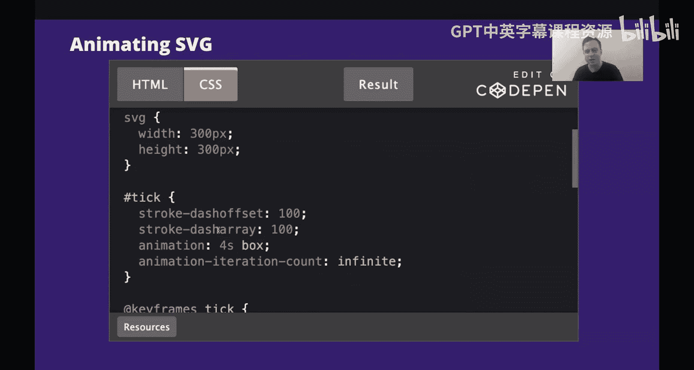

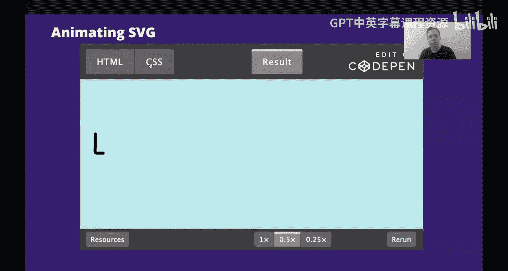

嗯。Here though， we're using a dash length of 100， which is the full length of the tick so。

It's going to be a whole single dash representing the tick and then a whole bunch of nothing after that the same length which makes sense because it's going to be a giant dash right so with dash offset we can actually set the offset so that we can change where the dashes actually start so if we start at zero it's going to be starting the normal dash so it's going to be doing a giant dash for the tick then it's going to be doing nothing。

If we use a larger dash offset， it's going to be moving the dash to start at an earlier point and if we use the same。

Length there， if we use the full length of the tick for the dash offset。

 then it's going to be reversing the dash so that the dash。

 the path is being drawn starting from the blank part of the dash。Then what we can do is we can add。

An animation to that where we change the dash offset from being the full length so it's fully off the screen and using the blank dash as the next part to zero so it's going to be effectively moving the dash in place so it looks like it's being drawn and that's effectively what results in this animation it's pretty interesting。

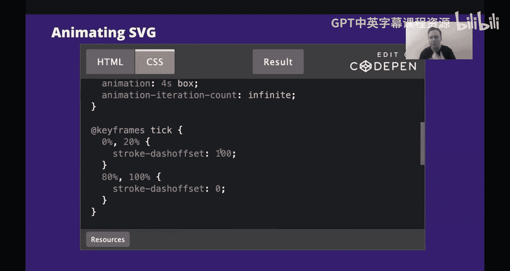

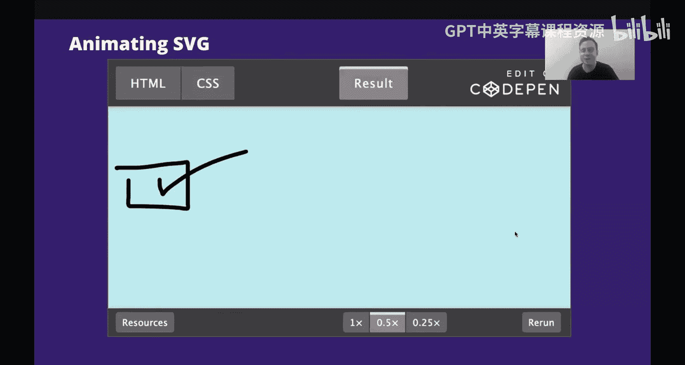

The other thing that's kind of interesting you can animate with CSS and SVGs is the path so the D value and here I'm basically animating from path representing a circle to a path representing a a heart so that's why it changes the shape from a circle to a heart the only downside of this is that you have to get the shape of the path exactly matching。

In other words， if you're using M and then L and then L and then L， L stands for Y。

So it draws a line from the previous point to the current one if they' a different shape。

 so obviously the coordinates are allowed to change that's what changes from a circle to a heart。

 but if。There are any， if it's a different pattern of path then it won't work。

 or if there are a different number of points， it won't work。

So you need to be a bit careful when you're creating your piles， but yeah。

 you can animate smoothly between shapes and it looks kind of cool。

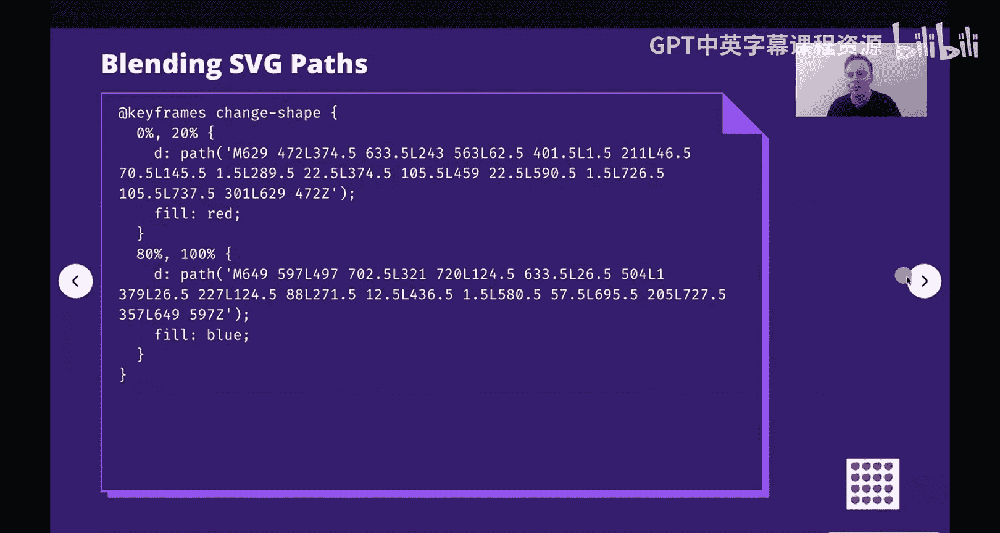

So it's an interesting technique。Okay now we're going to be going through 3D CSS so this is basically using a whole bunch of transforms on your elements to rotate them and translate them so that they'll be in 3D and I won't be going through too much of the math to create these just some of the interesting stuff that you can create so take a look at this ones actually animated by someone called Ricardo Olivia Alonzo and yeah you should check up their were it's lookss really awesome they do a whole bunch of these 3D CSS and they just look amazing。

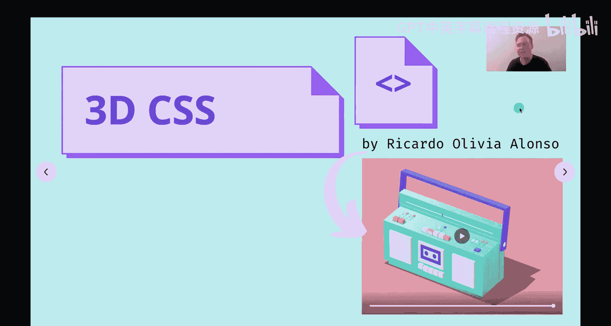

嗯。This is another one by someone called Jhey that I covered them earlier and it's basically a CSS 3D house so you can use this control here to rotate it I think it's the house from up the Disney Pixon movie looks really cool。

Oh， this is something that I created and I showed lots of people at Canva and they were really interested in it and basically it's using JavaScript to draw a little 3D world that's all rendered just with CSS so it's just using 3D CSS so。

And it basically includes a whole bunch of people that are moving around the scene and they're being animated and they're doing all sorts of different stuff。

And you can click on the different buttons and it does different stuff and。Yeah。

 it's kind of interesting， it's kind of slower because it's just turned during using CSS。

 but yeah it just goes to show some of the cool stuff you can do with CSS。Okay。Also。

 I set this up so that you could maybe create your own 3D CSsS so you can go through the code in your own time。

So this is basically just drawing a single cu isosymmetricmetrically。

isometric is basically the view type that we're using where it's basically it's not using perspective distortion and it just looks like one of those platform in games that you see so to extend this you'll just need to go to the JavaScript file and then you'll need to add more cubes here so you can add them programmatically or you can change the size of this cube and change its position and you can add more cubes。

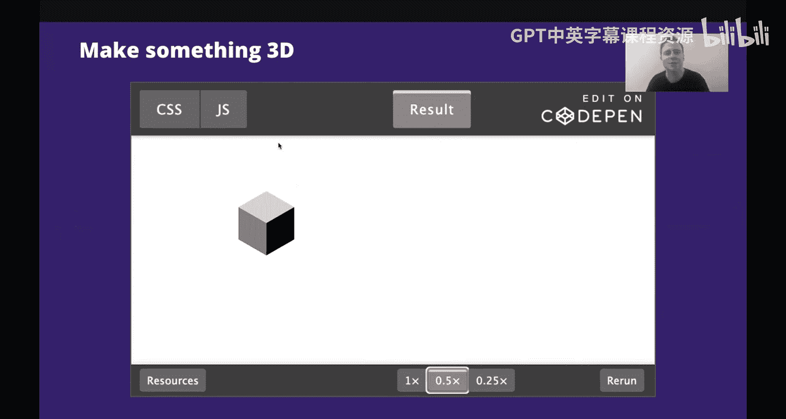

And you can go through and read some of the code to see how I created the。

I went from a queue where it has a position and a size to computing the CSS values needed to rotate various elements to create that cube and maybe you can create something cool。

 you can change the colors， you can add some text in there because it's just HTML。

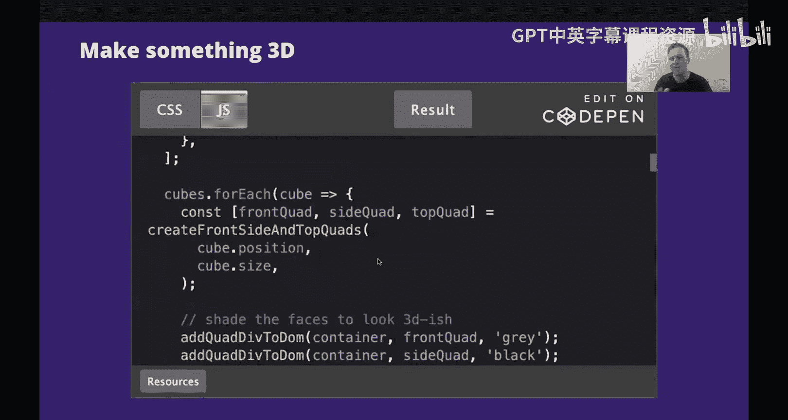

And maybe you can create a 3D graph or some sort of cool game or something 3D snake or something that would be cool。

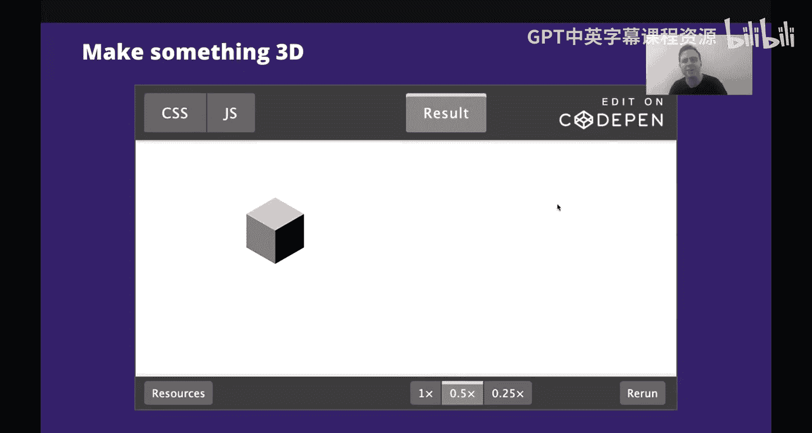

Okay， so this comes to the final part of the presentation， which is the。

Basically answer the question， what if you want to use some CSS。

 but it's not actually invented yet or it's something so niche it probably won't ever be invented。

Well， let's examine this possible case where a designer asks you to create a cool effect for some text where it actually has a really interesting underline。

 which is too wavy underlined and maybe it's animated or doing something cool like that。

So you check the CS。嗯。APpiIs and you see that there's something called text decoration underline and that just does a basic underline so it's not that impressive yet。

But there's also text decoration style， which is。You can set as double， which does draw two lines。

But they're not wavy， there's also a property you can set to be wavy。

 but it's not drawing two of two different colors so basically CSS doesn't do what we want so what can we do in that situation。

There's this thing that's very new， but it's getting more and more implemented by the browsers all the time。

 which is called CSS throughudini， basically CSS throughudini adds a whole bunch of APIs to JavaScript so that you can more easily and quickly get values。

 computer values on your Dom， your CSS values from your Dom and retrieve them in a more typesafe way。

 there's also going to be a way that we can。Oh well。

New type of layouts to be added that are defined by us so you probably already know the grid layout and the flex box layout。

 or you can maybe create your own layouts in the future。

But one of the things I'm going to be going through is called the CSS Painting API and that's part of this CSS Houdini project。

It's currently only used by Chrome and Edge so and it will be coming soon to Safari apparently。

 but it's not Firefox， so make sure you're testing this curve with those browsers。Also。

 you can go to。Is Houdinireadyat。com to find out which parts of the API ready so the layout one is not ready yet。

 I believe， but this painting API is supported by Chrome and E so we can start playing around with it。

So basically how to use this Houdini painting API， there are two main steps。

 one is to set up the JavaScript code。For our custom CSS that we're adding。

 so we need to obviously add a named so that we can use that CSS and we need to also specify the functionality of it。

Then two， we actually use the custom CSS in our code。

We need to actually use a separate JavaScript file because it's going to be running in something called a worklet that you might be covering later。

嗯。In your career and we need to use this function register paint and then we specify the name of our new CSS property and then we add a class in as the second parametermeter。

 the class is going to be implementing a method called paint。

And paint can accept a context as size and props values。

 so a context is basically an object which will give us a whole bunch of drawing APIs so we can say。

 hey， draw this circle here or draw this line here and we're going to be using it to draw our wavy line。

Size is also very important because that's going to be the size of the element in pixels that we've added our CSS property to and then props is going to be something we can use to get other CSS values that have been set on this element including our own custom values so here when we're using it I called it wave underline。

So the most important part is to add background image。

 then we use a paint function and we add our custom CSS name here， which is called waveve underline。

嗯。And I'm also setting these three custom properties， so underlying color one。

 we can change the color of the first underline and then under color two。

 obviously the color of the second one and wave time is going to be set as a number from zero to one。

 which is basically going to be shifting our wave across the X axis and I'll go into that more。

In a second。So I prepared this example。

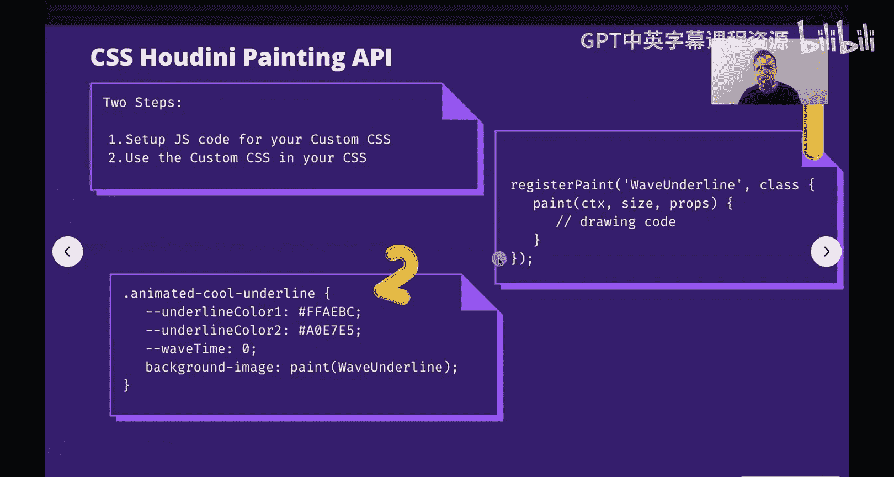

Here， so as you can see this。Is using the regular CsS underline。 This is using the wavy one。

 And then this is using our custom one here。 And this is animating custom one。

 So it looks really cool。 So you can type some other text here。嗯Wow。This is cool。嗯。

And let's have a look at the CSS for this。Soir。嗯。On the first one。

 obviously it's just setting text decoration to underline and text decoration color is going to be this pink color that's how we get the pink color and the other the next one is basically just adding text decoration style as wavy。

嗯。But let's look at our custom baby under， the double one。So as you can see here。

 we're setting the underlying color one and the underlying color two。

And wave time is going to be zero and background image is going to be paint with our custom CSS wave underline we can even override these so we can just use the CSS values just like normal so if I go underline color one I could change it to red and as you can see this has changed to red I can also use wave time。

As 0。5 and as you can see it shifted this so if I changed back to zero， I changed to 0。5 like this。

So how do we get this animating version， well it's actually very easy because since we've got the wave time。

 we can just use regular CSS animation。Here you can see that we're selling all the same values。

But we're adding an animation called animated cool underlying and and it goes for three seconds so we can change this to one second so it's going really fast we set the iteration counts infinite the time function linear so it's always the same speed and then we can take a look at the。

Animation down here， so this is keyframes， animated cool underline anem。Just go from 0%。

 wave time is 0 to 100%， wave time is one。And it will automatically animate with you by recalling as long as your code reads in the wave time or whatever property variable you use。

 it will intercallate that for you and send you through the right one。

 then you can redraw your underline or whatever custom CSS thing you want to add。

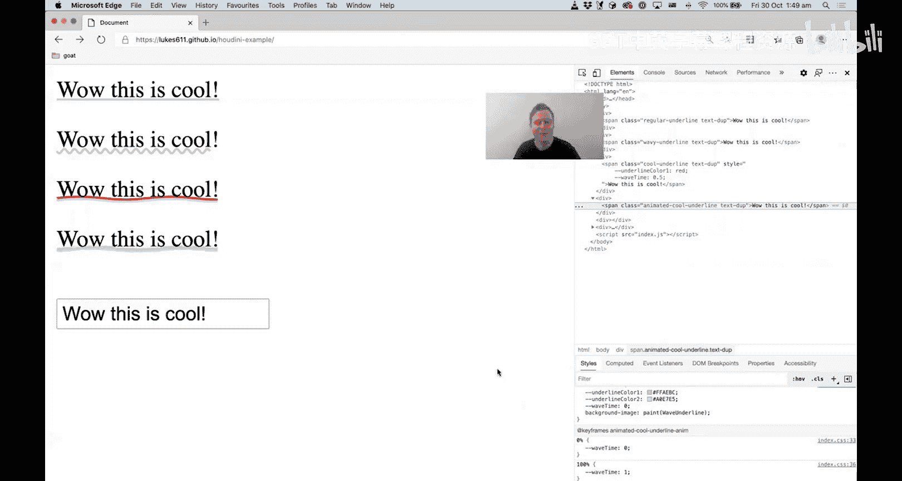

Okay。

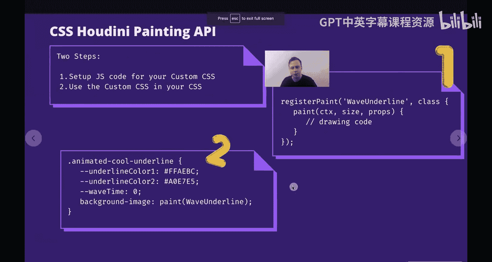

So that basically concludes the end of the lecture。

Thank you very much for listening and I hope that you were inspired to maybe if you have time after the exams。

 you can create some of your own very interesting and。Creative。

CSS projects so I've added some references for the some of the projects that we went through today so that you can have a look for yourself。

嗯。And here's some more references here， so just post the video and use the QR code to go to them。

Thanks everyone very much for listening to the lecture。

 I really hope that you enjoyed it and hope that you have a really good day。阿事但。

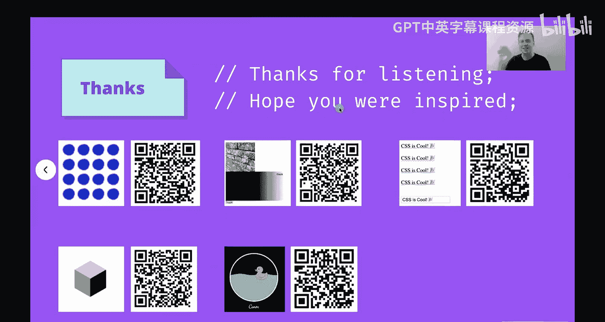