# 前端编程：第2周：HTML与CSS实战演示 🚀


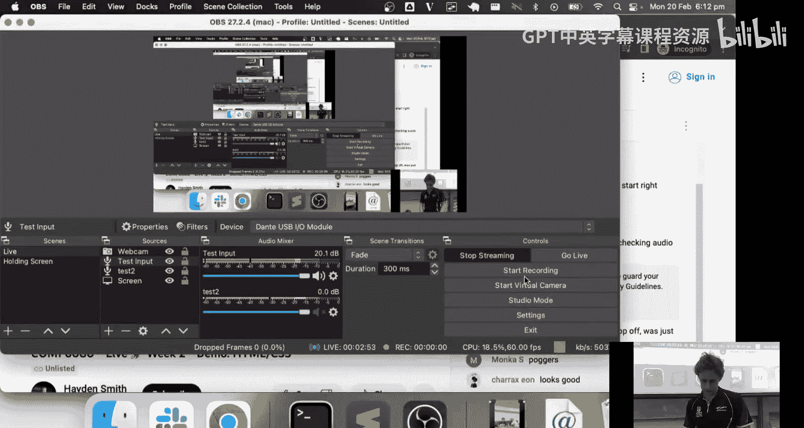

在本节课中，我们将通过一个实战演示，来回顾和巩固上周学习的HTML与CSS核心概念。我们将尝试模仿Airtable网站的一个页面，在这个过程中，你将看到如何将理论知识应用到实际项目中，包括布局、样式、响应式设计以及简单的动画效果。

---

## 概述与准备工作

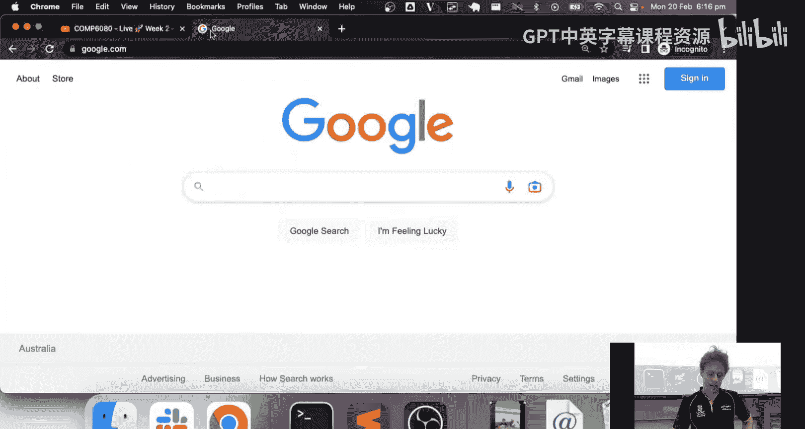

上一节我们介绍了课程安排和本周的演示目标。本节中，我们来看看如何从零开始构建一个网页。

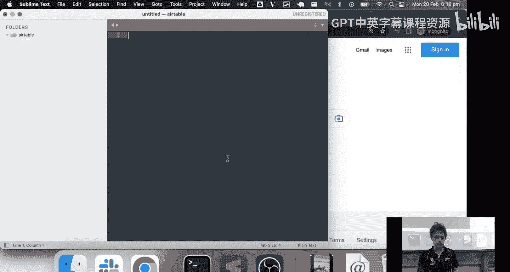

首先，我们选择Airtable网站的一个页面作为模仿对象。这是一个结构清晰、包含常见元素（如导航栏、按钮、图片和文本）的页面，非常适合用于练习。

我们将创建一个名为 `our_page.html` 的新HTML文件，并搭建基本的页面结构。

```html
<!DOCTYPE html>
<html lang="en">
<head>
    <meta charset="UTF-8">
    <meta name="viewport" content="width=device-width, initial-scale=1.0">
    <title>Airtable Clone</title>
</head>
<body>
    <!-- 页面内容将在这里构建 -->
</body>
</html>
```

---

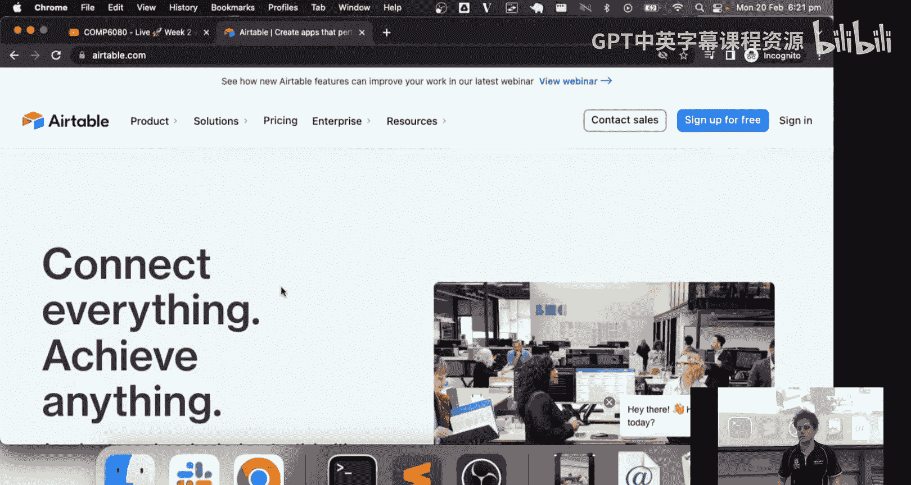

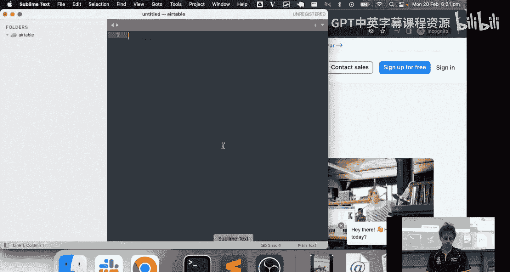

## 构建页面宏观结构

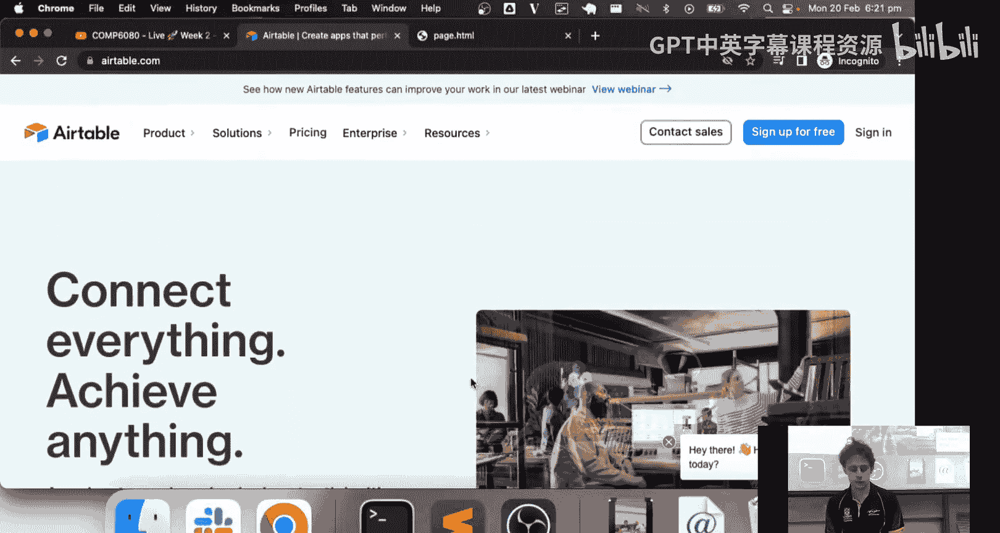

以下是构建页面的第一步，我们将创建页面的主要宏观区块。

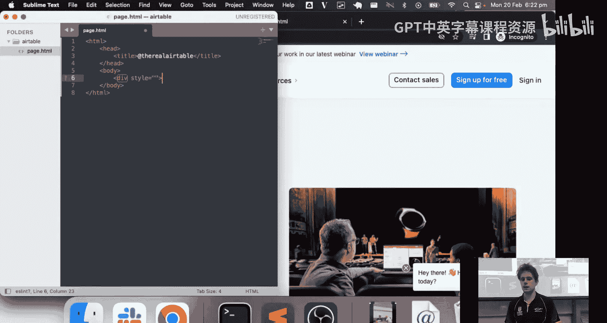

我们观察到页面顶部有一个白色的导航栏，下方是一个蓝色背景的区域，其中包含文本和图片。因此，我们首先创建两个主要的 `div` 容器。

```html
<body>
    <div id="header">
        <!-- 导航栏内容将放在这里 -->
    </div>
    <div id="main-content">
        <!-- 主要内容区域将放在这里 -->
    </div>
</body>
```

---

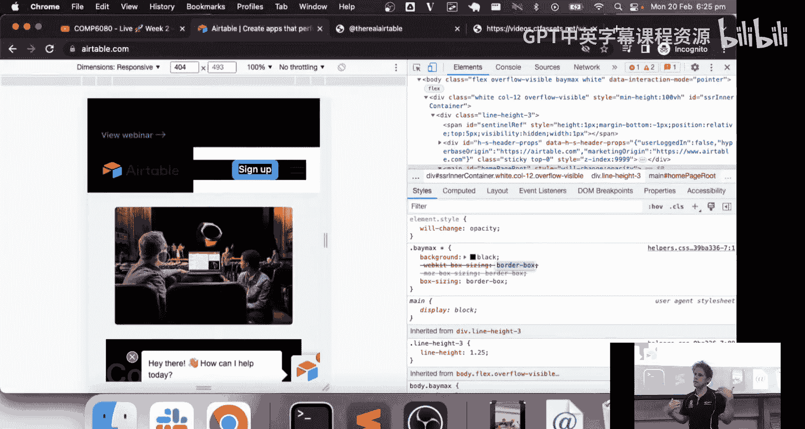

## 填充导航栏内容

在导航栏中，我们看到了Logo、几个导航链接和两个按钮。以下是填充这些内容的方法。

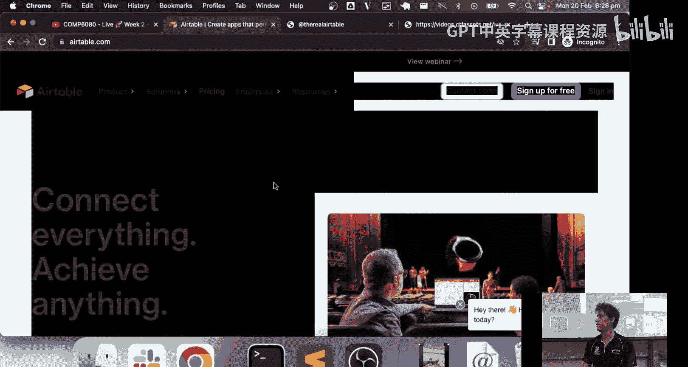

我们使用 `div` 和 `span` 等元素来组织内容。初始阶段，我们更关注结构而非样式。

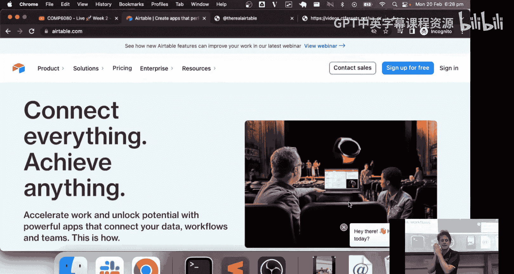

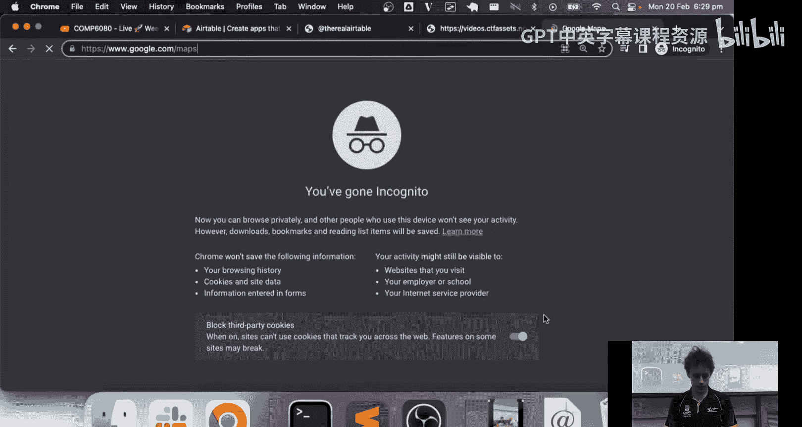

```html
<div id="header">
    <span>Airtable Logo</span>
    <span>Product</span>
    <span>Solutions</span>
    <span>Pricing</span>
    <span>Enterprise</span>
    <span>Resources</span>
    <button>Contact Sales</button>
    <button>Sign up for free</button>
    <a href="#">Sign in</a>
</div>
```

---

## 创建主要内容区域

主要内容区域包含一个大标题、一段描述文字和一个图片（或视频）。我们使用标题标签和 `div` 来构建。

```html
<div id="main-content">
    <h1>Achieve anything that's possible on a spreadsheet</h1>
    <h4>But 10x faster, with 10x less effort.</h4>
    
</div>
```

---

## 应用CSS样式与布局

上一节我们搭建了基本的HTML骨架。本节中，我们来看看如何使用CSS来改善布局和外观。

我们首先使用内联样式进行快速原型设计，然后逐步将样式提取到独立的样式块中，以提高可维护性。

### 设置基础样式

我们为页面主体和主要区域设置一些基础样式，比如背景色和字体。

```css
body {
    margin: 0;
    font-family: Arial, sans-serif;
}
#main-content {
    background-color: rgb(230, 240, 255); /* 一个浅蓝色 */
    padding: 20px;
}
```

### 使用Flexbox进行布局

为了将导航栏的元素水平排列，并将主要内容区的文本和图片并排，我们使用Flexbox。

```css
#header {
    display: flex;
    align-items: center;
    justify-content: space-between;
    background-color: white;
    padding: 10px 20px;
}
#main-content {
    display: flex;
}
#main-content div {
    flex: 1;
}
#main-content img {
    max-width: 100%;
    min-width: 50px;
}
```

---

## 处理图片与SVG

在网页中，图片格式的选择和尺寸控制非常重要。我们来看看如何处理不同类型的图像。

### 图片格式与优化

对于照片类图像（如我们使用的“千层面”图片），JPEG格式通常能在保证质量的同时大幅减小文件体积。我们通过CSS控制其响应式尺寸。

```css
img {
    max-width: 100%;
    height: auto;
}
```

### 使用SVG图标

Logo或图标通常使用SVG格式，因为它是矢量图形，可以无限缩放而不失真。我们可以直接从目标网站复制SVG代码。

```html
<div id="logo">
    <svg width="100" height="50" viewBox="0 0 100 50">
        <!-- SVG路径数据 -->
        <path fill="#FFD600" d="..."></path>
        <path fill="#4285F4" d="..."></path>
        <!-- 更多路径 -->
    </svg>
</div>
```

为了控制SVG的大小，我们将其包裹在一个容器 `div` 中，并对容器设置尺寸。

```css
#logo {
    width: 100px;
    height: 50px;
}
#logo svg {
    width: 100%;
    height: 100%;
}
```

---

## 设计按钮与交互效果

按钮是网页中常见的交互元素。我们将为按钮创建样式，并添加悬停效果。

以下是定义按钮基础样式和悬停状态的CSS代码。

```css
.header-button {
    padding: 10px 20px;
    border-radius: 5px;
    border: 1px solid #ccc;
    background-color: white;
    cursor: pointer;
    transition: all 0.3s ease;
}
.header-button.blue {
    background-color: #1a73e8;
    color: white;
    border: none;
}
.header-button:hover {
    background-color: #f1f1f1;
}
.header-button.blue:hover {
    background-color: #0d62c9;
}
```

在HTML中为按钮应用这些类：

```html
<button class="header-button">Contact Sales</button>
<button class="header-button blue">Sign up for free</button>
```

---

## 实现固定定位导航栏

我们希望导航栏在页面滚动时始终固定在顶部。这可以通过 `position: fixed` 实现。

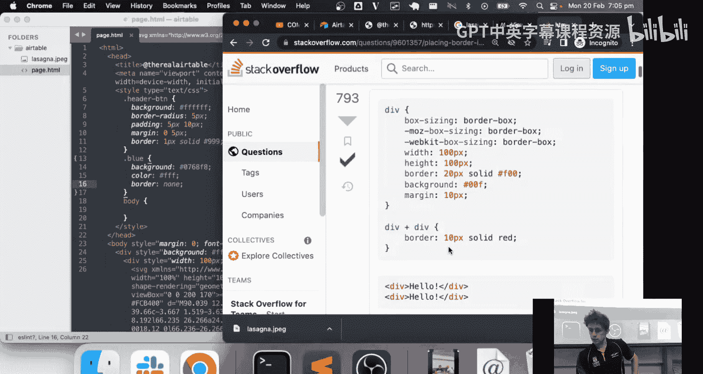

```css
#header {
    position: fixed;
    top: 0;
    left: 0;
    width: 100%;
    height: 80px;
    background-color: white;
    /* 其他样式 */
}
```

由于固定定位元素脱离了正常文档流，我们需要为 `#main-content` 添加上边距，以防止内容被导航栏遮挡。

```css
#main-content {
    margin-top: 80px;
}
```

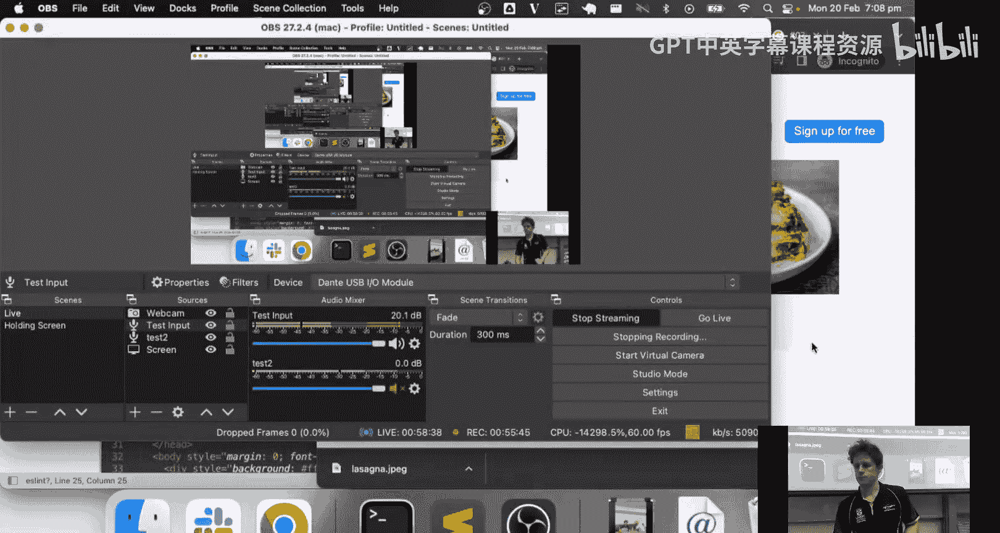

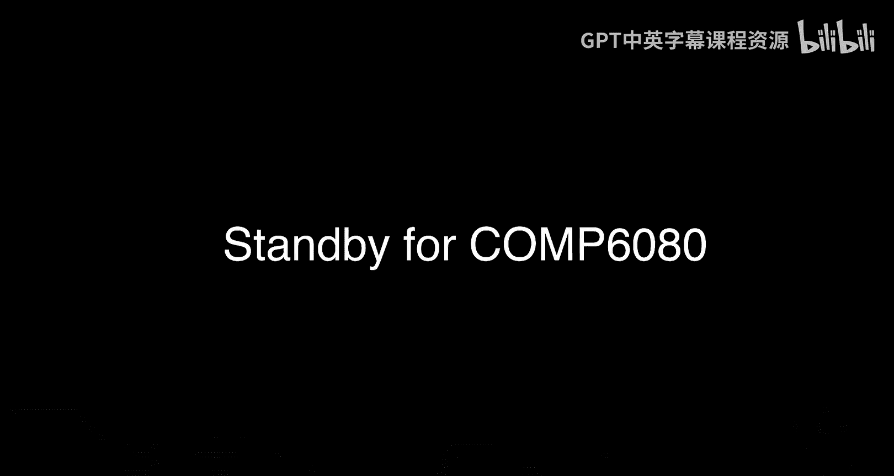

---

## 添加响应式设计与媒体查询

上一节我们完成了桌面端的布局。本节中，我们来看看如何让页面适应移动设备。

我们使用CSS媒体查询来根据屏幕宽度应用不同的样式规则。

### 调整布局方向

在移动设备上，我们希望主要内容区的文本和图片从并排变为上下堆叠。

```css
@media (max-width: 600px) {
    #main-content {
        flex-direction: column;
    }
}
```

### 隐藏或显示元素

我们还可以在移动端隐藏导航栏中的某些文本，只保留图标或关键按钮。

```css
@media (max-width: 600px) {
    .nav-text {
        display: none;
    }
    #logo {
        width: 30px;
        /* 调整Logo大小 */
    }
}
```

---

## 创建简单的CSS过渡动画

CSS过渡（`transition`）可以为元素状态的变化（如悬停、媒体查询触发的样式改变）添加平滑的动画效果。

以下是一个示例：当屏幕变窄时，让一个元素的宽度平滑地变为0。

```css
.animated-element {
    width: 50px;
    background-color: blue;
    transition: width 1s ease;
}
@media (max-width: 600px) {
    .animated-element {
        width: 0;
    }
}
```

**注意**：`transition` 用于简单的属性过渡，而更复杂的多关键帧动画应使用 `@keyframes` 和 `animation` 属性。

---

## 总结与回顾

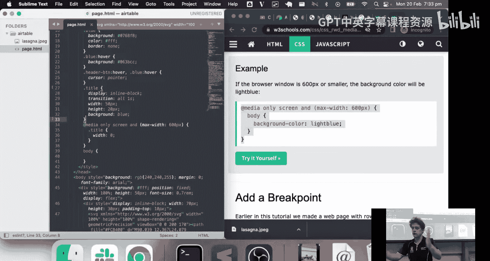

本节课中，我们一起学习了如何通过一个完整的实战演示来应用HTML和CSS知识。我们从分析一个现有网页开始，逐步构建了其HTML结构，并使用CSS实现了布局、样式、响应式设计以及简单的交互效果。

我们回顾了以下核心概念：
*   **HTML结构**：使用语义化或通用的标签（如 `div`, `span`, `button`）搭建页面骨架。
*   **CSS布局**：**Flexbox** 是实现灵活布局的主要工具。
*   **图片处理**：根据场景选择 **JPEG**（照片）或 **SVG**（图标/图形），并控制其响应式尺寸。
*   **组件样式**：通过定义 **CSS类** 来复用样式，并为按钮等元素添加 **`:hover`** 伪类实现交互。
*   **定位**：使用 **`position: fixed`** 创建固定定位的元素（如导航栏）。
*   **响应式设计**：通过 **`@media` 查询** 针对不同屏幕尺寸应用不同的CSS规则。
*   **动画效果**：使用 **`transition`** 属性为CSS属性的变化添加平滑过渡。

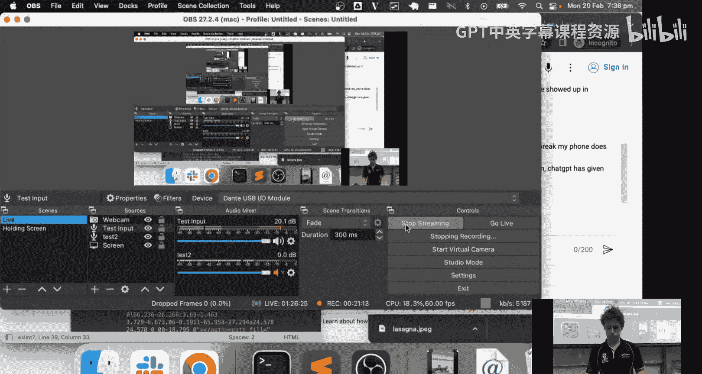

希望这个演示能帮助你更好地理解如何将分散的知识点组合起来，构建一个完整的网页。记住，网页开发是一个迭代的过程，从宏观结构到微观样式，不断调整和优化是常态。