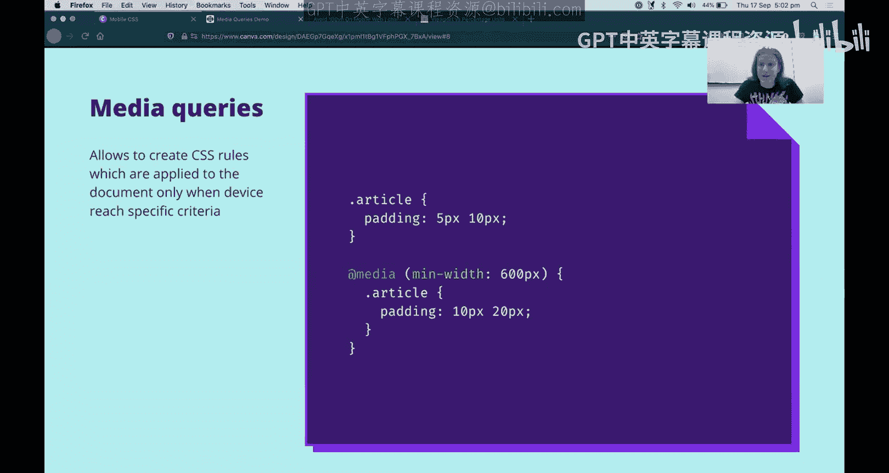
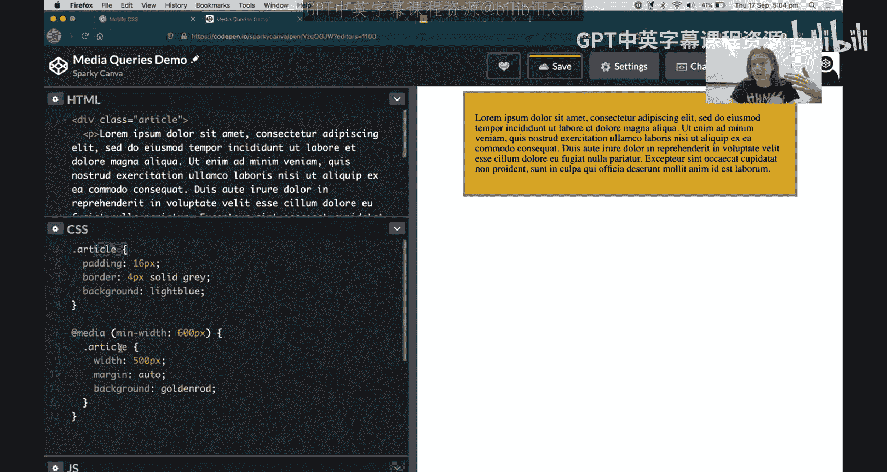
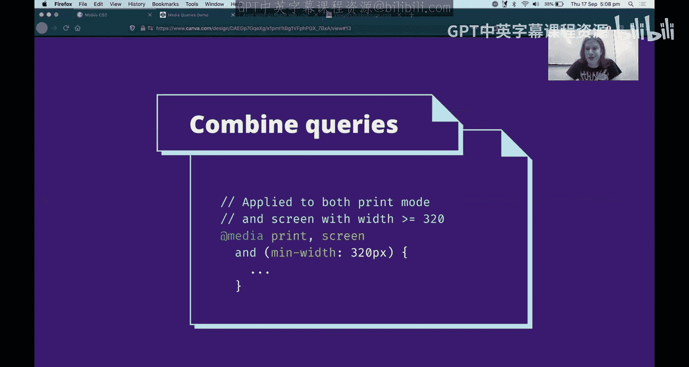
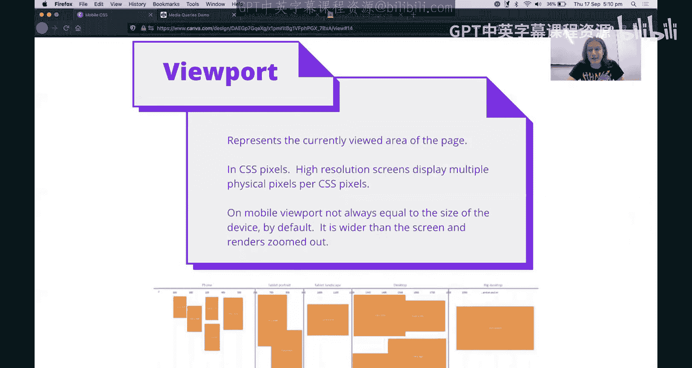
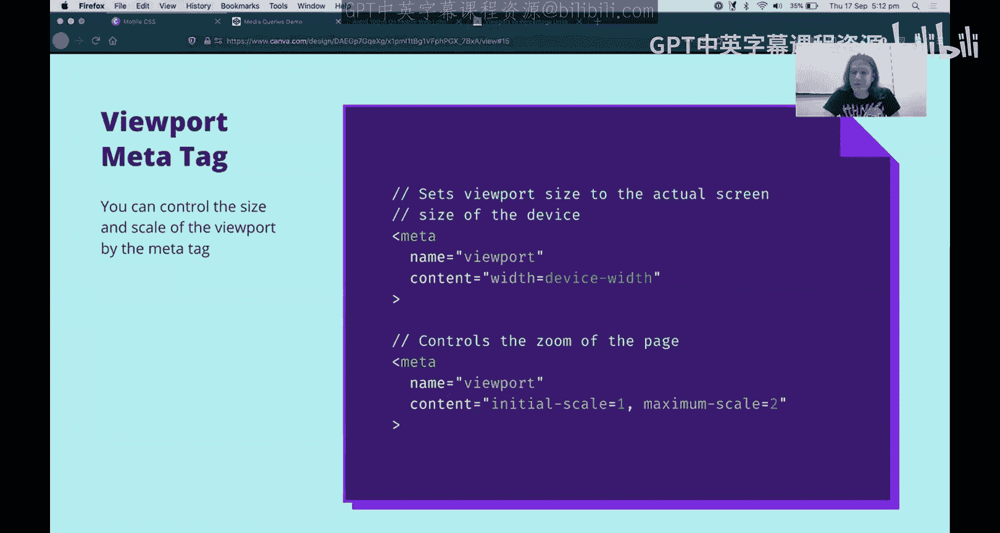
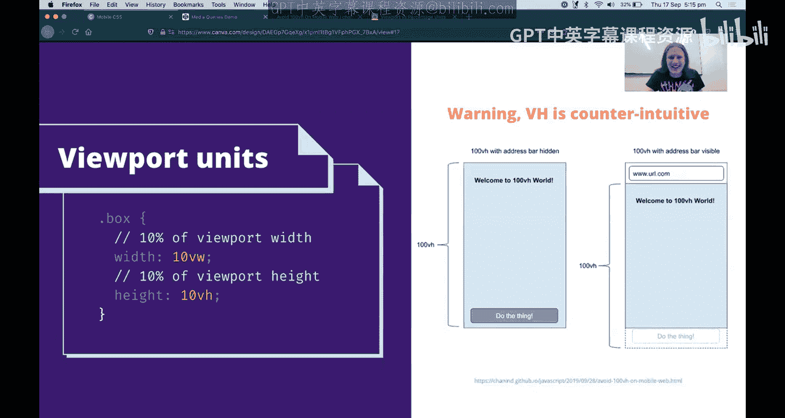
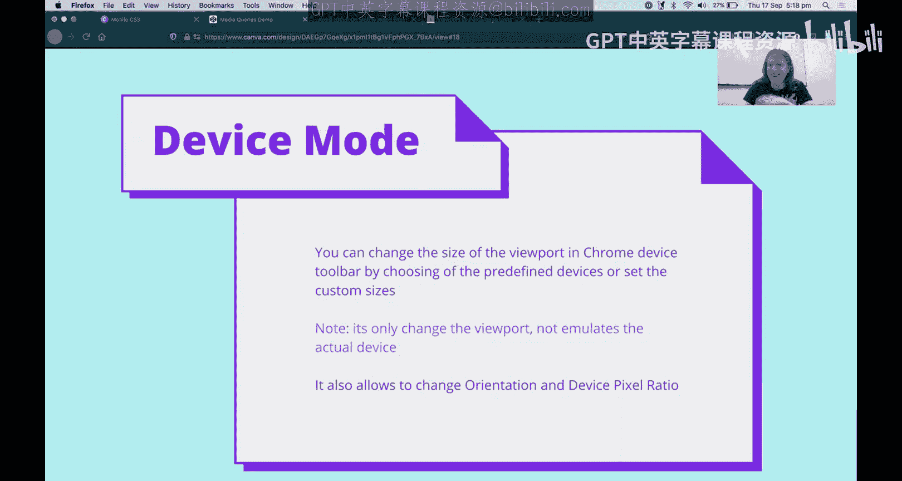

# UNSW《前端编程｜ Web Front-end Programming COMP6080 23T1》中英字幕（deepseek-R1 p15 -15-COMP6080 - CSS 🌝 Mobile Intro.zh_en -BV17RXGYuEaM_p15-

Hey Sam here， I'm going to be giving you an introduction to mobile CSS and how we can build websites that look great on your phone。

😊，What's the motivation for this So obviously in 2020 people have lots of different types of ways to access the internet。

 they can use their phone， they can use a tablet， they can use a big laptop。

 a small laptop a huge 4K ultrawide monitor like an old monitor like a TV there's so many things that users can do to access the internet and often your users of your website they're going to be using multiple different devices and just like you want to make an amazing website for your users it can't be amazing if it doesn't respond to the type of device they're using。

😊，And as we know obviously a lot of internet consumption these days is happening on mobile these are some stats from I'm not exactly sure where。

 but it would depend on exactly what company you're working at。

 what kind of application and market you're targeting。

 but mobile it's pretty safe to say is it's really big and it's not going away and neither is desktop so often as a web developer you will need to support both so we're going go a deep dive today on how you would be able to support both mobile and a desktop site。

 but often there'll be other ones you might have tablet you wont have like different tablet support features all sorts of things that you could possibly do but we'll just focus on big two for now because the skills are the same Su so what if one way that you could support mobile well youd build a desktop version of your site maybe you could just make a second version for mobile and this has its pros and cons。

😊，And this this is a way that some people do it。 So for instance， if you take Facebook there's www。

facebook co and that's what you open on your desktop。 But if you're on your phone。

 you go to and Facebook co and it shows like a different version of Facebook it's more mobile it's only got one column it doesn't have all the sidebars It's great So that's my way to do it There's pros and cons to the way the Facebook does it and other websites also do the same as Facebook。

 The pros is that is's way more optimize for mobile because it's a because you're making a separate website it can be done by a separate team usually with a separate codeb and maybe you're separate designers。

 the separate designers can make things that like look just great for mobile and like a really optimized mobile first experience。

 It's possible to go different UX So for instance， if you are going like Instagram you probably gonna want it to be really different on mobile to desktop because on mobile you can take pictures and on desktop like you don't have camera on the back So you're not gonna go and snap Instagram photos with the laptop that'll be a bit weird。

😊，It's also way easier to de bug because they're two totally separate codebases instead of having one codebase that's doing like so many different things you just have one codebase that's always doing mobile and one codebase that's always doing desktop that's really easy to think about obviously though there are icon cons the biggest con being you now have two codebs and that can take a lot of time that can mean that then there needs to be more people work the project it costs more money but it can also bear a real headache for maintenance of the project I'm sure you guys might have experienced this made with a bank application for instance。

 where there's some features that are available on their desktop website but are not available on their mobile website or vice versa and that can really annoying your users and it can also it can be really annoying to have to double up the work whenever you want to do any change onto the website Another problem is that it's really hard to redirect people between the mobile and desktop sites so on the mobile on the mobile。

😊，You want to be able to load www。facebook and it will rewrite you to MDfacebook and vice versa on desktop but getting that right can be really hard and if you redirect people to the wrong version they can get the wrong experience and especially when the experiences are quite different as you often would do if you're making a separate mobile site the users can be really annoyed but they get the wrong version and the third and this is actually really interesting is Seo problem so if you're building so Seo search engine optimization that's making it easy for Google to find your website and making sure that your website site ranks highly in Google being another search engines when you have an M site and a www site that makes you have two URLs for the same content so for instance in Facebook they might be Facebook co sas amazingazing birthday party and ww。

 Facebook s sasaz birthday party and this can be quite confusing to Google because it can think that there are then two different sas amazingaz birthday party。

that are happening at once and all of the amazing signals that it gets to try and rank one page that can get split across two pages and so the two pages might rank like in the middle of the list instead of if they were the same page。

 they ranked at the top of the list obviously that's not an issue with Facebook because it's not putting my events on Google which I'm very happy about。

 but if you are a business that is more where SEO is more of an important requirement。

 then that can be room on start for having a separate mobile version。

But there is an answer and it's called responsive so responsive websites is a kind of a newer phenomenon and that's a way to go to a website。

 one single website that looks good on both mobile and desktop using CSS to apply different styles depending on what device you're on。

So the pros of this is obviously time because we're just making some CSS changes it's maybe of like 10。

20% more work instead of double the work to make two websites and additionally it means because we're we're sharing one codebase it's much easier to have the same functionality and across every device that the website is used to because they're the the same codebase fundamentally the coin is that you have to have extra code in that codebase and it's also extra complexity it's more to test it's more to think about when you're changing the code because you have to think oh I'm changing this code is this going break how it looks on mobile you might have test things twice that's extra work it's also harder to make things exactly high quality user experience on mobile because you're probably like trying to retrofit what youve got on desktop onto mobile or vice versa and trying to share as much as you can rather than coming at it in kind of a clean room like two separate teams thinking about how do we make a mobile how to make on desktop so it might not be as high quality。

Of mobile user experience but response to website is kind of the biggest trend in the industry right now it's what a lot of companies are doing so that's what we're going to have a look at today in this pre zone。

So what is the technology that allows us to have different CSS on devices this technology is called media queries So a media query is like an if statement in CSS What's happening here here's an example CSS file you can see it on the screen in the purple we got some normal CSS rules here we got like you know something with the class article we apply these cutting and then we have an app media and what this is this is basically like an if statement but it's an if statement on on the device the browser that the user is using right now and so we have we say if the device is larger than the minimum width of 600 pixels and then we apply these extra styles and so the way that the browser kind of interprets this is it's。

If that if that's not the case， so if we have a 500 pixel wide device it just simply ignoreaws everything that's in there and doesn't apply if that is the case it's basically just deleting like the mid query and just applying these styles as well so these styles are。

So in the case that it is over 600 pixels， both the padding 510 and the padding 1020 would apply。

 but since the media query， the styles in the mediaQu are contained later in the CSS file。

 they're given a higher priority so that would override original styles and would end up with 1020。

That can be a bit much to take in so I'm going to change tab I'm going to show you a quick demo I prepared earlier here we go this week so I have a deep article here just like in the example and I have a P with some text and as you can see it's just a normal HTML page I can resize my browser window and its the text is changing in width。

And it's all normal got some CSS got a border， I've got a background it's pretty cool Now if I uncom the media query with initially we're not going to see anything happen because our media query here is min width 600 so it only applies to browsersal windows or devices that are larger than 600 pixels wide and in this case it's not as 500 or so so it's only applied the styles here。

 but if I were to make this larger we now see that it's also applying the styles in the media query so in addition to our padding border and background we've applied a width 500 so that's why it's not taking up the whole width anymore and we've applied a margin auto so that's why it's kind of centered but we've also what we've done here and this is really important we've applied a background golden road。

And because this mid query is lighter。And the browser is interpreting， we match the MediQu。

 so it's basically it's just it's got these it's just says file with these two classes。

 article with background light blue and that article with background Golden Roadd and since Golden Roadd comes later。

 it wins and as we can see the background is now golden R。

So just to drive home that point I'll show what would happen if we put the media query above the default styles so we see just with the default styles you know it's not nothing's happening。

 we put the media query ahead we see we get the width changes because there' there's no other width we get the margin because there's no other margin defined but because light blue is。

Is the late last background defined that's what wins so we're just going to remember that that basically you want to put your media queries after your default styles or an element that's really important so we've basically got know default and then we've got if and then we have all the additional things we want to do if that statement is true。

So sweet so now we' see how meres work let's dive into what conditions we can do you know because you know it's like a new statement。

 you can put code in your statement， you can put code outside a statement but the closing negative statement is what you can put in the condition block so two types of conditions but media types and we've got media features media types are very simple there's four of them there's a couple of legacy ones but we won't dive into them there's all matches everything print matches when you know control P try and print the thing on like physical paper like this like it's amazing print pretty and we've got screen which matches what I'm doing right now I'm looking at this real print on the screen and then we have speech synthesize so someone's using like text of speech if they're using accessibility features then that would apply。

Then we have media features， so media features are kind of the main things you'll be using so these are。

Theses are not mutually exclusive like a type something can be more than 500 pixels wider and it can support hover so that's why we' calling features instead of types so we got。

 for instance， we have map width which would match anything that is below that map width so it would match so for here we got map width 500 pixels which would match things that are 500 pixels are narrower and that for instance would be a phone in portrait orientation we have min width which will match things that are that many pixels or wider so if I have min width 501 pixels that would match up that is 501 pixels and wider for instance。

 a phone in landscape orientation or a tablet or this computer in fact and then we also have we got all sorts of different types you can search them up like search them on MDm just search out media queries。

 look at media features we got for instance， hover。

Which if the primary input methods of whatsoever's， that's kind of cool if you wanted to。

 for instance。Shows something slightly different when that if the user was using a touchscreen and they didn't support hovering over things we've also got preferences so we can we can use preferreds color scheme if someones using a modern laptop and they have like you know dark mode toggle we can make our website look dark too there's also like prefers reduced motion which is really important for accessibility and like prefers a high contrast stuff so yeah maybe features they're pretty cool but minimum max width the probably one skin is most because that is most relevant to making stuff scale the small devices such as phones awesome。

We can use multiple criteria you know it's like a new statement。

 you can use an's in user statement and it's pretty cool。This one we can use a not。

But it's really important to notice that the not does not make sense it's not exactly the same as in JavaScriptscript that is because it inverts the whole query。

 not just the screen so you might read this and it's just wrong don't realize this and you might read this as saying you know when it's not a screen and the minimum width is but that's not here to read it you got to read it when it's not screen with the minimum width of the orientation portrait like you know imagine if the not applies at all of it so that's just an important thing to be wary of。

😊，And it's often。There's often more you to avoid using that because of this quite counterintuitive behavior if you're used to not in any other programming。

You can combine queries， so this media query will match if。

Is print or the screen with a minimum width of 320 pixels。Cool，发 can好。

Yeah， so we've talked a lot about minimum and maximum width。

 but what are we talking about the minimum and maximum width of？The viewpoint。

So the viewpoint is the area that your page has to render inside the browser is the area。

on a desktop that's the area of your browser window but on a mobile phone that's probably the area of your device it's really important to note that the viewport is in CSS pixels you know while you know modern phones for instance might have like 4K screens or something ridiculous that in 4K screen like it's over to the other pixels why。

Your viewport might only be 500 pixels wide and the reason that is is because on super high resolution devices what they'll often do is they'll map one CSS pixel actually represents like two physical pixels wide。

 for instance so。That's a little bit it can be a bit confusing to start but what that means is that the pixel widths of devices of different physical widths are actually relatively consistent if we say if we target things that have like a width of less than 500 that'll actually include almost every phone that's manufactured even though we now have far higher resolution phones that'll include all the way back from like iPhone1 all the way to whatever 4K amazing phone you've got because they have these like hardware scaling factors and we don't have to think about that as developers。

That's really good Also mobile view yeah so I've got an example here with some different viewports so phones being like less than 600 tablet portrait being between 600900 and then desktop being kind of above 1200 but obviously this is kind of something you have to do some research about your own users or just stick with best practices such as this one。

It's really interesting now on mobile to realize that the viewport can be a bit complex so we're going to get on to the next subject。

 which is the viewport metat so on mobile and you've got to own an out to transport you guys back to when you they were making the original iPhone the web was not ready for mobile websites and just like you know if you have a text box and you shrink it down a lot it wasn't going to look really good if they told the truth to big desktop websites about mobile about the viewport with so what they did。

Is mobile browser such as Safari on iPhone or Chrome on an Android phone by default。

 it will render the page about three times zoomed out。 So the original iPhone was 320 pixels white。

 but it presented in the browser that it had a 900 pixel wide viewport So the so the web page was when rendered as if it was on a 900 pixel wide window and then it was just zoomed out to fit on the iPhone's screen。

 obviously this is really good for batterylor' compatibility， but if you're making modern website。

 you don't want this behavior So that's where our first viewport metag comes in This is not even really a specification it's just kind of something that exists that you know Safari and Chrome support and that's all good because that's。

You know that they the mobile browsers so you add theport meta with peoples device width and that tells the browser to not lie to you to give you the correct width and bos your uncle and you good so when you add this on an iPhone for instance it'll say that it's like 300。

 400 pixels wide which makes sense rather than lying about being like 900 pixels wide and then  Z so this first one yet you want to add it to every website you make。

😊，That's important yeah this is just some stuff in the comic phase and you'll use it on every website that you make basically。

The bottom one is kind of an example of how the viewport tag is a bit more advanced in that so there are some other features the support varies between devices so for instance you could restrict zooming so that people can't zoom too much you might not want to do that could could make your site inaccessible but it's something to consider anxious a good thing to know that you have that feature available if you need to restrict zooming。

Or other kind of viewpoint actions on your website。So the other thing that's interesting。

 so we learned about media queries， which let us supply different CSS rules based on the viewport and we've learned about how the viewports。

AK of a bit of a light， but a really nice that give you this almost consistent。

 I across every device in the world， one CS pixel represents a reasonably small range of physical widths。

Sometimes we might want to use this viewcor when we're designing a layout， so for instance。

 we might have an image。And we don't want to to take up more than a screen full so you know I'm laying out like an article。

 for instance， I don't want to user it to have to scroll all the way through a photo of the Sydney Harbour Bridge I just want to be one screen so that they can scroll past it quickly and so we can use VH and VW to do that so VW is a percent if it's like percentage so 100 VW is equal to the width of the viewport and 100 VH is equal to the height of the viewport so I just use those units in Cs width type wherever I would use pixels or percentages usually the only caveat though is that on mobile they can be actually even on desktop so they can be the counterintuitiveity so on mobile often like the URLO will disappear is you scroll down on the mobile screen and 100 Vh actually is。

100 VH is the height of the viewport when the URL bar and all the other scrolling stuff is hidden which is a little bit confusing so it means if you have a 100 VH element。

 the user when they first load the page and the address bar is visible。

 they're not going to be able to see all of the element。You can use percentage here。

 but percentage does come with a caveat the percentage changes as the height of the viewport changes based on the scroll so if you going to if you're trying to make something fill the entire screen on mobile you cooked and you have your work cut out for you so that's something that you need to research also on desktop on some platforms such as Windows the scrollbar takes up some width and 100 VH100 VW and 100 VH do include the width of the scroll bar if you make something 100 VW but you have a vertical scroll then it's actually going to be wider it's going add horizontal scroll bar because now the page is slightly too wide to fit inside inside the scroll bar so yeah。

Peopleport units。They thing。 They' useful sometimes。 And they just， yeah， yeah。

They not going to solve all of your problems， I suppose。

Squit but so we talked a lot about different viewport units。

 ways to apply CSS like if statements with the app media query based on the viewport。

 but it can be very hard to test on those different viewports if you don't have1 thousand phones on you which I don't unfortunately so I'm going to tell you this amazing tool it exists in Chrome exists in Firefox and is this little like mobile device icon in the Den toolss and they'll let you change mobile device so。

It lets you change the viewPo it lets you also choose from predefined devices you know you don't have to remember the size of the icon that's really convenient and it also lets you change your orientation and do some more advanced stuff like T B Ps ratio if you're doing my canvas game development you know you probably don it now but it's good to know it exists so I'm going jump into Chrome for the second demo today and I'll show you how to use that。

I've actually already argued it。All right。I open it again。

 So going to the spec I've already opened it。 Its this little button here。 So you know， this is。

 this is normal to what you're familiar with it's next to the little grabber click the to device toolbar exactlyact same icon in Firefox as long as exactly the same feature。

 And as you see the website's gotten squashed。I can see now say less of it and it looks like a phone。

There's two in controls in。Incrome that you go use the way one way you to do it is you can come to this little drop down here you can choose some device presets such as iPhone X and now it is the size that it would be on an iPhone X it's important to note that this only this is basically just resizing the window for you it's not actually emulating an iPhone X so like if I open。

If I click on something， it's not going to open the keyboard。It's also not， you know。

 it's not putting the notch， which is a bit unfortunate。啊好你 hell我哋得。

Yeah it's not putting in the notch which is a bit unfortunate so yeah you can change it between different devices。

 you can test it on iPad wow， it looks different on iPad。

That's exciting and then there's also these guys up here。

 which you can click to change the width bit a different UI。出膏。You drag it too。

All right so that's nice little mobile device tool and that's us for today so today we've learned how we can use at media so we've learned why we want to create a mobile website and why we want to make it responsive so we don't have to do two separatecodebaases we've learned that we can use at media queries to kind of do an if statement and apply CSS conditionally based on the device we've learned about the viewport size and how is actually kind of consistent across devicess even those screens are totally different quality which is little insane we've learned there are viewport units and that you might not want to use them because there are a couple caveats around mobile and we've also learned how to use the little device tool in your Chrome or5 dev tools to preview what your website would look like on different size devices All right so have fun being mobile responsive。

