# UNSW《前端编程｜ Web Front-end Programming COMP6080 23T1》中英字幕（deepseek-R1 p16 -16-COMP6080 - CSS 🌝 Frameworks.zh_en -BV17RXGYuEaM_p16-

Hi everyone， My name is Hayden and today we're going to be talking about CSS frameworks CS frameworks are a way to essentially avoid reinventing the wheel of particular styles on a web page you're making So for example。

 let's say that you want to make a really pretty button and I'm going call my button pretty button It looks kind of ugly the kind of default HTML you know the color the interaction。

 it's not very nice。 It's not like some of this websites you might use where things feel really you know you know's say you go to like you know retirement calculator。

😊，You're googling retirement calculators and you find you know some nice Macquarie website and you see that they have you know these nice big blue buttons and when you click on I see the little arrow that moves and the calculate buttons。

 oh you know it's just so much more beautiful and these inputs look very big with the nice text there。

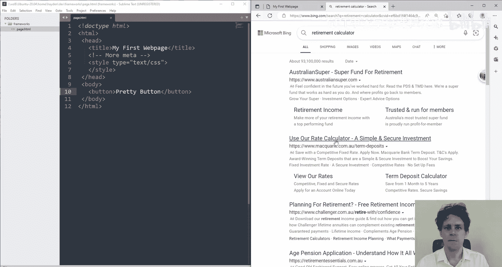

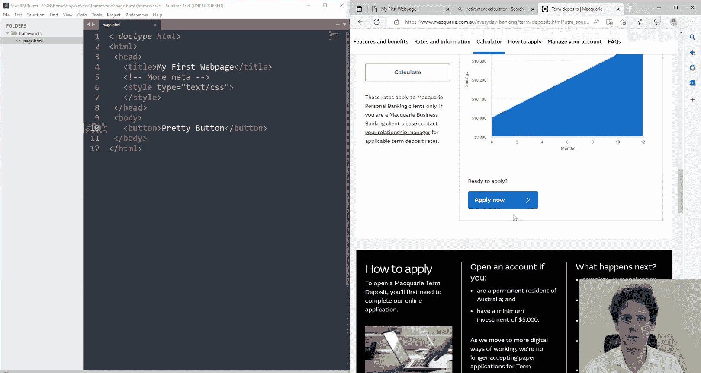

There's no expectation as a web developer that you're meant to go and make all of these yourselves。

 occasionallycca， you come across truly dynamic components that are just so unique。

 you have to make it yourself。 I've been there before， but 99% of the time。

 someone's already solved your problem。 And the way we go about sidestepping that reinventing the wheel is by using a CS framework。

 Now there are many CSsS frameworks out there， but there are two really popular ones that you might be interested in using in your bigger assignments。

 particularly later in the course。 We have our material UI framework。

 which we're going to talk about later in the course。 that's a really popular one。

 and it's something we'll be talking about， particularly with the jascript framework we're doing。

 But the one we're going to explore today is bootsotstap Botap is kind of the original。You know。

 CSS framework， the one that really took things off and made things go really popular。

 really crazy and it's actually a very， very simple idea。

 It's a whole bunch of basic HTML components。😊，That you can write in。

 and like you can add to your code。 They look pretty normal。 but when you then go and actually。

Add the bootstrap library to your page， they all come to life。 So， for instance。

 if you have a look here， I'm just looking through some examples because most of the bootstrap docs just kind of give you all these things like selects and radios and ranges and input groups。

 I can see here that this is a nice little form they've made and I can see that they've got a button here and this button looks pretty simple。

 it says button type equals submit and the class equals button and button primary。

 So that class has that button has two classes button and button primary。 However。

 when I refresh my page know I've got to change my text back to pretty button。

 Nothing really looks any different。 And the reason it doesn't look different is because obviously this web page right now is unaware of what button or button primary is。

 However， if I go just to the main page of bootstap。

 they'll always give you this kind of link that you can add to your head which is essentially a style import In fact。

 this case youre importing style the bootstap style sheet which is version 5。1。3 that doesn't。

Really matter You just copy and paste the link。 And now you'll see that my button is very pretty。

 It's a very pretty button。 And then you're like， oh， cool。 because I have this particular。

Framework installed now， I can go and look up buttons and I can go and see all the different things I can do with them。

 And I can see here that all buttons have a button class。

 but they also have a different element like button success。 So I could go and make a couple buttons。

 One of them like might be， you know button success and the other one might be button warning and I can call this one prettier button。

 for instance。😊。

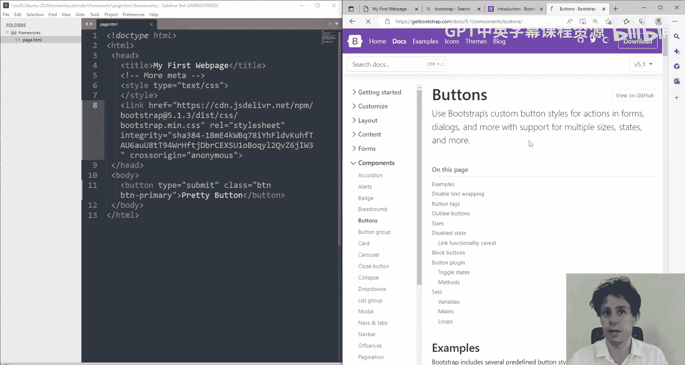

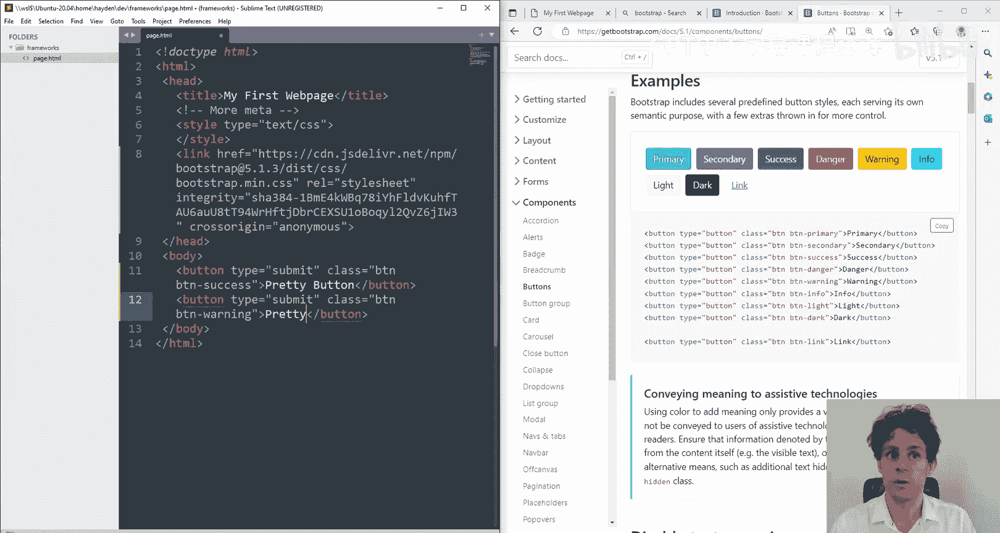

And now I have two buttons on my page， one of them is green。 one of them is yellow。

 they've got those nice little kind of soft interactions。

 I put my mouse over it its's light when I click on it， it does that little。😊，You know。

 kind of shadow a peerie thing there's there's quite a few different things you can do there and you can see there's all this stuff there's like dropdowns so you can have really nice dropdowns instead of those like boring standard ones like a dropdown link。

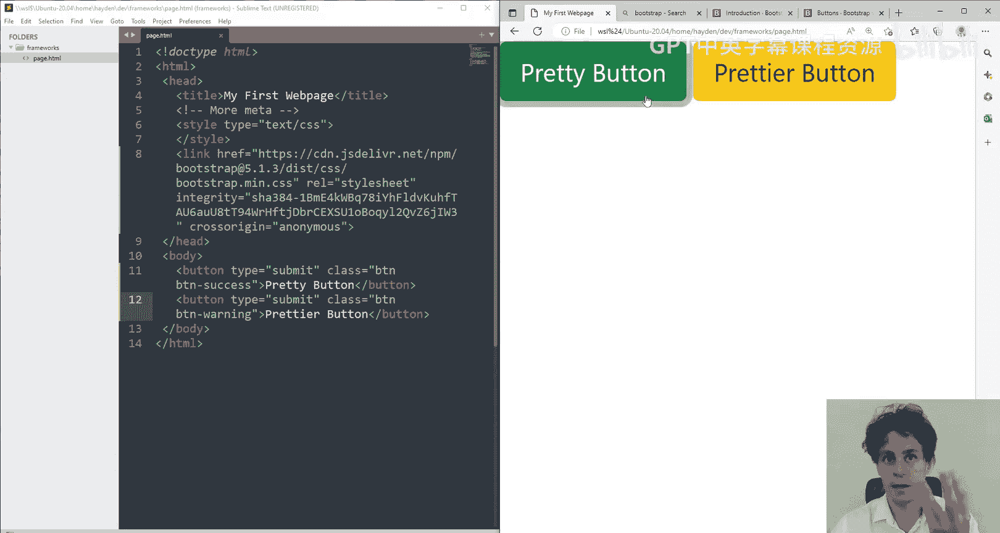

So you think， okay， well， I'd love a dropdown。 You can kind of do anything now that you've imported。

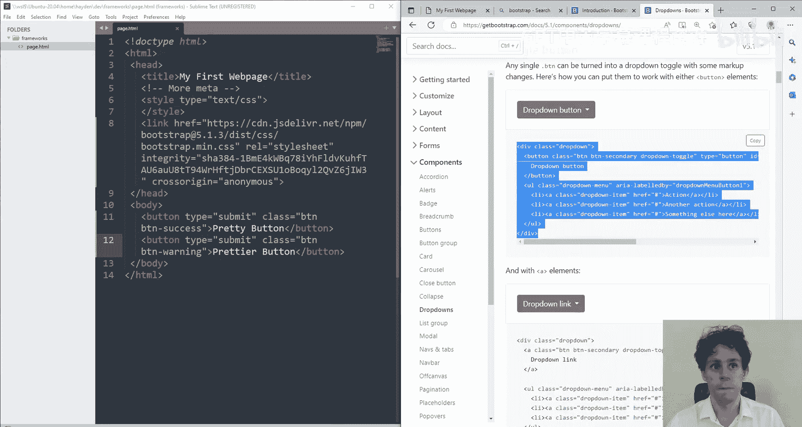

Boottrap。 So， okay， let's see。 what have we got here。 We have a drop down。

 You can see that they've wrapped it in this。 I know it's a bit much。 But yeah。

 they've wrapped it in this class called dropdown inside of that。 There's a。

Button and that button is clearly to click it。 And then there's a unauordered list that appears。 Now。

 how this magic works is quite interesting。 You'll see that。😊。

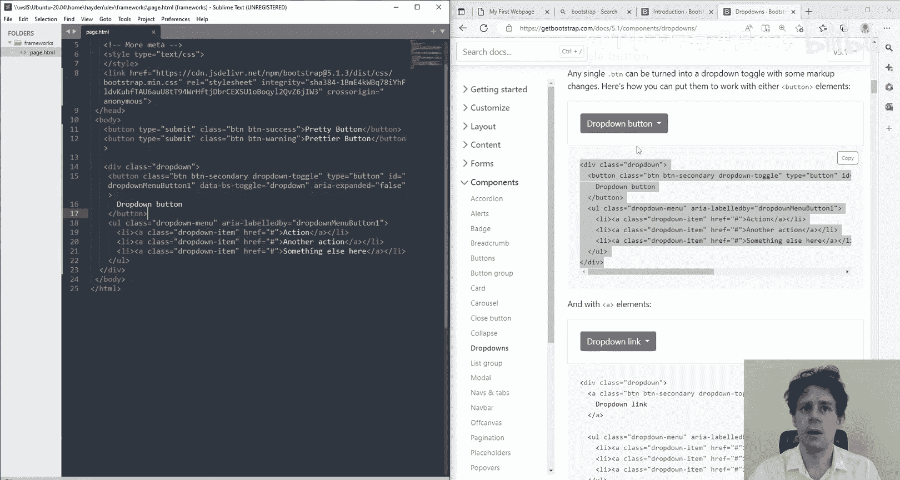

Nothing is happening The reason nothing is happening is because the dynamic components of bootsottap will require you to install。

😡。

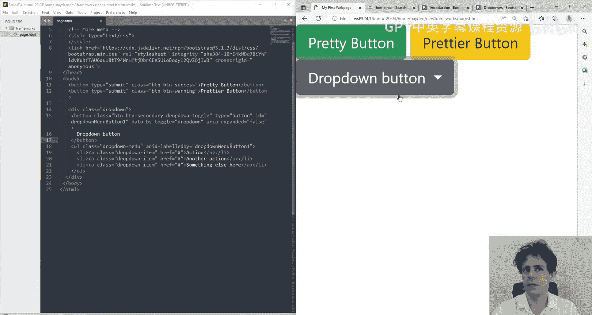

Some extra functionality that runs with JavaScript so quite often if you're just doing simple things like static buttons static elements then just including the CSS is enough but if you're trying to do some things with like dynamism like modals appearing in closing or the dropdowns then you need to include this extra little bit of bootstrap that's the kind of JavaScript engine of it and now you'll see that this does work but that's all you need once you have those two things you can do everything once you have just the CSS you can do most things。

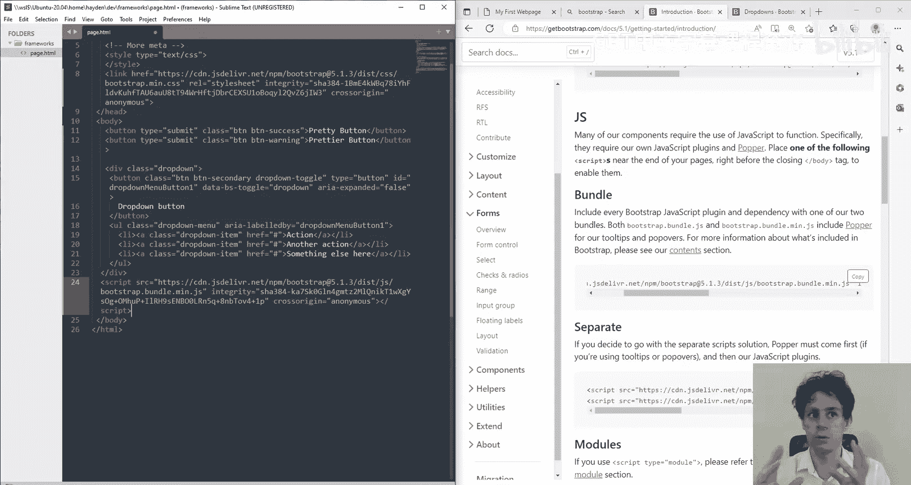

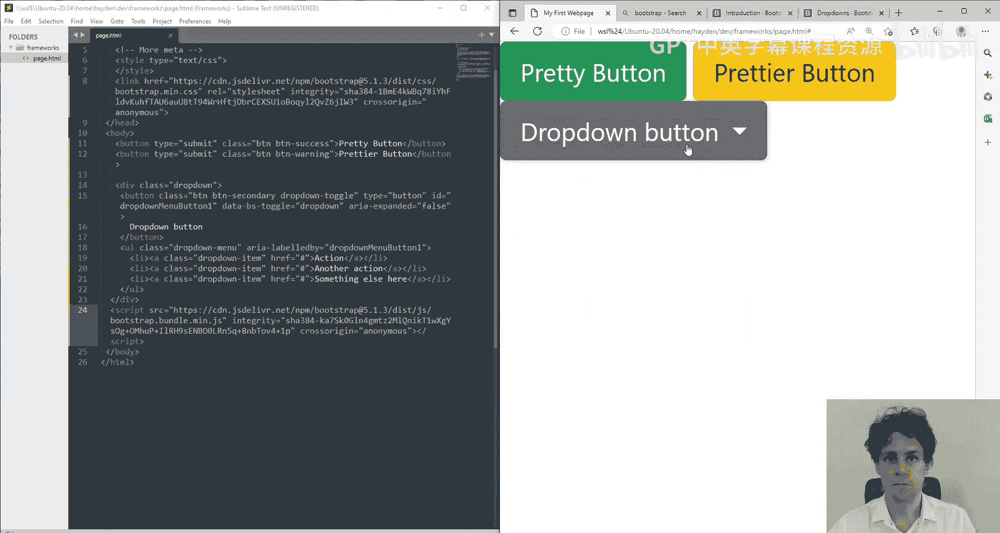

Obviously， in this case， not much happens when you click on it， but if you keep scrolling down。

 there's usually lots of different examples， you could send these things to different links this one is broken up so that there's like a button and then a dropdown。

 you can change the size of it as you can see here just by adding button large as a class。

 So it's a very versatile library because let's say I want to make this button even bigger I just add button large as another class and suddenly the button gets really big。

 or you can make a small button or a dark button or you like the list kind of goes on forever。

 So it's like kind of this big mix and match library。

 it reminds me of when you're building those know there's remember there's like Nintendo mes。

 I don't know what avatars， whatever where you kind pick components you' like yeah。

 this knows and these is and move it little bigger， a little smaller。

 someone's already done all the hard work And now you're just kind of configuring it。

 So bootstraps really powerful just like other libraries to get these components。

 often we refer to them as component libraries。 CSS frameworks is you that's also quite true。

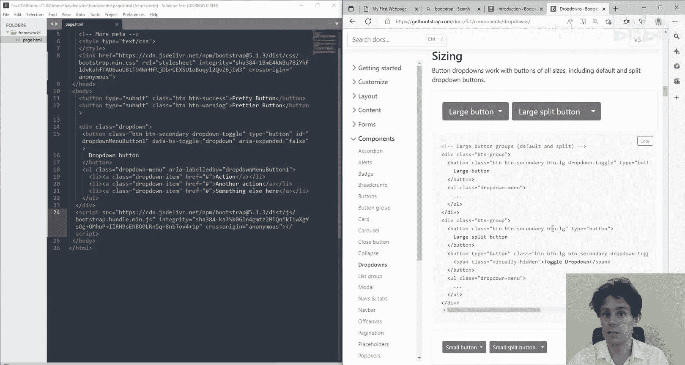

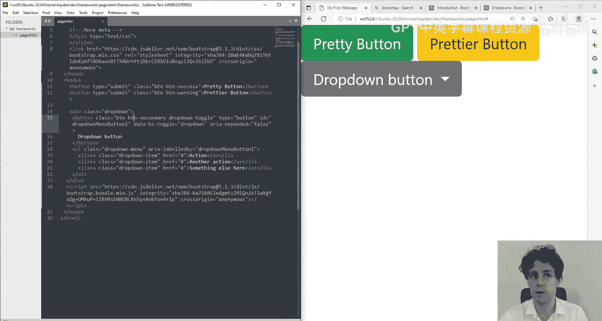

If you use them quite extensively but you might often hear them being referred to as component libraries because they are just a bunch of components but some of the components are pretty serious like you have a navbar component which you can use that does like the entire navbar experience where like you have this drop down so you can kind of build pretty large elements of the website with just that and in fact if you go look at our course website the course website is built mostly using those components these icons come from it's not bootstrap but it's a similar library these icons come from a library like that this layout。

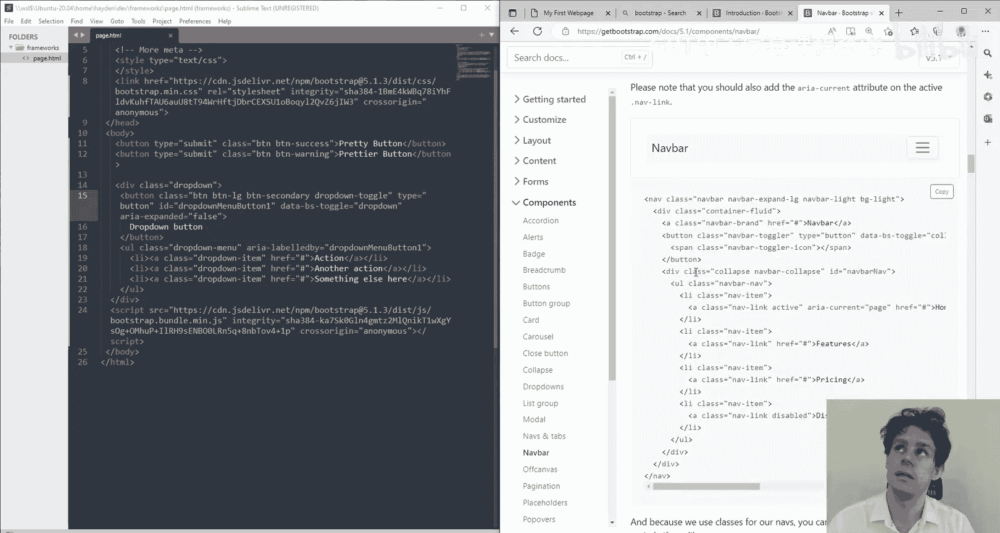

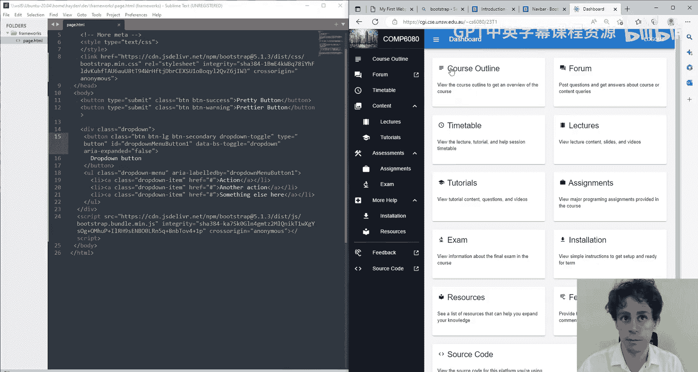

This showing and hiding these expand dropdowns， I didn't build them all those like effects。

 I didn't build them。 They kind of came from a component library。

 This little thing here with the two options the kind of subnv came from the component library。

 So go check out a component library like material Ui。

 There's other ones like semantic Ui Botap is probably the most common if you're just doing really basic stuff。

 I definitely recommend you probably start with bootstrap。

 it was kind of designed to be very basic and it's very easy to use Be go check it out。

 play around super easy to super easy to understand。 and more importantly。

 it will make your either your coding time go way down or it'll make your you know the aesthetic。

 the niceness of the page go way up or if you're lucky a bit of both。 So go check that up。 Thank you。

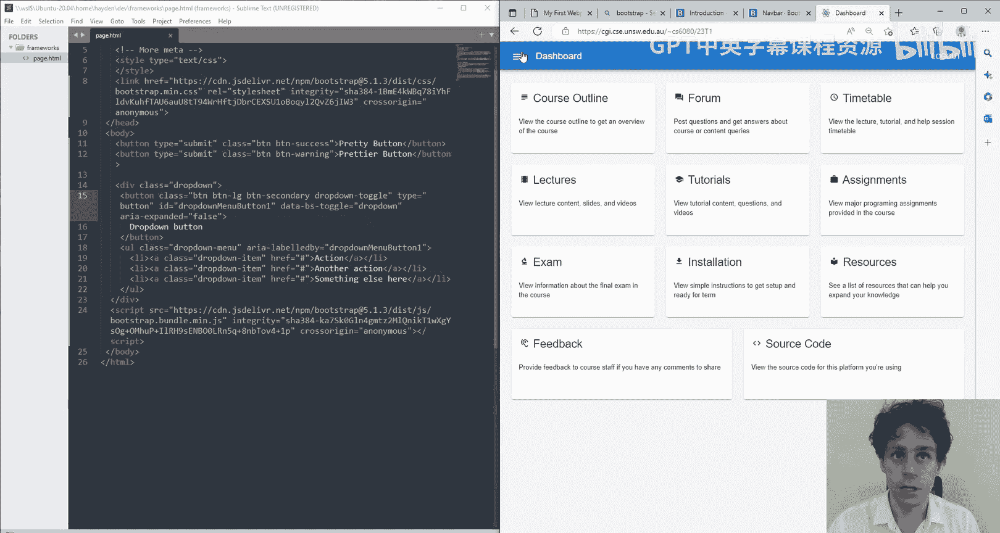

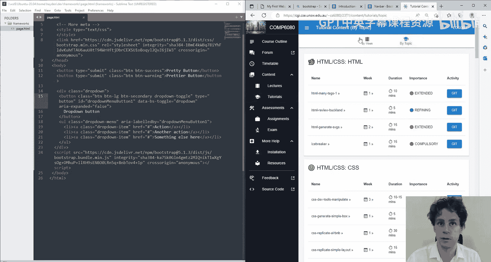

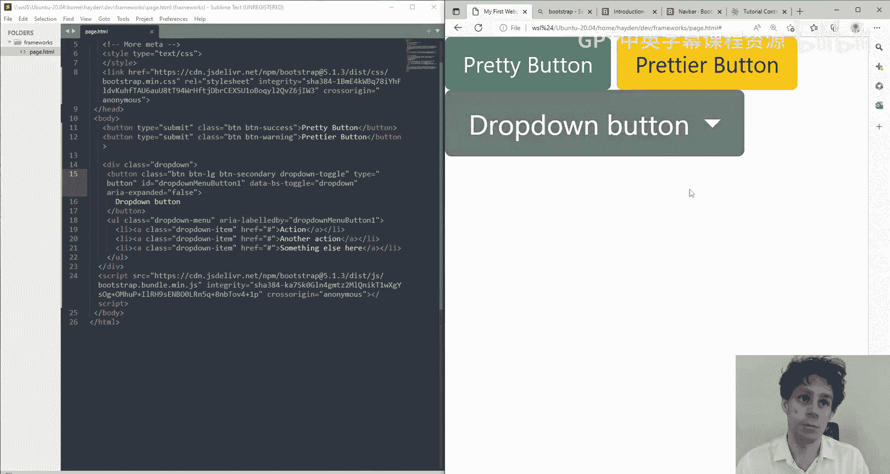

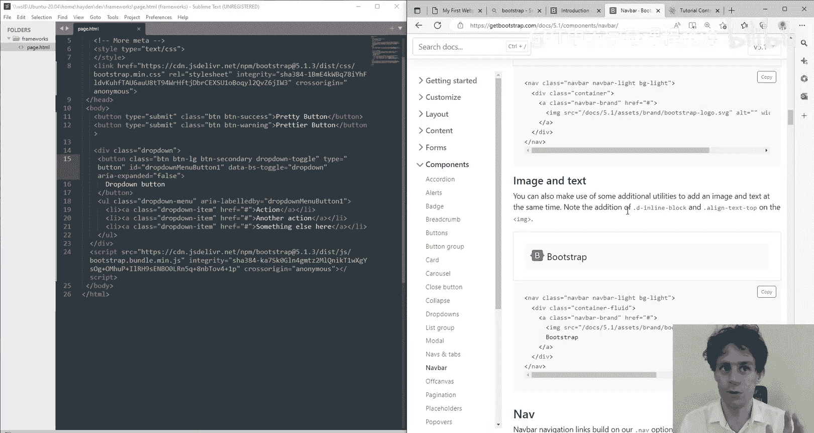