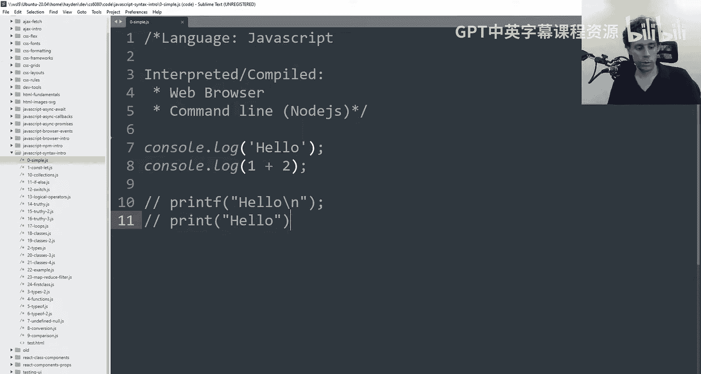
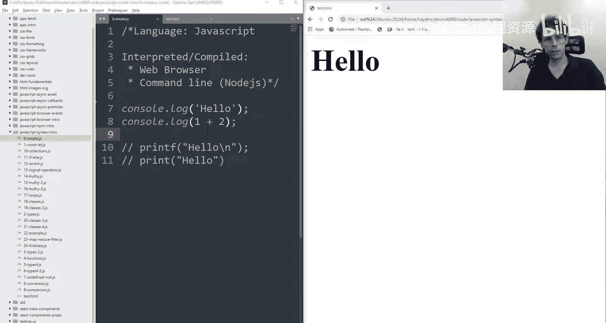
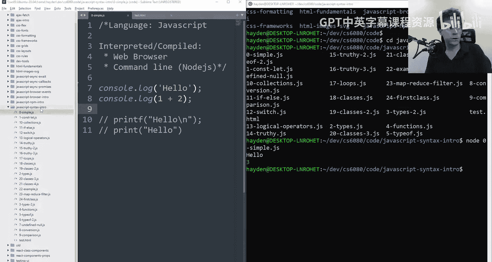
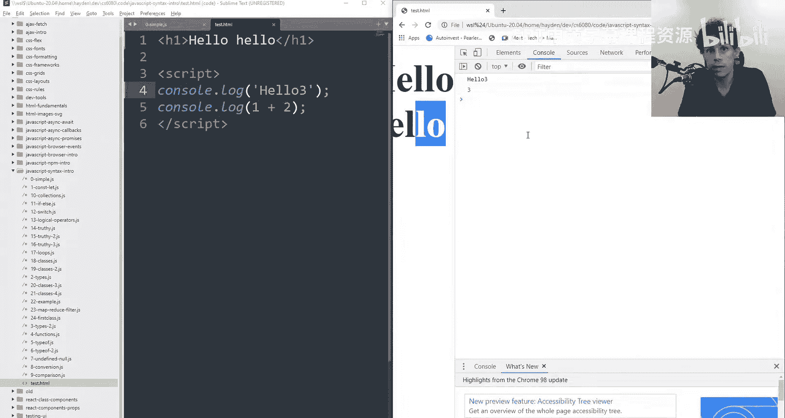
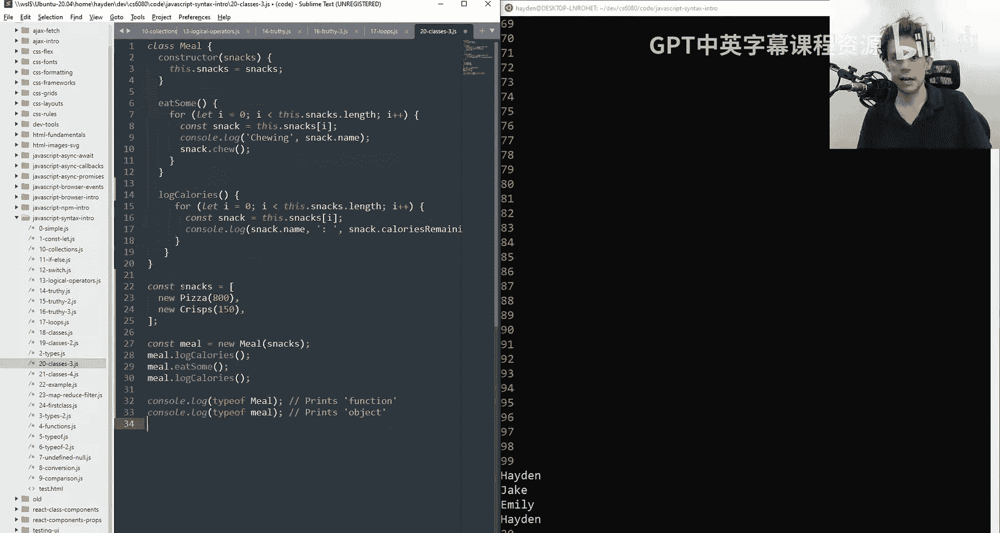
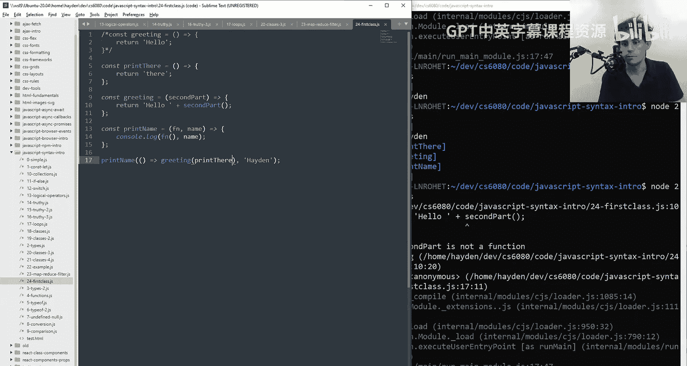

# COMP6080：1：JavaScript 语言特性与语法入门 🐻

在本节课中，我们将学习 JavaScript 语言的基础语法和核心特性。课程内容涵盖变量声明、数据类型、函数、控制流、循环以及一些高级概念，如一等函数和数组方法。这些基础知识是后续学习 Node.js、浏览器 JavaScript 和 React 等框架的基石。



## 运行 JavaScript 代码

JavaScript 代码可以在两个主要环境中运行：Node.js 命令行解释器和 Web 浏览器。





以下是运行代码的两种方式：



*   **Node.js 命令行**：如果你已安装 Node.js，可以在终端中运行 `node 文件名.js` 来执行代码。
*   **Web 浏览器**：在 HTML 文件中使用 `<script>` 标签嵌入 JavaScript 代码。代码的输出会显示在浏览器的开发者工具控制台中。

两种环境下的 JavaScript 语法是相同的。

## 变量声明与基本类型

JavaScript 是弱类型语言，包含字符串、数字、布尔值等基本类型。使用 `let` 声明可变变量，使用 `const` 声明常量。

```javascript
const constantValue = 0; // 常量，不可重新赋值
let variableValue = 0;   // 变量，可以重新赋值
variableValue = "buy";   // 弱类型，可以改变值的类型
```

除了基本类型，JavaScript 还有 `null` 和 `undefined` 来表示“空”或“未定义”。它们含义不同，且不相等。

```javascript
let declaredButUndefined; // 值为 undefined
const emptyValue = null;  // 值为 null
console.log(typeof declaredButUndefined); // 输出 "undefined"
console.log(typeof emptyValue);           // 输出 "object" (JavaScript 的一个历史遗留特性)
```

## 对象与数组

对象是键值对的集合，类似于 Python 中的字典。数组是元素的有序列表。

```javascript
// 对象
const person = {
  name: "Hayden",
  age: 22,
  gender: "male"
};
console.log(person.name); // 点号访问
console.log(person["age"]); // 方括号访问

// 数组
const list = [1, 2, 3, person];
console.log(list[0]); // 输出 1
console.log(list.length); // 输出 4
```

## 函数定义

JavaScript 有多种定义函数的方式。

```javascript
// 方式 1：函数声明
function add(a, b) {
  console.log(a + b);
}

// 方式 2：函数表达式
const add = function(a, b) {
  console.log(a + b);
};

// 方式 3：箭头函数 (现代推荐)
const add = (a, b) => {
  console.log(a + b);
};

// 调用函数
add(1, 2); // 输出 3
```

箭头函数语法更简洁，特别是当函数体只有一行时，可以省略大括号和 `return` 关键字。

```javascript
const double = (x) => x * 2;
console.log(double(5)); // 输出 10
```

## 类型检查与转换

使用 `typeof` 操作符可以检查值的类型。使用 `Number()`、`String()` 等方法可以进行类型转换。

```javascript
const num = 10;
const str = "10";

console.log(typeof num); // "number"
console.log(typeof str); // "string"

// 转换为字符串
const strFromNum = num.toString(); // 或 String(num)
// 转换为数字
const numFromStr = Number(str); // 或 parseInt(str, 10)
```

## 比较运算符

JavaScript 有宽松相等 (`==`) 和严格相等 (`===`) 两种比较方式。**强烈建议始终使用严格相等 (`===`)**，因为它同时比较值和类型，行为更可预测。

```javascript
console.log(10 == "10");  // true (值转换后相等)
console.log(10 === "10"); // false (类型不同)

const obj = { key: 'value' };
console.log(obj == "[object Object]"); // true (对象被强制转换为字符串)
console.log(obj === "[object Object]"); // false
```

## 控制流：条件与循环

条件语句 (`if`, `else`, `switch`) 和循环语句 (`for`, `while`) 与其他类 C 语言类似。

```javascript
// if 语句
if (condition) {
  // 执行代码
} else if (anotherCondition) {
  // 执行代码
} else {
  // 执行代码
}

// 三元运算符 (简洁的条件表达式)
const result = mark < 50 ? "Fail" : "Pass";

// for 循环
for (let i = 0; i < 5; i++) {
  console.log(i);
}

// for...of 循环 (遍历数组值)
const names = ["Hayden", "Jake", "Emily"];
for (const name of names) {
  console.log(name);
}



// for...in 循环 (遍历对象键)
for (const key in person) {
  console.log(key, person[key]);
}
```

## 真值 (Truthiness)

在条件判断中，JavaScript 会将值转换为布尔值。以下值被视为 **假值 (falsy)**：`false`、`0`、`""` (空字符串)、`null`、`undefined`、`NaN`。其他所有值都为 **真值 (truthy)**。

```javascript
if ("hello") { console.log("真值"); } // 会执行
if (0) { console.log("真值"); }       // 不会执行
if (null) { console.log("真值"); }    // 不会执行
```

## 数组方法：map 与 filter

`map` 和 `filter` 是处理数组的强大方法，它们接受一个函数作为参数。

*   **`map`**：遍历数组，对每个元素应用函数，并返回一个由结果组成的新数组。
*   **`filter`**：遍历数组，根据函数返回的真假值筛选元素，并返回一个新数组。

```javascript
const numbers = [1, 2, 3, 4, 5, 6, 7];

// 使用 map 将每个数字加倍
const doubled = numbers.map(num => num * 2);
console.log(doubled); // [2, 4, 6, 8, 10, 12, 14]

// 使用 filter 筛选出偶数
const evens = numbers.filter(num => num % 2 === 0);
console.log(evens); // [2, 4, 6]

// 链式调用：先筛选再加倍
const doubledEvens = numbers.filter(num => num % 2 === 0).map(num => num * 2);
console.log(doubledEvens); // [4, 8, 12]
```

## 一等函数 (First-class Functions)

在 JavaScript 中，函数是“一等公民”，这意味着函数可以像其他值（数字、字符串、对象）一样被赋值给变量、作为参数传递、或作为其他函数的返回值。

```javascript
// 函数作为变量
const sayHello = () => "Hello";

// 函数作为参数
function greet(greetingFunction, name) {
  console.log(greetingFunction() + " " + name);
}
greet(sayHello, "Hayden"); // 输出 "Hello Hayden"

// 函数作为返回值 (高阶函数)
function createMultiplier(factor) {
  return function(number) {
    return number * factor;
  };
}
const double = createMultiplier(2);
console.log(double(5)); // 输出 10
```

理解函数作为值传递和函数调用之间的区别至关重要。`someFunction` 是传递函数本身，而 `someFunction()` 是立即调用该函数并传递其返回值。

## 总结



本节课我们一起学习了 JavaScript 的核心语法和特性。我们了解了如何声明变量和常量，认识了基本数据类型和对象，掌握了多种定义函数的方式。我们强调了使用严格相等 (`===`) 进行比较的重要性，并介绍了控制流和循环。我们还探讨了数组的 `map` 和 `filter` 方法，它们能让你以声明式、简洁的方式处理数据。最后，我们接触了“一等函数”的概念，这是理解 JavaScript 中回调、高阶函数和许多现代框架模式的关键基础。掌握这些内容后，你已经具备了编写基础 JavaScript 代码并在 Node.js 或浏览器环境中运行的能力。