# UNSW《前端编程｜ Web Front-end Programming COMP6080 23T1》中英字幕（deepseek-R1 p21 -21-COMP1531 22T3 - 4.1 - 🛠️ Advanced Functions.zh_en -BV17RXGYuEaM_p21-

So today's lecture is a little bit of an interesting one because we spend some time on this first lecture。

 this advancedance functions lecture。 and then we go and spend kind of a little bit of time on the H TTP server lecture。

 It's pretty much one of the only lectures in the course that。Is broken up。

Across kind of two lecturescause it's quite a large topic， right？ And I'm。

 I'm seeing in the chat already。 we've got people saying， oh my God。 finally more jascript。 Yeah。

 that makes sense。 Obviously， you're very excited。😊，Naturally。

 some of you will come from a first year programming course where it's just been like code。

 code code the whole time。 and you're probably keen to。

 to do a little bit more coding after a few kind of infrastructural topicscause， you know。

 a lot of linting， static verification， a lot of what we talked about last week， in fact。

A lot of week  two and three is not a ton of coding or playing with software。Programs， I guess。

 more playing with software infrastructure， so。嗯。This lecture。

 advanced functions is a really interesting lecture， because。

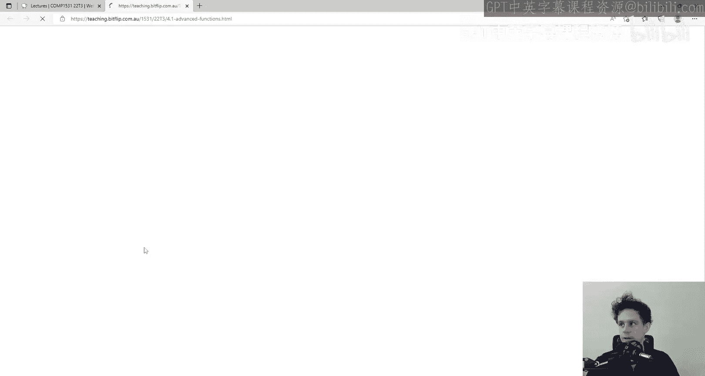

It's， it's one of the new lectures this year。 It's 1 I wrote。 It's probably。

 it's probably the lecture， along with static verification that got the most time。

 This one probably is one of the most kind of effortful lectures this year。

And it kind of has two parts to it。 One of the first parts is that higher level languages like Javascript actually have these really powerful ways that we work with functions。

 and they're not really evident in fairly classical programming languages like Java or C。

 They're a bit more evident in languages like Java and Python。

 some of them more like functional is languages。 So it's really important to teach concepts like first class functions and higher order functions and callbacks for some languages that are event driven like Java right So these are all these are all kind of useful and important things。

 generally just for education。But it also has kind of a second benefit。

 which is that there are a lot of subtleties around the different ways you can actually work with functions in jascript that you've actually been exposed to。

 but we've kind of glossed over in a sense。 So it's very important for us to explain this to you so that ja' is a little less confusing as well。

 A lot of code in this lecture。 Some code we won't run necessarily'ca it's easy to talk about。

 And like running it like it just runs， you know， there's like not not a ton to it。 but you know。

 we'll see how we go。 so。Firstly， in Javascript。And this， this slide actually kind of summars like。

 you know， a whole bunch of the lecture。 there are。

 there are three different ways to define a function。The first one。

 method 1 is the one that we've talked about the most。

 It's the one we've been using in lectures when， when we write code。

 we've been using method 1 in the lectures。 and it is， it is basically。What， you know。

 we consider to be the like old school method。 It's the way that jascript was invented。

 It's the way it's kind of always worked， which is where you write function and then the function name and then everything in parameters。

 It's very similar to the C style function definition， except instead of a data type there。

 because jascript is a loosely typed language， you just write the word function。Method 2 came about。

 I don't know when。 I don't know， like。I don't have a strong history of。You know。

 the JavaScriptscript language standard， but Me2 is an interesting variation of it that I'm not sure if it was there from day one。

Which was to say that， rather than actually define some like a function。

Let's actually define some like it's a variable and make it equal to be a function。

So in the second case here， we actually just say cons sum。

 and at this point here it's as if we're defining a variable right。

 but we let it be equal to this function definition。And in a way。

 it's kind of just a rearrangement of syntax。 You know。

 like you're taking the sum that was previously here and you're just kind of moving it to the front and the constant is appearing。

 So again， the exact same thing， but the pattern of how we approach it is different。

 We say that a variable is equal to this function。 And the function doesn't need a name in this particular case because obviously。

 you know， it's getting captured by the sum name。 But exactly， exactly the same approach。

 And then method 3， which is a definitively modern method， is a。

Kind of a summary version of method 2。Where we still say con sum is equal to this function。

 It's just that what we do is we tweak the syntax a little bit so that instead of saying the word function。

 we get rid of it。And instead， we also put these little equal。Greater than signs。

Between the parentheses and the brace， right， these are all three different ways。

That you can go and define functions。You know， there's a good question from Matthew about where would you put the export still before the function or before the con。

It's pretty much always at the start of the line。 So in method 1， it's export function。

 and in methods 2 and 3， it's， I think it's X， we can try it out。IThink it's export。 Yeah， I mean。

 it， it's export count' sum， I believe yeah。嗯。So method 2 and 3 are similar。

 and they're both doing something interesting， which is like a bit of a tenet of this lecture。

 which is they're treating functions like variables。 Mo3 Me 3 is a bit more modern。

 and that's just based on the fact that it's a little bit tighter in the syntax。

 And it's something you'll actually see probably used most universally to be perfectly honest。

You know， so。That's the one we're gonna probably see a bit more of in the course。 But to be honest。

 most of the coding I'm gonna to do in the course is gonna to be method 1 or method 2，3。 Sorry。

 not method 2。 Don't do a lot of method 2 anymore more。

cause method 3 is just like a tie diversion of method 2。If we actually go。A little bit deeper。

 though， when we look at Typescript， you'll see that it is pretty much identical。

 Some of these lectures have jascript code。 Some of these lectures have Tyscript code。 In this case。

 you can see that the type scripts code type script code is exactly the same。

 It's just that it has the type annotations on it。 doesn't really matter。

 So this is a somewhat a broadly typescript， independent lecture。

If we have a look at method 3 for function syntax， which probably made sense so far。

It actually has another benefit， which is why it's kind of a popular and modern way to define functions。

 This other advantage is that if and only if the function body。For， you know。

 this function function definition style is a single statement。 We say single line of code。

 but like it can be multiple lines of code。 It can it's more like a single like code piece to execute。

 but think of it like a line of code。 You can actually drop both the braces and the return keyword and get a condensed function definition。

 like this one over here。Right， so instead of saying， you know。

 con sum with parameters A and B is equal to a function that has， you know。

 all it does is return the sum of a plus B， we can define the same thing。

 constantt of sum is a function that takes in parameters A and B， and it returns a plus B。

 So if you see something where the the definition， the body of a function doesn't have braces。

 and it's just a statement that's actually just a shorthand way of saying return that thing。Right。

 it's very， It's very kind of sneaky that way， I guess。

So that's that's the other benefit of the third syntax。So let's take， let's take a look at this。

 As another example， you might have previously with me。

Written a function that looks like this function many string。 You're gonna repeat a number。 Well。

 you sorry you， you got a number for how often to repeat a string。

 this function we've looked at in a previous lecture。 So I'm not gonna go over it。

 You could probably pause it and go back to another lecture if you want。

 But it just con log something at the end。 So the question is， how can we。You know。

How can we actually deal with。This in a shorter， in a tighter method。

And when you get left with what you get left with something like this， If you can't see this。

 you might need to go to 1080 p or probably 7，20 ps。 Okay， but you'll see that it's very。

 very similar here。 This is this is using method 2。

 where instead of saying function many string where saying cons many string is equal to function。

 That's the only difference between these two methods。

And then we could take it even further and have a look at the third method where we just。

 instead of the function。We drop the function， and we instead insert the equals greater than。

But really， really similar， all three are basically the same。

 It's really just that opening line that changes between them。 Are there any questions so far。

 This is a very interesting topic。 So questions are super appreciated if people have them。

I'll do a really quick pause for it。Goats asking a question。

 Are we working in TypeScr or JavaScript from now on？

As of your week  five project and your week five labs。Sorry。

 as of your week five project in your week four labs， we're going to be doing everything in Typecr。嗯。

So， you know， yeah。Daniel says we're waiting to see the differences in action。

 There's nothing really to see in action。 I could just run the code。

 but they are pretty much identical。 This is the foundation for some more important stuff。

 So code differences is fairly trivial。 What this gets into is an important topic。

 And this is true in all of computing， right， pretty much most programming languages have this idea is what we call first class functions。

 And first class functions are a way of defining functions。😊。

That teach us that we can treat functions similar to how we treat variables。

So if you look at the variable definition on the left， pretty standard standard jascript。

 this is how you would have thought about things the whole life you've been programming you know。

 variable name equals something console log， print or， whatever。 The second case。

 when we use method 2 or3 or in this case， method 3 of defining a function。

You can see that by treating it like a。A variable visually。

 it starts to make a bit more sense how we can console log it， because。You know。

 strings of variables， functions of variables。 Everything's just a variable。

 So we can kind of universalise how we think about names， names and jascript is， in you know。

 the name of a function or something else。 So first class functions are a feature。 You can Google it。

 right， first， first。

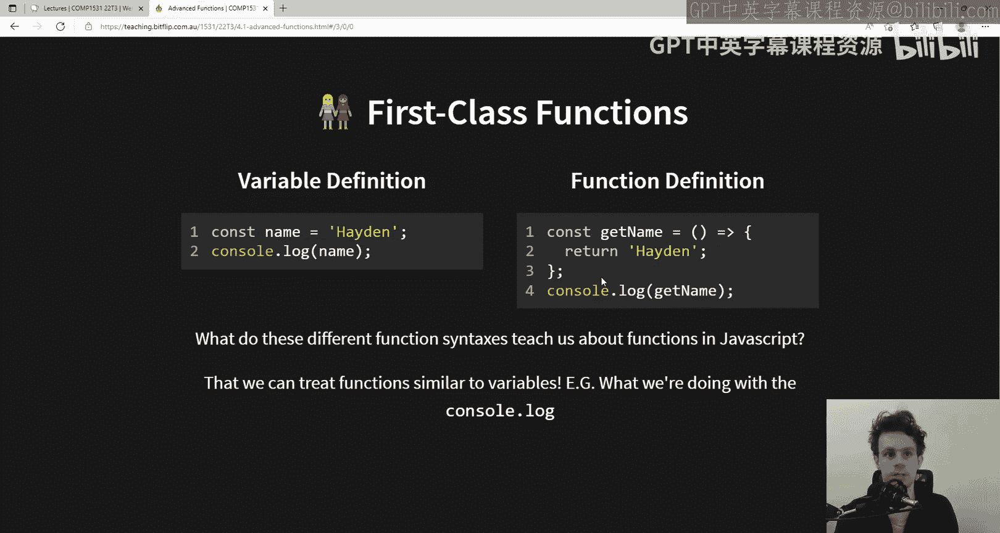

First class function。 First class functions are a language feature where they treat functions like first class citizens。

 which is where they treat it like any other variable。 Right， So first class function。

 a programming language is said to have first class functions when functions in that language are treated like any other variable。

 right， For example， a function can be passed as an argument to other functions can be returned by another function and assigned as a value to a variable。

 Right， So this's showing some ja here。UmYou know， old school stuff here。

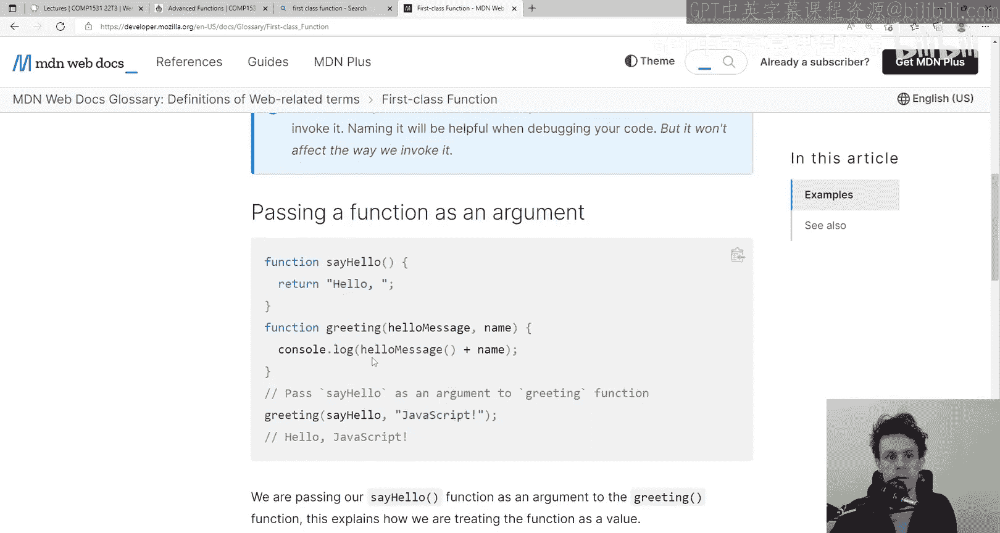

And this isn't really related to the syntax necessarily。

 The syntax is just a starting point to help us understand why， you know， why this change existed。

 but。We need to go in thinking that， you know， Javascript is a bit different。

 and we can pass functions around like variables。 This was not something you didn't see。

 You would rarely pass a function as a。Like a function into another functions parameter list。

 And we'll see an example of this here。 I've just defined this already for you。

 So nothing to define there。 But let's have a look at a piece of code like this。

 So I'm just gonna open up our editor like we look at every week。

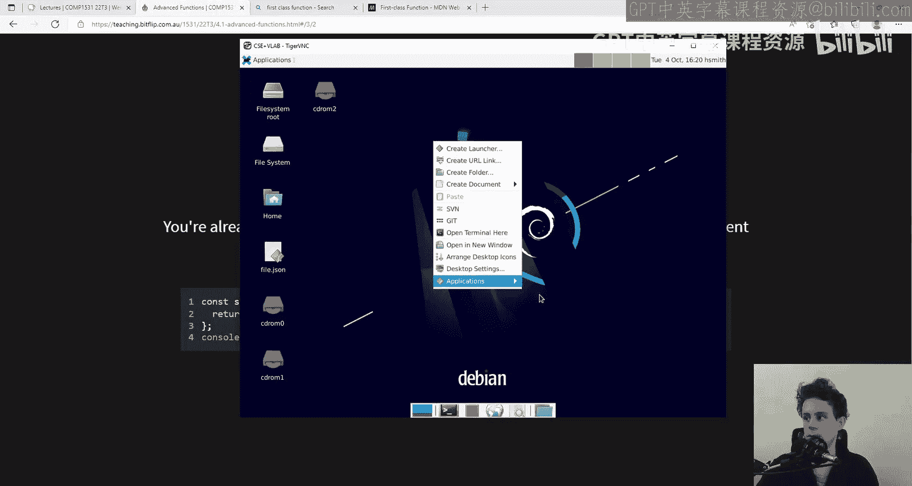

Right， we'll go inside of our 1，5，3，1 lectures， and we'll go inside M2。

 Everything for the rest of the courses in this folder。

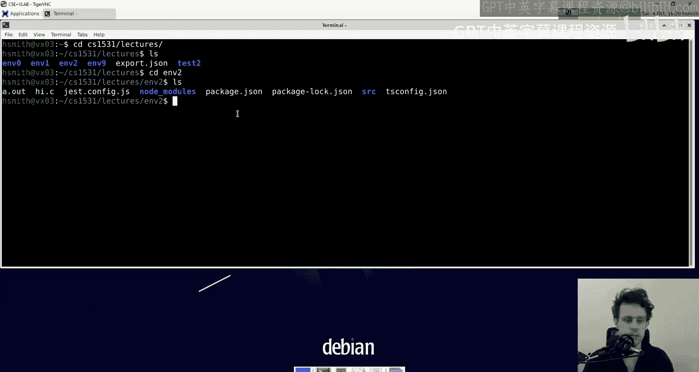

See， close， close， close， close。

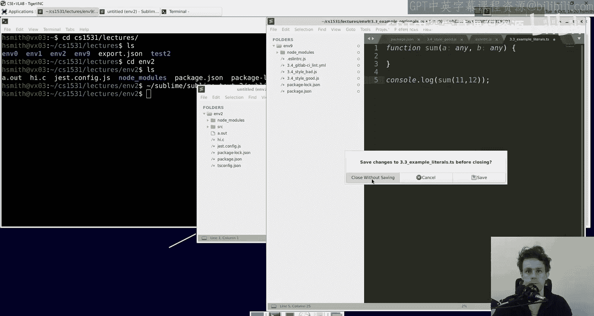

A lot of stuff。Right， so we got this here and we are going to have a look at a particular file in that particular file。

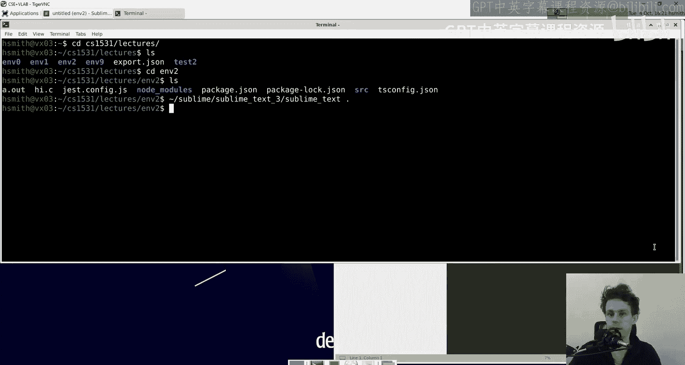

Is FF FF stands for first class function v。 So if I look up F F v， I've got this file here。 now。

 pretty simple， I'm using the third method of function definition。

 say hi is a function that takes in a name。 that's a string。 It returns Hello name。

 and then I console log it， I call it NP PMM run T S node because to run a type script thing。

 We need to use NP PMM run T S node。 And then I give it the file， which is 4。1 FF。

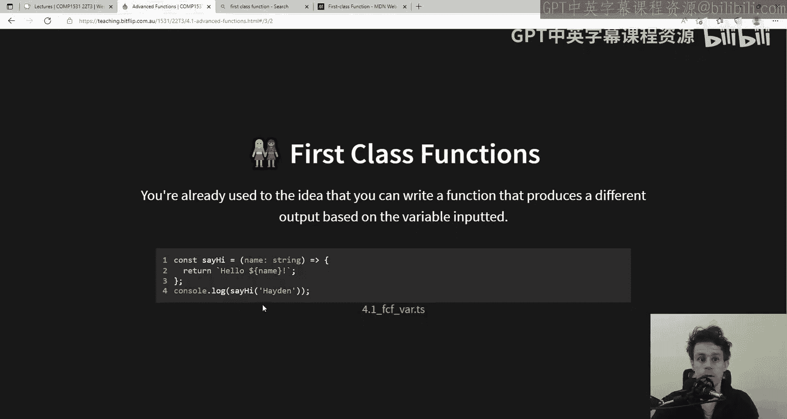

Bars should run fine。I think。Yeah， okay， cool。 So that runs perfectly fine。 Now。

 where something gets more interesting is where we start to play around with first class functions。

 And again， this is slightly unrelated to the syntax we were looking at before。

 But it's more showing you how you can start passing in functions as other functions。

 Let's have a look at this code。 So if I， what was it called， What it called atomic， okay。😊。

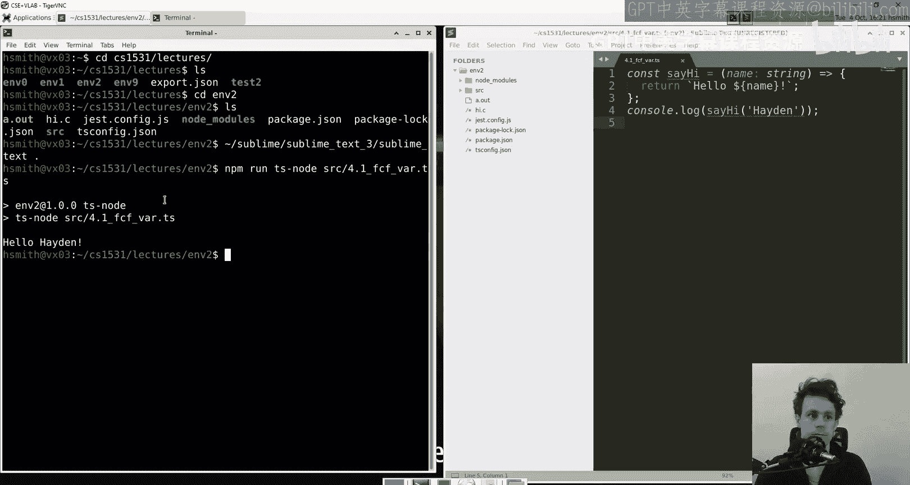

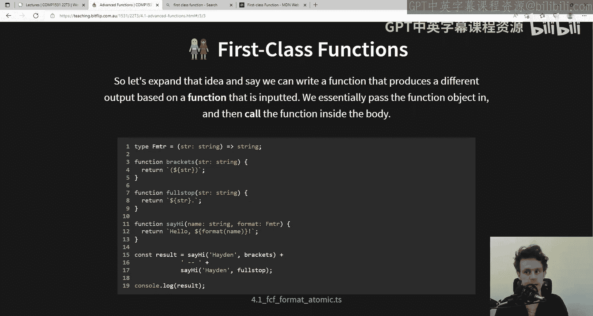

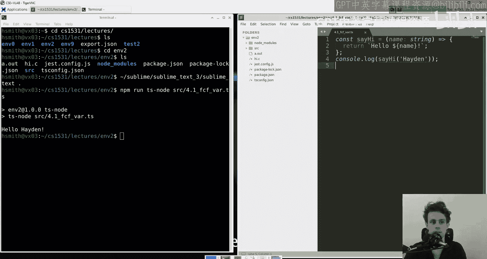

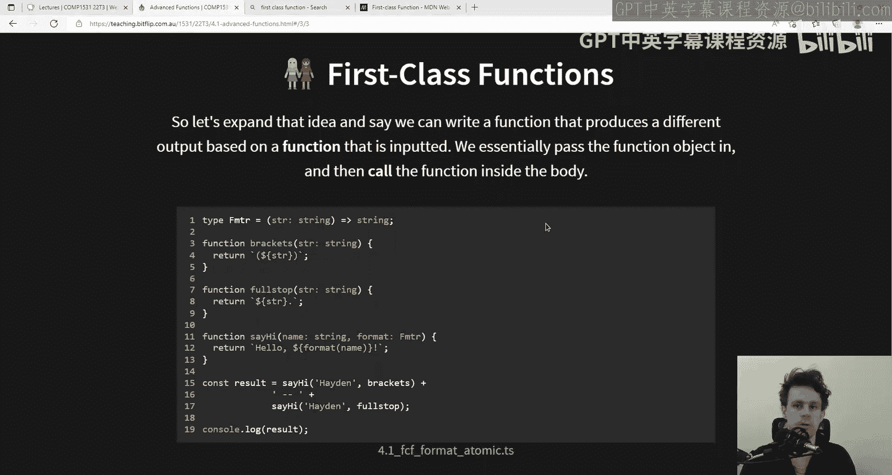

Format atomic。So this piece of code here， let's kind of deconstruct it for a minute。

 Let's forget the type at the top for a minute。 We can kind of come back to Typescript。

 We've got a function called brackets， and that function takes in a string。

 and it simply returns that string with parentheses around the front。

 We have another function called full stop。 takes in a string and it returns that string with a full stop at the end。

 We have another function called say hi。 And this is where things get really interesting because what say hi does is say it hi takes in a name。

 which is a string， and then it takes in a function， which we call format。😊，RightNow。

 just for simplicity， let's make this any for now， right， Maybe we don't know what type it should be。

 We don't know what the function type is in jascript。 maybe we could write function。

 but we start with any。 and what say hi does is that say hi prints hello and then it prints the result of calling the format function with the name So it's like a little bit of like function inception because you have say hi which the function but it takes in another function and then it calls that function within itself。

 and how we're actually using this overall as we're defining a variable called result which is simply the concatenation of say hi Hayden with the brackets function and say hi Hayden with the full stop function and then it's got another string in between just for formatting sake but say hi as a function call。

 I'm calling that function twice and in the different instance is in one instance I'm actually passing it another function as a argument and in another case。

 a different function is an argument， which is brackets in full stop。

 and we get this really interesting result where when I run。没。あ呦。I will get Hayden in brackets。

 right， Hello， Hayden in brackets， and then hello， Hayden with a full stop。You know。嗯。Now。

 this has always been the case in jascript。 It has nothing to do with function syntax。

 function syntax was just a little bit of a preface that'll make it'll come kind of join us in again soon and show you like kind of why it came about because this is a very standard way of doing things in jascript。

 but this is an example of the use of first class functions because we are treating full stop and brackets like they are a function。

 This is something you probably wouldn't have done in C。

 Mattw says when calling the bracketen a full stop function， the result function。

 do we need to add the parameter parameters。Okay， so what。

What I'm understanding Mattu's kind of asking here is。Do we need to go。

Pass in the parameters like this。You know，ca brackets is a function and brackets expects a string。

And the answer is not really because when you call a function， like if， let's say， for instance。

 you had， let's make another function called high。And all this function is gonna do is。You know。

 return D like this。And it's just daisous string。If you were to call high here。Like that。

What you're actually doing is that the second argument of this function is actually a string because you've called high with parameter A with argument A。

 and it has returned a string at this level， and then that is getting replaced with the result of that。

 which is a string， whereas if you just passing in high， you're not passing in a string。

 which is the result of calling high。 you're actually passing in like a pointer too high itself。

The type is， the type is not the return of the function。 It's actually the function itself。

 You're kind of like it's like handing it off right。 It's like saying， well， here's a function。

 I'm not gonna to use it， but here it is。 you can go and use it to the person inside。

 And then that person inside will come in and go， well， okay， say hi， okay， I've got a name。

 I've got a point to a function or a reference to a function。 And then I can call that function。

 So in the cases here where you know we have brackets in full stop。 As far as say hi is concerned。

 say hi gets called with Hayden and then brackets like that。

So then when it's actually doing its processing， it replaces the format with brackets and it replaces the name with Hayden。

 So essentially， what say high ends up executing in that first instance is just。

A function that returns hello。To a brackets called a Hayden， That's。

 that's all it really ends up doing。 It's just by kind of parameterizing the function。

 We allow ourselves to like reuse this function as much as we want。

 So I can have a function now that's designed to say hi to someone。You know。

 and it just works like that。 And the reason this is important。 The reason I。

 the reason this lecture exists is because classically without kind of getting into some function pointy stuff or whatever。

 the only way you might normally previously do this is to actually create two functions called say hi brackets。

 which takes in a name string。That simply returns this with a bracket's call， right。

And then you might do the exact same thing for full stop。Right， you might be like， oh， yall do that。

For a full stop， too。Yeah， easy done。 And then you just call them separately。

 So here you just call say hi brackets and say hi full stop。

 And maybe you can reuse some logic and stuff。 So we're not really solving like a fundamental。

Problem here。 you know that this doesn't enable you to solve problems you could not previously solve。

 But what it does allow you to do is to start building slightly more maintainable software because you can more elegantly reuse your logic。

Because， you know， and， and you get this， you learnt this with functions， right。

 Like functions as a concept back in 1，5，1，1 or a way to say。Wow， you're doing this operation。

 which you want to be able to work on a whole bunch of variables that might all be strings。Okay。

 let's define it once and then reuse it。What we're doing。

In a first class function language like Javascript here is the same thing where saying， hey。

 you want to do an operation。That is always the same procedure。

 and you want it to work on a whole range of functions that take in a string and return a string。

Let's just define it once and reuse it。 exact same thing。 So it's。

 it's really not a wild idea if you think about it at all。嗯。One of the interesting things， though。

 is that because we are with Typescript， we do actually have to be very careful about how we define the function type。

 because what we what we define the other day were very simple types like strings and booles and stuff。

 But the way you define a function in Typescript is actually ironically。

 is very similar to how you would define a function。

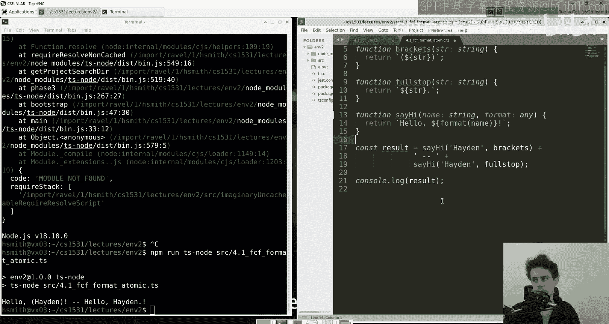

Just in like。Defining the type for the function is very similar to defining the function itself。

 so I can actually make a type here called like format formatter。

 FMTR or something I made up and you actually say the type of that is actually a function that takes in one argument that's a string and it returns a string。

 So that's actually how we can type functions。In typescript。And you'll notice that。

It's like the third method of syntax here。It's what we saw back。Early on。Here， you know。

 with the this particular thing here。And in fact， it's it's not only that， but it's。

It's even more of it in a way， because。

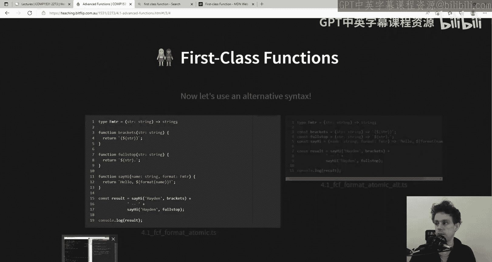

It's using the shorthand syntax。I've never tried it。

 I've never tried it without the shorthand syntax， so let's just first run this again to see if it works。

And here I could let me try it。 Let me see what happens if I just say return string。

 It probably doesn't even work。 I've never tried to do it。 Yeah， like。

 I'm pretty sure that's just not how typescript，ca you always have to return a thing， right。

 like a thing。 So therefore， like the typescript function type definition is quite narrow and straightforward。

 It's just return a stringcause you're always just returning a type。

 So that's actually how you do it。 So this is the reason we kind of talk about these other fun function syntaxs at the start because it's a bit of a tight way of doing it。

 Daniel says， what kind of function type would you give functions full stop and brackets。

 So that's really interesting because。😊，You don't really need to give them a tie because Tscripts very smart。

It looks at this。 And it's like， I know what this is。 Like。

 it's not that you're giving the functions a type。It's that you're giving the parameters a type。

 right？ We gave it a type string because we give it a string。 you know。

 both of these cases of strings。 In this case， we said to the say hi function。

 I am going to give you a function as a type。 And it's like， I don't know what a function is。

 function could be anything。 could take in anything could give anything。 So in those cases。

 that's where we need to be more explicit to actually help it out there。😊，Now。

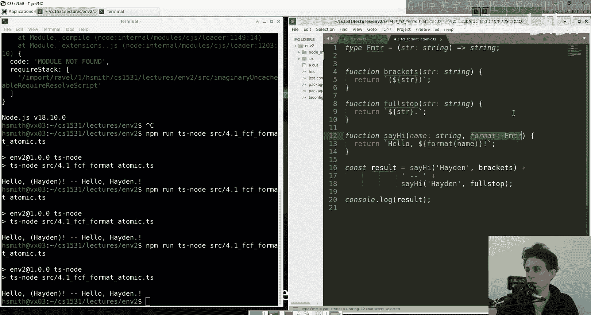

What is interesting， as we'll see on the next slide is that we can actually start using our newer function syntax to clean this up a little bit and to tighten it up。

 The real benefits of the tighter， more modern Java function syntax come into play when we are dealing with very small functions like we are here。

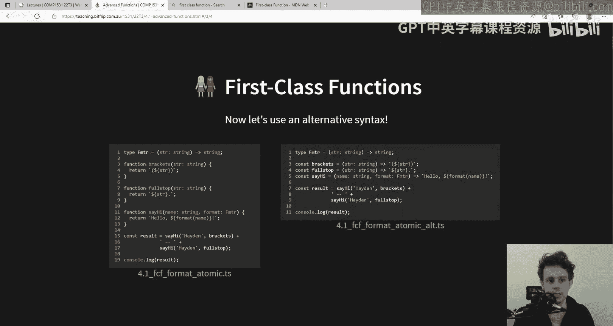

What I be by that？H sorry。Is what do we know。We know that we can replace our kind of method  one functions。

Here， with our method2， for instance， to start， which is to instead say function brackets。

 we say con brackets equals function。So that's moving from method 1 to method 2 there。

We can take that a step further。And actually say， well， Me 2 to Me 3 is dropping the function word。

And putting the equals greater than at the end of the between the parentheses and the braces。

It's like cool。 Okay， we've shortened that even further， great。And then obviously。

 we can take it another step further， which is to say， well。

 what do we learn about the third method of of， you know， concise functions， Well， in those methods。

 if you have a one statement function， you can。Reduce it down to that single statement。

 You can drop the braces and the return。And you can create something like this。

So now suddenly we have a very straightforward set of functions where we say， actually， hey。

 brackets is a function。😊，That takes in a string， a variable called STR， which is a string。

 and it returns this value。 Typescript can figure out what type that whole function is。

 because everything there's inferenceable。And same for the full stop function。

 And then the say hi function， well。Same thing。We just had to define the type of the function that was passed inca it had no idea otherwise。

 right， So， again， very tight syntax。 This is an example of using first class functions。

 And we'll look at another example there， yep。

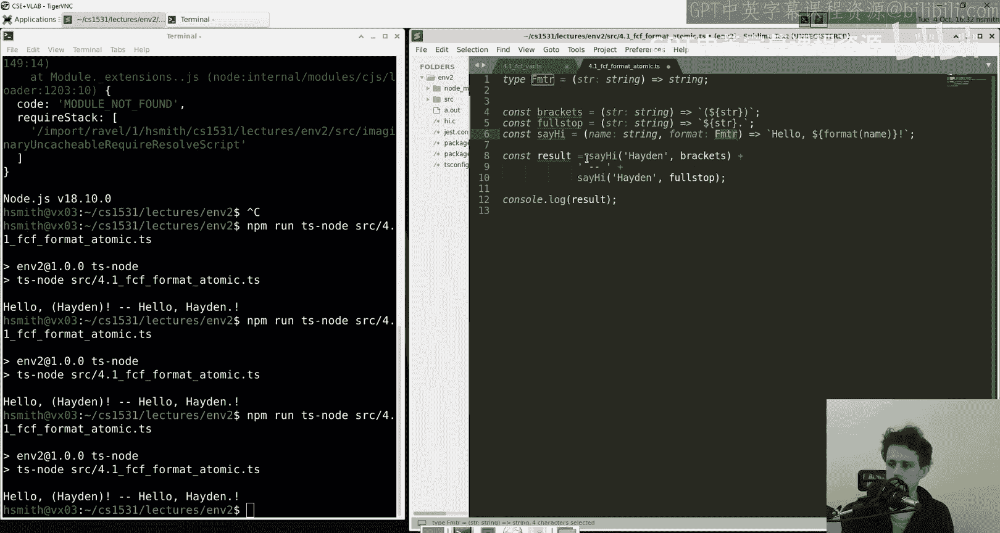

But again， just before I jump on to the other example。Check that out。

Any questions about that just before we move on。

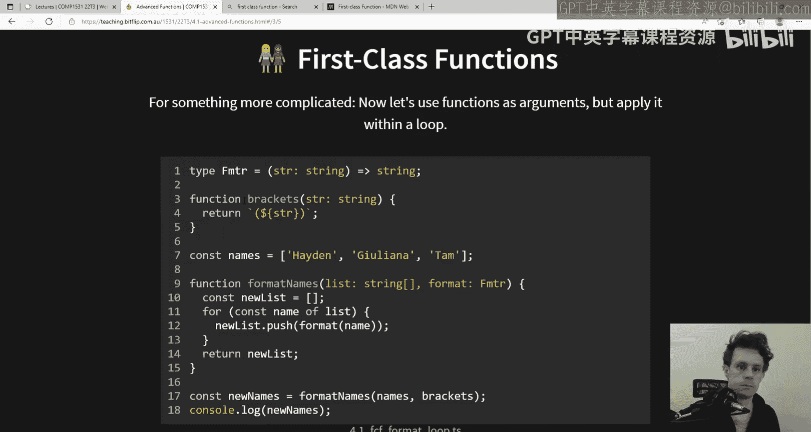

Got another fun example coming up。 Let me just get that ready。Okay， so。Another function， format loop。

Right。Let's have a look at what this does for a second。 Okay。

 so I've got another type called formata。 Okay， it's just a simple。

 It's a type that defines a function that takes in a string and returns a string。 Okay。

 we've got a function called brackets like the other file Make sense。

 We have a variable called names， which is Hay and Juliana and Tam， okay。

 We have a function called format names。 Okay， I have to read this a bit more carefully。

 that takes in a list which is an array of strings。And a format function， which is a。

Function that takes in a string and returns a string。 Okay， so this is the use of a first class。

 This is like first class functions in action here。

 Someone's gonna be passing in a function into this function。 I create a new empty list。 Yeah。

 I then go and loop through all the items in the list of strings that was given。

 And then for each item in the list of strings that was given。

 I kind of apply a function to it and return。Push that value into the new list。

 So it's basically like， it's something that we'll talk about in a few slide down the line。

 But it's actually basically a， a mapper。 So what it does is that， you know， you give it。

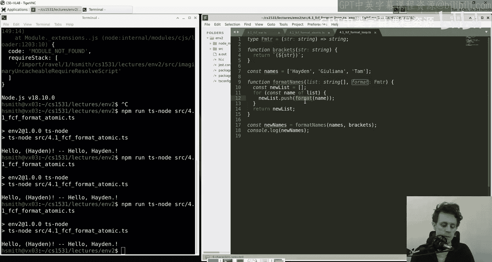

You give it a few things like here， here， here and here。

And maybe its job is to make them all wider or something。 Not literally， this is an abstract example。

 So the function kind of run comes in， and it grabs this one。

 and it goes to make the wider version of it， grabs this one。 And it's like pushing it to a new list。

 So it's like a way of iterating through an old list modifying everything slightly and then pushing it to a new list。

 So it goes through and formats all the names。 So that when we give it a list of names。

 let me move this line of code down here， that's probably a better spot for it， to be honest。

 when we give get this names。 And we say， well， let's actually format the names。 Here's the names。

 And then here's the function that I want you to apply to each name。😊。

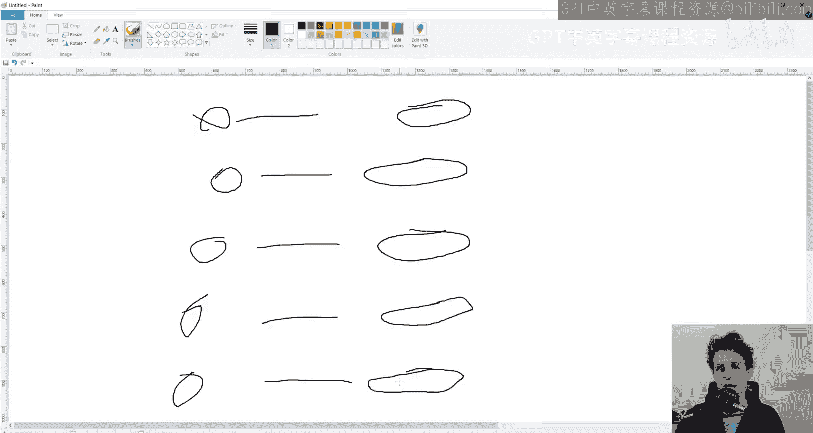

Right， it'll actually return me a new list。 So now what'll happen is if I run that MPM run T S node。

Source 4。1 FF format loop。Dot T， S。It should print out Hayden。

 Juliana and Tam in brackets in a list like that。 And this is really cool because what I can do is。

 for instance， I can go and create another function， which maybe， let's say， like， let's you know。

 all caps or something。😊，It takes in a string。 And know what it does。

 it simply returns that string to uppercase。Right， that's all it does。And now。

 instead of using the brackets format。All caps。 instead of using the brackets format。

 I can just use the all caps format， Pass that function in。 And now everything is gonna be uppercase。

So again， very helpfulcause I could just change what variable I pass into the function。

 It's just that variable happens to be a function， which is very cool。😊。

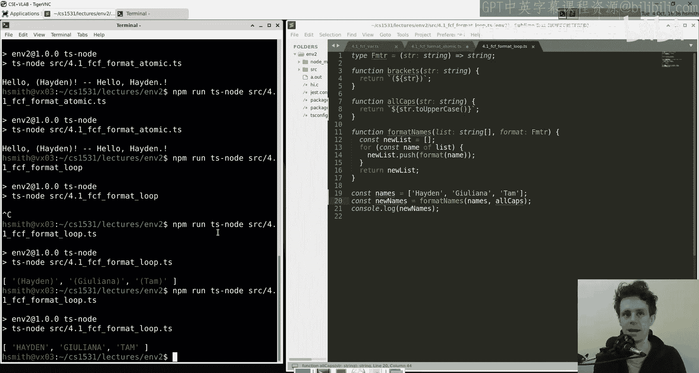

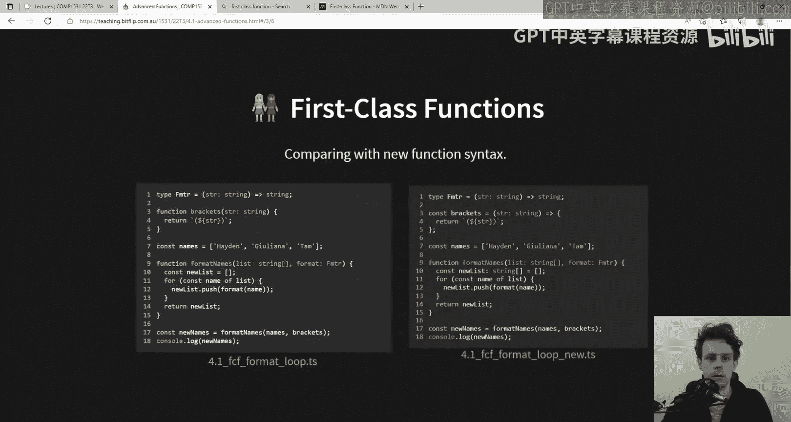

Very similar to the last example。 I can tighten up the syntax in this a little bit if I want to。

 Let's go back。 Let's keep the all caps example。 It's kind of fun。 I can say， well。

 this is a one line function。 So constant all caps is just。This simple function， nice and easy。

 And then I could use the other function syntax on this， too。It's not a one line function。

 So I can't condense it much more， but that's， that's kind of where we end up with threat like there。

 So that's an example of a file that has functions that really utilise the first class functions as a concept。

 And we use that newer functions syntax to make our code a little bit more concise and a little bit more standard。

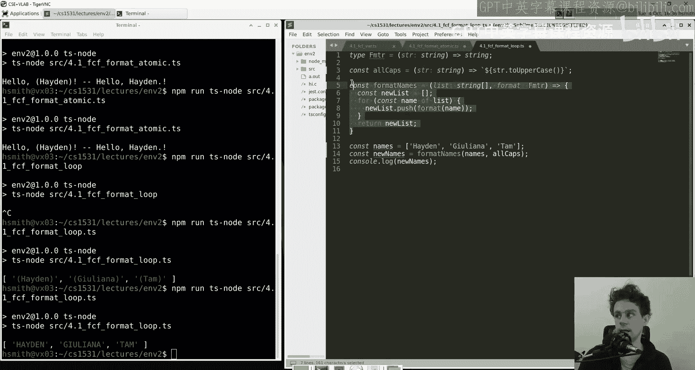

One element that this example is really good to kind of describe is an idea of an anonymous function。

 This is true in pretty much every language。 and an anonymous function is。

It's essentially a function that we only ever intend to use once。

 and therefore we can pass it directly into a function。

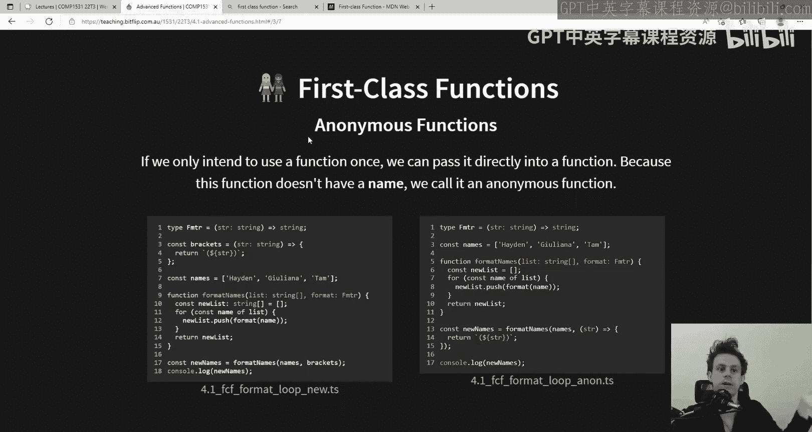

Because the function never gets given a name。 It's we just call it an anonymous function。

 And what I mean by that is that if you think about this， right。

 when we define this function all caps。A function that takes in a string and， you know。

 returns an uppercase version of the string。 What we are actually doing there when you pay attention to it is that we are creating a function。

 and we are putting that function inside of a name called all cap so that we can reuse it as much as we want。

But what if we don't need to reuse it， What if we only want to use it once， potentially。Well。

 let me show you。Let's just bring this down here for a second。

 and we'll really conceptualise it together。 Let's go back to the first function syntax。Like this。

 all caps。Like that。 Co。 Yep， I'm passing that into the function。Well， if I go to， for instance。

The second function syntax like this。Function string or whatever。

 What you'll notice is that if I'm only ever gonna use this once， Like。

 if I'm only gonna use this function。Just for that function call。

 I can actually literally take the whole thing。I can copy it。And I can paste it there like that。

And it actually works fine。Funnily enough。Like really fine and easy。I'm just past'cause that's。

 that's remember， that's all it is。 That's all first class functions are。 It's。

 it's a function that takes in another function as an argument。 And well。

 here's a whole other function， you know。😊，But the cool thing is that we can use the tighter function syntax to get the same job。

Which means we can copy something even smaller into this。Which will work。 But again。

 a one line function or a one statement function， we can collapse even more。

Right into something like this。And then we can， because it's so small now。

 we can literally just copy and paste that here。So now you start to get these really。

 really concise pieces of code that aren't that complicated to understand for simple things where you say。

 hey actually new names。 well that's going format the names in this names list and it's going to format it according to this function and eventually you'd be able to read this and go well。

 that's clearly a function。 It's a function that takes in a string and it returns the string to upper acase。

 easy it's really simple function that I've just defined and it's defined anonymously because if I said to you what's the name of this function you couldn't tell me because it doesn't have a name because we never gave it a name。

 It's just a function that just existed once briefly for our program。

 So that's what anonymous function is。😊。

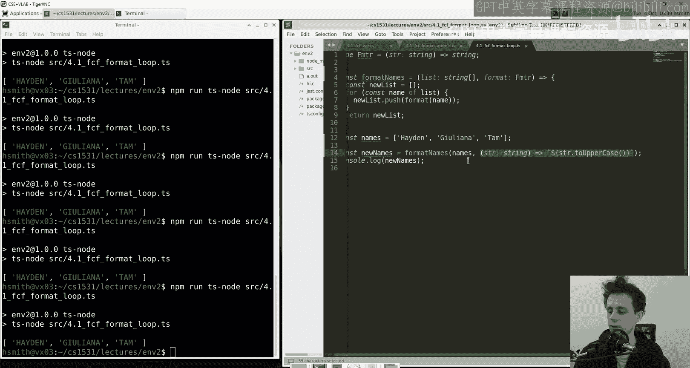

So in summary， first class functions are predominantly used in terms of letting functions take in other functions and arguments and the reason we care about this is because it allows us to create more concise and clear code。

 it doesn't make us do anything that we couldn't already do kind of in some way or another。

 but it does allow us to just make everything more compact and readable。

 which is a massive thing you know like if you can make code more readable and easier to understand then it's easier to debug。

 it's easier to manage everything with。Which is huge。At the end of this。There was a phrase I had。

 which is that it's also a fundamental part of understanding callbacks。 And then we said， what。

 the hell is a callback， well。

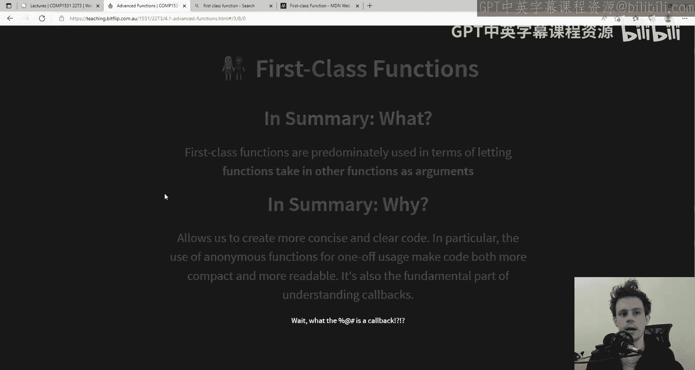

A callback is something you might see more and more of in jascript。

 but a callback is just another fancy way of saying。

It's kind of a bit beyond the scope of the course， which is why we don't really talk about it。

 But it is essentially where we pass a function into another function。

 It's used a lot more in jascript。 That's like asynchronous。

Which we don't really touch in this course。 We don't really do any asynchronous jascript in this course。

But if you do see。Cllbacks mention around。They're broly just talking about。

Passing functions into other functions。

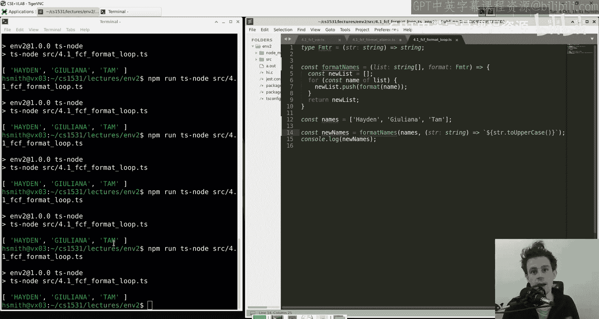

We're not gonna to cover it。In any real depth。O。Another reason。

That it's important to understand first class functions。And these functions in taxes is because。

There are three very popular and very powerful。Features of JavaScript arrays。

 which make you be able to write code really quickly， really easily。And these are three functions。

Called mat reduceuce and filter。Map reduce and filter are functions that act on array objects that help us accomplish basic iterative tasks without the overhead of a loop setup up。

 If you don't know what that means， we're going to go through a few examples， but essentially。

If you actually look at a lot of your programs， you'll see about a third of it is just doing the same basic stuff you've always done like we did in these examples here where you lay on。

We're just going to loop through some things and change some things， right？

So I'm not feeling very well today。 So I'm trying to stay hydrated。Not hydrated。

 That's the weird thing to say when you eat dried mangoes， but。Stay energized。嗯。

But a lot of this map reduced filter is based off these concepts of first class functions and anonymous functions。

 It's used really， really heavily， right。And that's going to be map， filter and reduce。

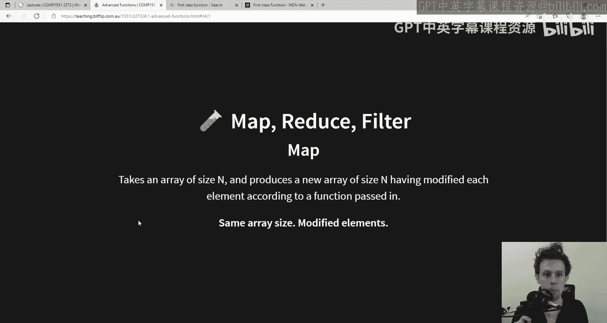

So let's start with map first。Map is what we saw here。Map is where you take an array of size n。

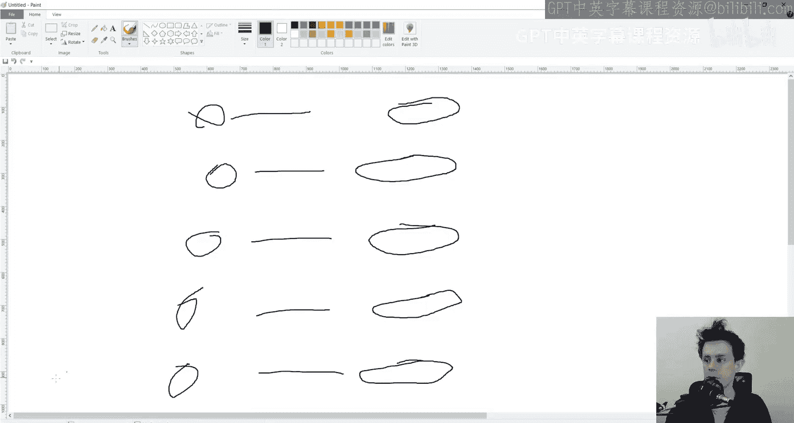

Yeah， and you produce a new second array of size N。

 But you've modified each of the elements according to a function that's passed in。 So， for instance。

 let's imagine that we had an array。

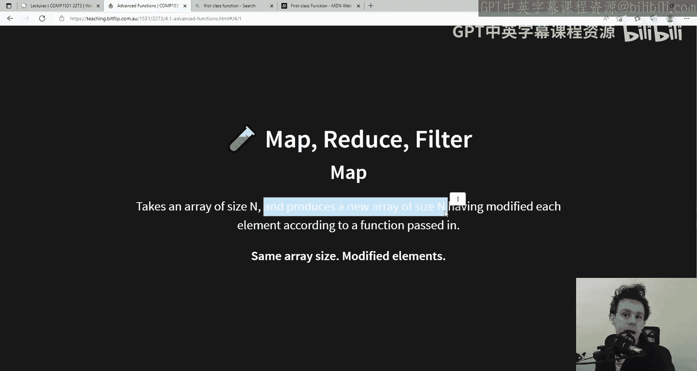

With all these different elements in it。 And you came along and said， well。The elements are all red。

And what a map function might do is it might go and take your old list。

And it might go and produce a new list over here， according to a mapper or some kind of function that is applied to every element that might say turn them blue or do anything。

Right， might turn the blue， something， whatever。

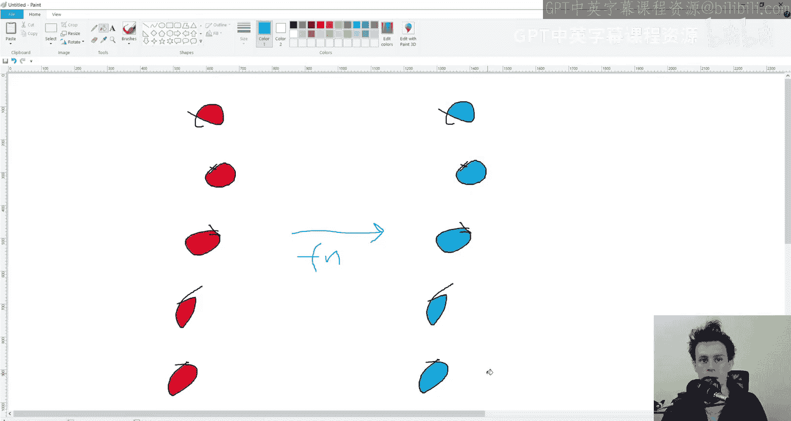

The crux of it is that。It produces a new array of the same size， but with modified elements。

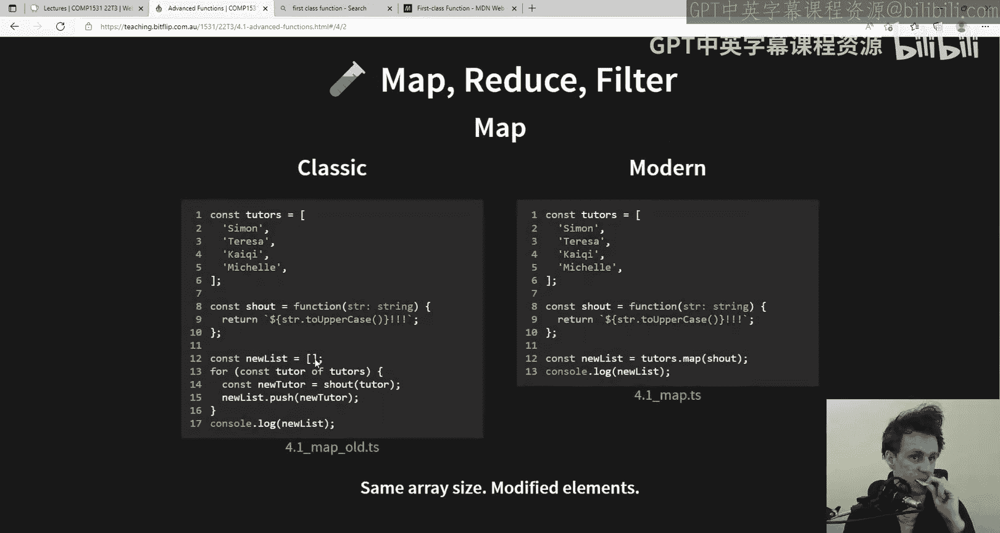

So look on the left here。And I might just pull up the code。Here you have a piece of comb。

Where we have a list of tudtors。Sim in， Thereesa Kai and Michelle。What we are gonna do。

Is try and turn them to uppercase with the exclamation marks。

 We kind of did this in the previous example。We create a function called shout method 2。

Which takes in a string， returns the uppercase string with exclamation marks。 We create a new list。

 We loop through all the old tutors， and for each tutor。

 we get the new tutor who's the shouted version of that tutor。

 and we push that shouted version of that tutor to a new list。

 And what you end up with is you know like a new list and an old list and I'll just get the old list here。

 which is just tutors。 And then when you run it。Right。You get something like that。Okay。

 so you get a copy of it with the same number of elements that have been modified。

 that's a very important point。

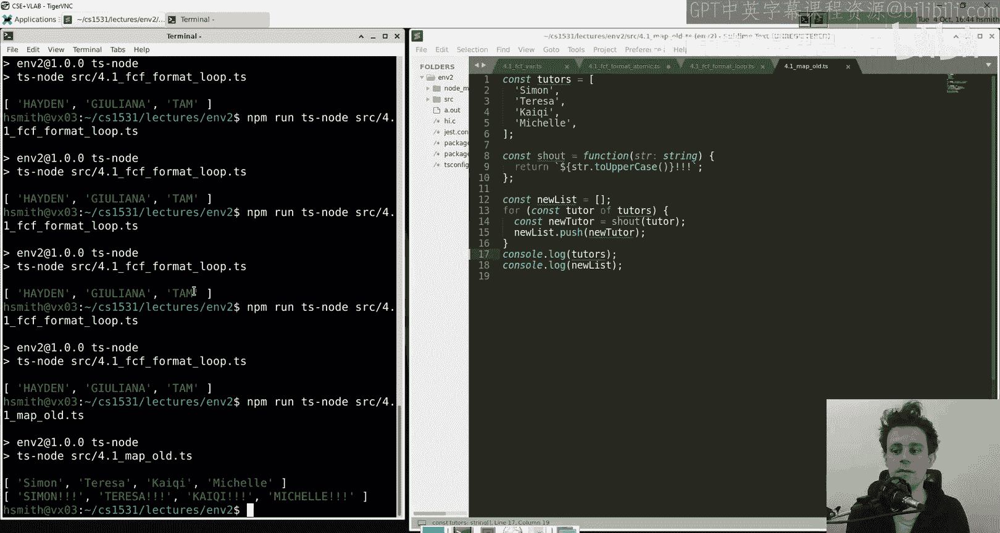

What a map function allows you to do is to cut out a lot of the B S。

 So a map function allows you to come in and say， you know what。

 instead of having to like create this new list and loop through it。

 I can actually say con's new list is equal to the old list。

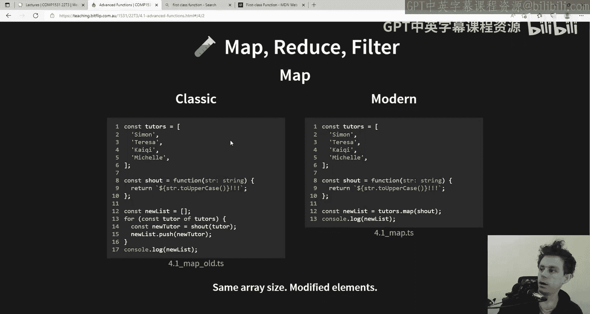

Except we're going to map it and what we actually give the map function is really easy。

 we give the map function the function that's doing the mapping。Like this。That's it。Done。

 and this is because map is a property slash function of an array。 So tutors is an old array。

 And we say， go loop through， apply this function to every element， give me a new list。

 which is a new list too。 really easy。 And what do we learn about anonymous functions before。

 And like， let me take it further for you。 And I think it might even be in the slides。

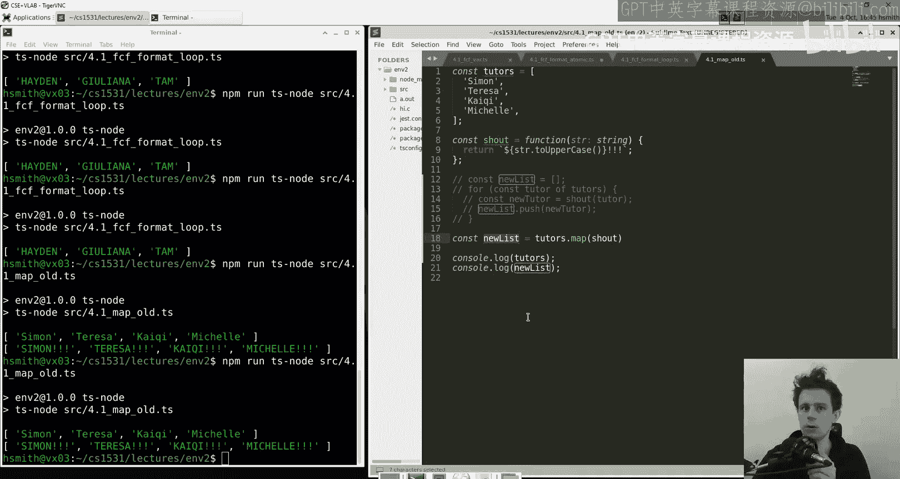

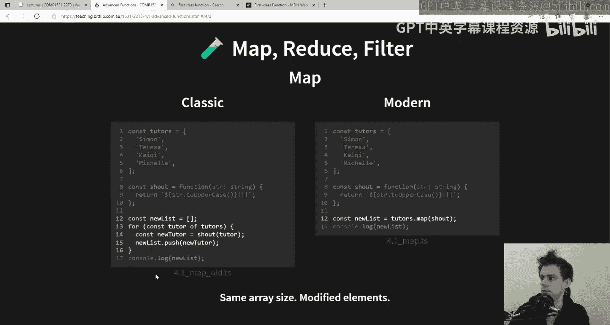

Yeah， I mean， I pointed this out in the slides that is just different。

But like let me take this further than the slides do， What do we learn， We learn that well。

 the nice thing about function syntax 3 is that if you have really simple function returns。

 you can collapse it like this， and then what do we learn afterwards。

 we learn about anonymous functions which showed us that if you're only going to use something once。

 you can just do that。😊，Now we have this exceptionally， exceptionally straightforward program。

Right now， if if the functions are too complicated， you can't make it too dense。

 you can't do anything too crazy。 And that's okay， right。

 You don't want to because you want your code to be readable， right， Like you want people always ask。

 you know， iss it good， Is it good to， to make it more concise。 It's like， stop。

 stop asking and start looking。 It's like， look at it Like which is easier for you to read。

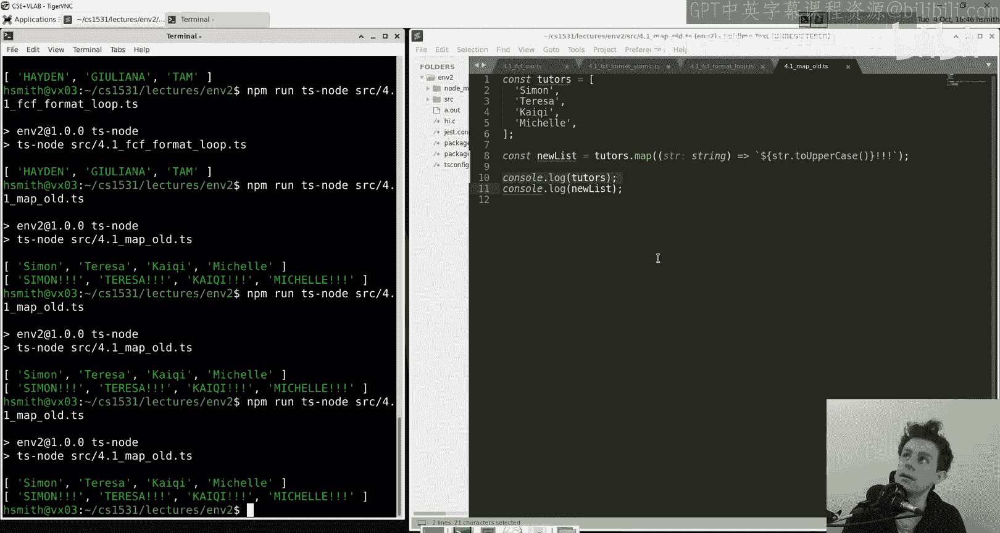

Right， this one is for me。It's clear what's happening here。 I'm taking the tudtors。

 and I'm mapping them according to a shout function。

 and that shout function seems to take in a string in upper case with exclamation marks。

 That's really easy。 Is this easy to understand， maybe。

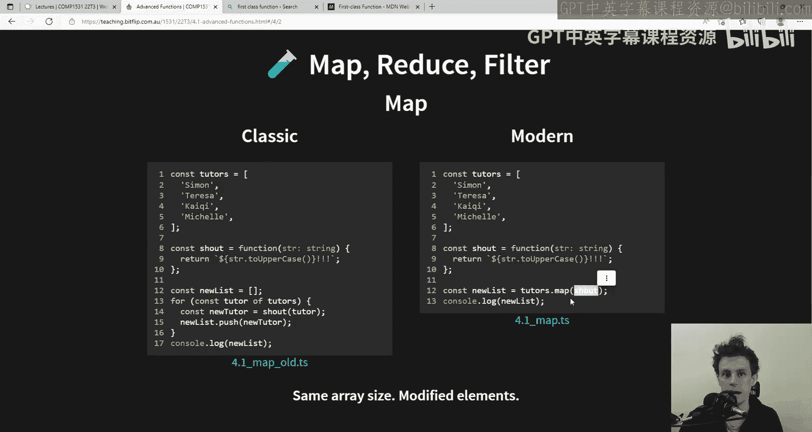

Maybe not。 I think a little bit， maybe， but。It's hardcause this line's getting a little bit long。

 You know， I think it's okay， but there's a point where it's just too complicated And you you shouldn't keep needing to condense stuff down。

 So here I go。 new list。Tutors dot map the function I give it。

 I define in line as an anonymous function。And it just works。 It does the thing for me。

 I'll run it again。 Super great， super easy， super concise。 That's what a map function is。

 The other kind of really important one is a filter， and a filter is kind of the opposite of a map。

 It takes in an array of size N。😊。

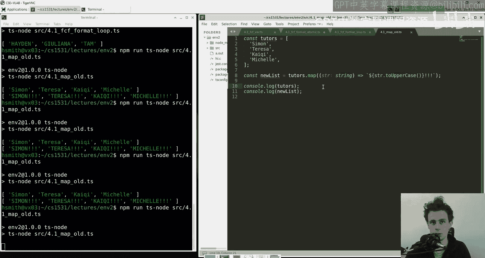

And it produces a U array， which is good。Except。With map， it was the same size。

 but we modified everything。With filter， it's nothing as modified。But it， we get。

 we get a different size back。 And that's because it it does what it says。

 which is that it filters it actually。Look through your array， looking for something。

And it only returns you what it found。So for an array of size N。

 it will give you back0 to n items in the new array。

So it's a possibly smaller array that it gives back， but the elements are unchanged。 and similarly。

 if we look at some code。

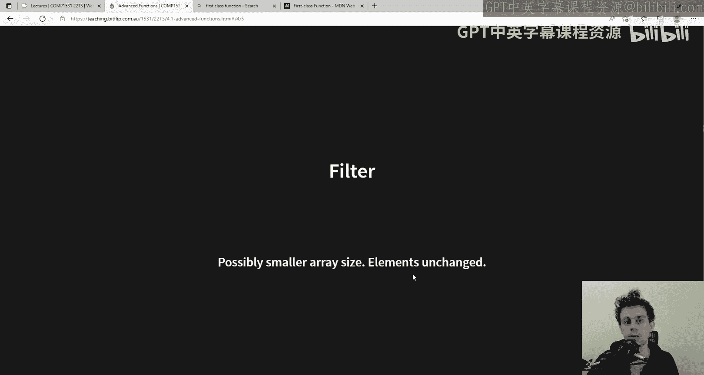

You can see that now we've got some marks。Ui marks， we have a function called is pass。

 which returns true。 If mark is greater or equal to 50。 That makes sense。 We do what we did before。

 we create a new list。 We loop through all the marks。 If the mark is a pass。

 we add it to the new list。 let me just change these variable names， as should call it like。

 you know， pass marks or something like this。 And then we， yeah， every time it's a pass mark。

 we add it to the list， and then we console the output。 And what you get left with is this。

Essentially。Aray of Poms。 But again。Just like the map example， there's a really great。

 simple JavaScriptscript syntax for it， which is to say that passmarks is the old marks dot filter。

 and you just give it the function to filter on。Like that， that's it。

So now it's that simple old array filter it based on this function。

 this function is applied to every element。 So like when I've been copying and pasting out because it does this exact thing。

 It literally creates a new array， it loops through the elements that applies this function in each element every loop and then only the ones that succeed。

 it will go and push it to the new array， So you get that much nicer function syntax and again。

 just like we saw before if we want to take it further than the slides you can simplify your simple functions down to a single line like that。

Like this。And then if you're only using them once， which sometimes you might use them many times。

 you can go and make them anonymous。So once again， really simple piece of code marks， take the marks。

 filter them by applying this function to every element。

 which is just a function that checks if the marks greater or equal to 50。Daniel says。

 so does filter， filter out the array if and only if the filter functions return false。 Yeah。

 exactly。 So like to， to really make it clear， I guess。If this returns true。

Then everything comes through。We'll get all five items。Whereas if this returns false。

 we'll get none of them。So the filter function will return true or false， essentially。

 And if it returns false for a given condition， then yeah， it won't work， which is why we had the。呃。

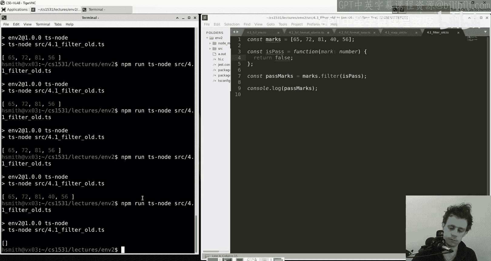

Yeah。Why， why we had four out of five of them workca the market was greater than 50。So again。

 very simple， very concise， very useful， very powerful。

 And the last one which is honestly not super useful in like most everyday cases is the reduced function and the reduced function executes what you call a reducer。

 which is just the function you pass in on each member of the array。

 and what a reducer does is it takes an array and it turns into one value。😊。

So turns a list into a single item。And。

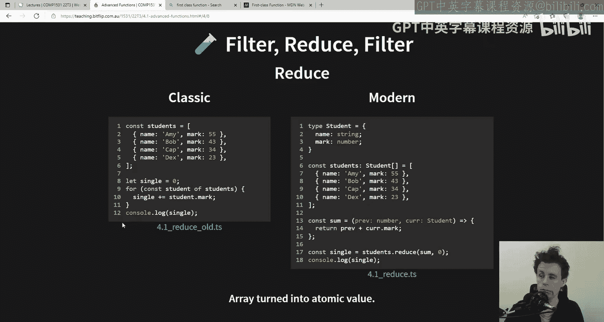

Yeah， let's look at this one。This one is more just for completeness。

 but I wouldn't encourage anyone to lose any sleep over this。Sincerely，ca it's just a bit different。

 But here's a piece of code。 Here's a piece of typescript。 We have students。 It's a。

 it's an array of objects。 Each object has a name and a mark key。

 And then we say that we're gonna let a single variable be 0。

 And let's say we want to sum up everyone's mark。 Okay， so we loop through each array item。

 And then we grab the mark from each student object。

 and we sumit together into a variable that we started again。 very。

 very kind of basic computing stuff。😊，What a reduced function lets us do。Is it。

think the lecture code's off there。That's weird。What it lets us do。

 and I'll just copy and paste this in。Have to check that。 That's a bit weird is。

It's a slightly more concise version of it。But if I pick it apart here and I kind of pull this into a function for a second。

I'll create a function called sum。Right。And some is a bit weird。The way a reducer works is that。

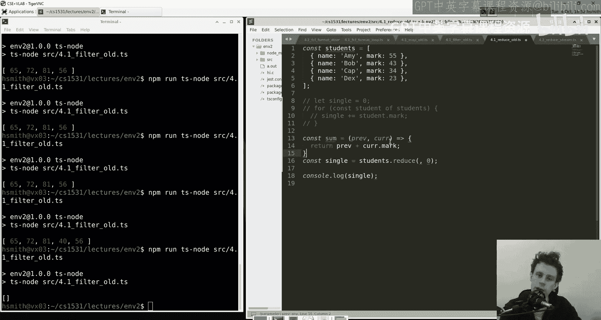

I think I described it once as like。

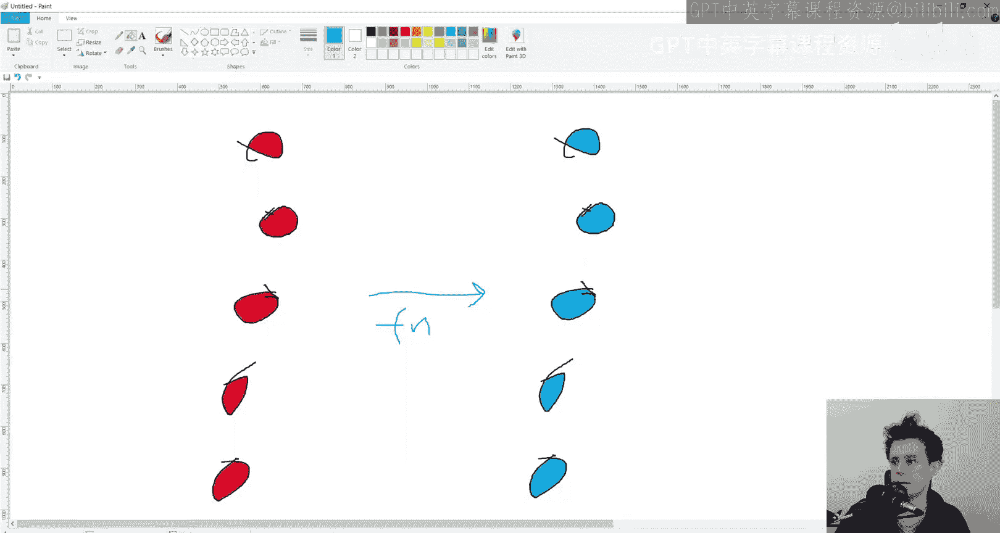

Let me just pull it up， so。When I say I want to get the student's array。

 which is an array of objects and reduce it。And I want to give you a sum and a 0。

 The sum function is actually just a function that takes in two values and like produces them together。

 So like， you know， collapses them into one。 So how this actually works is let's imagine we have these marks。

55，43，34，23。

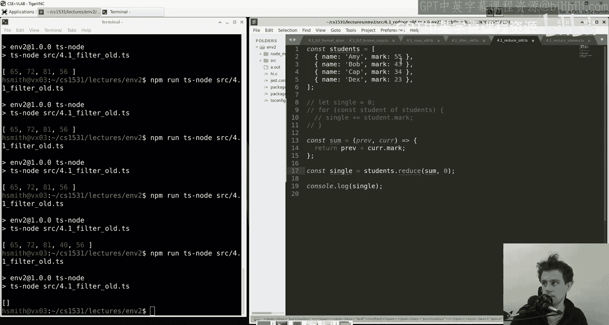

Right。

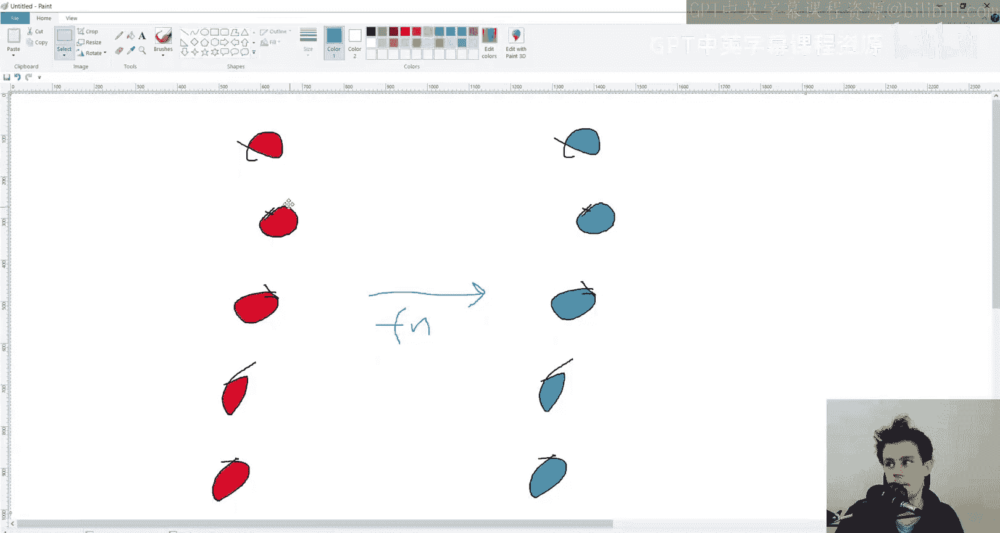

So we got， you know， how like， I don't know what they were or were they。55，43，34，23，55。

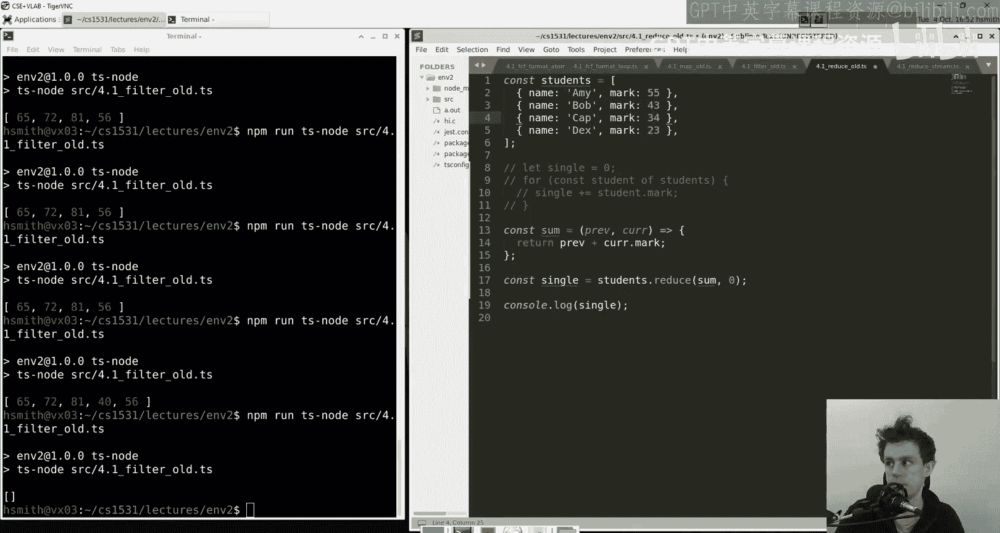

That's a horrible color。Hope I get it right。55。43。I du'tno，35，23。 What was it。34， oh my God。

 So here's what the reduced function does。 It's a little bit weird。It goes in and it says。

 what's my starting value，0。So kind of define0 over here。Make it red or something。

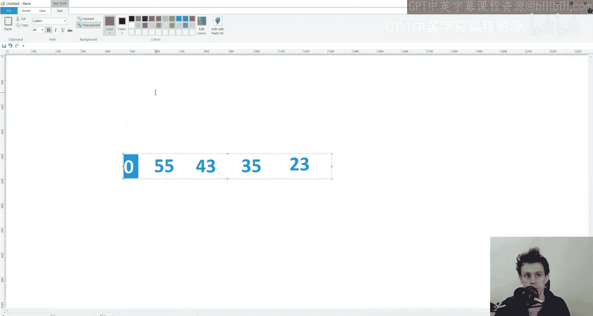

And then what it does is it says I'm going to apply the sum function。To the 0 in the next element。

 which is 55。 And what the sum function does is it takes in prev， which is the one on the left。

 and it takes in current， and it adds them together and returns one value。

 So what it's actually doing here is it's essentially just saying， well。

 I'm going go and take these two。

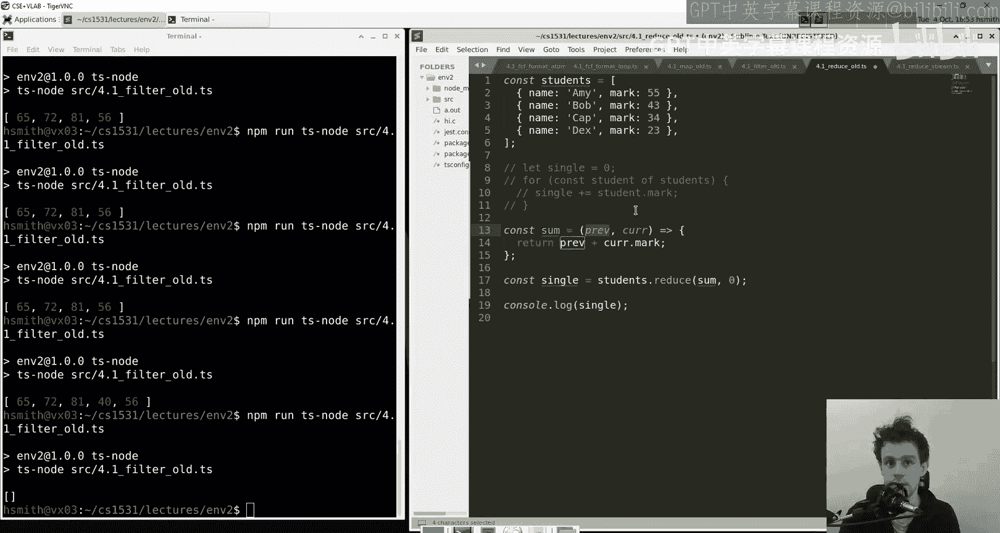

I'm going to go sum them together， and that's going give me 55。

And then what it does is it grabs the next two elements。 It goes， I'm going to go and grab 55 and 43。

And I'm going to sum them together。And what will that give me？That'll give me 98。Right。

 and what it does is it keeps applying this very simple function。

 which is just taking the previous like running total， if you will。

 and the next value to account for it。 it's， it's like an accumulator。 You know。

 it's like coming through。 It's like， like， I du't know， like a lawn mo， right。 Think about a lawn。

 I don't。

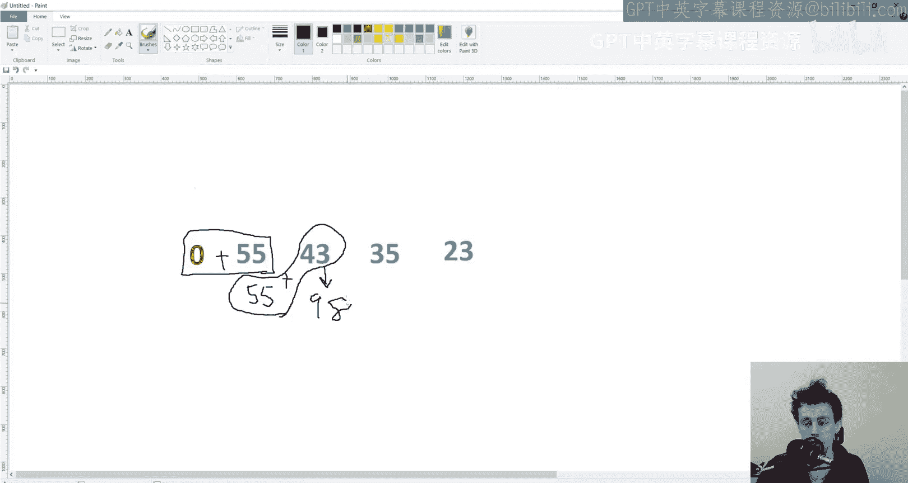

Lwn mower got all this grass。 He like rows of grass。 It just takes them in。

 and it keeps like shoving it all in into one thing。 just the basket of grass。 You know。

 it's trying to reduce everything down to， to something atomic。 And， you know。

 this could keep happening， You know，98 and 35， which would give us a and33。

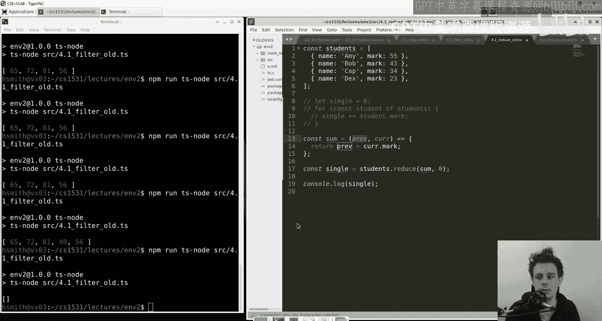

And then we got 133 and 23， which would naturally give us a56。

And that's how that function would work。 It would start with the 0 and then go。

 which is your baseline and then take that in the next element and just keep joining them together to get what you want。

 Reduce isn't really that useful In reality， I don't think。

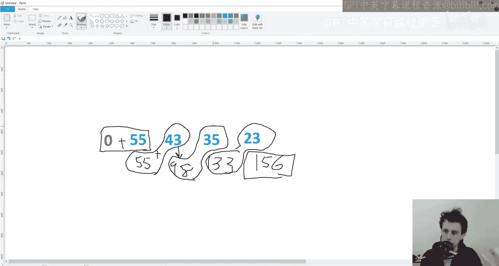

I pretty much never use it'cause most of the value of it is like， to some things， to be honest。

 but most languages have。Most languages have functions in them that some stuff for you and in jascript。

 you know， you， you eventually get used to learning how to sum things really quickly。

 If I've got that that list， like honestly， like after a while， you just start going like， you know。

 students dot reduce previous current is just previous dot current dot mark starting at  zero。

 Like you， you get kind of get。

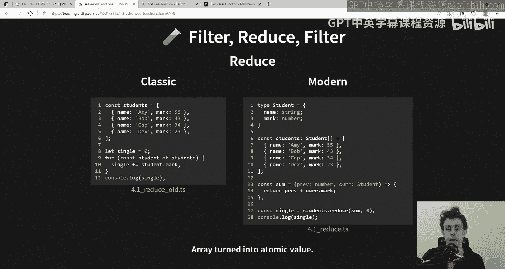

You kinda get comfortablecause it's always the same thing， right， Like， like if you're just summing。

 it's always just previous and current is a function。 previous plus current。 You know。

 you forget it 15 times then by the 15th time you do it， you're like， I'm not gonna forget that now。

 But that's reduces a little bit weird。 We don't have to worry too much about it。

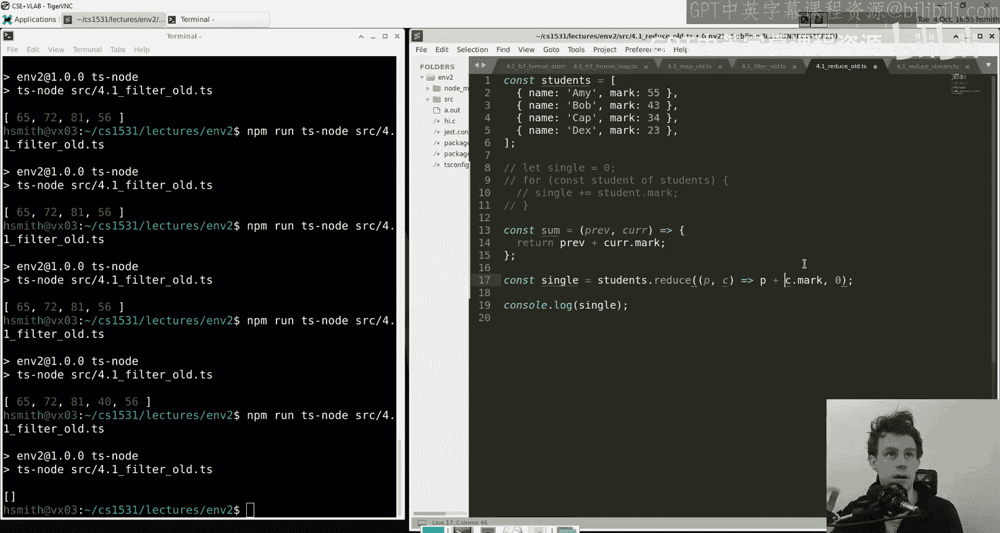

Just checking how much more we got。 Okay， not much more。Allison says is reduced like a loop。

 which loops through the arrayator add the number。 Yeah， basically， that's， that's。

 that's what the example comparison was。 So like these two things are basically the same。You know。

 like that's why we got them side by side。 Like lines 13。

 lines 13 to 15 and then 9 to 11 are essentially the same things， yeah。嗯。

We have some more anonymous function stuff。hoops。I already kind of talked about this as we went。

 I don't think we need to go through thisca I showed you these examples like I was like like this one here was like oh。

 let's make this even shorter than the slides allow us to。

 This is just a slide to kind of demonstrate that you can always usually make things more concise。

 but just wanted to show you a really cool， simple example of where this map reducing filter can kind of all stack up。

😊。

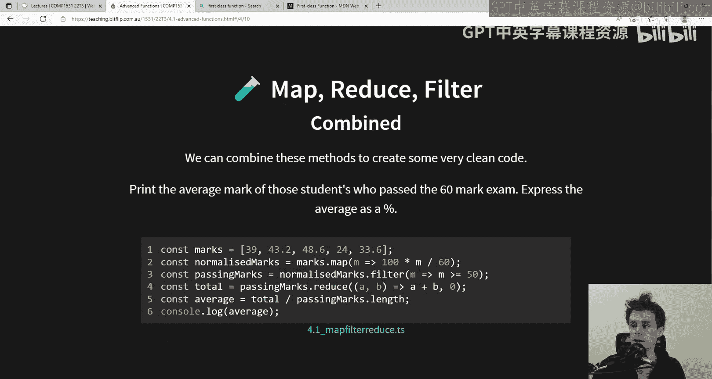

To being something very useful。Which is here I say， well， let's I've got some marks 39，43， 48，24，33。

Then what I'm doing is I'm going to normalize the marks and the way normalizing marks works is like let's say your project is out of 60 well if I want to give you all the percentage out of 100。

 I have to like normalize them right I have to divide your mark。By 60 in times by 100。

 so that everyone's imagine all these marks are out of 60 here。 So you know，24 out of 60。

 you can do it very simply right， just in case anyone's not understanding what I'm referring to24 out of 60 divided by 60 times by 100。

 you've got 40%。 if you've got 24 out of 60。 So this first line here is really helpful because it's just saying。

 well， let's go get all the marks， let's map it with this function here and that function simply takes in a variable and it returns 100 times the variable divided by 60。

 which is what we just did Great， And then we get normalized marks。

 And then we want to figure out who passed because now that we've normalized it we can remove everyone who didn't pass。

 everyone who didn't get above 50。 Well let's take the normalized marks fill to them to remove some but not modify it by saying given a mark。

 give us a true or false whether the mark is greater or equal to 50 And then the next one is we can say。

 well， now that we've got all the passing marks。 let's just sum them up into the total。

 And then I can get the average just by dividing the total by the number of passing marks that exist。

 And then I've got an average。And here you go， I have a very simple program now that can do quite a lot for me with essentially。

That's so weird。Ma。All right。Really simple。 Give me a number，68。5。 That's the average passing mark。

Brilliant， right？ You go try and do something like this in some other languages。

 and it can be a real nightmare。 So very powerful stuff， very cool language features。 You'll see。

 you will see that in all languages anyway。 Any other questions before we move on to the last part of our advanced functions lecture。

 which is high order functions。 Ask them now so we can move on。 I'll just pause for like 15 seconds。

😊。

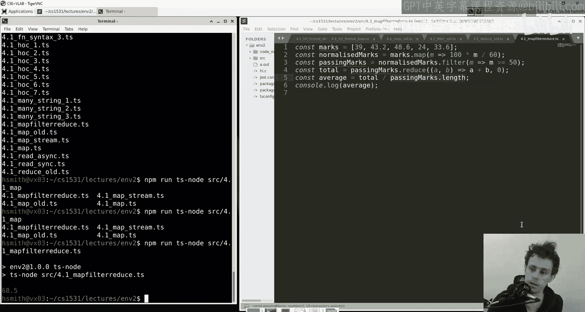

Okay， last part of our advanced functions is called higher order functions。

 This one is very interesting， I think。Higher order functions are essentially functions that return functions。

 I like to think of them like mini function factories， right。

 You see those Tesla factories where robots are building robots or， you know， or whatever。

 whatever factories it is。 It's kind of crazy， right， robots build robots。

 We're going to write kind of functions that produce functions。 And we're going take you through。

 essentially。😊，An example motivation of what might bring this about and。

Similar to the first class functions it's not really something that allows you to solve a problem that previously could not be solved。

 It's all just about keeping your code a bit cleaner and easier to work with。 so here。

We have some functions。We have a function that says， congratulate Mark for people who got a pass。

 congratulate people for Mark。 So congratulate people whose mark was a pass。

 congratulate people whose mark was a credit。 Congratulate people whose mark was a distinction。😊。

So they all take in a name which is a string， and they will return a string which might say。

 you know， congratulations， Haden on your pass or on your credit or on your distinction。

And then we might decide to use one。 for instance， consol log Grs。

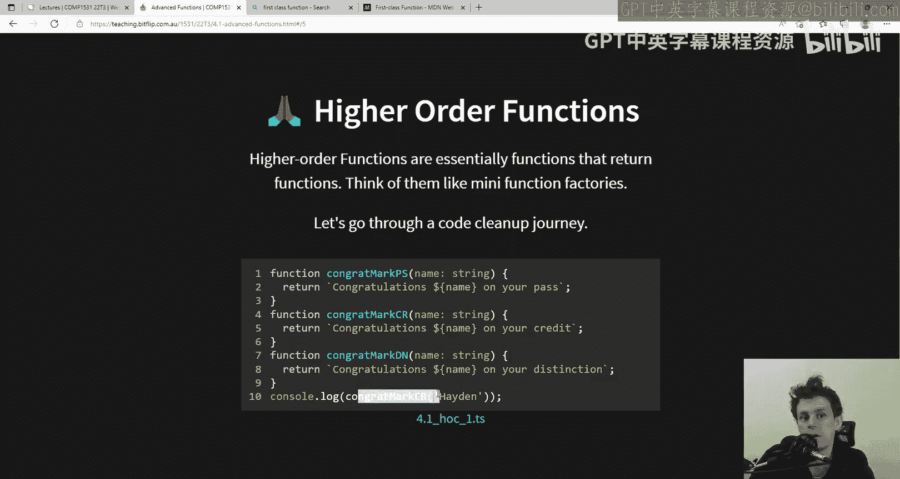

Hayden for the mark of credit。And when I go and， let's go do that 4。1 H O C 1， you know。

 when I go and run that。I get。Congratulations， Hayden on your credit。Perfect。

 what do you as a programmer dislike about this， or what do you notice when you see this。

 you think it's a lot of repeated stuff。 I've got a lot of functions that do nearly the same thing。

 right？ They're all the same， except they have a different word in it。Okay。

 so what's your probably like， What's your first reaction of how to clean this up， right。

 Someone tell me， what's the first thing you do。 I know what I'd do。Theres a few things you could do。

 right， Like， here's one。 you might originally be thinking， oh， well。

 I don't really need three functions。 I'll just create a function called congratulate Mark that takes in a name and a grade。

😊，Which is the string。 Oh， we could use typescript here。

A grade is either a pass or a credit or a distinction。You know， use types to our advantage， say。

 maybe it' three grades。And now we could say， well， on your grade。Cool， awesome。 Well。

 now we don't need these functions。 But the problem is what happens when multiple people not just hate and get a credit now。

😊，You know what happens when Tam or Juliana gets a credit Now。

 we've had to repeat ourselves in just a different way because we've had to repeat credit so many times。

 And it's like， well， sure okay， well， can you pull it out and say， you know。

 con credit equals credit。It's like， yeah， but。You know。

 you they're all just different ways to solve the problem。

But we don't want to go down that route necessarily， let's go down a slightly different route。

And that different route is to create some kind of rapa。

This is a pretty standard thing that you could probably do now。

 which is to say that I'm still gonna call congratulations for you know a mark of credit for Hayden。

 But instead of the function here just using a string。

 it's actually going to call like what we might call a helper function。

 which is like a hidden underlying function， which is congra congrat Rapper。

 and that congrat wrappper takes in a string about whether you know you passed or credited。

 And then the name， too。 And this kind of spits out the string。

 So we're kind of doing a mix of what we did before。

 it's just this way wherere preserving the function titles。

 So now I can define my create mark pass and create mark distinction， I can come along and say。

 you know let's create another one for high distinction。😊，You know， like there's high distinction。

 So this is good。This is pretty clean and this is probably the standard way you'd probably solve things for now in JavaScript。

 but want to show you take it even further。And get into。Well， nearly there。

 what I first wanted to show you here was that this is us moving it from like method 1 function syntax to method 3。

 So just like a slightly different way of expressing the function here。ButAgain。

 we're just swapping the function and the constant and that kind of stuff。 Nothing else is changing。

But to take it one step further。Now we're going to use higher order functions。

 which is where things get a little bit weird。Frankly。You might look at this and think， oh， wow。

 what in the world is happening here。But let's step through it。

I am creating a function called generaterate congratulate Mark， and it's taking on a mark string。

Like a pass or a credit。 And in fact， just to make it really clear， let me just。

Explicitly type this with Tscript。Distinction like that。Easy enough。

But have a look at what I'm doing inside the function。 Most functions that you write。

 If you think about it， they nearly always seem to return a value。You like a string or a number。

 But in this case， we actually want it to return a function。

Cause I'm creating this function called R for return。

And it's a function that takes in a name as takes in a string called name。

 and then it returns a string， congratulations name on your mark string like this。So generate。

 congrat Mark。Is a function that returns a function。

And then what that means that we can do on the next lines is that we can actually say， hey。

 I would like to define a function called congratulate Mark's Pass。In that function。

 instead of having to， you know， like write it out and be like， you know。

 it's a function that does something， we can actually just say it is the result of calling Gen congrat Mark。

And this function， you know， returns a function。 So in this way， these。

 these three things are functions here。 and it allows us to much more concisely now。

Say do a few different things like this。Where。We can create more functions。That simply only。

 we only need to give it past credit a distinction。 Whereas like。

 say back in the second example here。Or the third example。

 even we still kind of every time we define something。

 we had to like do all this boilerplate and we had to like pass the name in each time and everything like this。

 You know， it was like a lot of copying。 and like probably a better example to compare these two for you。

 right。If I compare them side by side， this example we had back here， let me make this full screen。

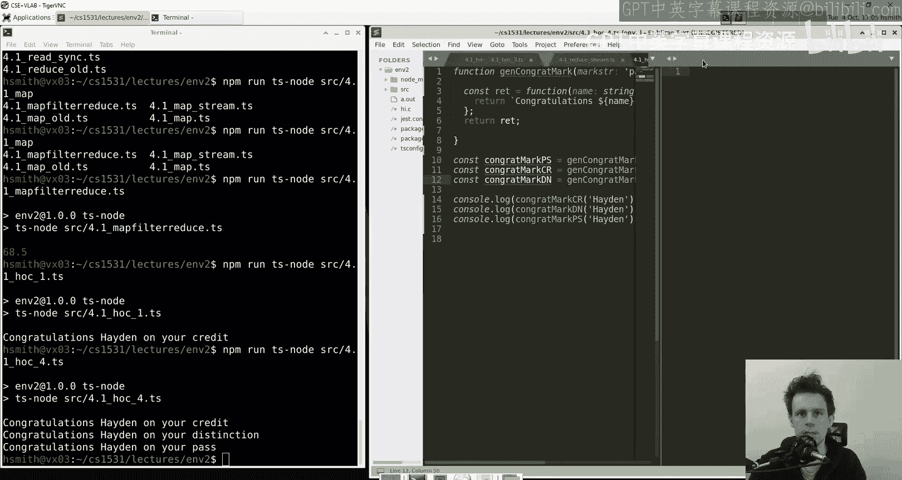

We could have cut this down in terms of complexity， Right， We could have said， well， you know what。

 again， because it's a one line piece of code。We could do something like this。

And this is the difference。 So I think this is important to understand the difference'ca this kind of best probably demonstrates the difference between it。

Of what the two look like。Right， on the left case， you've got this simple function that simply takes in a mark string and a name in it。

Shobs two variables together。 And you're saying that， you know， congrat marking is this function。

 So having to explicitly define the function in each case and how it works。

 you're just limiting the amount of repetition that exists。 whereasas the right hand case。

 the one like up here， this is a higher order function， where instead of needing to do all this。

 you just call a function。 and it's like mini function factory。Hey， Jen， congrat Mark。

 give me a function。 Create one for me。 And you can see how much this kind of saves on boilerplate。

 And it can also help a little bit on readability as well。 if you understand the code。 But that's。

 that's essentially higher order functions。 They are a very obscure， but still very useful way。😊。

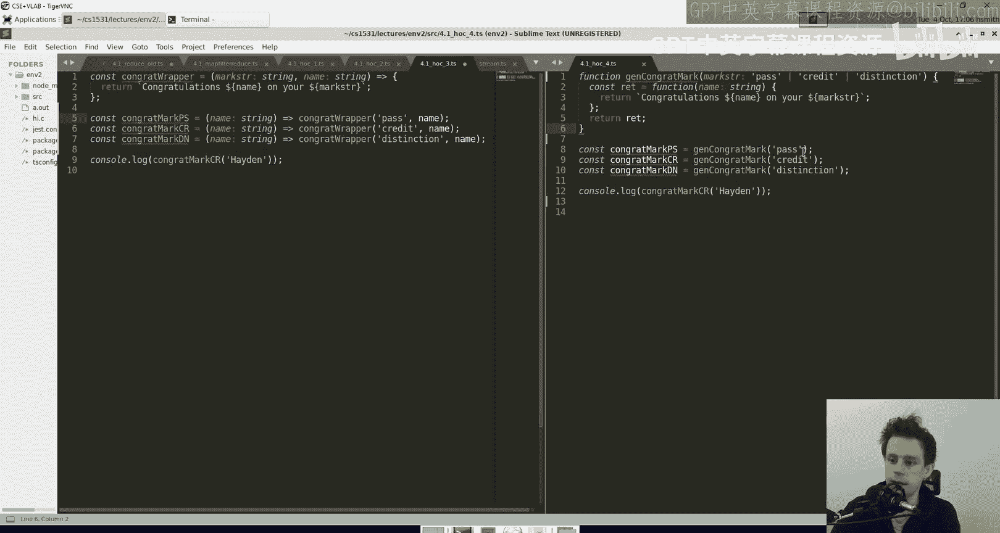

To clean up your code。It's a lot of examples here。You know， and you can make it simply。

 You can get rid of more stuff if you want to。You can make， yeah。

 you could like make it more concise。 I just the code examples we have are meant to be like a little bit unconcise。

 so you can explain it。 You can make sense of what's going on。

 So where do you look for higher order functions。 Higher order functions are great when you have。

Many functions doing approximately the same thing， but how they differ might only differ on a few underlying principles。

 You know， like in this case， we're saying congrats to everyone。 It needs to be a function， by。

You know， we want different functions for different marks。 for instance， in reality。

 it's not that common'cause like， it's not that common that you would ever really do thatcause quite often in reality。

 you would simply， you know。

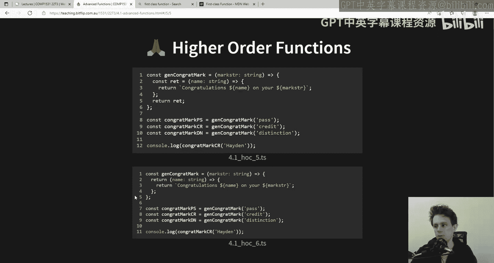

You would simply just have a congrat mark function that， you know， you tell it what to do。

IPart if your input could be anything， but sometimes it， sometimes it can be easier to have。

There's more complicated examples that are hard to kind of go through in this time frame。

 but it can be easier to actually just have an explicit function for it。 So that's all I'd say。

 I'd say that if you're ever looking at a scenario where you're seeing a lot of something like this and you think。

 it'd be nice just to have like literal different functions for all these different use cases。

 It to make the code a bit tighter and clearer。 It's like， well。

 you can look at higher order classes as well。 power order function。 so。嗯。

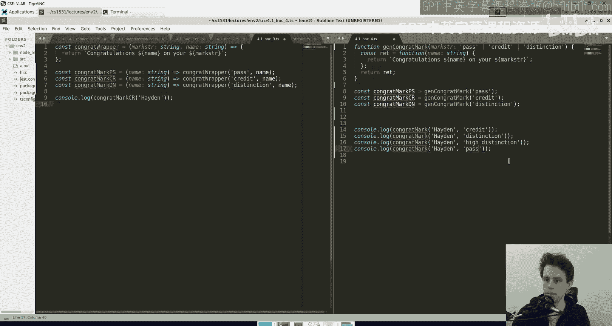

Any questions about thatcause we're at the end of this lecture now。

Summary being hiy of functions is syntactically sleek ways to generalize function definitions。

That's it。 It like in a lot of this lecture， like， so again， why is this lecture here。

 It's here to show you a lot of the powerful elements that exist in。

Programming languages so that you can use them in your own software engineering journey， and。

It is also to show you。That。To explain a few things you might have seen that you didn't understand before in the obvious example。

Is j。Do you remember with Jess， you saying this， This should all make sense Now。

 This is actually just a function。So Jess is actually just。

A describe function that takes in a string and another function。

 And that function simply does some stuff and calls test， which takes in another function。

 So it's it's really like， you know， we just kind of gloss over that because no one really thinks too deeply about。

 most people don't think too deeply about it。 but that is。

 that is what that is was was and is it's just another way of defining syntaxes。 we。

 we could go in And like like we thought about this when we taught the course。 we were like， oh。

 we could just be really explicit and be like， well， you know， it's a function。

 And we're just passing functions and functions。 But that begs a lot of questions。

 It looks super weird and。

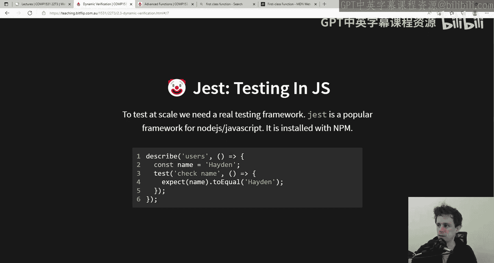

You'll never see a code example like that online， too。

 So it's like it's kind of contrived to be like， oh， yeah， here's how it looks。

 But then everything you Google looks different。 Sophia says。

 should we get in the habit of using higher order function slash with this impact our style marks。

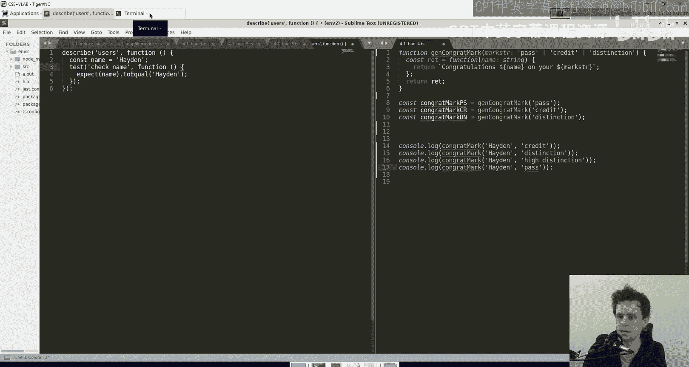

Not really。What I'd probably say more。Inently， is that。There's a lot of。

Trying to think what a good code example is。There's a lot of cases where like it should be evident to you really。

 there might be cases where you have， say， for instance。

 you're formatting names in a couple of instances。In the project， you'll see this in iteration too。😡。

嗯。In iteration 1， we ask you to worry about messages in channels。 In iteration 2。

 as you'll see next Monday， we ask you to not just do messages， but also like Dms， right， like。

 you know， group Dms and stuff。 So if you've used Discords slack teams。

 It's like you can have channels or you can have like， you know。

 one on one messages or group messages。 generally， you should be attracted towards something like this。

Where you can create a function that can do different behaviour。

 depending on the function you give it or use it in higher order functions where。

You can create a couple of different functions that do a very similar underlying thing。 They。

 they should attract you in situations where。You're doing something that is really similar in a few different instances。

 but。That was a very high level answer as well。 I don't know if I'd say you should get into the habit of using it because you're probably not going to。

You know。You're probably not gonna wake up every day and find a common use for it。

 It's more that I'd expect the average group could probably utilize some of these。

 ways to clean up their code， you know， a couple of times throughout the term。

 And I would encourage you to And I you know， and ask your tutors as well。 Like if you're not sure。

 literally just ask them。 Like， don't ask them to tell you what to do。 Just be like， hey。

 we've looked through our code， We think it's pretty clean， Like， I was wondering。

 could you have a quick five minute look at it， three minute look at it and be like。

 is there anywhere where you think I could better leverage。You know。

The that the fact that I can pass functions into functions or can I use higher order components。

 higher order functions anywhere。 Sorry， I just go and ask them if you're not too sure。 but yeah。

 I I'd， I'd look for one or two of them， but it's not something you're gonna be thinking about every day。

Yeah， situational use，100%，100%。You know， higher higher order， like the first class。

 like this example is pretty common， I think， like commonish the higher order  one， you know。

Not super common。Daniel says I see that we're covering persistence in week five lectures。

 but the labs only covered in week  eight。Will persistence be an iteration too， yes。

 but it's really easy。It's really easy， Like it's super easy。

It's very digestible from a lecture and playing around with it。

 You're very correct to point out that it's in the lab later。

 but we just didn't want to drown people in week 5。 frankly， we were just like。

 week five is a hell already。 So let's not push too hard。 and they'll figure it out， frankly。

 because it's one of the easiest lectures in the course。 Its it's basically a code sample。

 Like the lectures， the lecture exists nearly as a formality to just get a few keywords into people。

 but it's， it's really。

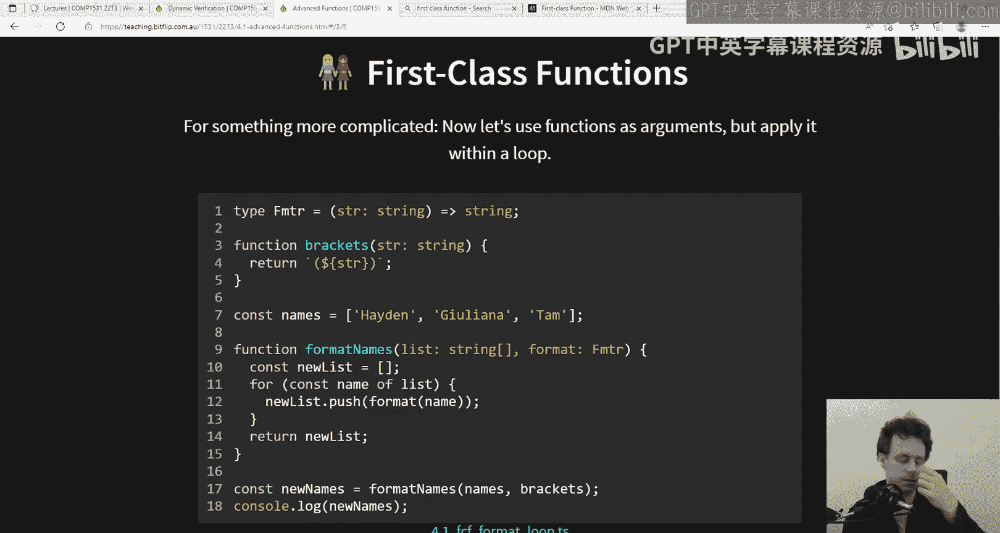

It's a little bit like the Json lecture a bit， like。It's mainly just trying to put words to things。

 but the actual difficulty of what you're doing is quite trivial。

 and a quick Google gets you there anyway。

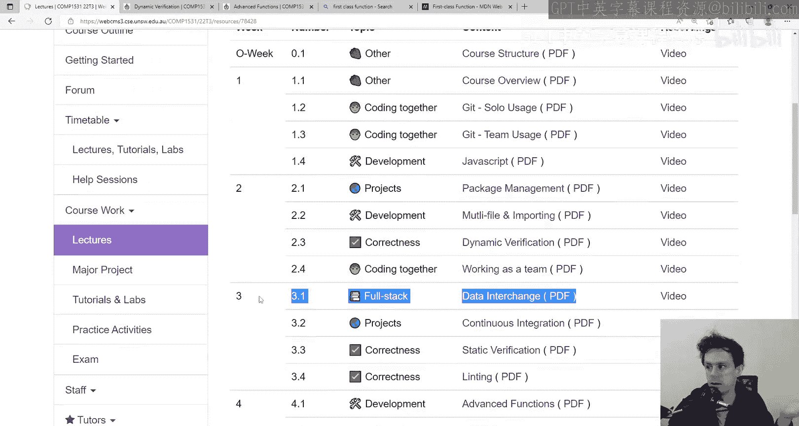

I'm going to call it there。 We do have a feedback。FormWe're going take a five minute break till 520。

 and then we're going to get started on the first chunk of the H TTP lecture。

 We're going kind of mostly cover the theory today and then hit the programming really hard tomorrow。

 It'll be pretty like a light for the rest of the afternoon so。Take a break。 Thank you。

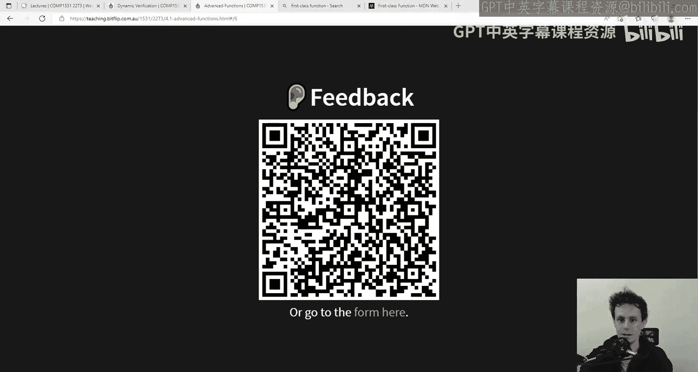