# UNSW《前端编程｜ Web Front-end Programming COMP6080 23T1》中英字幕（deepseek-R1 p23 -23-COMP1531 22T3 - 2.1 - 🌏 Package Management.zh_en -BV17RXGYuEaM_p23-

I've just hit record。 So we're getting started now。 Hello to everyone who's joining us live。

 Hello to everyone who's joining us at a later date。 We have 100 people here today。

 which is certainly， I guess， slightly more than we had last Wednesday。

 I think a couple of couple of quick housekeeping points in general that are probably of interest to people。

😊，Firstly， the Wednesday lecture this week is at a different time。

One of the plus sides of me working in industry is that I work in industry。 And that's， I guess。

 helpful for everyone。 The downside， though， is that I kind of have sometimes can't always commit to a lecture time。

 Sometimes we have to move it。 But if that does happen more regularly。

 I'm not gonna go like chopping and changing lecture times all term。

 we'll just use some prerecors or something like that。 So should be fine。

 but I appreciate your patience。 but again， it's always prerecorded。 And most of you watch it live。

 most of you watch it prerecorded anyway。 So it's okay。A few questions came up in the chat。

 Ana Tolly。Says， wait， will the lectures be online from now on。

The plan is to have them like generally online throughout the term。

 We'll probably do another one in person。 I think the default guess of when that would be would be week 7。

 but we're gonna play that by you， which should be fine。 right。

 That questions come up a couple of times。 Nikil says first submission on Friday Time to panic。

 You don't have to panic。 but you should certainly get your act together， Obviously。

 it's Monday today。 You've got a an iteration due on Friday， which is in， you know。

 four days are about。😊，Hundred hours from now。也。Is it exactly 100 hours。No，980 showers， right。

 something like that。 So， you know， be vigilant on that。 don't let time slip away。

 particularly for some of the Wednesday， Thursday classes。

 I know there are gonna be people who are sitting around who are going， oh。

 we'll wait to meet up with the group。 To be honest， iteration0 is really， really， really easy。

 So like a good group of people could do it in in two hours if they really wanted to。

 So I'm not trying to stress you at more。 I just don't don't make don't waste the opportunities you have throughout the week。

 right。😊，And last one， robotic says eating dinner， watching this。 And then someone else said。

 I'm hungry。Vorannova。 Val I hope I'm pronouncing that correctly。

 Why does the lecture have to be at 6。 I'm literally starving。 I feel the same。 I feel the same。

 I am hungry too， So if it helps it all， our incentives are aligned。

 None of us want to be here longer than we need to be to get to get the job done。 So on that note。

 let's let's get onto it a little bit。 So today's lecture is the first lecture in the broad based topic topics of projects and managing projects。

 And in particular， we're going be talking about package management。 what does that mean。😊，Not sure。

 But the reason we're talking about this is that if we want to fully util。

 if we want to fully util jascript， we need to understand how to install modules that aren't on our system。

 right， because it's not sustainable and scalable that。All the code we use is written by us。

 We're gonna have to use code written by other people。 So we need a way to manage that。

 We also need to find a way to manage that on multiple computers。 right。

 Think about this for a second。 at work。 We use a mobile device manager， sometimes called an M。MDM。

 and the way these M D Ms work is they essentially are a way of managing company computers。

 And if you've ever had a corporate computer， maybe you've had an internship or something or maybe you've worked somewhere。

 what they do is every time there's a new application， for instance， Microsoft Team。

 they can just go and kind of install it on all the computers in the company。

 So they have a way where there are these programs they want to install。

 but they can easily kind of distribute them to many computers as opposed to。

Having to tell everyone to。Download and install them。 You know， sending out an email or something。

 you know， which is kind of。That would suck。 Jed says N DM or M DM M for Mary。 It's M for Mary DM。

 I'm pretty sure it's MD DM。 There are probably other ways people refer to it。

 But a mobile device manager is， is what it is。 There， there are lots of them。 Google has one。

 Well Windows Microsoft has one。Lots of companies work with Apple to make them happen。 That's how。

 like， if you ever work， like， they're interesting things'cause this is totally unrelated to what we're talking about today in practice。

 right， like M M's and。Package management with jascript are totally separate。

 just talking about concepts。 But they're really interesting these MDms because this is how like when you get a like if you go get an internship at Google and you open up your laptop。

 you'll probably notice that you don't have to connect to the w-fi because it's already kind of preprogrammed into the computer Well we're gonna be chatting about today are the problems with packages in terms of like programs when we see packages。

 what we're really saying is that software that other people have written that we want to use in our software。

 we're going talk about NPpm or the node package manager， which is the package manager for node。

 which is the interpreter for jascript that we talked about last week。

 we're going to talk about what that is and how it works， how we can manage packages。

 and then we're also going talk about custom scripts。

 which is a bit of a lead up to the third lecture this week。

 which is the first one we'll be talking about on Wednesday。😊，So。Starting from this lecture。

 we're going to be working from a very slightly different folder in all the lecture notes。

 If you actually ever open a piece of code in the lecture notes。

 I'll find one here if you open it up you'll actually see if you look at the URL up here I know it's a bit small but all of the code in the course is actually sitting in this folder right you don't have to access this folder。

 but all the code we looked at last week was in this folder called M0 and this is all the code from kind of our 1。

4 lecture all the code for the next couple of lectures is going to be in M1 and it's like basically this week and a little bit of next week's lectures and the reason that I kind of have this disclaimer here is really just as simple as that as we layer on topics in this course。

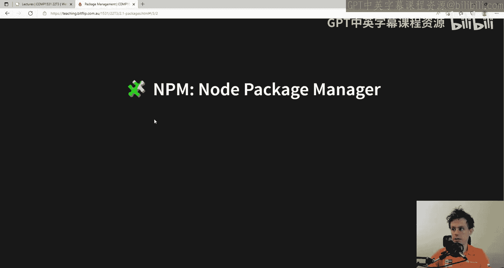

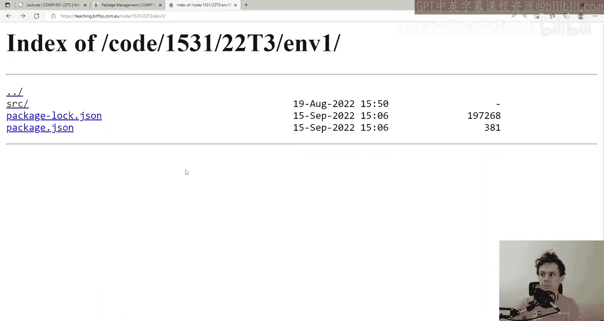

Things get a bit more complicated to set up。 Like in week 1， we were able to just be like。

 write some javascript and run it done。 whereasas in week 2。

 we start to learn a few more things We have to do。 Tony asked a great question。

 Do we need to set the environment ourselves。 No， you don't need to do anything。 We。

 we do it all for you when you view all the instructions。😊，I nearly don't like this lecture slide。

 because。It， no matter what I say， it will always confuse people into thinking that there's something more going on that they don't understand。

 But there's really not。 This is more like， we handle all of this for you。

 And this is kind of like an intellectual courtesy to say， hey， just letting you know that。

If you try and just run code from this section in like a week one style， it might be a struggle。

And just trust me on this。 Don't worry。 We'll come back to it It'll make more sense。嗯。

What are the problems we face generally when coding right sometimes we might want to use code that we didn't write。

 for instance， we might want to use a library in O JS， but this library wasn't built in node JS。

 I don't know what it says that。 This library wasn't built for us。

 This is an example of a typo that no one picked up on last term， but we've just picked up on now。

This library wasn't written by us。 Someone else on the Internet wrote it。 Yes。

 literally someone else out there on the Internet wrote a library。 One example of this。

 if you Google Javascript， how do I check if a date is valid， You know， maybe you have。

 maybe people give you a year a month and a date， right。Such as you know， the 19th of September 2022。

 which sounds like a valid date， what if someone gives you a date that is the 29th of February 2000 like 2488。

Now， obviously， you can do some funny things to figure out if that's a leap here or not。

 but wouldn't it be cool if someone else has already done the work for that where you could just punch in that date and then it would tell you whether it's valid or not。

 And you know what someone has done that work for us already in particular。

 people who wrote a library called date functions and you're already familiar with this idea of other people writing code because this is what you did in 1511 when you did hash include studioudio do H hash include standardlib do H hash include math do H whatever you know all these different libraries。

 you're used to this idea that other people wrote it and we need to pull it into our work。Now。

 the one difference that we have。嗯。Which I'll get into in a sec。 I'll probably just jump ahead here。

 But the one difference we have when it comes to jascript is all these different libraries that exist。

 like St O dot H。Like standardlib dot H， these weren't these aren't already installed on the computer。

 and that's a little bit different to what you're used to a see And see there are all these libraries out there and you kind of knew that。

 but they were already on the computer。 You didn't have to download them like you have to download a program on the Internet right from the internet。

So if we look at this is valid function from the date functions library。

There's quite a few things going on here。Import braces and whatnot。

 This is how we can actually use it。So I'm going to write a function called dateate is valid。

 which takes in a year a month and a day。And then that function is going to return。

Is valid of a new date where I give it the year month and day。

And this is valid function comes from a library that I hash included or imported called is valid from date function。

 So this line here is a little bit of new syntax。 A lot of this here is like kind of new。

 kind of similar， we could play around with this a little bit， you see this。

 there's this new date code here in Javascript。 If you just open up the interpreter。

 right if I go a new date 2022。

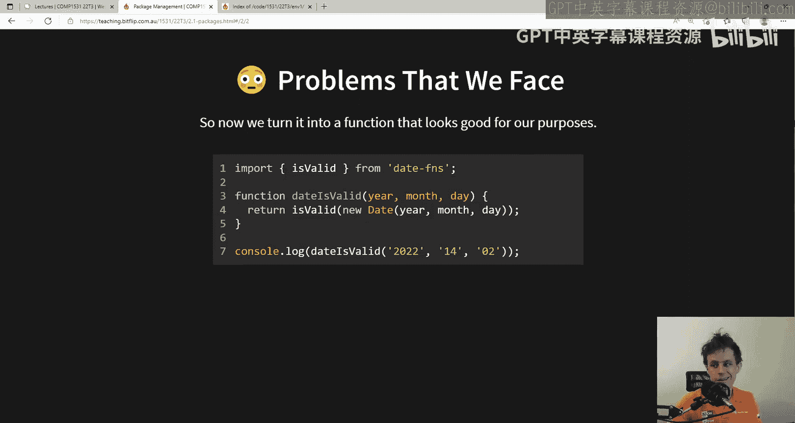

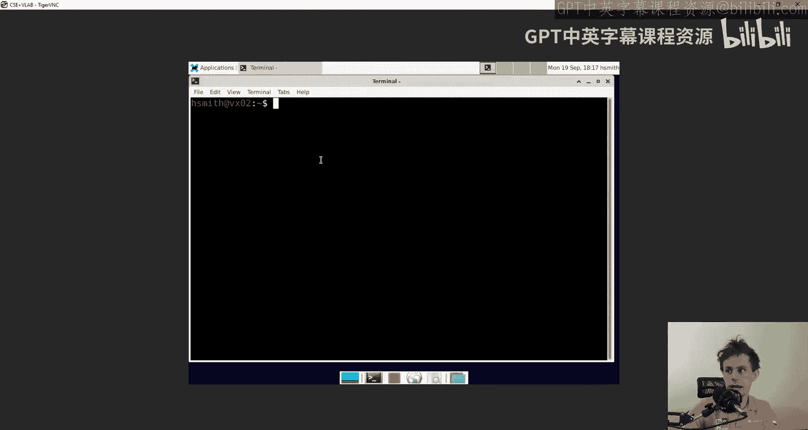

0，9，19 or today's date。 It actually creates some kind of object for me。

 which in this case is today's date。 So this is really like a way of creating an object in jascript that can do a bunch of things。

 It's a little bit like a jascript string， which we talked about last week where like jascript strings。

 you can you know replace characters in them and make them up a case and add them and slice them It's an interesting object。

 And it's the same thing in jascript with dates here。

 So I can go and create a new date from the input that I'm given 20221402。

 And then when I call this function。😊。

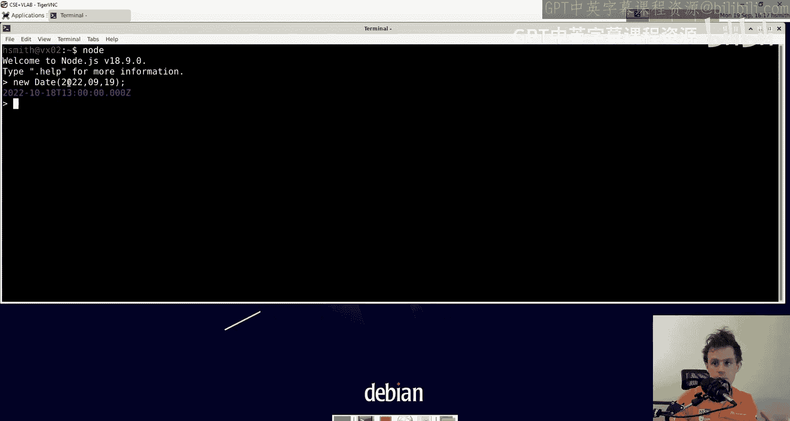

I can call it on is valid and it should work， but when I run this code， we get an error。

 So if I copy and paste this code here， right， God， got rid of it。 whoop see， sorry。

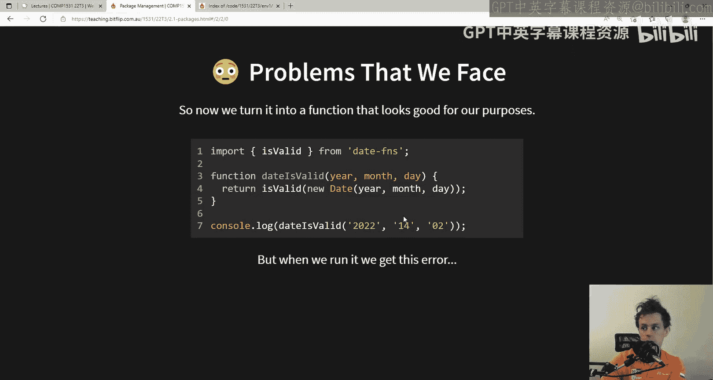

So if I go and say open a file， b dot Js， right， I I've already got some stuff there from last time。

 if I go and open this file and I paste this in。Watch what happens when we try and run it。

 Let me just print it out here so you can see it。When I go nodebl dot JS， I get this error。

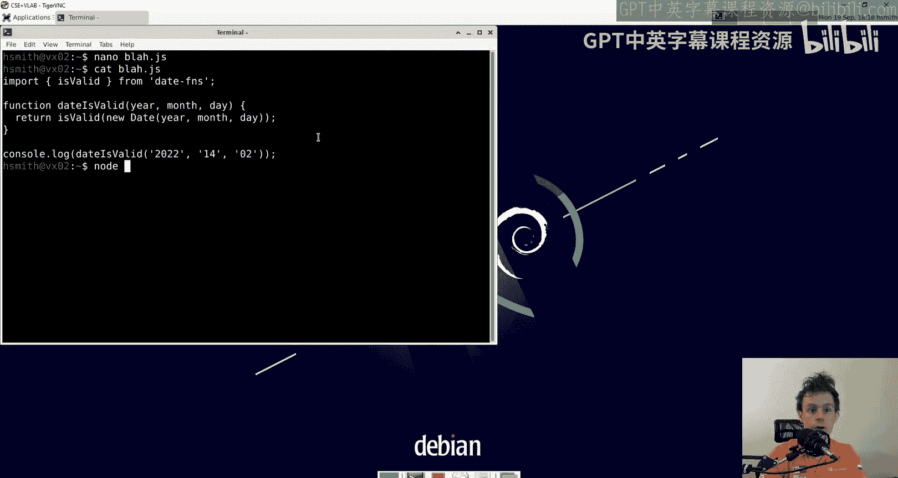

Now。Earlier when I said， this is kind of where the environment thing comes into play。 Earlier。

 I made a comment， and I said。We're changing environments。And I said。

 this may make some of your code not work。What this means is that from week to onwards。

The code that we run in week two needs to run in an environment that is essentially similar to like a week three。

 week four lab。Or something similar。Now， again， you don't need to worry about this because if you actually look at your week  two labs。

 your week， two labs are all about week1 content。 Actually。

 all the labs this week have nothing to do with what I'm going to say tonight or Wednesday。Right。

 it's all stuff from last week。 But when it comes to your next week's labs， that gets a little bit。

Little bit harder。 Again， that's not something you need to do because your labs kind of come pre configurefigured for the environment。

 But you can see that for me， it's not as easy as copying and pasting this code。 So typically。

 if you want to kind of run code from this lecture。

 you kind of just go and like clone a week 3 lab and just put the code in there， you know。

 clone it in a random folder。 for me here today， I'm just going to go inside。My M1 folder here。

 And I'm gonna， I'm gonna make this file called bla dot JS。Right。

And I'm just going to run it nodes s slash b dot js。 And it should run。

 And I get the error that I'm looking for now。 it says cannot find package date functions imported from this file。

 basically it's saying， hey， you imported the date date functions。 If you look at our file， right。

 it's up the top up up。There。Up， here， up there。It's trying to import that， but it can't find it。

 So we're instead getting an error。嗯。So。We get this error because， you know， date functions is not。

I'm asking the computer to import it。 And the computer is just basically saying to me W T F。

 what is that， I've never heard of it。 It's as if I kind of turn around and said， hey。

 can you import flying  lama？ It's like， I have no idea what you're talking about。

 That's what the computer is saying to me right now， okay。

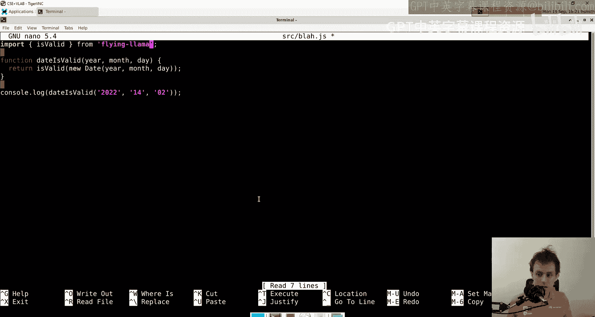

嗯。That's the error we get。不。Okay， I think I'm jumping ahead。Yeah有有，OK。

So how we solve this is that we need to install a package。Right。

We need to install We need to install this date functions to our computer and to do that。

 we are going to have to use NPpM or the node package management。 Now。

 when you install node on your computer， what actually happens is as part of that installation it also installs this program which is the no package manager manager manager which is a tool that allows us to manage dependencies modules and libraries for all of our jascript node JS stuff and there is a command line tool for it and in fact is pretty much there's only two command line tools that you generally need to be interested in。

 The first one is node which is how we run code。 the second one is NPpm。

 which is how we manage packages。 So node is about the executing of jascript。

 Npm is about the managing of jascript modules and pulling them up and down off the internet right So that's what that command is I just kind of rent there。

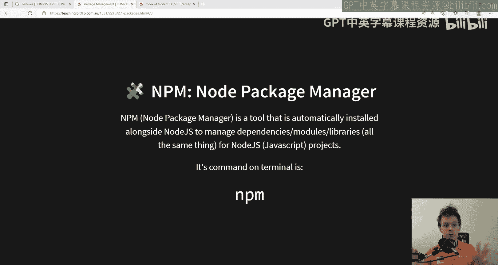

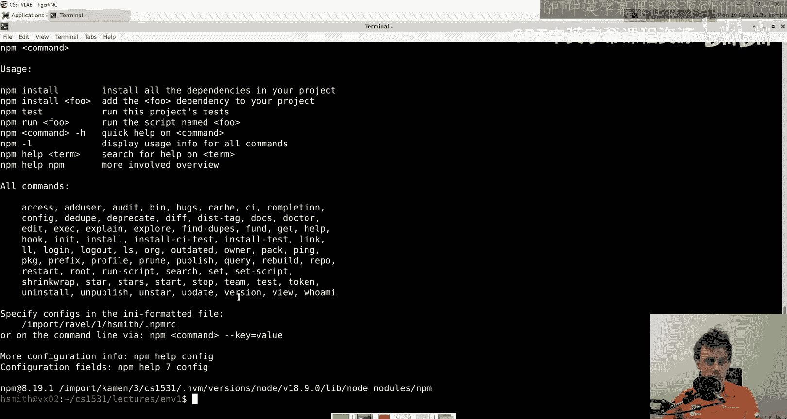

Most libraries that we want to work with do need to be downloaded。

And the cool thing is that all of the different pieces of like software or code that you could possibly use。

Are actually sitting up there on the internet on this website， the website is called Npmjs。com。

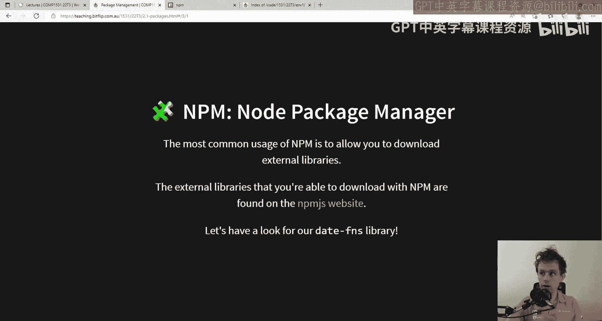

And this has every module that you could imagine， right， So like someone give me。

 someone tell me a problem they might want to solve on a computer。 I'll give you an example。

 password generator， right， Someone give me something like that。An idea。

 a problem that you hope that someone else has solved。Date functions is another good example。

 but you can't use password generator or date functions。 You're going have to give me something else。

 weather data。 Okay， that's quite interesting。 Let's try that one， weather。I search that。

 I get a whole bunch of libraries。 I see one here called weather， We JS， Open weather APIs。

That one sounds kind of interesting。A P I sounds nice。 Pro that word before。

 And now what we can see is we can see that there's this piece of software here that someone else has written on the Internet。

 and we can see a few interesting things about it， right。😊。

Some of the things we can see are that about 1000 people every week download this particular piece of software。

 We can also see that。This is what version is 4。4。2。

 So that's like a particular version that someone uses。 This is how much like it takes up，56 k。

 It's not very much。 This is the last time someone modified it。

 We can also go and check out their code。 because all the code for these is public。

 There is no unpublic code。 I can go to Github， which is another Git product。

 I can see a bunch of stuff here。 They give me a bit of an overview。 They tell me how to use it。

 They give me some sample code， a few other things like this， right So so super， super。

 super interesting。And we're gonna show you how you can actually kind of download one of these things。

 Someone else made a。You know， Bill said currency exchange rate， How much。

 how much can I convert Australian dollars to US dollars。 typicallyypically， these things require。

Yep， there you go。Now， for some more advanced things like this。

 you can see that like you can't just kind of run code to get the exchange rate。

 you kinda need to connect your code to services。Yeah。It that's， that's a little bit。

That's a little bit different。 Matthewu says， what was the equals arrow thing。

I don't know what you're talking about。Equals arrow。Not sure。So。

We can also look up this date functions library， if we want to。Right， and here it is date functions。

 and inside of this， it gives us all the information we want to know about date functions。

 Here we go。 D functions provides the most comprehensive。😊。

Yet simple and consistent tool set for manipulating dates in JavaScript and node Js， right？

Lots and lots of stuff。 You can go and read it， look at it。Stream is being a little temperamental。

 I'm seeing at plummet a few times。 So for those who are。Might pause it。So。Library to do stuff。

 D library， great。 They give us lots of information。Tell us how to use it and everything else， right？

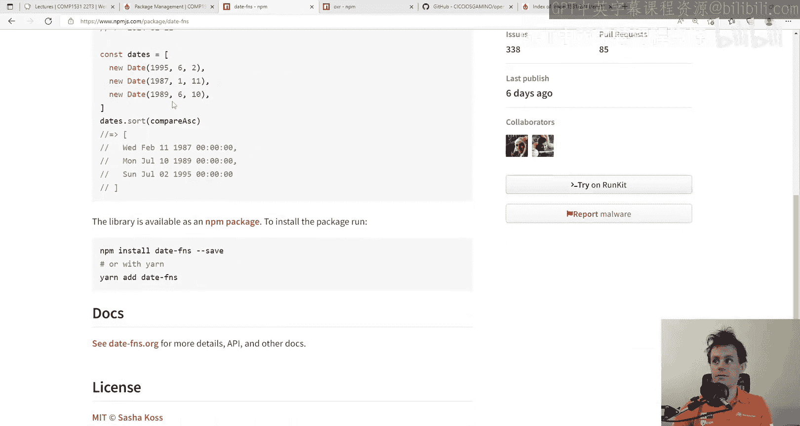

Cool， so we found our date functions library。 Now， here's the interesting thing about jascript。

 When you want to do stuff with NPM and when you want to install things， you actually need to， right。

嗯。You actually need to set up a project。Yeah。😊，And setting up a project。

 we kind of do this for you in the course in every lab and the major project， or if we don't。

 we'd give you the instructions literally and just say go do it。 There's no problem solving involved。

 But what I'm going to do right now is give you a quick demonstration。😡。

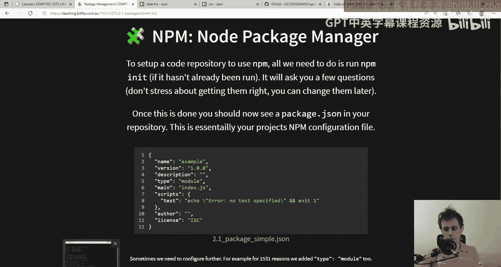

So I'm just gonna go create another folder， and this folder is going to be called test。Right。

 like this。 And what we're gonna do is we're going to create an NP PMM project。

 An NPM project is just saying， here is a bucket。 and this is a bucket of code that I'm going manage with NPM。

 And I'm gonna write jascript in that bucket。Right， and we do this by going into a new folder。

 you see there's nothing in here。And we go NP PM and knit。 So just like with Git。

 how we have Gitardd Git commit， This is like NP's the programme like Git like node。

 And then a knit has like the command。 And when I run that。

 it's going to ask me basically a bunch of interview questions。 It's going to say。

 what is your project called。 You know， what I might call it， you know。

 what do we think it was like flying Lama。Right， it's called flying Lama， version 1， bare enough。嗯。

You know， description， I'm gonna leave that blank entry point。 I don'n know what that is。

 So I hit enter test。 I don'n know what that is。 So hit enter Git repository。 Well。

 I don't have one yet。 So I'm gonna hit enter keywords。 I'm gonna hit enter。Auththor。D't know。

 Hayden。License， I don't know what that is。 I'll hit enter。 It gives me this。 Is that okay。 Yep。

 I hit enter。 And then what it's done here is if I L S。

 you'll see there's a new file here called package dot Json。 And if I open up package dot Json。

 you'll see that there's， there's essentially this like little configuration file。

 We talk about what Jason is as a language next week。 JSO N。 So for right now。

 don't overthink it too much。But。It is just a configuration file。

 It's a bunch of instructions that define our project。 Now， because we have this file。

 this package dot JSON is essentially the cornerstone， the fundamental part of our project。

 we can start using other NPM commands here。So if we go back to our slides after we've gone an install oh。

 by the way， one thing you do need to add if you create this from scratch is this there's this line here called type module。

Again， you don't have to ever add that'cause we add it for you I'm just shut sharing with you what we do to set things up。

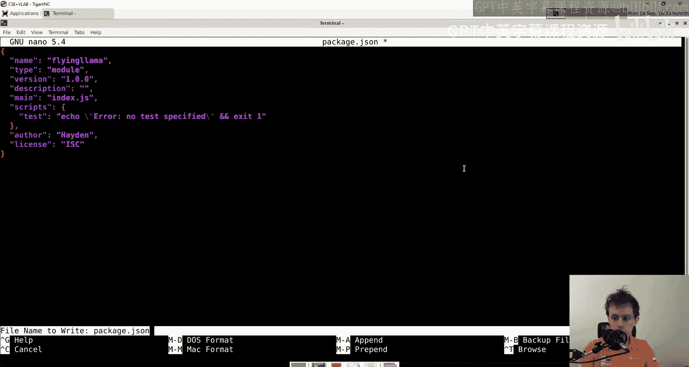

What I can do now is I can actually start trying to install modules。Right。

And I can do that by saying NPpm install， and then I give it a library name。Cool。

 we've seen a few libraries so far。 We've seen like open weather APIs， and we saw that other one。😊。

N FX or something。 And now we're going try and install our date functions library。

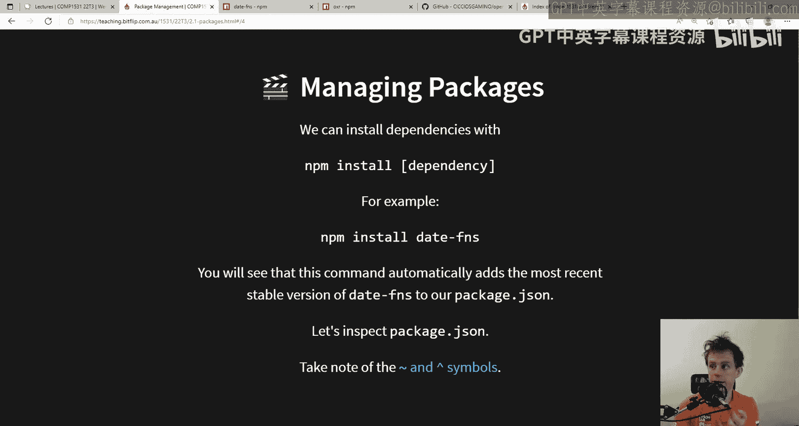

So I'm going to go NPpm install。Date functions like this。

And what it's doing right now is it's pulling literally pulling code off the internet。😡。

Down onto my computer， Bblline says， what do you mean by dependencies， dependencies， packages， code。

 it's all really modules， libraries。 they really are all the same way of saying like a packaged up piece of code that someone else wrote。

Right。Yes， you can do this from the terminal。 That's like what we just did。 So in this case。

 I've gone and installed something。

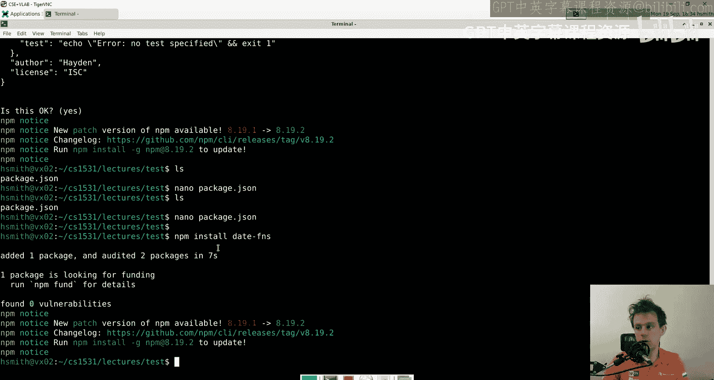

Installed it straight to the computer。 And what you'll see。

 and this is quite interesting if I open up my package dot Json again。

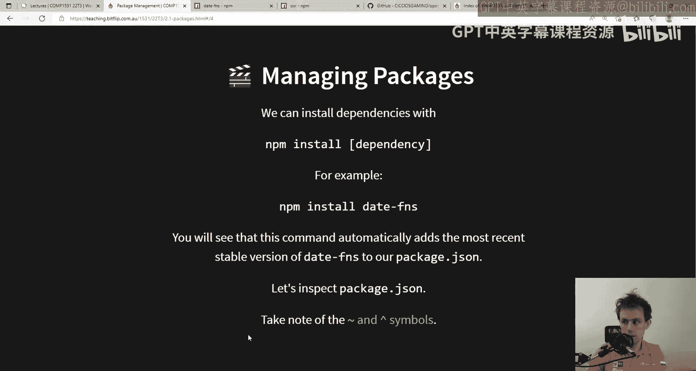

There's actually an extra few lines here that I don't know if you are paying attention to。

 And this is these， this is the dependency lines here。

 So what this is actually saying is package dot Json has actually kept track。

Kept track for me of what I have installed。 It has gone and modified the file for me。You know。

 I don't have to modify。 It's gone and modify it for me。 And， in fact， let me open up a text editor。

For this folder here。

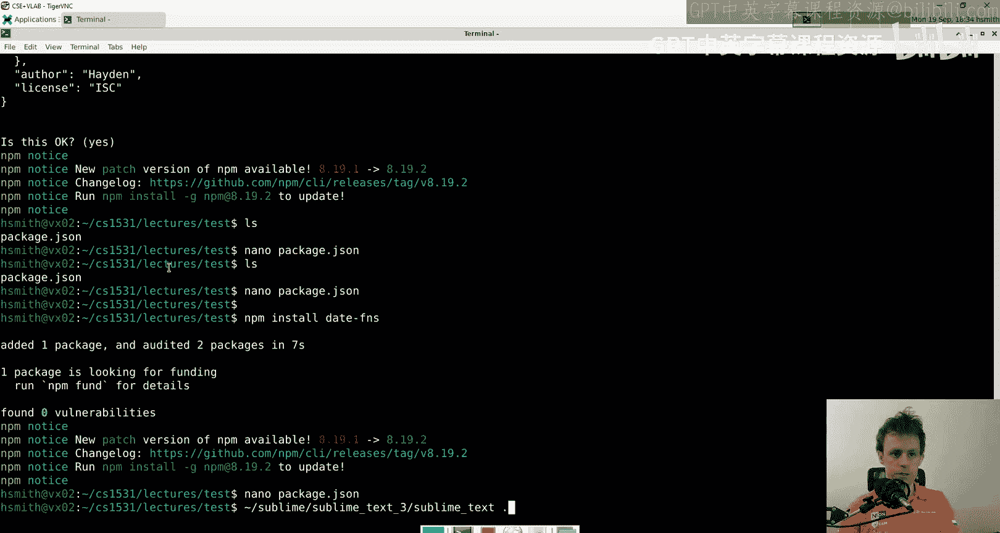

I want to inspect a few things with you。

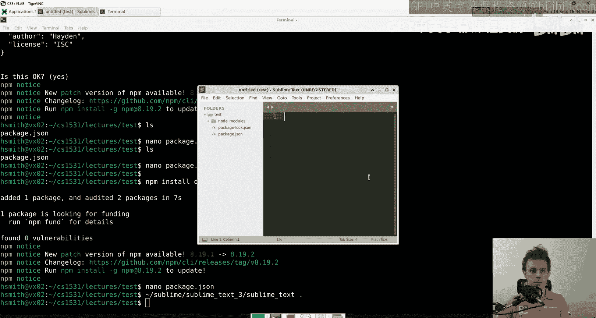

Just got to make this the right size。Gotta make this the right size。Yep， like that。

And what you'll see is if Ilook here my package dot Jason， I have this here。

 Let's see what happens if I install that other library we talked about open weather APIs。有。

Watch this when I refresh my file， you'll see there's another line there。I can actually remove that。

 I can actually remove this library too by saying NP PMM， I think it's uninstall。Open weather APIs。

Now it's gone， right？ So this package Json is kind of keeping track of what I have installed and what I have removed。

 So at all times， it kind of is just saying， these are the list of this of software that you downloaded to make your project work。

 Now， there's some good questions coming up。 Matt， sorry。I oftened hit my keyboard at the same time。

 That was really weird。 Mattheww says， are the package is only for that directory or can you go to another directory and still use the same packages without installing it。

 So when you have a little NPM project， those packages exist within this folder I'm in here and all subfolds。

Right。So it's it's like， it's like here and everywhere under me。 It's not like on my computer。

 It's kind of like in a box。 And that box is this folder and everything else。

 And then Adam Bench asks another question， which is。

 how does it How does it know the correct package to install off the Internet。

 What if the package is a named the same。 That's a really good question。

 You can't name the package the same as the short answer。 It's the really short answer。

 So if someone comes along and wants to name a package D functions。 You can't。

 someone's already called it that。 I have a package out there that I think is。

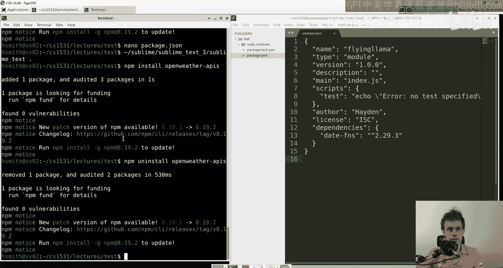

Oh， I can't remember what it's called。But I should have something。There's one we， there's1 I。

 I wrote with a tudor for 1，5，3，1。 Oh no， what's it cold。I can't remember。

 I don't know how to look up a user。But like I wrote I wrote a package。 It's like five lines of code。

 It's not that exciting。See if we can look up who wrote this。So I don'nno。

 I'll have to find it later。 I can't remember what it's called， but。React reveal。Nope。Reveal react。

There we go。So like this is， this is 1 I wrote for fun。 I just to learn more about NP PM a while ago。

😊，This is what it's called now。 So like， someone can't come along and create a project called reveal React。

I don't think。 So that's how you avoid the conflicts is that essentially。

 there's just one library called something。 People can change it like I called this one reveal react because what what I wanted to call it was react reveal。

 But someone had already taken that one。 So I couldn't use it， right， you know。

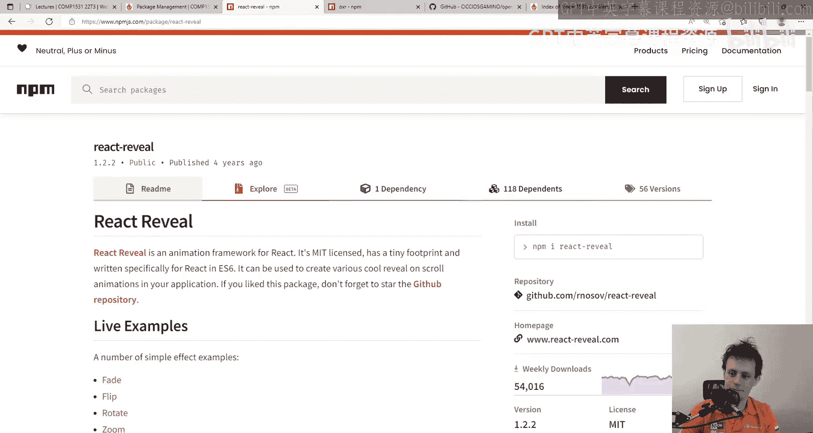

Yeah， now there's a few more questions， but let me。Let me unpack a few more things。Right。

Couple of things。 Let's go back to the slides。

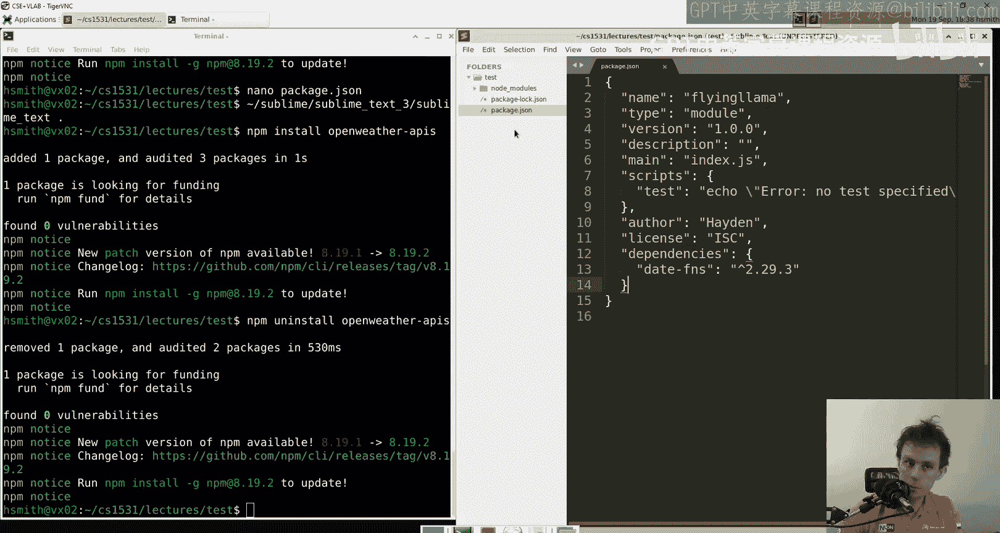

Firstly， our code will run successfully。

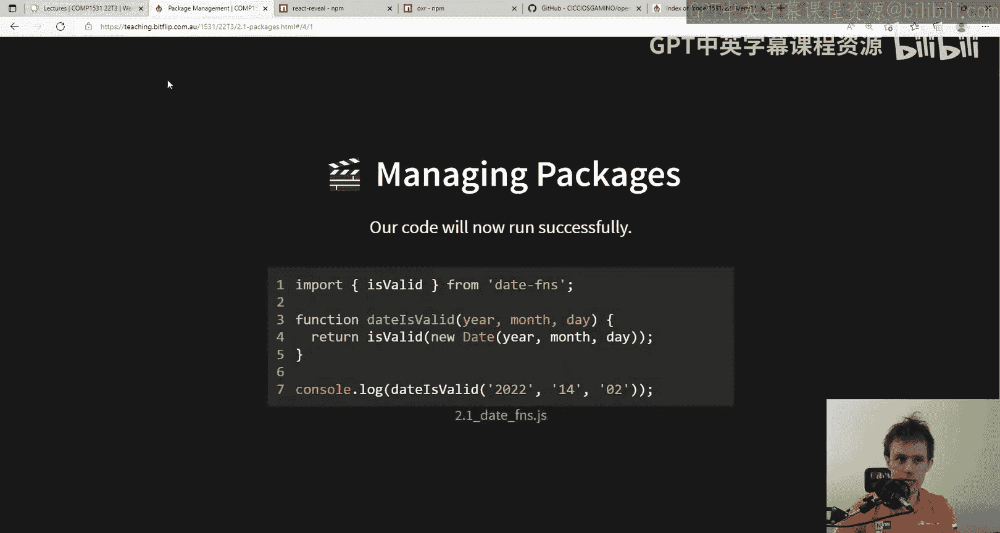

So if I go and take our code here and I make a new file and I call it you know， dates dot Js here。

And then I run it， no dates。 js。It works now。 It says that this is a valid date。

I don't know why 14 is a month is valid， but that's okay。 It says it's a valid date。

 We could try and print that out。 Let's see what date it produces。 So I'll say， you know。

 console log here， Oh like cons date equals that。 And then we'll just check if that date's valid。

 And let's， let's console log the date just to， you know， get more familiar with it。Okay。

 it says 2023， third of the first。 So how jascript date works is that if you give it month 14。

 it just rolls over。 It just overflows into the next thing。 So in this case， it's overflowed。

 It looks like into。Mlanunch。Yes。Yeah， dates are dates are weird。

 Try and avoid dates if you ever can time zones。Lpias， it's a whole bucket of bucket of fish。

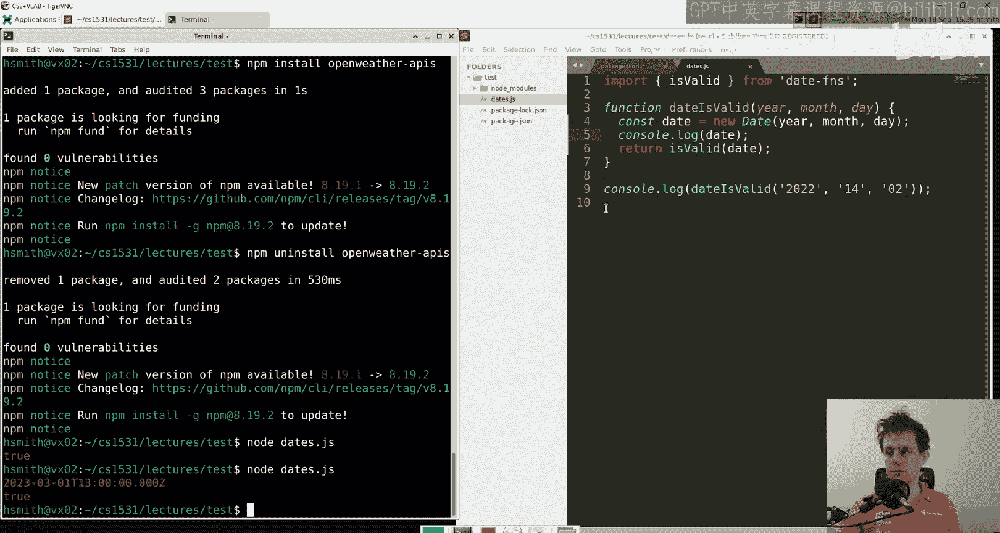

Okay， so our code works now great。 like mission accomplished， because when we went。

 when No tried to import date functions， it was already installed。 This is a good thing。😊。

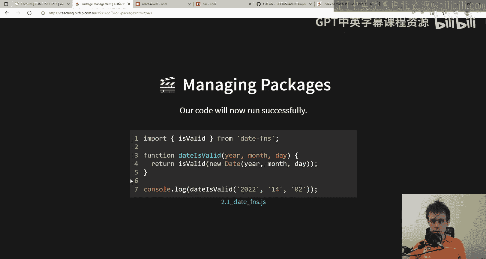

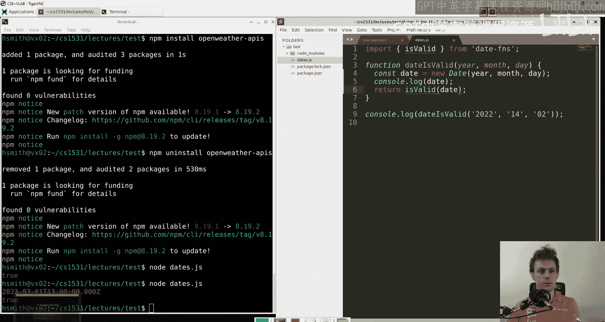

Now， what we want to do is decompose what's actually going on here。 Were。

 in there's three key things we've got to look at。 We've got to look at the package dot Json file。

 We have to look at the package dashed lock。

Dot Json file， And we need to look at the node modules folder。Now。

 the package dot Json is very simple。 It is the blueprint for your project。 It is that simple。

 It is like。It is like the recipe。 it tells you， it's。

 it's something that you could take and take it somewhere else， and someone could reproduce it。

 And the recipe analogy is quite good， because。You know， if you think about baking some cookies。

You know， flour， water。 I don't know。 What goes in cookies， butter， butter and sugar and flour。

And egg。Yeah， I'm sure there are manyvari cocoa。 Yeah， true。 depends， depends what you're making。

 I guess vanilla doesn't matter。 I'm thinking about cookies now。 my God， I' forgot the cheese。

Very funny。 I get a 10 out of 10 milk water。 I'm not gonna get into food science， but。Copenha。

You have a recipe， and then you go and buy the ingredients and you get the ingredients together and you make some cookies。

 And what you really got to think about with this package dot Json is it's the recipe。

 It's not the actual sugar。 It's not the actual butter。

 It's just the instructions that tell you how to make the cookies。

 So it tells you know what this is called。 It tells you like what version it is。

 It tells you what you need to install to run the code。

It also kind of technically tells you a few other things that are a bit more。A bit more in depth。

 But this is the instructions。 The actual ingredients that you buy， you know， the sugar， the butter。

 the actual stuff is sitting inside this node modules folder。 And what this node modules folder is。

 is it is the folder that stores all of the stuff you downloaded。

So if you cloned this repo and then I cloned this repo and then our friend Boonrich cloned this repo。

😡，We would all have the same package dot Json， but when we installed the libraries like date functions。

 it would get pulled onto each of our local computers separately， To separately。

 You don't need the internet to run it anymore。 We've downloaded it。

 and it stores that downloaded package or library inside the node modules folder here。

 and if we go inside the node modules folder， you will see there is a folder called date functions。

This is what we downloaded。You know， and all the code that someone else wrote is inside of here。

 and there God， there's a lot of stuff there。

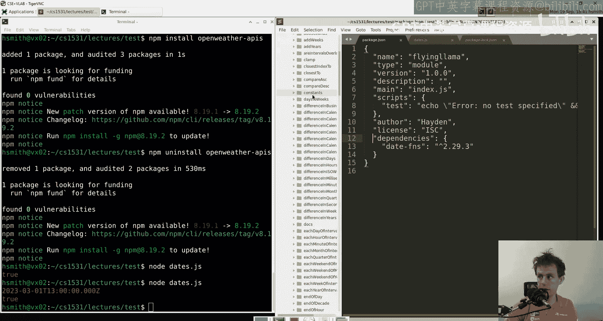

Right， but you know， it's interesting。 If I go back to the date functions。

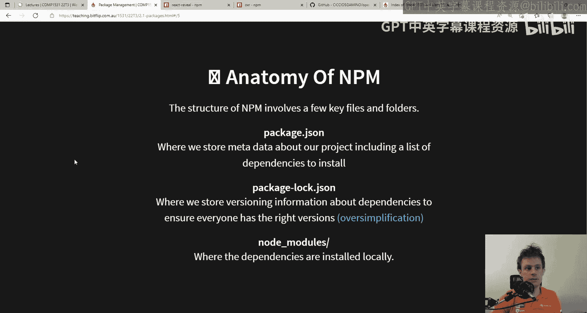

Stuff on NPM JS。And then I actually go and look at the code。

 Let's go to Gitthub and look at the code。😡，You'll see that it's a little bit。I can't。

 This library is more complex than。I won't get into that， but basically。

 there's like a compiled version of this code that we just downloaded。

 This is not the compiled version。 There's like， there's like a compiled version that's uploaded to the NPM website。

 but that's okay， but。

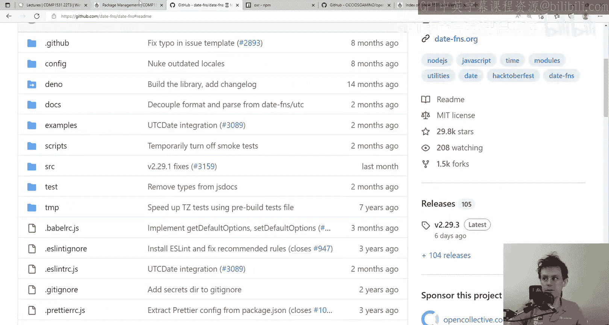

This is all the stuff to make it work， and。What's really interesting is。

 let's have a look at our code。 We down， we tried to use the is valid function。嗯。

And what we'll probably find is that there's actually an is valid folder。 perhaps maybe not。

 Depends how they've structured this。Is titeveva。T tu。The， yeah， is valid。

 And you'll actually see that in the like the main file in that folder。

 there's a whole bunch of stuff that's not gonna make any sense。 But you will。

 if you look really closely。 you see our function here。

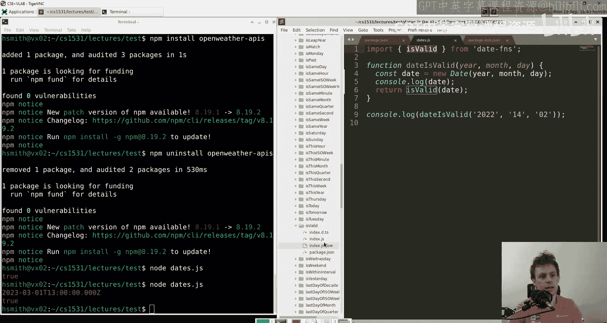

Cold is valid。And it's got a whole bunch of very confusing code in it。That doesn't make sense。

 This doesn't not make sense because you're a bad jascript programmer。

 There's a lot of reasons why this doesn't make sense。

 but the short story is that this is very similar to like machine， not very similar。

 this will give you a similar field to machine code in C when you compile it。

 It kind of compiles it into gibberish that a normal person doesn't understand， but a computer does。

 right， don't overthink that analogy and smart people will think I'm done for saying that。

 but it's kind of how I think is the easiest way to think about it。 right So no。

 it is not compiled technically， but it's easy to think about it like of a compiled code that someone wrote It's all sitting inside this node modules folder。

Yeah， and this is really interesting because what it means is that you can go and take this package at Json and install it yourself。

 And， in fact， if we just do that quickly， I don't know if I've logged into。

 Ive gotta sign into Gitlab。How many， how many characters are I。Passh， has anyone figured that out。

 got ears。H， so if I go and make a new project。Call it。Week 2 NP PM， right， I'm gonna go make it。

 I'll go put it in my folder again。I go and create that project。

 And then what I'm gonna to do is that。I'm going to clone it and let's just copy the files across。

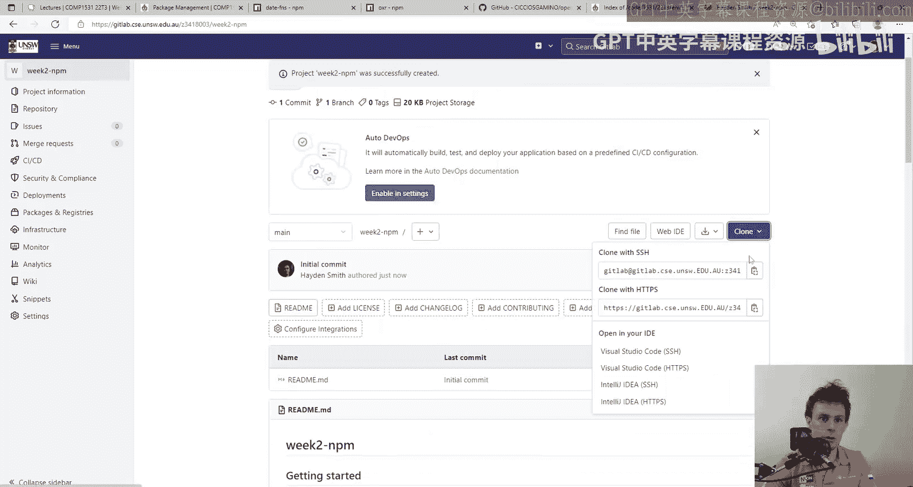

Right， so let's， let's imagine I'm gonna make a new folder called test 2。Yeah。

 and then I'm gonna go move everything in across。Just to get out of the way。有。

So I've got this new folder called Test 2。Which has got all the files in it that I had before， right。

And what I want to do is I want to now push this up to Gitlab。Right。

I go Git status and I see all these files here。 and what's interesting is that what I want to do。

 And again， we do this for you already， is that I want to push some of this to Gitlab。

 but not everything。 And in particular， I don't want to push this node modules folder because the node modules folder is kind of big if I look at how big it is。

It's 34 MB。 That's massive。 That's like。How like， how big is a song these days。

 Like most songs I have on my computer are like 5 MB and like， small pictures like。I don't know。

 a megabyte or two。So that's massive。 That's like 20 minutes of podcast or something。

 And why is it so massive。 Well， frankly， there's just a lot of code。It's just a lot of text。

 It's a lot of stuff there。Does it matter how big it is， Probably not。 But the point is。

 we don't want， we don't want this being pushed to Gitlab and then everyone else having to like damp clone it all the time will be really massive。

 So what we actually have is we have a file。 This is like a little bit of extra。

Knledge there's a file you can create called a get ignore dot gi ignore。

 and if you actually put particular file paths or files in there like this， this is just a text file。

 nothing fancy。

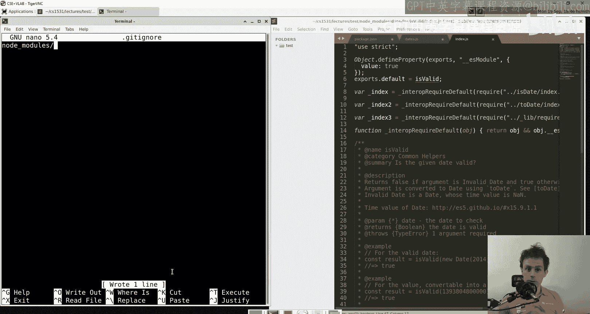

You'll see when I go to Git status again， that file has disappeared from Git。And it's like。

 I don't know that it exists。 You've literally just told Git to pretend like it doesn't exist。

 So that node modules folder has disappeared。Now， what I'm going to do is I'm going to push all of this up to Gitlab。

 and I'm going to do it with a shortcut method that I do not encourage you to ever use。

 which is Git add dash， dash all。 that will add all the files to Git。

So now we've got these four files and I'm going to commit them and say， like， you know。

 initial test commit for dates program。 Then I'm going to push that up to Gitlab。

 And if I go back to Gitlab， my files are going to be there。Right。

 but here's the interesting thing about why we use NP PMM。

 It's not just about installing the modules。 That's awesome。

 The fact that you can look up some code and you can just write NP PMM install the name of the code and it will install it。

 It's also because watch what happens here。 if I delete my code like this。😊。

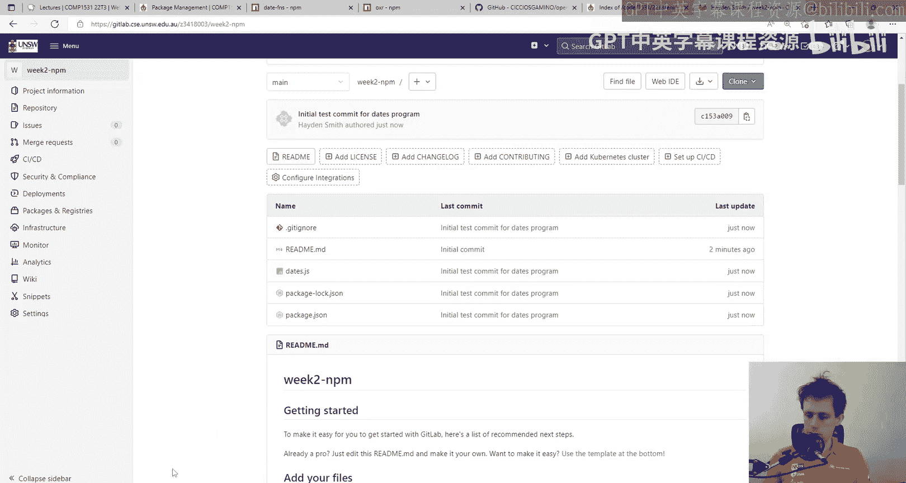

And then I clone it again。 So it's gone from my computer， and I'm going to recreate it now。嗯。

Sometimes it does that。 What you'll notice is that if I go to run my code dates dot J。 S。

 it won't work。 It'll say， I don't know what this date functions package is。 It gets really sad。

 right， It's very sad。 So if I open up my text editor again。

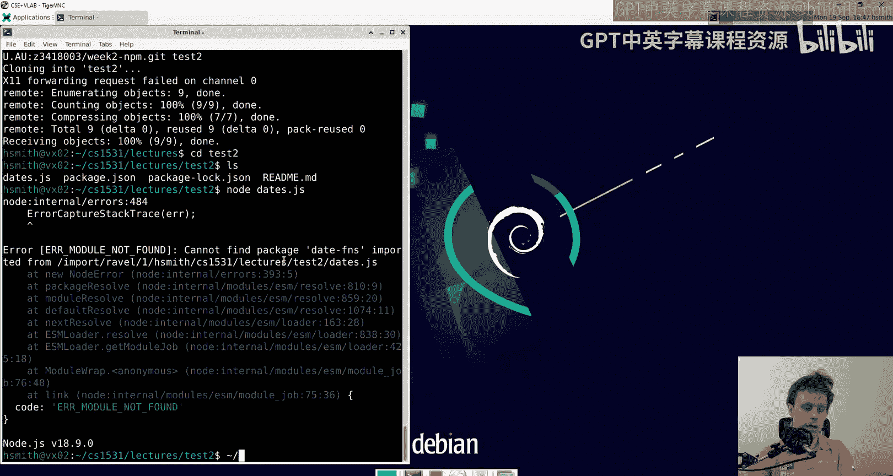

People ask me， why don't I use V S code， The reason I don't use V S codesca I historically was fairly poor and I didn't have nice computers。

 And V S code was really slow on my not nice computers。

 So I'm used to using these lightweight text editors。 and I am a dinosaur to some extent。

 but I will come around to the the good side。So I've got this file here。😡。

But if you look at my package， dot Json。Notice that the date functions is in this file。

 The ingredients list for the cookies， right， They're all right here。 dependencies。

 And this is useful because if I on the command line now， just write NP install without any。

Thing to install。 I just write MP PMM install。 What it will do is it will go and open up the package dot Json。

 It will go and find all of the dependencies。And it will install them one by one。

 which in this case is just one of them。So I run that。 It's gonna install date functions。 Now。

 you can see that node modules folder just got created up here。

And it's gonna be installing everything inside of that might take a minuteca it's got to actually。

 you know， download the files。 And now my code runs。

So the reason this is interesting is because what this means is that when you're working with a group of people。

You don't only just have to。Like， if you want to install a new module， and I'll show you， like。

 if I install。Open weather APIs。Like this， it will update the package dot Json。Opne。

 open weather APIs。 It'll update the package do Json。

 And if I get status because that package dot Json has been updated。I can now commit it。

Open weather APIs。 I can now commit it and push it。

 And what this means is that when my team member goes to pull from master。

 they can just run NP PMM install， and it will automatically download these new things that are needed to make the project run。

 So it's really a way of just managing， tracking the fact that your code will often rely on many。

 many libraries。You know， and here's the interesting thing。 Before。

 when I opened up the node modules folder， you would have seen that there was the。

 the date functions folder。Now， when I open it， there's two， right。

 But let's see what happens when I install a more interesting library。

Loaded a less interesting library， like the one that I wrote。 What was it called。

 was it called reveal react， thing was called reveal react。 This has nothing to do with 1，5，3，1。

So I install that。I don't know how big it is。We'll find out。It's probably verypy。

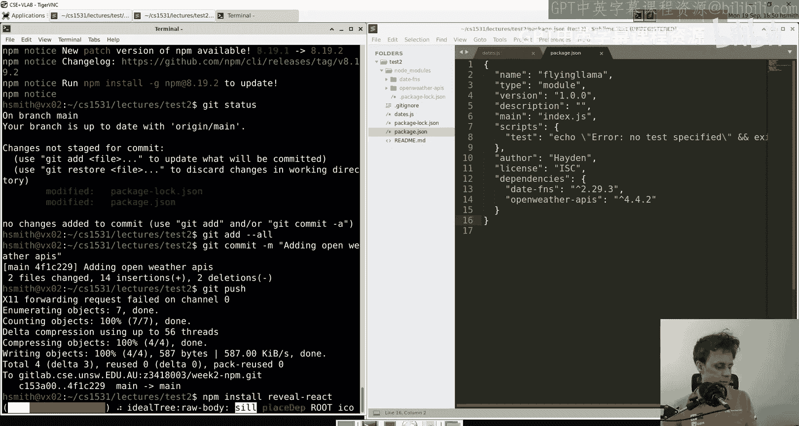

Big is not a good thing。 Big is generally a bad thing。Very slow。Look what has happened。

 My node mods fault is massive。 Look at it。Look at all this stuff we have。Why is that the case， Well。

 now I want to explain this to you， so。Every single module that exists on MPM。

 there's kind of two key things that matter。 The F Yeah， phoneul number。 yeah， I don't manage it。

So the first thing is how many other modules。Do I use to make my module work Because remember。

 when people write these modules， they don't just like make all their code from scratch they're writing modules using other people's modules。

 Like if you go and make a library to help you manage something you're probably going use someone else's library and you know it chains on forever。

 So there's a notion of dependencies， this date functions library。

 how many other libraries does it use， you know how deep does that tree go。

 And then on the flip side， how many libraries use this library。😡，Right。

 so we can see here that date functions does not use anyone else。

 It's all just the code written by date functions。 It's a very pure， simple library。

But there are 12000 other libraries that use it。I think， directly。

It's probably direct usageca that's actually not that many。 I don't know why that's， that seems low。

 But as Julian has pointed out， yeah， there is 15 million downloads a week right now， I'm。

 I'm no mathematician， but I can use Google。7even days， 24 hours a day， 60 minutes in an hour。

 60 seconds in a minute。25 times a second， someone installs that off NPm。你那。That's really fast。

That's like a car idols at like。1200 drives per minute。

 That's like as fast as your car engine is going， you know。It's a lot。A lot lot right， crazy。 This。

 This is why this stuff is so interesting because like the scale of what goes on with modern。😊。

You know， product based software。Is quite extensive。But let's look at another library。

 like open weather APIs。This library。0 depend。 So zero dependencies，10 depends。 Now。

 let's look at my stupid library that I is bad，8 dependencies in one dependent。Okay。

 it relies on a few things。 It relies on this library called Next。 When I click on next。

You'll see that next has 19 dependencies。It's a lot of stuff style JS6。Who knows what these do？

 That one doesn't have any dependencies。Use sink external saw。 I du't know。 No。

 I don't know what these do， But you can see it kind of ripples on like a， like a tree， you know。嗯。

So that's why when we installed my silly library that I have up on NPM。

 it's got all the stuff here because that library would have used， you know。

8 libraries and those8 libraries。 A couple of them would have used 50 libraries and those 50 libraries would have used a bunch。

 And you know what， Just installing my library。 Let's have a look at how much space is now being used on my computer。

274 megabys。Right， massive。 It's huge。You know。But， you know， if we're building stuff in Javascript。

 we're generally less interested in like。Efficiency。Less interested being the key word。

 not not interested。Okay， so。We have that。Cool。There's one elephant in the room。

Package lock dot Json。 we're not going to talk about this because it's a bit over our heads， but。

Essentially。um。I have a description of it in the lecture slides。

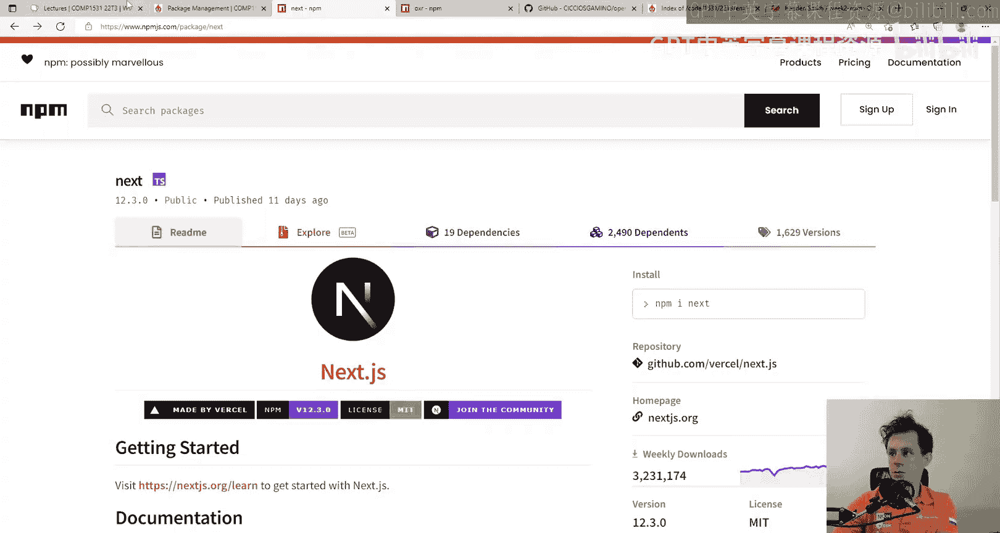

Package lock is where NPM stores versioning information about dependencies to ensure that everyone has the right versions。

When you have lots and libraries and lots of upgrades and lots of。

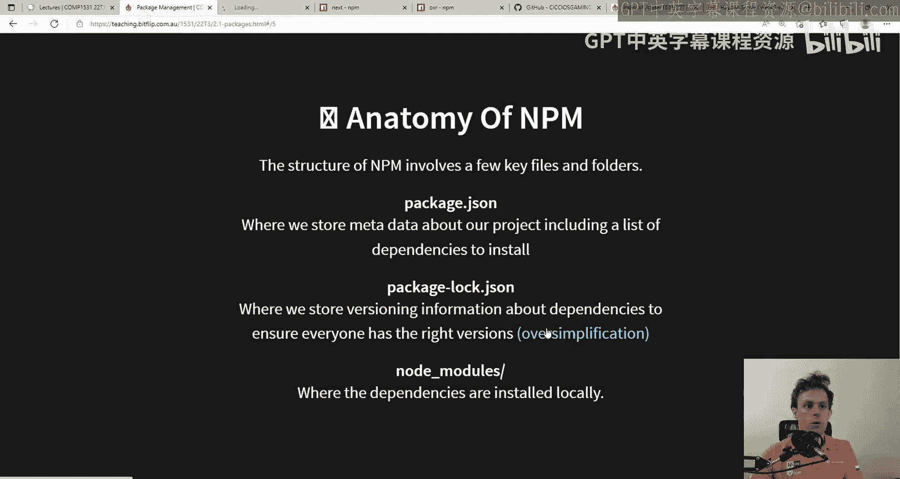

Why did you remove that？I'll go and update that link。But。They probably changed it。Yeah。

 here go Pack lock is automatically generated for any operations where NPM modifies node modules or package or Json。

 It describes the exact tree that was generated。 Essential， it's like。

 it's like a detailed description of how everything came about。 Again。

 it's beyond the scope of what we're interested in。

 but it's how you can deterministically install stuff because like what happens like。

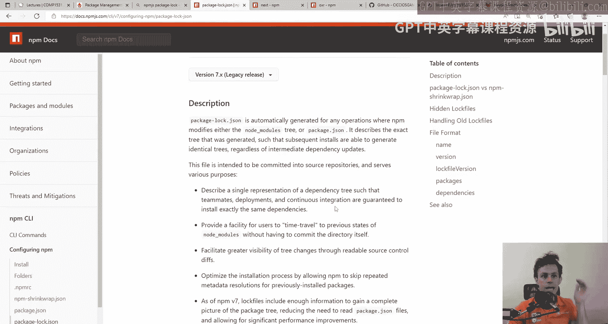

The last thing you want is to have like 10 modules。

 And then everyone in your team installs them in different orders。

 There's some weird things that can happen。 It's a necessary evil， just based on this type of。

Package management。 And we just always have to commit it。And we always just have to include it。

 And you'd never have to touch it。 In fact， you rarely have to touch package or Json anyway。

 Most of these three files are just done manage for you。

 I'm just including them to explain what's going on。 And very simple。

 package something is committed to Git。 node modules is not committed to Git。

 That's really as simple as it is By committing this information。

 We basically ensure that our environment is reproducible。 That's what we're really doing here。

 We're not just installing stuff。But the two package files are there to make sure that other people can reproduce exactly what you've done and that's really the key to it。

😊，We'll we've got a couple things before we take a break。

 There are a few interesting questions that came up。Tony says。

 can we use the functions online for our lab slash project slash exam， yes。

What actually happens is that during your labs。 And again， this doesn't happen till week 3。

 We teach you the lecture stuff in advance。 What actually happens is that。In your lab。

 you will NP PMm install a library to use it and then you'll commit your package dot Json。

 And then when we run the audit tests， we install them for you。 So literally。

 you've told us how to reproduce your work。So we can go and market it， right？嗯。Matw says。

 so should we regularly be using NPM install when working in a group？ Yeah， it's a great question。

 so like。Generally， your group。But the net， this isn't for now。 This is like for future work。

 General， you won't be installing much， right， You're not gonna be installing stuff every single day。

But usually， it's a good idea to MPM install after you get pull。But to be honest。

The scale of group you have。You can probably just not install until there's a problem。But'cause you。

 your code just won't work。 It'll be like， where' is this And you'll be like， oh。

 maybe someone installed something， you know。So you just go and do that。Julian says。

 can we somehow make money off uploading libraries to NPm somehow。啊。No， it's all public code。

 like all the code and not that I wrote much。

But like， if you look at， if you look at my dinky library again。um。Thiss actually the library I。

 I use to make these lecture slides。 So I， well， I didn't make the library。 I。

 I just manipulated it slightly for me。 There's not much code， right， like。Why is that not public。

 I should probably make that public Oh God， okay。Well。

 there's meant be meant to be code that's public。 I feel like I've violated a rule by not doing that。

 But yeah， the point is that it's all pub。 It's meant to be public。 I guess you can hide it。

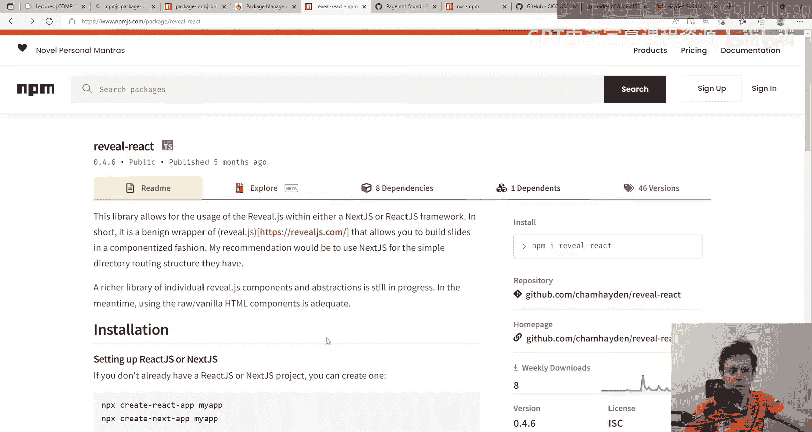

But， I mean， someone could just look at the code， too。 You can just like。

 literally go in and look at like the whole library。That was written here。Where is it River， river，嗯。

Re you react。You can actually go and see it。 There's literally like one， maybe not。There's one file。

 That's the entire library。 I wrote that。 That's it。

That's what helps power some of the lecture slides。And it's like， you know， it's just public。

 You can't really make money off it。 That's the cool thing about this whole open source world is everyone's just standing on the giants of other people。

Allison， your question was answered。 You said， I thought， thought I missed something。

 What exactly does node modules do， Node modules is where the actual files are。

In like where they're stored on the computer once they are installed。

 because when you download something from the Internet。

 it actually has to sit somewhere in your computer for you to run it， you know。Okay。

 a couple of things before the break。One cool thing you can do is you can have custom scripts。

 This is not relevant now， but it will come up later。

 So I'll just give you a really quick demo of it inside your package dot Json。

 you can actually add a little like think of it like a jascript object where you can actually add like a line here and I could say。

 well， say hello is a script I'm gonna add。 And what it's gonna do is it actually run some bash or shell。

 which you haven't really been taught in this course or a previous course。

 but we're not expecting you to know itca it's not in the course。

 but I can actually do something here， for instance， like print out the time。

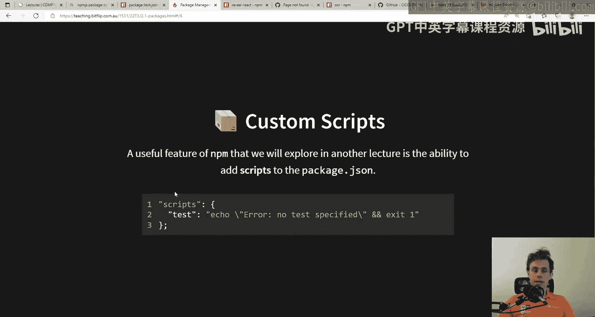

Daate is a date is a command on the command line where I can， if I run date it。

Does something on Linux， right？ So what I can do is I can actually do something similar here where I say。

 well。If I run the script， say hello， it should run this command。

And what the relevance of this is that we've done a few commands like NP PMM install and NP PMM。

 But NP PMM install is the main one。But。😡，If I go NPM run， this sets me up to run a script。

 and then I can actually run a particular script like this。 So when I go NPpm run， say hello。

 what it actually does is it opens up the package dot Json。

 it finds this particular keyword and it runs what's on the right hand side。😡。

See that This is a bit of garbage。 But you see there Id actually ran the date command。

 And if I go and change this to just say， you know， echo hi there。 My name is Hayden。These。

 these are just shell commands。 Again。 You'll see that this should work。 printnt that out。

 This is relevant for some lectures we do。On Wednesday。

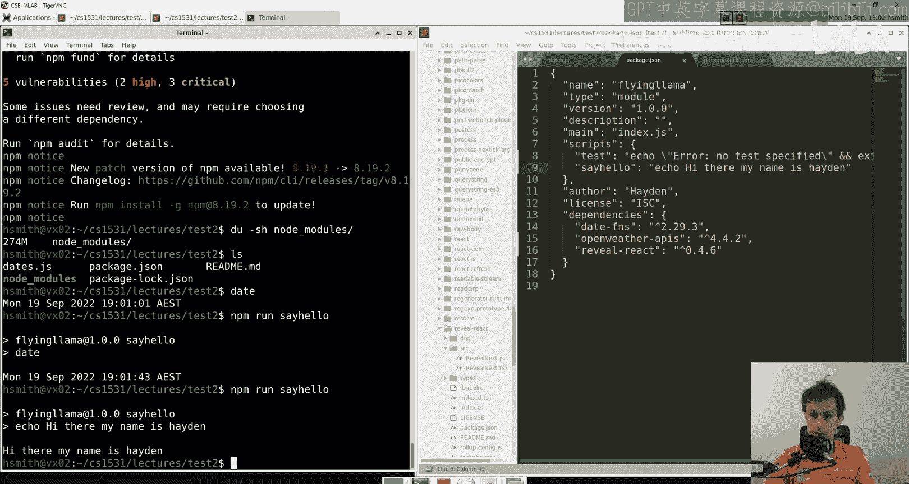

So it's just a little footnote for now to keep it in the back of your brain。And that's it。 There go。

 I've done some stuff there。As written here， we will cover a lot of this stuff later。

 there's probably a few little nuggets where you're like， oh， what's that， That's weird。

 The the nature of most， like， here's the thing。 the nature of most software you learn will always be like。

 oh here's the thing I want to learn。 I understand 90% of it and the other 10% or a bunch of this weird stuff I've never seen before。

 It's just the nature of the be。 Saly， if nothing can be as simple as 1，5，1。

1 in the real world all the time。 But we try our best to。 So。

This slide can get deleted because we fix something。Forgot to delete it。

We used to we figured out a way to like allow you to use any module you want someone asked a good question about this。

 But now we don't need that anymore。 So we can just， you can install anything you want。

 So that will get removed。 You can ignore that slide。 if you could please leave some feedback here。

 That would be great。 would love some feedback as always。

 QR code following the link if you're on the P Df doesn't really matter。

 We're gonna take a break until 7，10。 if you're watching live， which is in 7 minutes， Otherwise。

 we will stop the recording。😊。

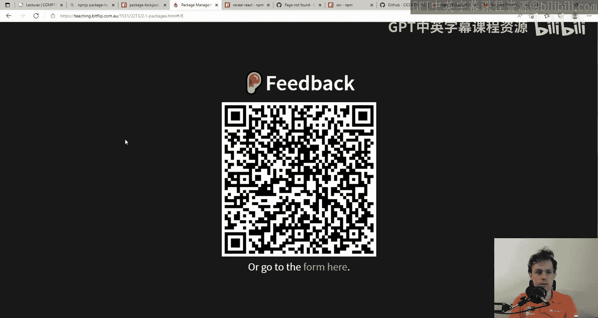

Thank you。😊。