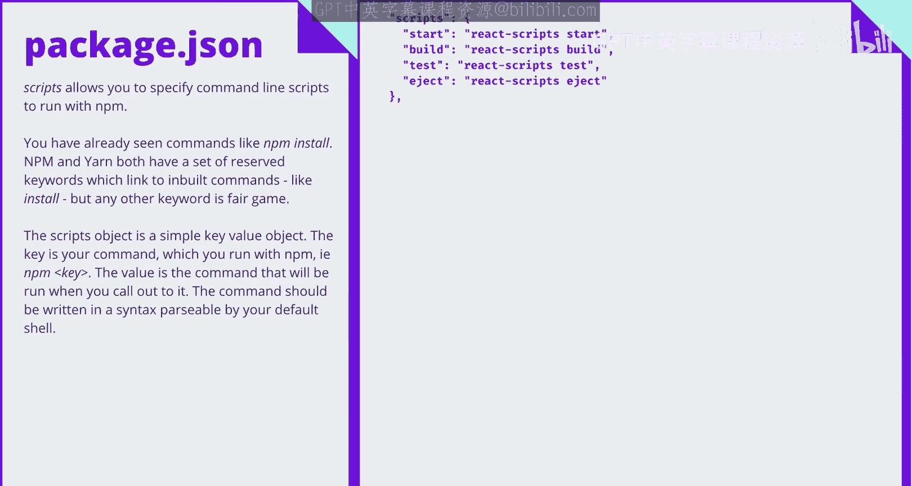
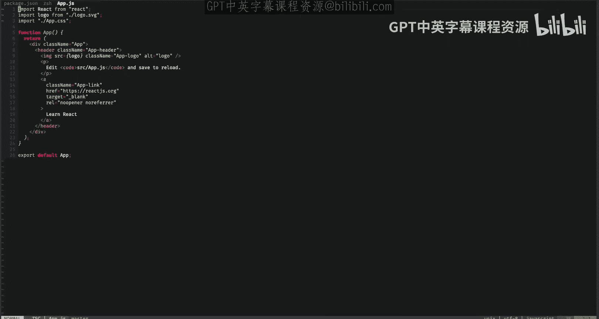
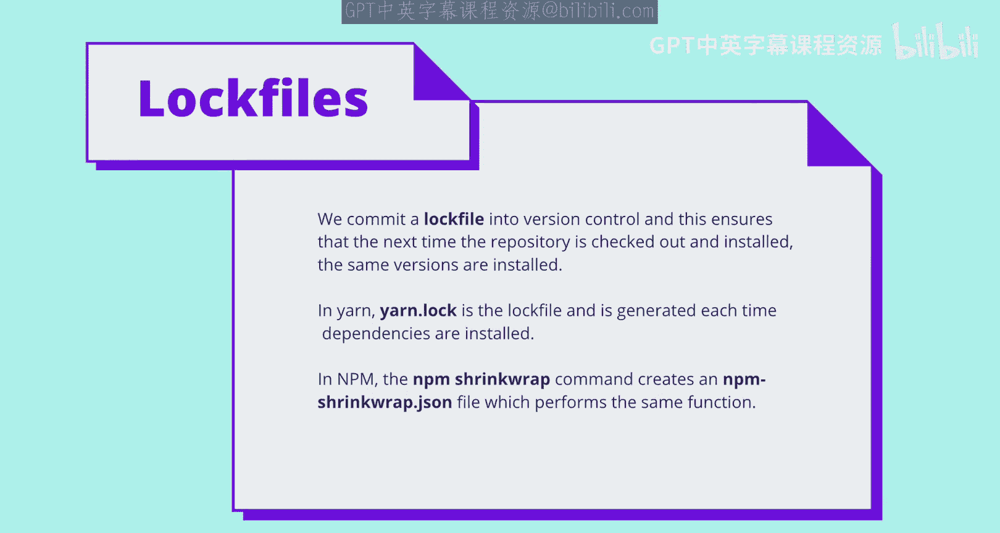

# 前端编程：COMP6080：JavaScript NodeJS 🐸 NPM (进阶)

在本节课中，我们将更详细地探讨 NPM 和 Yarn 这两个 JavaScript 包管理工具。我们将学习 `package.json` 文件的结构、不同类型的依赖项、如何创建自定义脚本，以及 NPM 与 Yarn 之间的主要区别。

## 📦 理解 `package.json` 文件

到目前为止，你应该已经知道 NPM 和 Yarn 都是 JavaScript 的包管理系统。它们允许你从网络安装库并在你的应用中使用。你可以使用 `npm install` 安装新包，使用 `npm start` 启动你的应用等。你也应该知道 `package.json` 文件的存在，并且 Yarn 是 NPM 的一个替代品。

右侧是一个典型的、使用 `create-react-app` 创建的 React 应用的 `package.json` 文件示例。它包含元数据、依赖信息等内容。请注意，在本讲座中，特别是在 `package.json` 的上下文中，Yarn 和 NPM 可以互换使用。

### 元数据字段

当你将一个包发布到 NPM 时，`package.json` 中的许多字段会被用来生成显示在你包信息页面上的内容，该页面位于 `npmjs.org`。

像 `name`、`author`、`contributors` 等字段只是与包相关的元数据，用于向你的包的使用者传递信息。`license` 是一个特例，因为它不仅显示在页面上，还具有法律意义。

让我们看一个例子。这是 React 的 NPM JS 页面。这里显示了很多元数据，例如许可证、主页、仓库。我们还有版本号，稍后会讨论。协作者列在底部，左侧有关键词，当然，顶部是包的名称。

### 版本字段

`version` 字段指定了你包的当前版本。如果你对一个包进行了更改，你也应该更改版本号。当你安装一个包时，你指定希望安装的包版本，这映射到 `package.json` 中显示的包版本。

版本使用语义化版本控制来指定。版本号的第一个数字是主版本号，第二个数字是次版本号，第三个数字是修订版本号。它们代表不同的含义。

*   **主版本号**：当你更改主版本号时，表示 API 发生了破坏性变更。如果有人升级主版本，他们的应用可能会遇到破坏。
*   **次版本号**：次版本号的更改意味着你添加了新功能，但以向后兼容的方式进行。因此，可能会有新功能，但如果你升级，不应该预期有任何破坏。
*   **修订版本号**：修订版本号的更改意味着你进行了向后兼容的错误修复，因此你可以安全地升级修订版本，而无需担心任何东西会损坏。

### 私有字段

`private` 字段可以防止你意外地将包发布到 NPM。你可以使用 `npm publish` 命令发布，但如果 `private` 设置为 `true`，发布命令将会失败。

## 🔗 依赖项详解

你可能已经熟悉 `dependencies` 字段。当你使用 `npm install` 或 `yarn add` 时，一个条目会被添加到 `package.json` 中。

`dependencies` 列表是你指定希望使用的库版本的地方。你可以看到这里开头有一些特殊字符。这些允许你指定版本范围。

在幻灯片中，我列出了指定版本范围的方法，以便你可以获取最新的主版本、次版本或修订版本。根据你的使用情况，你可以选择使用其中任何一种。一个生产级别的应用可能只想要最新的修订版本，以降低出现破坏性变更的风险；但对于你业余时间的一个有趣实验，你可能想要最新的主版本。

还有其他符号可以用来指定版本的最小和最大边界，或任何大于或小于某个版本的版本。这些超出了本幻灯片的范围，我留下了一个链接供你自行查阅。

一个普通的 `package.json` 会有一个 `dependencies` 字段，但这并不是我们指定依赖项的唯一地方。我们还可以有 `devDependencies`、`peerDependencies` 和 `optionalDependencies`。任何你喜欢的依赖项也可以添加到这些字段中。但它们的作用截然不同。

广义上讲，依赖项就是你的代码需要的任何东西。然而，我们有四个不同的字段，它们意味着不同的事情。

*   **`dependencies`**：`package.json` 中的 `dependencies` 字段是应用程序运行所需的任何东西。React 就是一个例子，如果你正在制作一个 React 应用。
*   **`devDependencies`**：`devDependencies` 不是运行应用程序所必需的，但在构建应用程序时是必需的。测试库和 Linter 就是例子，因为你需要这些来构建，但你的用户不需要这些来查看你的页面。
*   **`peerDependencies`**：`peerDependencies` 不太常见。假设你有一个包 A，它有一个对等依赖项 B。如果我安装包 A，我也需要独立安装包 B。否则，包 A 将无法工作。在 React 应用中，`react-dom` 就是这样一个例子，你不仅安装 `react` 库，还安装 `react-dom` 库。对于普通依赖项，如果我安装了一个有其他依赖项的依赖项，NPM 会为我们解析这些并安装子依赖项。然而，如果是对等依赖项，则不会发生这种情况，依赖项解析的传递性就丢失了。
*   **`optionalDependencies`**：`optionalDependencies` 是我们会尝试安装的依赖项。但如果 NPM 或 Yarn 无法安装它，它仍然会将安装列为成功，并且不会发生任何坏事。

在一个普通的应用程序中，你通常不会看到很多对等依赖项或可选依赖项。它们更多是在你发布库或包时使用。然而，它们确实有一些优势。对等依赖项允许你确保你的包的使用者安装了特定版本的另一个包，以便这些包保持同步。如果你依赖某个包的新版本中的某个功能，你可以确保用户也安装了支持该功能的该包版本。可选依赖项适用于这样的情况：虽然你可能想要一个依赖项，但你可能不需要它。一个很好的例子是像样式化控制台日志这样的东西。拥有它会很好，但如果依赖项安装失败，你仍然希望应用程序能够正常运行并正常输出到日志。

## 🛠️ 脚本字段

`scripts` 字段允许你指定 NPM 可以代表你运行的命令行脚本。当你运行 `npm start` 或 `yarn start` 时，你实际上是告诉 NPM 运行 `package.json` 中指定的 `scripts.start` 命令。

`scripts` 对象是一个键值对象，其中键是 NPM 识别的命令，值是我们运行的实际 shell 命令。然而，有一些命令，如 `install`，不能被覆盖。

让我们看一个例子。我有一个简单的 React 应用，并且我已经将 `prettier` 安装为开发依赖项。Prettier 是一个自动格式化文件的工具，你可以看到右边我的 `App.js` 文件格式不正确。所以，我将构建一个脚本，允许我通过 NPM 运行 prettier。我将添加一个 `prettier` 条目。在最后，我指定了 prettier 命令，它表示写入 `src` 文件夹。就这么简单。现在，如果我移动到我的终端，我可以使用 NPM 或 Yarn 来运行这个命令。在这种情况下，我将使用 NPM，所以我输入 `npm run prettier`，它就会按照我们在 `package.json` 中指定的那样，在 `src` 文件夹上运行 prettier 命令。如果我重新打开 `App.js`，你可以看到组件已经按照应有的方式正确格式化。

## ⚙️ 扩展字段

需要注意的一点是，`package.json` 只是一个 JSON 文件。某些库可能会选择任意地使用新字段来扩展它，这些字段库可以在需要时尝试读取。某些库的配置通常保存在 `package.json` 中。

`eslintConfig` 就是这样一个例子。它为我们的 linter 提供了一个配置。在这种情况下，它表示使用 `react-app` linting 预设。`browserslist` 是另一个例子。它被一个名为 `browserslist` 的插件使用，它允许我们指定我们的应用程序支持哪些浏览器类型。`browserslist` 的确切语法超出了本讲座的范围，但是，你可以查看 `browserslist` 包来了解语法。然而，你可以在这里看到，我们根据是在生产环境还是开发环境中来指定不同的支持版本，对于我们的开发环境，我们指定了 Chrome、Firefox 和 Safari 的最新版本。

以上就是关于 `package.json` 的内容。现在，你应该对一个基本的 React 应用的典型 `package.json` 有了很好的了解。

## 🔄 NPM 与 Yarn 的区别

现在，让我们看看 Yarn 和 NPM。有什么区别？记住一些历史很重要。在 Yarn 创建的时候，Facebook 正在使用 NPM 并遇到了一些麻烦。NPM 很慢。它不是确定性的，这意味着给定两台计算机上完全相同的 `package.json`，安装后 `node_modules` 文件夹的结构在两台计算机上是不同的。它也没有办法锁定版本，以便每个开发人员始终使用每个包的相同版本，版本范围等依赖项解析经常导致开发人员拥有不同或冲突的版本。Yarn 的开发就是为了解决这些问题。

在发布时，Yarn 速度明显更快。它使用了确定性的安装算法，并且使用了锁定文件，这允许我们锁定我们的依赖项。

首先，在 Yarn 中，彼此没有依赖关系的包可以在单独的线程中安装，这意味着安装时间被缩短了。话虽如此，NPM 后来发布了 NPM 5 更新，缩小了两者之间的差距。然而，在 Yarn 发布时，据报道，安装过程可以从几分钟减少到几秒钟。

Yarn 的另一个显著优势是锁定文件。锁定文件记录了在计算机上安装的依赖项的确切版本。然后，你可以将锁定文件提交到版本控制中，此时如果另一个开发人员安装该包，他们将获得与第一个开发人员完全相同的版本，确保两台计算机上的两个包的版本保持同步，并且你不会遇到任何与冲突或不同版本相关的问题。

在 Yarn 中，每次安装或更新包时都会创建一个锁定文件。你可以将此锁定文件检入版本控制，这确保了下次检出安装时，版本保持不变。然而，在 NPM 中，也存在一个名为 `npm shrinkwrap` 的命令，它会创建一个 `npm-shrinkwrap.json` 文件，做同样的事情。区别在于，在 NPM 中，为了获得锁定文件，你需要显式地运行 `shrinkwrap` 命令，而在 Yarn 中，它会自动为你完成。

这就总结了 NPM 和 Yarn 之间的区别。还有一些我没有列出的性能优化，你可以在 Facebook 的工程博客或 Github 上找到。

## 📝 总结

在本节课中，我们一起学习了 `package.json` 文件的结构、不同类型的依赖项如何工作、如何创建自己的脚本，以及 Yarn 和 NPM 之间的区别。请继续关注未来关于 NPM 的讲座，同时，祝一切顺利。