# UNSW《前端编程｜ Web Front-end Programming COMP6080 23T1》中英字幕（deepseek-R1 p26 -26-COMP6080 - Javascript WebJS 🦄 Intro.zh_en -BV17RXGYuEaM_p26-

Hi， everyone。 My name is Hayden， and I'm here to talk about JavaScript in the web browser。

If you have gotten to this lecture， then typically what it's going to mean for you is that。

You have learned a little bit about jascript in terms of what the language is。

 how to add up numbers use for loops and while loops。

 And you've probably also learned a little bit about the Dom。

 the Dom being the document object model that is used to essentially make ja interact with an HTML page。

 So you have your HTMLl page， which has lots of elements on it。 And then you have jascript。

 which has been souped up and able to modify that Dom。

 That's what I'm going to refer to as web browser jascript。 There's another type of jascript。

 which is used with kind of no JS more scripting command line that's talked about in other lectures as well。

 That's not really critical at this point， but。Both of those things are just jascript with some extra features on either end。

 right， So one of them is jascript work and manipulate the Dom。

 The other one we worry about later today， though， we're going to dig a little bit deeper into the ja manipulating the dom。

 in particular， assuming that you already on your journey with writing that jascript。

 But the question is。Where do you put that JavaScript and how do you include it on the page。

 really short kind of pieces of information here。So。The first question is。

 how do you include your jascript on a web page， Well。

 there's two main ways you can either include it in line or you can exclude it。

 include it with an external link。 So I've got some a couple of code examples for you here。

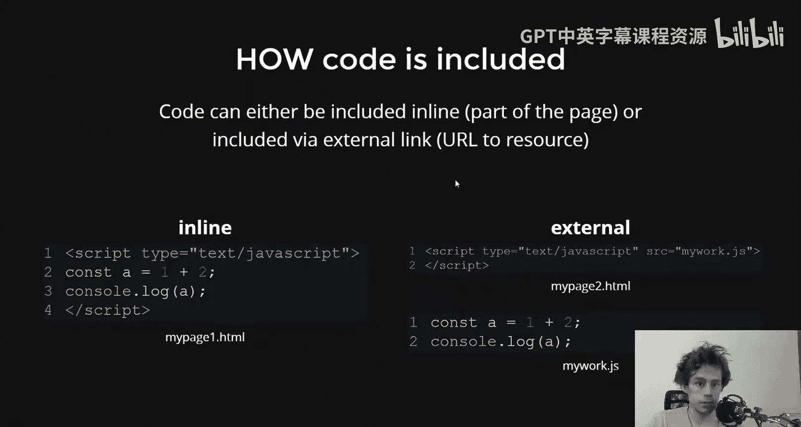

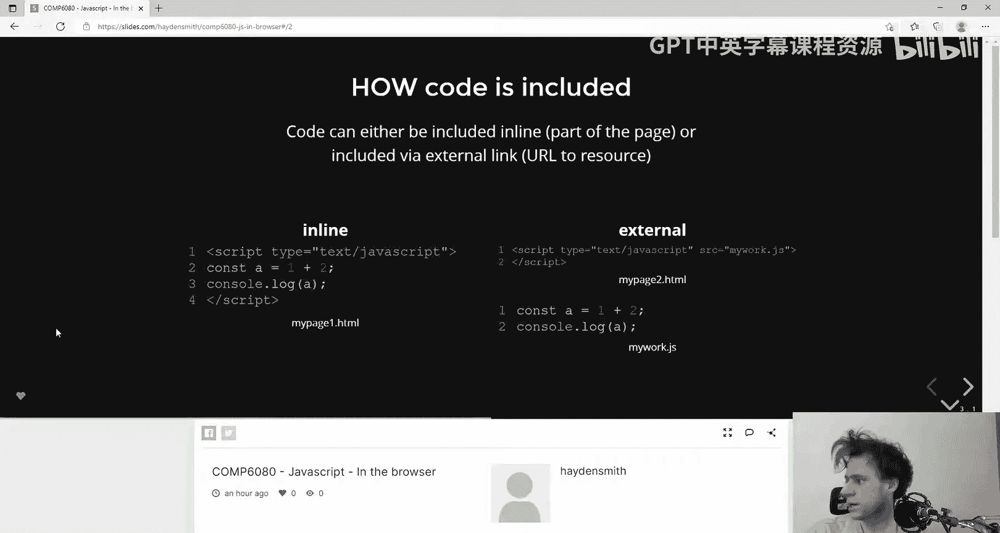

The first example we have is my page1 dot HTML， and you can see。

While I'm missing some other tags here， the point is that this is how you include Javascript on the web page itself。

 You can just make an HM L page， and I really need to stress this。 This is an HM L file。

 This is not a jascript file。 It's an Hl file that has a ja in it。If you have a script tag。

 which is always good to include script type his text Javascript。

 you can simply write your jascript there and we can run that。 So let's run that together。

 Let me just。

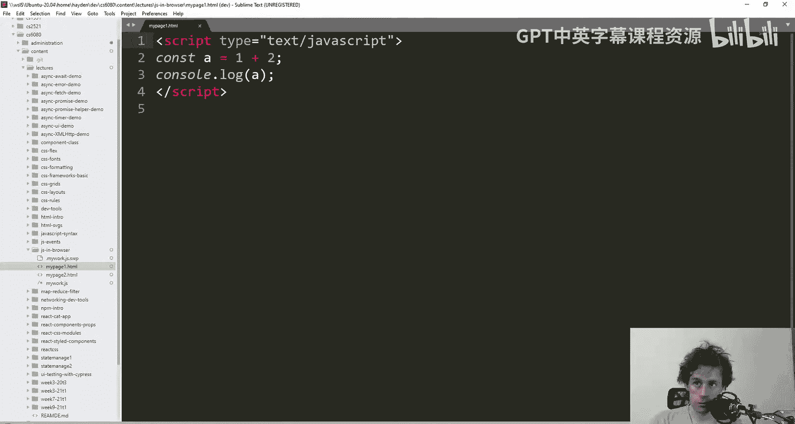

Let me just drag this into the browser for you， so。

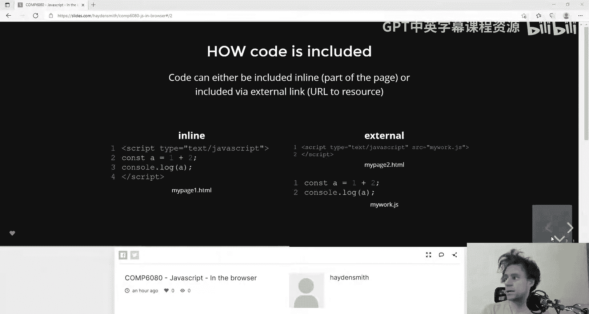

You see here， if I open the console。If I open the console here and I refresh the page。

 you can see it actually prints out three。 And that's because that's what the page does， right。

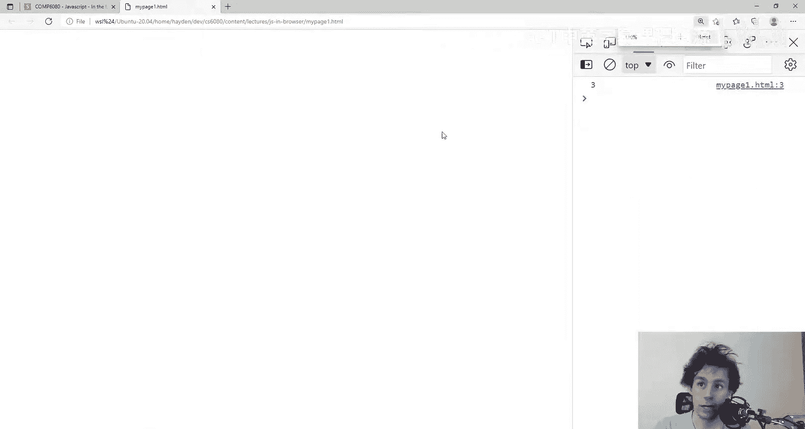

Adds one and two， and then it console logs that， so it does work。

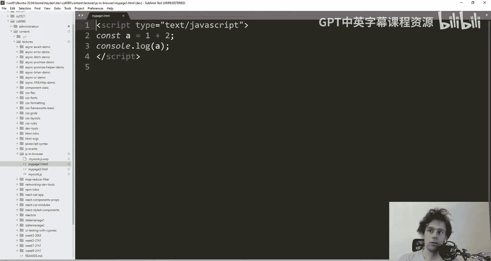

The other way that you can include jascript on your web page is to actually do it externally。

 And by that， we just include a script tag。 but instead of actually putting stuff between the script tags。

 we just give it a source attribute and then a file location。

 This can be a relative file location or an absolute file location。 in this case。

 it's a relative file location because these two files are in the same folder。

 So here's script typeist text Javascript。

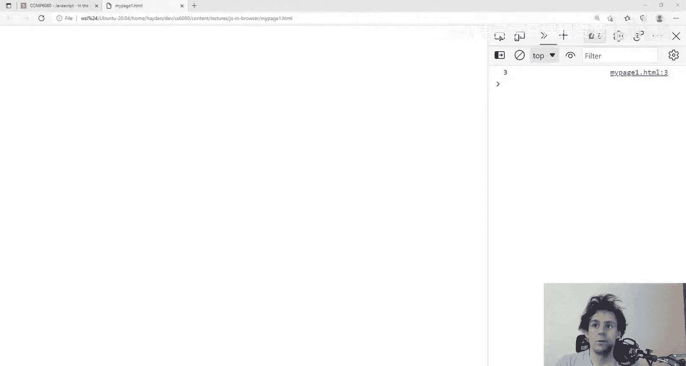

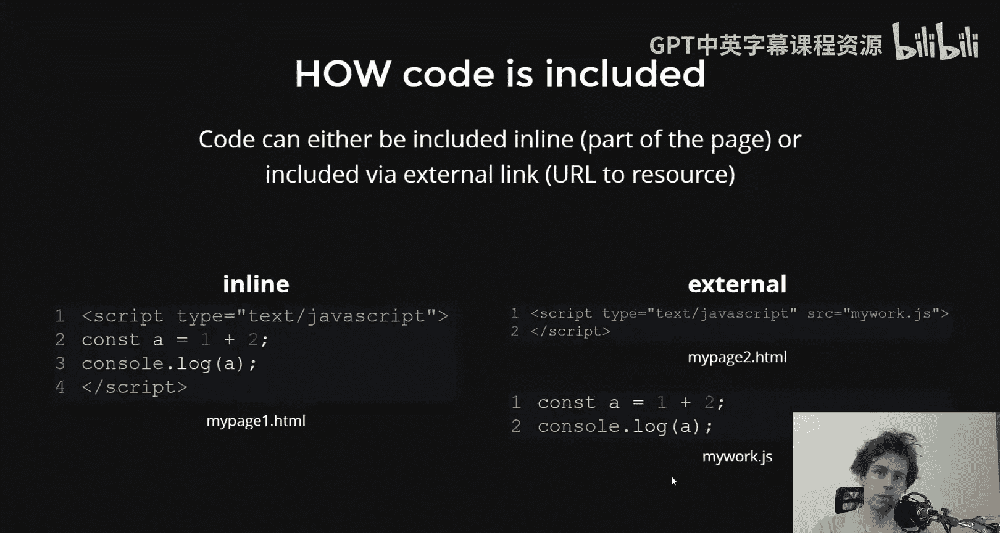

Sources My work dot Js。 This is an Hm L file。 And then we have my work dot Js， which is a。

Javascript file， So the HTML file is now including the JavaScript file。

 and you'll see that if I open this web page。

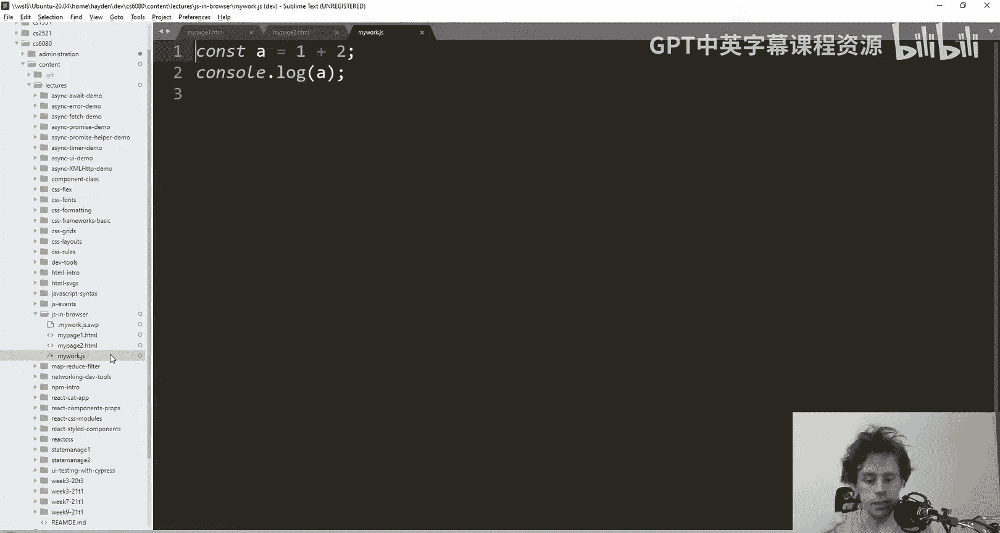

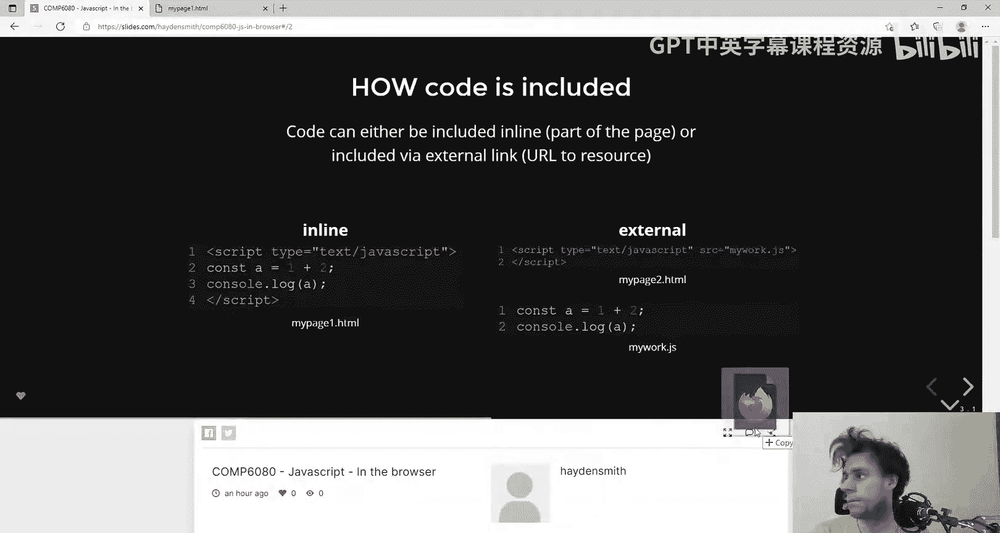

That similar thing here， we have the console。Its still prints 3。 But if we look at the page source。

 you can see that it's actually just a script tag that links to this file。 So now we've。

 we've kind of created something external。 Now， the natural question is gonna to be why which one would I pick。

 And the answer is that if you are。

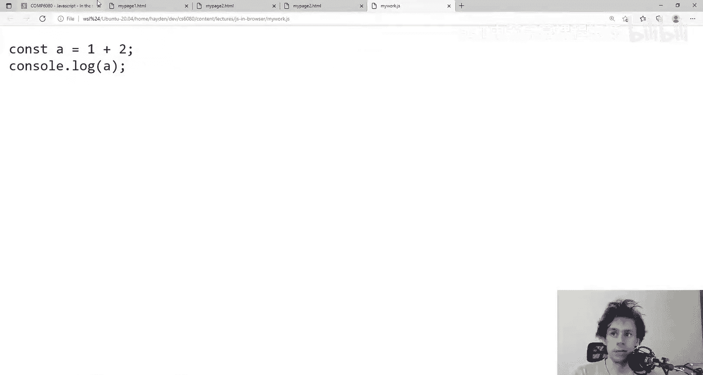

There's some trade offs。 So if you're linking JavaScript externally is in the second method we saw。

One of the first things that happens is you actually see some improvements in performance when the browser case is utilized。

 So what your browser does without you even realizing it is when you load an like when you load an HTML page like my page 2。

The browser will when trying to load that page from the Internet， say a server。

 it will always pull a fresh version of that page because it's the page you're loading It might change。

 Well not not always， but nearly always， like the vast majority of use cases。 However。

 when that page is being parsed like processed by the browser。 if it sees external links。

 the browser will often try and case that。 That means store a local copy so that it doesn't have to make a network request to a server because that's just more and more files to collect。

 which is slower and slower chooseose up your Internet， etc cetera。 So you'll see that if we go to。

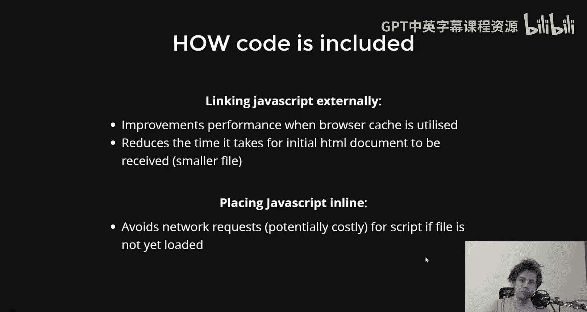

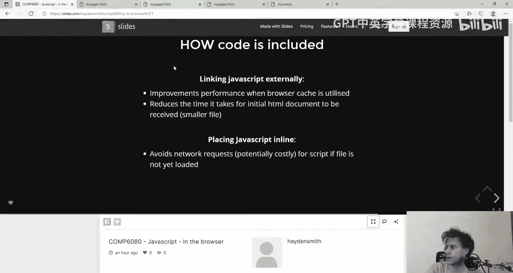

My page 2 here。 Let's try and analyze this together。 You'll actually see that when I run this。

See what I can find here。I don't normally use edge for this， but basically。

 what you'll often find is that。This file here because this is actually like what's loaded when the page is loaded。

 right。 We load an HTML page in the jascript file。 Qui often。

 the jascript file itself will actually be cached。 And that means that when the browser loads of this page fresh every time before it goes to fetch it。

 it's like I've already got this file。 So I don't need to load it。

 So external can actually be quicker sometimes， if you've already got the file。

 So if it's like a file is just like on every page and every load。

 then it's actually good to make it external， because rather than having to include it as part of the H file。

 every single page load， which makes the file bigger， which makes the transfer finitely slower。😊。

You've externalized it and allowed it to be cache。 So that's a benefit of external linking。

 The other benefit is that it takes less time for your initial HTML document to load potentially because depending on where you put the file But so this one is like a maybe sometimes because you've just got a smaller document to actually like load naturally like to actually render。

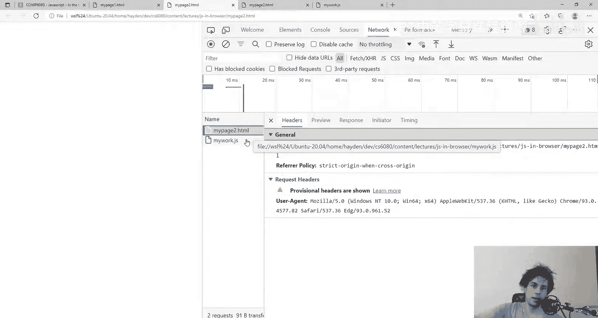

But again， that depends where you put it。 The benefits of placing the jascript in line， though。

 are often。I mean， there's this you could go deeper on some of these topics。

 but the short answer is that it makes the initial network request。Like。

 it saves the initial network request because naturally。

 like the benefit you get from externally loading jascript when it's cached only happens if it's cached and to get it cached。

 you actually have to load it the first time， Right， So the benefit doesn't happen immediately。

 It only happens after the first time。 What this also then means is that。As a general rule。

 you're probably encouraged to put your jascript in external script as much as possible。

 You probably want to limit how many external scripts you do。

 you kind of probably want to keep it to a minimum of few files because that might be in other lectures about why that's necessary。

 but generally browsers are pretty quick at getting a few files。

 but if you're trying to load dozens of files are can be quite slow So you'd probably prefer to do that。

 one of the main instances that you would not want to do that is if you have some kind of jascript that is just like one or two lines of code like you would pretty much never externalize this example because it's so little code like the benefit you're going to get from caing is going to be so insignificant because a network request is also most of the time like a plane is spent well not most of the time。

 but there's like a fixed cost in like taking off and landing is in connecting and disconnecting and doing all those things the size of the file。

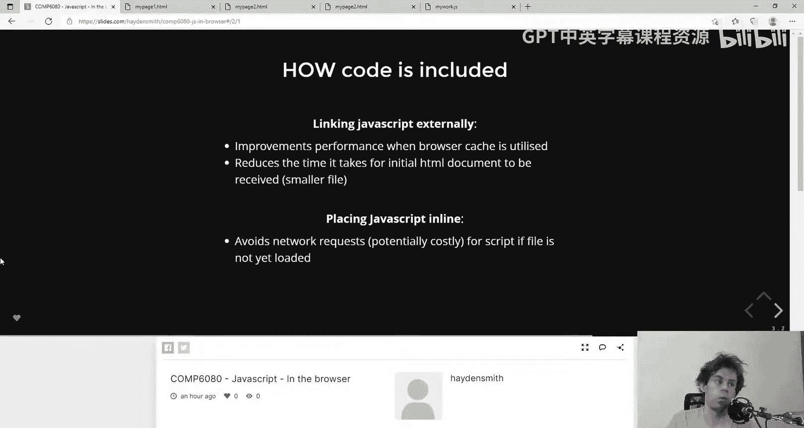

FileAs that gets bigger， that consumes most of the time it takes。 But if tiny files。

 most of that trying to get it is actually not gonna be transferring data。

 It's going to be setting up a connection and whatnot。 So it just。

 it just doesn't really pay dividends to。Externalize this if that's all the JavaScript that's on your page。

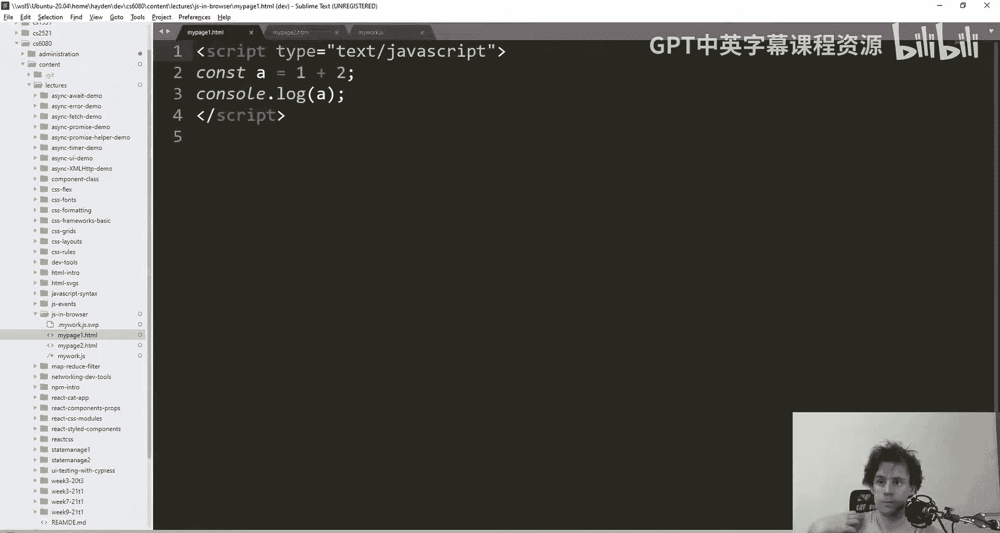

In terms of how you include code externally or in line。In terms of where to include code。

 if you have an H page like this one， you can include it in a few different places。

 You can either include it inside the head of the page。

 you can include it at the top of the body or you can include it at the in the bottom of the body。

 Now， obviously， you could include it in the middle of the body， but。

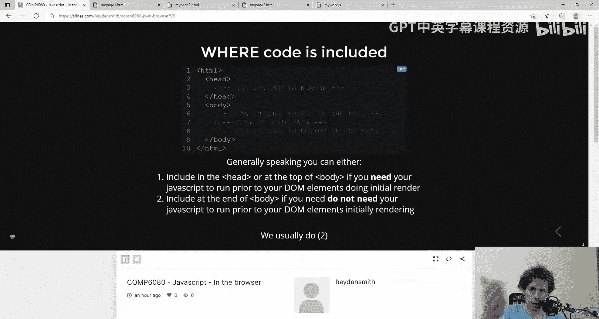

I have no idea why anyone would undo that。 If you included in either the header。

 the head tags or at the top of the body， what happens in these cases is that your jascript will run prior to the page being rendering because the way the dom is。

Genrated in the pages around it is it kind of just does it linearly top to bottom。 So if you。

 the more stuff you have that has to be executed this jascript before you actually are。

Building the page out， the slower your page build is gonna be。For that reason， we tend to。

 as preference， put all of our scripts at the bottom of the body because what happens is we want our entire page to load。

 and then as soon as it's finished loading， we can start spending all that time executing scripts。

 that's because if you think about how a user uses a web into like a web page。

They're very sensitive to seeing some kind of action immediately。

 They want to see the page render and load， but they don't mind if it's not dynamic for a second。

 because most pages you load， like， say， Facebook page。 You just want it to load one。

 you want it to appear very quickly， even if it takes a second to load your timeline or populate your chat。

 So that kind of time to initial load is really important。

 So that's why we put all our scripts generally at the bottom of the page。

So that we can get the time to load done and then we can start doing our like more interesting processing。

 So on a web page， say， you know， if I was to copy this and let's expand out out of my page2 example。

 typically in a page like this， what you would do is if you had a script tag like this。

 you would be putting this script tag right here， So you'd have all of your normal stuff Hello and your script tags would all be at the end of your HTML body When would you not do that。

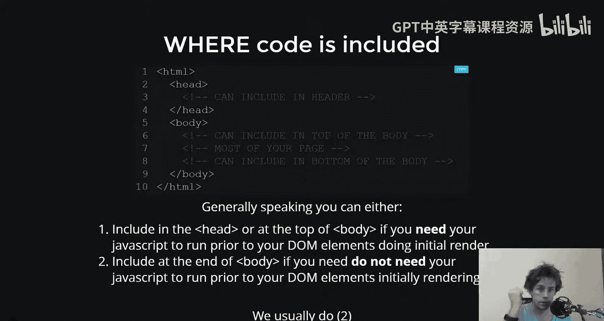

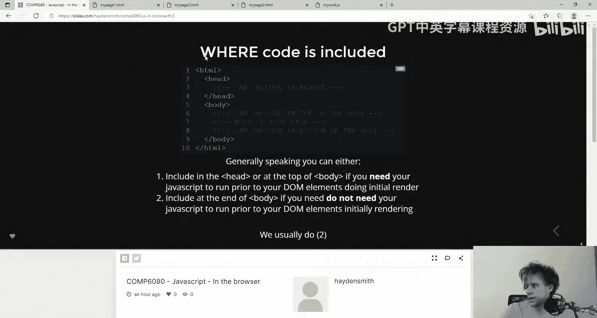

It's really hard to think of too many examples， but。嗯。Generally speaking。

 the only times you'd ever do that is if you need some ja to execute prior to the page even rendering so。

You know， perhaps if you're writing some jascript that needs to make a network request to see if the user is a valid user before they even render the page。

 then that might be a scenario， but generally speaking。You know。

 you're not going come across that day to day because most of the time if you if you're not like。

 let's say for that example， if you don't want to render this div until someone's logged in because you need to know they're logged in。

 a more common approach to take is to actually have this say loading or something like this and then inside of your my work do Js what you would do after that let me just break this up into two windows is in here you might actually then say you know。

 document do yet element by Id and let's call it main page or something。Dot style。Do display dot。

Inter HTMLtm equals， welcome。So let's imagine this is like logging， logging someone in right。

 you have to do some checks， which we're gonna talk about in other lectures， but。

What will happen here is if I say， you know， this div I D is main page。

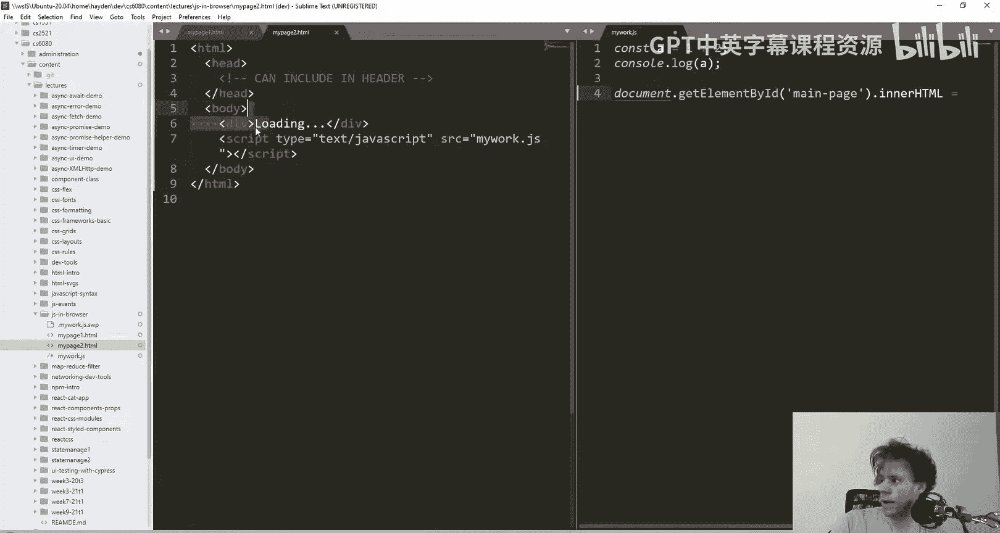

Now， when we go to load this page here。

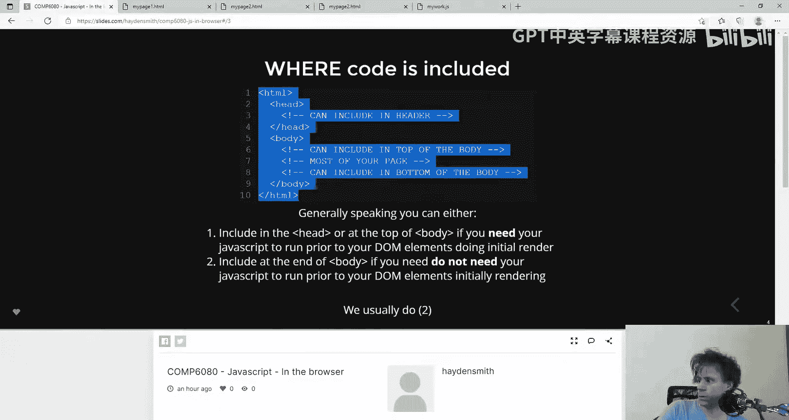

It'll say loading。 Let me got a problem here。 It'll say loading。 But after this one is processed。

I an up save the file After this one is processed， it will immediately update the div。

 And you can actually see that there。 if you watch it like really closely。

 right on some of the refreshers， you can actually see that like loading appear for a second。

 So that's actually the page rendering as quickly as possible。

 And then the jascript's executing and updating it。

 You'll actually see this if you watch a lot of websites like itll you'll get a lot of stuff。

 And then you might notice some things update very quickly But that's kind of the normal way to do it。

 That's why we can still put our jascript at the end because you might again be thinking。

 I need to put it at the top because。What is on the page depends on what my scripts output is。

 but you don't need to do it that way。 You can do it somewhere like this。

 Give like a place holder until you have more information or。

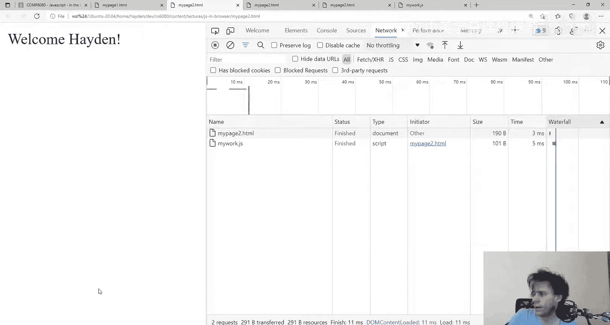

In fact。You could。As you， you'll see in tutorials and other things。

 you could even skip this all together and just build it with Javascript at the end。

 So there's lots of options here， but generally put our scripts at the end。 So。

 that gives some insight。

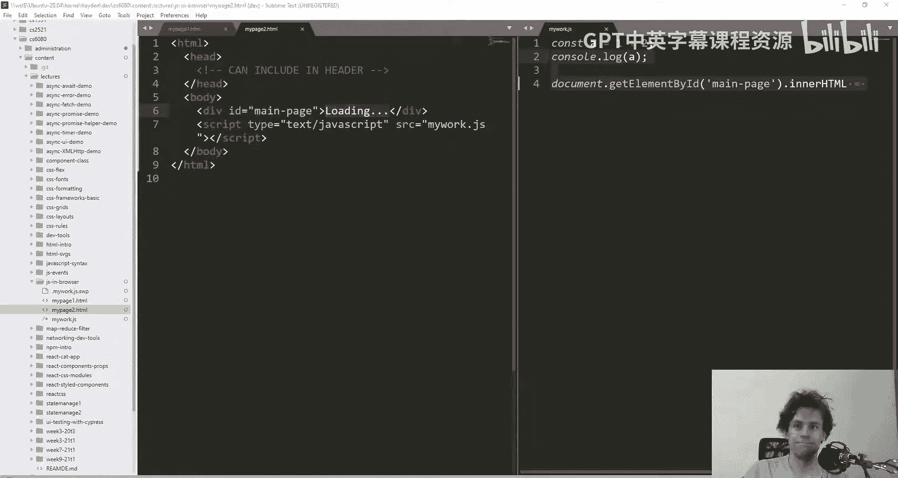