# 前端编程：第28章：JavaScript事件 🎯

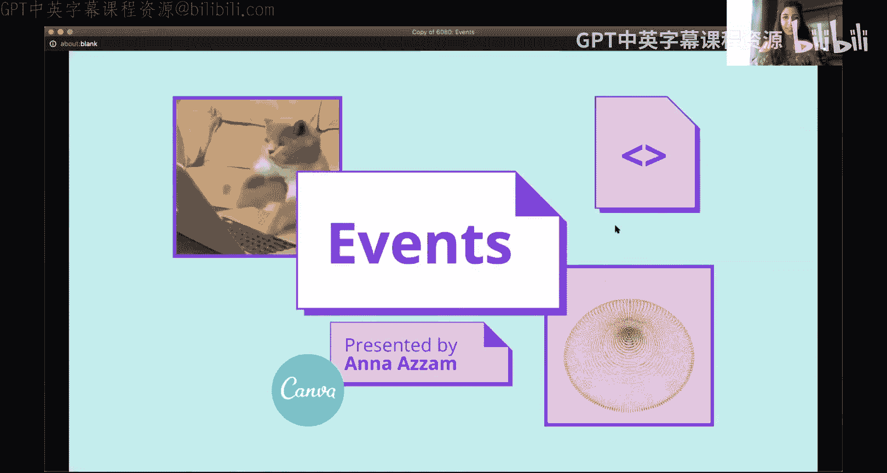

在本节课中，我们将要学习JavaScript中的事件。事件是网页实现交互功能的核心，它允许我们的代码响应用户的操作，例如点击、键盘输入或鼠标移动。我们将从事件的基本概念开始，逐步学习如何监听事件、处理事件，并最终通过一个完整的拖放游戏示例来巩固所学知识。

## 什么是事件？

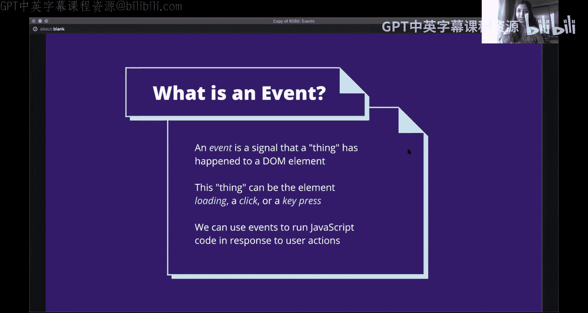

首先，我们来看看什么是事件。事件本质上是一个信号，表示DOM（文档对象模型）中的某个元素发生了一件事。如果我们监听这些信号，就可以运行JavaScript代码来响应它们。这个信号通常由用户的操作触发。

因此，事件是我们将用户交互融入应用程序的一种方式。


当我说“DOM元素发生了一件事”时，这通常意味着用户以某种方式与该元素进行了交互。

事件有多种形式，最常见的是鼠标事件和键盘事件。以下是一些鼠标事件的例子：
*   **click**：点击。
*   **double click**：双击。
*   **mouse down**：鼠标按下（点击的开始）。
*   **mouse up**：鼠标释放（点击的结束）。
*   **mouse enter**：鼠标光标进入元素区域。
*   **mouse leave**：鼠标光标离开元素区域。

以下是键盘事件的例子：
*   **key down**：按键被按下。
*   **key press**：按键被按下（通常代表字符输入）。
*   **key up**：按键被释放。

`key down`、`key up`和`key press`的区别在于：`key down`是首次按下键时触发，`key up`是释放键时触发，而`key press`代表一个字符被输入。一次`key down`可能会触发多次`key press`事件。

此外，还有许多其他类型的事件，其中一些仅适用于特定类型的元素。例如：
*   **focus**：当输入文本框获得焦点时触发。
*   **canplay**：视频元素的事件，当用户代理（浏览器）可以播放视频时触发。

幻灯片上列出了很多事件，但实际还有更多。建议你查阅MDN文档以了解所有可用的事件。

## 如何监听事件？

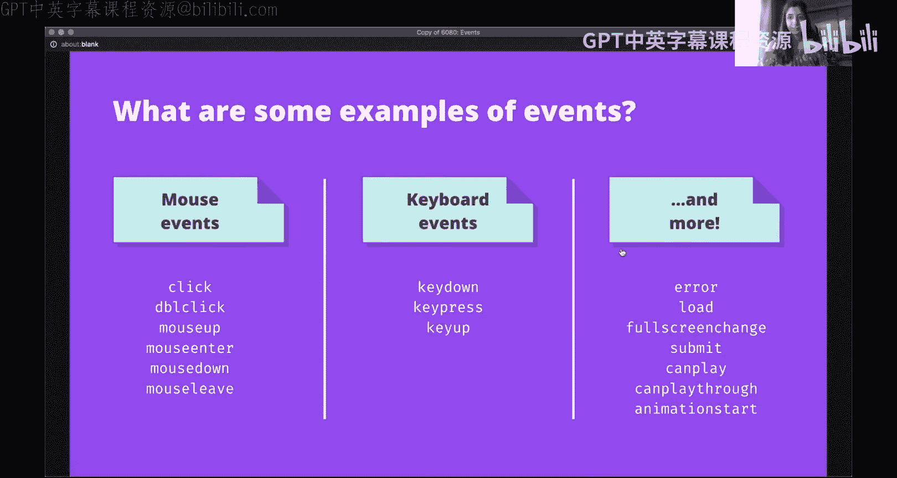

我们知道事件会发出信号，但我们如何实际监听这个信号呢？**事件监听器** 就是一个在事件发生时运行的处理器函数。

本质上，处理器是一种运行JavaScript回调函数以响应用户交互的方式。

那么，我们如何添加事件处理器呢？

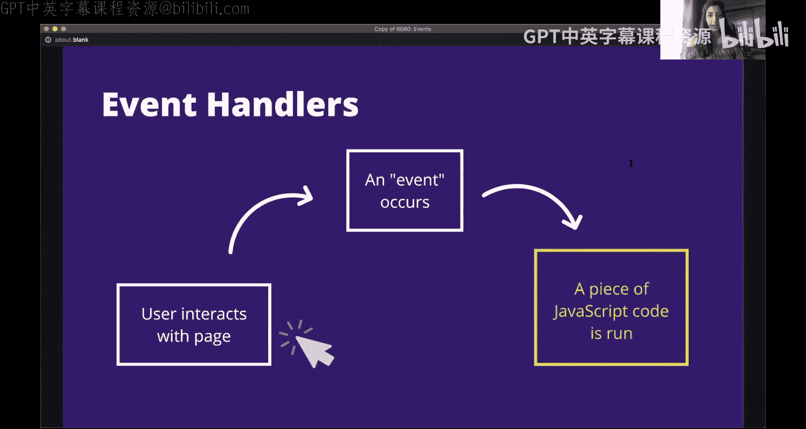


主要有三种添加事件处理器的方法。

**第一种方法是通过HTML属性添加。** 以下是一个HTML按钮代码片段，我添加了一个`onclick`处理属性，并将要运行的JavaScript代码放在引号内。

```html
<input type="button" value="Click me" onclick="alert('The button is clicked')" />
```

在这个例子中，当按钮被点击时，这里的JavaScript代码就会运行，弹出一个提示框显示“The button is clicked”。

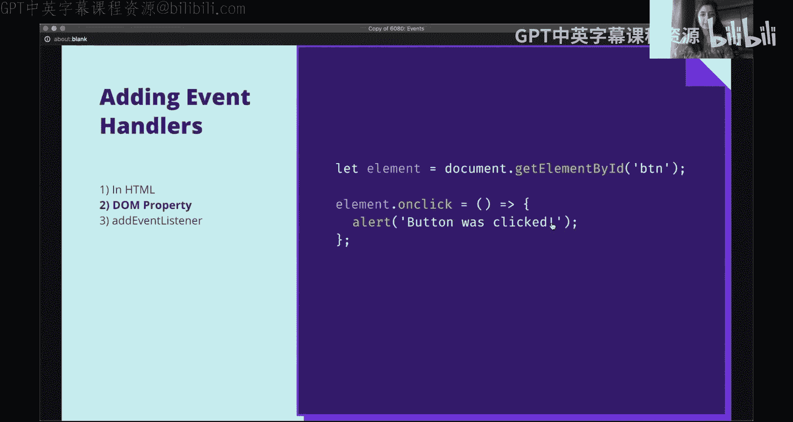

**第二种方法是设置DOM元素的属性。** 当我通过`getElementById`或其他方法在JavaScript中获取一个元素后，我可以将一个函数赋值给该元素的`onclick`属性。

```javascript
const element = document.getElementById('myButton');
element.onclick = () => {
    alert('The button was clicked');
};
```

`onclick`是DOM对象的一个属性。这里的语法是一个箭头函数，我将其赋值给`onclick`，这基本上就像一个简单的lambda或匿名函数。同样，当我们点击按钮时，它会提示“The button was clicked”。


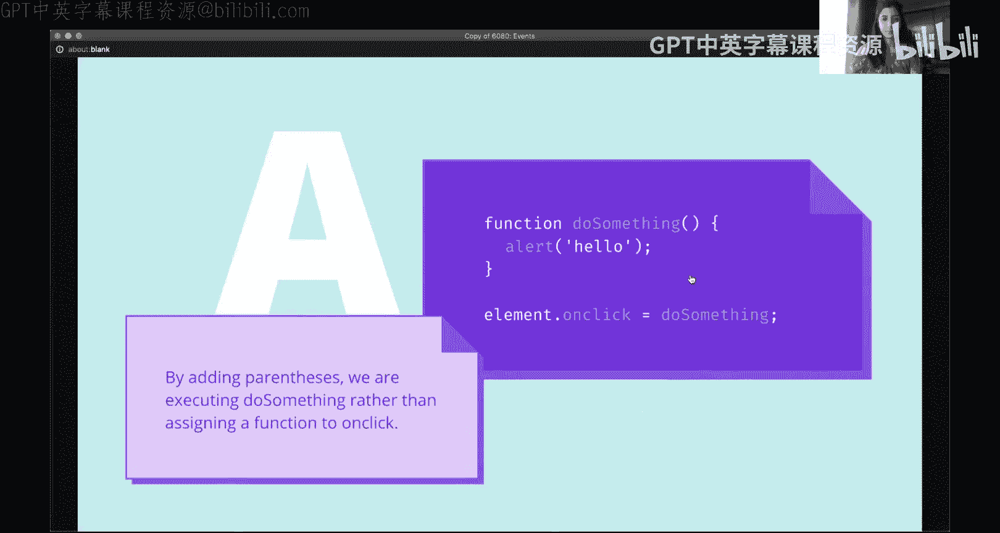

**一个小测验：** 我这里有一个名为`doSomething`的函数，然后我写`element.onclick = doSomething();`。这段代码有什么问题？

这段代码的问题在于我在`doSomething`后面加了括号`()`，这意味着我是在**执行**这个函数（调用它），而不是将`onclick`**赋值**给`doSomething`函数。

正确的写法应该是去掉括号：

```javascript
element.onclick = doSomething; // 正确
```

DOM元素上的`onclick`回调对象是一个函数。


**第三种，也是最终的方法是使用`addEventListener`函数。** 这个函数接受两个参数：第一个是事件类型（例如`'click'`或`'mousemove'`），第二个是监听器，同样是一个回调函数。

```javascript
element.addEventListener('click', () => {
    alert('The button was clicked');
});
```

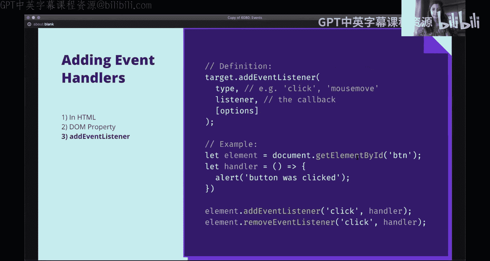

添加事件监听器后，你也可以使用`removeEventListener`来移除它。你可以在本幻灯片最后两行看到`addEventListener`和`removeEventListener`的用法。

`addEventListener`还接受第三个可选的`options`参数。`options`是一个对象，用于指定该事件监听器的一些额外设置。例如：
*   **once**：如果设置为`true`，意味着该监听器只能被调用一次，调用后会自动移除。
*   **capture**：一个布尔值参数，指示事件是否应该在捕获阶段被处理（我们稍后会探讨其含义）。
*   **passive**：也是一个布尔值，当设置为`true`时，意味着处理函数永远不会调用`preventDefault()`（我们也会在后面学习`preventDefault`的含义）。

你可以在MDN上查看关于`addEventListener`及其所有选项的详细信息。

## 事件对象

我们已经了解了如何设置一个函数作为事件监听器。现在，事件监听器实际上有一个可选的参数。这个处理器的参数是一个**Event类型**的对象，它包含了与已发生事件相关的所有详细信息。

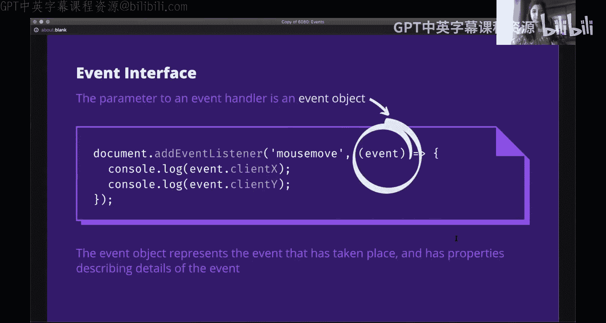

以下是一个使用事件参数的小例子：

```javascript
document.addEventListener('mousemove', (event) => {
    console.log(event.clientX, event.clientY);
});
```

这段代码通过`addEventListener`给文档添加了一个`mousemove`事件监听器，当鼠标在文档上移动时触发。然后在回调函数中，我使用`console.log`输出了`event.clientX`和`event.clientY`，它们代表了鼠标事件的坐标。


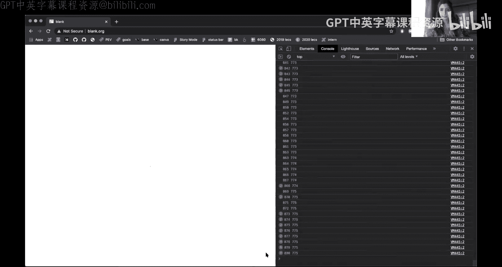

让我们在浏览器中测试一下这个鼠标移动的例子。我添加了事件监听器后，如果在文档上移动鼠标，可以在控制台看到我的鼠标坐标被不断打印出来。当我移动到左上角时，坐标接近(0, 0)。Y坐标随着我向下移动而增加，X坐标随着我向右移动而增加。


那么，这个事件接口到底包含哪些信息呢？

正如我们之前看到的，事件有很多不同的类型，但有一些属性是所有事件共有的。例如：
*   **event.currentTarget**：当前正在运行处理器函数的元素。
*   **event.timestamp**：事件创建的时间（毫秒）。
*   **event.type**：事件的名称（例如`'click'`）。

还有一些属性是特定于某些事件类型的。例如：
*   **clientX**和**clientY**：仅存在于鼠标事件中，表示鼠标坐标。
*   **key**：仅存在于键盘事件中，表示被按下的键的键码。

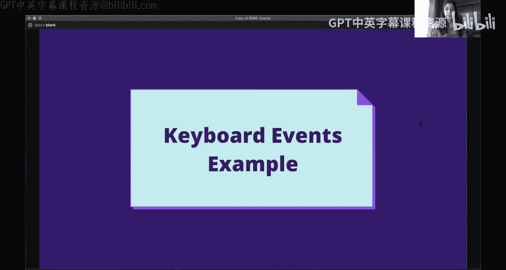

现在，让我们运用事件知识，编写一个使用键盘事件的小例子。

## 键盘事件示例：移动方块


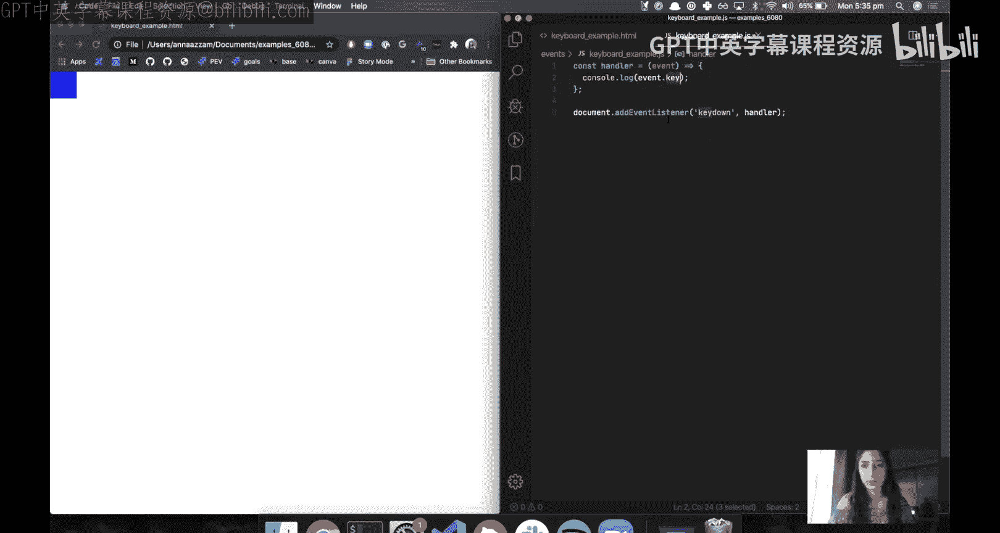

让我们做一个键盘事件的例子。首先，我要给文档添加一个`keydown`事件监听器。

```javascript
document.addEventListener('keydown', (event) => {
    console.log(event.key);
});
```

我定义了一个处理器函数，它使用`console.log(event.key)`来显示当我按下不同键时控制台输出的键码。在浏览器中运行，如果我按`a`键，控制台会输出`'a'`；按`b`键输出`'b'`；按数字键输出数字；按方向键会输出`'ArrowUp'`、`'ArrowLeft'`、`'ArrowRight'`、`'ArrowDown'`；按`Shift`键输出`'Shift'`。

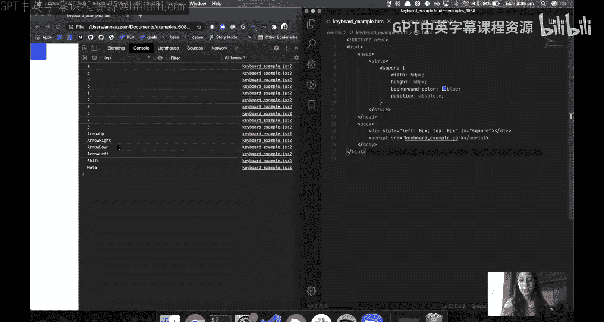

基本上，`event.key`给了我们被按下键的名称。


现在，我有一个简单的HTML页面，里面有一个被我设置为蓝色、50x50像素的`div`。

接下来，我们要编写一个脚本，使得当我按下方向键时，这个方块会沿着我按下的方向在页面上移动。


现在，我要从HTML中获取这个方块（我给它设置了ID `square`），使用`getElementById`。

```javascript
const square = document.getElementById('square');
```

接下来，我要写一个函数，它接受`leftDelta`和`topDelta`参数，并按这个量移动方块。

```javascript
function moveSquare(leftDelta, topDelta) {
    const currentLeft = parseInt(square.style.left) || 0;
    const currentTop = parseInt(square.style.top) || 0;
    square.style.left = (currentLeft + leftDelta) + 'px';
    square.style.top = (currentTop + topDelta) + 'px';
}
```

为了测试，当我按下任何键时，我想让方块移动50像素。按第二次再移动50像素，这样我们的`moveSquare`函数就工作了。

现在，我想根据按下的键来检查是哪个方向键被按下，并设置不同的`left`和`top`值。

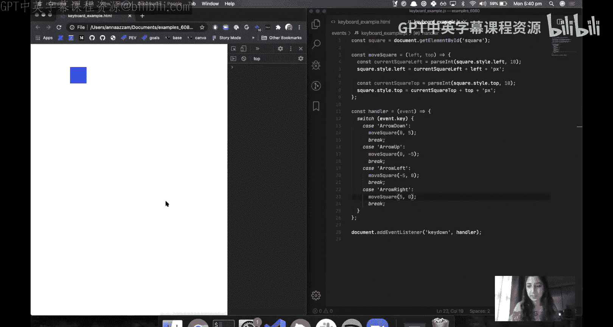

```javascript
document.addEventListener('keydown', (event) => {
    switch(event.key) {
        case 'ArrowDown':
            moveSquare(0, 5); // 向下移动，top增加
            break;
        case 'ArrowUp':
            moveSquare(0, -5); // 向上移动，top减少
            break;
        case 'ArrowLeft':
            moveSquare(-5, 0); // 向左移动，left减少
            break;
        case 'ArrowRight':
            moveSquare(5, 0); // 向右移动，left增加
            break;
    }
});
```

让我们尝试运行这段代码。现在我按下右方向键，方块向右移动；按下上方向键，方块向上移动。看起来代码运行正常。让我快速增加每次移动的像素数，比如改为5像素，这样移动得更快。这样，我们的键盘示例就完成了。

## 事件循环

现在我们来谈谈**事件循环**。JavaScript的并发模型基于一种称为事件循环的机制。

事件循环本质上是一个消息队列，它列出了需要处理的消息或事件。当一个事件被触发时，它会被添加到队列中。页面在处理完当前事件之前，不会运行下一个事件。

我们称之为事件循环，是因为它类似于这样一个循环：JavaScript持续地、同步地等待消息，同时处理任何正在等待处理的消息。

JavaScript的事件循环使用一种我们称之为**运行到完成**的模型。这意味着每个消息在被处理之前都会被完全处理。这样做的好处是，这是一个非常简单且易于理解的模型，我们在编写JavaScript代码时经常可以利用这一点。但缺点是，由于它是同步的，并且我们必须等待消息完全处理完毕才能处理其他消息，如果单个消息处理时间过长，就会占用主浏览器线程，导致浏览器无法处理其他任何事情。这意味着如果浏览器线程非常繁忙，我们甚至无法点击元素或滚动页面，因为这些事件没有被处理。

## 事件捕获与冒泡

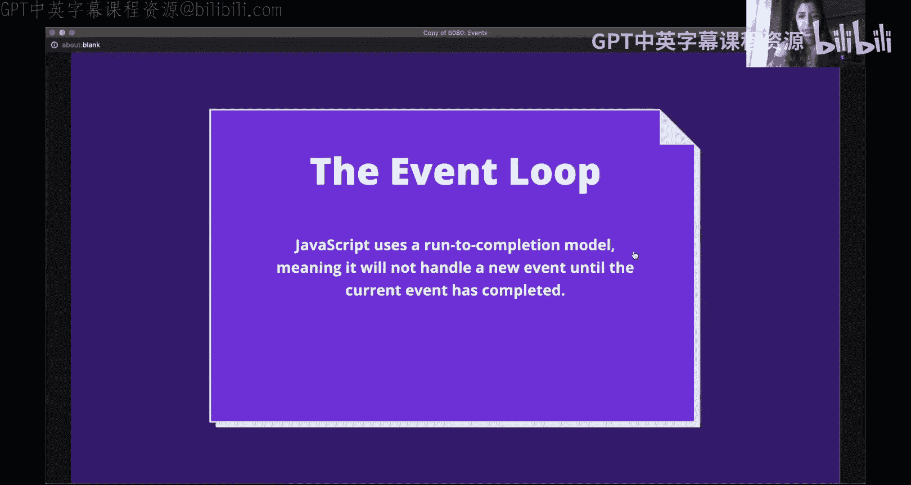

了解了事件循环后，现在让我们看看**事件捕获和冒泡**。这是一种理解事件如何在DOM中传播的方式。

当一个标准的DOM事件发生时，事件会经历三个传播阶段。下图展示了点击表格内一个`<td>`标签后的事件流：我们有`<table>`标签、`<tbody>`标签、`<tr>`标签，然后是`<td>`标签。

1.  **捕获阶段**：事件从最高层级（`window`）开始，向下经过`document`、`<html>`、`<body>`，一直穿过不同的标签，直到到达目标元素（本例中的`<td>`标签）。
2.  **目标阶段**：事件实际到达目标元素（`<td>`元素）的阶段。
3.  **冒泡阶段**：事件从目标元素开始，向上冒泡，一路返回到`window`。

冒泡的概念是：当一个事件在一个元素上发生时，它首先在该元素上运行处理器，然后在它的父元素上运行，然后一路向上在其祖先元素上运行，直到`window`。

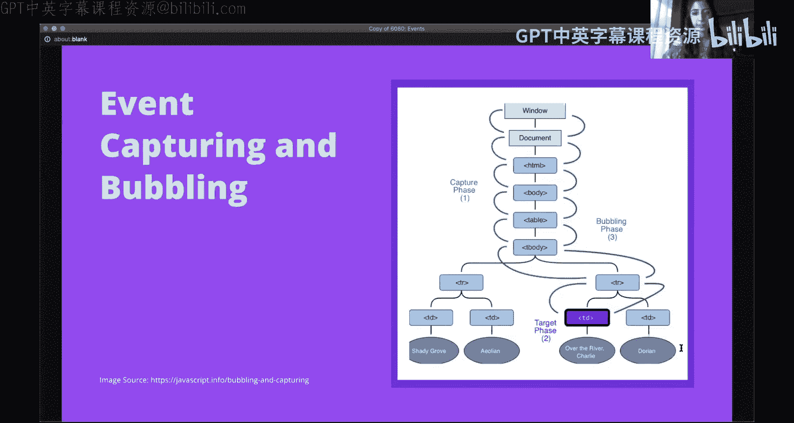

让我们做一个快速示例来演示事件捕获和冒泡。

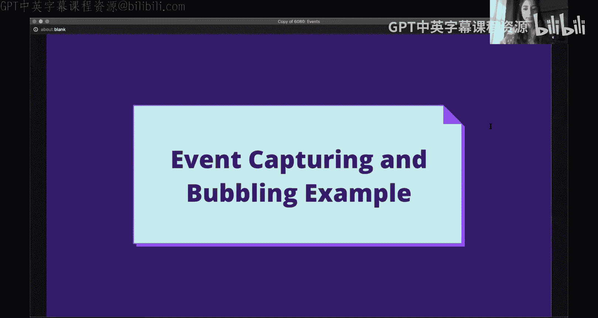

好的，这里我有一个示例HTML页面，其中有三个嵌套的`div`：`first`、`second`和`third`。我应用了一些样式，使它们看起来像嵌套在一起。


我还快速添加了一些JavaScript：在这里，我调用`getElementById`获取所有三个方块，然后给每个方块添加了一个`onclick`监听器。

让我快速演示一下运行时的效果：
*   如果我点击`first`，会弹出一个提示框显示“first”，因为我点击了第一个元素。
*   如果我点击`second`，事件处理器会先在目标元素（我们的第二个`div`）上被调用，然后它会冒泡到父元素（`first`）。所以会先提示“second”，然后提示“first”。
*   我对`third`做同样的事情：它会提示“third”，然后“second”，然后“first”，因为它从目标元素冒泡到父元素，再到父元素，一路向上直到DOM根。

我们有一个叫做`stopPropagation`的函数。`stopPropagation`的作用是阻止事件冒泡到其父元素。让我演示一下：如果我在监听器中添加`event`对象并执行`event.stopPropagation()`，那么当我点击`third`时，它就不会再冒泡到`second`和`first`了。它只会提示“third”。

以上就是关于事件冒泡和`stopPropagation`的内容。现在让我们看看`preventDefault`。

## 阻止默认行为

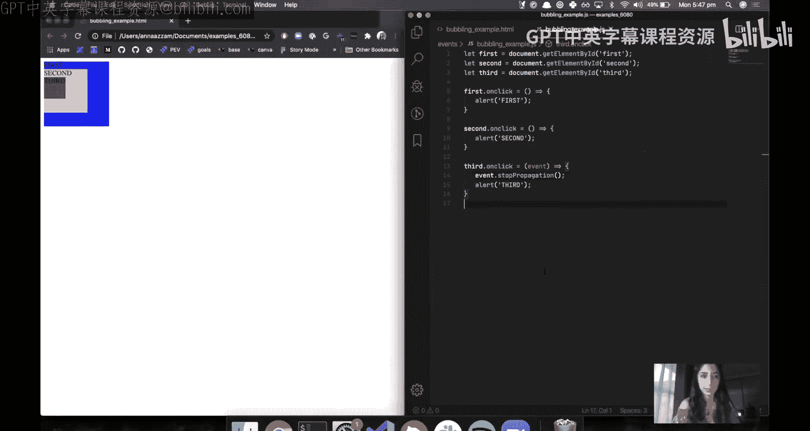

基本上，某些类型的DOM元素具有**默认行为**。例如：
*   点击复选框会切换复选框的选中状态（浏览器默认）。
*   图像也有默认的拖放行为，允许你将它们拖到另一个位置。
*   在文本输入字段中按键具有默认行为，即当你键入时，文本会输入到字段中。

在我们的事件监听器中，我们可以使用`preventDefault`函数来阻止默认行为发生，以防我们想要阻止它。让我们做一个快速示例来演示`preventDefault`。

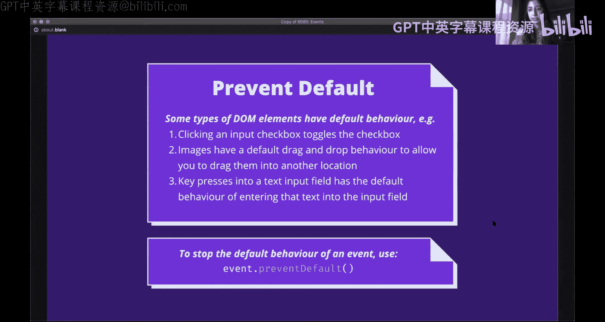

好的，我这里有一个HTML页面，上面有一个输入复选框字段（只是一个复选框）和一个输入文本字段（允许我输入）。


正如我之前所说，复选框的默认行为是当你点击它时，它会被选中；文本框的默认行为是当你在其中键入时，你输入的内容会出现在文本框中。

首先，我将为复选框演示`preventDefault`。我使用`getElementById`获取这个复选框，然后给它添加`click`事件监听器。在里面，我执行`event.preventDefault()`。如果我运行这段代码，当我尝试点击复选框时，它实际上不会被选中，因为我阻止了默认行为。如果我取消这行代码，它又能正常工作了。

现在，让我们为文本框做一个稍微不同的例子。首先，我也通过ID获取文本框，并为它添加`keypress`事件监听器。如果我执行`preventDefault`，它将完全不允许我输入。

现在我想做的是：允许输入，但只允许输入小写字母。如果有人尝试输入数字或符号，我不允许。我将使用事件的`charCode`属性来检查按下的键是否是小写字母。


```javascript
textBox.addEventListener('keypress', (event) => {
    if (event.charCode < 'a'.charCodeAt(0) || event.charCode > 'z'.charCodeAt(0)) {
        event.preventDefault();
        alert('Please use lowercase letters only.');
    }
});
```

让我们再次尝试运行。如果我输入小写字母，没问题。如果我尝试输入大写字母，我会收到提示“Please use lowercase letters only.”。这就是如何使用`preventDefault`。

## 综合示例：篮球拖放游戏

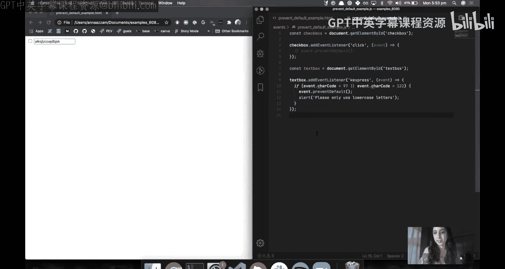

最后，我们将做一个结合了所有事件知识的例子：一个**拖放篮球游戏**。

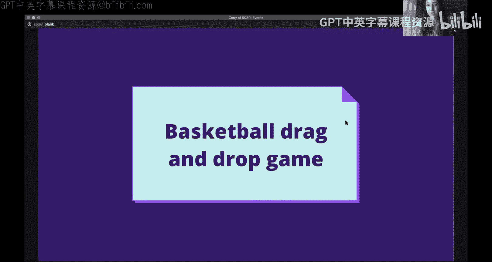

让我们开始我们的篮球拖放示例。我有一个HTML页面，上面有两张图片：一个篮球和一个篮筐。我还有一个标签显示分数，目前是0分。我已经将篮筐绝对定位在远离页面的位置。

首先，我要尝试让球本身可以被拖动。我将从DOM中获取这个元素。为了实现可拖动，我将结合使用三个事件：
*   `mousedown`：当球被按下时（相当于捡起球）。
*   `mouseup`：当释放时（相当于放下拖动）。
*   `mousemove`：鼠标移动事件。

我们之前在视频中看到，可以使用`event.clientX`和`clientY`来获取鼠标位置。我将使用`mousemove`事件将球定位到我的鼠标所在位置。

首先，从DOM中获取元素。

```javascript
const ball = document.getElementById('ball');
const hoop = document.getElementById('hoop');
const scoreboard = document.getElementById('scoreboard');
```


现在，我要给球添加`mousedown`和`mouseup`事件监听器。


```javascript
ball.addEventListener('mousedown', () => {
    console.log('mouse down');
});

ball.addEventListener('mouseup', () => {
    console.log('mouse up');
});
```

现在，我想添加`mousemove`事件监听器，但我只想在鼠标当前按下的情况下监听`mousemove`。为此，我将在`mousedown`内部添加`mousemove`事件监听器，并在`mouseup`内部移除它。

```javascript
let isDragging = false;

ball.addEventListener('mousedown', () => {
    isDragging = true;
    document.addEventListener('mousemove', onMouseMove);
});

ball.addEventListener('mouseup', () => {
    isDragging = false;
    document.removeEventListener('mousemove', onMouseMove);
});

function onMouseMove(event) {
    if (!isDragging) return;
    console.log('mouse move', event.clientX, event.clientY);
}
```

运行这个，当我在文档上移动鼠标时，如果没有在球上按下鼠标，控制台不会打印。当我在球上按下鼠标并开始移动时，控制台会打印`mousemove`事件。

你会注意到，当我捡起这个球时，球有一种奇怪的拖拽行为。但这不是自定义的拖放，这实际上是浏览器对图像元素的默认行为。我们想要做的是阻止拖动这个图像的默认行为。所以我只需要执行`event.preventDefault()`。

现在，我们想要做的是将球的位置更改为与鼠标坐标相同。为此，我将改变`ball.style.left`和`ball.style.top`，使它们等于鼠标的坐标。

```javascript
function onMouseMove(event) {
    if (!isDragging) return;
    event.preventDefault();
    ball.style.left = event.clientX + 'px';
    ball.style.top = event.clientY + 'px';
}
```

现在你可以看到，当我在球上按下鼠标并移动时，它跟着我的光标移动。但你可能注意到，当我按下鼠标并开始移动球时，球会跳一下。这是因为我将球的`top`和`left`位置设置为等于我的光标位置，而我想要的是我的光标保持在球元素内的相同相对位置。

为了避免第一次捡起时的跳跃，我需要计算光标在球元素内的偏移量。为了获取光标在球内的偏移量，我想获取光标的位置，然后从中减去球的边界客户端矩形的左上角点。

```javascript
let offsetX, offsetY;

ball.addEventListener('mousedown', (event) => {
    isDragging = true;
    const rect = ball.getBoundingClientRect();
    offsetX = event.clientX - rect.left;
    offsetY = event.clientY - rect.top;
    document.addEventListener('mousemove', onMouseMove);
});

function onMouseMove(event) {
    if (!isDragging) return;
    event.preventDefault();
    ball.style.left = (event.clientX - offsetX) + 'px';
    ball.style.top = (event.clientY - offsetY) + 'px';
}
```

现在再次运行，你可以看到它不再跳动了。

接下来我想做的是让这个游戏能够实际得分。我想实现：如果我把球拖到我们的小篮筐图形上，它将触发一个增加分数的函数。

首先，我想获取篮筐图片中那个红色小篮筐部分的坐标。这些偏移量等于红色篮筐相对于整个篮筐图片左上角的偏移量。

```javascript
const hoopOffsetX = 50; // 示例硬编码值
const hoopOffsetY = 30; // 示例硬编码值
```

让我们在我们的`onMouseMove`函数中添加一些逻辑，来计算我们当前的鼠标位置是否穿过了这个篮筐。让我们在一个全局变量中跟踪分数。

```javascript
let score = 0;
let hasScored = false; // 防止一次拖动中重复计分

function onMouseMove(event) {
    if (!isDragging) return;
    event.preventDefault();
    ball.style.left = (event.clientX - offsetX) + 'px';
    ball.style.top = (event.clientY - offsetY) + 'px';

    // 获取篮筐的实际位置
    const hoopRect = hoop.getBoundingClientRect();
    const hoopCenterX = hoopRect.left + hoopOffsetX;
    const hoopCenterY = hoopRect.top + hoopOffsetY;

    // 简单碰撞检测：检查球中心是否在篮筐中心附近
    const ballCenterX = event.clientX;
    const ballCenterY = event.clientY;
    const distance = Math.sqrt(
        Math.pow(ballCenterX - hoopCenterX, 2) +
        Math.pow(ballCenterY - hoopCenterY, 2)
    );

    if (distance < 25 && !hasScored) { // 25是碰撞阈值
        score++;
        hasScored = true;
        scoreboard.textContent = `Score: ${score}`;
        console.log('Goal scored!');
    }
}

// 在 mouseup 中重置 hasScored
ball.addEventListener('mouseup', () => {
    isDragging = false;
    hasScored = false;
    document.removeEventListener('mousemove', onMouseMove);
});
```

现在你可以看到我们的分数在增加。但你可能注意到一个错误：它增加得太多次了。因为它在`mousemove`上触发，当我移动到篮筐的红色部分时，它会增加多次。

为了解决这个问题，我们使用一个布尔值`hasScored`来存储在当前移动过方块的过程中分数是否已经增加过。我们只在`hasScored`为`false`时才增加分数，并在`mouseup`时重置它。

再次尝试。很好，现在每次拖动穿过篮筐只计分一次。

酷，这就是我们的篮球示例。这也结束了我们关于事件的这一讲。

## 总结

在本节课中，我们一起学习了JavaScript事件的核心概念。我们从了解什么是事件以及常见的事件类型（如鼠标和键盘事件）开始。然后，我们探讨了三种添加事件监听器的方法：HTML属性、DOM元素属性和`addEventListener`函数。

我们深入研究了事件对象，它包含了事件的详细信息，并学习了如何使用它来获取鼠标位置或按键信息。通过键盘控制方块移动的示例，我们实践了事件处理。

接着，我们了解了JavaScript的**事件循环**和**运行到完成**模型，理解了事件是如何被排队和处理的。我们还学习了事件的**捕获和冒泡**传播机制，以及如何使用`stopPropagation`来阻止冒泡。

最后，我们学习了如何使用`preventDefault`来阻止元素的默认行为，并通过构建一个完整的**篮球拖放游戏**综合示例，将事件监听、坐标计算、碰撞检测和状态管理结合在一起，巩固了所有关于事件的知识。

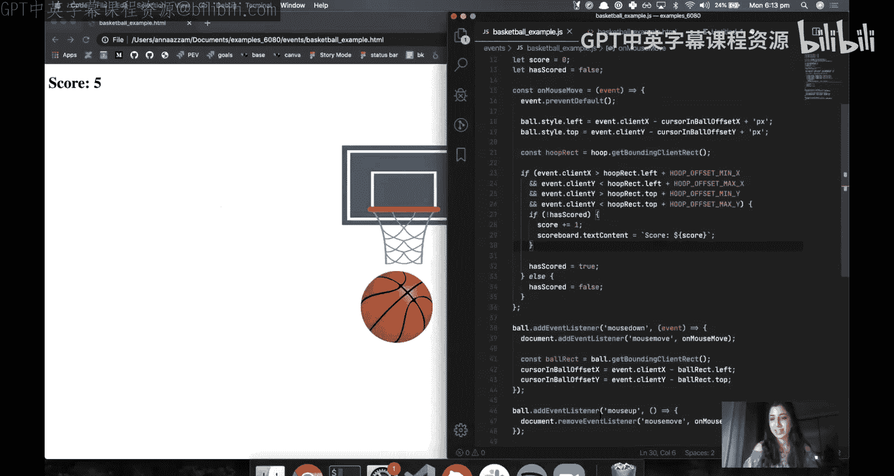

希望你能从这节课中学到有用的知识！