# 前端编程：第30讲：表单处理 🦄

在本节课中，我们将学习HTML表单的基础知识，包括如何创建表单、如何在JavaScript中访问表单数据，以及如何处理表单提交事件。我们将通过一个创建账户表单的实例，将所学知识融会贯通。

## 什么是表单？

表单是HTML页面或网页上的一种元素，允许用户输入数据。常见的应用场景包括调查问卷、登录或注册页面，以及求职申请表等。

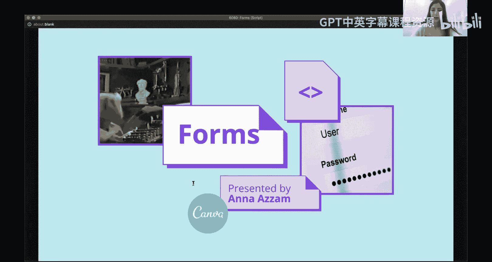

用户输入的数据可以是多种格式，例如文本、数字、日期选择器、复选框或单选按钮。客户端或服务器可以接收用户输入到表单中的信息，并对其进行处理。

## 在HTML中创建表单

创建HTML表单的基础是 `<form>` 元素。这个元素用于定义一个表单，其内部包含表单的内容，通常是标签和各种类型的输入元素。


以下是一个简单的表单示例：

```html
<form name="userForm">
  <label for="fname">First name:</label>
  <input type="text" id="fname" name="fname">
  <label for="lname">Last name:</label>
  <input type="text" id="lname" name="lname">
</form>
```

注意，我们使用 `type` 属性来指定输入元素的类型。`type` 属性的有效值包括 `button`、`radio`、`checkbox`、`email` 等。

## 在JavaScript中访问表单

上一节我们介绍了如何编写表单的HTML代码，本节中我们来看看如何在JavaScript中读取这些表单。

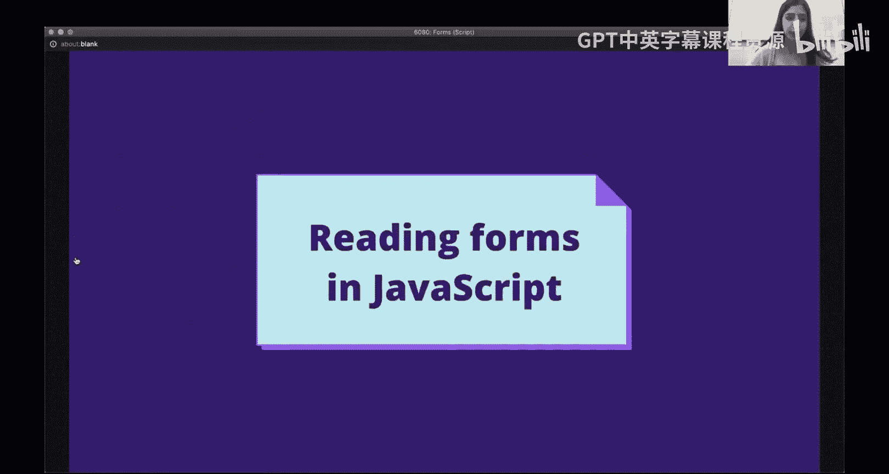

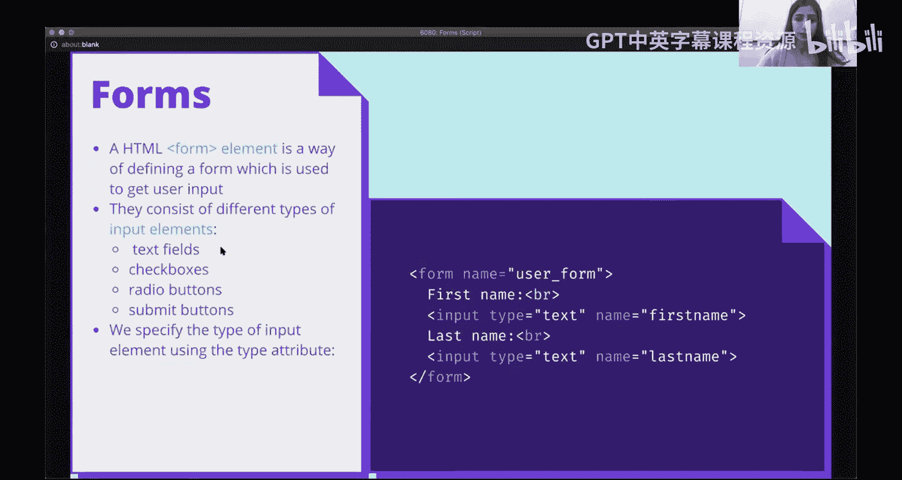

首先，你的网页上可能有一个或多个表单。JavaScript中的 `document` 对象有一个名为 `forms` 的属性，你可以通过它找到文档中的所有表单。

`document.forms` 是一个命名集合，这意味着我们可以像数组一样索引它，也可以使用表单的名称来查找表单。

以下是访问表单的几种方式：

*   **通过名称访问**：`document.forms.test` 或 `document.forms["test"]` 可以访问名为 `test` 的表单。
*   **通过索引访问**：`document.forms[0]` 可以获取文档中的第一个表单。

`document.forms` 返回的是一个 `HTMLCollection`，类似于一个 `HTMLFormElement` 对象的数组。

## 访问表单中的输入元素

获取到表单元素后，我们还需要知道如何获取表单中的具体输入元素。表单元素有一个名为 `elements` 的字段，它也是一个命名集合，包含了该表单中的所有输入元素。

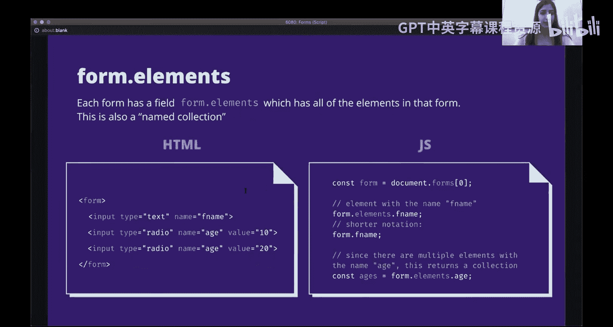

以下是一个HTML表单示例及其对应的JavaScript访问方式：

```html
<form name="sampleForm">
  <input type="text" name="fname">
  <input type="radio" name="age" value="young">
  <input type="radio" name="age" value="old">
</form>
```

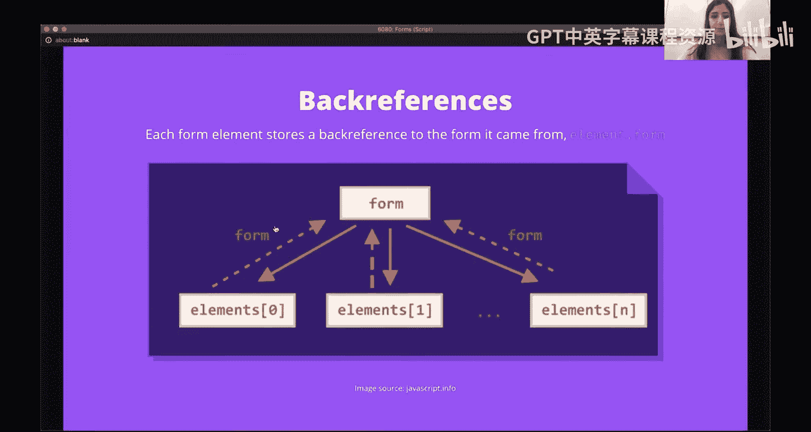

```javascript
// 获取表单
const form = document.forms[0]; // 或 document.forms.sampleForm

// 访问名为“fname”的输入元素
const firstNameInput = form.elements.fname; // 或 form.fname (简写)
const firstNameValue = firstNameInput.value; // 获取用户输入的值

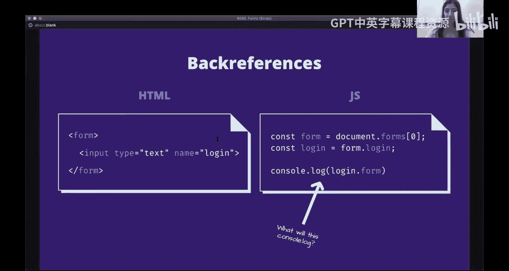

// 访问名为“age”的单选按钮组
const ageRadioGroup = form.elements.age; // 返回一个集合
```

对于像单选按钮组这样具有相同名称的多个元素，`form.elements.age` 会返回一个集合。

## 反向引用

表单元素的一个核心特性是反向引用。当你有一个表单内的输入元素时，该元素实际上有一个 `form` 属性，它存储了对包含它的表单的反向引用。

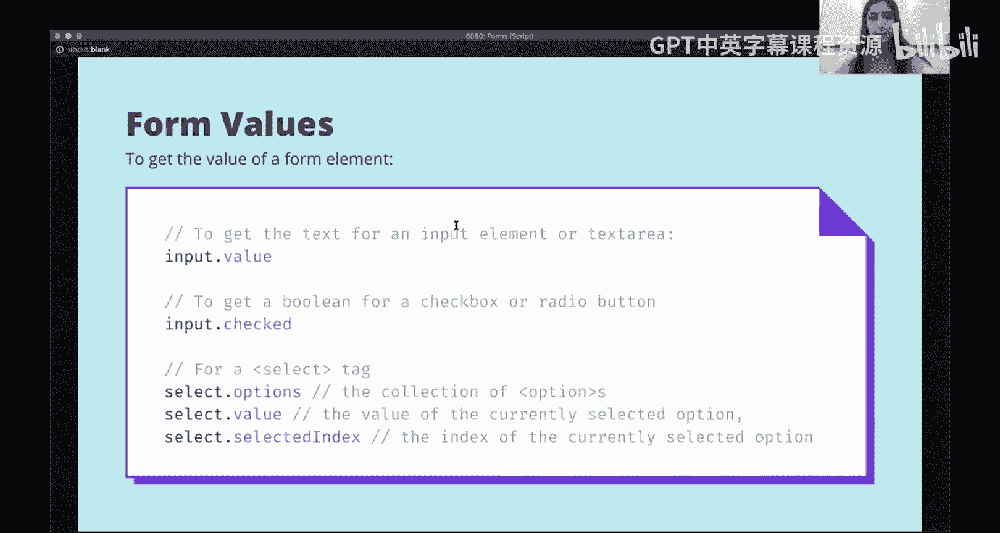

这意味着，从一个输入元素出发，你可以轻松地找到它所属的表单。

```javascript
// 假设有一个名为“login”的输入元素
const loginInput = document.forms[0].login;
// 通过反向引用获取其所属的表单
const parentForm = loginInput.form; // 这与 document.forms[0] 相同
```

## 读取输入值

获取到表单内的元素后，我们需要读取用户实际输入的值。读取方式取决于输入元素的类型。

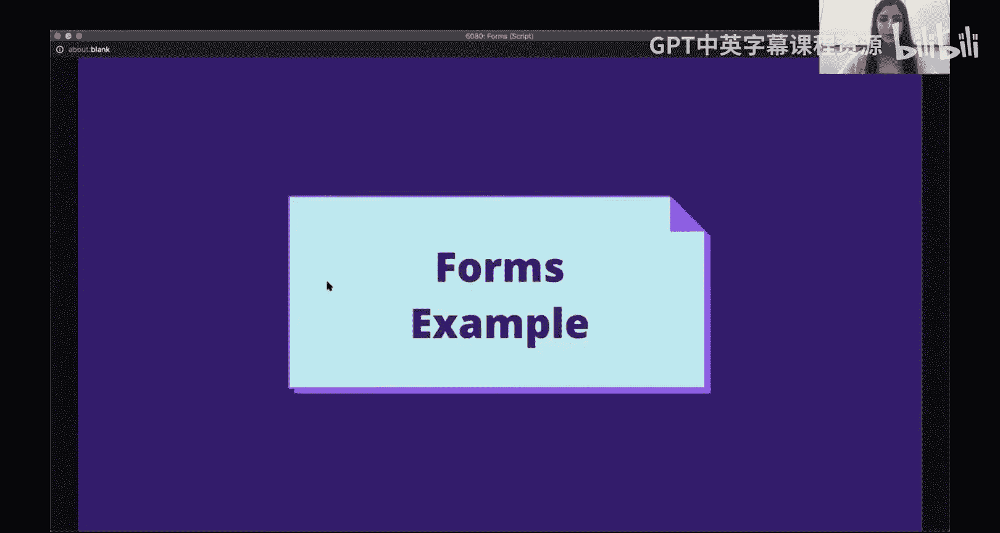

以下是几种常见输入类型的值读取方法：

*   **文本输入**：`input.value` 返回用户输入的字符串。
*   **复选框/单选按钮**：`input.checked` 返回一个布尔值，表示该选项是否被选中。
*   **下拉选择框**：
    *   `select.options` 返回所有选项的集合。
    *   `select.value` 返回当前选中选项的值。
    *   `select.selectedIndex` 返回当前选中选项在选项数组中的索引。

## 处理表单提交事件

现在我们已经学会了如何读取用户输入到表单中的数据，接下来看看如何知道用户何时提交了表单，以便在适当的时机运行我们的代码。

当你创建一个表单时，应该添加一个特殊类型的按钮，即提交按钮 (`type="submit"`)。当用户点击此按钮时，会触发一个 `submit` 事件。我们可以在JavaScript中监听这个事件，并在事件触发时执行回调函数。

以下是如何为表单添加提交事件监听器的示例：

```javascript
const myForm = document.forms.myForm;

myForm.addEventListener('submit', function(event) {
  // 阻止表单的默认提交行为（例如，防止页面跳转）
  event.preventDefault();

  // 在这里进行表单验证或处理数据
  console.log('表单已提交！');
  // ... 你的处理逻辑
});
```

## 实战演练：创建账户表单

现在，我们将把前面学到的所有知识结合起来，创建一个“创建账户”表单，并编写JavaScript代码来处理表单数据。

### 第一步：编写HTML表单结构

我们将创建一个包含用户名、出生日期、密码、确认密码、所在州和头像上传字段的表单。

```html
<form name="createAccount">
  <input type="text" name="name" placeholder="Enter your name">
  <input type="date" name="dob">
  <input type="password" name="password1" placeholder="Enter your password">
  <input type="password" name="password2" placeholder="Confirm your password">
  <select name="state">
    <option value="nsw">NSW</option>
    <option value="vic">VIC</option>
    <option value="qld">QLD</option>
  </select>
  <input type="file" name="photo">
  <input type="submit" value="Sign Up">
</form>
```

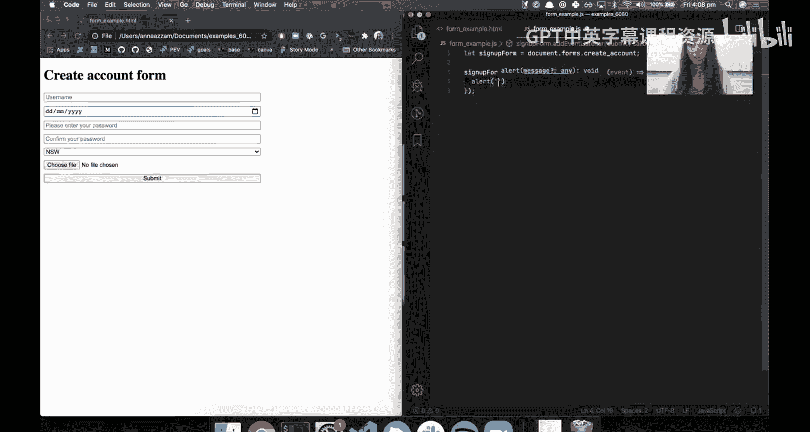

### 第二步：添加提交事件监听器

首先，在JavaScript中获取表单元素，并为其添加 `submit` 事件监听器。初始时，我们只弹出一个提示框。

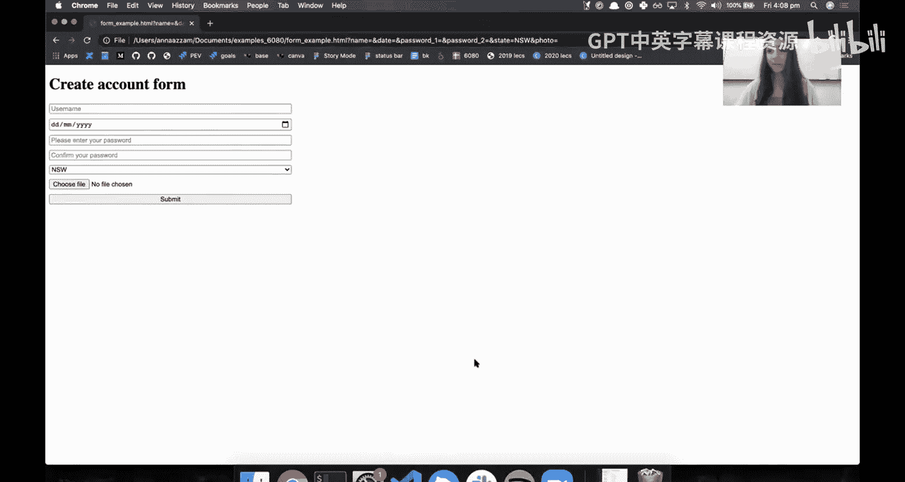

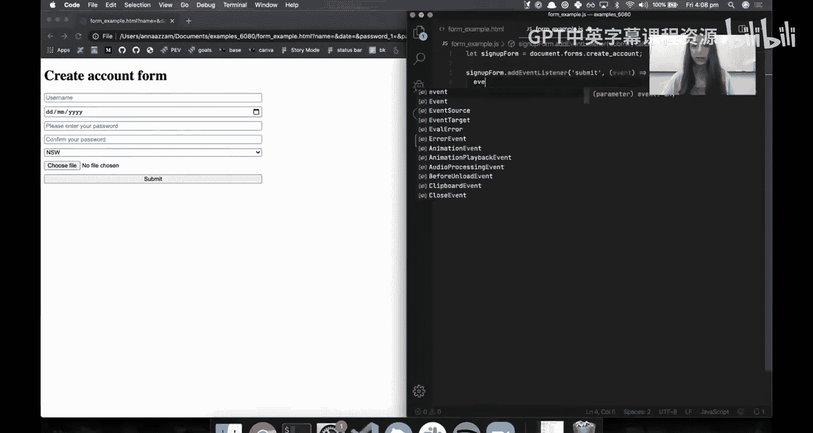

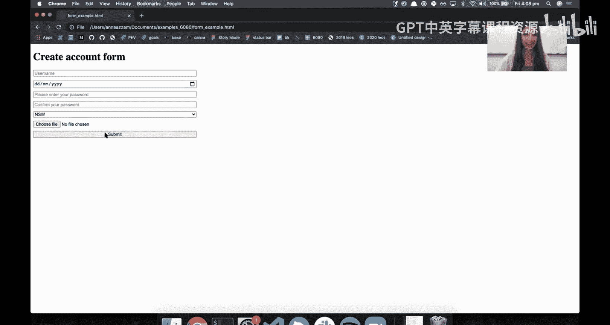

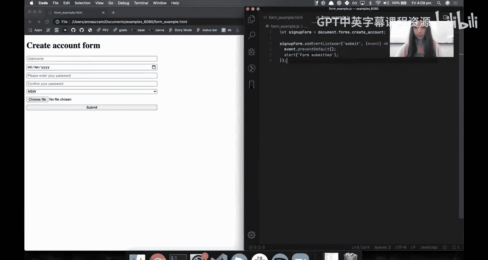

```javascript
const form = document.forms.createAccount;

form.addEventListener('submit', function(event) {
  event.preventDefault(); // 阻止默认提交行为
  alert('Form submitted');
});
```

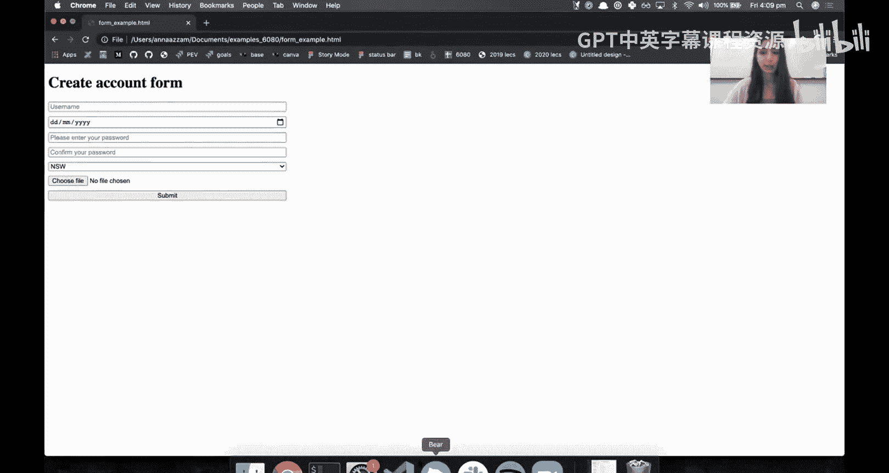

### 第三步：读取并显示表单数据

在事件监听器中，我们读取各个字段的值，并将它们组合成一个字符串显示出来。

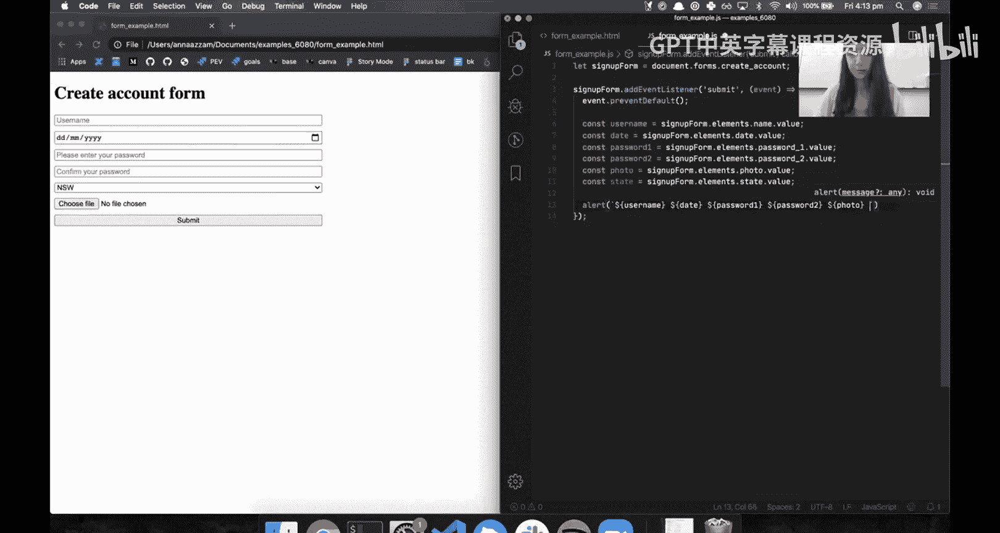

```javascript
form.addEventListener('submit', function(event) {
  event.preventDefault();

  const name = form.elements.name.value;
  const dob = form.elements.dob.value;
  const password1 = form.elements.password1.value;
  const password2 = form.elements.password2.value;
  const state = form.elements.state.value;
  const photo = form.elements.photo.files[0]?.name; // 获取文件名

  const message = `Name: ${name}\nDOB: ${dob}\nPassword1: ${password1}\nPassword2: ${password2}\nState: ${state}\nPhoto: ${photo}`;
  alert(message);
});
```

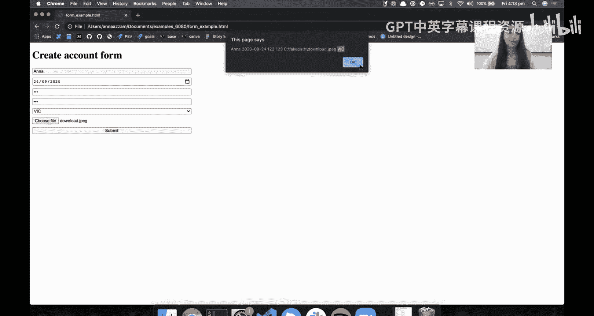

### 第四步：添加表单验证

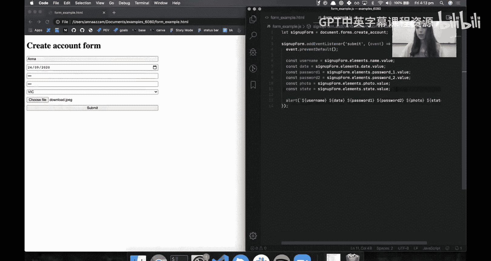

最后，我们添加一些基本的表单验证逻辑，例如检查所有字段是否已填写，以及两次输入的密码是否一致。

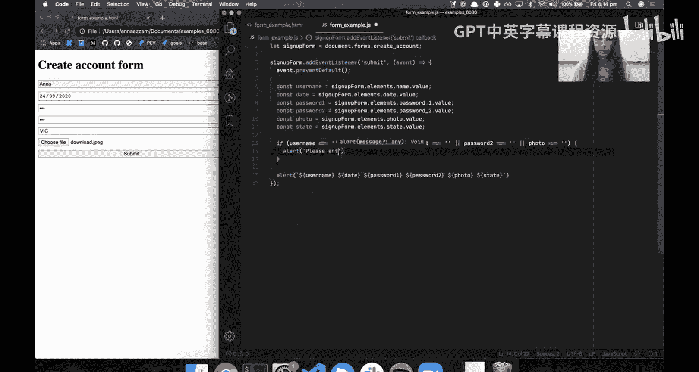

```javascript
form.addEventListener('submit', function(event) {
  event.preventDefault();

  const name = form.elements.name.value;
  const dob = form.elements.dob.value;
  const password1 = form.elements.password1.value;
  const password2 = form.elements.password2.value;
  const state = form.elements.state.value;

  // 1. 检查必填字段
  if (!name || !dob || !password1 || !password2 || !state) {
    alert('Please enter all fields');
    return; // 停止执行后续代码
  }

  // 2. 检查密码是否匹配
  if (password1 !== password2) {
    alert('Passwords do not match');
    return;
  }

  // 3. 如果验证通过，则显示数据（或发送到服务器）
  const photo = form.elements.photo.files[0]?.name;
  const message = `Name: ${name}\nDOB: ${dob}\nState: ${state}\nPhoto: ${photo}`;
  alert(`Account created successfully!\n${message}`);
});
```

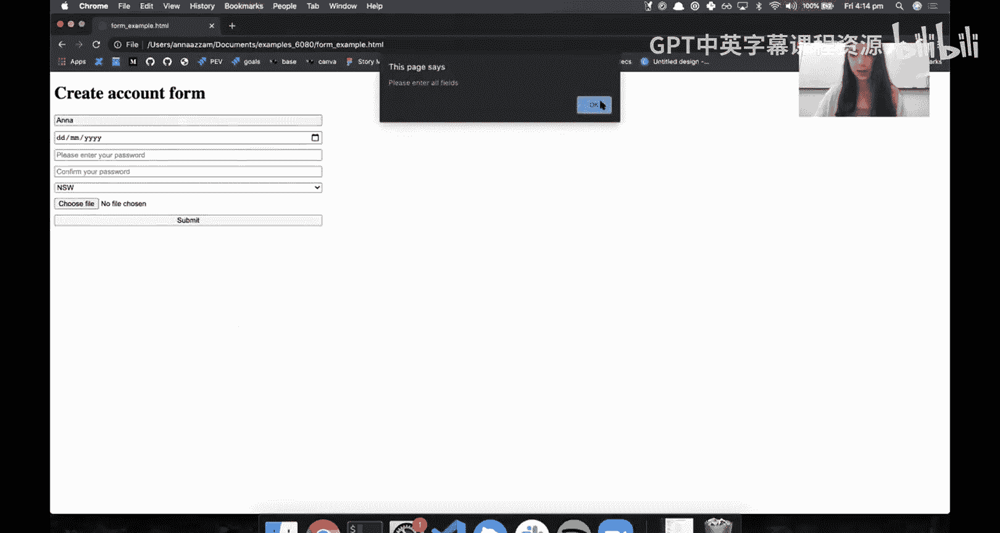


## 总结

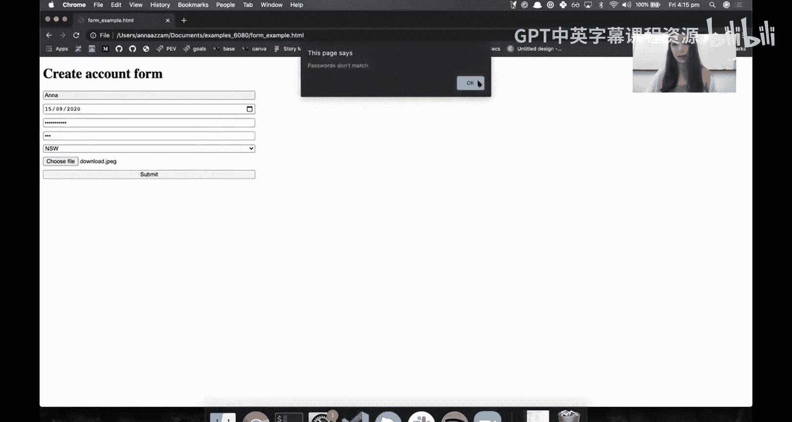

本节课中我们一起学习了HTML表单的核心知识。我们了解了如何使用 `<form>` 元素和各类 `<input>` 元素构建表单，掌握了在JavaScript中通过 `document.forms` 和 `form.elements` 访问表单及其内部元素的方法，并学习了如何利用 `value`、`checked` 等属性读取用户输入的数据。

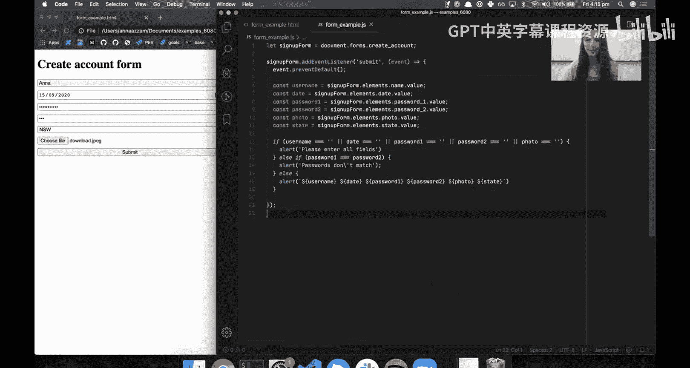

最后，我们通过一个完整的“创建账户”表单实例，实践了如何监听 `submit` 事件、阻止默认提交行为、读取表单数据以及实现基本的客户端验证。这些是构建交互式网页应用的基础技能。