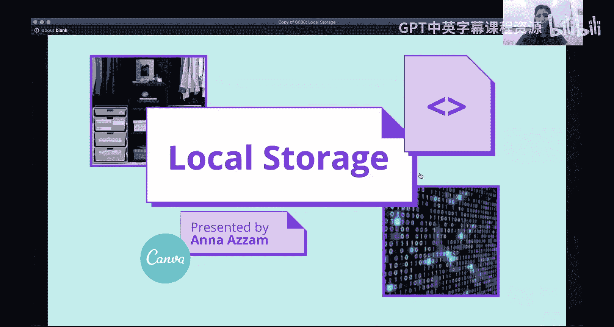
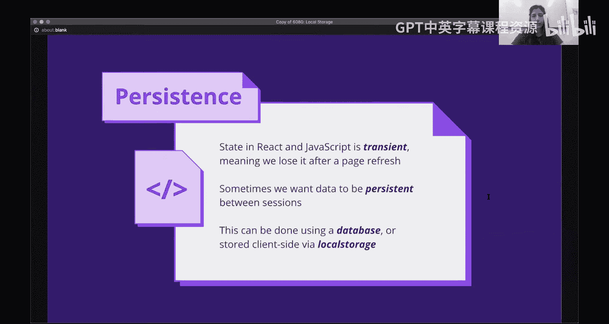
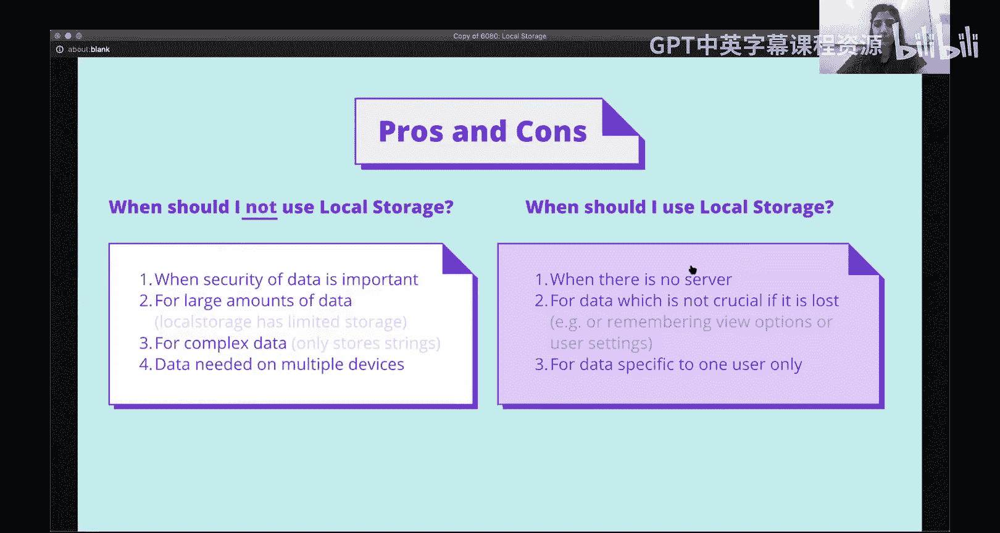
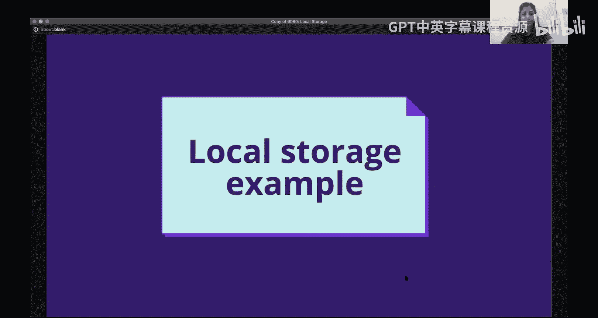
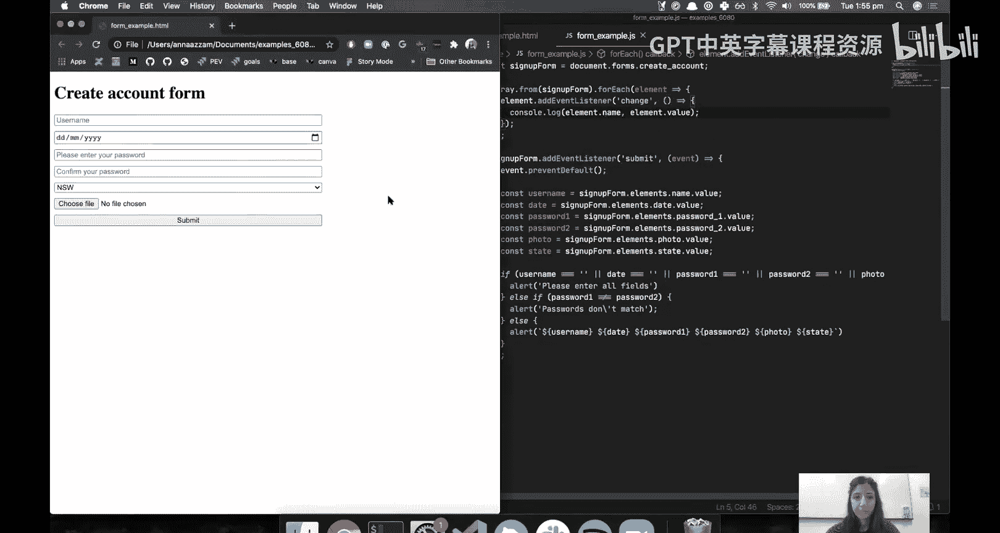
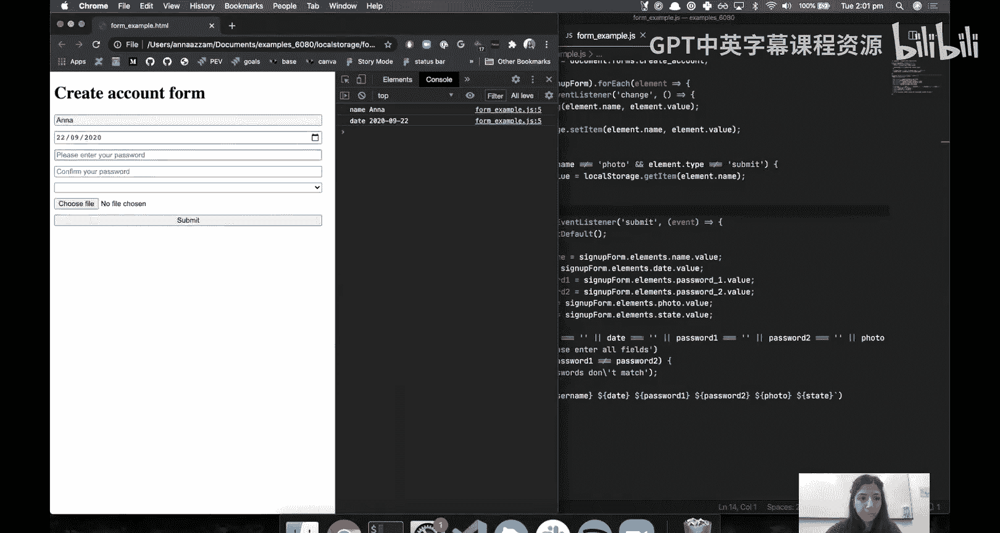
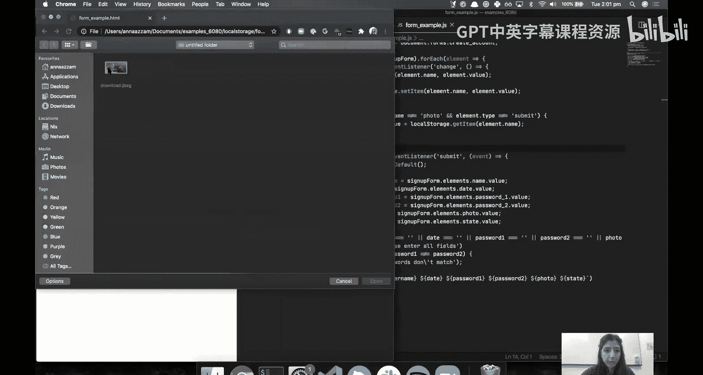
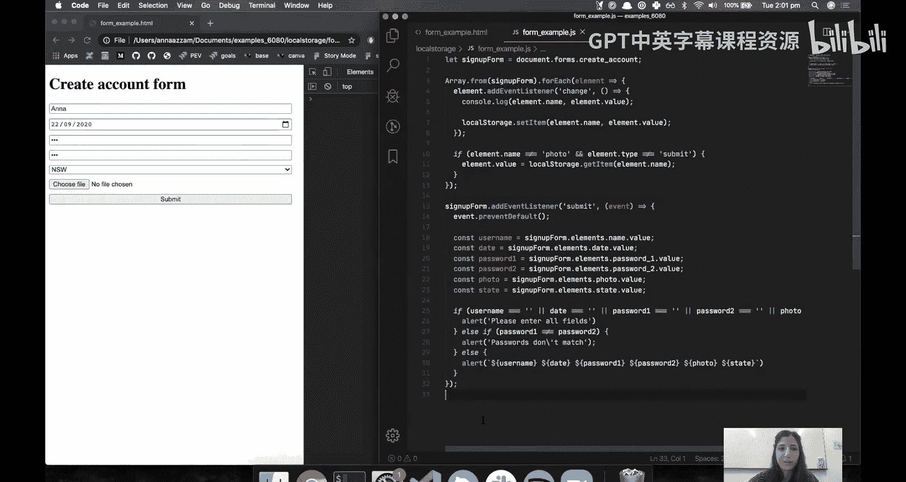

# 前端编程：第31讲：本地存储 🗄️



在本节课中，我们将学习一种在不同浏览器会话间保存数据的方法，这种方法被称为本地存储。



## 概述

到目前为止，在我们的JavaScript和React项目中，内存中的数据状态是临时的。这意味着当我们刷新页面时，数据会消失，并且无法在不同的浏览器会话之间访问。然而，我们常常希望数据能在会话之间持久保存。例如，用户可能有一些设置，我们希望在他们下次访问网站时保存这些设置。当我们想要存储数据时，可以将其存储在服务器端的数据库中，也可以存储在客户端，例如本地存储中。

## 数据持久化的两种方式

上一节我们介绍了数据持久化的需求，本节中我们来看看实现它的两种主要方式。

*   **服务器端持久化**：这是最传统的方式。当我们想要存储数据时，会将其存储在服务器的数据库中。这涉及在需要检索和修改数据时向后端服务器发出请求，然后后端端点会处理这些数据，并将其保存到数据库或从数据库中检索。
*   **客户端持久化**：这意味着将信息存储在用户的机器上，即他们的浏览器中。这可以通过使用本地存储来实现。

客户端持久化不能替代服务器端持久化，它有一些优缺点，我们稍后会深入探讨。其主要限制是，存储在客户端的数据只能由该特定客户端访问，因为它不在服务器上，只存在于客户端。然而，客户端持久化仍然是为你的网站添加持久性的一种非常快速和简单的方法。因此，在本视频中，我们将重点介绍如何使用本地存储来实现这一点。

## 什么是本地存储？🤔

本地存储是浏览器中存在的一个API，它允许你读写文档中的存储对象。你写入存储对象的数据会在会话之间持久保存，这意味着即使用户刷新、关闭标签页或浏览器，数据也会保留。

## 本地存储的优缺点

在深入了解如何在JavaScript中使用本地存储API之前，我们先来看看使用本地存储的一些优缺点。

以下是本地存储的一些限制，以及一些你不希望使用本地存储的情况：

1.  **不安全**：本地存储可以被任何网页访问。因此，如果任何网页知道你用来存储数据的密钥，它就可以访问和更改你存储的数据。因此，在任何数据安全性很重要的情况下，例如密码或个人身份信息，不应使用本地存储。
2.  **存储限制**：本地存储可以存储的数据量是有限制的，具体限制取决于所使用的浏览器。即使用户访问的其他网站已经在本地存储中存储了大量数据，用户的浏览器可能已经达到了存储限制。当你尝试使用本地存储时，可能会遇到配额限制。当你达到配额限制时，你将无法成功保存数据。因此，对于任何关键信息或大量数据，本地存储不是一个好的解决方案。
3.  **仅支持字符串**：本地存储只支持存储字符串。它接受键值对，但值只能是字符串。因此，它不适合存储复杂数据。这并不是一个非常困难或严重的限制，因为你总是可以将JSON对象序列化为字符串。但值得注意的是，如果你使用本地存储来存储复杂数据，则需要做一些额外的工作来序列化和反序列化数据。
4.  **不适用于多设备数据**：由于它存储在客户端，因此只能在该特定客户端上访问。因此，它不适用于多个用户需要的数据，也不适用于用户在不同设备上访问你的网站时需要该数据的情况。

现在，让我们看看本地存储的适用场景。本地存储非常适合以下几种情况：



1.  **纯前端网站**：对于没有服务器的纯前端网站，它是一种非常快速和简单的添加持久性的方法。
2.  **存储非关键信息**：它适合存储如果丢失也不关键的信息。存储在客户端意味着如果用户清除了他们的本地存储或浏览器存储，他们将丢失你存储的内容。此外，如果他们想从另一台设备访问你的网站，他们将无法访问存储在本地存储中的数据。因此，我建议将其用于非关键数据。
3.  **特定用户数据**：数据存储在客户端意味着它只对特定用户可用。

一些适合使用本地存储的例子包括：个人网站偏好设置（例如用户自定义的颜色方案）、持久化用户之前的活动（例如，在购物网站上，你可能希望存储他们购物车的内容，并在他们离开页面时不丢失这些信息）。

## 如何使用本地存储API



现在，让我们来看看如何在JavaScript中实际使用本地存储API。

浏览器的本地存储是一个由键值对组成的大对象。我们可以像操作JavaScript中的Map一样读写它。

以下是核心操作方法：

*   **添加/更新数据**：要向本地存储对象添加键值对，可以使用 `setItem` 方法。如果已存在具有该键的项目，该项目将被覆盖。
    ```javascript
    localStorage.setItem('key', 'value');
    ```
*   **读取数据**：可以使用 `getItem` 方法并传入一个键来从本地存储中检索数据。如果键存在则返回值，如果不存在则返回 `null`。
    ```javascript
    const value = localStorage.getItem('key');
    ```
*   **删除数据**：要使用给定的键从本地存储中删除一个项目，可以使用 `removeItem` 方法。
    ```javascript
    localStorage.removeItem('key');
    ```
*   **清空所有数据**：如果要清除本地存储中的所有项目，可以使用 `clear` 方法。
    ```javascript
    localStorage.clear();
    ```

## 实践示例：表单数据持久化



让我们通过一个例子来实践。你可能还记得上周关于表单的讲座，我们创建了一个用户创建账户的表单示例。它包含用户名、出生日期、密码、州和文件处理器等字段，并且我们还有一些处理表单提交的JavaScript。

现在，我们将添加一些本地存储功能，以持久化用户输入到表单中的数据。为了快速演示这里的问题，如果我输入一些数据，然后刷新页面，我输入的所有数据都会丢失，这对用户来说可能相当令人沮丧。因此，网站通常会使用本地存储来保留表单中的数据。

在本讲座前面提到过，在本地存储中存储安全数据不一定是个好主意，因为本地存储确实存在一些安全问题。但仅为了演示如何使用本地存储，我们将把所有创建账户的信息存储在本地存储中。

以下是实现步骤：

1.  **监听输入变化**：我想做的是，当用户更改他们在这些字段中输入的内容时，添加一个事件监听器。为此，我将监听表单中每个元素的 `change` 事件。
    ```javascript
    const formElements = Array.from(signUpForm.elements);
    formElements.forEach(element => {
        element.addEventListener('change', (event) => {
            // 获取元素名称和值
            const key = element.name;
            const value = element.value;
            // 保存到本地存储
            localStorage.setItem(key, value);
        });
    });
    ```
2.  **页面加载时填充数据**：最后，当页面加载时，我希望用之前输入到本地存储中的所有字段来填充这个表单。
    ```javascript
    formElements.forEach(element => {
        // 确保不是文件输入或提交按钮
        if (element.type !== 'file' && element.type !== 'submit') {
            const savedValue = localStorage.getItem(element.name);
            if (savedValue) {
                element.value = savedValue;
            }
        }
    });
    ```

运行此代码后，当我在表单中输入信息并刷新页面时，所有字段都会自动填充我之前输入的数据。





## 总结



本节课中我们一起学习了本地存储。我们了解了数据持久化的概念、本地存储的定义、它的优缺点以及适用场景。我们重点掌握了如何使用 `setItem`、`getItem`、`removeItem` 和 `clear` 这些核心API来操作本地存储。最后，通过一个表单数据持久化的实践示例，我们巩固了如何在实际项目中应用本地存储来提升用户体验。记住，本地存储适合存储非关键、用户特定的临时数据，但对于敏感或需要在多设备间同步的数据，应考虑服务器端解决方案。