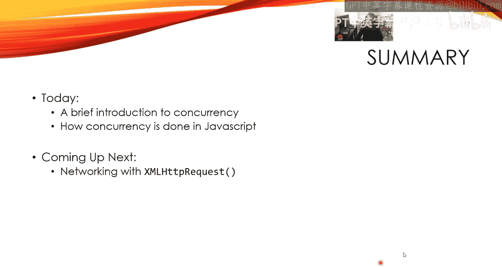

# 前端编程：COMP6080：JavaScript 异步编程 🐟 事件与回调


在本节课中，我们将学习 JavaScript 中的并发模型，特别是异步编程、事件循环和回调函数。我们将探讨同步与异步编程的区别，理解 JavaScript 如何通过事件循环处理多个任务，并学习如何避免阻塞用户界面。

---

## 概述

JavaScript 是一种单线程语言，但它通过事件循环和异步编程模型，能够高效地处理多个任务，如网络请求和用户交互。本节课将解释这些核心概念，帮助你理解 JavaScript 如何在不阻塞主线程的情况下执行耗时操作。

---

## 同步与异步编程

上一节我们介绍了客户端-服务器模型和 AJAX 的基本概念。本节中，我们将探讨同步与异步编程的区别。

同步编程是大多数初学者首先接触的编程方式。程序从上到下顺序执行，每一行代码必须完全执行完毕后，才会执行下一行。这保证了代码的可预测性和易于推理。

```javascript
let a = b;
b = b + 1;
let c = b; // c 的值是 a + 1
```

异步编程则允许多个控制流同时存在。一个控制流可以称为一个“线程”。在异步模型中，程序可以在等待一个任务（如网络请求）完成的同时，继续执行其他任务。

在同步世界中，进程 A 调用进程 B 的函数后，会等待进程 B 完成并返回结果，然后进程 A 才继续执行。

在异步世界中，进程 A 启动进程 B 的任务后，不会等待，而是立即继续执行自己的代码。进程 B 在后台运行，完成后通过某种方式通知进程 A。

---

## 并发模型：抢占式与协作式

有两种主要的并发模型：抢占式和协作式。

抢占式多任务处理中，多个进程真正同时运行在不同的 CPU 核心上。它们通过共享内存等机制通信，但这也带来了数据竞争的风险，即多个进程同时修改同一数据导致不可预测的结果。

协作式多任务处理中，多个进程在一个 CPU 核心上交替运行。进程 A 运行一段时间，然后主动让出控制权，进程 B 开始运行，如此循环。这种模型非常适合 I/O 密集型任务。

I/O 密集型任务是指大量时间花在等待输入/输出操作上的任务，例如读取磁盘、等待网络响应或等待用户输入。CPU 的运算速度极快，而 I/O 操作相对非常慢。在等待 I/O 时，CPU 可以转而执行其他任务，从而大幅提高效率。

JavaScript 采用的就是协作式模型。每个待处理的任务被称为一个“事件”。JavaScript 运行时维护一个“事件循环”，不断检查事件队列。每个事件处理器（或回调函数）都会独立且完整地运行，不会中途被其他事件打断。这避免了数据竞争问题，因为同一时刻只有一个事件处理器在操作内存。

---

## JavaScript 事件循环详解

现在，让我们深入了解 JavaScript 事件循环的具体工作机制。

事件循环的核心是一个先进先出的事件队列。各种事件源（如网络活动、键盘输入、鼠标点击）会产生事件，并被推送到这个队列中。

JavaScript 运行时会持续运行一个循环。在循环的每一次迭代中，它会检查事件队列的头部。如果队列中有事件，它会取出该事件，查找并执行与之关联的事件处理器。**关键点在于，每个事件处理器都会运行至完成**。在此期间，事件循环会暂停，不会处理队列中的下一个事件。只有当当前处理器执行完毕后，事件循环才会继续处理下一个事件。

全局作用域中的代码可以看作是第一个要运行至完成的“任务”。之后，事件循环才正式开始工作。

浏览器环境为 JavaScript 引擎提供了一些支持，例如倒计时计时器和网络通信的实际操作。JavaScript 事件循环本身不处理这些底层细节，它只负责响应“计时器到期”或“网络响应返回”这类高层事件。

---

## 实践示例：`setTimeout`

以下是理解事件循环顺序的一个经典示例。

```javascript
function foo() {
    const h1 = document.createElement('h1');
    h1.innerText = 'foo';
    document.body.appendChild(h1);
}

function bar() {
    const h1 = document.createElement('h1');
    h1.innerText = 'bar';
    document.body.appendChild(h1);
}

function baz() {
    const h1 = document.createElement('h1');
    h1.innerText = 'baz';
    document.body.appendChild(h1);
}

// 全局作用域开始执行
foo();
setTimeout(bar, 2500); // 延迟 2.5 秒
setTimeout(baz, 0); // 延迟 0 毫秒
console.log('Hello');
```

执行流程分析：
1.  首先，全局代码从上到下执行。`foo()` 被调用并立即执行，页面显示 “foo”。
2.  遇到 `setTimeout(bar, 2500)`。它不会立即执行 `bar`，而是将“在 2.5 秒后执行 `bar`”这个任务安排到事件队列中，然后立即返回。
3.  遇到 `setTimeout(baz, 0)`。同样，它将“尽快执行 `baz`”这个任务安排到事件队列中，然后立即返回。
4.  执行 `console.log('Hello')`，控制台输出 “Hello”。
5.  **全局代码执行完毕**。此时，事件队列中有两个任务：`baz` 和 `bar`（`bar` 要等 2.5 秒后才可执行）。
6.  事件循环开始工作。它取出队列中的第一个任务（此时是 `baz`），并执行它，页面显示 “baz”。
7.  大约 2.5 秒后，`bar` 任务变为可执行状态，事件循环取出并执行它，页面显示 “bar”。

因此，最终输出顺序是：页面显示 “foo”，控制台输出 “Hello”，页面显示 “baz”，2.5 秒后页面显示 “bar”。

---

## 阻塞事件循环的警告

由于事件处理器是运行至完成的，如果一个处理器执行了非常耗时的计算（CPU 密集型任务），那么在这段时间内，事件循环将被完全阻塞。

这意味着：
*   页面动画会卡顿。
*   用户输入（点击、打字）无法响应。
*   其他网络请求的回调也无法执行。

以下是一个模拟阻塞的例子：

```javascript
// 一个模拟的耗时计算函数
function longCalculation() {
    let result = 0;
    for (let i = 0; i < 100000000; i++) { // 很大的循环
        result += i;
        // 尝试在循环中更新DOM，但UI在循环结束前不会刷新
        document.getElementById('result').innerText = i;
    }
    return result;
}
// 点击按钮触发这个函数
document.getElementById('calcBtn').addEventListener('click', longCalculation);
```

点击按钮后，页面会冻结数秒，直到循环结束。在此期间，你无法进行任何交互。

**最佳实践**：避免在浏览器主线程中进行复杂的 CPU 计算。应将这类计算任务转移到 Web Worker 或在服务器端（后端）完成。

---

## 总结

本节课中我们一起学习了 JavaScript 异步编程的核心机制。

我们首先对比了同步和异步编程模型。然后深入探讨了协作式并发模型，这是 JavaScript 高效处理 I/O 密集型任务的基础。我们详细解析了 **事件循环** 的工作原理：它管理着一个事件队列，并依次执行每个事件的处理器至完成。

通过 `setTimeout` 的例子，我们看到了异步代码的执行顺序。最后，我们强调了**避免阻塞事件循环**的重要性，长时间运行的同步任务会冻结整个页面交互。



下一节课，我们将运用关于事件循环的知识，学习第一种在 JavaScript 中进行网络请求的技术：XMLHttpRequest。