# 前端编程：COMP6080：JavaScript 异步编程之 Promise 🐟

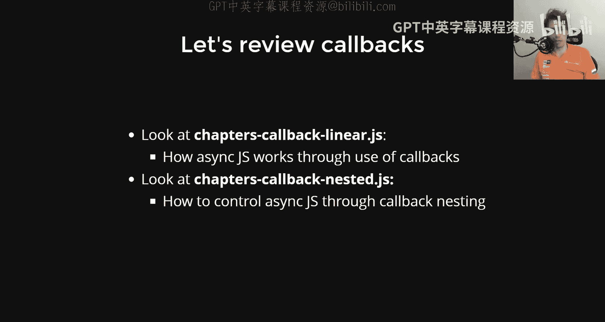

在本节课中，我们将要学习 JavaScript 异步编程的核心概念之一：Promise。我们将了解它如何解决传统回调函数带来的问题，并学习其基本语法、创建方法以及高级用法，如链式调用和组合。

## 概述

JavaScript 与 Python 或 C 等语言不同，默认内置了异步特性。我们已经探讨过回调和事件监听器，它们意味着 JavaScript 中的操作本质上是并发的，不会一直阻塞程序执行。例如，`setTimeout` 允许我们在设定时间后执行代码，而程序会继续运行。本节我们将深入探讨 Promise，它是回调的演进，旨在更优雅地管理异步操作。

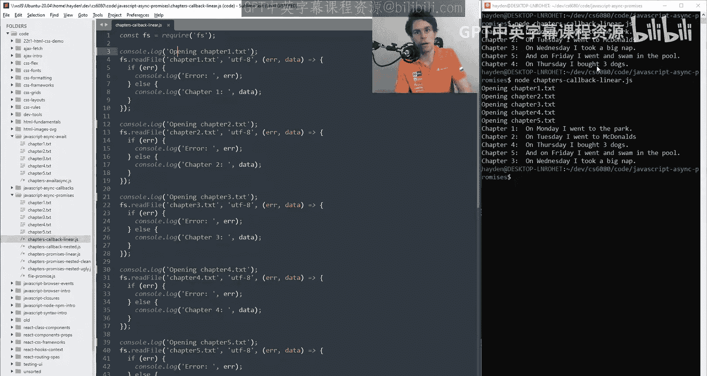

## 回调函数回顾

在深入 Promise 之前，让我们快速回顾一下回调函数，这将帮助我们理解 Promise 的动机。

回调函数有两种关键形式。第一种是最基本的线性风格回调。以下代码使用 Node.js 的文件系统模块异步读取五个文件。

```javascript
const fs = require('fs');
fs.readFile('chapter1.txt', 'utf8', (err, data) => {
    if (err) console.log(err);
    else console.log('Chapter 1:', data);
});
// ... 为 chapter2 到 chapter5 重复类似操作
```

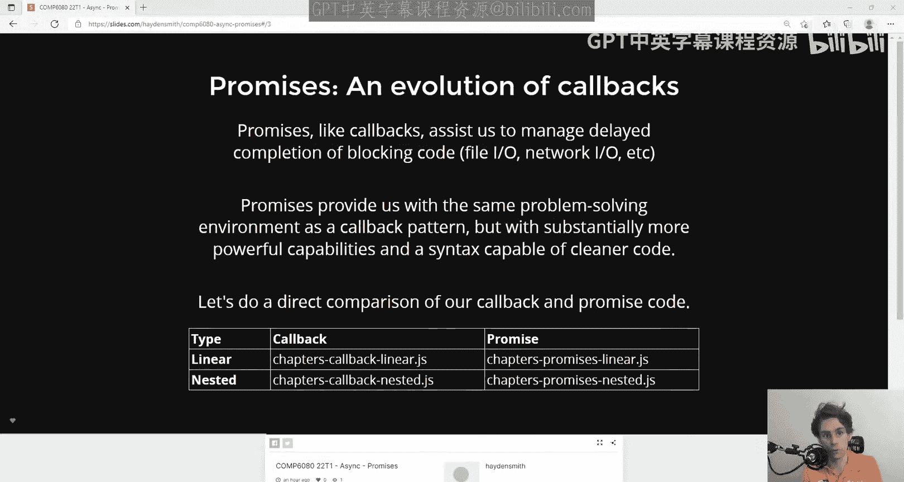

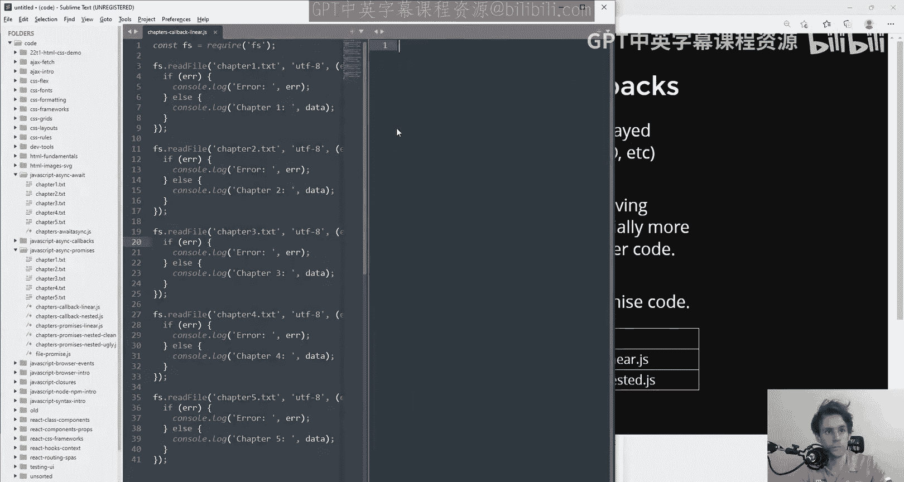

当我们运行此代码时，输出顺序可能不是 `chapter1` 到 `chapter5`，而是混乱的。这是因为 JavaScript 会快速触发五个独立的文件读取事件，由事件循环处理。它们完成的顺序取决于磁盘响应，因此回调的执行顺序是不可预测的。

为了防止这个问题，我们可以使用嵌套回调，也称为回调链。

```javascript
fs.readFile('chapter1.txt', 'utf8', (err, data1) => {
    if (err) console.log(err);
    else {
        console.log('Chapter 1:', data1);
        fs.readFile('chapter2.txt', 'utf8', (err, data2) => {
            // ... 继续嵌套
        });
    }
});
```

这种方式确保了操作按顺序执行，但导致了代码嵌套过深，难以阅读和维护，我们称之为“回调地狱”。

## 引入 Promise

Promise 是 ES6 引入的、旨在更好管理异步操作的概念。与回调一样，它用于处理那些耗时的操作（如文件 I/O 或网络请求），防止它们阻塞主线程。Promise 提供了更强大的功能和更清晰的语法。

### Promise 基础语法

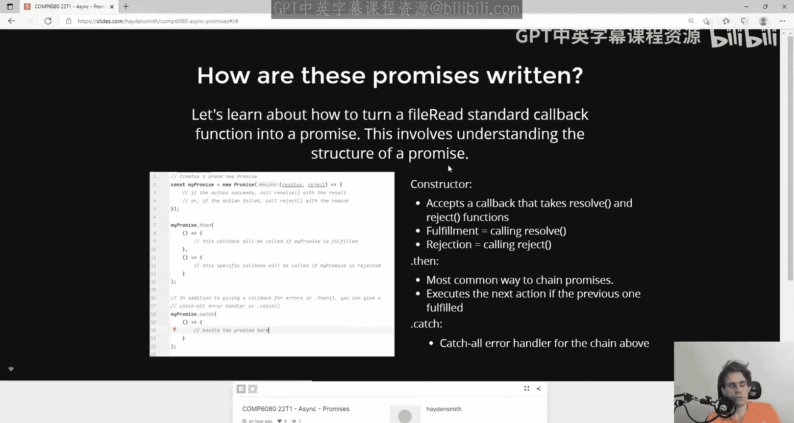

让我们比较用回调和 Promise 解决同一个问题的代码。

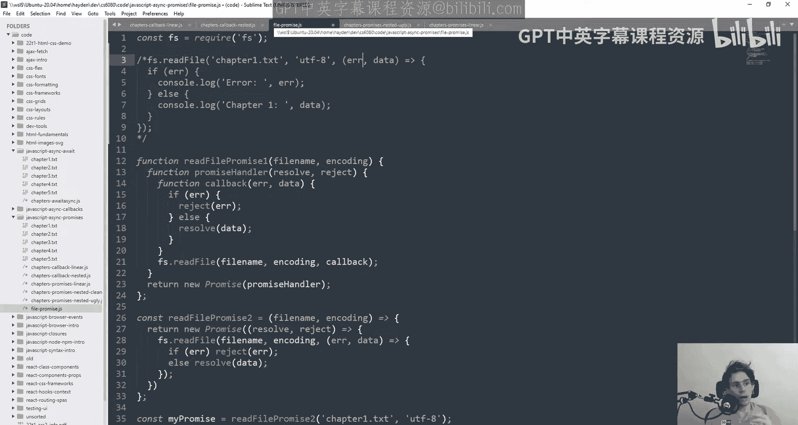


**回调版本：**
```javascript
fs.readFile('chapter1.txt', 'utf8', (err, data) => {
    if (err) console.log(err);
    else console.log('Chapter 1:', data);
});
```

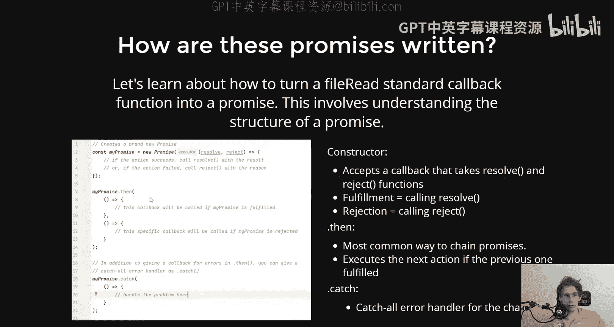

**Promise 版本：**
```javascript
const fs = require('fs').promises; // 使用 promises 版本的 fs 模块
fs.readFile('chapter1.txt', 'utf8')
    .then(data => console.log('Chapter 1:', data))
    .catch(err => console.log(err));
```

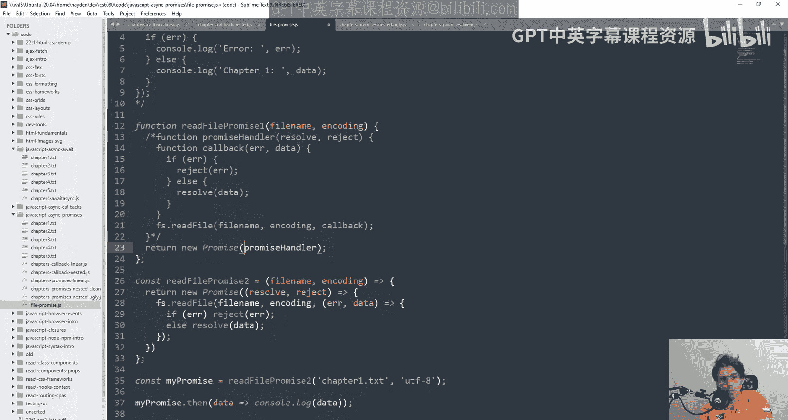


在 Promise 版本中，`readFile` 返回一个 Promise 对象。我们使用 `.then()` 方法处理成功情况，使用 `.catch()` 方法处理失败情况。这成功和错误逻辑分离开来，使代码结构更清晰。

Promise 对象在创建时处于 **pending**（待定）状态。当异步操作完成时，它要么变为 **fulfilled**（已兑现），要么变为 **rejected**（已拒绝），这两种状态统称为 **settled**（已敲定）。

### 创建 Promise

理解如何创建 Promise 有助于深入理解其工作原理。Promise 是基于回调构建的语法糖。

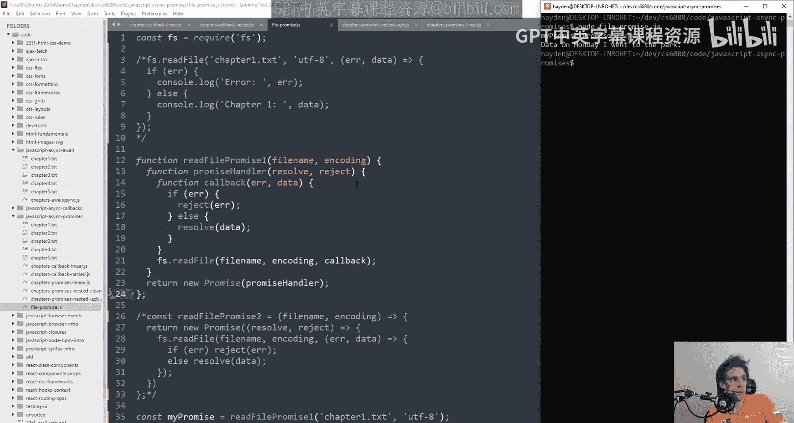

以下是一个将回调式函数包装成 Promise 的示例：

```javascript
function readFilePromise(filename, encoding) {
    return new Promise((resolve, reject) => {
        // 调用原始的、基于回调的函数
        fs.readFile(filename, encoding, (err, data) => {
            if (err) {
                reject(err); // 失败时调用 reject
            } else {
                resolve(data); // 成功时调用 resolve
            }
        });
    });
}
```

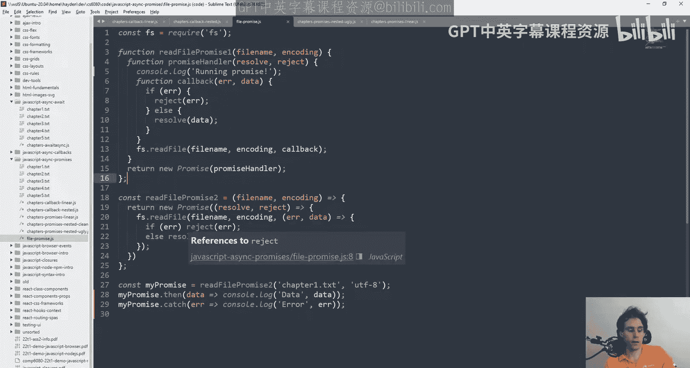

`Promise` 构造函数接受一个执行器函数，该函数本身接收两个参数：`resolve` 和 `reject`，它们都是回调函数。在异步操作中，我们根据结果调用 `resolve(value)` 或 `reject(reason)`。

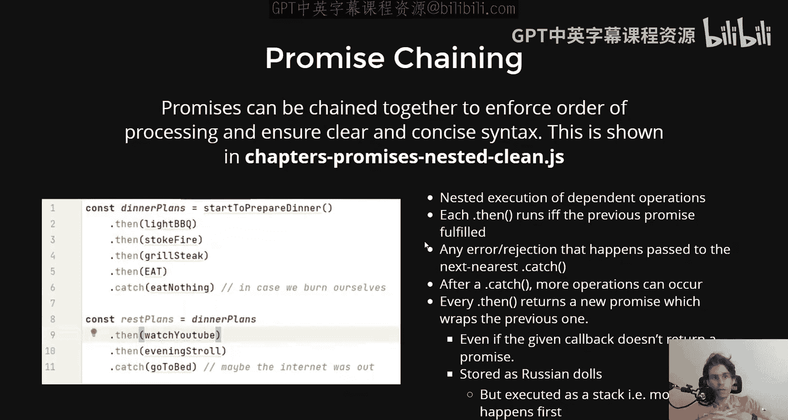

更简洁的写法是使用箭头函数：

```javascript
const readFilePromise = (filename, encoding) => 
    new Promise((resolve, reject) => {
        fs.readFile(filename, encoding, (err, data) => err ? reject(err) : resolve(data));
    });
```

## Promise 链式调用

上一节我们介绍了 Promise 的基本创建和使用，本节我们来看看 Promise 最强大的特性之一：链式调用。它可以优雅地解决“回调地狱”，实现顺序执行异步操作。

链式调用的核心在于：`.then()` 方法本身返回一个新的 Promise。这意味着我们可以在一个 `.then()` 后面连接另一个 `.then()`。

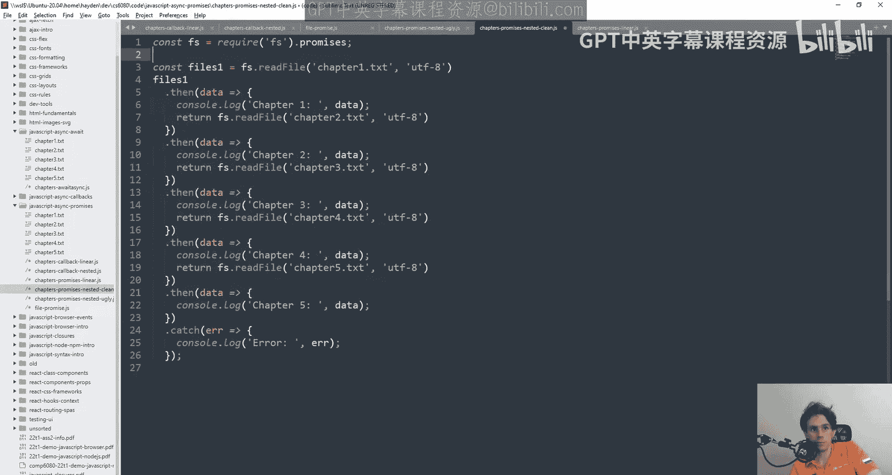

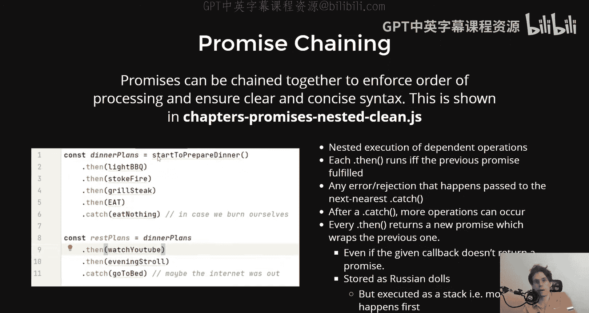

```javascript
readFilePromise('chapter1.txt', 'utf8')
    .then(data1 => {
        console.log('Chapter 1:', data1);
        return readFilePromise('chapter2.txt', 'utf8'); // 返回一个新的 Promise
    })
    .then(data2 => {
        console.log('Chapter 2:', data2);
        return readFilePromise('chapter3.txt', 'utf8');
    })
    // ... 可以继续链接更多 .then
    .catch(err => console.log('An error occurred:', err));
```

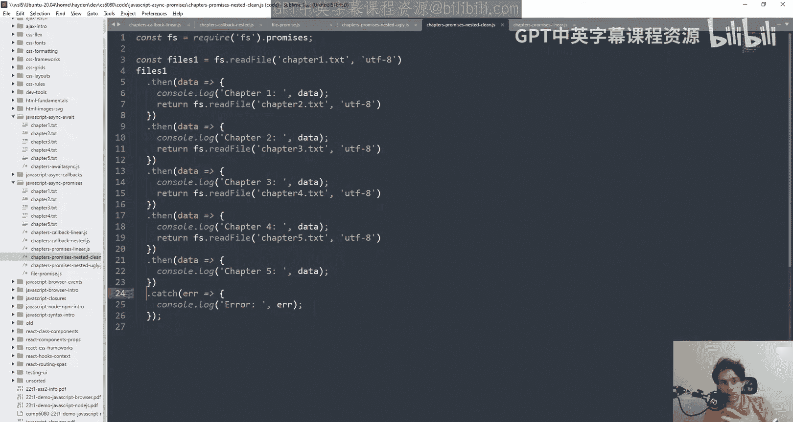

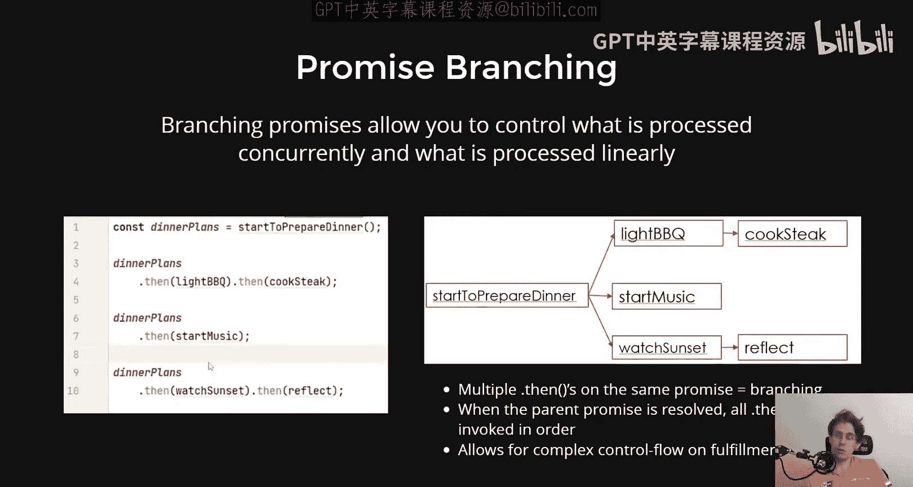

这种写法将嵌套的异步操作“扁平化”为线性代码，极大提高了可读性。此外，链式调用中只需要一个 `.catch()` 在末尾，就可以捕获链中任何地方抛出的错误。

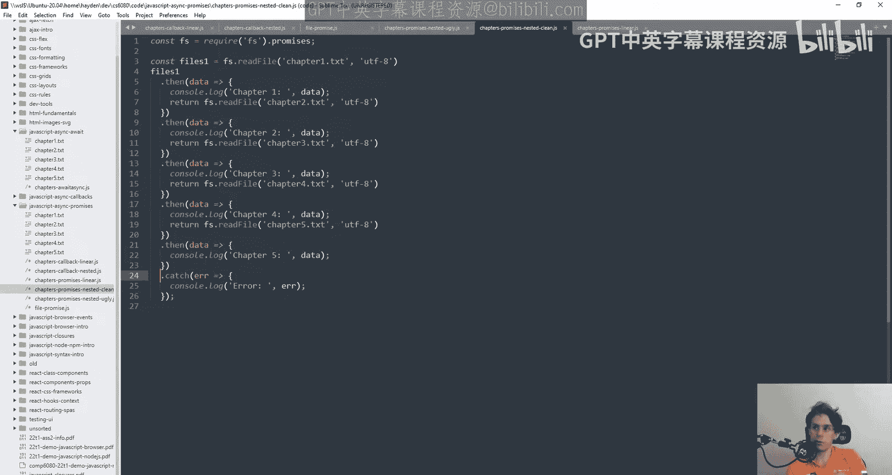

## Promise 组合与分支

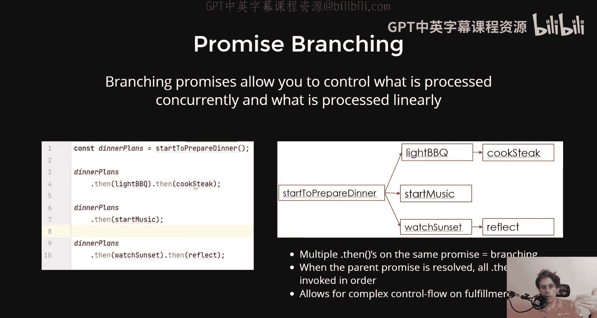

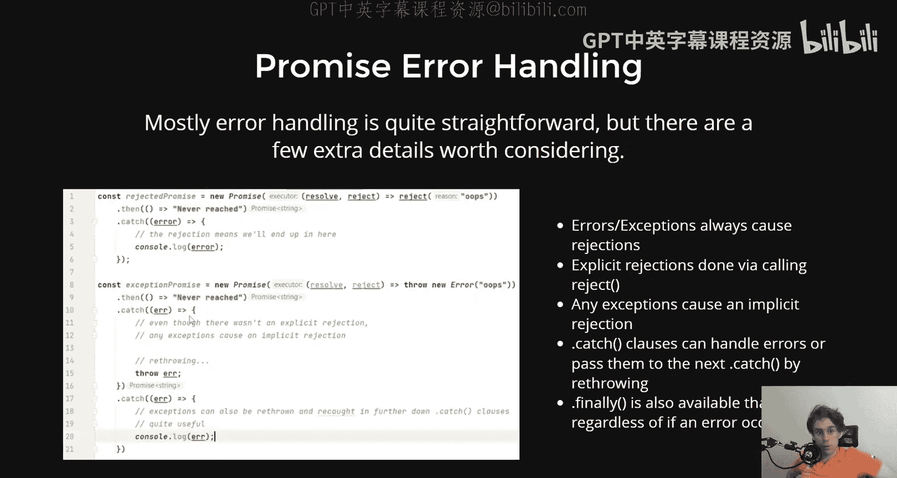

除了顺序执行，我们常常需要管理多个并行的异步操作。Promise 提供了静态方法来实现这种“编排”。

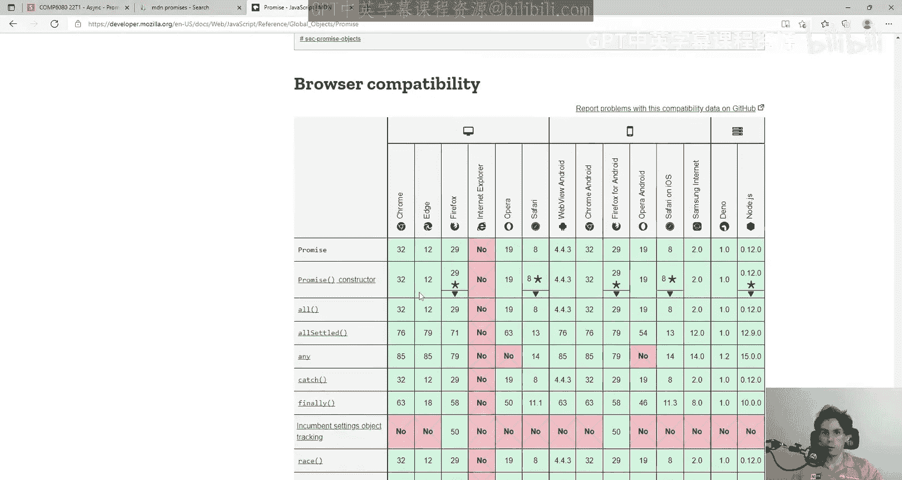

### Promise.all()

`Promise.all()` 接收一个 Promise 数组，并返回一个新的 Promise。这个新的 Promise 会在**所有**输入的 Promise 都成功完成时才会变为 fulfilled 状态，其结果是一个包含所有 Promise 结果的数组。如果其中任何一个 Promise 被拒绝，则 `Promise.all()` 返回的 Promise 会立即被拒绝。

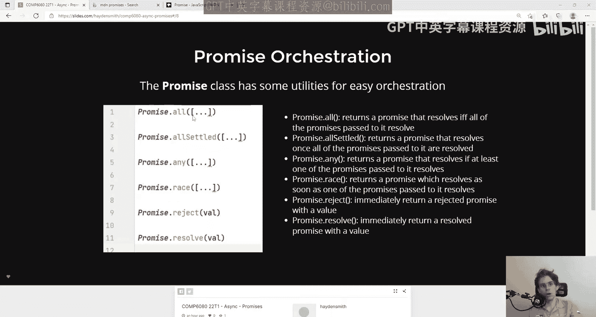

```javascript
const promise1 = readFilePromise('chapter1.txt', 'utf8');
const promise2 = readFilePromise('chapter2.txt', 'utf8');
const promise3 = readFilePromise('chapter3.txt', 'utf8');

Promise.all([promise1, promise2, promise3])
    .then(results => {
        console.log('All files opened successfully.');
        console.log(results); // results 是一个数组，包含三个文件的内容
    })
    .catch(err => console.log('One of the files failed to open:', err));
```

这在需要等待多个独立异步任务全部完成后再执行下一步操作时非常有用，例如同时加载多个资源。

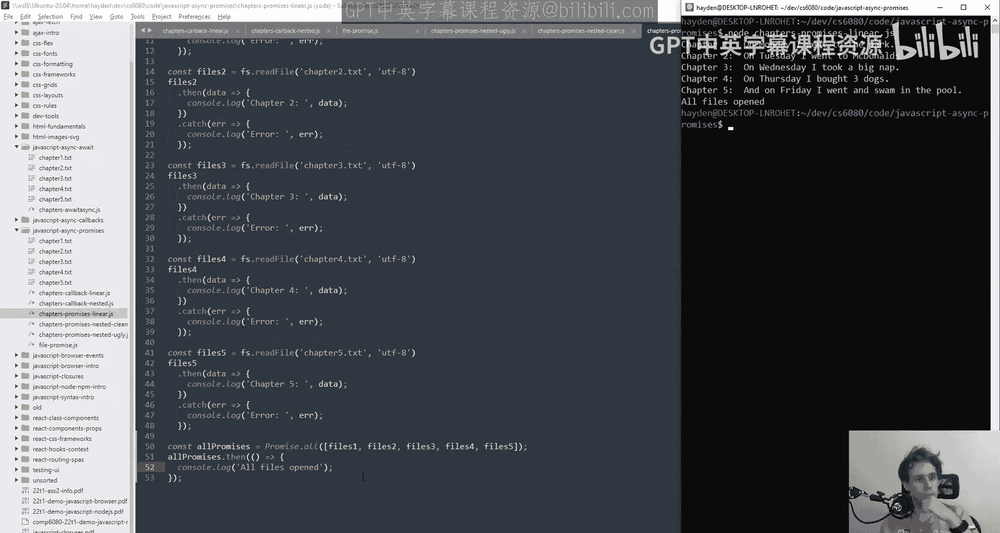

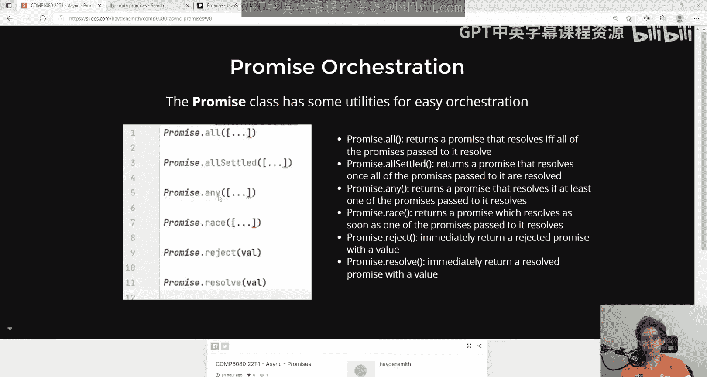

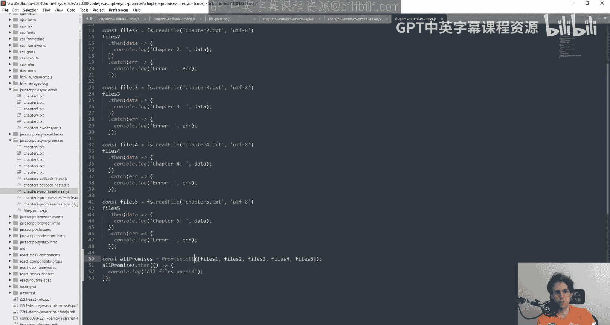

### 其他组合方法

以下是其他有用的 Promise 组合方法：
*   **`Promise.race(iterable)`**：当 iterable 中任意一个 Promise 兑现或拒绝时，返回的 Promise 就会以相同的值兑现或拒绝。
*   **`Promise.any(iterable)`**：当 iterable 中任意一个 Promise 兑现时，返回的 Promise 就会兑现。只有当所有 Promise 都被拒绝时，它才会被拒绝。
*   **`Promise.allSettled(iterable)`**：等待所有 Promise 都敲定（无论兑现或拒绝）。返回一个 Promise，其结果是一个对象数组，每个对象描述了对应 Promise 的最终状态和值/原因。
*   **`Promise.resolve(value)`**：返回一个立即以给定值兑现的 Promise 对象。
*   **`Promise.reject(reason)`**：返回一个立即以给定原因拒绝的 Promise 对象。

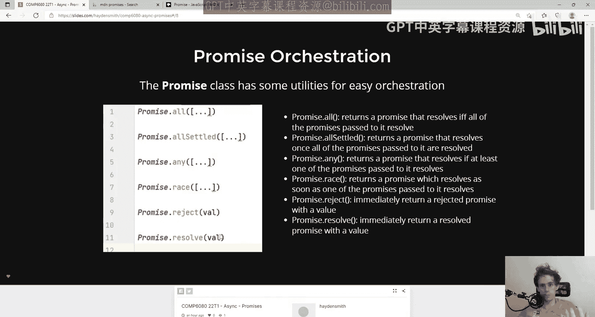

## 总结

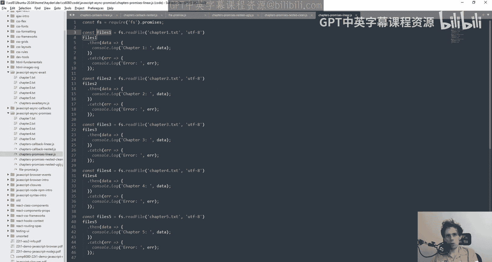

本节课中我们一起学习了 JavaScript 的 Promise。我们从回顾回调函数及其问题（如“回调地狱”）开始，引入了 Promise 作为更优的解决方案。我们学习了 Promise 的基本语法，如何使用 `.then()` 和 `.catch()` 处理异步结果。接着，我们深入探讨了如何自己创建 Promise，并掌握了强大的链式调用来顺序执行异步任务。最后，我们了解了如何使用 `Promise.all()` 等静态方法来编排多个并行的 Promise。

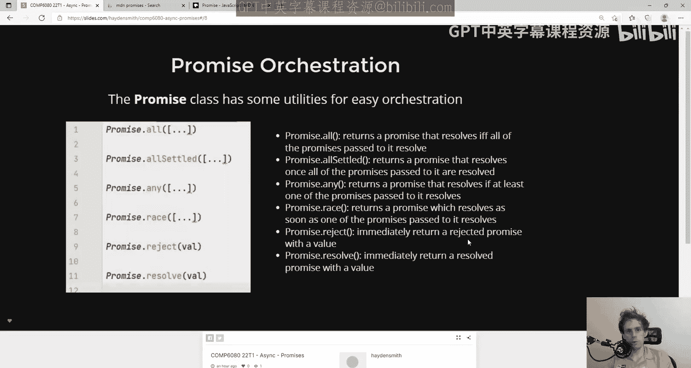

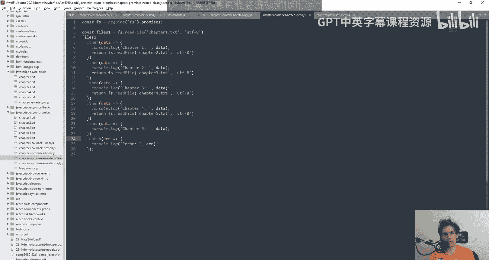

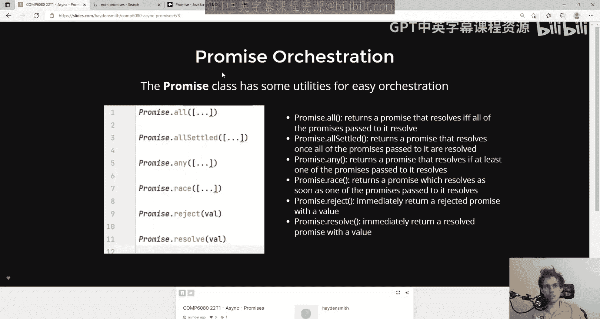

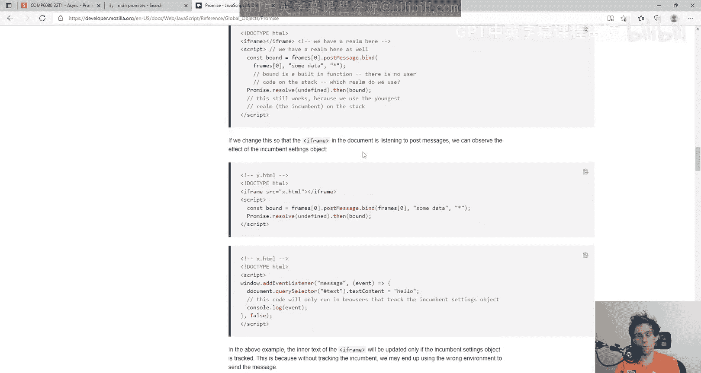


Promise 是现代 JavaScript 异步编程的基石，它将贯穿于后续关于网络请求（如 AJAX、Fetch API）等主题的学习中。虽然 Promise 的概念很深，有很多细节可以探索，但掌握其核心用法足以应对大多数开发场景。记住，Promise 本质上是一种更优雅地管理异步操作流程的语法工具。