# 前端编程：COMP6080：JavaScript Async/Await 🐟

在本节课中，我们将要学习 JavaScript 中的 `async/await` 语法。这是一种用于处理异步操作的现代语法，旨在简化 `Promise` 的使用，特别是在需要同步执行异步代码的场景中。我们将通过对比 `Promise` 的传统用法，来理解 `async/await` 如何让代码更清晰、更易读。

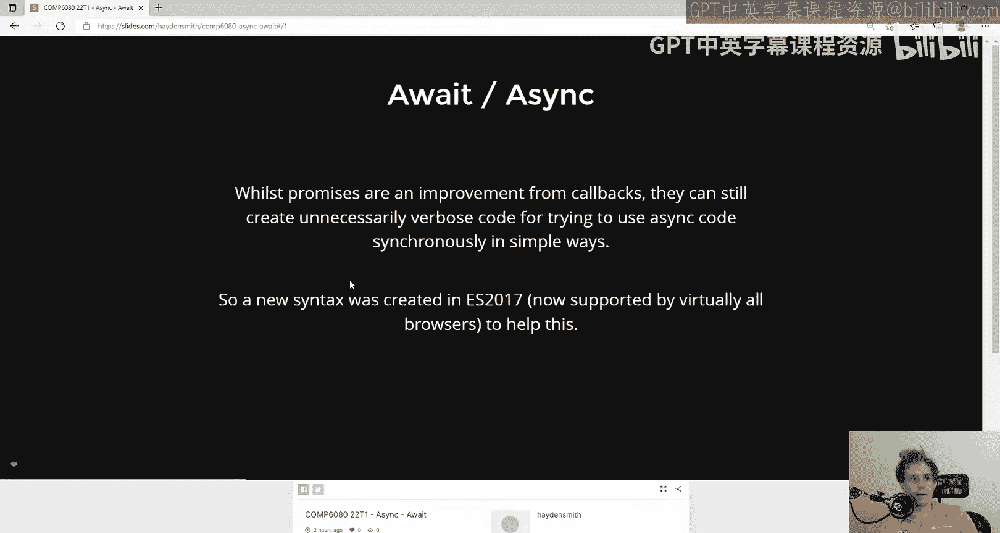

上一节我们介绍了 `Promise` 的基本概念和使用方法。本节中我们来看看 `async/await` 语法如何作为 `Promise` 的扩展，提供一种更直观的编码方式。

## 为什么需要 Async/Await？

如果你已经使用过 `Promise`，可能会发现，在处理需要**顺序执行**的异步操作时，代码会变得有些繁琐。虽然 `Promise` 的 `.then()` 链式调用很适合处理异步流程，但在编写同步风格的代码时，它不如其他语言（如 Python 或 Java）的写法直接。

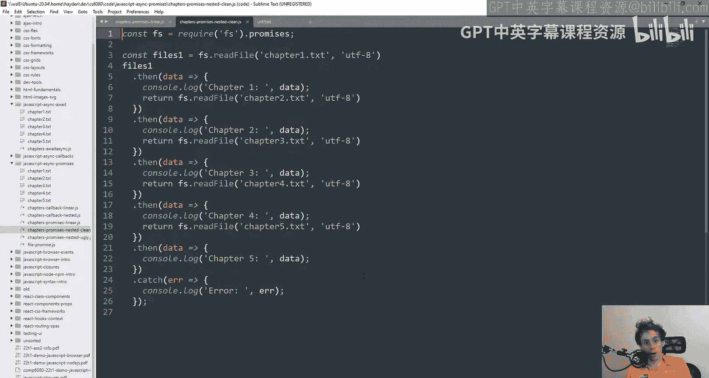


`async/await` 语法在 ES2017 中被引入，它允许我们以更接近同步代码的风格来“消费”（使用）`Promise`。

## 基础语法与对比

让我们通过一个读取文件的例子来对比两种写法。

**使用 Promise 的写法：**
```javascript
readFile(“chapter1.txt”, “utf8”)
  .then((chapter) => console.log(chapter))
  .catch((err) => console.log(err));
```

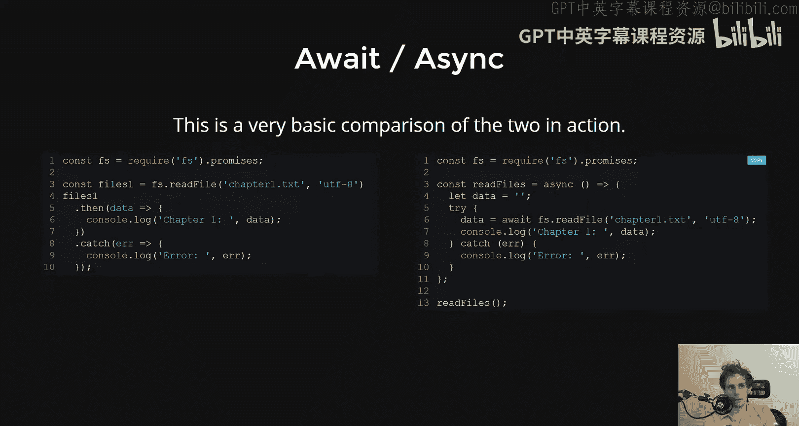

**使用 Async/Await 的写法：**
```javascript
async function readFirstChapter() {
  try {
    const chapter = await readFile(“chapter1.txt”, “utf8”);
    console.log(chapter);
  } catch (err) {
    console.log(err);
  }
}
```

可以看到，`async/await` 的写法有以下几个关键点：
1.  函数前需要加上 `async` 关键字。
2.  在返回 `Promise` 的函数调用前加上 `await` 关键字。
3.  使用传统的 `try...catch` 块来处理错误，而不是 `.catch()` 方法。

`await` 关键字的作用是：它会**暂停**当前 `async` 函数的执行，等待后面的 `Promise` 完成（resolve），然后返回 `Promise` 成功的结果。这使得异步代码看起来像是同步执行的。

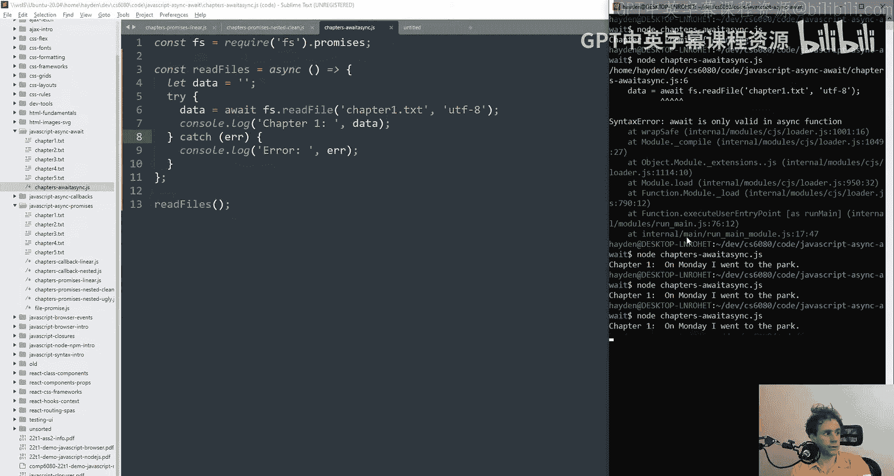

## 核心规则与注意事项

以下是使用 `async/await` 时需要了解的核心规则。

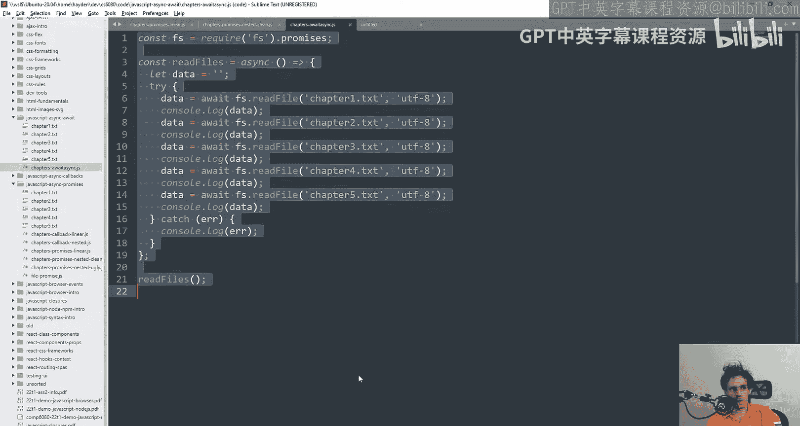

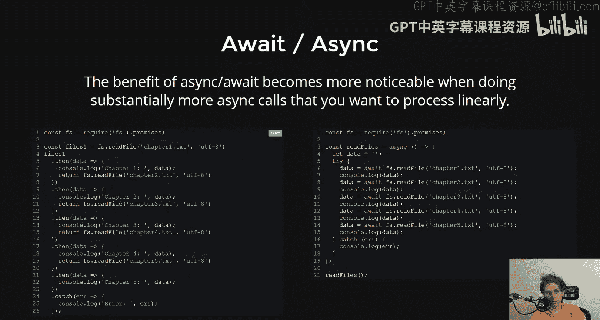

### 1. Await 必须在 Async 函数内使用
`await` 关键字**只能**在标记为 `async` 的函数内部使用。如果你在普通函数中使用它，会得到一个语法错误。

### 2. Async 函数总是返回 Promise
一个函数被标记为 `async` 后，无论其内部返回什么，它**总是返回一个 `Promise`**。
*   如果函数显式返回一个值，该值会被自动包装成一个已解决的 `Promise`。
*   如果函数抛出错误，则返回一个被拒绝的 `Promise`。

这意味着，调用一个 `async` 函数后，你仍然需要用 `.then()`、`.catch()` 或另一个 `await` 来处理它的结果。

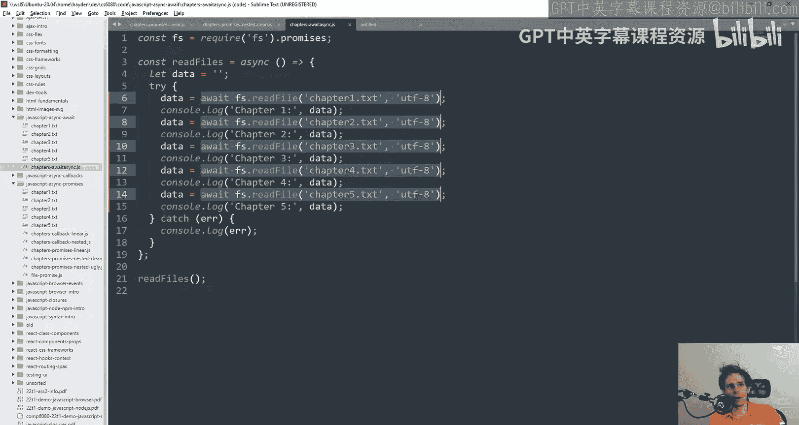

### 3. 顺序执行与并发执行
`async/await` 最大的优势在于简化**顺序执行**的异步代码。

**Promise 链式调用：**
```javascript
readFile(“chapter1.txt”, “utf8”)
  .then((c1) => readFile(“chapter2.txt”, “utf8”))
  .then((c2) => readFile(“chapter3.txt”, “utf8”))
  .then((c3) => console.log(c3));
```

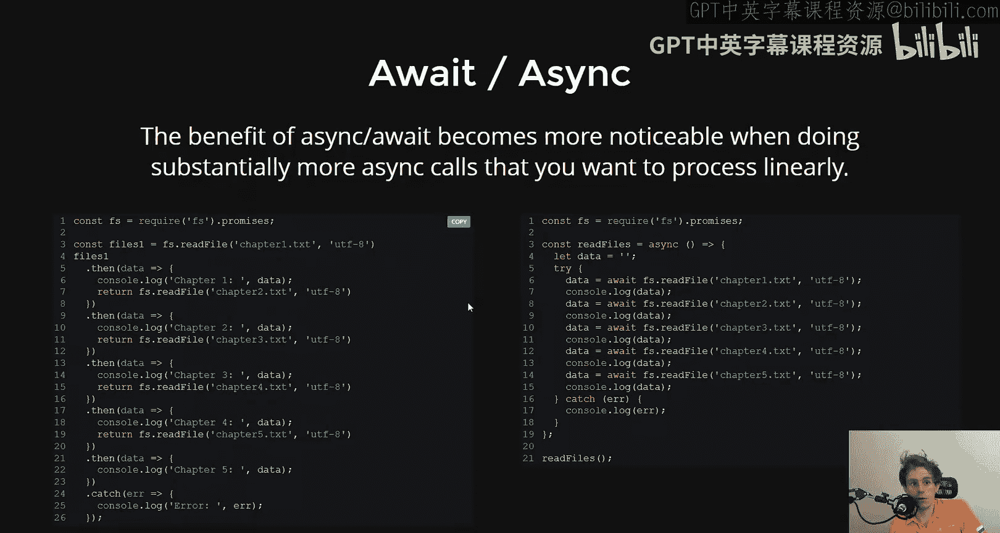

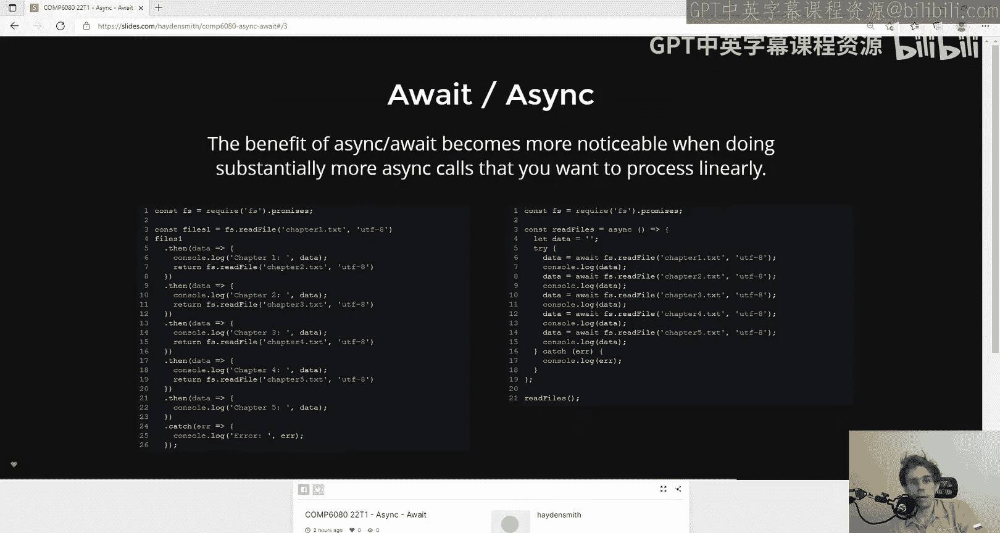

**使用 Async/Await：**
```javascript
async function readChapters() {
  const c1 = await readFile(“chapter1.txt”, “utf8”);
  const c2 = await readFile(“chapter2.txt”, “utf8”);
  const c3 = await readFile(“chapter3.txt”, “utf8”);
  console.log(c3);
}
```
后者的代码结构更清晰，更接近我们阅读代码的直觉。

然而，`async/await` 的缺点是它**不擅长处理需要并发执行的异步操作**。因为 `await` 会阻塞并等待当前操作完成，然后再执行下一行。对于需要同时发起多个独立请求的场景，使用 `Promise.all()` 等组合 `Promise` 的方法仍然是更好的选择。

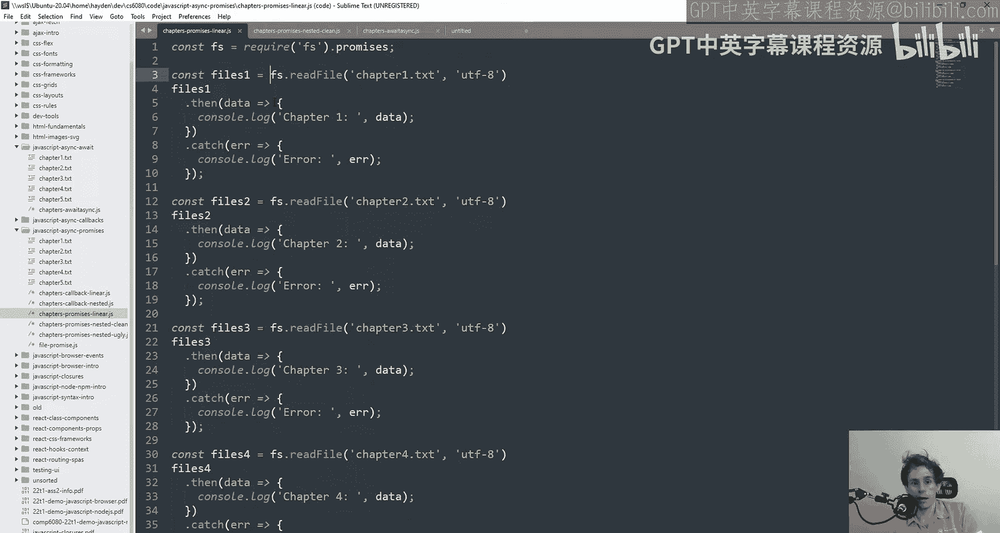

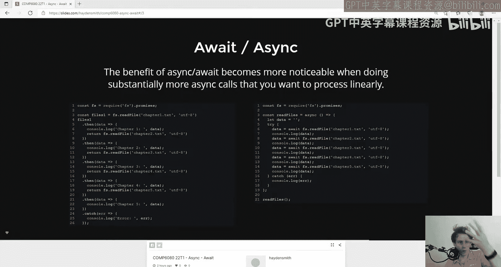

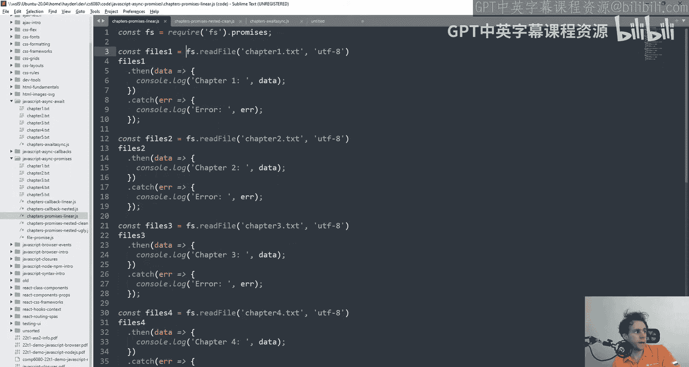

## 优缺点总结

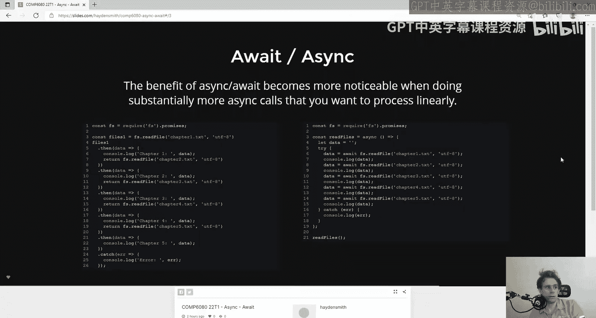

在了解了基本用法后，我们来总结一下 `async/await` 的优缺点。

**优点：**
*   **可读性高**：代码结构更清晰，更接近同步代码的思维模式。
*   **错误处理直观**：可以使用熟悉的 `try...catch` 语法。
*   **调试方便**：代码的执行流程更线性，便于设置断点和跟踪。

**缺点：**
*   **仍需理解 Promise**：`async/await` 是基于 `Promise` 的语法糖，理解 `Promise` 是有效使用它的前提。
*   **不适用于并发**：它本质上是顺序执行的，对于需要并行处理多个异步任务的场景，不如原生 `Promise` 灵活。
*   **顶层调用仍需处理 Promise**：由于 `async` 函数返回 `Promise`，在程序的最顶层调用时，仍然需要使用 `.then()` 或一个立即执行的 `async` 函数包装器来启动。

## 总结

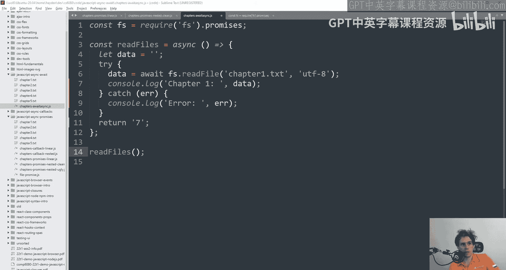

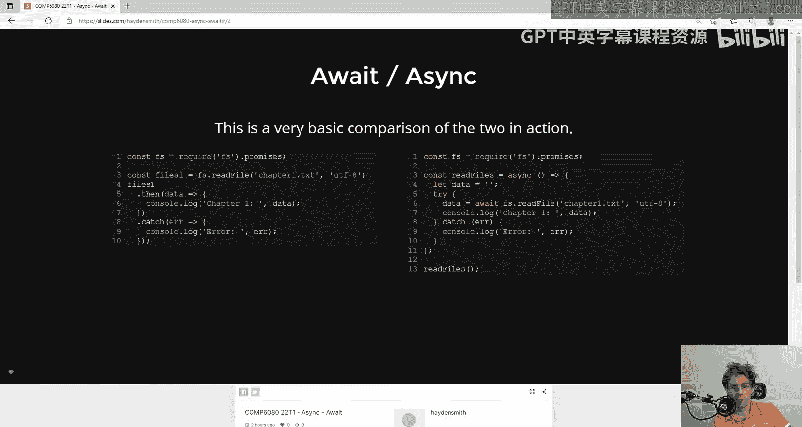

本节课中我们一起学习了 JavaScript 的 `async/await` 语法。它是一种强大的工具，能够显著提升异步代码的可读性和可维护性，尤其适用于需要顺序执行异步操作的场景。记住，它是对 `Promise` 的补充而非替代，理解 `Promise` 的工作原理是掌握 `async/await` 的关键。在合适的场景中使用它，可以让你的代码更加简洁优雅。