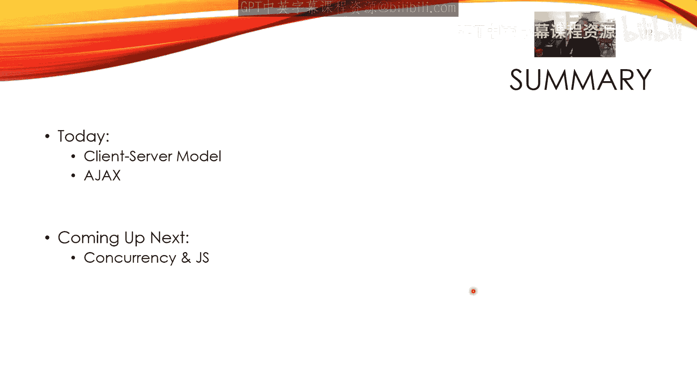

# 前端编程：1：JavaScript 异步网络入门 🦊

在本节课中，我们将要学习 JavaScript 中的异步网络编程。我们将从客户端-服务器模型开始，并了解什么是 Ajax。这些概念是现代 Web 应用开发的基础。

## 客户端-服务器模型

首先，我们来回顾一下客户端-服务器模型。这是一种网络架构模式，不仅用于网络，也用于 API 设计。客户端是请求服务的一方，例如智能手机、笔记本电脑或 Web 浏览器。服务器是提供服务的一方，通常是数据中心里由谷歌、Facebook、亚马逊等公司运营的机器集群。

其工作流程如下：
1.  客户端（例如用户）向服务器发送一个**请求**。
2.  服务器处理该请求，包括参数验证和执行相关 API 逻辑。
3.  服务器将处理结果作为**响应**返回给客户端。

例如，当你在谷歌搜索框中输入“cats”时，你的浏览器会向谷歌服务器发送请求。服务器处理你的查询，并返回一系列自动补全建议。然后，浏览器负责接收这些原始数据，并可能结合 HTML、CSS 和 JavaScript 将其渲染成你看到的页面。

## 现代 Web 的现实情况

上一节我们介绍了基本的客户端-服务器交互，但现实情况要复杂得多。现代 Web 应用通常涉及多个客户端和多个服务器。

以下是现代 Web 架构的典型场景：
*   一个应用可能拥有多个客户端，如移动端、桌面端等。
*   这些客户端会向多个不同的服务器发送请求，以获取各种 API 服务（例如新闻 API、图片 API）。
*   这形成了一个类似“二分图”的连接网络，每个客户端都可能连接到多个服务器。

这种架构带来了设计上的挑战，我们需要分别考虑客户端和服务器的核心需求。

## 客户端与服务器的核心需求

面对复杂的网络连接，客户端和服务器各有不同的优化目标。

对于**客户端**，最重要的目标是：
*   **交互性与响应速度**：用户输入需要被立即处理，长时间操作需要有进度反馈。
*   **快速初始加载**：首次页面加载应该非常迅速。
*   **避免整页重载**：理想情况下，应用只进行一次完整的页面加载，后续交互通过局部更新完成，以避免用户丢失当前状态（如表单填写进度、页面滚动位置）。

对于**服务器**，最重要的目标是：
*   **高吞吐量**：每秒处理成千上万个请求。
*   **低延迟**：每个请求的响应时间应尽可能短（毫秒级）。
*   **资源效率**：优化计算、电力等资源使用，以控制成本和环境影响。

简而言之，**客户端追求最小化延迟，服务器追求最大化吞吐量**。

## 技术演进简史

为了理解我们如何满足上述需求，让我们简要回顾一下 Web 技术的发展历程。

*   **1990年代至21世纪初**：这是“静态网页”时代。客户端主要是桌面浏览器，服务器托管在本地机房。每次页面更新都需要向服务器请求全新的 HTML 页面，这被称为**服务器端渲染**。扩展应用的方式是升级单台服务器的硬件（**垂直扩展**）。
*   **21世纪中期**：JavaScript（尤其是 jQuery）的使用越来越广泛，客户端计算能力提升。但架构上仍以服务器端渲染为主，开始出现**水平扩展**（增加服务器数量）的雏形。
*   **当今时代（智能手机与云计算兴起后）**：客户端变得多样化（手机、物联网设备），且性能强大。**渲染工作大量转移到客户端**。服务器端依托云平台（如 AWS、GCP）进行大规模水平扩展和负载均衡。关键技术变为**异步处理**和**懒加载**，即先加载最小必要资源，再按需异步获取其他数据。

## 什么是 Ajax？

经过历史的演进，我们形成了一套实现异步 Web 应用的技术集合，这就是 **Ajax**。

Ajax 是 **A**synchronous **J**avaScript **a**nd **X**ML 的缩写。尽管如今 XML 大多被 JSON 取代，但“Ajax”这个名称保留了下来。它**不是一项单一技术，而是一系列用于创建异步 Web 应用的技术手段**。

使用 Ajax 的好处包括：
*   **流畅的用户体验**：页面无需完全刷新即可更新内容。
*   **前后端分离**：前端专注于表现层，后端专注于数据和业务逻辑，模块化更清晰。
*   **支持离线应用**：前端可以在本地保存状态，并在恢复网络连接后异步同步到服务器。

其工作模式可以理解为：浏览器中的用户界面与一个“Ajax 引擎”（代表异步处理逻辑）进行交互。这个引擎在后台与服务器通信，获取数据后更新界面，形成了一个高效的闭环。

## 总结

本节课中，我们一起学习了客户端-服务器模型的基本概念和 Ajax 的定义。我们了解到，现代 Web 开发通过将渲染工作转移到客户端并广泛采用异步通信（Ajax），来满足客户端对低延迟、高响应度的需求，同时利用服务器的水平扩展和异步处理来应对高吞吐量的挑战。

接下来，我们将深入探讨 JavaScript 是如何处理并发和异步操作的，这是理解 Ajax 如何实现的技术基础。