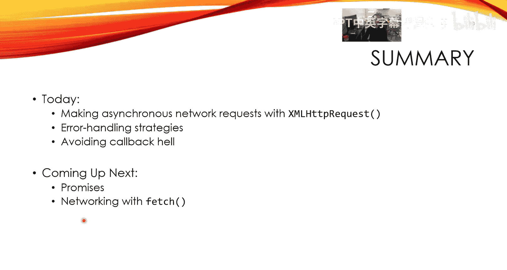

# UNSW《前端编程｜ Web Front-end Programming COMP6080 23T1》中英字幕（deepseek-R1 p36 -36-COMP6080 - Javascript AJAX 🦊 XHR.zh_en -BV17RXGYuEaM_p36-

Welcome back everybody， this is lecture three， all about asyris networking in JavaScriptcos。😊。

Let me share my screen and we'll get things going。Okay。Yeah。

Today is all about XmL HTTP request and networking with it。😊，Just an overview about our roadmap here。

So we first talked about the client server model and then we。

Moves on to talking about concurrency and JavaScript， we talked about the event loop last time。😊。

But now we're finally going to move on。Into figuring out just how to do make this a reality。

So we know the event loop allows us to perform asynchist execution， input， network。

 all this kind of stuff， but we don't know of an API that lets us do the networking part。😊。

And XmL HTP request， of course， is what we're focusing on today。😊。

So here we have a minimal example and we'll be seeing more occur like this。

 so don't be too alarmed if you don't quite understand it。😊，But things to know。

 XmL HttP request is a built in API in browsers much like document and fetch as we'll see。

 but this XML HttP request object and me storing it into this XHR variable。😊。

This is a handle that represents an asynchronous request by default， it's asynchronous。

 you can change it， but you know， I don't know what you would。

 We talked about some of the problems last time about why。

synynchronous execution is potentially a very big problem in the web browser。😊。

XML HTTP requires actually is quite a few dos can I click that I think I have to actually。

Go out of the laser pointer。 So this docs link just takes you to the MDN list。

 If you guys haven't gone to the habit of reading docs or things you don't know。

 I highly recommend it。 Everything I'm going to tell you today is written down inside of this docks。

 but you can see， for instance， all of the different events that you can hook into and you can see。😊。

Different things that you can do with methods like you can stop a request once it's already been set which is pretty cool you can add extra headers through set request that which we won't which we probably won't be doing here but it exists right so if you guys want to get a complete discussion about XL HttP requests then I you know recommend reading these dogs they're pretty good they're honestly pretty good but that will might detract from what we're going to be talking about here。

She。So the basic flow of this is you create a new H XML HtTP Que object， initially it's empty。😊。

It's empty so we're going to fill in the details and that's what this open does open initializes the request with the HttP method also known as the HttP ver so this is just going to be a get and then we pass at the URL that we want to get in this case naturally I'm just linking to the docs because I couldn't think of a better URL to link to I think it's pretty cool。

😊，Now， the way you。😊，Let's talk about sending to actually start the request the way we send the request is we call XHR send and the canonical way of doing this is that you wrap it inside of a tricatch like this and the reason is because sometimes the request will fail to even send and the way XHR resolves to telling you about this is by throwing an exception that's why you should wrap this in a tricatch and then do better error handling than just printing out what the error was you probably want to retry at some point。

😊，But you wrap it in a tri catchtch like this and you customize what happens with XHR through these callbacks。

Onload is the primary one for when the request exceeds。Yeah， so you you give it。

 you literally assign to this property， this XHRs on property， you assign to it a function。

 and that function has access to XHR via this capture。

And you can check things like the status return code。

 you can check things like the status return text。😊。

Which will be okay if it's 200 and then you can also grab things like the response the response body things like this we'll see more what of what's inside when we get to the code example。

 but you can already see that we do。Like what would you say， so unexpected error handling。

 we do via tricatch。And HTTP style error handling like for instance， you accidentally mis use an API。

😊，Or you like the user say you're trying to log into a form like users entered their password and username into a form and they've accidentally misspelled the username and sending off this information to a backend server to do authentication if the backend server has been programmed correctly。

 it should send back a 400 401 maybe something in the 400 range to represent like user send invalid arguments or something like this and you would check errors like this with the XHO status that's not that's almost an expected error because you expect people to make mistakes every now and then。

And so you check these through the statuses， right？嗯。

Yep and the other important thing to remember or sort of know about is that XH XML HTTP requests have yeah they've fallen out of Fa it's kind of old kind of old and you can tell it's old because it's still talking about XML when we know that JSON is dominant nowadays and so you might ask yourself why do you need to know about this if not many people use it anymore and the reason that you might want to know about it is because legacy code bases exist and they will exist forevermore so it's good to know all of this stuff。

😊，Cool， so we're just going to go straight into a demo with this and just look take a looky at exactly。

😊，How this works。I think that's one straight back to the start。This one， okay。

So if we go back to your web store here and we look at this， here's our。

Index other HTMLL and our JavaScriptscriptish。そす。So this basic application。You you just load it up。

Yeah。It's going to use an API called。IPI I think if I say that IPFI it's an endpoint that will tell you your IP address of the network that you're currently on so。

😊，Right now we haven't run it so we don't know what it is if we click this button then hopefully this will update。

😊，With our IP address。 and so since we're going to be fetching from a remote resource asynchronously。

😊，We're going to be doing this with H XHR。😊，So let's sorry the codeD does that。

We have a function main， so let me click。We will call this F IP。Yeah。So let's do it。

First thing that we need to do is initialize our request。

 Well we need to create an empty request handle first。

 so let's go ahead and do that XHI will be a new XML H TTP request。Yes。

 and then we need to initialize this request with the。Details of what we're doing。

 So the way we do this is we say get。As you can see， I have intelligencescentence on。

 so it's given me interesting。What would you call this interesting。

Order completes we won't be using the second way or just be using the first one so we have gett and then it takes the URL that we care about。

😊，嗯。And let's fill in the skeleton first。Bye。This trica that will do XHLO send。And if we catch。

 we'll do nothing， but we'll console that error。😊，嗯。Could not get IP address。Maybe we out。

I don't know。We probably won't we try， I do know， I'd like to。

So remember we're doing we customize the features of XHR via sending or setting properties to callbacks that we create so let's go ahead and do that the one that we care about and the name one that we' care about always will be well here's a bunch of them right on timeout so you can set timeouts as well which is interesting like if a network repress takes more than a second you can stop it。

On progress， if you want to have like progress bar， load start。

 load end kind of superseded mainly by onload but if you want to have something that happens like right when you start the request then。

😊，And the request and then one right when you set the request you can。

 you can do things on your board on error， all of these things we're going go to do onload because。

That's the primary one that people use。So we'll set it to the。This。

We will first check to see if the status code was 200。200 being the HttP code。

 meaning that everything was okay。And if it was okay， then what we're going to do is。

Get the response， let's just go see what this actually returns first if we go to this address in our web browser。

Okay， cool， so it looks like it's sending back。It takes on an object between one key called IP and that's my IP address。

My ITV4 address， please don hack me。So we'll have our IP。Be equal to。XHR dot。

Status not status sorry response so there's a bunch of things there's a response text which returns whatever the response is as a string you can see what the actual response type was you can get it from the URL from where it response you can get it as an Xml thing if you wanted to no Tjson unfortunately。

Because it's old in old Aia， so we're just going to go with response text to start off with。

Because it should be in Json the the。APpiI here should be in Json。

And then what we're going to do is we are going to grab this EM。

 this italicized unknown and we're going to change it to what our IP addresses and the ID is IP text。

Yeah。So itll be a document， don't get element by ID。P dash text。And。Changing the text content to IP。

All right， because if we look。I think I closed the tab didn't I？If you look at this。Key is IP。

 so we have to grab it。I that。And that should be everything。 I suppose if the status isn't 200。

 then what we'll do is with this consoleular error， right？It not。Yeah， DC。Thatsol great。こうああ。てこ that。

I'm sure somebody was screaming at put in the E。But yeah。And then just for Lolls。

 I suppose what we'll do is we'll also add a text inject， which says in the success case。

 this can be in H3。😊，Oh。Okay， let's go ahead back to our web page and run this。

 so give it a reload and we'll save it。That's the app。啊。It didn't work。Why。Well。

 I know why doesn't work because of that。Why didn't this work？They know where I am。

 but I don't know where I am， so what's happening here。Of course。

 it would be sorry much if you guys were out。😊，The tentative not tentative the what would you say keen eye amongst you would have noticed that I said that this was a string right but I'm accessing this string as if it is a JSON object which isn't the case this will be a string that looks like JSON though so if we actually want to grab it as a JSON object or a regular JavaScript object then we have this nice builtin module in the browser called JSON and it has this pars function so we can go ahead and construct。

😊，An object from our JSO stringified representation， and now this should be fine。Yeah， there it is。

I think everyone knows where I am， oh no。It's scary。Cool。

 so it's fairly simple right it's fairly simple we just customize the online function to actually do the thing。

😊，When we get。How our response back。But we'll talk more about style things with this in a second。

 let's go back to the presentation。😊，I think that's a good one a little bit up。

So I wanted to say a few more words about how to handle problems of things that happened and I kind of hinted at it before。

 but we have two like classes of errors right the first one are these expected errors and these are the things that you kind of again well expect right authentication problems。

😊，That parameter problems， non exististent to main problems。

 do get like a 500 for something like this， I think。Maybe必。😊，Um， in any case。

 your expected errors generally are communicated to your application through the HTTP status quo。😊。

So you'll get a 40041，43，4 four classic classic codes for like not using an API correctly and this when you get a 4 xX。

 generally what this means is that you。😊，Your user is misusing API 500 5 xx， 500， 501， 503。

502s are a bit more difficult to deal with， therefore the server side problems。嗯。嗯。

The best strategy for that is kind of to retry or just to report an error and of course 200 met nothing their problem occurred so 200 is good we went 200s。

The unexpected side， however， these are generally our exceptions， right。😊。

We handle these via tricaches and one more way that I'll show you in a second。

 but like unexpected errors， network connectivity， you know， you're on a train。

Back when riding trains was was a good idea and then like you're going through a tunnel right or like the classic movie same when when somebody's going through a tunnel and their cell phone lose reception。

Network connectivity issues they just happen remote connection is drop remote connection drops again just happens timeouts generally you don't expect timeouts to happen because in a perfect world everything's very fast。

 but it's always good a good idea to have timeouts。😊，m。

 this would be related to like internal servers u sorry， servers internally failing。

Or if you're being freedirect a trillion times because you've accidentally clicked on like a really dodgy link then or you're using a super dodgy API then you were time nutss as well yeah like I said these are handle by tri cash box right so just exceptions and the best strategy is to retry with the caveat that you use an exponential backoff algorithm what this means is essentially is that you might retry once every 10 milliseconds but if you like off to retry five times probably 10 milliseconds isn't enough time so you would sell it like 10 milliseconds maybe go up to like 100 milliseconds maybe like 300 then and then 500 you would wait and then maybe you wait one more second and then maybe wait two seconds and then you stop。

So it's an exercise。 like， it's a。Back off like that and then at some point you just have to like fail and the use that whatever that they've tried to do can't be done and so you report an error share a nice like graphic animation give in a alert things like this。

Let's see this in action。Okay， please this。Whats this？Come down here。Yeah。Okay。

This the font size of it。So this will be an example we'll be using in the next two lectures as well。

 so let's get familiar with it， shall we let's load it up。Basically， we are going to get。😊。

Our daily vitamin Chuck Norris and we will get our what would you say daily dose via app praise with Chuck Norris。

 of course， nothing happens right now because we have a root in the code。

 but essentially this is what we're going to be working with。😊，Can we come to our index， job script。

We are going to do essentially the same thing that we did before。

 so let's go ahead and create prompt ofHR。New XML ICP request。

And then what we're going to do is we're going to initialize it with open。These printed gets。

And then， pass my URL。I that again， because we should。All of this is fairly， but at this point。

If we catch an  error， what we'll do is we'll just。Lo it again。In general， naturally。

 you don't just want to load your errors that would be a bad thing to do。Yeah。Can't understand。

 shall we say。啊。It will customize again via onload。嗯。

So these onloads if you just look at just prototype。😊，It can actually take a。

I don't know if you guys to hear that alwayss dying outside this can also take an。

Progress event think this is for like progress files and stuff so you can use this for。Its。

Spitner is a progress players。I won't be using that here。Okay， so if。We get a 200 again。

Then we'll just。Here some names。Which will be documented dot get El by ID D。 This one is main text。

Next content well， I guess we'll have to pause that wont we so points。Man equals。It's on the pars。

XH don response。The response and response text。Are the same thing if the response actually is Json because XM HtP request doesn't by default。

Support JO and I don't actually know if you change the content type that will come back as JO。

That's mainly if you're sending like things in the parameter of the request。

 I think when you gain the response back that's to the server to decide what it is。

 but that's more of an aside than anything this work so we'll do name and I know what the value of this。

Hang on members。It went away。Does you hate when that happens？

I know that the meme will be inside of a key called value， so if we just quickly run this again。

 we should see it work without a hitch。😊，Yeah。Yeah。

 Chuck Norris once went to Seaorld and wrestled in orca。Drough， very scary。Very mean like， I suppose。

Let's see all the things that can go wrong。The easy one is that did you guys know that you can like turn off your networking Chrome if you go to the Dev console and go to the network tab。

 you can see right now I have no throtling， but let's say I throttle myself and go offline if I then try to praise Ch Norris。

😊，Well nothing happens， surprise surprise， but you'll see I got a network error network disconnected 200。

嗯。What's interesting here is that it didn't actually change it didn't。

Print this error and that's because for that kind of network disconnected problem。

 that might be for Chme specifically， but。In addition to onload， there is also。And on error。Um。

 what would you call this like like the hand line I suppose that you can set。

 which again takes a callback？And what on error is for is。

In along the way of sending and so I suppose what's happening with Chrome in this yes。

 no incident now， what's happening with Chrome is that it's simulating error disconnected error if you look at the console won't show it now。

 is't offline。😊，Noth thttling， reload。And then this might break again because I have like I'm in the middle of riding in the career。

 but we'll see what happens。Can throling back on off fine。I praise Dr Norris。Okay， no。

 so we take it through you can see that the error that Chrome is sending back because an error disconnected and what this is is more along the lines of like whilst it was sending it cause an error。

 So it' it's like slightly different to this This is like if you can't even like for whatever reason like you just straight up content but for when it's an error disconnected。

 it seems that this one is the one you'll have to set a callback here and you'll see what I mean I just do console error。

😊，Here。It will be could not， let's say you cannot start sending a request down here。

more informative and down here will do could not complete sending request。😊，And I'll go back to here。

And。Turn off startling。Yes。Reload， turn on totaling。

Praise cho north and then look at the console Now you can see that we printed the error message。

 so it happened along the way。 So when things happen along the way you need to。Set this。

Hera handleler。I can't simulate this unfortunately。

 but you should still do this for good practice if you're using XL HTTP error because this can fail。

😊，Actually， I can don mind if I copy this， I just remembered。😊。

And do this So one thing that you should know is that if you try and send a request that's been sent already like this。

 then if you try and call us again it will throw an exception that's that's a good that's a good way to show。

 So if I just turn throw one off again。Reload， I look at my console now。You can see。That。

We sent it once and then when we try to send it again， that we call it a console error。

Not always would you write code so stupid， so you should always just wrap this for good measure so we can throw it up。

The other problem is so we've looked at when things go wrong along the way。

 when things go wrong at the side of the way， and now we'll be looking at an error for。

Or things go wrong at the end of the way。I。e。 we don't have a 200 So again， we'll just。

On solar error and this time， what we'll error is the。Status text。And the status。

If you guys don't know what I'm using right now， these， this interesting。Like dollar race things。

 This is what's known in Java script as a I guess what template literal it's just string interpolation it's like a format string in python if you guys remember what that is and if you don't remember what it is then you can just look up the the back tick version of strings in Java script。

So the way we're going to get this to happen is if I just use an invalid request。

 so below this URL doesn't exist。So we go back to here and we try and pray Sha Norris。Oh no。

 we got a 404， but there was no statust， which is why nothing printed but we got we can see we got a 404 here and that's because。

😊，This resource does not exist on this server so you can see we didn't get a 200。

 we jumped down here。We're going to say error since Dallas text doesn't exist。我系确十九。Okay。Yes。Yeah。

 there we go， four and four。So those are the three primary strategy error handling strategies。

For this， let's go back to the presentation。Yeah。Yeah。Okay。Yes。So there is a tendency sometimes two。

😊，When you have。Like data requests that kind of depend on the previous requests succeeding so in this example。

 we might have like get all the users and then get all the posts for a specific user then get all the comments for that post。

We get this like nesting effect that goes on， and this is called callback health somewhat of a main term。

 but also is a very real thing。And。This generally happens when you have many different people working on the same piece of code and they just need something to happen like right there and then and is the result of not really thinking for not doing any forethought about how the code should be structured right and I don't know this is somewhat。

😊，If you just go searching on the internet。I think on GitthHub the most used language is JavaScript so by far the most sort of software that is written is front web frontend stuff and that means it attracts a lot of you know people of different technical backgrounds right so to them they may not understand things like SRP which is the single responsibility principle or they may never have even heard of it maybe they don't know what dry is don't repeat yourself right？

😊，And so the idea of avoiding callback health is that we should definitely apply these software engineering principles right functions should only do a single thing these callbacks do a single thing。

😊，But their usage context is a lot of their usage context is wrong right we should split out these things into separate functions it's much easier to read like this right much easier to maintain much easier to avoid the hell that is the call that hell right and if you're worried about like your bundle size getting big because function is what's said like seven letters eight letters and that's like eight more bytes you have to send over the internet then you should let your bundles minimize your code for you and not not you' doing it we don't want to sacrifice expressibility like this。

😊，For trying to save a few bites so my tips for you guys is that where you can avoid flat over nested I know in the example I just use a nested callback but that's because it was very it didn't didn't nest like this right this is much more like。

😊，What would you call dependent operations？Yeah， use these landers。

 these arrow function things for easy one lineers， things that don't nest or don't recursse。

 but when you're doing non trivial logic inside of the callbacks， make them functions。

 do the right thing。😊，Named functions， I should say。Sir。

You finally have a method of making H X web app。 Weve finally progressed by 2002。😊，Excellent。😊。

But I mean， if you look at the API for XmL HTP requests， it's kind of tedious， probably error burn。

 can make your bed， I think we can。And so that will be。

Topic of next lecture where we'll be talking about promises and networking with the Fe API so my farm Steve is that I'll see you next time guys。

😊。

。