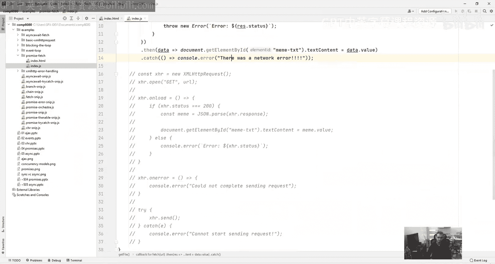
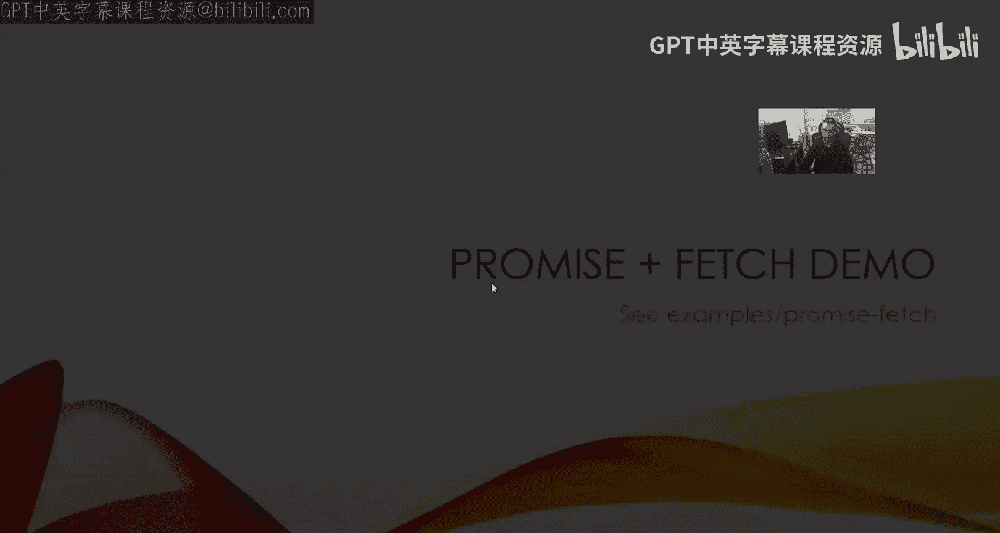
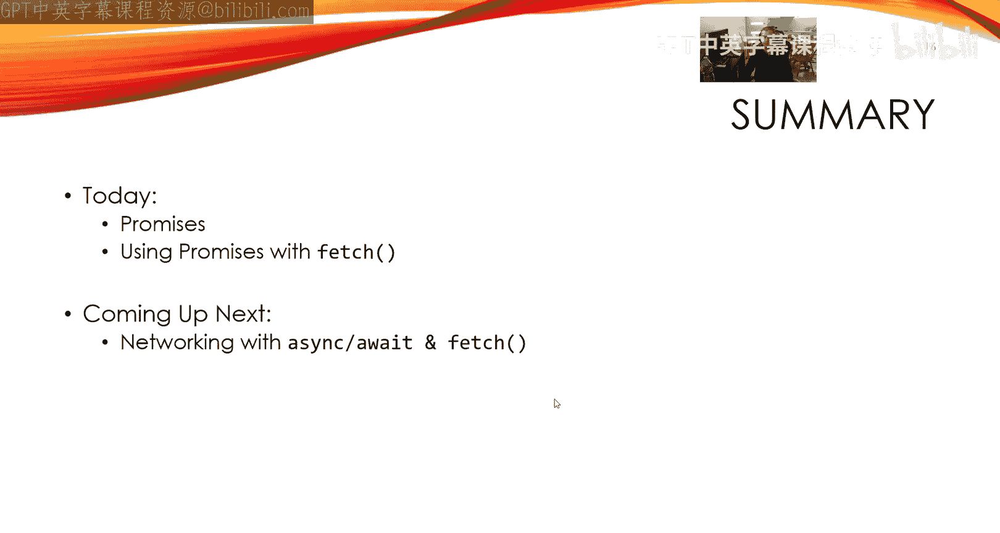

# 前端编程：COMP6080：JavaScript AJAX 🦊 Fetch

在本节课中，我们将学习如何使用现代JavaScript的Fetch API来替代传统的XMLHttpRequest进行网络请求。Fetch API基于Promise构建，提供了更简洁、更强大的异步操作方式。

## 概述

Promise本身是一个有趣的计算机科学理论概念。然而，对于注重实效的程序员而言，在引入Fetch API之前，它的实用性有限。Fetch API旨在替代XMLHttpRequest，其核心特点是原生基于Promise。它允许我们完成之前的所有任务，但提供了更优雅的Promise实现方式。

## Fetch API 基础

上一节我们提到了Promise的概念，本节中我们来看看如何将其应用于实际的网络请求。

Fetch API的主要优势在于它直接使用Promise。与之前XMLHttpRequest在遇到网络错误时会抛出异常不同，Fetch API中的网络错误会导致Promise被拒绝（reject）。但需要注意的是，它不会仅仅因为HTTP状态码不是200而拒绝，这只针对网络错误。这一点非常有用，因为它意味着你可以用一种清晰的方式捕获意外错误，并使用`.catch`方法以同样清晰的方式处理预期错误。

Fetch API接收两个主要参数：请求的URL和一些可选的配置参数，用于自定义请求行为。

以下是配置参数的一个基本示例：
```javascript
fetch(url, {
  method: 'POST', // 默认为 GET
  headers: {
    'Content-Type': 'application/json',
    'Authorization': 'Bearer your_token_here'
  },
  // ... 其他配置
})
```
最常用的配置是更改HTTP方法（默认为GET）。你还可以添加更多内容，例如更改认证令牌、添加头部信息（如Accept、Access-Control等），当然也可以更改HTTP方法。这使得代码看起来更加清晰。

## 实践：转换Chuck Norris API示例

我们将把之前课程中使用XMLHttpRequest调用Chuck Norris API的例子转换为使用Fetch API。

首先，我们很少需要手动创建原始的Promise，因为调用`fetch`函数会自动为我们创建Promise，这非常方便。我们只需要提供URL，然后进行链式调用。

让我们先处理错误情况。记住，当发生网络错误时，`fetch`返回的Promise会被拒绝。在我们的例子中，两种错误情况都只是将信息输出到控制台。

以下是处理网络错误的基本结构：
```javascript
fetch(url)
  .catch(error => {
    console.error('There was a network error:', error);
  });
```

那么如何处理成功响应呢？我们通过链式调用`.then`方法来实现。使用Fetch时需要注意，当Promise完成（fulfill）时，它返回的是一个`Response`对象。我们需要通过这个对象来检查状态和进行后续操作。

`Response`对象有一个`ok`属性，如果响应成功（状态码在200-299之间）则为`true`，否则为`false`。

以下是检查响应状态的基本逻辑：
```javascript
fetch(url)
  .then(response => {
    if (!response.ok) {
      // 处理HTTP错误（如404）
      throw new Error(`HTTP error! status: ${response.status}`);
    }
    return response.json(); // 解析JSON数据，它返回另一个Promise
  })
  .then(data => {
    // 在这里处理解析后的数据
    console.log(data);
  })
  .catch(error => {
    // 捕获网络错误或上面抛出的HTTP错误
    console.error('There was a problem:', error);
  });
```

如果响应是成功的，我们需要获取数据。Fetch原生支持JSON，有一个名为`.json()`的方法。但请注意，`.json()`方法本身也返回一个Promise。因此，我们需要再链接一个`.then`来获取实际的数据。

将上述逻辑整合，完整的Fetch调用代码如下所示。与之前的XMLHttpRequest版本相比，代码行数更少，结构更清晰。

运行这个转换后的代码，功能与之前完全相同。为了演示错误捕获，我们可以模拟网络断开的情况。断开网络后尝试请求，控制台会显示网络错误。重新连接网络后，请求又能正常进行。如果请求一个不存在的URL（返回404），错误也会被`.catch`块捕获。

一切功能都与XMLHttpRequest相同，但代码更加优雅。





## Fetch 与 XMLHttpRequest 的差异

虽然Fetch带来了诸多便利，但它并非万能银弹，与XMLHttpRequest存在一些差异。

以下是两者的一些主要区别：

*   **浏览器兼容性**：XMLHttpRequest甚至可以在IE5等非常古老的浏览器版本中工作。如果你的项目需要支持这些环境，而Fetch不可用，那么你可能仍然需要使用XMLHttpRequest。
*   **进度监控**：据我所知，XMLHttpRequest是唯一允许你监控大文件下载进度等的API。使用Fetch和Promise很难直接实现这一点，除非使用Streams API（这是另一个基于Promise的独立API）。
*   **请求取消**：取消Promise并不容易，而这在某些场景下（如超时处理）非常重要。XMLHttpRequest可以更直接地中止请求。

每种技术都有其优点和缺点，但总体而言，Fetch的优点更多，因此你应该优先使用它。与Fetch配合使用的Streams API学习曲线并不平缓，如果你有兴趣，可以查阅相关文档链接。

我们正在向前发展，Fetch API是强大、灵活且基于Promise的，这非常棒。

## 总结



本节课中我们一起学习了现代JavaScript的Fetch API。我们了解了它如何作为XMLHttpRequest的替代品，基于Promise提供了更清晰的异步请求语法。我们通过将Chuck Norris API的示例从XMLHttpRequest转换为Fetch，实践了其基本用法，包括链式调用`.then`处理响应、使用`.json()`方法解析数据以及用`.catch`捕获错误。最后，我们讨论了Fetch与旧式XMLHttpRequest在浏览器兼容性、进度监控和请求取消等方面的主要差异。尽管存在一些限制，但Fetch API因其简洁性和现代性而成为网络请求的推荐选择。