# UNSW《前端编程｜ Web Front-end Programming COMP6080 23T1》中英字幕（deepseek-R1 p40 -41-COMP6080 - UI 🥑 Fundamentals.zh_en -BV17RXGYuEaM_p40-

Hey folks Sam here from Canva I'm going to be taking the design UI UX lectures for Com6080 I'm sure a lot of you guys sitting in this room come from a more technical background This is a computer science course after all so one thing that I definitely struggled with also coming from a technical background as I started to build frontends and applications and websites was getting my UI designs looking right I could make a website I could write all the code I could get all the data but one thing I couldn't do was make an app that looks professional and I think UI fundamentals really nailing the UI fundamentals is one thing you can do to help your apps feel more professional feel more right and just get a bit more polish in your end result so hopefully today you guys will all learn something that you can apply one tip one trick to make your apps feel like the real deal so before we get into some UI fundamentals and some tricks I want to very quickly walk through what is the difference between UX and UI。

😊，For what like the scope we're going to cover today is so user UX stands for user experience whereas UI stands for user Inter design so user experience is a bigger picture it's thinking broadly around the usability of the app who are the users using the app what processes are they trying to undertake and does the app feel logical like does it help them achieve those processes user experience designers often also take on the role of doing user research interviewing users to find out about their processes or running low fidelity like sketches past users to make sure the process make sense？

😊，Useser interface on so if user experience design is looking at the process and the bigger picture which is very important。

 but not what we're going to be focusing on today， user interface design is the flip side of that。

 It's looking at the individual states and screens of an app。

 So it's breaking down the process looking at What does the button look like what copy are we going to use here。

 What graphic are we going to use here。 How are things going to be aligned it's kind of the branding at the app。

 It is the visual design。 So that's what we're going to be looking at today。

 We're going to be looking at visual design side of things。😊。

In making this talk I had to ask myself what was the aim of doing visual design for an application and I think what I arrived at was that we do visual design for apps and websites to make it easier to use it's kind of three core core ideas in there one if we want to make sure people aren't scared there's a lot of things in visual design that that are innately related to the human brain and how humans are perceived then so making things feel aligned。

 feel wellcoled harmonious is important so that people can take your out seriously。

 they don't flinch， they don't look away they're not like oh I know I can't use this because it looks terrible。

😊。

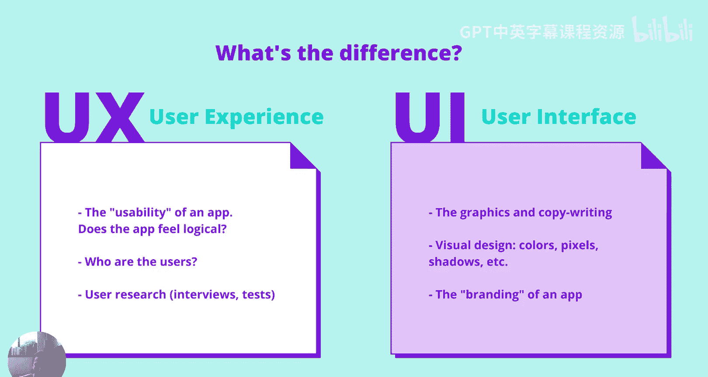

That's important we're going to look at that first The second thing we're going to look at is kind of based on how people use apps so different apps have different modes of interaction。

 a really common mode of interaction for front ends。

 especially that we're building in the web or for apps is scanning so where people you know search to find something on the page and then they do something with it so that's going to be the last two sections of this lecture where we look at how we can make it easier for users to find things through visual hierarchy and then how we can make it easier for users to do something with what they' found and that's going to be a for so yeah that's an outline for what we're doing today。

😊，Onto our first section today of how we ensure users aren't scared of your application by following some graphic design basics So there's three basics I want to walk through today。

 I really love threes and the three basics we're going to be looking at today's alignment which ironically the heading there is looking very misaligned if I say so myself fonts and colors So alignment is the way humans love consistent patterns they love things to be aligned。

 equally spaced symmetrical so we're going look at how we can use a grid to help create great alignment within application because obviously the challenge there is that in your application you have lots of different types of things。

 lots of different buttons， lots of content and how you can make that all feel aligneded even though it is inherently different。

😊。

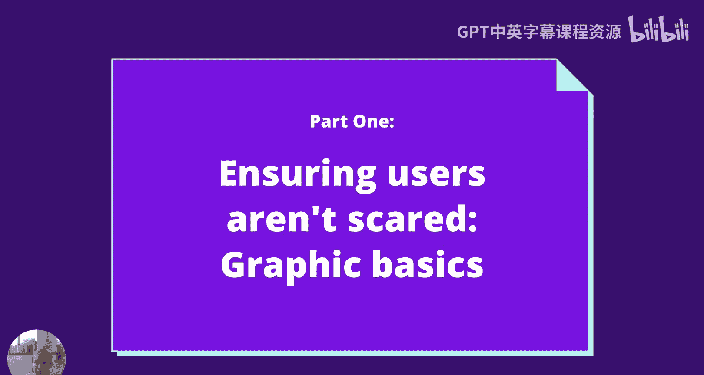

With fonts we're going look obviously when you're making a website you need to pick fonts for your website or your application。

 so we're going to kind of break down how we can approach that and dito for colors very easy to pick a single color。

 but often the question is my website needs more than one color because there's multiple elements in my website so we're going look at how we can use maths because a lot of programmers in my so I'm sure we all love maths we're going to use how we can use maths to get colors that look great together。

😊，Sweet onto our first kind of part of this section， which is alignment。

 I want to take a step back and think just broadly。😊。

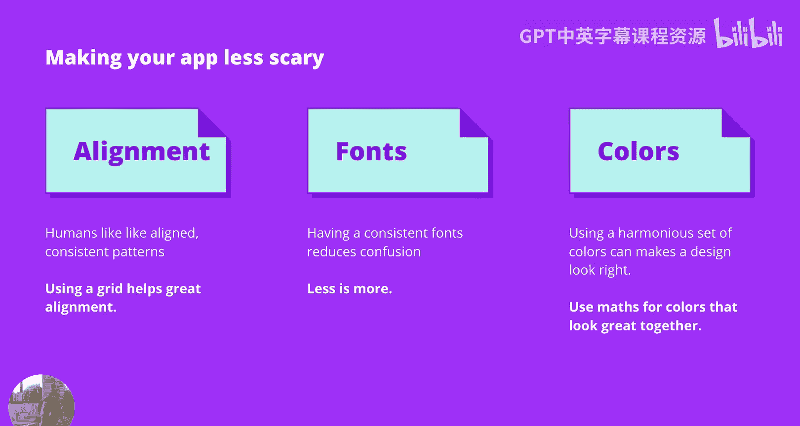

What does alignment mean？😡，I think there's something very innate with human， right？😡。

When I was doing this talk I have this like second mode which is I want to convince you guys that this stuff that there is some logic to these rules that designers have created and I think for me I realized that was because so much of this is hardwired in our brains as humans you if you look at the image on the left it's of a house with lots of wavy lines very crooked。

 I think that's something we would associate as being spooky on the other hand the skyscrapers on the right。

 clean lines very lines looking each the buildings so that's much more trustworthy looking than the house on the left。

😊，What I wanted to draw from that was that there is some intuition behind why we strive for alignment in our U I and。

 why we more generally strive for consistency as we're going to be doing all throughout this talk。

 So it's not just me making up rules for a lot of these things， There is that kind of human。😊。

The human nature that drives us to want to do these things。To create alignment in visual design。

 often we use grids， this is a concept that's gone back centuries。

 I found this picture of a book I don't know where this book is from but it looks pretty old because it's in black and white let's how you know it's old。

😊，But as we can see here， the way the text is laid out on the page of the book is no accident。

 the designers created these columns， often when we talk about grids and design we're actually only talking about columns but that's another story so they created these columns and then they've matched up the text to these equally spaced columns and that creates a sense of consistency throughout this design。

😊，So a grid is made up of columns and gutters as we can see。

 I'm going to switch to a slightly better example with a bit more modern example with the BBC website。

 everyone's seen it right， it's a news website it lists news in different ways different sizes。

 all fancy things。😊。

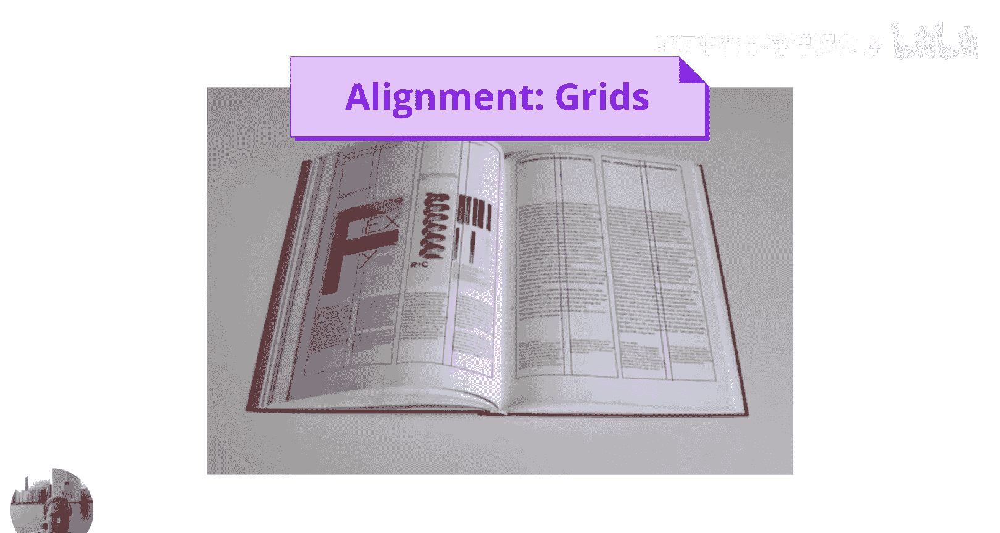

If we look at a grid here on the if we overlay， so we got the BBC website。

 I'm going to overlay this grid on the BBC website， we can see that。😊。

What I've done with this grid is I've put 12 columns。😡。

And each of them have a 16 pixel gap between each column and we call that the gutter as you can see。

 kind of like magically the 12 columns line up with all of of the things on the page even at the top where we have you at the bottom where we have three items per row and at the top where we have this kind of complicated like one big item and then two small items we see the grid lines are up perfectly and that's kind of that is what makes this user interface look visually pleasing look at because it is so consistent we often use 12 columns for a grid because it can be commonly divided into so many useful numbers here can we see it's divided into three。

 we see it divided into two for the large for the large news story on the top left we see it can be divided into four4 across for the little new stories on top right and it can also be divided into six across that's crazy maths right there and then we have the gutter between them what we do in the BBC if I'm just gonna zoom in for a second。

 we can see that we've aligned the。😊，We've taken the the content and we make sure to align it to the edge of the column so I put a blue circle here。

 we see the content goes all the way the edge of the column but not over the margins so we use the margins to create consistent spacing between items this using grids is。

😊，IOne another thing sorry noticed if we just go back is we see that the grid doesn't take up the entire width of the page one thing that's quite important when you're making a website。

 especially text every website like a new site is readability it's quite hard to read text that goes the entire width of a computer monitor especially as they get larger and larger so we see here in the BBC they put 1200 pixel limit and outside of the 1200 pixel there's just paddings or like if there was like an image section for instance the image might spill over or the color might spill over but all the text or the content all the things you're reading that's never wider than 1200 pixels and that's how we create these grids responsibly in a digital context rather than just on pen and paper。

😊。

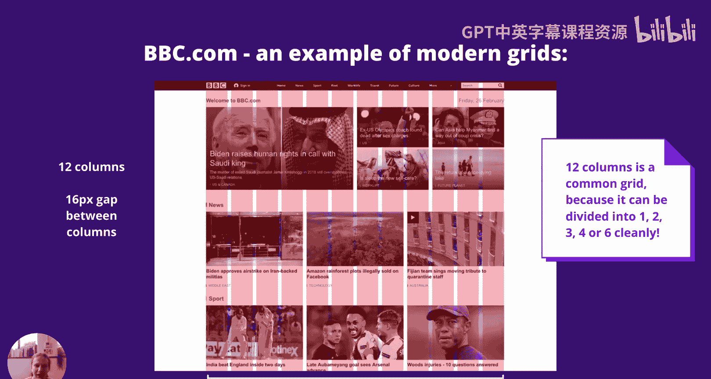

Great so I want to walk through a very another small example because I think grids are one of the magic panaceas for making a design look better on the left I've sketched out a basic landing page right this is something you can do quite easily just sketch it on paper or in this case I've used an app called Figma to sketch it out then on the right I add a grid and I drag all the stuff so that's now aligned to the grid and it looks Che kiss perfect I think if I take away the grid you just comparing them I think if you were to zoom in youd probably feel like the right hand side looks a bit more professional and that's all you have to do to do that is choose choose a grid choose some numbers using 12 columns very common number choose a maximum width for your page 1200 pixels another very common number and just start lining things up there is one thing to note here is grid we're using grid as a design tone here you might think we do have a technology called CSS grid you don't necessarily need to be using that to achieve this this is all just about。

😊，about the widths of items so just using the grid when you're drawing things out to calculate how wide items should be。

 that's how you can implement this in your websites。😊。

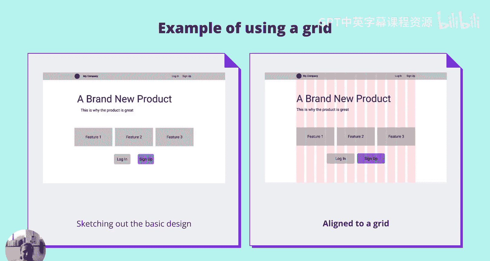

Sweet now from grids onto to typography or fonts， so generally with fonts one tip that I'd love to give is less is more。

😊，We create we obviously want consistency in the design。

 we don't want users to be guessing you know what font means something is more important than another thing。

 and so limiting the number of font options， font sizes。

 different textiles that we have is a great way to create that consistency and make a design easier to understand。

😊，In particular， I would strongly recommend sticking for one if you have one website stick to one or two font families I was really surprised actually you know I do a lot of work with graphic designers and one thing we found especially with print designs and you know posters because I work at a company called Canva we found that high 90% of those when they're designed by professionals are being only have one or two fonts in an entire design so it's very its。

😊，Very rare that you would want to add more fonts than that。

 So I think that's one thing to keep in mind and you can do this。

 you can plan for this ahead of time。 So in particular you could create a font palette to create that consistency So you know which is the heading font and how big heading should be so that you don't create lots and lots of different font styles on the left is a very simple font palette you can just Google font pairing of font combination of the internet you'll find lots of examples of these So this is just having a title subtitle and body text on the right is actually a very real worldd example from Google's material design library in that case it's actually only one typeface it's the roboto font but we have like different variations of bold and light and medium but even here we have 1015 sizes and that's for the entirety of Google's material products So really keeping an eye out for minimizing the number of different fonts you use is that is something that the most websites do and something that you can。

😊，do to make your website feel more professional just by creating a table like Google's done here。

 using free online tools such as the material guidelines to create that table with your own fonts or finding another one on the internet。

 that can be a great way to achieve very consistent type and that sense of consistency that makes you use the interface look more professional。

😊。

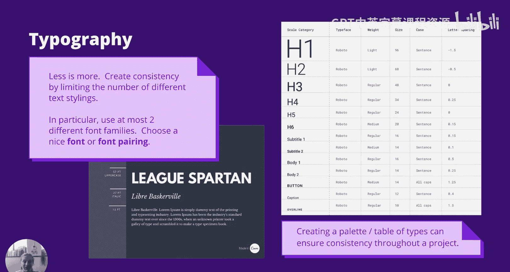

Now onto probably my favorite one of these three， which is。

Colors so I want to start with a bit of a motivating example one thing you've noticed in apps is we often have very simple color palettes here's an example again from Google's great material design guidelines but this is of just a simple demo analytics application here the whole app color of this app obviously this is only one screen but you would keep this consistent across all screens in the app which is having for example a primary h maybe a secondary view in this case I included a secondary view and then just using black white and various gray scales throughout your UI。

😊，Obviously as part of this it's very important to pick colors that work nicely together and that isn't art in and of itself if youre particularly designmined。

 that's probably something you can eyeball and just pick out art colors but I'm not particularly design mineed so I'm going walk through how I would go how I would go about you know if I decided my brand color was purple or my brand color is blue。

 how I would go about making a lighter version and a darker version so that I've got a bit more contrast I've got a couple more variations to play with throughout the app so that I have this kind of wide palette so that I don't have to go and choose random colors later down the line。

😊。

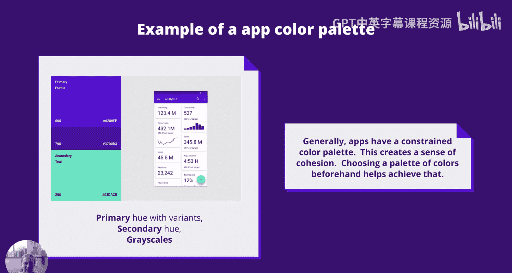

Sweet， so I've got two example palettes here， right？😊，Pelleette on the left palette on the right。

 I think the palette on the left looks much more harmonious。

 The palette on the right looks a bit more scattered。

 The colors don't don't particularly match In this case the aim I was going for was having the same hue。

 So h， H is a colored term。 And it kind of means the the color of the color。 So hue it。😊，啊。

Hue is usually used in conjunction with terms like luminance or saturation in that case luminance would be describing like how how bright a color is or how saturation a similar thing so Hugh would be describing like what actual color it is whether it's blue。

 red and so on anyway so my aim here was to create palettes with different hues sorry with the same with a consistent hue create to make them really harmonous and I think I did that on the left on the right hand side though not very successful why is that so。

😊，As coders we often look at colors through hex codes。

 hex codes are just a hexadeimal encoding of RGB values so it's red。

 green and blue and if we look at the RGB values here they're actually kind of useless RGB is a terrible color space for a lot a lot of what we're doing RGB is very like RGB is how displays talk about colors it's how they light up the pixels to create the colors however it doesn't encode a lot of useful information in particular it's not at all linear RGB 5050-50 double is not half as bright as RGB 100100100 so。

😊，And also it doesn't encode it doesn't embody the ideas that we want around like colors having hue and saturation so IGB is often the wrong way to look at colors when you're trying to design things even though it' what you need to do when you when you're actually coding me up so we can use different color spaces here examples of different color spaces are things like LAB or lab HSL and HSV these color spaces aim to be more so lab in particular is really interesting it aims to be perceptually uniform so fixing that issue where so like double of color should look。

😊，Doubly dry， for instance， that is really interesting。😊。

But all of these seek to encode more useful information so we can actually understand the colors and do maths on them these are all things you can look up the formulas online or you can use like online calculator tools to convert between them there's like maths that they use to convert between RGB and these other colour spaces。

😊，In this case， I use the HSL color space。 So that stands for hue saturation and luminance hue is measured from 0 to 360 degrees。

 It's like what what h it is from going from red to blue， so on。

 saturation and lightness then measure the。😊，The intensity and the whiteness of the color。

In this case， what we can see when we convert all these colors to HSL。😊。

P me is that the harmonious palette on the left has a consistent hue for all of the colors。

 whereas the less harmonious palette on the right is using。😊。

Has has subtle variations in Hue for all the colors。 So if you're not a designer like like like me。

 then I would recommend thinking of color through this mathematical lens to try to allow you to pick colors more effectively to create the harmony。

 for instance， when you know， choosing a hue an essential brand color and then， you know。

 drag it that。😊，only changing saturation and luminance to create sense some variation so you can have darker and a lighter versions for use around your application if you're really interested in colors I don't know if I've done a best of selling how exciting and thrilling this is of a science but it's a really good conference talk because's about 20 minutes I've linked to it in slides here that wolfs through a brief history of how we've arrived and what color spaces you might want to use other than just using Patce because it it's quite useful so if you don't want to listen to a long conference talk。

 I would recommend some great free online tools such as colorer pallotons a terrific one gives you this Hue wheelhe and you can very easily add multiple points with various saturation and Lightness points in the middle to create those harmonious color palettes or adobe color does a very similar thing and they're also all free so yeah if I give any recommendation about colors it would be that just like。

😊。

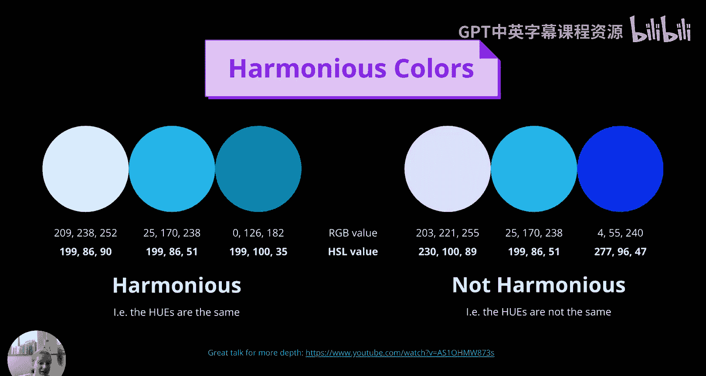

If you want colors that look harmonious， they should have nice mathematical relationships and using tools like this will help you get colors with nice mathematical relationships。

 so they do look visually pleasing。😊，啊。And obviously consistency is key， just like with fonts。

 we don't want to have lots of fonts。 we also don't want to have lots of colour。

 so' choosing some core brand colors such as just just choosing one brand color and perhaps a secondary color that's a great way to。

😊。

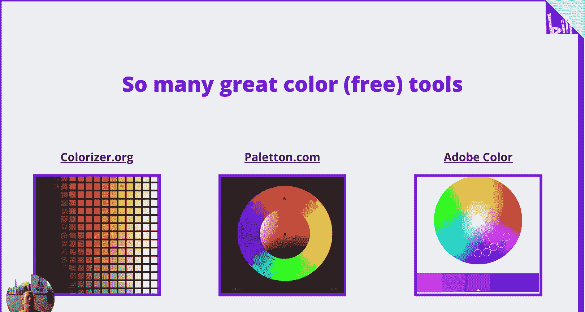

to make an app that will feel consistent。Now we're on to part two， which is affordances。

 So I wanted to bring up a motivation for affordances。

 And I thought a great example of that is something that is really complicated。

 but really simple at the same time。 And that is an electricity bill。

 who doesn't love electricity bills。 Yeah， you get in you pay there Oh。

 they're terrible So electricity bills。😊，Have a lot of information。

 there's information about how much electricity you've used。

 who you can contact if there's no electricity， who you can contact if you want to dispute the bill。

 when the bill is due， all the ways to pay the bill because electricity bills。

 lots of people get electricity bills。 Some people may have never paid an electricity bill before。

 Some people might need information about assistance programs to help them pay their bill。

 there's so many stakeholders involved with an electricity bill。

 so many needs so many features if we're thinking as kind of as our developers。

 there's a lot of features of an electricity bill。 So the real design challenge for an electricity bill is how can we make most people happy and the way we do that is we create visual hierarchy。

 So what is visual hierarchy visual visual means means visual we're talking about graphic design hierarchy means hierarchy means means hierarchy。

 So it's about having the most important things at the top and prioritizing them and then understanding what's the least important。

 So for instance， in electricity bill。😊，Things that are probably really important is knowing what bill it is if it's your electricity bill or your gas bill that's very important to know second thing is knowing how much it is due and when you need to pay it by and then probably also there's and then as we go down the list things get less important so that's things like how much electricity do I use in case i'm interested in reducing that oil。

😊，Who can I contact if I have a problem with the bill Obviously hierarchy comes from a bit of a user experience understanding of like what is important to our customers。

 what is important about our product but visual hierarchy is then how we translate that into our design So great example with the electricity bill is as we said before probably the most important thing in the electricity bill is knowing how much you've got to pay and when you've got to pay it as we can see that information is in a bright blue box in big bold tests so it's quite obvious from seeing the electricity bill how much you need to pay and you can see that even before you've seen everything else So great design here is saving the users of your electricity bill time because they don't have to read the whole bill to get the information they need to know。

😊，诶 yeah。So how do we create this or I just mentioned that we have this big text so that's kind of like size in a big blue box so that's color and contrast。

 but I want to break that down into six elements so that you can think of what techniques can I use to make sure that the important information in my application is made prominent。

😊。

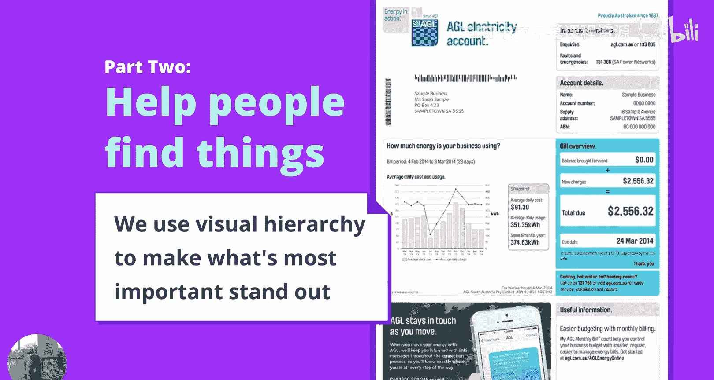

So elements of visual hierarchy size that's pretty obvious figure is more important ditto with color。

 the brighter so having the bright blue instead of a grayscale color again makes it seem more important contrastst is another interesting one actually we' flip back to the electricity bill notice how the charge here the total de is inside a white box which is inside a blue box So that contrast between the white and the blue adds even further prominence to that visual element because our eyes are drawn to the contrasting colors So on top of color you can use contrasting colour to draw further attention spacing is another big one and actually it is used in the electricity bill here what a terrific electricity bill because we put we put the total de in a box and we haven't made it this tiny box we've given it some nice padding around the box and again just like a mountain that's in in the middle of a flat a flat area is going to look like a1 tall mountain and a mountain that's next to a bunch of other mountains having the。

😊。

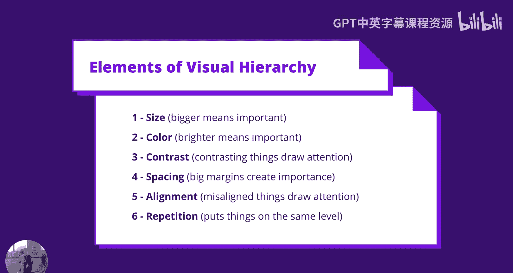

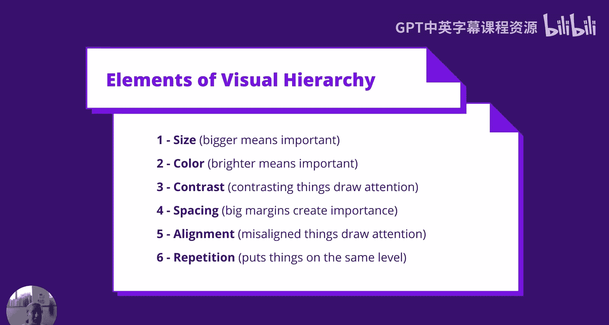

This big bot in the middle of a white box that provides us a pattern gives it that extra prominence that again draws more attention to it。

😡。

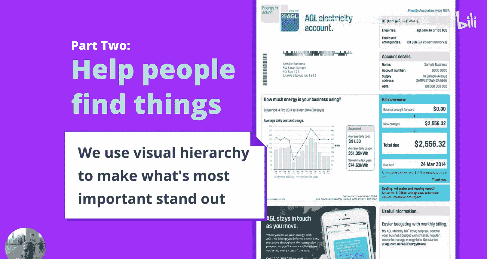

Alignment is another important thing。If I were to align lots of things in a row。

 snap them to the same grid for instance， they would look less important。

 whereas if I had one thing that was out of order， the one thing that's outside would look more important and repetition again building on that same idea So one thing you notice with visual hierarchies all of these things are relative and that's actually quite hard especially an industry right because visual hierarchy isn't about what's important。

 obviously everything in your app is important because otherwise you wouldn't have put it in your application but some things are more important than others so you've got to have you got to have the product kind of knack there to be able to know what's not important and what you're going to hide because only a subset of users might use it so in the electricity bill for instance we put the useful information about budgeting we put they put that at the bottom in this smaller text and that's probably based on an assumption that less people a lot of people who are getting electricity bill are just going to be able to pay it and less people are going to need that information。

Again， so that is an example of visual hierarchy in action。

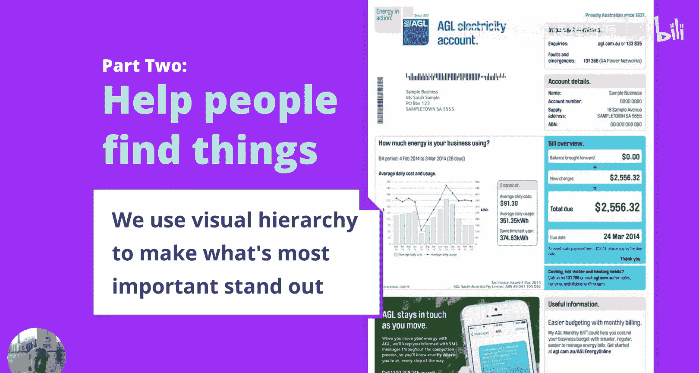

Obviously we're not a course that's making electricity bills。

 we are of course making websites and front ends， so I did want to walk through a second example just to highlight some of these techniques because I think it's very important to understand them and be able to apply them to your own designs。

ABC News， news is a classic example of visual hierarchy because as well as visual hierarchy happening。

 which is using。😊，Using graphic design to communicate what's most important。

 the hierarchy is actually very the idea of prioritizing things and having one element more important than another is so inherent to a news website because obviously there's so much news happening in the world and ABC has had to decide this is the top story that we're going to put on our website so。

😊，There's a lot of prioritization happening within this page I think that's really interesting the first thing to notice is what's made unimportant in this case I think it's the header navigation bar probably not something you need to draw users attention to because most people will expect there to be a navigation bar so they've made it darker so that you can't really so that it's less it draw less attention there's a lot of repetition happening everything is neatly aligned so it makes it very easy to ignore the header which again that's saving our users time because most of our users are going to be aiming for those for the new stories that interest them they don't want to have to。

😊，We don't want to burden them with having to like look out and understand the header in order to use our website。

😡，This was taken a couple days ago， I don't know when you guys are going to be seen lecture。

 but this was back when there was the big Facebook。😊，And。😊。

Changes so we've got a big bannerner here about Facebook and again we're using spacing because there's so much shit ton of padding in this banner really draws your attention we're using contrast here the blue really contrast against the white the blue color is also super bright so that's probably like the thing that's really grabbing most people's attention when they view this cage again。

😊，Obviously in the actual headlines here we're using size to indicate importance。

 the biggest headline is in the top left， it's using a bigger font than the headlines below it and that again is also using a bigger font than the Just in section and a bigger font than the features section so we're using size to communicate which stories the ABC thinks is most important for its readers another more subtle one is between the features and just in because even though they are very similar in size we have very different usage of color here the features section uses a lot of color again really drawing out our user' eyes for instance the COVID vaccine story whereas the just in section is completely devoid of color so it's very easy to pass over when you first look at the ABC website so that is kind of what hierarchy is about it's about knowing what's important in this case the editors made the decision that the top story should be around the alleged salt in the PAs office so then designing and of course that the Facebook news so then designing a website and using these visual tricks to make。

the first thing that users see can help save the user time。

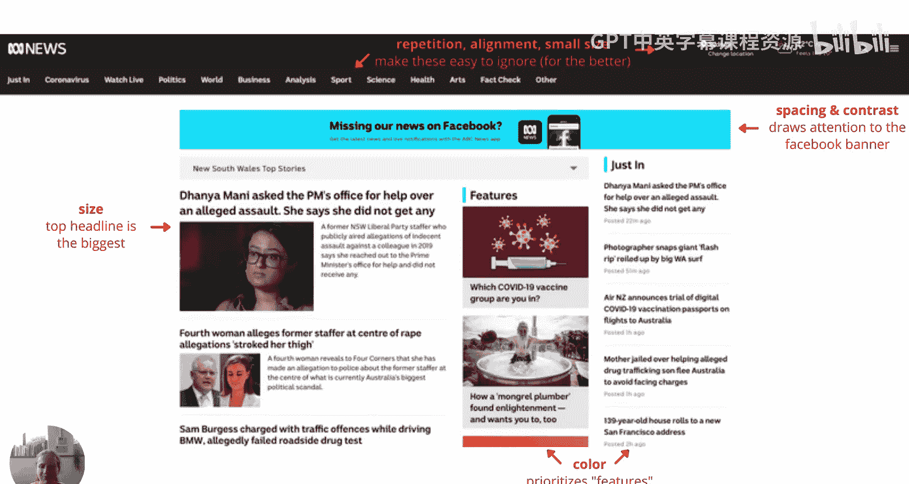

On part three， All right， we've made our users not be scared of the app because we align things with chose good fonts and good colors。

 We we then use visual hierarchy so they're able to find what they wanted really quickly。 Now。

 how can we help them use the app to actually do something with what they've found The answer is affordances。

😊。

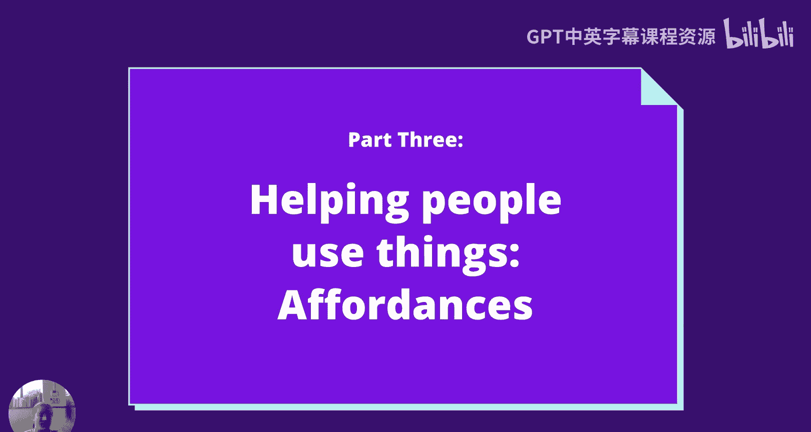

What is an affordance an affordance is a visual property of an element that lets users know they can do something with it。

 For example， classic example of an affordance Aance is broader than just UI design on a screen so classic example is a handle on a door if you just saw a wall there。

 you probably wouldn't know if you could open it but because there's a handle on a door it lets you it lets you open it easily because you can grab the handle。

 but it also is a visual language lets you know that it is a door rather than just being a wall and obviously I suppose an equivalent is a button on a web page but affordance is a really important because otherwise people can't use your apps to actually do anything。

😊。

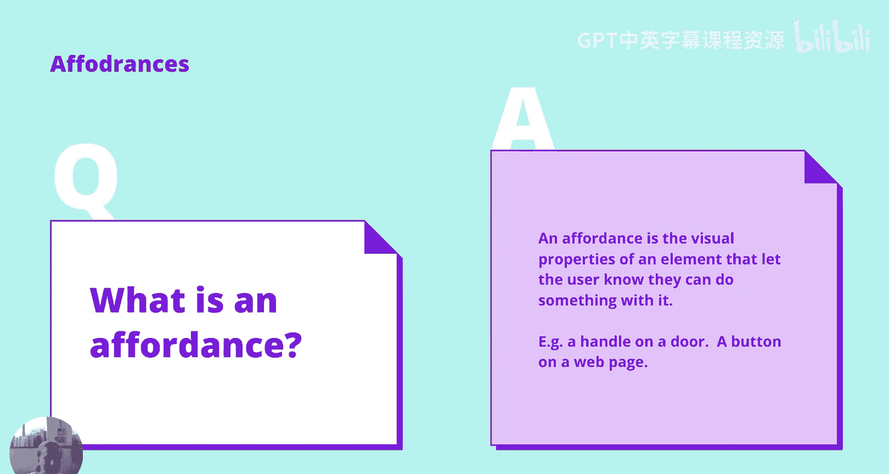

So let's look at some types of affordances because I think this helps you think about all right when I have an action in my app what type of affordance have I used for it and is that the appropriate type you know do I need to make make it more explicit so this is only a subset of types of affordances but I think like the important types first one I think is explicit affordances the explicit affordances tell users how to interact with something classic example of that is a click here link it's like click here to sign up。

😊，And you click the link literally telling users what to do slide to unlock another example of a patent affordance or sorry over an explicit affordance it's telling the user to slide there's also a bit of a skekumorph figure affordance happening here so skewmorphism is a style of design that takes physical objects and tries to make them do the same thing on a computer so we've got this kind of like。

😊，We' got all the shadows so it looks like it could actually physically move if it was a real thing so again that's all telling the user what they can do with this element on the screen obviously these days we're not really intomorphic and another example of an explicit affordance would be a button I've chucked in the sign up buttons on Canva so again we're using color we're using rounded corners because that kind of signals it's a button we've got some background color a lot the time we would also have shadow and that's signals that you can interact with it。

😊，Obviously problem with explicit affordances is they take up a lot of space and as we learn from visual hierarchy。

 if our action isn't very important， it shouldn't take up a lot of space because that would waste our users time they would think it's more important than it really is so we can often use things like patent affordances for these kind of secondary actions Pat affordances allude to a common pattern that users might be familiar with from other applications to imply them interaction is possible。

😊，Really common patterns would be things like underlined blue text。

 implying that something is a link or that hamburger or the three dots icon implying that something is a menu。

 nothing about those like three dots or or the hamburger there tells users like this is a menu it's not written menu but it's just a pattern that a lot of users are familiar with because it is so common another example would be a checkbox a checkbox especially in the unchecked state doesn't say you know check me but a lot of people have seen what a checkbox looks like so they know what to do with it Pat affordances are a bit tricky though it's really important that you make sure you are using patents that are familiar to your users don't use especially if you're making like a small application if you were working at Microsoft or Google a lot of the OS manufacturers。

 you might be able to start to try and create new patent but for a lot of us who will just be making just be making apps to websites we want to stick to patterns that are really familiar for our users so you got to have that understanding of users when using patent form。

The third type of affordance， and this is actually quite important one is false affordances。

 I don't have too many examples because usually people are。😊。

Usually people don't ship things that use false affordances and a false affordance is where something looks like it could do something but it actually can't so that would be creating something that looks like a button that actually isn't a button or that it looks like a hamburger menu but it's not actually a hamburger menu so false affordances are just something you need to be aware of when you are creating elements in UI。

😊，It's often you know useful to have someone else go through UI and see just asking them was there anything they thought they could click on or that they thought they could interact with that actually they couldn't and then considering alternative designs for that element so that it doesn't create the false affordance。

😊。

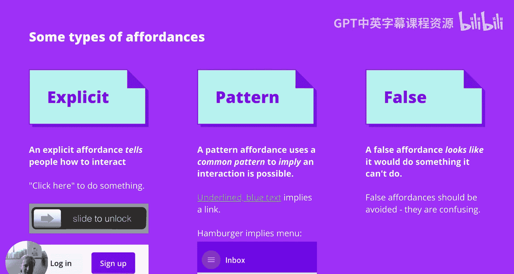

So that was UI fundamentals I hope you guys all learn something at least one like little typical trick that you can use to make your UI look a bit more professional in review I think we at first we looked at alignment to make your design very scary a grid as being a really easy way to create alignment and very popular for websites and apps second was we then looked to creating a font or color palette beforehand to create consistency and you often want to make that quite small so that。

😊，So the app feels consistent and feels very familiar to users as they use it。😊。

We looked at how we could use maths to choose harmonious colors and then we looked at after you've created。

 you've set up these great foundations with the alignment that font the colors using visual hierarchy to communicate what is most important。

 so having if you're working a team or working alone just like having that decision made or what you think the most important thing for your app users is and making sure that that is the first thing that people's eyes are drawn to so they don't have to waste time searching through your entire app to find the most important lecture and then when they found it making sure that we're using the right type of affordances so they do understand they can interact with it。

😊。

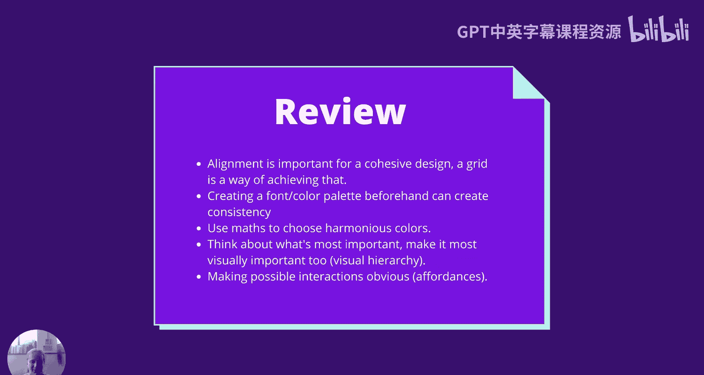

That's all for this lecture， see you guys next time。

