# 前端编程：1：用户界面设计基础 🎨

在本节课中，我们将学习用户界面设计的基础知识。课程分为三个主要部分：首先，我们将从用户视角分析一些优秀和糟糕的UI设计案例，以提升我们的设计意识。其次，我们将学习如何评估和改进自己的UI设计。最后，我们将探讨一些可选的进阶设计概念，以进一步提升界面水平。

---

## 第一部分：UI分析实践 👁️

上一节我们介绍了课程的整体结构，本节中我们来看看如何进行UI分析。我们将分析四到五个不同的网站，每个网站都有不同的用户目标，以此来评估它们在帮助用户达成目标方面的有效性。

我们的目标是练习站在用户的角度思考，观察UI设计。请记下你注意到的设计策略、之前从未想过的事情以及未来可能想记住的点。

### 案例一：LinkedIn

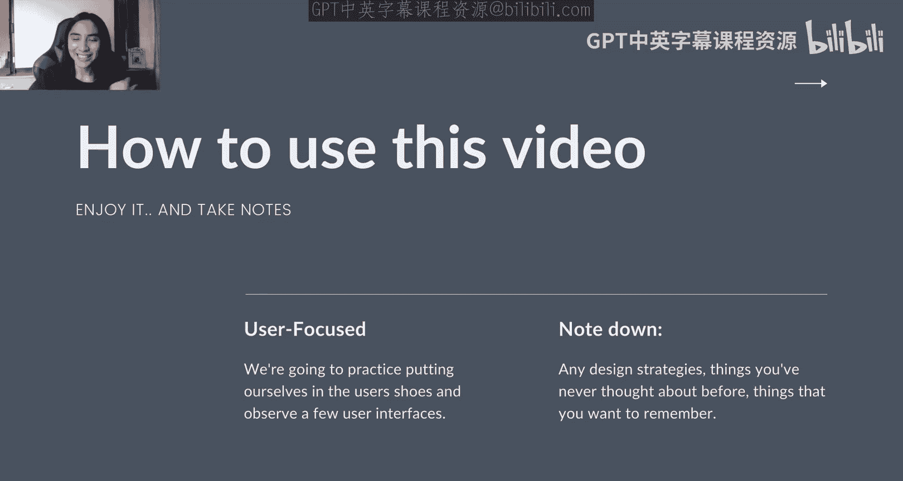

LinkedIn的页面主要面向两类用户：想要登录的回头客，以及想要了解LinkedIn并注册的新用户。

*   **设计特点**：这个网站的设计非常简约。对于回头客，最重要的登录信息直接显示在顶部，他们可以轻松登录。
*   **视觉引导**：用户的注意力会立刻被这个大标题吸引，界面清晰、易用、易于导航。
*   **色彩与形状**：色彩方案非常柔和，形状上有很多平衡感，例如许多元素都是圆角矩形。
*   **辅助图形**：页面中包含许多有帮助的图形。其中一个图形很好地传达了“保持联系”的理念，这与LinkedIn的核心功能完美契合。
*   **逻辑顺序**：页面的信息顺序非常合乎逻辑。首次访问的用户会先阅读关于LinkedIn的信息，了解它是什么。在介绍完毕后，“开始使用”按钮被策略性地放置在底部。接着，用户可以看到一个包含所有可能想查找页面的目录图。
*   **总体评价**：这是一个优秀的UI设计，非常干净、专业，这正符合LinkedIn的定位。

### 案例二：Canva

我们的目标是使用Canva制作一个营销海报。

*   **即时引导**：Canva一打开，这个横幅会立刻吸引用户的视线。Canva有效地运用了色彩和比例，使网站非常易于导航。
*   **理解用户需求**：这是一个很好的例子，说明网站了解用户可能需要什么，并将其呈现出来。我想制作营销海报，可以从建议中看到“营销”是其中之一，点击“海报”即可。
*   **新手帮助**：对于首次使用的用户，Canva提供了充足的帮助，例如入门视频和教程。用户可以选择观看教程或跳过。
*   **模板效率**：进入编辑器后，Canva提供了大量模板，这使得设计变得超级简单、快速、高效。
*   **目标达成**：看，我已经完成了设计，可以立即下载。我在短短几步内就完成了目标。
*   **设计启示**：从这个案例中，我们可以学到两点：一是为新手用户提供大量帮助；二是理解用户目标并为之设计。

### 案例三：Quora

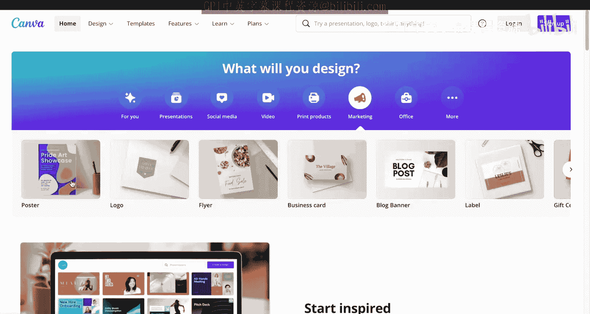

我们的目标是在Quora上找到一个问题的答案。

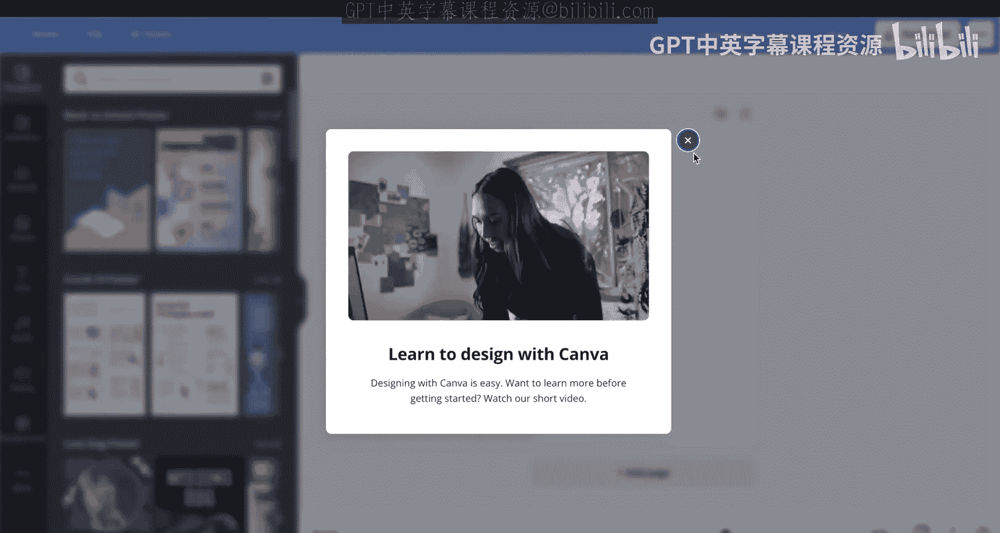

*   **入口障碍**：一加载Quora网站，我就遇到了这个登录界面。不幸的是，与Canva不同，Quora要求用户登录才能查看其内容和界面。对于一个没有Quora账户但急需立即找到答案的用户来说，这已经不是一个理想的体验，因为它设置了进入门槛。
*   **优点**：导航栏非常简约，色彩方案简单，这部分本身易于使用。我喜欢“相关问题”栏是固定的，无论我向下滚动多少，它都保持可见，这非常有用。我也喜欢这个粗体大字号的标题。
*   **缺点**：Quora上充斥着广告。在问题下方首先看到的就是一个完全不相关的广告。即使在答案中，也遍布着广告，这让人分不清哪些是答案，哪些是问题。我不确定这是对初始问题的回答，还是对这个新问题的回答。导航非常混乱，阅读困难。
*   **总体评价**：如果我只是需要一个简单快速的答案，我不会去Quora。这是一个糟糕的用户体验。

### 案例四：耶鲁大学艺术学院

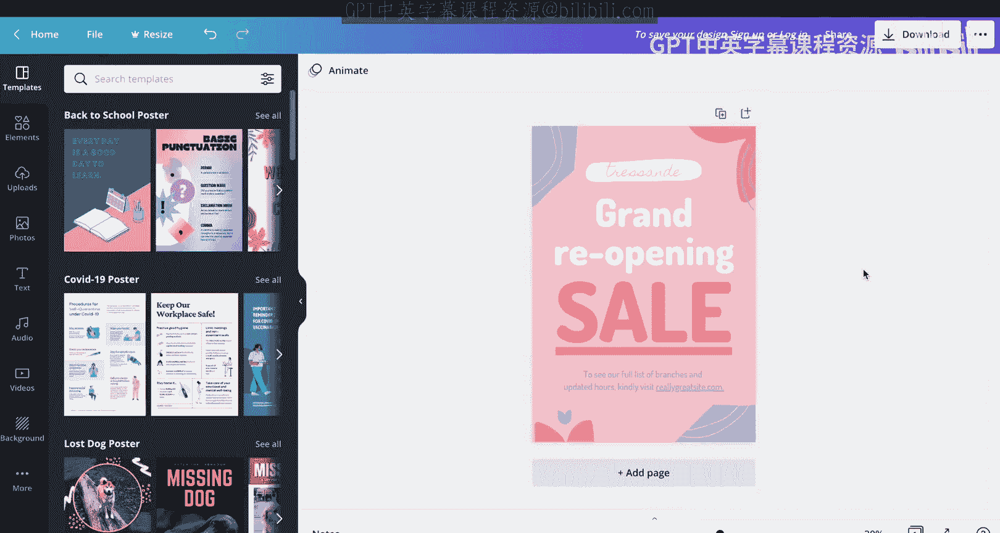

我们的目标是找到如何申请入读这所学校。

*   **第一印象**：我的视线被吸引到这里，也因为背景非常分散注意力。许多文本没有坚实的背景，你可以看到文本只是被高亮显示。
*   **布局问题**：布局缺乏一致性和秩序感。这里有很多不同大小的文字，我认为比例运用得非常差。“快速链接”在这里，也许我应该点这里，或许“机会”是我需要去的地方，但我发现我点错了地方。
*   **分散注意**：这个背景本身就很分散注意力。最后我才注意到这个小小的侧边栏，它非常重要，但起初我并没有注意到。
*   **进入申请页面**：点击“申请入学”后，我们终于看到了一个白色背景。
*   **总体评价**：你可以看到，这里对比例的感觉很差，这些不同的尺寸非常不一致。是的，导航真的非常困难，很难完成我的目标，因为我的大脑需要花时间去处理眼前的信息。

### 案例五：UNSW网站

同样以申请入学为目标，在UNSW的网站上很容易找到我需要的信息。

*   **清晰导航**：我已经可以看到这里有几个选项，“学习”可能是我想要的。我可以看到这里可以找到我可能需要的所有信息：学什么、体验、如何入学。我立刻就能看到“立即申请”，这是我的初始目标，我可以快速点击它。
*   **目标达成**：看，我需要的一切都在这里。
*   **设计启示**：正如你所见，干净、简约的界面无疑是正确的方向，因为它们不仅看起来更美观，而且更容易导航，用户也能更好地完成任务。

---

## 第二部分：评估与改进自己的UI 🔧

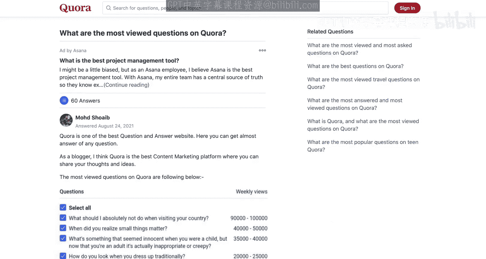

上一节我们分析了他人的用户界面，本节中我们来看看如何评估和改进自己的设计。你可能已经学习了一些关于用户界面设计、规划、原型设计、迭代和测试等方面的良好实践。

然而，很可能你在完成作业时发现无法按时完成所有任务，因此你正在寻找方法在UI部分多拿几分。我曾经也这样做过。

因此，我整理了一系列以用户为中心的问题和一些快速实用的技巧，希望能帮助你改进设计。

我认为这个部分在你即将开始作业或已经开始作业时最有用。我建议你把它当作一个备忘单，也许可以在逐步完成作业时观看。它非常简短，我尽量让它易于理解和直接。

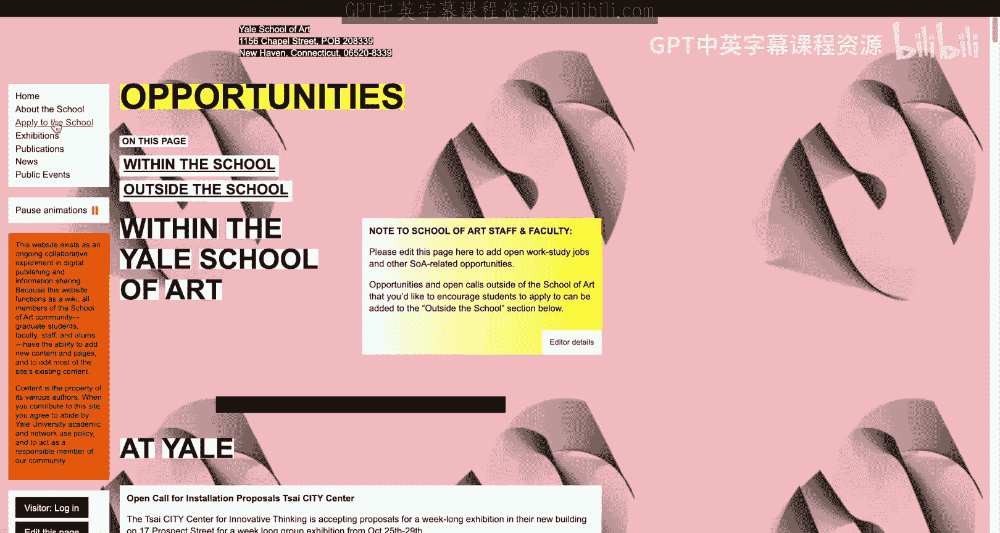

以下是评估和改进UI的关键维度列表：

### 可见性

评估可见性时，可以问自己：其他功能、选项和控件有多明显？首次使用的用户是否需要猜测或点击随机的东西来弄清楚控件在哪里？

*   **重要控件置顶**：不要让用户需要滚动才能找到重要控件。你应该将最重要的功能放在页面最顶部，可见且易于访问，就像Google Drive那样。
*   **视觉流**：视觉流通常是从左到右，从上到下。虽然并非总是如此，但在设计时记住这一点是有好处的。
*   **按钮优于汉堡菜单**：优先使用按钮而不是汉堡菜单，因为按钮通常有更好的可见性，因为它们有标签。但如果屏幕空间不允许，汉堡菜单也可以。
*   **响应式检查**：确保检查不同的屏幕尺寸，确保控件不会消失或出现异常。
*   **当前位置指示**：确保用户知道他们在哪个页面上。良好的可见性可能意味着粗大的标题，甚至是面包屑导航，以便于导航。
*   **识别而非回忆**：这意味着向用户展示他们的选择，而不是让他们回忆或搜索某些东西。Canva就是一个很好的例子，它向用户展示了他们可能想要设计的建议，这使得过程变得容易得多。相反，UNSW的研究人员网站是一个反例，用户必须搜索研究人员姓名或主题。

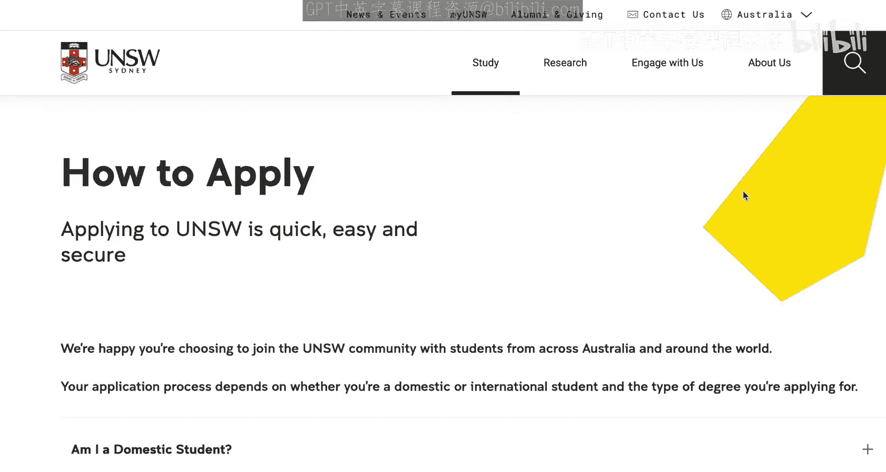

### 可供性

可供性基本上围绕给我的用户多少提示或线索，以表明我的用户界面应该如何被使用。

评估时问自己：每个按钮的作用清楚吗？给出了哪些提示来建议控件应如何使用？如果使用了图标，它们是否直观或通用？

*   **链接样式**：链接通常带有下划线，并且应与文本颜色不同，以便用户知道它们可以点击。惯例是使用蓝色。
*   **按钮反馈**：按钮应该有轮廓，或者至少在悬停时改变颜色或样式，以表明它是可点击的。
*   **图标隐喻**：图标通常匹配现实世界的物体、应用程序或事物的自然顺序。

### 反馈

良好的反馈有助于用户完成任务。

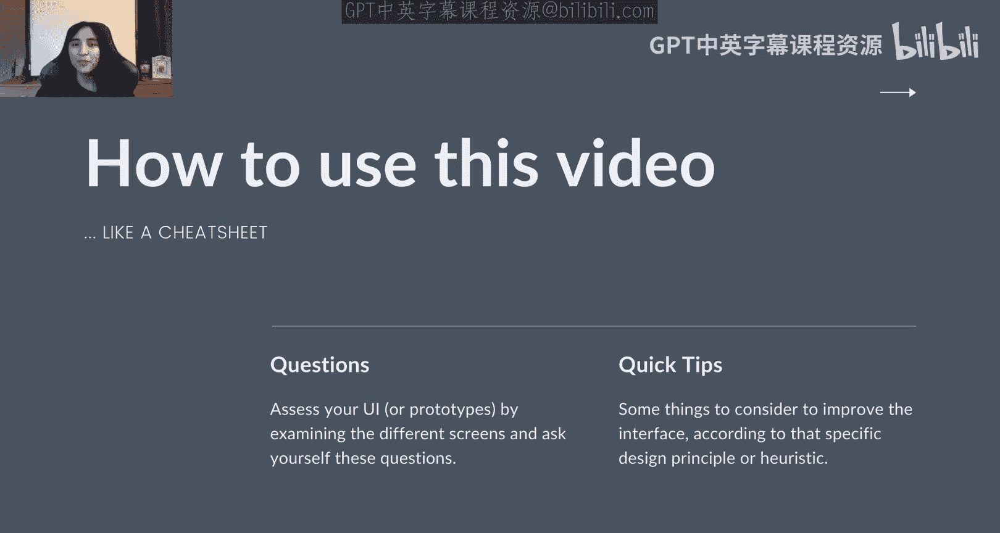

问自己：一旦我的用户完成了一个操作，他们如何知道系统已经确认了它？

*   **操作确认**：当用户执行操作时，例如删除帖子或发送电子邮件，给他们一些反馈：弹窗、成功或失败消息。
*   **按钮状态**：对于按钮或链接，在按下后改变其颜色。Instagram的点赞按钮就是一个例子。
*   **后台操作提示**：如果系统在后台执行某项操作时间较长（通常大于1.5秒），向用户显示加载消息或旋转图标。形式不一定要完全一样，只要能向用户表明后台正在发生某事即可。

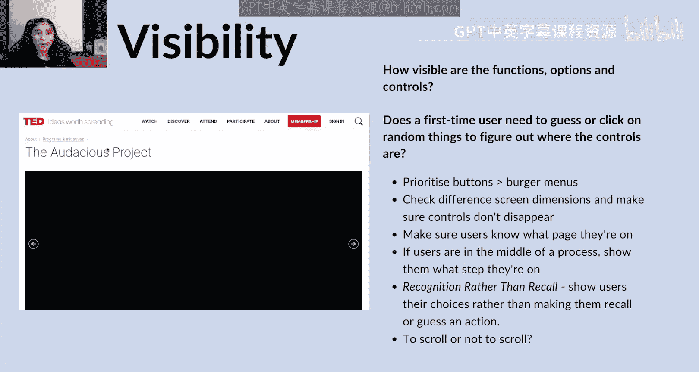

### 一致性

一致性很重要，这样你的网站才能感觉像一个连贯的产品。

问自己：不同的屏幕看起来一样吗？按钮、控件和卡片也是如此吗？你的色彩方案在整个应用程序中是否一致？

*   **反面教材**：YouTube的探索页面是糟糕一致性的例子。在“学习”页面上，横幅看起来是这样；在“新闻”页面上，它是静态横幅；而在“时尚”页面上，不知为何它处于深色模式。
*   **字体建议**：最好在整个应用程序中坚持使用一种字体，然后使用不同的字重或样式。如果需要，也可以使用两种字体，但只是一个建议。
*   **按钮变体**：对于按钮，通常建议坚持两种不同的变体，例如主要和次要按钮，如Instagram所示。
*   **避免突兀变化**：不要实施突兀的变化。

### 约束

实施约束有助于防止用户犯错。

可以问的问题是：我是否通过限制控件来限制用户可能犯的错误？用户是否能够访问他们不应该有权限的控件？

*   **输入验证**：如果用户尚未输入任何内容，则禁用“继续注册”按钮。
*   **权限控制**：如果用户未登录，不要显示只有注册用户才能访问的功能。
*   **减少错误空间**：尽量减少出错的空间。

### 有效性与效用

这主要围绕用户是否拥有实现目标所需的工具。

问自己：我的用户能完成任务吗？他们能实现目标吗？确保用户可以访问他们需要的所有控件。

*   **工具示例**：Adobe Photoshop的工具栏和Canva都提供了良好的效用示例，它们提供了用户进行编辑或创建文档可能需要的所有控件。
*   **理解用户目标**：确保你的应用程序具有良好的有效性的一个好方法是理解每个检查点的用户目标，并确保该目标可以实现。
*   **正面案例**：我认为“When2meet”平台在有效性和效用方面做得很好。它们有日历、时间，为用户提供了创建投票或活动所需的所有工具。
*   **导航栏可见性**：导航栏应存在于所有页面上并可见。有一些例外情况，例如用户正在完成测验或测试，他们不应该能够退出，但这些情况非常罕见。

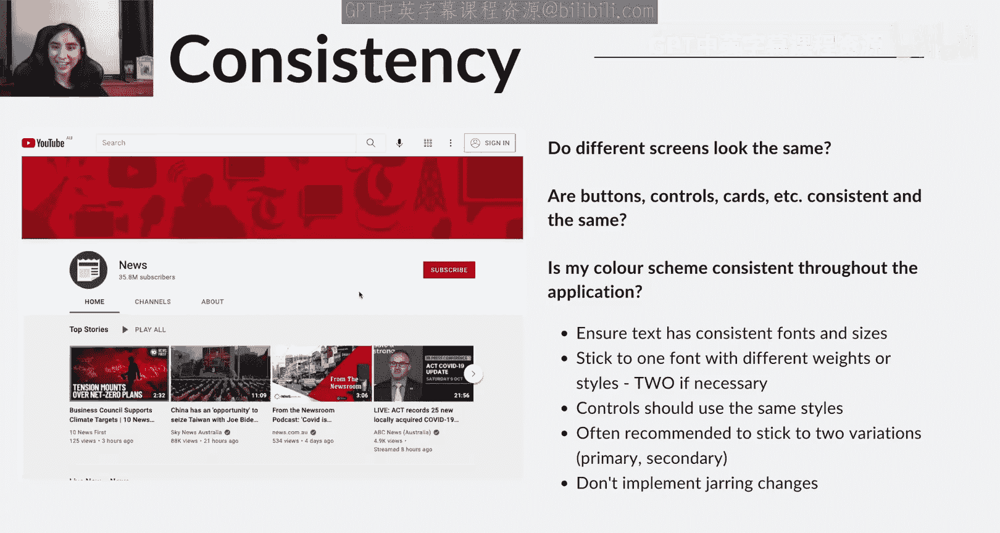

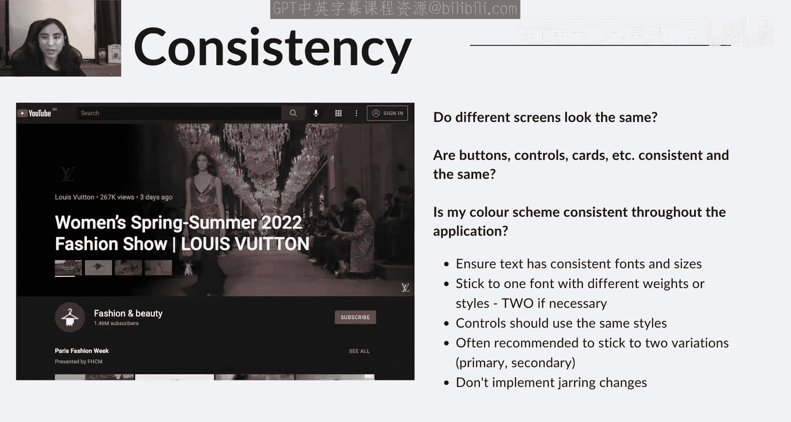

### 效率

效率与有效性不同，因为它围绕用户完成任务的速度。

可以问的问题是：我的用户能否以最少的步骤执行任务？我的用户能否保持高水平的生产力？

*   **减少步骤**：尽可能限制步骤数量。你不想让你的应用使用起来很繁琐。完全删除任何不必要的步骤。
*   **进度指示**：如果必须需要多个步骤，至少通过进度条或显示用户当前步骤的文本来向用户展示他们的进度。
*   **返回顶部按钮**：实现效率的一个小方法是通过一个让用户返回顶部的按钮，特别是对于需要大量滚动的应用程序。Reddit在这方面做得很好。
*   **简化原则**：基本上，对于效率，规则就是尽可能简化事情。

### 安全性

与约束类似，安全性对于防止错误非常重要。

问自己：我的用户是否受到保护，不会犯错？一旦发生错误，我是否帮助他们恢复？我是否帮助我的用户感觉他们在掌控之中，或者可以安全地探索我的界面？

*   **撤销操作**：如果用户意外做了某事，确保他们能够撤销它。
*   **危险操作警告**：在不可能撤销的情况下，则在系统完成该操作之前提供警告。例如，在文本编辑器中，如果我在没有保存工作的情况下关闭应用程序，它会显示一个关于保存文档的警告。对于潜在危险的操作，如删除、发布等，一定要这样做。
*   **按钮间距**：另一个重要的技巧是不要将按钮放得太近，尤其是当它们功能相反时。在这里，你可以看到删除按钮离保存按钮非常远，因为如果它们靠得太近，用户很容易在想要点击另一个时意外点击这一个。
*   **错误处理**：当用户确实犯错时，做两件事：第一，用通俗的语言解释错误；第二，建议解决方案。在Adobe Photoshop的错误提示中，顶部的错误解释得不好，它使用了很多技术术语，应尽量避免，并且没有建议解决方案。然而，底部的错误用通俗的语言解释了错误并提出了解决方案，这是一种更好的用户体验。

### 可学习性

可学习性很重要，因为你希望你的用户，尤其是首次使用的用户，能够理解如何使用你的应用程序。

可以问的问题是：我的应用程序直观吗？我是否提供了说明、教程或提示，特别是对首次使用的用户？

*   **输入占位符**：我建议在输入框中使用占位符来演示用户应该输入什么。正如你在Canva中看到的，它显示了姓名、电子邮件和密码的示例。这使得界面更容易学习和掌握。
*   **复杂功能帮助**：对于复杂的功能，我建议提供帮助页面或给用户一个教程。

### 通用标准与惯例

这与可学习性密切相关，因为应用程序越遵守惯例，人们就越容易上手，因为它更熟悉。

问：我的界面对用户来说是否有些熟悉？你是否遵循惯例？

*   **用户档案位置**：一些惯例是用户个人资料控件通常位于右上角，正如你在亚马逊上看到的那样。
*   **Logo链接首页**：点击Logo通常会跳转到首页。
*   **图标隐喻**：符号应匹配其现实世界的物体或应用程序。以下是一些常见的：放大镜与搜索栏一起使用；购物车或篮子通常意味着购买；心形或点赞符号；软盘意味着保存。还有更多，但时间有限。如果你好奇，一定要搜索一下。

### 兼顾所有用户

这与是否兼顾新用户和回头客有关。

可以问：我给新用户足够的支持或指导了吗？我是否拖慢了专家用户的速度？专家不再需要提示、教程、警告等，所以想办法关闭这些功能。

*   **“不再显示”选项**：通常是一个“不再显示”复选框。
*   **高级选项**：决定哪些功能不是绝对必要的，可以移到“高级选项”中。这可以防止你的应用程序因过多的控件和功能而让新用户不知所措。
*   **平衡点**：通常需要在可学习性和效率之间取得平衡：新用户学习如何使用你的应用程序，以及专家用户或回头客能够保持高水平的生产力。
*   **无障碍考量**：我想快速补充一下关于无障碍性的考量。请考虑替代文本、易读选项、字幕和层级结构，以方便屏幕阅读器的使用。

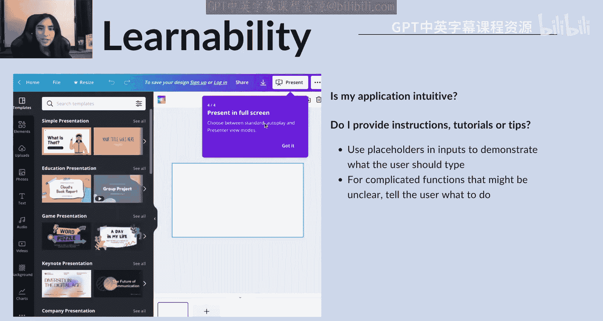

### 美学与简约主义

我们之前看到，简约的应用程序通常更容易导航。

要评估你自己的用户界面，问自己：我是否只在页面上显示必要的信息或控件？我是否有不必要的杂乱？

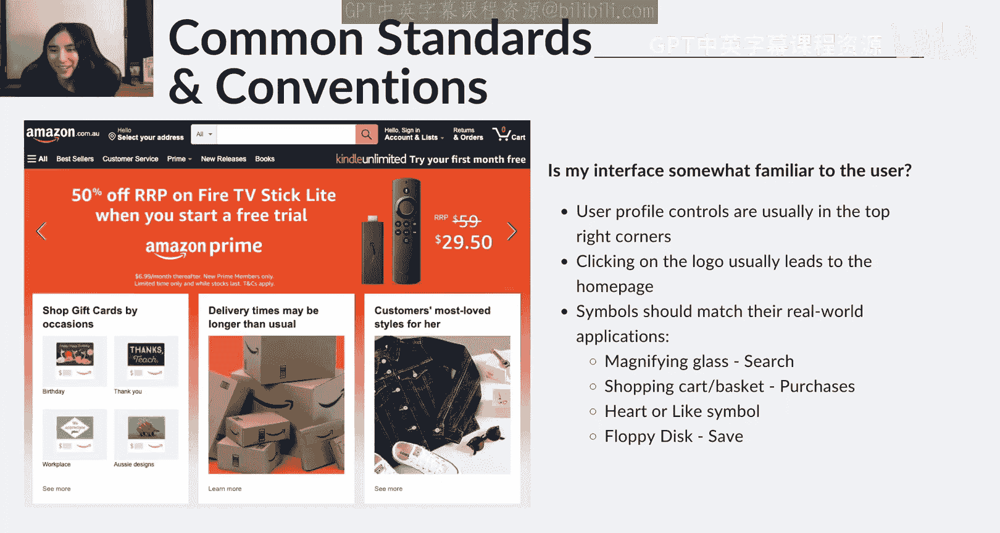

*   **信息相关性**：养成习惯问自己：这个信息现在相关吗？如果不相关，也许你可以把它移到更有用的页面。例如，“更改用户名”可以移到“设置”中。用户不需要在主页上看到“更改用户名”。
*   **平衡艺术**：通常需要在简约主义和良好的可见性之间取得平衡。因此，对于每种情况，评估你认为哪一个更重要。
*   **视觉设计原则**：最后，需要考虑的是对称、平衡、对比、比例和统一。这些是视觉设计原则，你可以进一步研究，它们有助于提高应用程序的美观性和整体性。

---

## 第三部分：进阶UI设计概念（可选）🚀

本节课程是可选的，如果你时间紧张，可以跳过。基本上，这些只是一些不错的补充，可以提升你的UI水平，增强设计感。它们不是超级重要，也非常简短，只是一个简单的介绍。如果你感兴趣，一定要进一步研究这些内容。

### 深色模式

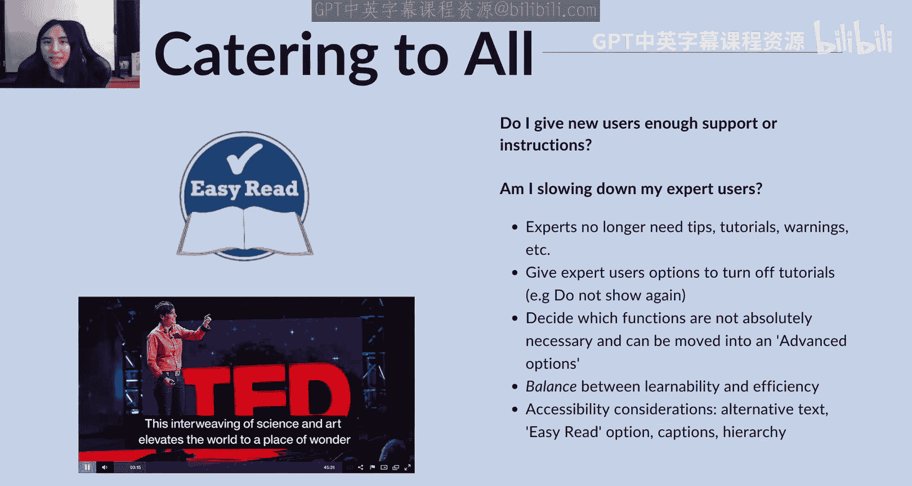

深色模式是增强用户体验的一个很好的补充。它现在绝对是一种趋势。

*   **学习价值**：如果你正在考虑进入前端开发领域，学习如何实现它是有好处的。
*   **设计考量**：我认为它非常不言自明，所以不会深入细节，但绝对是值得思考的事情。

### 微交互

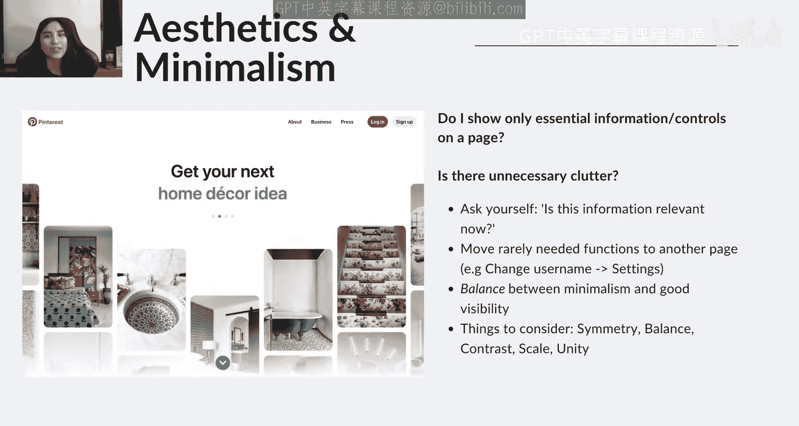

我喜欢微交互，我写过一篇相关的论文。

*   **定义**：基本上，之前我们讨论了改进UI的更大方法。另一方面，微交互是增强用户体验的微小细节。
*   **表现形式**：它们可能以小小的动画形式出现，我在这里添加了一些例子。
*   **研究建议**：如果你对设计小细节感兴趣，我绝对建议你研究一下这个。

### 为情感而设计

为情感而设计也相当不言自明。

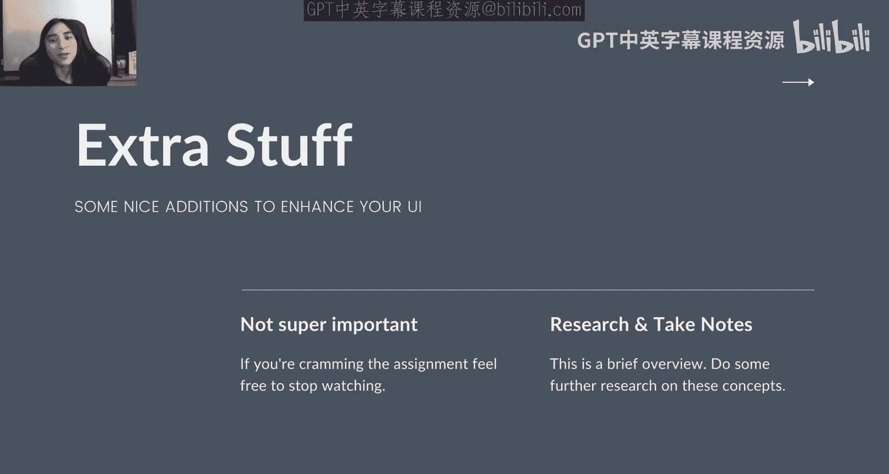

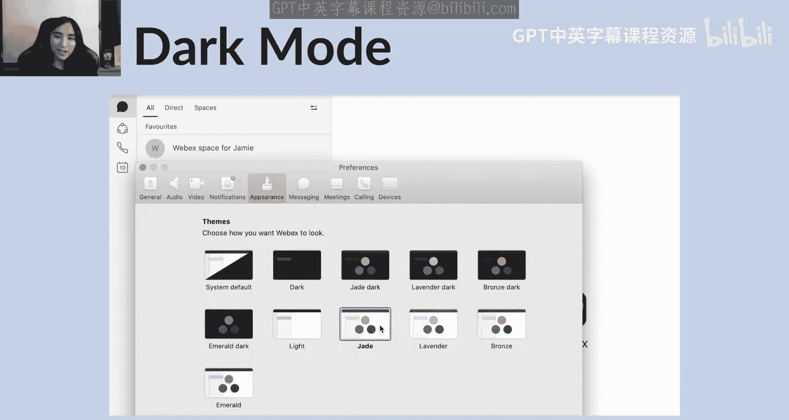

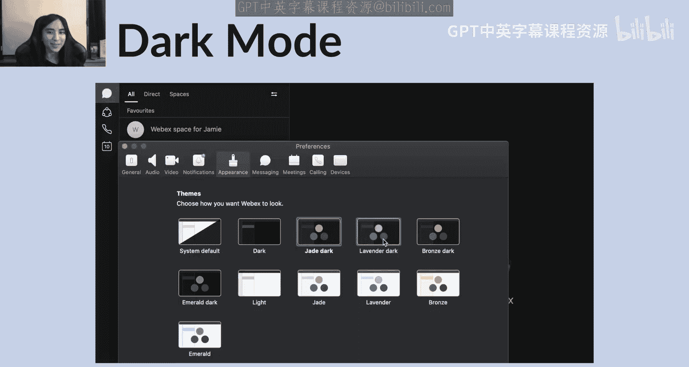

*   **建议方法**：我建议搜索“理想的用户体验目标”，并在设计时牢记这些目标，这绝对会增强你的UI。
*   **缓解紧张情绪**：为情感而设计的一种方法是缓解紧张情绪。这里有两个例子：谷歌的恐龙游戏和一个“Woolwars”的例子，其中L6出现了问题。你可以使用幽默和游戏化来缓解紧张情绪，特别是当用户遇到错误时。这就是为情感而设计的一个例子。

### 认知负荷

这涉及到用户的大脑在浏览和查看网站时需要处理多少信息。

*   **反面案例**：之前我们看了耶鲁大学艺术学院的网站，它需要很高的认知负荷，因为我们的大脑试图处理这个页面上到底发生了什么。
*   **设计目标**：这是你不想做的事情，这就是为什么简约主义是正确的方式，这样你的用户就可以节省他们的认知资源来完成他们的任务。

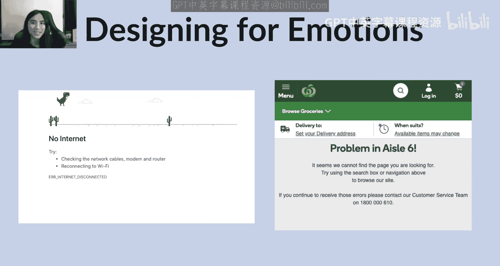

---

## 总结 📝

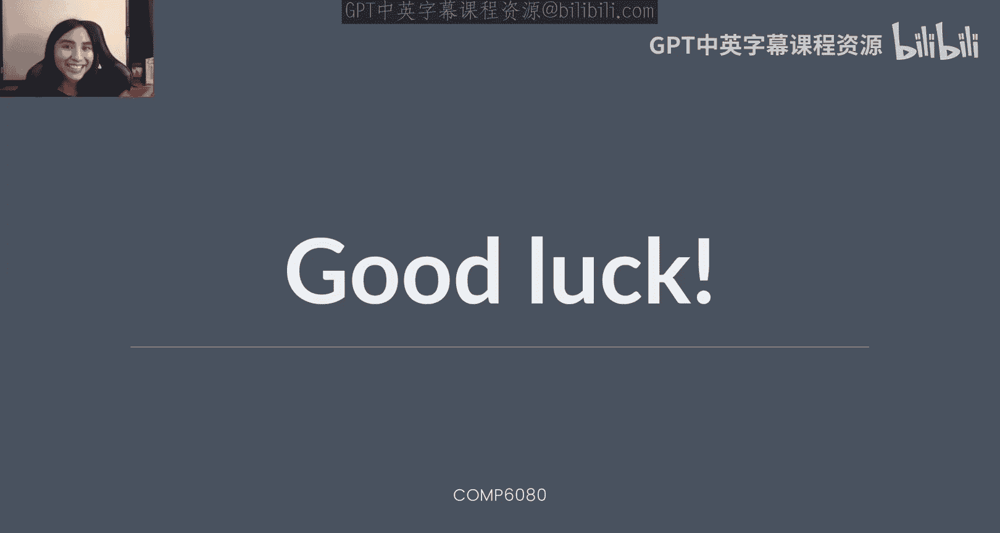

本节课中我们一起学习了用户界面设计的基础。我们首先通过分析LinkedIn、Canva、Quora、耶鲁大学艺术学院和UNSW网站等案例，从用户视角理解了优秀和糟糕UI设计的特点。接着，我们系统地学习了如何从可见性、可供性、反馈、一致性、约束、有效性、效率、安全性、可学习性、通用标准、兼顾所有用户以及美学等维度评估和改进自己的UI设计。最后，我们简要了解了一些可选的进阶概念，如深色模式、微交互、为情感而设计和认知负荷。希望这些知识能帮助你在课程作业和未来的前端开发中设计出更优秀的用户界面。