# UNSW《前端编程｜ Web Front-end Programming COMP6080 23T1》中英字幕（deepseek-R1 p45 -46-COMP6080 - A11y 🥕 Understandability.zh_en -BV17RXGYuEaM_p45-

Hi everyone， welcome to part three of the Accessibility series， we're more than halfway through。

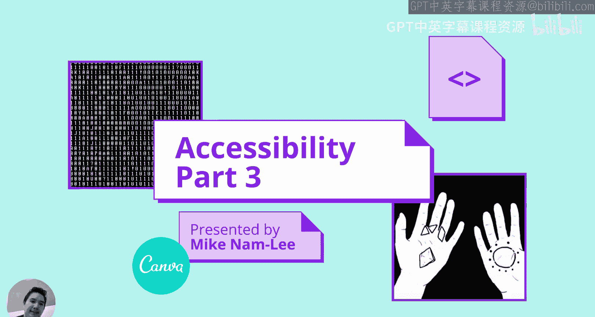

So this lecture is going to cover understandability。

So the distinction between understandability and operaerability is little murky。

 so let me try to add some clarity there。Oerability is making it technically possible to do everything。

 no matter the input device or method or however like whatever device you use。Understandability。

 however， is about making all content understandable。

So information and the operation of the user interface must be understandable。I。e。

 the content or operation cannot be beyond their understanding。

Some content on the WCAG site has items in different sections。

 I've done a bit of reordering for clarity and really just to be able to teach the content in a。😊。

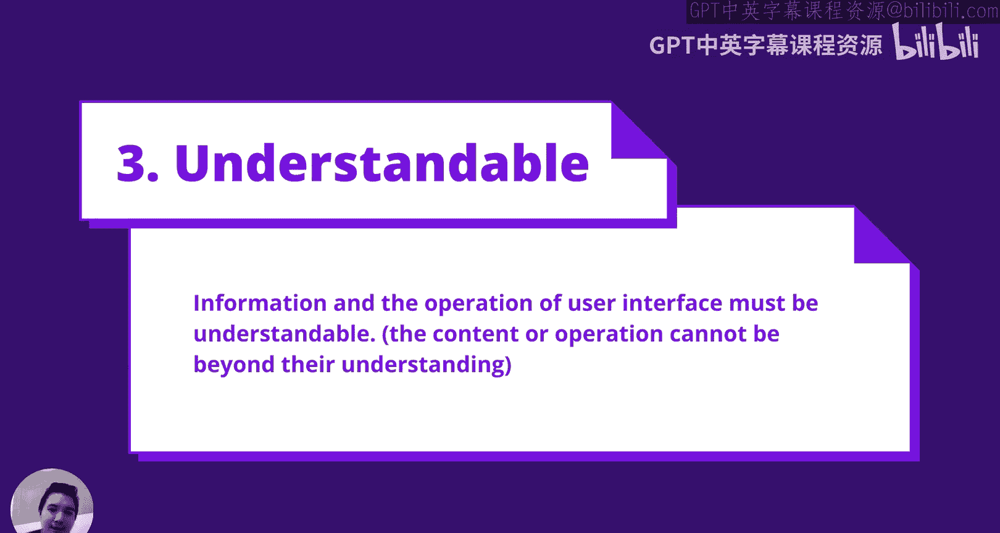

In a fairly flowy way。So one part of understandability is that the language is defined。

It makes a big difference to screen readers and voice assistance。

 So you want to set the language on the H。 and if for whatever reason the language changes in some particular section。

 you can set the same language tag on the element within It's just really important that the top level element。

 the HTML tag has a language equal equals whatever it is。

 That's gonna to be really important for the metadata to be passed correctly。

 It's gonna to be really important for screen for screen readers because they typically mentioned the title。

😊，嗯。Yeah， so it sounds like a small thing。 It's just going to make a big difference and it's going to be something that that。

Might be something that come up comes up in， in your assessment criteria。

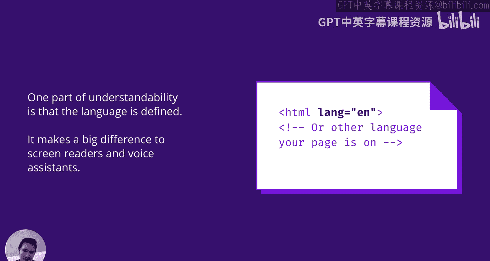

Another part of understandability is that things are predictable。

 This one is also really easy to satisfy。A big theme of this section is just to not do inaccessible things。

 so to keep things predictable， don't cause page changes or form submissions on focus or input。

 also to aid accessibility tools， keep ideas consistent and unless the content changes don't change the underlying HTML。

3。Yeah， really just don't。Mess around with things specifically the stuff on For submissions on focus or import just to clarify if it is a search bar and it's got all the right markup and everything and the form submission is asynchronous and it's an AX requests where it shows that shows either autocomplete stuff below it or it's just like it does the Google style thing where it starts submitting that's fine as long as the markup visit is all there。

😊，Generally， yeah， if the mock is there and things are。Or as users expect。

 you're going to be fine here， it's just really just yeah， don't do anything too crazy。

To aid low bandwidth users， content should also make as much sense as possible without CSS。

So this one just means don't use CSS to convey meaningful information or to reorder content。

You can position you can position elements with CSS， just don't use it to create。With。Positions。

Reordered content。UI think this one is also going to be one where to you have to kind of try to fail this criteria。

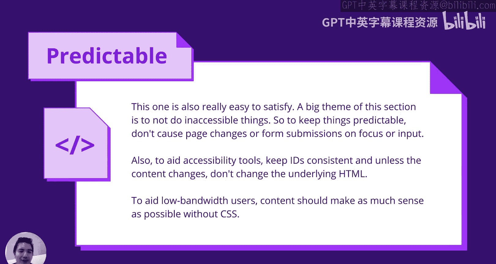

All right， so last lecture we covered how to navigate within a page。

 it's also important to navigate within a site。😊，So we need to know where we are and where links go。

And it's important here to be succinct and to create unique titles for every page。

This also helps for search engines and as site proers and screen readersrs through very similar things。

So here we have a title， we start with the uniqueness of the page。

 so I'm not going to start with accessibility in this thing in this mock site I'm going to start with understandable because that's specifically what's mentioned here but you need to include the site you just don't include at first so title titles should probably be no longer than 60 characters。

😊，And here I have a description， we have a meta tag with a name。

 equals description and the content because that and the description should be a short paragraph。

 one of two sentences should suffice。A good heuristic here is to think about what would look good and and get across the point before truncation on a search item that generally which what shows up on like Google search results or being search results。

 that's generally how how much content。😊，A voice assistant user would want to hear in one go。

Anyth more than that， then it gets particularly vibarrous and particularly hard to use。😊。

So as a follow up to that previous part is the link purpose， so for links。

 a level A requirement is that it should be understandable in the context of the sentence and a AAA requirement is that it's understandable with a link text alone。

So the link text alone， I'm sorry， the level AAA requirement is not going to be something that's assessed in this course。

 but I just wanted to show you because it's fairly easy to fill this criteria。😊，So the first one。

 the link is separate completely from the paragraph tag and there's just nothing there that really conveys the relationship between this thing。

 so this won't pass double this won't pass a level A requirement in the second one。😊。

Its it will pass level A， it doesn't pass AAA is to I accept the terms of service here。

This will work and this is going to be what you have to do in some cases。😊。

Without reordering the words to pass all levels is actually pretty easy I just want to show this here to here is an example where I accept the terms of service and the terms of service is the link I think this is really clear with the link text alone where it goes the link text should say where it goes it doesn't need to say click here to see the terms of service saying the location is going is going。

😊，我。Also， don't forget any interactive item that sends you to a location where the internal external should use a link tag。

 so if it sends you to a different page within the site or it sends you to a different site。

 you should use a link tag， that's going to be really important。😊。

Rather than create a button with an unclicked thing that sends you away， you should use the link tag。

 there are some exceptions， of course， like you're creating a form element。

 the submit will take you off into a different page。Specifically here。

 we're referring to things that should be links， should be links。😊。

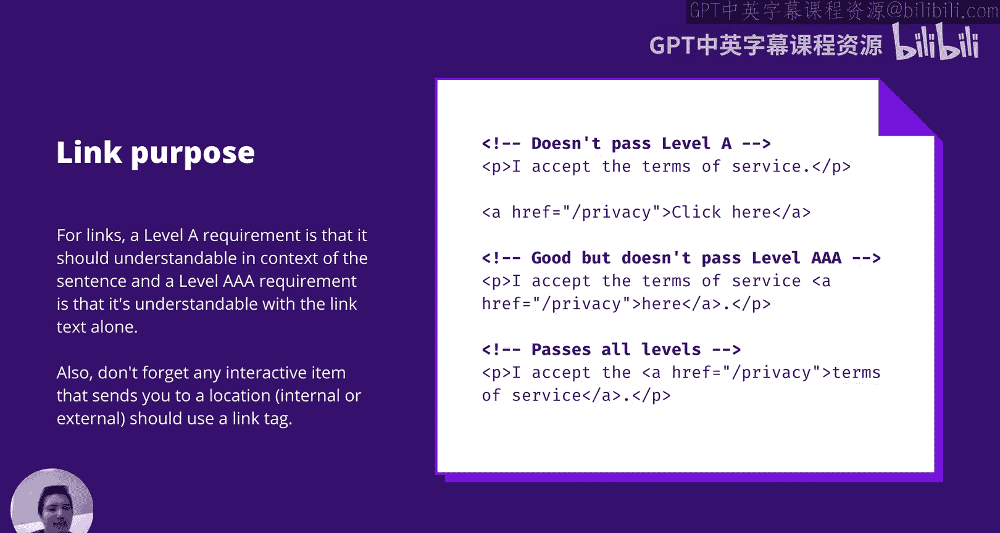

So let's make forms understandable last lecture we went through how to make forms operable。

 this is going to follow up with that we address the mechanics now we need to address the usability of it。

😊。

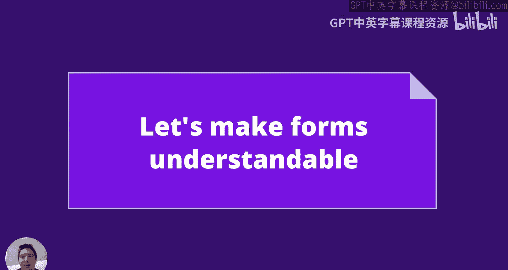

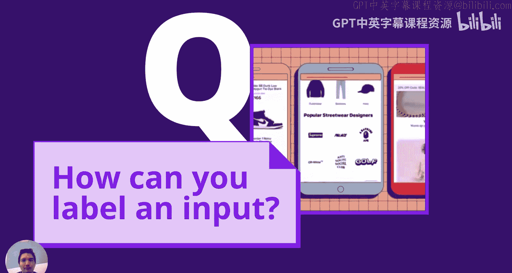

How can you label an input？So this is the most ideal way to label an input， it has the most support。

But there are going to be bunch others that are also quite well supported here here we have an input with an ID and we have a label with a four attribute in react。

 it might be HTML4。Either way， it'll show up in your ID yeah。

 so it's a way to to associate the label with the input they should be adjacent to each other in the like visually and they should be just visually looked like they're related。

This one is also acceptable， it does however， have some issues。

Particularly with custom component inputs， say if the custom input has text。

Say you're implementing our customs select dropdown that text is going to be treated as a label。

 So it's not ideal。 just something to be careful of。 This one has caveats。

 but it is it is acceptable。So placeholders should not be used。In this way。

Placeholder text has pretty bad usability with screen readers。Even if you use a label as well。

 the placeholder should be an example rather than no label。

 because how the screen reader is going to say it is it's going to say an input， comma name。

For the label and then comma name for the placeholder。 So it's not going to give you the best UI。

I sorry the best UX。Yeah， so don't use placeholder as the same name。

 but generally there's no need to use a placeholder anyway。

 it's not something that's going to be hugely that useful。😊。

So sometimes it's useful to do the inverse of the first way。

 so rather than have an input with a label， sorry an input with an ID with a label that points to it。

 instead we have a label with an ID and the input points to it with Aria labeled by。

This is most useful if there are two or more elements that should have the same label as long as they are related。

 connected and adjacent。😊，And an example of this might be you have a bunch of radio button and then then you have other option where the user can write something down here you have two labels。

 sorry two inputs and they should have the same label。😊，If you have an input with an invisible label。

 this is pretty common with search bars， use AA label。

So here is a really good example where you'd want to just use an invisible label。

 this doesn't show up in the markup。U what you can do is you use a label in the same way we did before and then make the label invisible using the way we did with S links。

嗯。But typically it's perfectly fine to use Iria label， it's pretty well supported。

As a supplemental addition， you can also add a description to the input。

This should not replace the label， and it also shouldn't be too long。

This is useful for when there is more context that would be relevant to the user。

 say if the field needs to be in a particular format and the HTML doesn't really have。

Any standardized way to do that？This is also where you should add any custom error alerts on forms。

So if you have an error alert， say there was something weird with the form。

 say the password was invalid or something like that， you'd want to attach an error。

 an error alert on the form and attach it to the password field。

 I'll elaborate a little bit more about how you can create good alerting in an accessible way。

But here is a really good example。😊，Here we have I described by。

Please use your full name as this will be printed on the invitation I've added Rollly alert。

 it doesn't need to be if it's just a description that shows up before you can add Rolllic alert in the same way we I went through Roers last time for search bars。

😊，You can alert to the user。 this would be， yeah， this would be specifically relevant to error messaging。

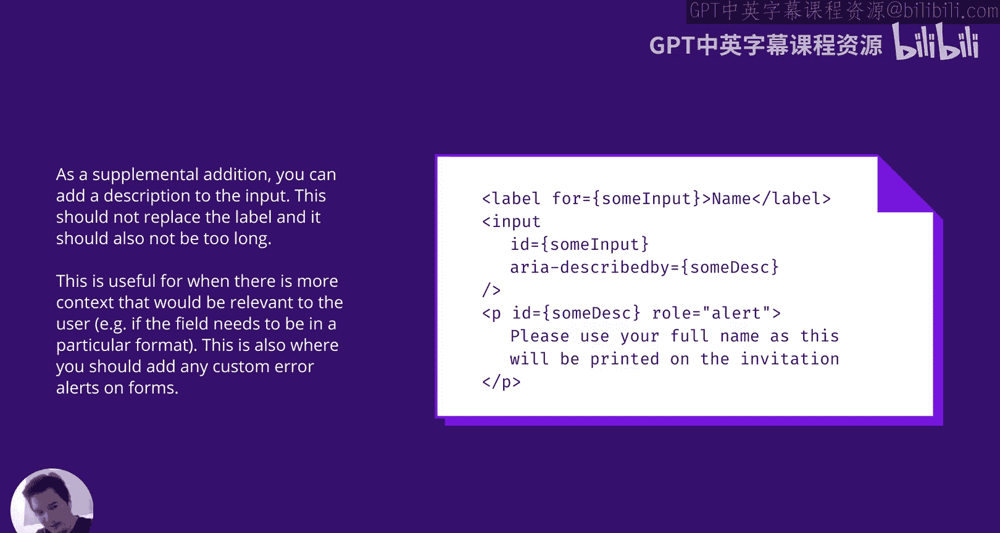

Additional attributes。So you may be familiar with required and type。

These will definitely help with accessibility as the error can be identified immediately rather than ultimate。

😊，嗯。That's going to be really important as well， there's a big emphasis on being able to track and identify errors early。

You should also use Aria invalid to indicate if an input field needs amendment。

This will be specifically useful for HTML error validation for custom error validation。

 as HTML will validate it according to the specified type by default。😊，This should only be true。

 should be true only after U， not by default。And where possible。

 it's better to just fix the format than to。So an  error。

 This is both a UX thing and also just an accessibility thing。 trying to。

 trying to deal with an error on a submit form。Is not a pleasant experience for accessibility no matter how well put together that is。

So here we we'll go through through some examples here you don't need to put I in for empty attributes or negative numbers if you define that through HTML attributes。

 same thing with the minimum length。But。It's really useful for anything custom so here booking is only accepted on weekdays here we have an I description I described by and that links that really well I think this is a really elegant way to throw an error。

 show that it's invalid validad， describe it， I think this is really done really well and you can't really capture anything like this。

😊，With H。But with default HTML attributes。

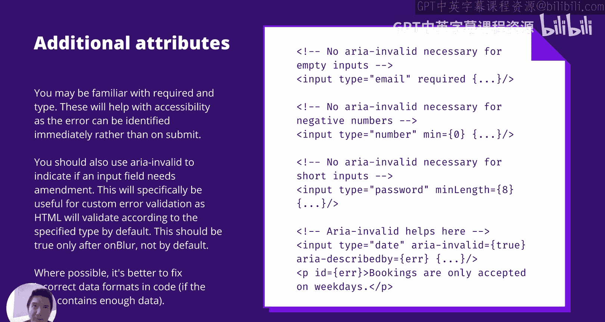

So I've touched a lot about error messaging， I just want to explain a little bit more about the understandability here。

Soir error messages should be succinct and specific。

Saying start date isn't valid isn't as helpfulful as saying start date must be on a Monday。

It should be short as long messages are annoying and fairly hard to follow to screen reader users if the message is really long。

嗯。If you can't see the message or you can't reread it。

 that actually is quite a lot of mental load and cognitive load to follow what's happening。

Technically， they should have a role equals alert to signify its importance。

 and it is common to focus on the first invalid element。

Adding the alert row interrupts the screen reader。To alert the the user of the error。

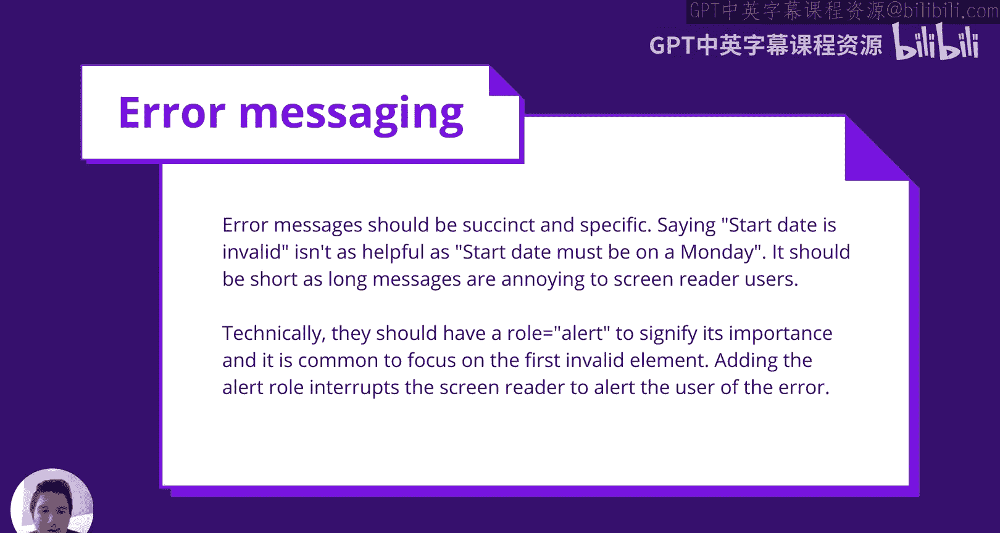

So I mentioned using the alert role for error messaging， there's a few others Id like to introduce。

 so the alert role is really nice for error messaging， but it's also quite an aggressive。

Highly specific use case you would not want to use of everything。

If you're uploading a download in your file， you can use progressgress Power。This is。

This is yeah for uploading or downloading a file。 and it's got to be an important one， not just。

Just downloading JS。Ascept or anything。What it will do is it'll announce like the increments and screen reader users can toggle this so that they only need to know when it stops and when it ends or if it's been stuck for a particular while。

 progress file is going to be really useful here。Another one is the status。

 you can use this for global statuses， say any updates to your shopping cart。😊。

See you when you purchase an item or when you add an item to cart， you can throw a status。

 which is a really， which is a really nice experience I think。😊，Visually， it shows a plus one。

 but you don't need to。Um， but that's going to be hard for people who are using a screen reader or a voice assistant to follow what's going on。

嗯。You can use log for chat messages as they appear。

That one's also really nice as well for that particular use case。😊。

And you this timer use this for countdowns or stopwatch readouts。

 So this is quite similar to the progress bar where screen reader users can change how how often it's being read。

 Yeah， can you can make that work really well。By default， if the text gets updated。

 it'll only announce the change， so it looks at what the sentence used to be and what the sentence is and it'll only say the words extra。

So if you want the whole text to be reannounced， which is probably most useful for timers。

 use Aria atomic equalte。嗯。So here， the overall status。

 Another example always be is if you're writing a mail server or mail client and you need a way to be to send incoming messages。

 So this is。This is a。What called a polite announcement where it won't interrupted what they're doing。

 but after it's finished reading out whatever screen reader message there is。

 then it will say raw status or itll just say a new email from R。

If you need to make an announcement and none of the roles fit， use Are your life。

So I kind of went through this with a little bit I touched on it very a little bit。

 I Live can be added to most elements and it is either polite or assertive。

 though if you're trying to use assertive you probably want the alert role。😊。

You almost always want to use politeity and yeah， the R light can be inferred from the role。😊。

So you want to use I live and announcing roles the roles that I mentioned before very sparingly as they are quite intentionally a disruptive experience。

 but of course there are really good reasons to use this。😊，啊。

You do want to notify users of something if you'll say on a auction online auction site you want to announce。

Pretty clearly， that。an item that they were trying to buy has already been bought or the timer is all mess up。

The one caveat here that is a little weird。😊，It's not a great。

Browser experience is there is a little browser quirk where adding both I Live and an announcing role leads to the same message being announced twice。

So in this case， you would prefer to only use the role instead。

 but it's just a little weird where if it has both， it'll only。It'll just do something weird。

UWhere nows both and it's just not a great experience because they'll try to they'll try to override each other。

 it's just， it's just not a great experience。😊，So here we went are live because politeite one could make the argument that this is a status。

 but I just wanted to show you an example this slide will undergo routine maintenance in 30 minutes please save your data so here you're just trying to show a quick message it's not too long but it just yeah really clarifies what's going on here that's going to be really useful for。

😊，Me messagessages that are quite obvious to visual users because it shows up and it's quite a broad color。

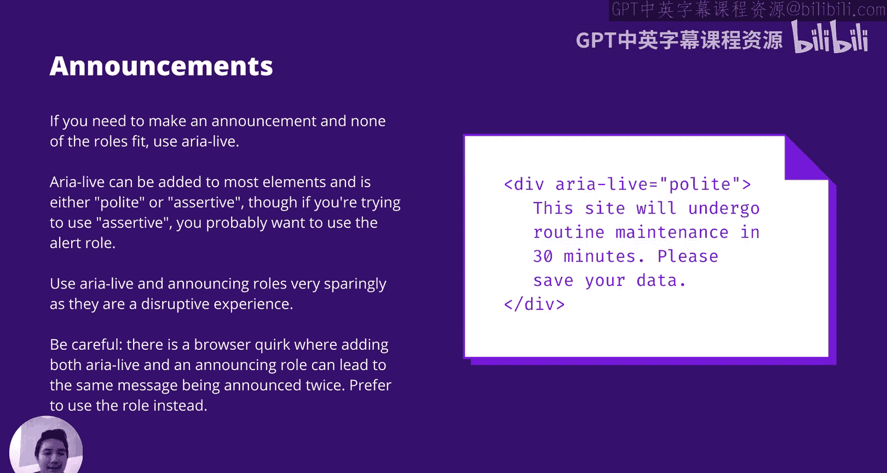

You want to provide the same experience full screen media users。That wraps up understandability。

 we have one small lecture on robustness and just wrapping up accessibility。See you next time。

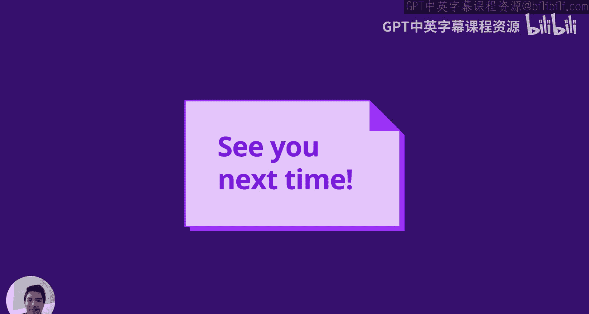