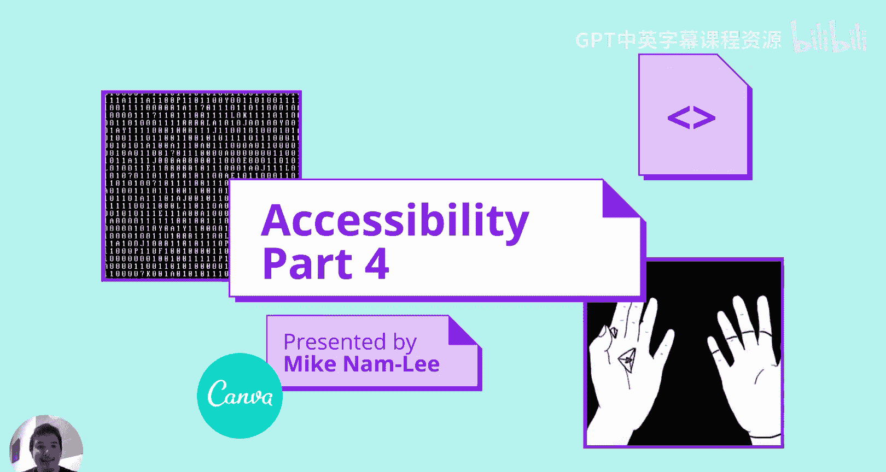
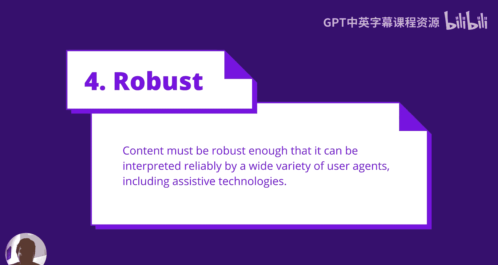
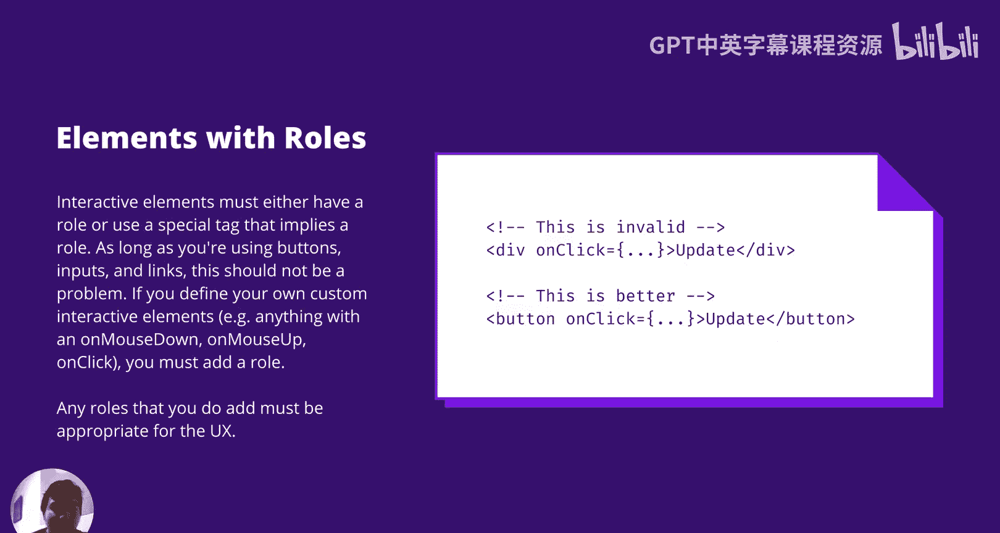
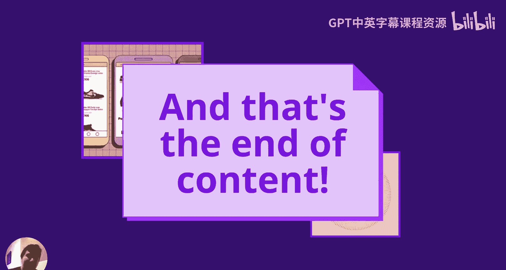
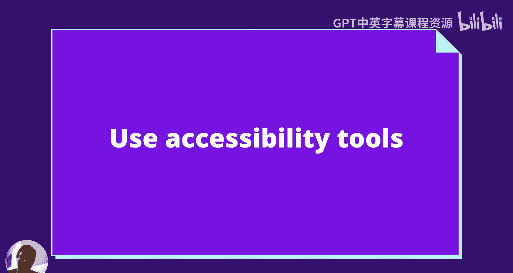
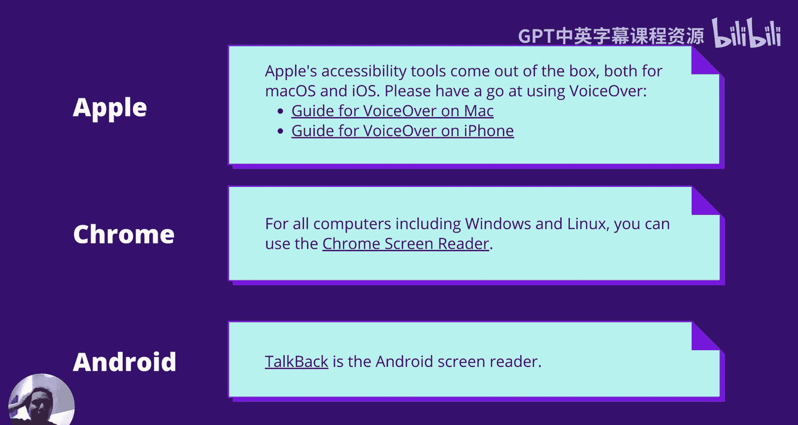
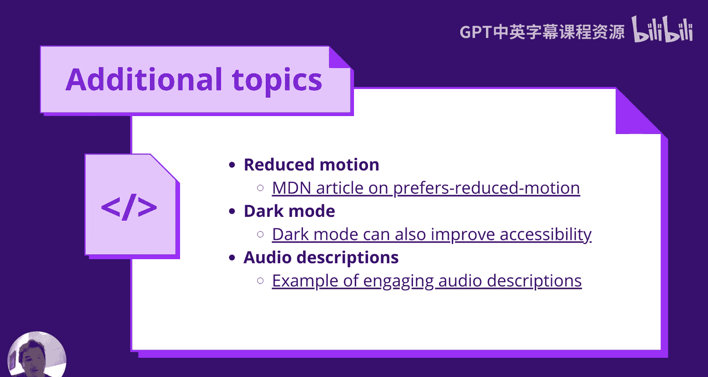
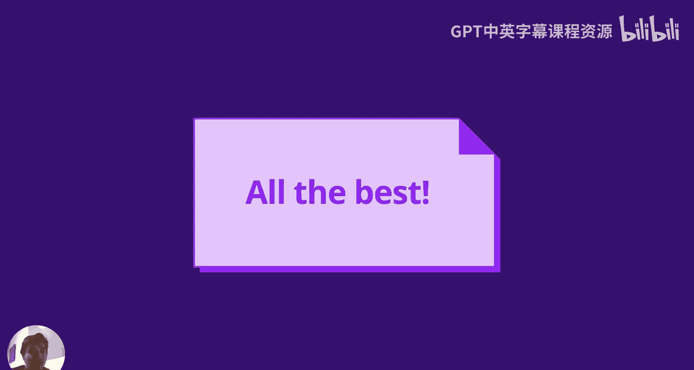

# UNSW《前端编程｜ Web Front-end Programming COMP6080 23T1》中英字幕（deepseek-R1 p46 -47-COMP6080 - A11y 🥕 Robustness.zh_en -BV17RXGYuEaM_p46-

Yeah。Hi class， welcome to Accessibility Part 4， the last lecture is part of the series on accessibility。

We're mostly going to be covering robustness with a little bit of wrap up。

So this one's going to be real quick。So， robustness。

Content must be robust enough that it can be interpreted reliably by a wide variety of user agents。

 including assistive technologies。So this is fairly straightforward。

 It's really just about following this back。 There are going to be too many curve voices here。

 even though say Chrome or safari or Firefox might。😊。

Be liberal with trying to interpret your HTML or CSS or JS。

We just want to be extra careful here because there are some user agents that have to interpret a lot more of the page and it helps it just helps a lot here to have really accurate content。

😊。

So this one to the basic， the HTML must be possible。

A lot of this comes for free as part of modern JS frameworks， so I won't spend too long in this one。

😊，Opening and closing tags and attributes must not be malformed so here you can see there is no end tagag it's just going to throw off the tag stack。

 here in the second half we don't have a trailing slash so your JS framework should probably do that for you free something to be careful level if you're handcrafting something or you're just using it a fairly old a fairly old framework。

😊，There are some checks that won't be called by modern JIS frameworks。

 either just to due to limitations or just that's not what the JIS frameworkra is trying to solve。

So a do type needs to be defined， the reason why JS frameworkraworks usually won't handle this is because JS frameworks added after the fact and this is something that needs to be defined before the fact。

😊，嗯。So， here。嗯。A dog type needs to be defined。And it's really just saying this page is a HTML page。

 It's a kind of a vestige of。Of early internet or earlier web pages。

 this is just something that we need to do。😊，We also want to make sure that we're not defining multiple ideas。

So sorry， not multiple duplicate ideas。 So here this is really easy to miss。

 And I think that's kind of。Something to be careful of here is to not define multiple duplicate Is。

 So here you have you have a component that has an I of component ID and you don't think too much about this。

 This looks right and then you add a function to you add a component to that that has both of the next sub side what you didn't realize is that aspect step on what you may not have realized is。

😊，You're creating a， you're creating a HTML element with the same ID twice。

So you need to add a prefix to guarantee uniqueness， or there are some generators there。

 it's probably a little bit beyond the scope of the course。

But that's just something you want to be careful of so you can check that with the actual rendered HTMLel page you might want to be careful of this with with inputs that you create that you might want to try to genericize it try to lift up the ID to the form component and then handle it there and then try to。

😊，Prefix the form with with some specific。Label like like a sign up form or something like that。

This one is also important referenced IDs in Aria labeled by and HTMLM4 exists so this one is also fairly straightforward it's just I want to like how you can miss it。

😊，So嗯。If your mind J framework is if you're trying to use it in a clever way to unmountute the element when it's not visible。

 a common example would be， say a tool tip that only shows up on hover。😊。

And you want that the label of the tool tip to point to the element。

 there is actually a case where you you either should always have the tool tip mounted。

 but if you don't want that you probably want to use audio label instead and have the text directly on the element。

Yeah， so the ID has to always always exist， you don't know in what scenarios the user is trying to query the label of the element。

😊，And this one's also fairly straightforward。 It would be really nice if JS frameworks have this。

 but they don't really support it that well relevant attributes are added are added to tags so don't add a。

😊，嗯。A valued attribute on a div or just just yeah， try to be careful J's frameworks。

 you can create a lot of abstractions over the HTML element。

 just make sure that the relevant attribute is added to the tag。😊，So elements with roles。

Interactive elements must either have a role or use a special tag that implies a role。

As long as you're using buttons， inputs， and links， this is almost definitely not a problem。

But if you' are defining your own custom interactive element。

Anything with an on mass down or an on mass up or an on clickick， you must add a row。

And any of those that you do add must be appropriate for the UX。

So yeah that's this one is also fairly straightforward if you are using a button an input or a link just don't override the role。

 say with button role equals none or raw equal presentation unless of course it is a presentational button。

😊，嗯。Yes， so generally stay away from divs， as I said in an earlier section that's just going to give you a little more accessibility with the great keyboard handling is a play。

 but in other parties also defining the role is also really important there。😊。

And that's the end of the content。😊，That's the end of robustness。

 robustness is fairly straightforward， especially after all we've gone through in the previous three sections。

😊，But why I did want to spend a little bit more time on additional content。

 this isn't going to be assessed， but I think it's really important。

 especially as you go into the workforce。😊。

The first one would be to use accessibility tools。I think this makes a big difference to understand how to create good labels。

 how to avoid duplication that's not something I wanted to address in this course。

 but that's something that is relevant where you want to make sure your label doesn't conflict with your placeholder and it doesn't create it doesn't say it's a button or anything。

😊，So using accessibility tools will show that better。

So with Apple， the accessibility tools come much out of the box， both for Mac OS and iOS。

 that's really nice， you don't need to pay anything extra。😊。

Oh none of these you have to pay anything extra， but I think there are a few tools that I didn't include on this list that are also pretty popular。

 I just didn't want to include them because I didn't want to include things that require money。😊。

So with Apple， it's called Voice Out and。😊，There's a bit of a tiger here。

 you should say voiceiceha instead of guard over。But yeah， on Mac and on iPhone。

 you can click the link and get the get the guide。😊，That it's probably the most intuitive one。

I think the way that it passes things is done pretty well。

If you have Chrome and this can be for all computers including Windows Linux and I guess Apple。

 you can use the Chrome screen reader， it's not as good， I believe it is supported。

 it is managed by Google， but I believe its just not something that's super applied across the industry。

 it also doesn't really give you a comparison of desktop applications or mobile applications。😊。

And Chrome has talked back。 I haven't I got at a disclaimer that I haven't used。

 I haven't used this one。 I've used other the other ones。

 and they're pretty solid from what I've seen and talkback is Android1 and。Yes， Sir。

These are the screen readers that I think are really useful。

 of course if screen readers aren't the only tool， there are some other tools around checking color contrast。

 which I mentioned earlier。😊，There are also Chrome plugins that turn on。Um。

 your screen to match in particular to emulate what it would be like if you hadum colorblindness in a particular variation。

😊，But I said yeah I think it's really important to use the tools that you're building for this should use be treated in the same boxes as user testing。

😊。

So additional topics。We have reduced motion， so I kind of mentioned it before in the section on seizures and epilepsy。

 we don't want to have things moving too much so there's this CSS property called preferfers reduced motion or not CSS property more like a CSS selector but it's not the full classes it's quite similar to how you can query for the screen width。

😊，Your can query if the user has set prefers reduced motion and what you show just to be clear。

 this is reduced motion， not reduced animation， so you can still animate things and fade things and fading is really nice for accessibility purposes。

 especially when you're changing the college quite drastically。😊。

So this is specifically about motion and moving things around here we want to be。😊。

We want to try to respect the user agents requests there。

I'll mention D mode because it's quite a modern trend， but dark mode can also improve accessibility。

It can also degrade accessibility， I think when you're creating designs in Dot mode that you're still being wary of color contrast and would I think people prefer adding an animation if you are changing between the two without a refresh。

😊，嗯。But yeah， really just be mindful of the color talent that you're creating。

 the colors that are not black and white are going to be the most hardest， like how to deal with red。

 how to deal with link text all these things I think youre just got to be careful about what you want to do there。

😊，But it can really improve accessibility people will often use dark mode in the dark and I think it really helps the eye strain and yeah it just really makes a big difference there but yeah much like with a lot of accessibility。

 this is just going to be generally useful yeah。😊，So audio descriptions are slightly different to subtitles but they're in the same category and captions as well。

 so captions will be like the label of an image， it'll be in context。

Subtitles will be the part of text below it， subtitles， then generally not as useful。

If you' if you're。If you're deaf。It's a little bit less useful。

 but it's still really useful it makes a big difference， especially when the subtitle is a different。

😊，Pce of the， the video that you can follow along。So audio descriptions。

 they're specifically for videos and much like you can have different tracks audio you can have different audio tracks。

 one for English， one for Chinese， one for French， one for German， there's often other tracks。😊。

For audio descriptions and they'll often yeah， pay for each language。So it doesn't change the video。

 but what it does is it changes the audio and you'll try to keep the dialogue there as much as possible。

 but in between that you'll describe what's happening。So you'll try to describe。

What the characters are seeing， what's happening on screen。

Yeah so this is something that that's that people are trying to make make an impact here Disney is probably the most standout one here。

 you'll probably see this for a lot of Pix movies or Disney movies or like a lot of the kids movies these they have have this also a lot of the Marvel movies have this。

😊，Yeah， its it really adds engagement， go ahead and click the example of engaging audio descriptions。

 I think it really makes a it makes quite a big difference。😊。

It's actually more engaging than it might sound， especially with the tone of voice of the audio description。

😊，I can't play it here on this video you to couple right reasons， but go ahead and click the link。

 it'll be on the slide or if you're watching it on Canva， you should go to click the link。😊。

Cool， so that wraps up the basics of accessibility of course there's always more to learn we only just scratched the surface。

 but this is going to give you a good framework for understanding how to think about accessibility and how to。

😊，Yeah， how to consider that as a developer。

