# 前端编程：1.3：Git - 团队协作 🧑‍🤝‍🧑

在本节课中，我们将要学习 Git 在团队环境中的核心用法。我们将重点介绍分支、合并以及合并请求的概念，这些都是多人协作开发中至关重要的工具。通过理解这些概念，你将能够与团队成员高效地协同工作，管理代码的不同版本。

上一节我们介绍了 Git 的基本概念，如提交、推送和拉取。本节中我们来看看如何在团队中实际运用这些知识。

## Git 的树状结构 🌳

在上一讲中，我们提到 Git 本质上是一系列提交的历史记录链。然而，在实际的日常使用中，Git 的结构更像一棵树，而不仅仅是一条直线。虽然提交链是线性的，但它可以像真正的树一样分叉。

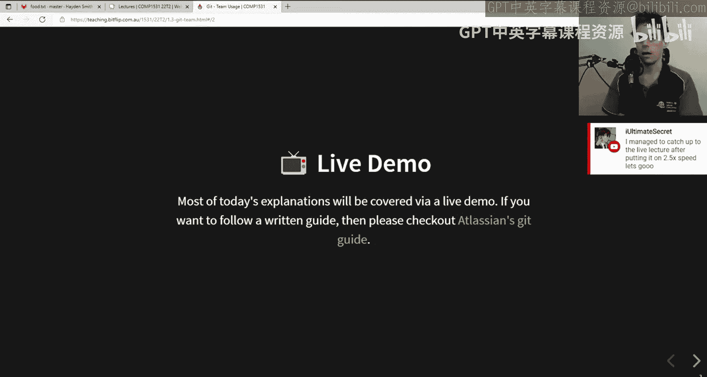

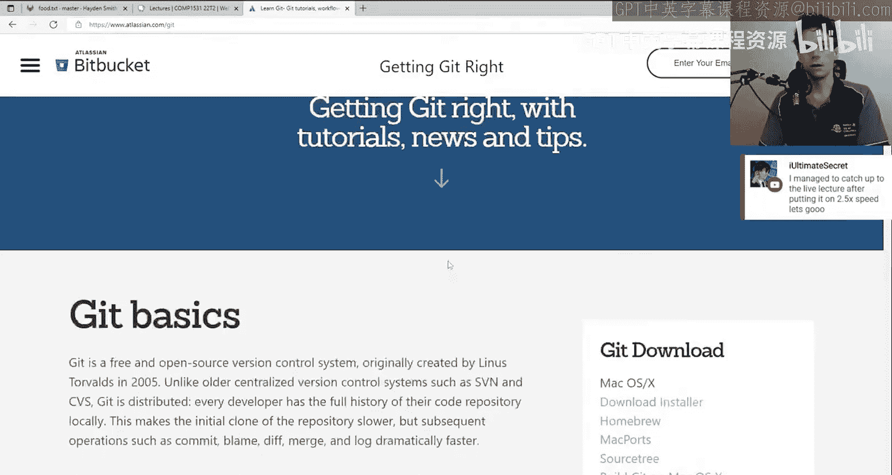

每个提交总是有一个父提交，就像树一样，一个分支可能衍生出几个不同的子分支，但它始终有一个起源。这一点非常重要。同时，每个提交可以有多个子提交。每个提交都只来自另一个提交，但每个提交可能会朝着几个不同的提交方向前进。

每次我们朝着多个提交方向前进，我们称之为**分支**。而每次我们试图将这些分支重新合并到一起，我们称之为**合并**。在许多方面，我们使用 Git 的本质实际上是尽量避免这种分支结构。世界上最完美的 Git 仓库实际上看起来就像我们在第一讲中看到的那条链，它是一个线性的历史。

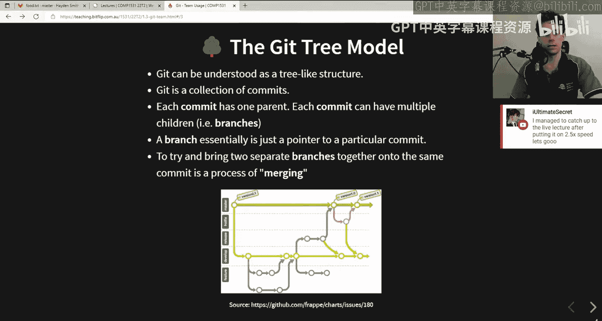

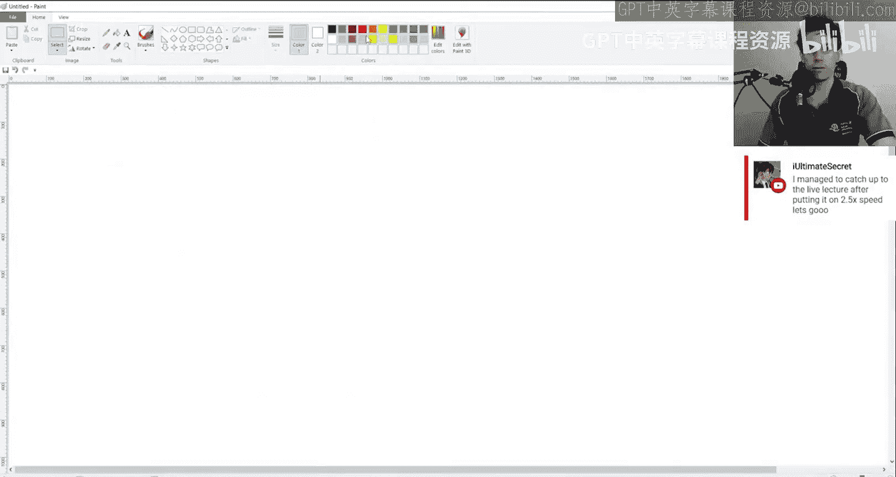

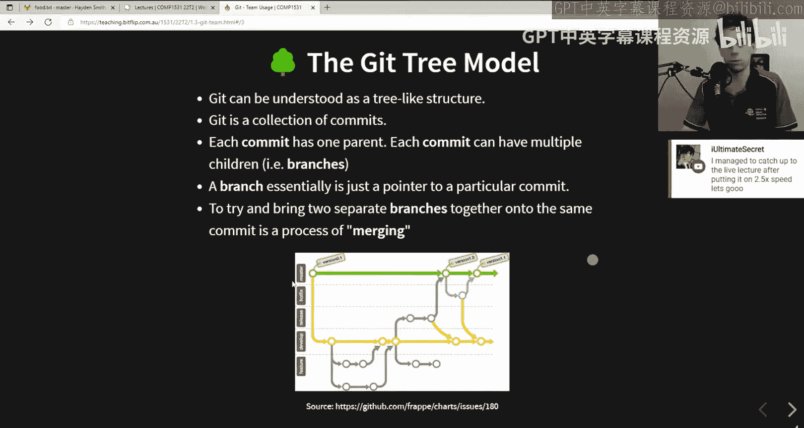

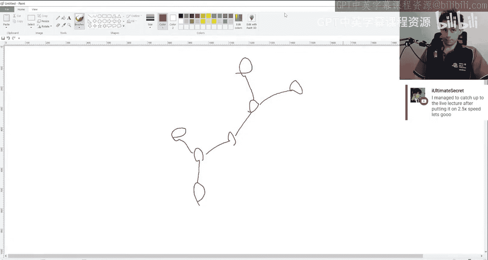

## 理解分支 🌿

我们尚未详细讨论 Git 的分支概念。如果我们回顾上一讲中查看的仓库，你会注意到当我输入 `git status` 时，这里有一个名为 `master` 的分支。`master` 本质上是仓库中的主分支，是主要的分支，你可以把它看作是负责的、主要的分支。

在 GitLab 上，你会看到如果我去到分支页面，目前只有一个分支，即 `master`，我的文件都在上面。为了简化，让我们想象一下，到目前为止我们所有的提交都是线性的，我的 `master` 分支看起来就是这样。

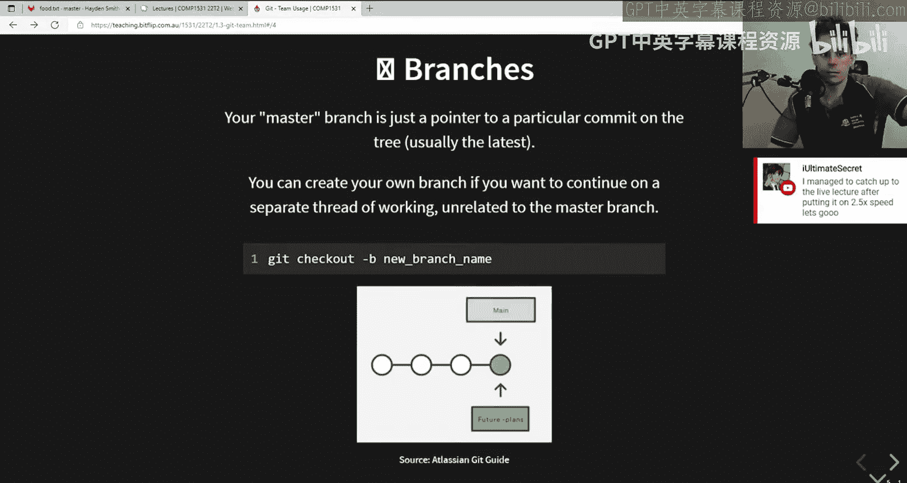

现在，我可以使用这个命令：`git checkout -b`。`checkout` 的意思是检出另一个分支，去查看一个不同的版本。而 `-b` 参数意味着创建一个新分支。Git 的语法有点奇怪，但这意味着创建一个新分支。

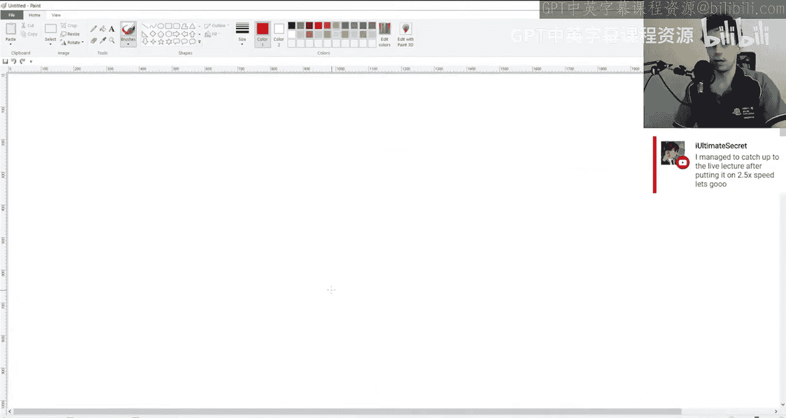

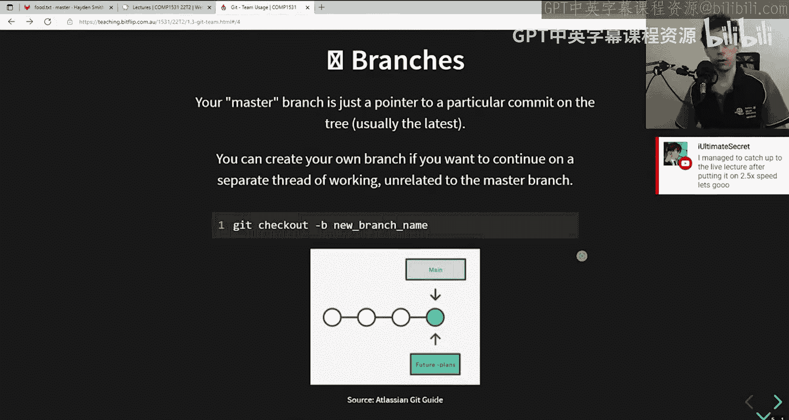

如果你不知道我所说的分支是什么意思，并且感到有些困惑，可以把它们想象成平行宇宙。就像电影《奇异博士2》里的多重宇宙一样，这些平行宇宙同时运行。所以，我在这里有我的 `master` 分支，当我输入这个命令并创建一个名为 `brandon` 的新分支时，我实际上是在移动到另一个名为 `brandon` 的分支。

你会注意到，如果我输入 `git status`，文本中现在显示在 `brandon` 分支上。然而，在 GitLab 上，你注意到我仍然只有一个分支。这是因为和 Git 的其他操作一样，我还没有实际推送任何东西到 GitLab。所以，我处在这个新分支上。你会看到，如果我执行 `git push`，我实际上会收到一个奇怪的错误。

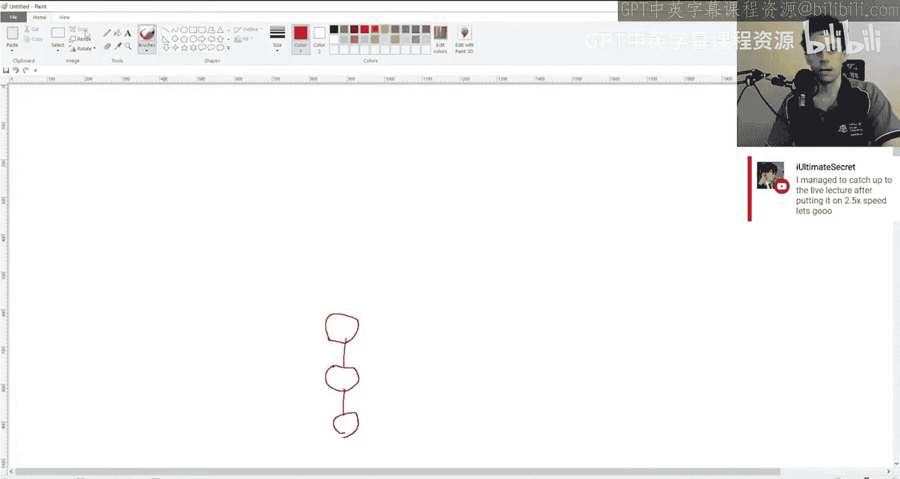

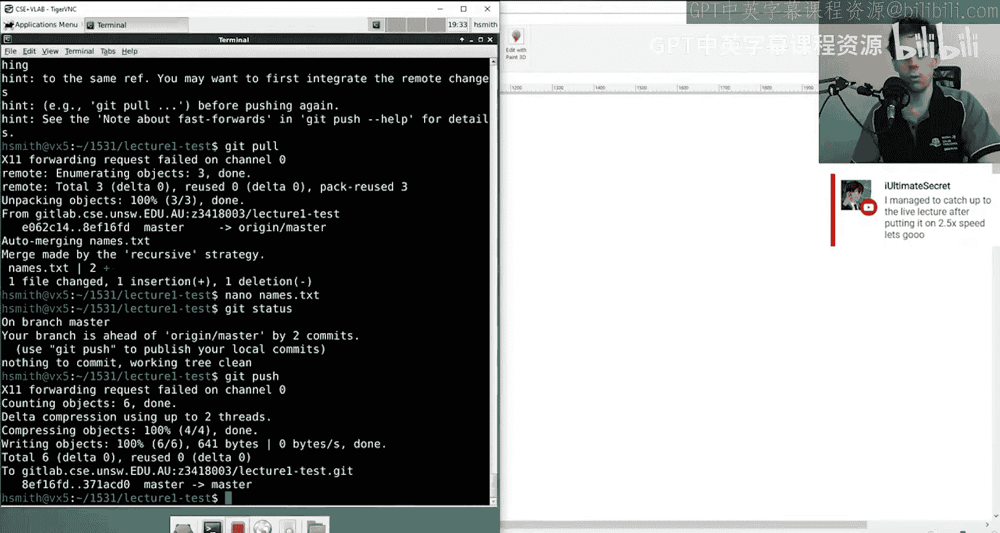

这个错误本质上是在说：嘿，我明白你想推送，但你告诉我你在一个我从未见过的分支上。它基本上是说 GitLab 不知道这个分支存在。所以，你实际上需要复制并粘贴这个命令一次。这是你第一次推送时必须做的，之后你就可以继续推送了。因为这是一个新分支，第一次推送必须使用那个命令。

现在，你注意到当我在 GitLab 上查看时，我现在有两个分支，就像代码的两个平行宇宙。如果我回到我的文件这里，我可以看到这是我的 `master` 分支，里面有我的食物列表，然后我还有我的 `brandon` 分支，就像另一个平行宇宙。

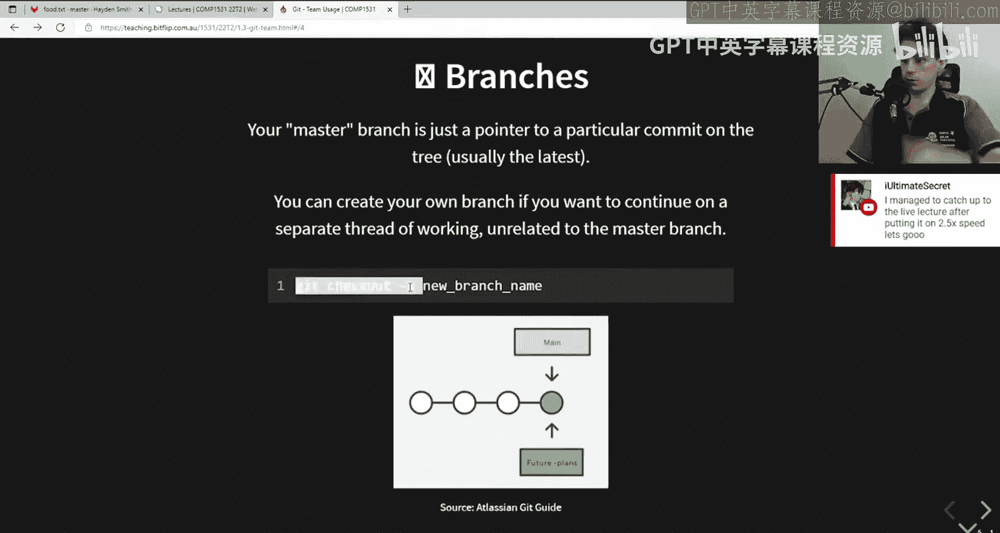

然后我想，好吧，我实际上想对我的 `brandon` 分支做一些更改。所以我去到 `names.txt` 文件，删除所有三个名字，写上 `Doctor Strange`。和之前类似，我将执行 `git add names.txt` 和 `git commit -m "Doctor Strange something"`。然后我将推送它，这会推送到 `brandon` 分支。

现在你注意到在 GitLab 上，如果我在 `brandon` 分支上点击 `names.txt`，它显示 `Doctor Strange`，但如果我切换到 `master` 分支，它显示原始内容。因为 Git 实际发生的情况是，我在这里创建了一个分支。现在，`brandon` 分支指向那个提交，即 `Doctor Strange` 提交。

类似地，如果我愿意，我可以用 Git 命令 `git checkout` 来切换分支。我不再需要 `-b` 参数，因为分支已经创建了，所以我可以回到 `master`。这就像我在这些平行宇宙之间切换。然后如果我打开 `names.txt`，你会看到在我的 `master` 分支上，我有所有原始的名字，因为 `master` 分支目前指向这个提交。

如果我检出 `brandon` 分支并查看 `names.txt`，它是不同的代码。你一次只能查看一个分支，这一点非常重要。Git 命令行的工作方式是你一次只能查看一个分支。你可以在它们之间切换，但你必须一次查看一个。

我可以回到 `master` 分支，我也可以修改 `names.txt`，比如改成 `Scarlet Witch`。我可以在这个分支上提交，然后推送到 `master` 分支。现在你在 GitLab 上会看到，如果我在 `master` 分支上，它显示 `Scarlet Witch`，如果我在 `brandon` 分支上，它显示 `Doctor Strange`。如果我查看提交历史，它们都有一个共同的历史记录，即这个合并提交，但它们各自有不同的下一个提交。你可以在这里看到 Git 的历史记录正在发生。

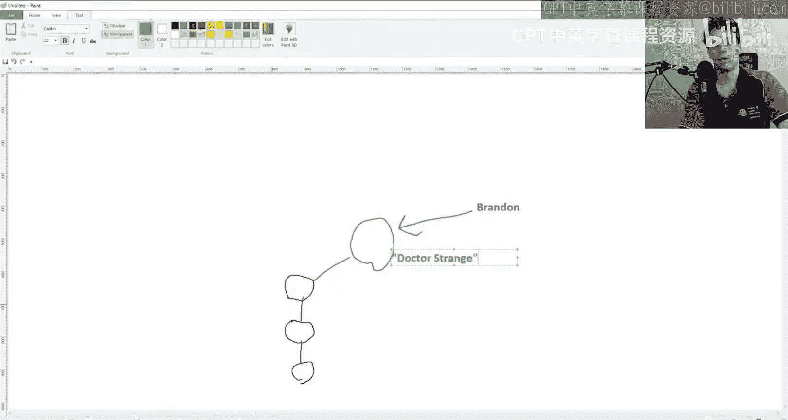

## 分支的本质 🎯

对于分支和 Git，这在概念上非常奇怪。说实话，我花了好几年才自然理解，因为大学里很多人没教过这个。但分支实际上只是指向某个提交的指针。有两种方式来看待这个话题。

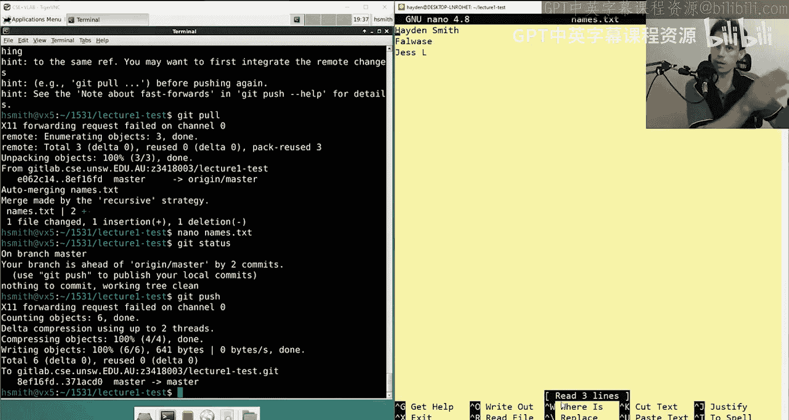

你可以用一种非常具体的方式来处理，我喜欢这样，因为我有时脑子转不过来，我喜欢把它们想象成完全独立的平行宇宙。就像我说的，好吧，我的 `brandon` 分支在这里，我的 `master` 分支在那里，它们完全不同。

还有一种更学术、更字面、更理论化的看待方式，即分支本质上只是指向特定提交的指针。每个提交都有一个链，因为记住我们之前说过每个提交只有一个父提交。这意味着如果你能指向一个提交，你就可以获得整个线性历史，因为每个提交之前只有一个提交。这就是 Git 提供历史的方式，因为这是一个线性历史。

所以，即使 `master` 指向这里，但线性历史在那里，`brandon` 指向那里，但线性历史也在那里。这就是关于分支的一些背景知识。

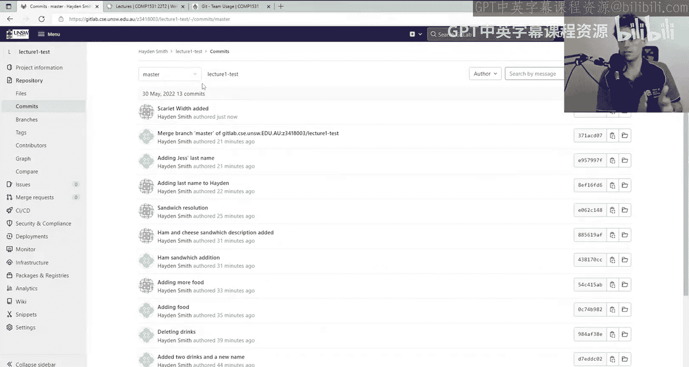

## 分支的实际用途 🛠️

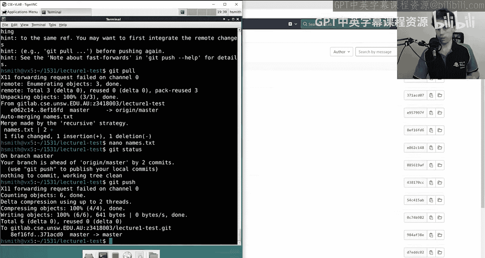

现在，回答 Meriddian 的问题：拥有多个分支有哪些不同的用途？有一个特别的用途是，当你编码时，如果你在一个团队中工作。假设你有一个稳定的代码仓库，代码可以运行，你和五个人一起工作，每个人都在做不同的事情。

你不想所有人都推送到同一个 `master` 分支。否则，你们将不断地拉取代码、遇到合并冲突等等。你希望能够像在独立的平行宇宙中完成所有工作，当完成后，再把它们带回代码的主宇宙。

一个好的例子是，假设我们有我们的 `master` 分支，暂时忘记 `brandon`。我在 `master` 上。现在，本地的人和 CSE 上的人将分别去开发一个功能。当我提到功能时，我指的是代码，他们将要添加一些东西，这非常简单，因为我们课程还没有做任何编码。

本地的人将创建一个新分支，命名为 `hayden/drinks-list`，他们要添加的功能是一个饮料列表。同时，在同一个晚上，CSE 上会创建另一个名为 `kai/cars-list` 的分支，Kai 要去做一些关于汽车的事情。

所以，Hayden 在这里处理饮料列表。我创建一个名为 `drinks.txt` 的新文件，添加 `Coke`。我执行 `git add drinks.txt`，你会看到我在 `hayden/drinks-list` 分支上，然后我做了更改，我将推送它。但因为是第一次推送，我必须使用特定的命令。你会看到我推送了我的饮料列表，我在 GitLab 上有了一个带有饮料列表的新分支。

看起来文件没有出现？哦，我忘记提交了。所以发生的情况是，我实际上创建了一个新分支，但没有做任何提交，所以当我推送时，它有点奇怪。实际发生的情况是，假设你在 `master` 上，我创建了一个名为 `hayden/drinks-list` 的新分支。当你创建一个新分支时，你实际上只是指向完全相同的提交，然后一旦我说做一个提交，它就像指向那个提交。因为我推送时没有提交，`hayden/drinks-list` 实际上指向完全相同的提交。

你可以在这里看到，因为如果我查看提交历史，`hayden/drinks-list` 和 `master` 有完全相同的历史，它们是相同的历史。所以现在我要添加 `drinks.txt`，我已经添加了，我忘记提交了。提交信息为 `First drink`，然后我推送。现在，`master` 上没有新的提交，但 `drinks-list` 分支上有一个新提交，因为我做了另一个提交。

让我们再做一些提交，只是为了保持这个比喻。打开 `drinks.txt` 再添加几个，比如 `Pepsi`、`Fanta`。执行 `git add drinks.txt`，`git commit -m "Two more drinks"`，然后 `git push`。然后我想进一步编辑它，再添加一个，比如 `Water`。执行 `git add drinks.txt`，`git commit -m "Forgot to add water"`，然后 `git push`。

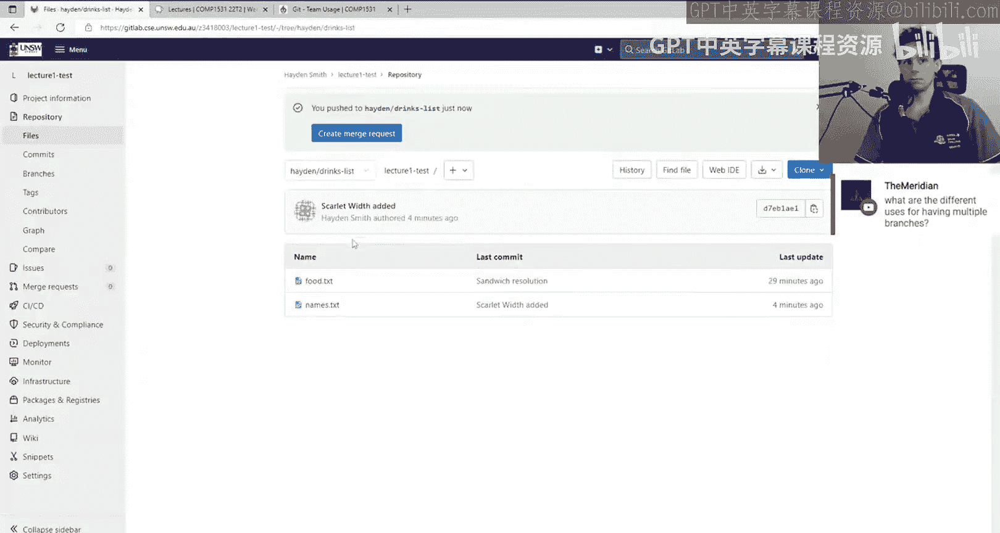

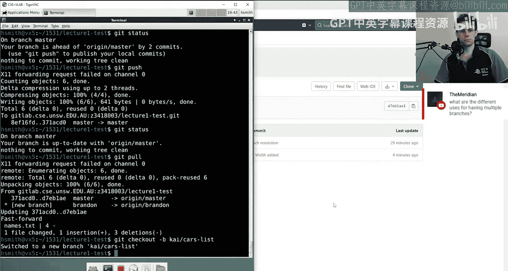

所以现在我这里有三个提交，三个新的提交，分别是 `First drink`、`Two more drinks` 和 `Forgot to add water`。这一切都发生在这里的一个平行宇宙中。

但与此同时，CSE 机器上的某人可能正在处理另一个功能，比如 Kai 的汽车列表，Kai 可能会创建一个名为 `cars.txt` 的新文件，里面有 `Honda` 和 `Toyota`。然后 Kai 会添加文件，提交信息为 `Added first two cars`，然后推送，但这是我们第一次推送这个分支，所以我们需要复制那个命令并粘贴。我们推送上去。

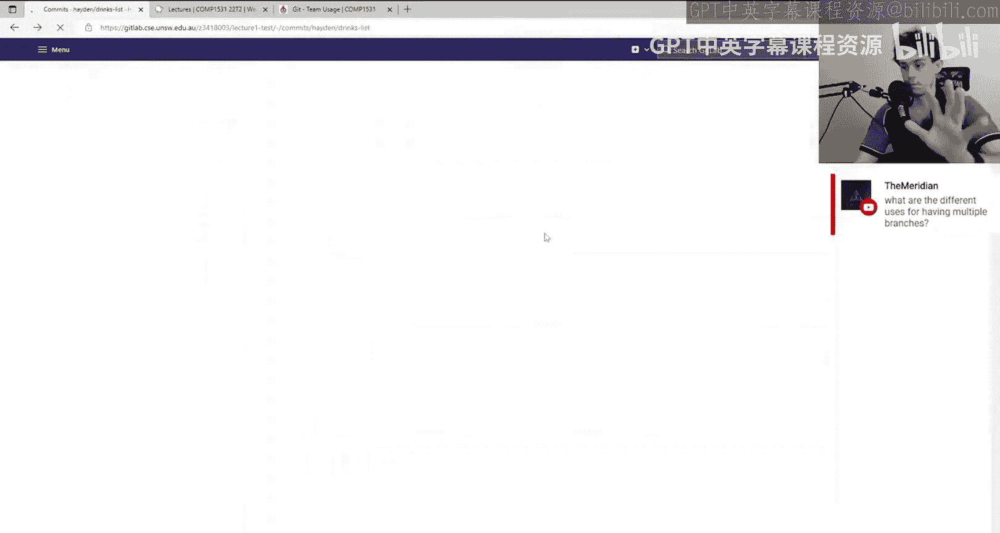

现在你会看到，`master` 上有 `Scarlet Witch added` 提交，`hayden/drinks-list` 分支在那里有一个提交，而我的另一个分支，即 Kai 的 `cars-list` 分支，在那里有一个提交。所以 Kai 和我已经分别去做了工作。我在这里工作，Kai 在那里工作，这很好，因为我们的工作理论上仍在进行中，我们还没有完成，所以我们还不想把所有这些东西添加到代码库中，因为我们还不知道代码是否有效。

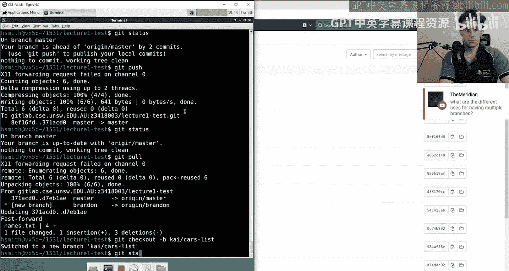

但一旦我们满意它能够工作，感觉良好，下一步就是我们第一次使用 GitLab 的 UI。

## 合并请求 🤝

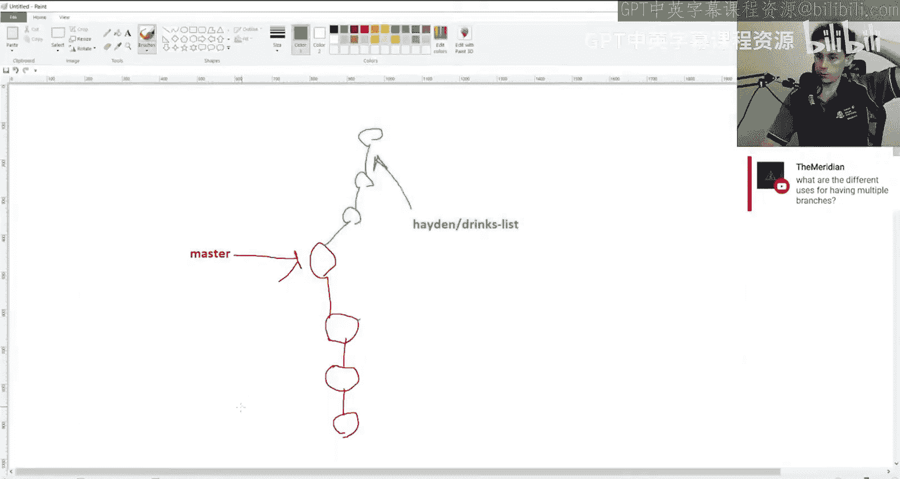

因为你会看到我这里有了这些分支：`hayden/drinks-list`。现在假设我完成了我的饮料列表，我写的代码完成了，可以合并了，我想把它合并到 `master` 中，带回到 `master`。

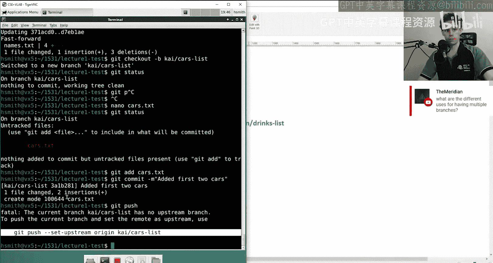

所以我可以做的是，我可以点击这个大的“合并请求”按钮。我现在要使用 GitLab UI。我点击那个合并请求按钮。合并请求是什么？合并请求是一种基于 Git 的方式，用于将一个分支合并到另一个分支。这是一种尝试将这些分支重新合并在一起、消除我的分支的方法，因为我只希望分支在我实际需要完成某件事时存在。

这是我的标题“Drinks list”。我可能称之为“Addition of drinks list”。然后我写描述，比如“Added a drinks list with four drinks that were popular”。这是一个好的开始。然后我下来这里，点击“创建合并请求”。

现在，这实际上在这里创建了一个可视化窗口。合并请求本质上是一个请求，请求将代码合并到 `master` 中。它非常字面化，就像请求将我的分支合并到 `master` 中。这是它的标题。你可以看到所做的提交，你可以看到更改的摘要。这是 `master` 和我添加的工作之间的差异。

我们实际上有这些合并请求的原因，不一定是为了你或 Hayden，因为 Hayden 写了代码。它是为了 Kai、Angus、Ran，我团队中的其他五个人。通常发生的情况是，我做了这样的工作，然后我会说，好了，然后我会在 Microsoft Teams 上把这个链接发给 Kai 或 Angus。

如果 Kai 在线，我可以把 Kai 添加到合并请求中。你不需要做我在这里做的事情，因为我们会为你设置好。但假设我和 Kai 在一个团队中工作，我们一起处理这个小代码，你会有很多人，你会在一个五人小组中。

你会看到这里，Kai 可能会过来给个赞，所以 Kai 实际上给了一个赞，Kai 和我团队合作的方式取决于我们，比如 Kai 可能会点击批准按钮或点赞按钮，或者 Kai 可能会说“对我来说看起来不错”。本质上，当你写代码时，一个好的实践是确保在你将代码合并到 `master` 之前，团队中的其他人说没问题。这就像一种简单的理智检查批准。

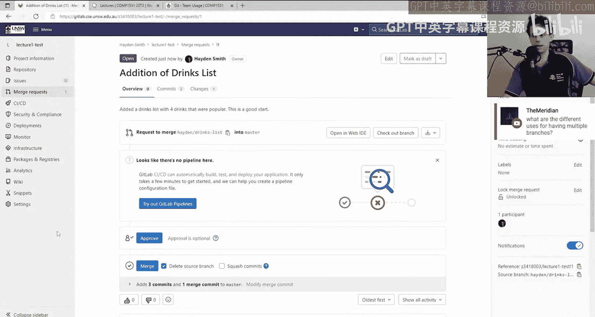

所以 Kai 在这里给个赞，就像说，是的，这没问题。然后我可以做的是，我可以点击“合并”。当我点击合并时，Git 界面会字面上接受这个，并将其合并到 `master` 中。因为记住，`master` 上次是在 `Scarlet Witch`。所以现在 `master` 变成了这样。

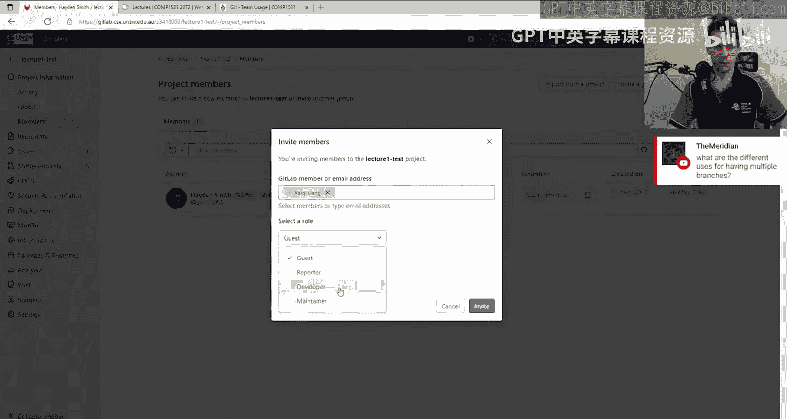

这就像我们把这两个平行宇宙合并在一起。所以，与其让这两件事分开发生，它们现在一起发生了，回到了 `master` 中。

从技术上讲，实际发生的情况是，当我合并到 `master` 时，我技术上只是改变了 `master` 指向的位置，因为记住分支只是指向提交的指针。所以现在 `master` 是整个东西，如果你回到 Git 并查看提交历史，切换到 `master`，你实际上会看到所有那些其他提交都在那里。

## 命令行合并与合并请求 ⚙️

有人问，我们能否通过命令行进行合并请求？你可以通过命令行合并，我来展示一下。假设 Kai 在这里有他的更改，Kai 有他对代码库的更改，即添加汽车，Kai 想做的就是现在将其合并到 `master` 中。

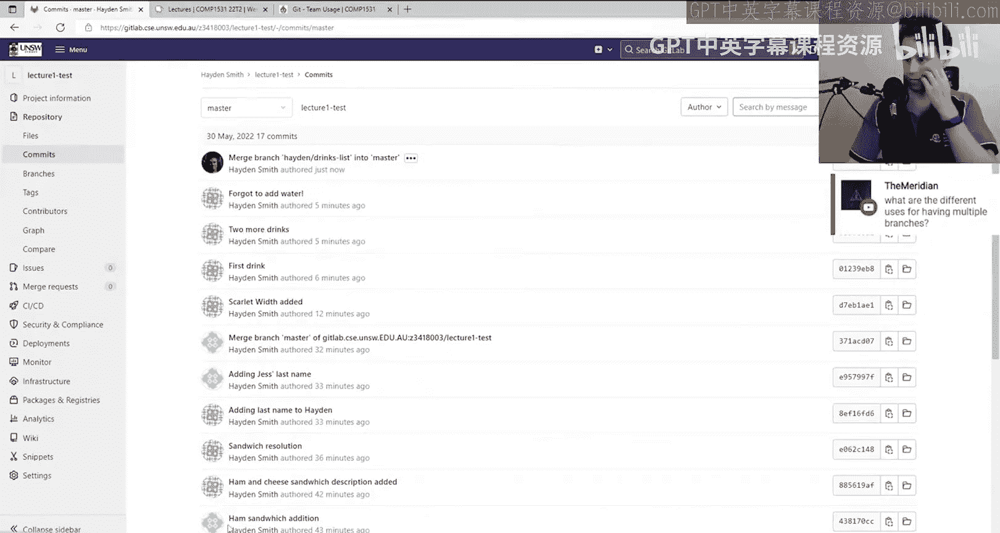

实际上有一个 Git 命令叫做 `merge`。`merge` 的作用是合并一个分支到你当前所在的分支。合并是一种拉取方法，是拉取到那个分支的请求。

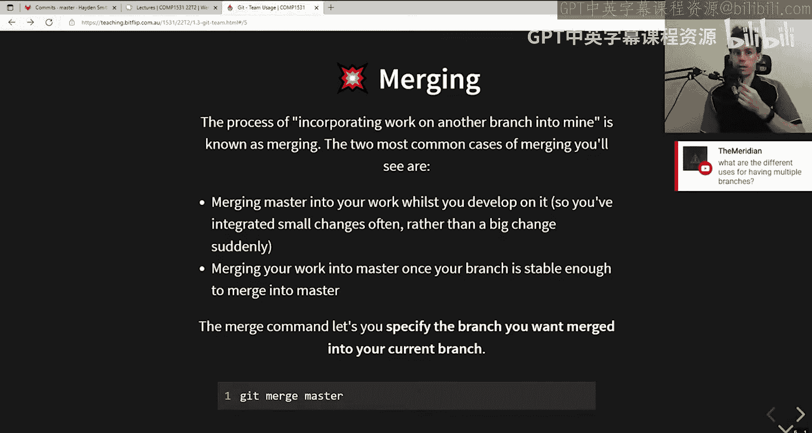

这意味着，如果我在这里，假设 Kai 想合并到 `master`。所以 Kai 切换到 `master` 分支，拉取以确保 Kai 拥有所有最新的更改，现在 Kai 做了。现在 Kai 想做的就是将他的分支合并到 `master` 中，Kai 只需输入 `git merge kai/cars-list`。这将执行与合并请求完全相同的操作，将 Kai 分支的更改拉取到 `master` 中。

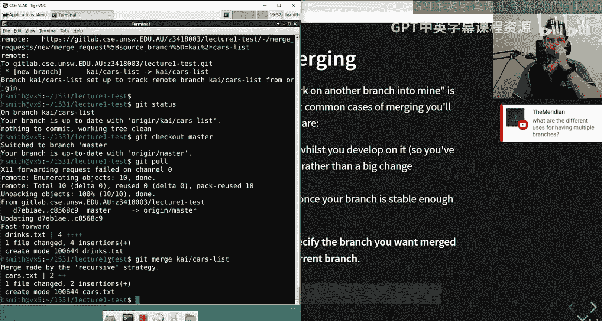

现在的问题是，本地 Kai 有了更新的 `master` 版本，Kai 需要将其推送到 GitLab，因为如果你看一下 Kai 目前在 `master` 上有什么，再看看 GitLab 上实际的 `master`，你会看到在 GitLab 的 `master` 上只有 `Forgot to add water` 和这个合并提交，而我们没有 Kai 的 `Added first two cars` 和这个合并提交。为什么这些顺序不对是一个非常复杂的问题，你不需要在第一天就理解。

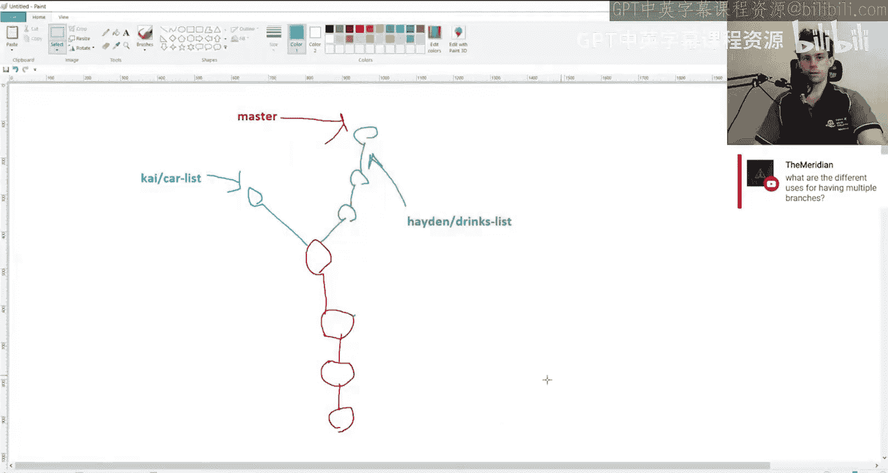

但本质上，Kai 有他的提交在这里，现在他有了他的提交，我们推送到 GitLab，你会看到那些提交现在会出现。蓝色的提交是我的 CSE 账户，紫色的提交是我的本地账户。

那么，如果你可以在命令行合并，为什么我们还要使用合并请求呢？原因很简单，因为合并请求是一种非常协作的体验，它是一个让人们以可视化方式评论或审查你的代码、批准你的代码的机会，而这些功能非常适合 GUI，所以我们真的不在命令行进行合并。

不过，有一个地方你会在命令行进行合并，这很重要。假设 Hayden 现在要去开发另一个功能。Hayden 在 `master` 上，我执行 `git status` 来获取我的分支。我在错误的分支上，我要检出 `master`，拉取 `master` 以确保我有最新的更改。我说我要去开发另一个功能，那个新功能可能是 `hayden/dogs`。

然后我创建一个名为 `dogs.txt` 的新文件，里面可能有 `husky`、`greyhound`。我正在处理那个。同时，Kai 在这里说我要去开发一个竞争性的功能，叫做 `cats`。我不知道猫有哪些品种，但假设 Kai 在创建另一个名为 `cats.txt` 的文件，Kai 可能在编辑文件，不一定是新文件，里面可能有 `loud cat`、`quiet cat`、`sleepy cat`。

Kai 正在处理那个，Kai 也在为那个做一些提交。添加三只猫，命名得不太好。所以 Kai 在那里做那个，Hayden 在这里添加狗。另一个提交，命名为 `2 awesome dog breeds`。我们这里有这两件事在发生。

如果我尝试推送我的新分支，它不起作用，因为这是我第一次推送我的分支。如果 Kai 尝试推送他的分支，这是他第一次推送他的分支，所以也不起作用。所以 Kai 必须使用特定的命令推送。

顺便说一下，我们时间控制得还不错。我们会稍微超时一点，但不会太多，也许10或15分钟。我们会尽力完成。所以 Kai 在这里推送，现在一切都好。`master` 稳定地在那里。我在这里分出去了，Kai 在那里分出去了。

但有时会发生一件事，就是我们可能处理同一个文件或其他东西。例如，现在我开始再次编辑 `names.txt`，我创建了一个新名字叫 `Blinky Bill`。然后我添加 `names.txt`，提交信息为 `Adding a cool name`，然后我推送上去。

同时，Kai 在这里，Kai 说，实际上我想添加一个名字到 `names.txt`，那个名字可能是 `Donald Duck`。所以我们最终处理了相同的文件，这有时会发生，有时你处理重要的文件，你们都修改了相同的部分。提交信息为 `Doc added`。

现在会发生什么？也许我会过来，我的代码完成了。所以我可以去保存我的分支。我可以去我的分支页面，点击我的 `dogs` 分支，创建一个新的合并请求，写一些文本，点击创建合并请求，然后有人会批准它。我不知道，也许 Kai 很快会批准。

在 Kai 批准的时候，有人之前问了一个好问题，Brandon 说我们应该勾选“删除源分支”选项吗？简短的回答是我们不介意。是否勾选它取决于你。所以，Kai 刚刚批准了，你实际上看到这里写着“Approved by Kai”，如果我把鼠标放上去，会显示 Kai 的名字。所以 Kai 实际上批准了它，现在我要点击合并。所以现在它合并到 `master` 中了。

但有一件事是，Kai 还没有完成他的 `cats` 分支。所以他要做的是，出于良好的习惯，不断地获取最新的 `master` 并确保它合并到他的代码中。所以 Kai 要在 CSE 机器上检出 `master`，拉取 `master`，然后 Kai 实际上要回到他的 `cats` 分支，他将把 `master` 合并到他的分支中。他不是试图将他完成的工作合并到 `master`，而是试图让他未完成的工作与 `master` 保持同步。

这种合并会把东西合并进来。然后你可以在这里看到，Kai 已经显示 `names.txt` 有冲突，这是有道理的，因为 Hayden 在他的本地机器上过来修改了 `names.txt` 文件以包含 `Blinky Bill`，而 Kai 以类似的方式修改它以添加 `Donald Duck`。

所以当我尝试合并东西后打开 `names.txt` 文件时，有这个冲突，我想，哦，Hayden 有 `Blinky Bill`，好吧，这很有趣。然后 Kai 手动处理那个冲突，保存它，然后 Kai 会添加两个名字，`dogs.txt` 已经暂存了，然后 Kai 可能会再做一次提交，命名为 `Integrated names`。

然后 Kai 可能会推送到他的 `kai/cats` 分支。Kai 会继续处理一段时间，Kai 可能会再添加一只猫，例如 `Stinky cat`。所以 Kai 在做更多的工作，然后 Kai 想，好了，随着最后一只猫 `Stinky cat` 的添加，Kai 可以去创建一个合并请求。实际上，我想知道 Kai 是否在那里，如果你想创建一个的话。所以我不会创建这个。Kai 可能就在那里创建。

在 GitLab 上有一个部分叫做“合并请求”，如果你点击它，它实际上会显示所有存在的合并请求。所以当你的团队成员创建合并请求时，你可以在这里看到它们。通常，如果你创建了一个合并请求，你通常会告诉你的团队你已经创建了一个，以便他们知道，他们可以去看。

我不知道 Kai 是否已经创建了，也许我搞错了。是的，所以 Zach（我不知道怎么念你的名字），Kai 已经创建了这个合并请求。我过去看，嗯，好吧。我可以看到那里，Kai 添加了 `Donald Duck`、`loud cat`、`quiet cat` 和 `sleepy cat`。好吧，然后我看看，我想，哦，都很好。然后我可以点击批准，然后 Kai 会去合并它。

写代码的人合并代码，这一点非常重要。原因是，理论上，理解代码、理解代码何时完成、理解代码何时安全的人是写代码的人。所以一般来说，写代码的人是合并代码的人。你不能批准自己的代码，其他人也不应该合并你的代码。

我不知道 Kai 是否合并了，没关系。Zachara 问了一个好问题：如果你没有将 `master` 合并到分支中，而是直接做了一个有冲突行的合并请求，会怎样？这是一个好问题。

让我展示一下那是什么意思。让我们想象一下，完全独立于这个，出于某种原因，Hayden 是个坏人，直接进入 `names.txt` 并添加了另一个行，比如 `Silly Sam`。然后 Hayden，坏 Hayden，直接推送到 `master`。提交信息为 `Out of a silly name`，推送到 `master`。

现在，我们会有问题，因为如果你查看 `master` 上的 `names.txt` 文件，里面有 `Scarlet Witch`、`Silly Sam` 和 `Blinky Bill`。如果你查看 Kai 的合并请求，Kai 试图在这里这两行之间合并 `Donald Duck`。

我不确定为什么没有更新。哦，是的，它在这里告诉你：合并被阻止，必须解决合并冲突。所以有时如果你有一个 GitLab 无法解决的合并问题，即通常需要手动干预，你可以在本地解决，就像我们之前做的那样，我可以拉取 `master` 并将 `master` 合并到我的分支中，或者如果我是 Kai，我可以点击这个“解决冲突”按钮。

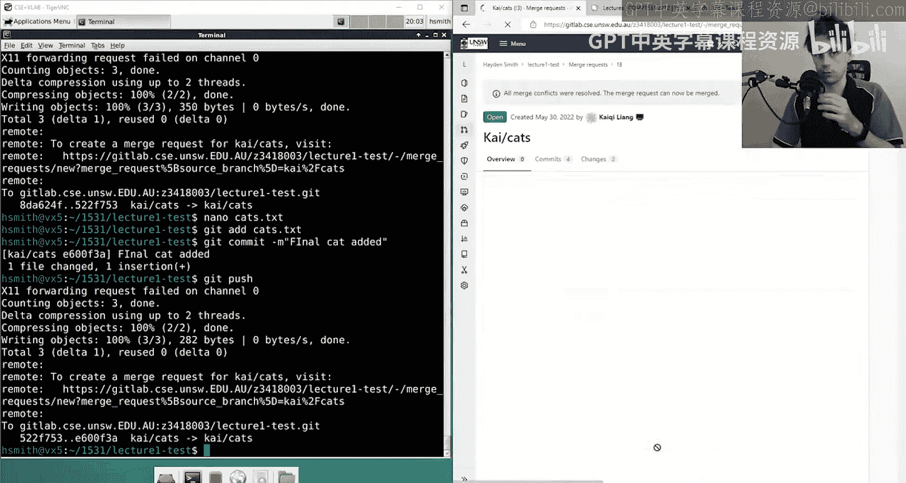

我可以选择这两个中的一个。在这里解决冲突很棘手的原因是，在 GitLab 上解决冲突通常很麻烦。你实际上可以在 GitLab 上编辑它，如果你想的话，所以我实际上可以在 GitLab 上编辑它，就这样更改代码，然后我可以点击“提交到源分支”。所以 Kai 去修复了这个，然后 Kai 想，好了，现在可以工作了。然后我想象我是 Kai，我可以去合并那个。好了，合并了。

## 总结 📝

无论如何，这就是今晚我们讨论的一切。我们讨论了 Git 的提交、推送和拉取，讨论了这些如何存在于多台机器上以及这些机器如何保持同步。然后我们讨论了当你与他人合作时，你在一个分支上工作直到完成，然后将其合并回去。

你可以想象 Git 本质上就像一条坚固的线，随着时间向前移动，总是充满良好、稳定、可工作的代码。然后像你这样的人在开发一些东西直到它工作，然后把它塞回去，然后你的分支消失，你团队中的其他人正在处理更复杂的东西，然后把它塞回去。然后有人过来在另一个分支上做一个快速修复，然后把它放回去。

你们都是这样分支出去直到某事完成，然后将其反馈到系统中。所以即使我们说分支像一棵树，它实际上更像一条线，只是有一些东西漂移出去又回来。这就是工作流程。

至于你何时使用这个工作流程，你实际上不需要使用它，直到本周结束，因为你在这门课程中的所有实验都是单人完成的。所以你的所有实验，我们讨论的关于分支和合并请求的大部分内容，对于你的实验来说并不是必需的。这最后一讲关于分支和合并请求的内容都是关于你的项目的，项目从周五开始。

Kai 发给我一个链接，关于 GitLab 有一些其他可视化工具，非常方便，这是一个可视化工具。由于复杂的原因，我需要在这里登录。所以 Kai 实际上展示了你可以看到，红色的是这里的 `master` 分支，你可以看到分支分出来然后又合并回去。你可以看到那里有 Brandon 的东西，然后 Kai 的 `cats` 和 Hayden 的分支在这里。你知道，这不是世界上最流畅的东西，但它向你展示了，即使我们谈论分支，它实际上只是那条线，有东西出去又回来。

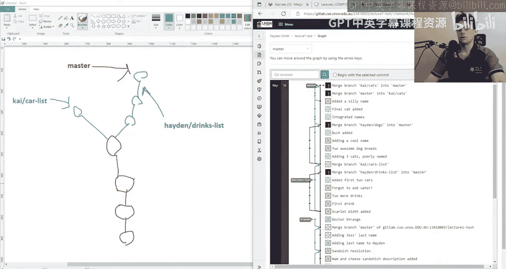

如果我们回顾一下讲座幻灯片来总结，我们讨论了合并。让我们确保我们已经涵盖了所有内容。我们讨论了分支，讨论了你的 `master` 分支和带有新功能的分支，然后最终合并回去。我们讨论了如何在分支之间切换，很多这些幻灯片我没有讲，因为我们演示了。我们讨论了合并，如何将一个分支合并到你的分支中。然后我们也讨论了合并请求，这是一种通过 GUI 进行合并的方式。

这是合并的总结。我认为这个，我不认为我们会花很多时间在这上面，因为如果你没有做过很多 Git，我认为这对你来说没有意义。我认为这是你可以在一两周后回来看看的东西。但基本上，我现在给出的总结是，合并通常有两件事要做。

其中一件是当你将你的工作合并到 `master` 时。这发生在你完成一个功能时，你创建一个合并请求，以便你的团队可以在它进入 `master` 之前审查它，因为 `master` 中的代码应该始终是功能完整的完成代码。

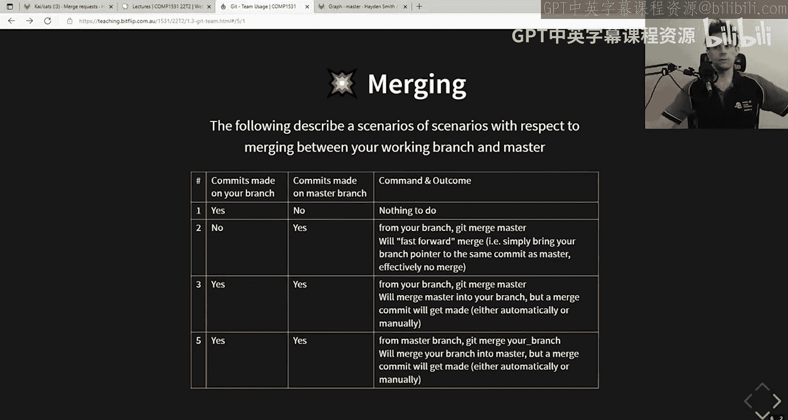

然后你有另一种方式，即当你将 `master` 合并到你的分支时。这是你经常做的，以确保当你的团队成员完成他们的工作并将东西反馈到 `master` 时，你总是获得最新的更改。

所以这里绿色小波浪线上的人，当他们在工作时，当红色分支合并时，他们应该尝试从 `master` 拉取，就像这里和这里，就在他们工作时，比如每天或什么，这样当他们的团队成员完成工作时，他们可以不断获得最新的更改。

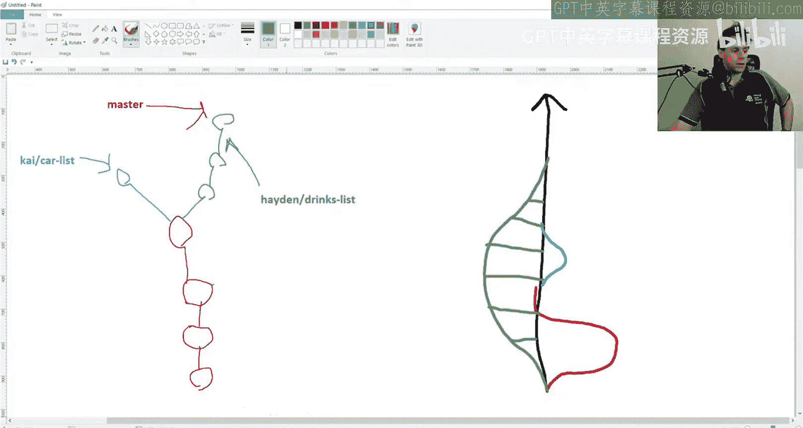

你可能会想，为什么我需要最新的更改，我又不用 Hayden 愚蠢的狗东西。原因很简单。你获取更改的时间间隔越长，你可能需要做更多的工作来解决冲突。所以这就像，与其突然浪费四个小时试图合并东西，不如每天花四分钟做那个要容易得多。这是一个非常极端的例子，你不会每天花四分钟在这上面。

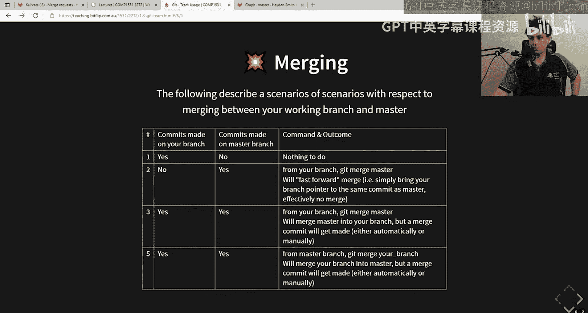

## 结束语与答疑 🎓

这基本上把我们带到了结尾。让我回答几个问题，然后我们就结束。Leo 说，所以蓝色节点是在最新的屏幕节点之后添加的，合并节点在那之后添加。我不明白你是什么意思。是在画图里吗？抱歉。

Leo 说在画图里，当 Kai 的分支刚刚合并到 `master` 时会发生什么？我的意思是，说实话，因为我们超时了，我可能不会花时间详细说明，但你可以诚实地看看 GitLab 的历史记录。我会让这个仓库公开，如果人们想看看的话。是的，我可以把它设为内部。所以你可以直接访问这个 URL：`gitlab.cse.unsw.edu.au/my-zid/lecture1-test`，你可以输入那个，查看提交和分支等等。现在任何人都可以在 GitLab 上查看。

Meriddian 之前问，是否可以撤销合并请求？你实际上可以在 Git 中撤销东西，虽然相当复杂。在这门课程中，我们主要专注于让你熟悉 Git，我们让你熟悉 Git 的原因是为了让更聪明的人或未来的你能够舒适地使用像 Git 这样的工具，这些工具允许你撤销东西。你实际上不需要做那么多，但我们在第9周左右有一个额外的讲座，讨论如何撤销东西，但你不需要在整个课程中使用它，我们也不喜欢你撤销东西，因为我们必须评估你在这门课程中的贡献，所以我们真的不希望你篡改历史，因为历史对我们评估人们做了什么非常重要。

这把我们带到了结尾。我最后的评论，我会第三次重复，非常简单。我刚才向你抛出了一大堆信息。如果你 somehow 看了整个讲座，然后想，嗯，这完全合理，我懂了。很好。你要么是个天才，要么以前用过 Git。

90% 的人可能属于要么非常困惑，要么属于，嗯，我有点明白你的意思，但天哪，我希望你永远不要让我做。对于那 90% 的人来说，很好，你正是我们希望你所在的位置。你现在将去做你所有的实验，使用 Git。你将在接下来的10周里，在教程、实验、项目和其他一切中学习，你会慢慢习惯这个。这是因为讲座不会涵盖所有内容。

从明天开始，我们将讨论 JavaScript，我们也将开始讨论其他一些事情，所以 Git 就讲到这里，我们不会再在讲座中讲它，但你仍然会在每堂课中看到它，因为它将是我们所做事情的一部分，它只是课程中一切的一部分。

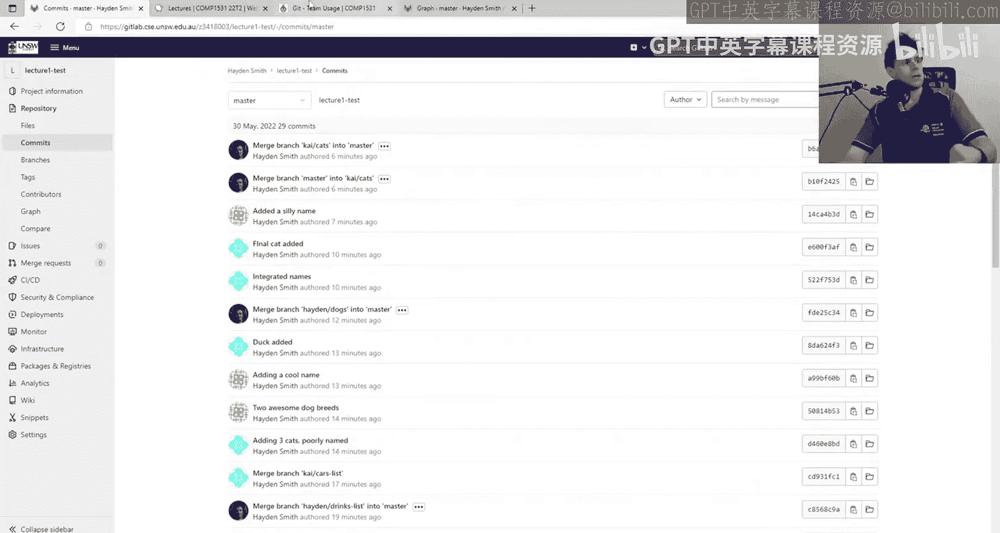

所以，如果你感觉这看起来很有趣，我有点明白一些概念，我仍然有点困惑，我害怕自己动手。你正走在正确的轨道上。让我们继续前进。

今晚到此结束。我很惭愧，我很遗憾我们不能有一个更轻松的第一周，但正如我所说，我们有一个更轻松的学期末。所以希望这也能平衡你其他繁忙的课程。这是本次讲座的一些反馈，非常感谢你的时间。感谢你待到这么晚。

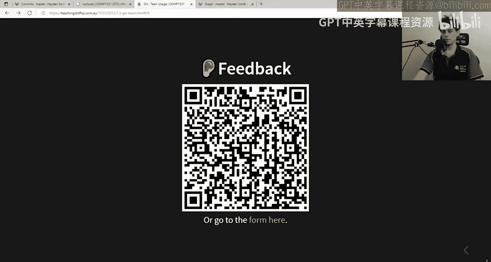

我想我们明天下午6点直播见，周二。我们会尽量找点乐子。编程可能比 Git 更有趣一点，可能更容易保持你的注意力。感谢你在聊天中玩得这么开心。你是我迄今为止教过的最有趣的学生。你还有很多时间犯错，但我们看看会怎样。今晚和大家在一起很开心，请度过一个愉快的夜晚，如果你需要什么，请在论坛上发帖，我们有一群非常有爱心、非常聪明的导师可以帮助你解决所有问题，所以祝你有个美好的夜晚。