# UNSW《前端编程｜ Web Front-end Programming COMP6080 23T1》中英字幕（deepseek-R1 p48 -49-(Old) COMP6080 - ReactJS 💥 Intro.zh_en -BV17RXGYuEaM_p48-

Hi， everyone and welcome to Com 6080 Intro to React。 My name is Tom。

 and I'll be walking you through getting started with Re J S。😊。

Today we'll be diving straight in and getting you to create your first react application We'll be explaining a little bit about how it works。

 but before we do I'm going to explain why we're learning React。

So why don't we just use plain Javascript or something like JQuery to make our websites。

 The short answer is that it's a nightmare， but the real answer is that once you go beyond a basic demo application。

 then the application's complexity grows exponentially。

 Small features take a lot of code When you add more developers to your project。

 you'll all be working in the same files and stepping on each other's toes。Generally。

 if a website is non trivial and requires a lot of dynamic behavior。

 using plain JavaScriptscript is a recipe of chaos and spaghetti code。Clearly。

 we need a solution for this。 There have been many attempts， Angular， amber， meteor。

 just to name a few currently react is far and away the most popular solution to this problem。

So what is react， Reor's Javascript library that we can use to build user interfaces。

 The main advantage of react is that it allows us to build individual pieces of our Ui bit by bit and then combine them together to make very powerful applications。

React allows you to write your UA in a declarative way。When your application changes its state。

 whether it be by fetching some data from a back end server or maybe incrementing a variable。

React will listen for these changes and will react accordingly by making sure the UA reflects the new state。

That sounds like a lot。 but what it means is that you don't need to worry about what happens under the hood of your application。

 If you decide to change some state， your page will magically update。

When we create a react application， it creates a tree like data structure。

 We create isolated pieces of UI， called components， and we compose them together。

We'll cover this in depth in later lectures， but for now。

 all you need to know is the components are simple JavaScript objects。

 and components can contain each other。A react application usually consists of a single component inside which are other components。

 which may also contain more components inside them and so on。

 forming the tree structure mentioned earlier。Interestingly。

 react is most commonly used for web development。But it can be used to create mobile applications。

 desktop applications and even command line applications。 Really， anything that involves a Ui。

 you could feasibly put react on top of。So let's get started。

 Today we'll be creating a basic react application。

 Facebook has developed a tool called Create React app， which will help us get started。

 Create React app is command line tool that will create a ready to use application folder with some boilerplate inside。

Make sure to follow along on your computer at home for this and all other exercises contained in this lecture。

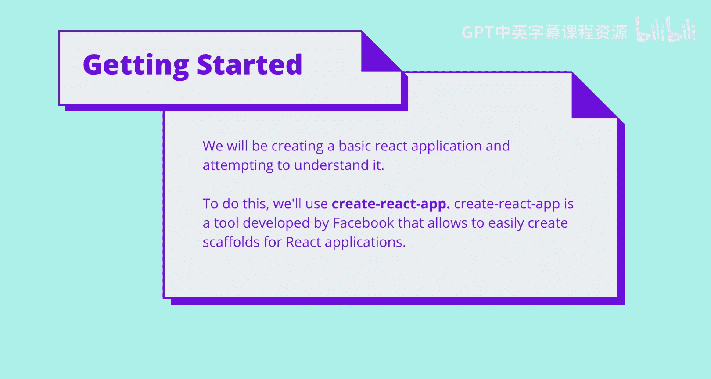

We can use create react app through NPM。 So open the terminal wherever you like and input the following command。

When complete， a my first app folder will be present。Let's give it a try。

When we input the command。All of the dependencies for react are installed。

When installation is complete， a set of instructions will be displayed showing you how to continue。

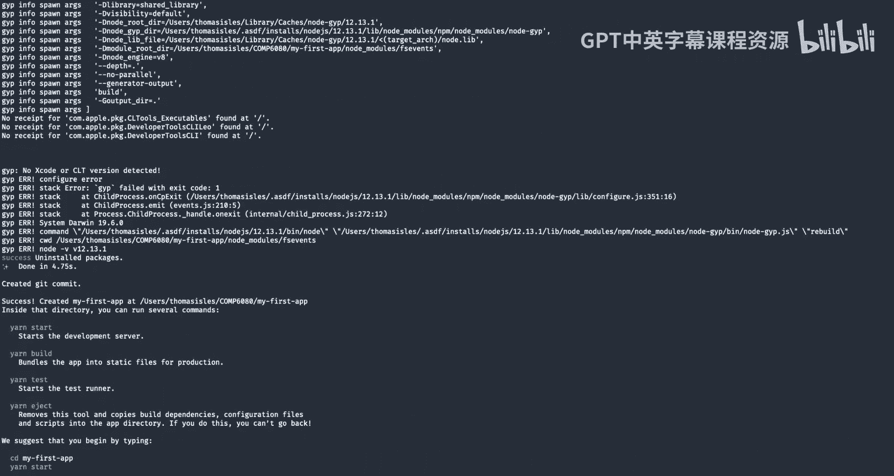

There we go。😊，Now， installation is complete， open the folder within your editor and we'll start to take a look。

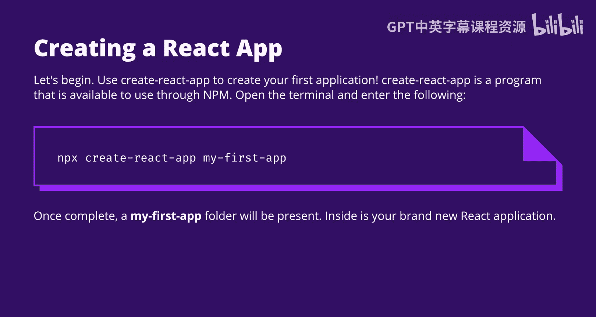

Inside the folder， you'll see a large number of files in this slide。

 I specified which files are important to know about。

 You should be familiar with some of these files already， such as package do Json。

 which contains our NPM manifest。In the source folder is all the code related to our react application。

Highlighted in yellow， you can see the app do Js and app dot CSss files。

 which are our root level react component files。Before we dive into how it works。

 let's start the application and see what it looks like。

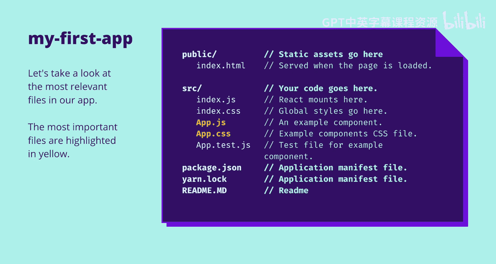

Starting the application is easy First run yarn install to install the dependencies that run your application。

 then run yarn start to start it， you only need to run yarn install one time。

Once the application is started， you should see a link to local hosts on Port 3000。

 opening that in your browser will let you see the application。 Let's give it a try。

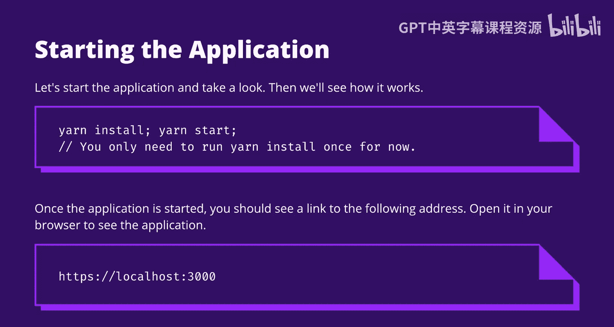

Run yarn start in the terminal。Once the application is started。

 it would load localhost Port 3000 in your browser and show your example application。

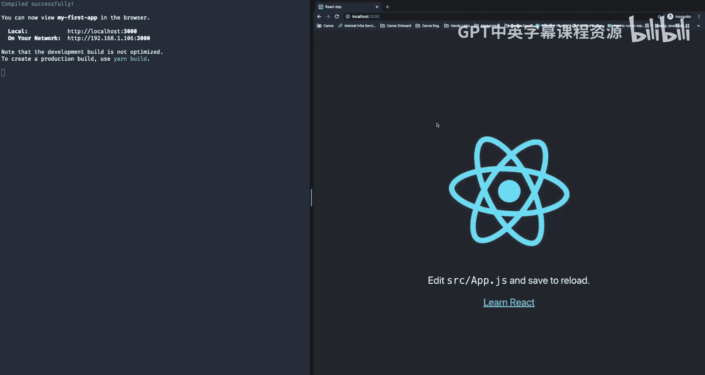

Now， let's open the editor and take a look at source slash app dot Js。Ado JS is our component file。

At the top level， we import react。 Then we see a function app， which is exported from the file。

In this case， app returns a specification for what the UI should look like。 Now。

 this function returns something that looks a bit like HTML， but it isn't quite HTML。

 There are a few key differences。 Also， you may not be used to seeing HTML defined in a jascript file in this way。

 Most react functions will return something that looks like this。 so let's examine why that is。

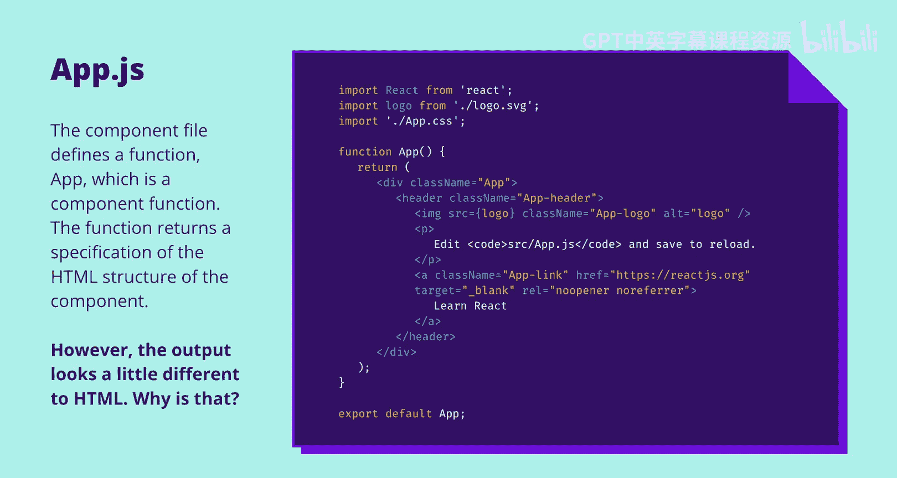

React functions generally return something that we call JSX JSX stands for JavaScript XML。

 and it's like an extension of JavaScript， which allows us to treat HTML code like we would any JavaScript object。

This is really useful because now HTML is just like any other data that we use。

 and that provides us with a lot of flexibility on the right hand side examples。

 you can see that we can assign JSX to a variable and we can even perform conditional logic on JSX。

Now， JSX isn't quite the same as HTML。 It actually provides a lot of features that HTML cannot。

 and it has some restrictions that HTML doesn't have。For example。

 one of the features that it provides is the ability to escape HTML back into JavaScript by using parentheses。

This allows you to embed variables within your JSX， as you can see on the third example on the right。

React and JSX are tied together in web。 you can't use one without the other。

So when you see a function that returns JSX in a project， chances are， it could be a react component。

Speaking of react components， the great thing about JSX is that it allows us to think about components like standard JavaScript functions。

All they have to do is return an object， which is JSX。

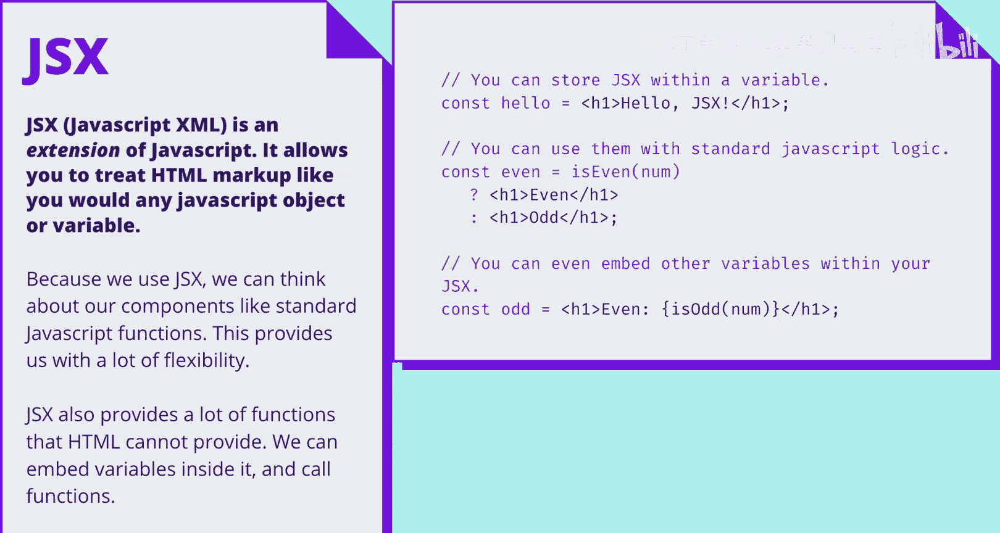

So let's take another look at App。t JS， given what we've learned about JSX。

You can see here that the art function returns some J S X code。

 The J S X here is a div insideside the div is a header， an image， some text and a link。

 All of this looks like fairly standard H Ml， with a couple of exceptions。In JSX， instead of class。

 we use class name with a capital N。Often， attributees in HTML will be converted to use Caml case in this way。

This applies to most HTML tags that are made up of multiple words or contain hyphens convertverting to Caml case keeps it consistent with our outer JavaScript styles。

Additionally， the brackets you see at the start and the end of the JSX allow us to wrap JSX neatly over multiple lines。

There are many other differences， but we'll leave them for later lectures。Hopefully。

 what we've shown you today is enough for you to get a basic understanding of JSX。For now。

 let's compound on that by editing our app file and seeing what we can make。

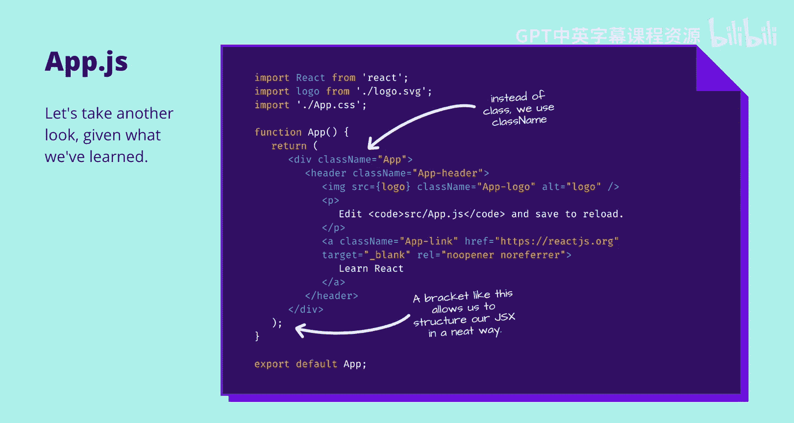

First， let's try adding something to our component。

What we'll do is we'll add a header that says hellello world to the existing app。t Js file。

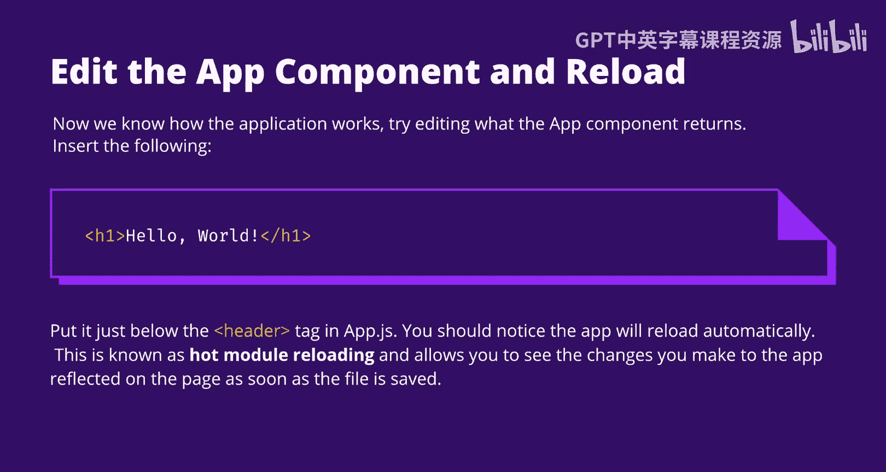

Let's give it a go。So here we are。 I'll start the application initially and get the page to load to my browser。

Then I can edit the app function by adding a Ho world header just under our header tag。

You can see it automatically updates for us。Pretty cool。

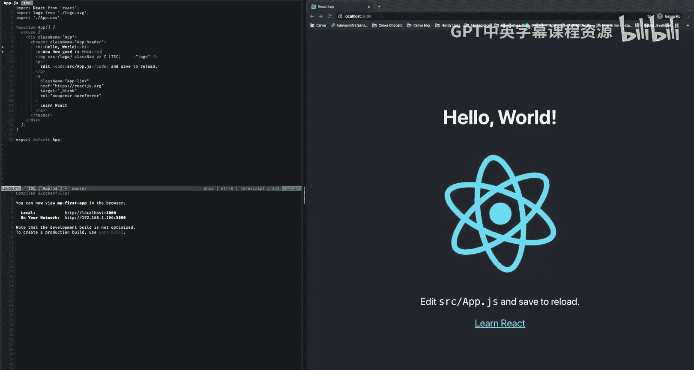

You might have noticed that I didn't need to refresh the browser once I'd save the file。

The app preload automatically。This is known as Ho module reloading。

 and it allows us to see the changes we make to the app reflected on the page as soon as the file is saved。

Okay， now for a bigger change， we're going to delete all the JSX that currently exists in our app function。

 and we'll replace it with a simple div that shows the date and the time that we loaded the page at。

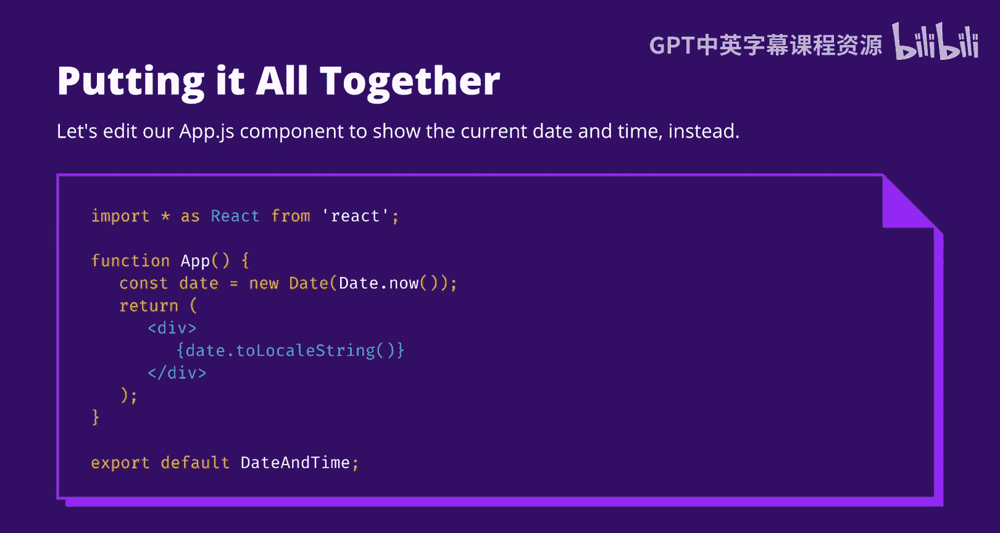

First of all， I'll delete the JsX that already exists。Uninative。

And I'll create a variable that stores the current date。

Now I can use JSX's embedding functionality to convert the date to a string inside the div itself。

And remove some imports。

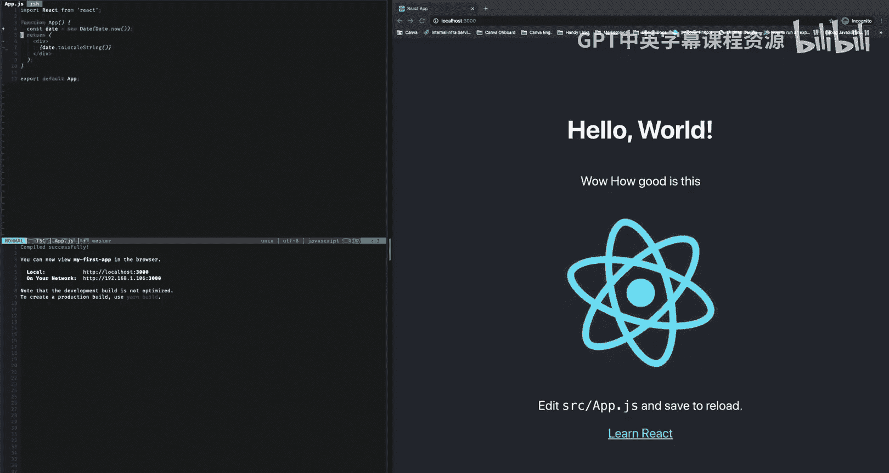

There we go。😊。

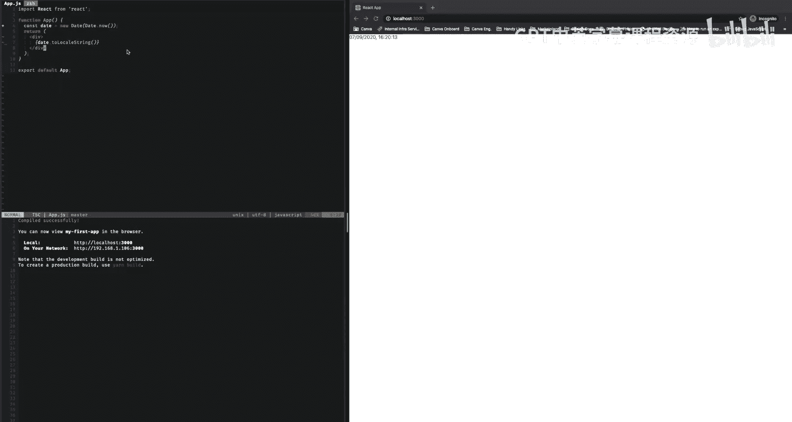

Great work， everybody。 So if you followed along and everything worked correctly。

 then you should have made your first react application and your first edit to a component。😊。

Feel free to play around with the application you made today and see what you can get it to do。

In the following weeks， we'll be providing you with an in- depthth understanding of how Re works from the insider now on the next lecture。

 we'll be talking about CsS and how to integrate it with reactact to make a beautiful user interface。

 Additionally， there is some content at the end of this slide deck。

 which explains how react mounts onto a web page。Until next time， take care。

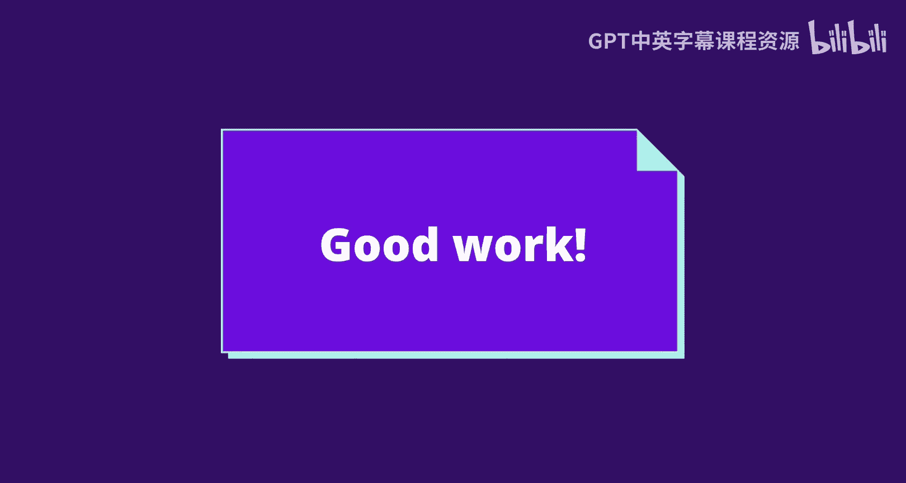