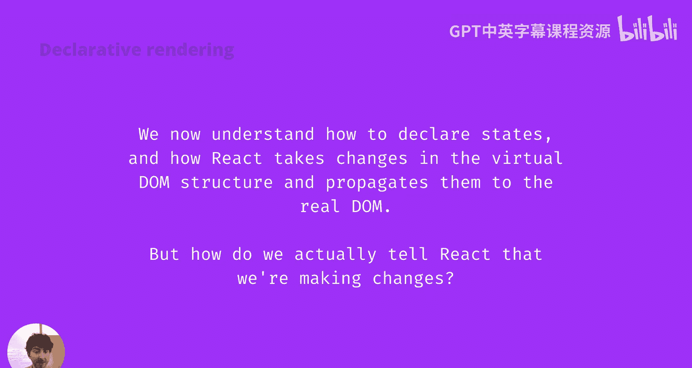
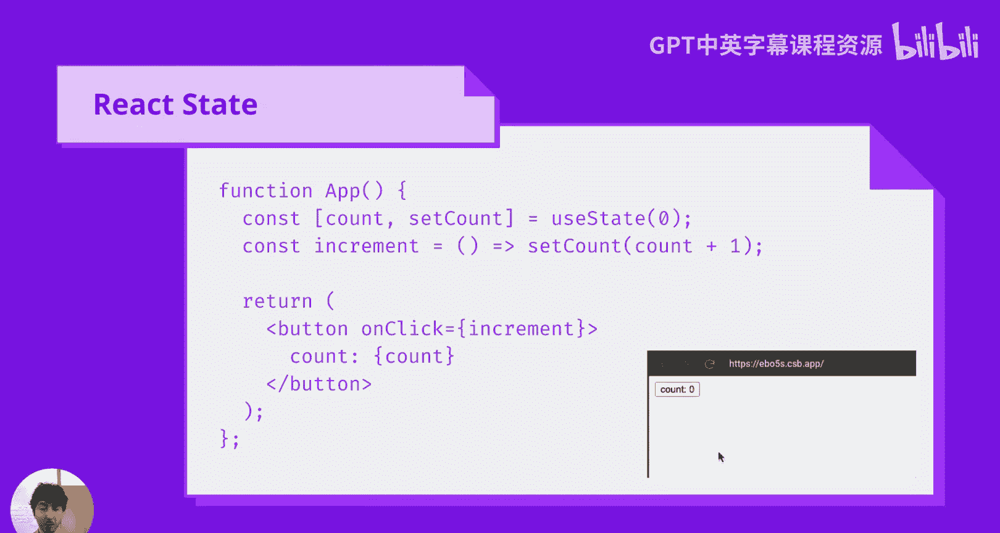
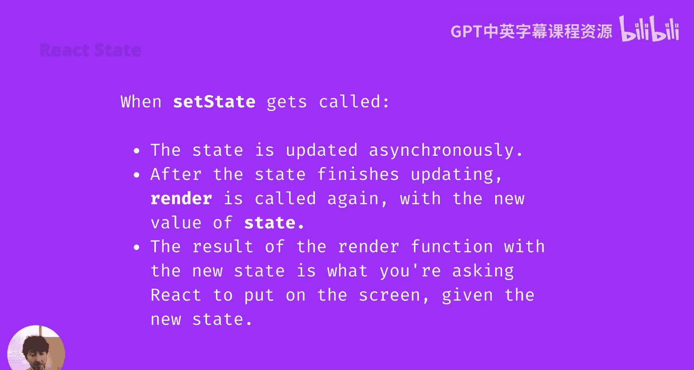
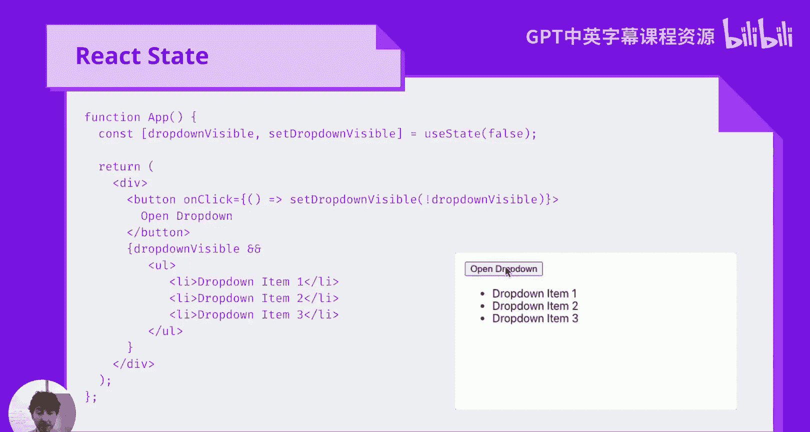
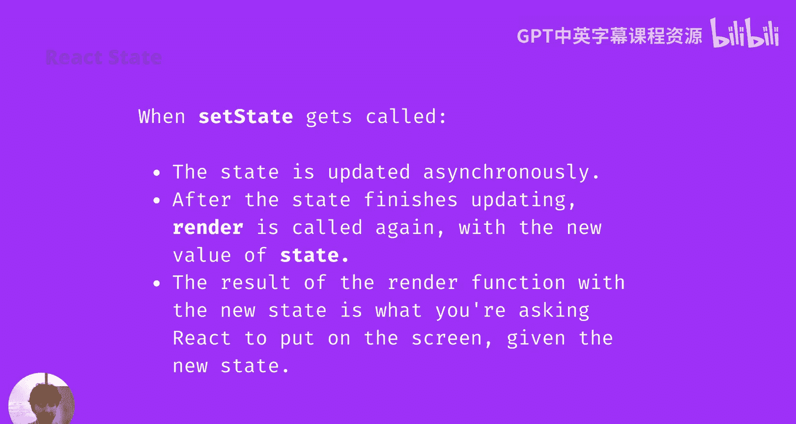
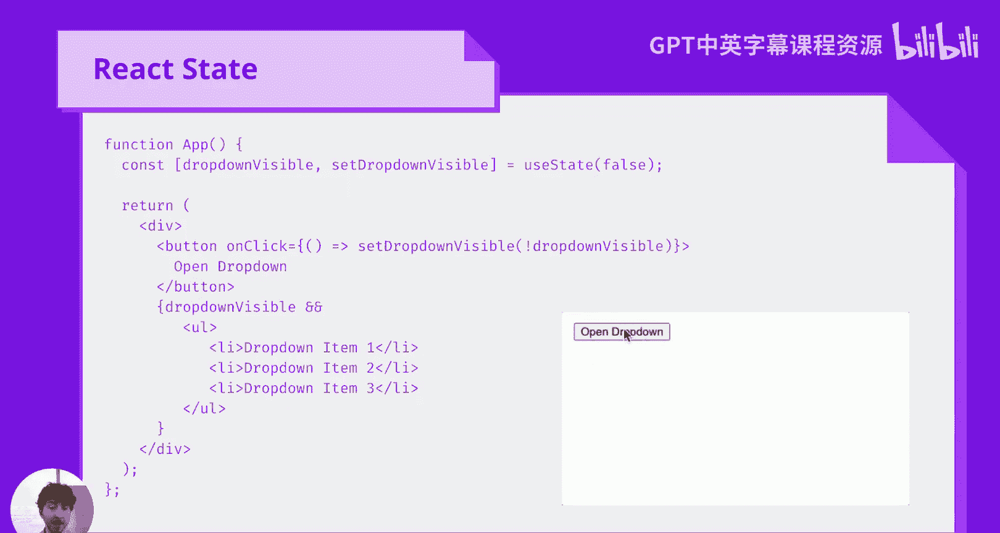
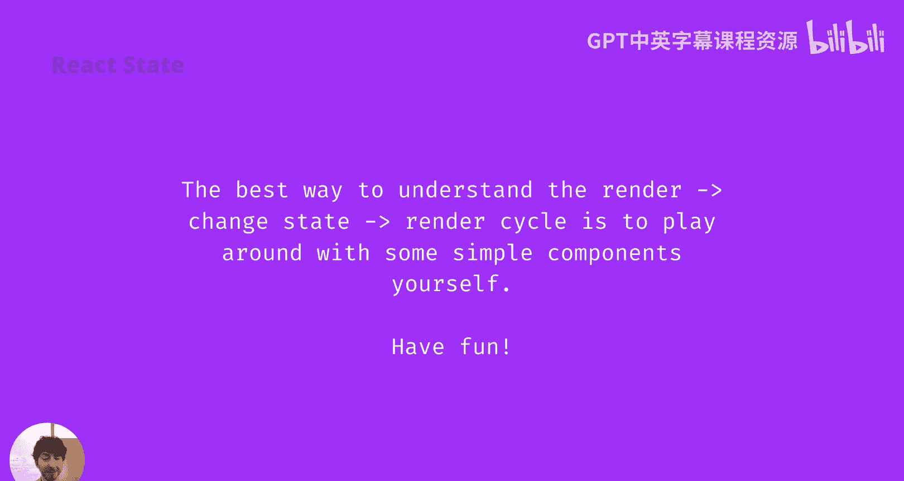

# 前端编程：第52-53讲：ReactJS 💥 useState Hook

在本节课中，我们将要学习React框架中一个核心概念：状态（State）。我们将探讨如何使用`useState` Hook来管理组件内部的数据，以及状态变化如何驱动用户界面的更新。

我们已经掌握了如何声明要在屏幕上显示的UI，也理解了React如何高效地对比UI的变化，并将这些变化应用到真实的DOM中，以最小化布局成本。然而，要构建一个真正像React一样工作的框架，还缺少一个关键部分：我们如何告诉React数据发生了变化，从而需要重新生成组件并对比新旧状态？



答案是，在React中，只有一种方式可以触发UI更新。

## 触发UI更新的唯一方式：React状态

React状态是React内部的一个子系统，它允许我们告知React哪些数据会影响用户界面的呈现方式。

### 基础示例：计数器

以下是一个标准的函数式组件示例：



```jsx
function App() {
  const [count, setCount] = useState(0);
  const increment = () => setCount(count + 1);
  return (
    <button onClick={increment}>
      {count}
    </button>
  );
}
```

我们来分解这段代码：
*   `useState(0)`：我们调用`useState`函数，并传入初始值`0`。
*   `count`：`useState`返回的第一个值是状态的当前值，初始为`0`。
*   `setCount`：`useState`返回的第二个值是一个函数，用于更新状态。
*   `increment`：这是一个简单的函数，它调用`setCount`将`count`的值增加1。
*   组件返回一个按钮，点击时调用`increment`函数，并将当前的`count`值显示在按钮内部。

### 内部工作原理

当我们点击按钮时，`count`状态会增加。这会导致函数组件被再次执行。第一次执行和第二次执行的结果，构成了React将要进行对比的两个虚拟DOM树。





React通过对比发现，外层的`<button>`元素没有变化，因此不会从真实DOM中删除它。但是，React能识别出按钮内部的文本内容发生了变化，因此会重新渲染按钮的文本内容。



### 关于`setState`的重要细节

理解`setState`的工作方式有几个关键点：
1.  **状态更新是异步的**：当你调用`setState`时，状态不会立即更新，而是要等到JavaScript事件循环的下一个周期才会更新。
2.  **组件重新渲染**：状态更新完成后，我们的渲染函数（即函数组件）会被再次调用。
3.  **获取新状态值**：在这次调用中，`useState`将返回更新后的状态值。

React使用新旧状态值来生成两个虚拟DOM树并进行对比。一旦计算出需要进行的更改，React就会将这些更改应用到真实的UI上。

## 进阶示例：下拉菜单

上一节我们介绍了基础的计数器，本节中我们来看看一个更强大、更贴近实际应用的例子：一个简单的下拉菜单。

```jsx
function App() {
  const [dropdownVisible, setDropdownVisible] = useState(false);
  return (
    <div>
      <button onClick={() => setDropdownVisible(!dropdownVisible)}>
        Open Dropdown
      </button>
      {dropdownVisible && (
        <ul>
          <li>Dropdown Item 1</li>
          <li>Dropdown Item 2</li>
          <li>Dropdown Item 3</li>
        </ul>
      )}
    </div>
  );
}
```

以下是代码解析：
*   `useState(false)`：我们使用一个布尔值作为状态的初始值，命名为`dropdownVisible`。
*   `setDropdownVisible`：这是用于更新该状态的函数。
*   按钮的`onClick`事件调用`setDropdownVisible(!dropdownVisible)`，这会将状态在`true`和`false`之间切换。
*   我们使用JavaScript的短路求值语法：`{dropdownVisible && (...)}`。这意味着只有当`dropdownVisible`为`true`时，才会继续渲染右侧的`<ul>`列表。

这个组件实现了一个基本的下拉菜单功能：
*   初始时，`dropdownVisible`为`false`，因此列表不会渲染。
*   点击按钮后，`dropdownVisible`变为`true`，列表随之显示。
*   再次点击按钮，状态变回`false`，列表消失。

使用声明式框架的优势在于，我们永远不会陷入“忘记从DOM中移除下拉菜单内容”或“菜单的打开/关闭状态与实际DOM不同步”的困境。通过查看这段代码，我们可以保证只有两种可能的UI状态，而React会负责处理它们之间的所有过渡。



## 总结

本节课中我们一起学习了React的核心概念——状态管理。我们了解到：
*   在React中，**状态（State）是触发UI更新的唯一方式**。
*   我们使用 **`useState` Hook** 来在函数组件中声明和更新状态。
*   状态更新是**异步**的，会触发组件的**重新渲染**。
*   React通过对比新旧虚拟DOM树，**高效地更新真实DOM**。
*   通过声明式的编程方式（如示例中的下拉菜单），我们可以清晰地定义UI与状态的关系，避免手动操作DOM带来的错误。



理解“渲染 -> 改变状态 -> 再次渲染”这个极其简单、灵活且强大的循环的最佳方式，就是亲自尝试构建一些简单的组件。你可以模拟下拉菜单、计时器等有趣的功能。多动手实践，并享受其中的乐趣。