# 前端编程：第7周：ReactJS入门演示 🚀


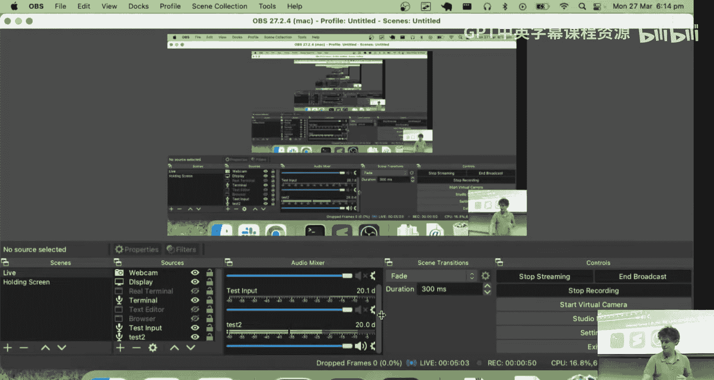


在本节课中，我们将学习ReactJS的基础知识。我们将通过构建一个简单的Web应用，来对比React与之前学习的原生JavaScript在开发方式上的不同。本节课的核心是理解React的声明式编程模型、状态管理以及JSX语法。

---

## 概述

React是一个用于构建用户界面的JavaScript库。它采用声明式编程范式，允许开发者通过描述“UI应该是什么样子”来构建应用，而React负责处理UI的更新。本节课我们将通过重构第4周的原生JavaScript应用，来直观地感受React的工作方式。

---

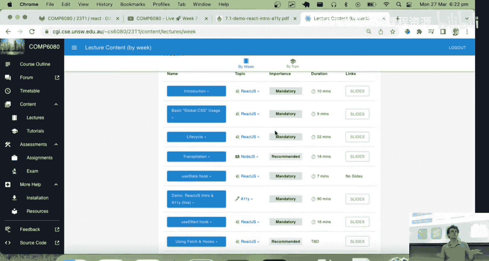

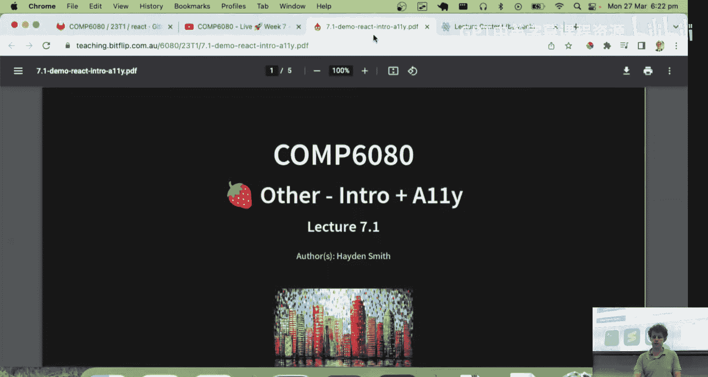


## 环境设置与项目结构

上一节我们介绍了React的基本概念，本节中我们来看看如何设置一个React开发环境。

首先，我们可以使用官方命令创建一个新的React应用：
```bash
npx create-react-app my-app
```
这将创建一个包含所有必要依赖和配置的项目。

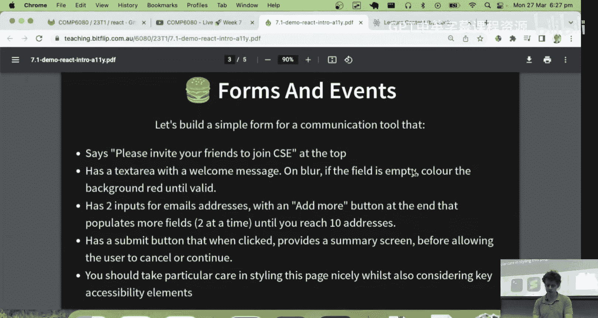

为了与本课程内容保持一致，我们也可以使用一个预先配置好的起始代码仓库。克隆后，运行以下命令安装依赖并启动开发服务器：
```bash
npm install
npm start
```
`npm start` 会启动一个热重载开发服务器。这意味着你对代码的任何修改都会立即被检测到，React会重新编译代码并刷新页面。

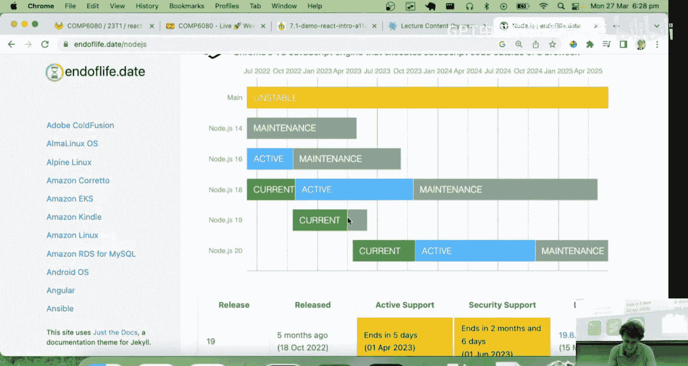

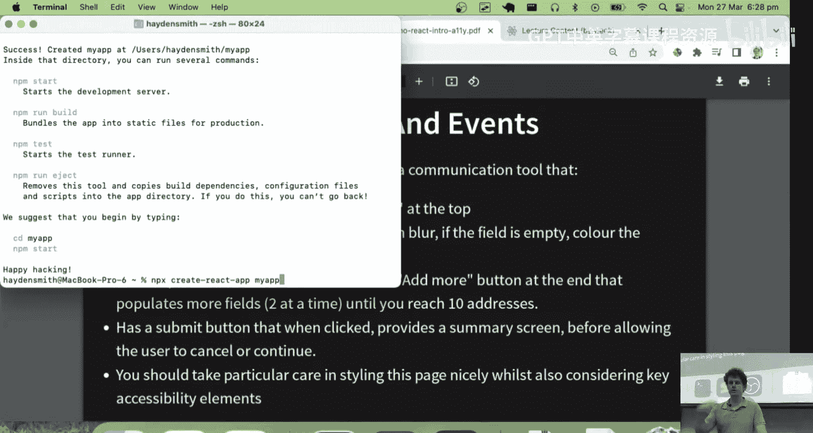

**核心概念**：React项目中的代码（通常写在 `.jsx` 或 `.js` 文件中）并不是浏览器直接运行的。React有一个编译步骤，会将我们编写的JSX代码转换成标准的JavaScript和HTML。你可以通过查看网页源代码来确认这一点，你会看到一个被压缩的 `bundle.js` 文件，其中包含了所有运行应用所需的代码。

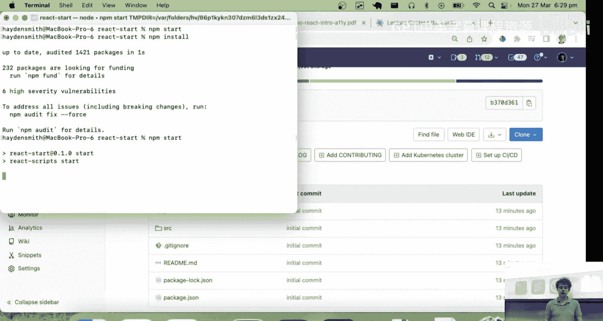

---

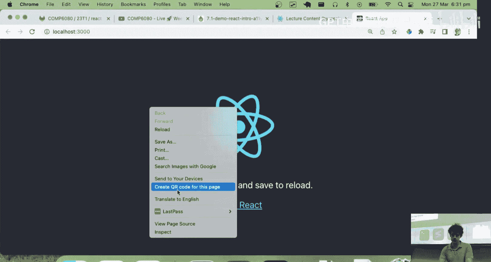

## 理解JSX与基础渲染

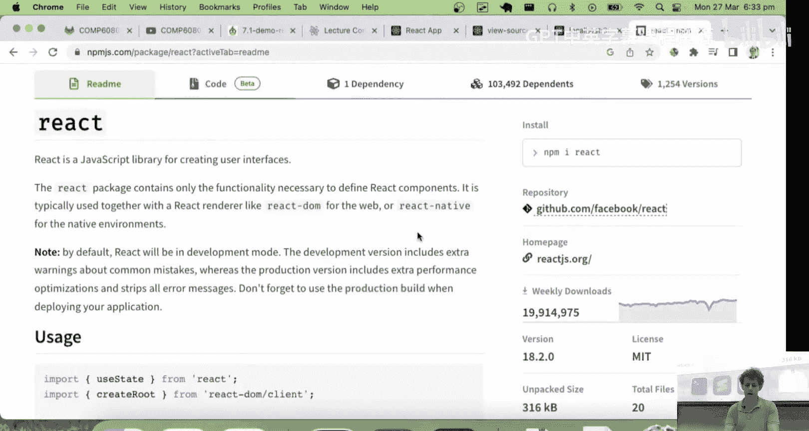

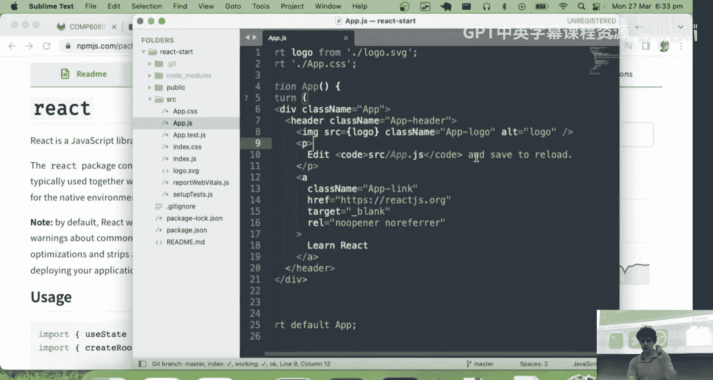

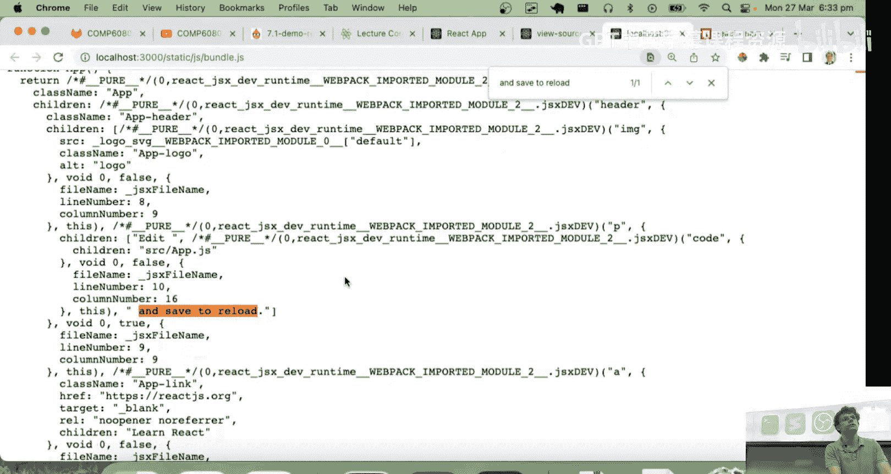

现在我们已经有了运行中的项目，让我们来看看React代码的核心部分。

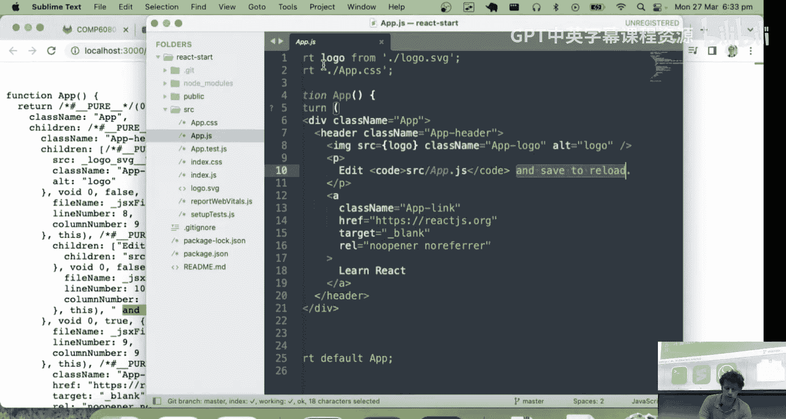

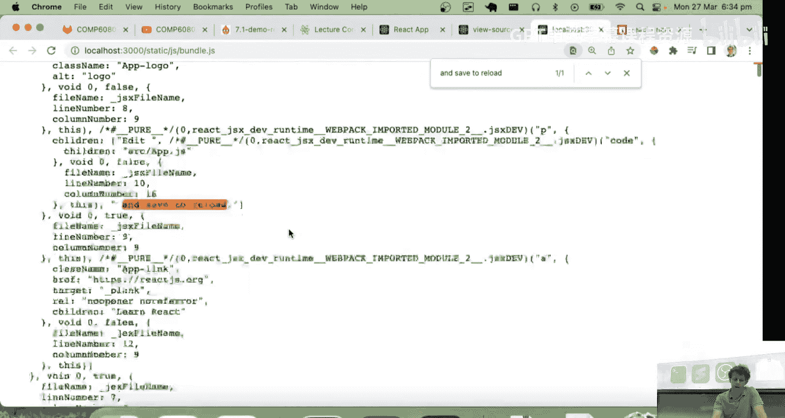

打开 `src/App.js` 文件，你会看到类似HTML和JavaScript混合的代码，这被称为JSX。JSX是JavaScript的语法扩展，它允许我们在JavaScript代码中编写类似HTML的结构。

**核心概念**：在React中，一个组件本质上是一个函数，这个函数返回一些描述UI的JSX。例如，一个简单的组件可能如下所示：
```jsx
function App() {
  return (
    <div>
      <h1>Hello, COMP6080!</h1>
    </div>
  );
}
```
这个 `App` 函数返回的JSX最终会被React转换成真实的DOM元素并渲染到页面上。

---

## 状态管理与事件处理

理解了基础渲染后，我们来看看React如何管理动态数据，即“状态”。

在原生JavaScript中，我们通过直接操作DOM来更新页面内容。在React中，我们采用不同的模式：我们定义“状态”，描述状态如何更新，以及UI如何根据状态进行渲染。React会自动处理中间的更新逻辑。

让我们通过一个计数器例子来理解：

1.  **定义状态**：我们使用 `useState` 钩子来创建一个状态变量。
    ```jsx
    const [number, setNumber] = React.useState(1);
    ```
    这里，`number` 是当前的状态值（初始为1），`setNumber` 是用于更新这个状态的函数。

2.  **根据状态渲染UI**：在JSX中，我们可以直接使用状态变量。
    ```jsx
    <div>Number: {number}</div>
    ```

3.  **通过事件更新状态**：我们为按钮绑定点击事件，事件处理函数调用 `setNumber` 来更新状态。
    ```jsx
    <button onClick={() => setNumber(number - 1)}>Minus</button>
    <button onClick={() => setNumber(number + 1)}>Plus</button>
    ```
    当状态 `number` 更新时，React会检测到变化，并自动重新调用组件函数，使用新的 `number` 值来更新UI。

**核心概念**：你永远不要直接修改状态变量（如 `number = number + 1`），必须通过React提供的更新函数（如 `setNumber`）来进行。这是React能够跟踪变化并高效更新UI的关键。

---

## 构建表单：受控组件

掌握了状态管理后，我们来构建一个更复杂的例子：一个表单输入框。

在React中，表单元素通常被处理为“受控组件”。这意味着表单元素的值由React状态控制，而不是由DOM自身管理。

以下是实现步骤：

1.  **为输入值创建状态**：
    ```jsx
    const [textArea, setTextArea] = React.useState('');
    ```

2.  **将输入框的值绑定到状态**：
    ```jsx
    <textarea value={textArea} />
    ```

3.  **监听输入变化并更新状态**：
    ```jsx
    <textarea
      value={textArea}
      onChange={(event) => setTextArea(event.target.value)}
    />
    ```
    每次用户输入，`onChange` 事件被触发，我们调用 `setTextArea` 用新的输入值更新状态。状态更新导致组件重新渲染，输入框显示新的值。

这种模式确保了React状态是表单数据的“唯一来源”。

---

## 条件渲染与样式动态应用

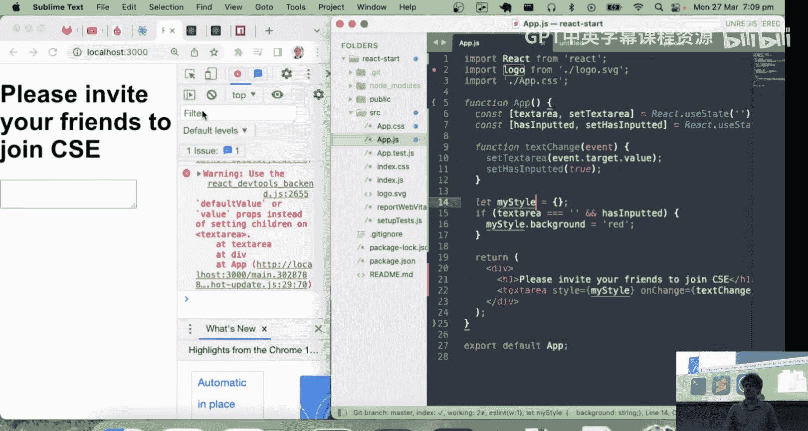


现在，让我们为表单添加一些交互逻辑：如果文本框为空，则背景显示为红色。

这展示了React的另一个强大特性：我们可以根据状态轻松地条件化渲染内容或应用样式。


**动态样式示例**：
```jsx
const myStyle = {
  background: textArea === '' ? 'red' : 'white'
};

<textarea style={myStyle} ... />
```
这里，我们根据 `textArea` 状态是否为空字符串，来决定背景色样式对象。

**条件渲染示例**：我们也可以控制整个元素的显示与隐藏。
```jsx
{showModal && <div>This is a modal!</div>}
```
只有 `showModal` 状态为 `true` 时，模态框的 `div` 才会被渲染到页面上。

---


## 列表渲染与动态添加项目

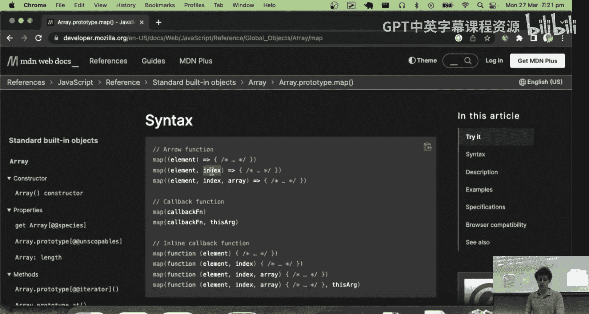

许多应用需要渲染列表数据。React 使得渲染动态列表变得非常直观。

假设我们有一个电子邮件地址列表需要渲染，并且可以添加更多输入框。

1.  **使用状态管理列表**：
    ```jsx
    const [emailList, setEmailList] = React.useState(['', '']);
    ```

2.  **使用 `map` 方法渲染列表**：
    ```jsx
    {emailList.map((email, index) => (
      <div key={index}>
        <input value={email} onChange={...} />
      </div>
    ))}
    ```
    我们使用数组的 `map` 方法遍历 `emailList`，为每个邮箱地址返回一个输入框。`key` 属性帮助React高效识别哪些项被改变、添加或删除。

3.  **添加新项目**：要添加新的输入框，我们需要更新状态。重要的是，我们应该创建一个新的数组，而不是修改原数组。
    ```jsx
    const addEmail = () => {
      setEmailList([...emailList, '']); // 使用扩展运算符创建包含新项的新数组
    };
    ```
    然后，我们可以条件化地显示“添加更多”按钮：
    ```jsx
    {emailList.length < 10 && <button onClick={addEmail}>Add More</button>}
    ```

---

## 组件化与代码组织

随着应用变复杂，将UI拆分为独立、可复用的部分至关重要。这就是“组件化”。

在React中，组件就是一个返回JSX的函数。我们可以将一大块JSX提取出来，变成一个独立的组件。

**示例**：
```jsx
function Header() {
  return <h1>My Application Header</h1>;
}

function App() {
  return (
    <div>
      <Header /> {/* 使用自定义的 Header 组件 */}
      ...其他内容...
    </div>
  );
}
```
通过将UI拆分为小的、专注于单一功能的组件，代码会变得更易于管理、测试和复用。我们将在后续课程中深入探讨组件和属性（Props）。

---

## 总结

本节课中我们一起学习了ReactJS的核心基础。我们了解了：

*   **声明式UI**：通过描述状态与UI的对应关系来构建应用。
*   **JSX**：一种允许在JavaScript中编写HTML结构的语法。
*   **状态管理**：使用 `useState` 钩子来定义和更新组件内部的状态，并通过事件处理函数触发状态更新。
*   **核心模式**：受控组件、条件渲染、列表渲染。
*   **组件化思想**：将UI拆分为独立、可复用的部分。


React通过其状态驱动和组件化的模型，为构建复杂、交互式的Web界面提供了一套强大而高效的范式。虽然初学时的概念和语法可能有些陌生，但一旦掌握，它将极大地提升开发效率和代码可维护性。在接下来的课程和作业中，我们将继续探索React更高级的特性。